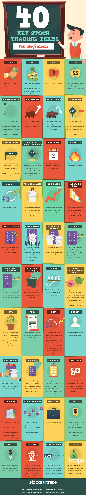

# Module 13: Stocks

## BUSE 120 Canvas Notes

### 13.2 About Stocks

#### Stock Basics

Buying a stock is buying ownership in a company. As an owner of a company's
stock, you own a portion of the assets of the company and you are entitled to a
portion of the profits that the company produces. The profits come in the form
of dividends and capital gains.

The link below will bring you to some basic information about stocks provided by
the [📄 Financial Industry Regulatory Authority (FINRA)](http://www.finra.org/).

- [📄 Stock Basics from FINRA](https://www.finra.org/investors/learn-to-invest/types-investments/stocks/stock-basics)

#### Measures of Stock Value

As we saw in the reading for this module, there are a number of ways to measure
the value of a stock. For example, one can judge the value of a stock based on
the characteristics of the company that issued it, such as the company's
products or services and customer base. Perhaps the most common and useful way
is to calculate the Price-to-Earnings Ratio (P/E). The video below is a short
description of the P/E Ratio, provided by [📄 Motley
Fool](https://www.fool.com/) Co-founder David Gardner.

- [📺 What Is a P/E Ratio? - The Motley Fool Investing Basics](https://www.youtube.com/watch?v=H8ADgtm04uE)

#### Stock Trading Terms

News about the stock market often uses terms that we don't hear in other walks
of life. Understanding these terms is the first step to understanding more about
how the stock market operates. The infographic below (from Jeff Desjardins
published in [📄 Business Insider](https://www.businessinsider.com/) on 2/22/17)
can help you to decipher these terms. Please look through it and save it for
future use if you think it will be helpful, then move on to the next page in
this module.

### More Information About Stocks

#### Internet Resources

There are lots of resources on the Internet to help you learn more about stocks.
Here are a few links that you might be interested in:

1. [📄 Marketwatch Stock Ticker Lookup
   Page](https://www.marketwatch.com/tools/quotes/lookup.asp). A database and
   search tool for stock ticker symbols. Most of the time you need the stock
   ticker symbol to find information about it from other sources.
2. [📄 FINRA Stocks webpage](http://www.finra.org/investors/stocks). Information
   about types of stock, stock splits, volatility, and other topics.
3. [📄 FINRA Equities and
   Options](http://finra-markets.morningstar.com/MarketData/EquityOptions/default.jsp).
   Information on individual stocks, including their historical performance and
   other characteristics. (You'l need the stock ticker symbol to look up stock
   information on this page.)

#### Selecting Individual Stocks

If you're pursuing an active investment management strategy and want to choose
the specific companies that you buy stock in, there are some basic
characteristics that you probably should look for. These are described in the
short article below from [📄 The Motley Fool](https://www.fool.com/) that was
published in the San Diego Union-Tribune on October 22, 2017. (Remember that
research indicates passive management on average generates better returns for
individual investors than active management.)

 

# Resources

- [📄 Financial Industry Regulatory Authority (FINRA)](http://www.finra.org/)
- [📄 Stock Basics from FINRA](https://www.finra.org/investors/learn-to-invest/types-investments/stocks/stock-basics)
- [📄 Motley Fool](https://www.fool.com/)
- [📺 What Is a P/E Ratio? - The Motley Fool Investing Basics](https://www.youtube.com/watch?v=H8ADgtm04uE)
- [📄 Business Insider](https://www.businessinsider.com/)
- [📄 Marketwatch Stock Ticker Lookup Page](https://www.marketwatch.com/tools/quotes/lookup.asp)
- [📄 FINRA Stocks webpage](http://www.finra.org/investors/stocks)
- [📄 FINRA Equities and Options](http://finra-markets.morningstar.com/MarketData/EquityOptions/default.jsp)
- [📄 The Motley Fool](https://www.fool.com/)

BUSE 120 Canvas Notes

- Dr. Duane Short

Textbook

+ [⬇ BUSE 120 Full Textbook](file:../../../../../files/fall-2020/BUSE-120/textbook_full.pdf)
  - Chapter 15

