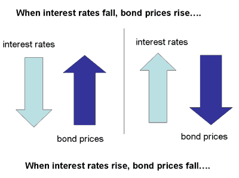
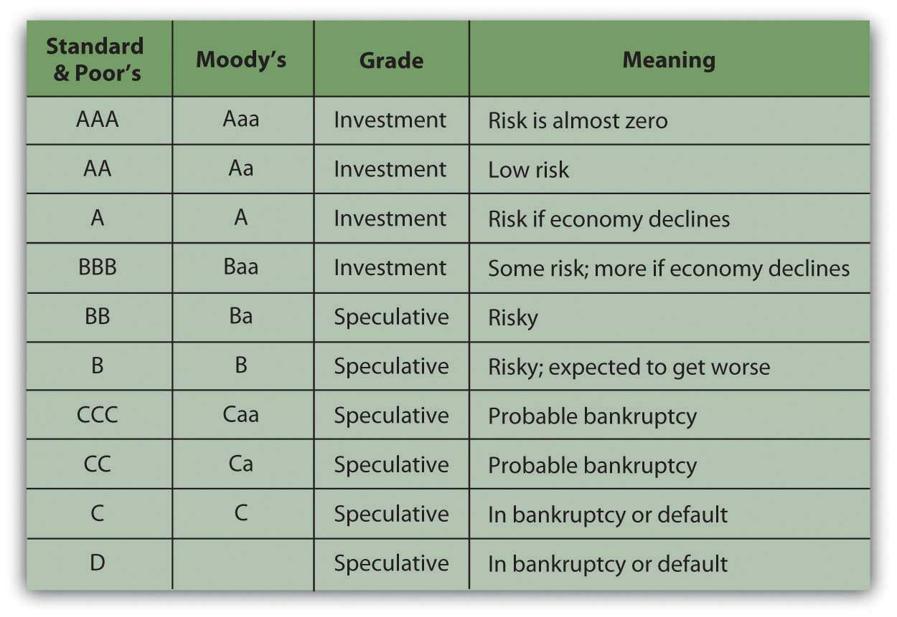
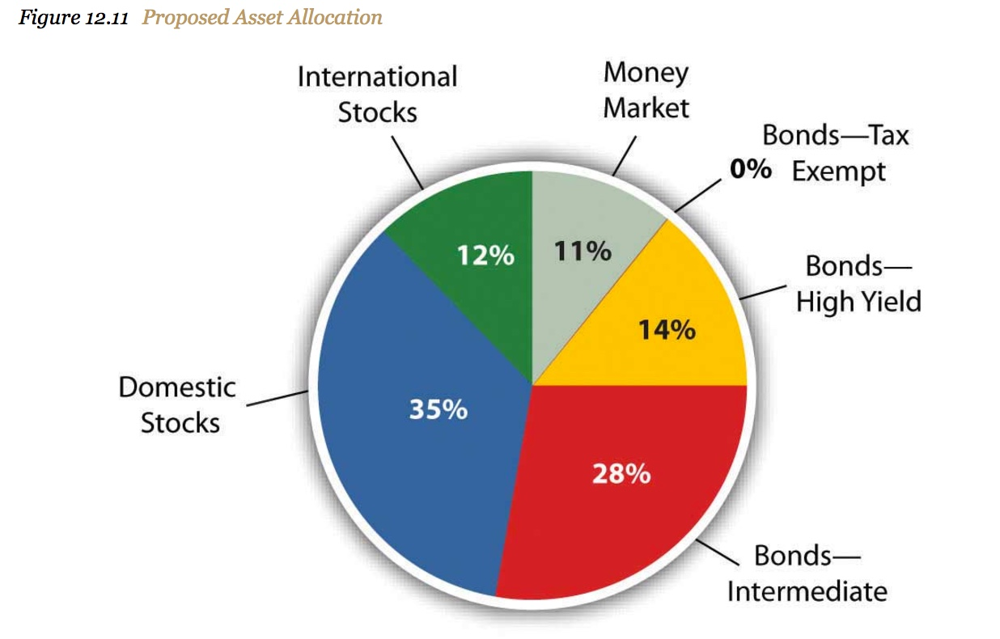

# Module 14: Bonds

## BUSE 120 Canvas Notes

### 14.2 About Bonds

#### Bond Basics

A bond is a loan an investor makes to a corporation, government, federal agency
or other organization in exchange for interest payments over a specified term
plus repayment of principal at the bond's maturity date. Bonds are different
than stocks because a stock provides ownership in a company while a bond is a
loan to a company (or other organization).

The link below will bring you to some basic information about bonds provided by
the [📄 Financial Industry Regulatory Authority (FINRA)](http://www.finra.org/).

- [📄 Bond Basics from FINRA](http://www.finra.org/investors/bond-basics)

#### Types of Bonds

Bonds can be categorized based on their issuing source, the collateral used to
secure them, and other characteristics. The are often classified based on their:

- Issuing source (federal government, municipality, corporation, etc.)
- Credit quality of the issuer
- Length of time until maturity.
- [📄 Types of Bonds from FINRA](http://www.finra.org/investors/types-bonds)

### 14.3 Bond Values and Ratings

#### Bond Value

If you buy a bond when it is first issued, you pay what is called "par value."
This is the amount of money that was actually "rented" to the issuer of the bond
and it's the amount of money that the issuer must pay back when the bond
matures. However, the current price of a bond might be more or less than the par
value. This is because the value of the annual interest that the bond generates
(the "coupon") might be worth more or less than it was at the time when the bond
was issued. Why would it be worth more or less? One reason is because of
interest rates: When interest rates rise, bond prices fall and vice-versa. For
example, let's say that last year you bought a bond with a 5% coupon for
\$1,000. This year, interest rates have fallen so the same company is issuing
new bonds with a 4% coupon for \$1,000. Your bond will be worth more than the
new bonds, because yours generates 5% per year of interest while the new ones
only generate 4% per year of interest. Therefore, you could sell your bond to
someone else for more than the \$1,000 you originally paid for it. In other
words, the price of your bond went up because interest rates went down. (The
reverse is true as well of course - when interest rates go up, bond prices go
down.)

#### Bond Ratings

Changes in interest rates are one of the most significant influences on bond
value. However, there are many other factors that affect bond prices as well.
For example, the creditworthiness of the bond issuer affects the value of that
issuer's bonds. For this reason bonds are "rated" by various companies to
determine their level of quality. The higher the bond rating, the more likely it
is that the issuer will pay back the money that was "rented" and therefore the
higher that bond is worth. Bond ratings usually consist of a series of letters,
numbers, and symbols. More letters and letters that are higher in the alphabet
mean a higher-quality bond. The graphic below (from our textbook) is a useful
guide to the ratings. You can also visit the link below to learn more about bond
ratings.

- [📄 Bond Ratings from Investopedia](https://www.investopedia.com/walkthrough/corporate-finance/3/bonds/ratings.aspx)

#### Other Information about Bonds

You can get more information about bonds at the following links:

- [📄 Bonds webpage from FINRA](http://www.finra.org/investors/bonds)
  * Information about bond funds and risks, a glossary of bond terms, and other
    topics.
- [📄 Bond Market Data Center from FINRA](http://finra-markets.morningstar.com/BondCenter/Default.jsp)
  * Current yield and other characteristics of specific bonds.

### 14.4 Asset Allocation

In an earlier module we learned about the concept of diversification, which is
the practice of spreading out one's investment among several different classes
of assets. Diversification is intended to reduce risk while maintaining
investment returns, because the risk is "spread out" among different types of
assets. The idea is that if asset goes down in value, that loss will be
"cushioned" by the other assets that do not go down in value. (Of course, the
opposite is also true, so if one type of asset goes up in value, the others may
not.)

As described in our textbook, diversification can happen at the capital
allocation level (how much money to invest vs. save as cash or cash
equivalents), the asset allocation level (the mix of assets classes to invest
in), and the security selection level (which specific assets to purchase). Often
the biggest decision about diversification happens at the asset allocation
level. This is because we often start with a clear idea about how much money we
will invest (the capital allocation level) and we also can easily obtain
diversification in security selection by investing in mutual funds, ETFs, or by
following an indexing strategy.

Because it's such a major decision, many companies offer advice or tools to help
us decide the appropriate asset allocation mix for our individual situation. For
example, someone who is just starting out investing in their 20s might allocate
most of their investment to stocks and other more risky investments while
someone who is retired might allocate most of their investment to bonds or other
less risky investments. An example of an asset allocation mix (from the
textbook) appears below.

- [📺 What Is Asset Allocation? | Financial Terms](https://www.youtube.com/watch?v=7TIK1VqGPdw)

 

# Resources

- [📄 Financial Industry Regulatory Authority (FINRA)](http://www.finra.org/)
- [📄 Bond Basics from FINRA](http://www.finra.org/investors/bond-basics)
- [📄 Types of Bonds from FINRA](http://www.finra.org/investors/types-bonds)
- [📄 Bond Ratings from Investopedia](https://www.investopedia.com/walkthrough/corporate-finance/3/bonds/ratings.aspx)
- [📄 Bonds webpage from FINRA](http://www.finra.org/investors/bonds)
- [📄 Bond Market Data Center from FINRA](http://finra-markets.morningstar.com/BondCenter/Default.jsp)
- [📺 What Is Asset Allocation? | Financial Terms](https://www.youtube.com/watch?v=7TIK1VqGPdw)

BUSE 120 Canvas Notes

- Dr. Duane Short

Textbook

+ [⬇ BUSE 120 Full Textbook](file:../../../../../files/fall-2020/BUSE-120/textbook_full.pdf)
  - Chapter 16

