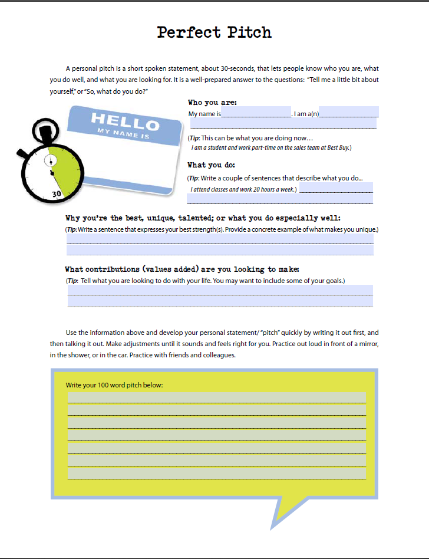

# Module 15: A Quarterly Version of the Financial Workbook

## BUSE 120 Canvas Notes

### 16.2 Managing Your Career

Unless you've inherited a lot of money, the vast majority of your income is
likely to come from selling your labor - that is, from working. The choices you
make in your career, therefore, are instrumental to your overall financial
wellbeing (and also to your wellbeing in other areas of your life). This course
is basically about how to manage your money after you've earned it. However,
it's at least equally as important to manage the process of earning your money;
in other words, to manage your career.

The link below is an article by [📄 Scott Mautz](https://scottmautz.com/)
published in the San Diego Union-Tribune on April 22, 2018. I think it has some
great general advice that applies to virtually any job. Please read through the
article and then continue on with this page.

- [📄 Timeless Success Tips](Timeless Success Tips)

Career planning is way too broad a topic to cover in one module. In fact, you
could take an entire course on just that topic. Our reading for this module
covered the basic process of choosing, finding, and leaving a job. There are a
few points in this process that I'll emphasize in the next few module pages.

### 16.3 Career Exploration

#### Your Career Interests

If you're not already in a career field (or if you are in one but want to make a
change), it's important to do some exploration to determine what kind of career
would be best for you. Ideally, you want a career that combines three things:

1. Something you love to do
2. Something you can do well
3. Something someone will pay for you to do

Many people start their career exploration with the first of these - by
determining their career interests. The link below will bring you to an
inventory (a type of test with no right or wrong answers) that will help you
assess your "work personality type." This inventory and its personality
categories are used widely in the field of career planning. Please take the
inventory, read about your results, and research more on the [📄 California
CareerZone](https://www.cacareerzone.org/) website if you wish.

- [📄 Interest Profiler from California CareerZone](https://www.cacareerzone.org/ip/)

#### Your Skills

The second component of finding your ideal career is to determine what you do
well. This area of your career is often developed very slowly over time:
Typically people progress from job to job in the same career field or a set of
related career fields, learning and becoming more skilled with each job. So if
you're just starting out in life, you may not do anything very well yet (sorry).
But going to college or getting other kinds of initial training and education is
an important first step.

It might also be helpful for you to explore the types of skills used in various
kinds of jobs to see which ones you possess (or are interested in learning). The
link below will bring you to a "skills profiler" from California CareerZone.
Please take the profiler, read about your results, explore the website more if
you would like, and then return and continue with the next topic on this page.

- [📄 Skills Profiler from California CareerZone](https://www.cacareerzone.org/skills/)

#### Career Options

The third component of finding your ideal career is to find something that
someone is willing to pay for you to do. Basically this means finding a career
field that makes you employable. As we learned in the reading, the labor market
is the place where people sell their labor to employers. Because labor is valued
at different levels, jobs may be easier or harder to find - and may pay more or
less - based on how many people are available in the labor pool. If there are a
lot of people willing and able to do the job, the pay will be lower. If there
are not many people who can do the job (or who want to), the pay will be higher.

The link below will bring you to the [📄
CareerOneStop](https://www.careeronestop.org/) website provided by the [📄 U.S.
Department of Labor](https://www.dol.gov/).  On the main homepage there are a
set of links for different kinds of job seekers (young adults, veterans, people
with disabilities, etc.). Please click on the link that most closely matches
yourself and then explore the resources to learn more about career fields and
options that might be appropriate for your situation and stage in life. Feel
free to explore other parts of the "CareerOneStop" as well, of course. After
you're done exploring the website, please return and continue with the next
topic on this page.

- [📄 CareerOneStop Resources](https://www.careeronestop.org/)

#### More Info About Careers

If you're interested in exploring more information about careers, please check
out the following links:

- [📄 California CareerZone website](https://www.cacareerzone.org/index)
  * Sponsored by the [📄 California Community College](http://cccco.edu/)
    system, this website includes information about careers in various industry
    sectors, salary information, and inventories related to career exploration.
- [📄 O-Net website](https://www.onetonline.org/)
  * Detailed information about occupations and career fields.
- [📄 My Next Move](https://www.mynextmove.org/)
    * Searchable and browsable career information webpage.

### 16.4 Networking and the Personal Pitch

Did you know that most people find their jobs through networking? That means
they hear about the job through a person rather than via a job listing or other
source. In fact, 70-80% of jobs are never advertised online or in print! So when
searching for a job, it's important to let others know what you can do and what
type of position you are looking for. This type of communication is sometimes
called a "personal pitch." It's used not only in job searches but also in
business development, finding clients, networking within an industry, etc.

The link below is a worksheet that you can fill out to help develop your own
personal pitch. It's a great idea to do this if you plan to be looking for a
job, because it can really help as a way to introduce yourself to others in a
short period of time. It's also the most appropriate way to answer one of the
most common first questions in an interview: "Tell me about yourself."

[📺 30 Second Elevator Pitch](https://www.youtube.com/watch?v=4WEQtgnBu0I)

The video below is an example of what a personal pitch looks like. Notice how
quick it is (around 30 seconds). For this reason it's often called an "elevator
pitch" because it's something you can deliver in the time it takes to ride in an
elevator between floors. When you're done watching the video please continue to
the next page in this module.

### 16.5 Putting it All Together

I feel like we covered a lot of ground in this class: Financial statements,
budgets, savings, debt, insurance, retirement, investments, and more. I imagine
it might feel a little overwhelming if this is your first exposure to personal
finance. I sometimes feel the same way myself!

That said, my opinion is that managing your personal finances does not really
need to be that difficult or time consuming. Sure, once in a while you'll need
to make some big decisions such as which insurance policy to buy or how to
invest your retirement savings. But most of the time you can set up your
personal finances on "automatic pilot" and just check in periodically (like once
a week or once a month) to see how things are going. I think the more
convenient, simple, and organized you make your personal finances the easier it
will be to keep them running well and on track.

I heard a podcast about personal finance a while ago that interested me so much
that I bought the book it featured. The book is called "The Index Card: Why
Personal Finance Doesn't Have to Be Complicated" by Helaine Olen and Harold
Pollack (Links to an external site.). Pollack is a professor who wrote down some
personal finance principles he derived from research he conducted for his own
personal financial situation. The principles fit on just one index card (thus
the name). If you're feeling a little overwhelmed by the content in this course
and just want some basic, practical advice about how to manage your money then
the advice on this card and/or the book may be of interest to you. Here are the
principles and a copy of the card:

1. Strive to save 10 to 20 percent of your income.
2. Pay your credit card balance in full every month.
3. Max out your 401(k) and other tax-advantaged savings accounts.
4. Never buy or sell individual stocks.
5. Buy inexpensive, well-diversified mutual funds and exchange-traded funds.
6. Make your financial advisor commit to the fiduciary standard.
7. Buy a home when you are financially ready.
8. Insurance - Make sure you're protected.
9. Do what you can to support the social safety net.
10. Remember the index card.

The short video below from [📄 National Public Radio
(NPR)](https://www.npr.org/) is about "the index card."

[📺 All the financial advice you'll ever need fits on a single index card](https://www.youtube.com/watch?v=JdUKhgW1gOo)

 

# Resources

- [📄 Scott Mautz](https://scottmautz.com/)
- [📄 Timeless Success Tips](Timeless Success Tips)
- [📄 California CareerZone](https://www.cacareerzone.org/)
- [📄 Interest Profiler from California CareerZone](https://www.cacareerzone.org/ip/)
- [📄 Skills Profiler from California CareerZone](https://www.cacareerzone.org/skills/)
- [📄 CareerOneStop](https://www.careeronestop.org/)
- [📄 U.S. Department of Labor](https://www.dol.gov/)
- [📄 CareerOneStop Resources](https://www.careeronestop.org/)
- [📄 California CareerZone website](https://www.cacareerzone.org/index)
- [📄 California Community College](http://cccco.edu/)
- [📄 O-Net website](https://www.onetonline.org/)
- [📄 My Next Move](https://www.mynextmove.org/)
- [📺 30 Second Elevator Pitch](https://www.youtube.com/watch?v=4WEQtgnBu0I)
- [📄 National Public Radio (NPR)](https://www.npr.org/)
- [📺 All the financial advice you'll ever need fits on a single index card](https://www.youtube.com/watch?v=JdUKhgW1gOo)

BUSE 120 Canvas Notes

- Dr. Duane Short

Textbook

+ [⬇ BUSE 120 Full Textbook](file:../../../../../files/fall-2020/BUSE-120/textbook_full.pdf)
  - Chapter 18

