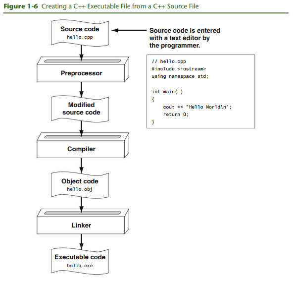

# Chapter 1: Introduction to Computers and Programming

## Textbook

### 1.3 Programs and Programming Languages

Sample C++ input, process, output program

> Program 1-1

```cpp
// This program calculates the user's pay.
#include <iostream>
using namespace std;

int main()
{
  double hours, rate, pay;

  // Get the number of hours worked.
  cout << "How many hours did you work? ";
  cin >> hours;

  // Get the hourly pay rate.
  cout << "How much do you get paid per hour? ";
  cin >> rate;

  // Calculate the pay.
  pay = hours * rate;

  // Displaly the pay.
  cout << "You have earned $" << pay << end1;
  return 0;
}
```

**Program Output with Example Input Shown in Bold**
<pre>
How many hours did you work? <b>10[Enter]</b>
How much do you get paid per hour? <b>15[Enter]</b>
You have earned $150
</pre>

#### Programming Languages

In a broad sens, there are two categories of programming languages: _low level_
and _high_level_. **Low-level language** is close to the level of the computer,
which means it resembles the numeric machine language of the computer more than
the natural language of humans. The easiest languages for people to learn are
**high-level languages**. They are "high level" because they are closer to the
level of human-readability than computer-readability.

C++ is a widely used language because, in a addition to the high-level features
necessary for writing applications such as payroll systems and inventory
programs, it also has many low-level features. **C++ is based on the C
language**, which was invented for purposes such as writing operating systems
and compilers. Because C++ evolved from C, it carries all of C's low-level
capabilities with it.

C++ is also popular because of its _portability_. This means that a C++ program
can be written on one type of computer and then run on many other types of
systems.

#### Source Code, Object Code, and Executable Code



<a name="integrated-development-environments-term">**Integrated Development Environments (IDE)**</a>

- These environments consists of a text editor, compiler, debugger, and other
  utilities integrated into a package with a single set of menus.


### 1.4 What is a Program Made of?

#### Language Elements

> Table 1-2 Programming Language Elements

| Language Element               | Description                                                                                                                                                 |
|--------------------------------|-------------------------------------------------------------------------------------------------------------------------------------------------------------|
| Key Words                      | Words that have a special meaning. Key worlds may only be used for their intended purpose. Key words are also known as reserved words.                      |
| Programmer-Defined Identifiers | Words or names defined by the programmer. They are symbolic names that refer to variables or programming routines.                                          |
| Operators                      | Operators perform operations on one or more operands. An operand is usually a piece of data, like a number.                                                 |
| Punctuation                    | Punctuation characters that mark the beginning or ending of a statement, or separate items in a list.                                                       |
| Syntax                         | Rules that must be followed when constructing a program. Syntax dictates how key words and operators may be used, and where punctuation symbols mus appear. |

<a name="variables-term">**Variables**</a>

- A _variable_ is a named storage location in the computer's memory for holding
  a piece of data. **Variables are symbolic names that represents locations in
  the computer's random access memory (RAM)**.


#### Lines and Statements

A **line** is just that--a single line as it appears in the body of a program.
Most of the lines contain something meaningful; however, some of the lines are
empty.

A **statement** is a complete instructions that causes the computer to perform
some action.


### The Programming Process

<a name="pseudocode-term">**Pseudocode**</a>

- Coding aids ignored by the compiler to help in writing algorithms. Similar to
  natural speaking language, yet close enough to programming language that it
  can be easily converted later into program source code.


1. Define what the program is to do.
2. Visualize the program running on the computer.
3. Use design tools to create a model of the program.
4. Check the models for logical errors.
5. Write the program source code.
6. Compile the source code.
7. Correct any errors found during compilation.
8. Link the program to create an executable file.
9. run the program using test data for input.
10. Correct any errors found while running the program.
11. Validate the results of the program.


## Videos

- [🎬 CISC 192 CPP Sections 1.1 - 1.3](https://www.youtube.com/watch?v=A0J3kgf-TLw)
- [🎬 CISC 192 CPP Section 1.4 What is a Program Made Of](https://www.youtube.com/watch?v=SsNzFXgggIg)
- [🎬 CISC 192 CPP Section 1.5 Purpose, Input, Processing, Output](https://www.youtube.com/watch?v=51uWnPDjIIE)
- [🎬 CISC 192 CPP Section 1.6 The Programming Process](https://www.youtube.com/watch?v=f_wvPJBeo-c)
- [🎬 CISC 192 CPP Section 1.7 Procedural and Object-Oriented Programming](https://www.youtube.com/watch?v=GhzTpLj4coA)


<br>

# Resources

- [🎬 CISC 192 CPP Sections 1.1 - 1.3](https://www.youtube.com/watch?v=A0J3kgf-TLw)
- [🎬 CISC 192 CPP Section 1.4 What is a Program Made Of](https://www.youtube.com/watch?v=SsNzFXgggIg)
- [🎬 CISC 192 CPP Section 1.5 Purpose, Input, Processing, Output](https://www.youtube.com/watch?v=51uWnPDjIIE)
- [🎬 CISC 192 CPP Section 1.6 The Programming Process](https://www.youtube.com/watch?v=f_wvPJBeo-c)
- [🎬 CISC 192 CPP Section 1.7 Procedural and Object-Oriented Programming](https://www.youtube.com/watch?v=GhzTpLj4coA)


Textbook

- Starting Out with C++: Early Objects by Tony Gaddis, Judy Walters, Godfrey
  Muganda

