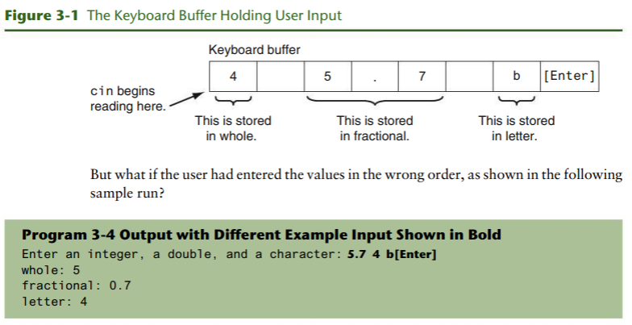
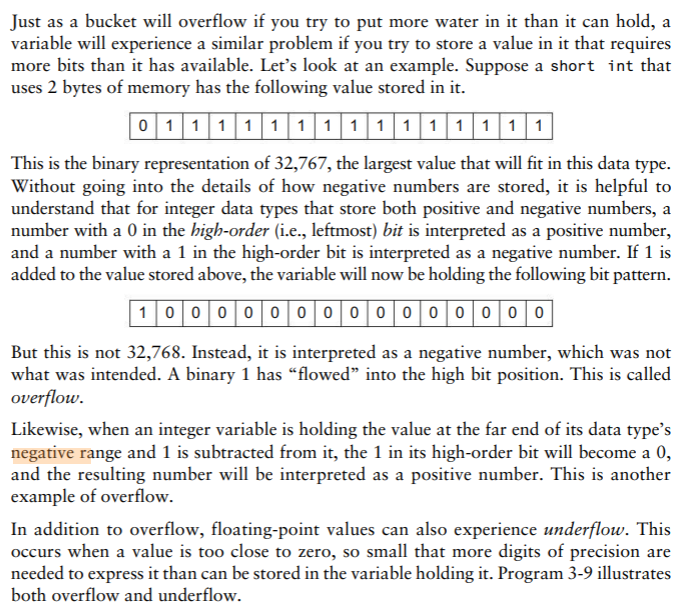
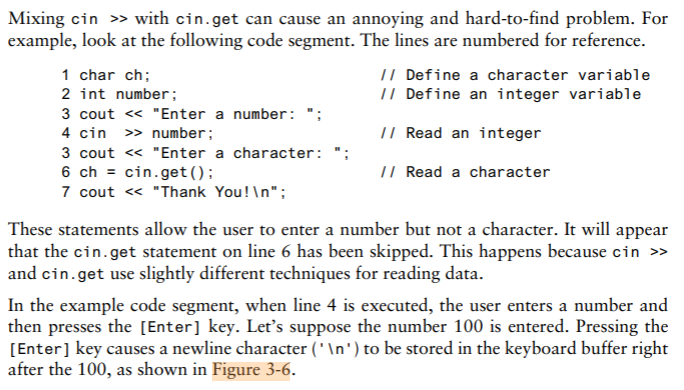
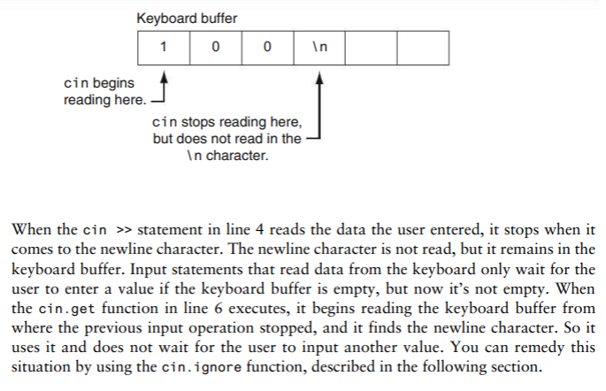
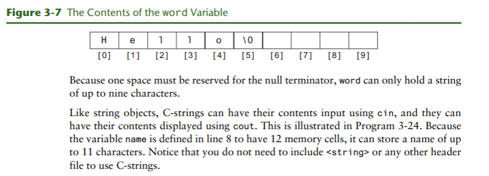
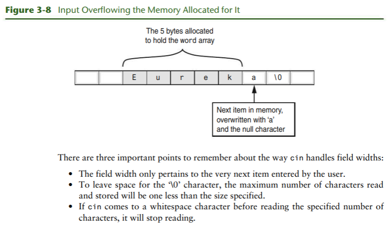

# Chapter 3: Expression and Interactivity

## Textbook

### 3.1 The `cin` Object

**CONCEPT:** `cin` can be used to read data typed at the keyboard.

> You can think of the word `cin` as meaning console **in**put. `#include
<iostream>` header file is required.

> Program 3-1

```cpp
// This program calculates and displays the area of a rectangle.
#include <iostream>
using namespace std;

int main()
{
  int length, width, area;

  cout << "This program calculates the area of a rectangle.\n";

  // Have the user input the rectangle's length and width
  cout << "What is the length of the rectangle? ";
  cin  >> length;
  cout >> "What is the width of the rectangle? ";
  cin  >> width;

  // Compute and display the area
  area = length * width;
  cout << "The area of the rectangle is " << area << endl;
  return 0;
}
```

The `>>` symbol is the _stream extraction operator_, which _extracts_
characters from the input stream so they can be used in the program.

#### Entering Multiple Values

> Program 3-3

```cpp
// This program calculates and displays the area of a rectangle.
#include <iostream>
using namespace std;

int main()
{
  int length, width, area;

  cout << "This program calculates the area of a rectangle.\n";

  // Have the user input the rectangle's length and width
  cout << "Enter the length and width of the rectangle ";
  cout << "separated by a space.\n";
  cin  >> length >> width;

  // Compute and display the area
  area = length * width;
  cout << "The area of the rectangle is " << area << endl;
  return 0;
}
```

> Program 3-4

```cpp
// This program demonstrates how cin can read multiple values
// of different data types.
#include <iostream>
using namespace std;

int main()
{
  int whole;
  double fractional;
  char letter;

  cout << "Enter an integer, a double, and a character: ";
  cin  >> whole >> fractional >> letter;

  cout << "whole: " << whole << endl;
  cout << "fraction: " << fractional << endl;
  cout << "letter: " << letter << endl;
  return 0;
}
```



### 3.2 Mathematical Expressions

**CONCEPT:** C++ allows you to construct complex mathematical expression using
multiple operators and grouping symbols

In Chapter 2 you were introduced to the basic mathematical operators, which are
used to build mathematical expression. An _expression_ is something that can be
evaluated to produce a single value.

Here are some additional assignment statements where the variable result is
being assigned the value of an expression.

```cpp
result = x;
result = 4;
result = 15 / 3;
result = 22 * number;
result = sizeof(int);
result = a + b + c;
```

> Program 3-5

```cpp
// This program displays the decimal value of a fraction.
#include <iostream>
using namespace std;

int main()
{
  double numerator, denominator;

  cout << "This program shows the decimal value of a fraction.\n";
  cin  >> numerator;
  cout << "Enter the denominator: ";
  cin  >> denominator;

  // Compute and display the decimal value
  cout << "The decimal value is " << (numerator / denominator) << endl;
  return 0;
}
```

#### Operator Precedence

**Table 3-1** Precedence of Arithmetic Operators (Highest to Lowest)

<center>

|             |        |                                                    |
|-------------|--------|----------------------------------------------------|
| `(  )`      |        | Expressions within parentheses are evaluated first |
| `-`         | unary  | Negation of a value, e.g., -6                      |
| `*   /   %` | binary | Multiplication, division, and modulus              |
| `+   -`     | binary | Addition and subtraction                           |

</center>

#### Associativity

**Table 3-3** Associativity of Arithmetic Operators

<center>

| Operator             | Associativity |
|----------------------|---------------|
| (unary negation) `-` | Right to left |
| `*   /   %`          | Left to right |
| `+   -`              | Left to right |

</center>

#### Grouping with parentheses

**Table 3-4** More Arithmetic Expression and Their Values

<center>

| Expression              | Value |
|-------------------------|-------|
| `(5 + 2) * 4`           | 28    |
| `10 / (5 - 3)`          | 5     |
| `8 + 12 * (6 - 2)`      | 56    |
| `(4 + 17) % 2 - 1`      | 0     |
| `(6 - 3) * (2 + 7) / 3` | 9     |

</center>

#### Converting Algebraic Expression to Programming Statements

**Table 3-5** Comparison of Algebraic and C++ Multiplication Expressions

<center>

| Algebraic Expression | Operation         | C++ Equivalent |
|----------------------|-------------------|----------------|
| 6B                   | 6 times B         | `6 * B`        |
| (3)(12)              | 3 times 12        | `3 * 12`       |
| 4xy                  | 4 times x times y | `4 * x  * y`   |

</center>

**Table 3-6** More Algebraic and C++ Expressions

<center>

| Agebraic Expression         | C++ Expression                  |
|-----------------------------|---------------------------------|
| $y = 3\frac{x}{2}$          | `y = x / 2 * 3;`                |
| $z = 3bc + 4$               | `z = 3 * b * c + 4;`            |
| $a = \frac{3x + 2}{4a - 1}$ | `a = (3 * x + 2) / (4 * a - 1)` |

</center>

**No Exponents Please!**. Use `pow()` function from the `cmath` C++ library
instead:

```cpp
area = pow(4.0, 2);
```

This mathematical expression can be interpreted as $4^{2}$

> Program 3-6

```cpp
// This program calculates the area of a circle. The formula for the
// area of a circle is PI times the radius squared. PI is 3.14159.
#include <iostream>
include <cmath>   // Needed for the pow function
using namespace std;

int main()
{
  double area, radius;

  cout << "This program calculates the area of a circle.\n";

  // Get the radius
  cout << "What is the radius of the circle? ";
  cin  >> radius;

  // Compute and display the area
  area = 3.14159 * pow(radius, 2);
  cout << "The area is " << area << endl;
  return 0;
}
```

### 3.3 Data Type Conversion and Type Casting

**CONCEPT:** Sometimes it is necessary to convert a value from one data type to
another. C++ provides ways to do this.

**Table 3-7** Data Type Ranking

<center>

|                          |
|--------------------------|
| `long double`            |
| `double`                 |
| `float`                  |
| `unsigned long long int` |
| `long long int`          |
| `unsigned long int`      |
| `long int`               |
| `unsigned int`           |
| `int`                    |

</center>

One exception to the ranking in Table 3-7 is when an int and a long int are the
same size. In that case, an unsigned int outranks a long int because it can
hold a higher value.

When C++ is working with an operator, it strives to convert the operands to the
same type. This implicit, or automatic, conversion is known as _type coercion_.
When a value is converted to a higher data type, it is said to be _promoted_. To
_demote_ a value means to convert it to a lower data type.

- **Rule 1:** `char`, `short`, and `unsigned short` values are automatically
  promoted to `int` values.

`char`, `short`, and `unsigned short` do not appear in Table 3-7 because anytime
values of these data types are used in a mathematical expression, thay are
automatically promoted to an int.

> The only exception to this rules is when an `unsigned short` holds a value
larger than can be held by an `int`. This can happen on systems where a `short`
is the same size as an `int`. In this case, the `unsigned short` is promoted to
`unsigned int`.

- **Rule 2:** When an operator works with two values of different data types,
  the lower-ranking value is promoted to the type of the higher-ranking value.

- **Rule 3:** When the final value of an expression is assigned to a variable,
  ti will be converted to the data type of that variable.

#### Type Casting

A _type cast expression_ lets you manually promote to demote a value. Its
general format is

```cpp
static_cast<DataType>(Value)
```

where _Value_ is a variable or literal value that you wish to convert and
_DataType_ is the data type you wish to convert it to.

```cpp
double number = 3.7;
int val;
val = static_cast<int>(number);
```

Type cast expression are useful in situations where C++ will not perform the
desired conversion automatically.

> Program 3-7

```cpp
// This program uses a type cast to avoid an integer division.
#include <iostream>
using namespace std;

int main()
{
  int    books,
         months;
  double booksPerMonth;

  // Get user inputs
  cout << "How many books do you plan to read? ";
  cin  >> books;
  cout << "How many months will it take you to read them? ";
  cin  >> months;

  // Compute and display books read per month
  booksPerMonth = static_cast<double>(books) / months;
  cout << "That is " << booksPerMonth << " books per month.\n";
  return 0;
}
```

> **WARNING!** To prevent the integer division from taking place, one of the
operands should be converted to a double prior to the division operation. This
forces C++ to automatically convert the value of the other operand to a double.

> Program 3-8

```cpp
// This program prints a character from its ASCII code.
#include <iostream>
using namespace std;

int main()
{
  int number = 65;

  // Display the value of the number variable
  cout << number << endl;

  // Use a type cast to display the value of number
  // converted to the char data type
  cout << static_cast<char>(number) << endl;
  return 0;
}
```

#### C-style and Prestandard C++ Type Cast Expressions

Even though the `static_cast` is the preferred type cast expression in use
today, C++ also supports two older forms that you should know about: The C-style
form and the prestandard C++ form.

**C-style form type cast**. This typecast notation is called _prefix notation_.

```cpp
booksPerMonth = (double)books / months;
```

**Prestandard C++ form type cast**. This typecast notation is called _functional
notation_.

```cpp
booksPerMonth = double(books) / months;
```


### 3.4 Overflow and Underflow

**CONCEPT:** When a value cannot fit in the number of bits provided by a
variable's data type, overflow or underflow occurs.



> Program 3-9

```cpp
// This program demonstrates overflow and underflow
#include <iostream>
using namespace std;

int main()
{
  // Set intVar to the maximum value a short int can hold
  short intVar = 32767;

  // Set floatVar to a number too small to fit in a float
  float floatVar = 3.0E-47;

  // Display intVar
  cout << "Original value of intVar       " << intVar << endl;

  // Add 1 to intVar to make it overflow
  intVar = intVar + 1;
  cout << "intVar after overflow          " << intVar << endl;

  // Subtract 1 from intVar to make it overflow again
  intVar = intVar - 1;
  cout << "intVar after 2nd overflow      " << intVar << endl;

  // Display floatVar
  cout << "Value of very tiny floatVar    " << floatVar;
  return 0;
}
```

> Program 3-9 Output

```
Original value of intVar      32767
intVar after overflow         -32768
intVar after 2nd overflow     32767
Value of very tiny floatVar   0
```


### 3.5 Named Constants

**CONCEPT:** Literals may be given names that symbolically represent them in a
program.

When a named constant is defined, it must be initialized with a value. It cannot
be defined and then later assigned a value with an assignment statement.

```cpp
const double INTEREST_RATE;     // illegal
INTEREST_RATE = 0.69;           // illegal
```

An added advantage of using named constants is that they make programs more
self-documenting. Once the named constant `INTEREST_RATE` has been correctly
defined, the program statement

```cpp
newAmount = balance * 0.69;
```

can be changed to read

```cpp
newAmount = balance * INTEREST_RATE;
```


### 3.6 Multiple and Combined Assignment

C++ allows you to assign a value to multiple variables at once

```cpp
a = b = c = d = 12;
```

#### Combined Assignment Operators

> Table 3-9 Combined Assignment Operators

<center>

| Operator | Example Usage | Equivalent To |
|----------|---------------|---------------|
| `+=`     | `x += 5;`     | `x = x + 5;`  |
| `-=`     | `y -= 2;`     | `y = y - 2;`  |
| `*=`     | `z *= 10;`    | `z = z *10;`  |
| `/=`     | `a /= b;`     | `a = a / b;`  |
| `%=`     | `c %= 3;`     | `c = c % 3;`  |

</center>

> Program 3-11

```cpp
// This program tracks the inventory of two widget stores.
// It illustrates the use of multiple and combined assignment.
#include <iostream>
using namespace std;

int main()
{
  int begInv,   // Beginning inventory for both stores
        sold,   // Number of widgets sold
      store1,   // Store 1's inventory
      store2;   // Store 2's inventory

  // Get the beginning inventory for the two stores
  cout << "One week ago, 2 new widget stores opened\n";
  cout << "at the same time with the same beginning\n";
  cout << "inventory. What was the beginning inventory? ";
  cin  >> begInv;

  // Set each store's inventory
  store1 = store2 = begInv;

  // Get the number of widgets sold at each store
  cout << "How many widgets has store 1 sold? ";
  cin  >> sold;
  store1 -= sold;     // Adjust store 1's inventory

  cout << "How many widgets has store 2 sold? ";
  cin  >> sold;
  store2 -= sold;     // Adjust store 2's inventory

  // Display each store's current inventory
  cout << "\nThe current inventory of each store:\n";
  cout << "Store 1: " << store1 << endl;
  cout << "Store 2: " << store2 << endl;
  return 0;
}
```


### 3.7 Formatting Output

**CONCEPT:** `cout` provides ways to format data as it is being displayed. This
affects the way data appears on the screen.

> Program 3-13

```cpp
// This program uses setw to display three rows of number so they align.
#include <iostream>
#include <iomanip>      // Header file needed to use setw
using namespace std;

int main()
{
  int num1 = 2897,  num2 = 5,     num3 = 837,
      num4 = 34,    num5 = 7,     num6 = 1623,
      num7 = 390,   num8 = 3456,  num9 = 12;

  // Display the first row of numbers
  cout << setw(6) << num1 << setw(6) << num2 << setw(6) << num3 <<endl;
  // Display the second row of numbers
  cout << setw(6) << num4 << setw(6) << num5 << setw(6) << num6 <<endl;
  // Display the third row of numbers
  cout << setw(6) << num7 << setw(6) << num8 << setw(6) << num9 <<endl;

  return 0;
}
```

> Program 3-13 Output

```
2897    5    837
  34    7   1623
 390  3456    12
```

A stream manipulator, `setw`, can be used to established print fields of
specified width.

**NOTE:** `#include <iomanip>` directive mus be included in any program that
uses `setw`.

#### The `setprecision` Manipulator

Floating-point values may be rounded to a number of _significant digits_ or
_precision_, which is the total number of digits that appear before and after
the decimal point.

> Program 3-15

```cpp
// This program demonstrates how the setprecision manipulator
// affects the way a floating-point value is displayed.
#include <iostream>
#include <iomanip>        // Header file needed to use setprecision
using namespace std;

int main()
{
  double number1 = 132.364, number2 = 26.91;
  double quotient = number1 / number2;

  cout << quotient << endl;
  cout << setprecision(5) << quotient << endl;
  cout << setprecision(4) << quotient << endl;
  cout << setprecision(3) << quotient << endl;
  cout << setprecision(2) << quotient << endl;
  cout << setprecision(1) << quotient << endl;
  return 0;
}
```

> Program 3-15 Output

```
4.91877
4.9188
4.919
4.92
4.9
5
```

#### The `fixed` Manipulator

Indicates that floating-point output should be printed in _fixed-point_, or
decimal, _notation_.

```cpp
cout << fixed;
```

With `fixed` and `setprecision` together

```cpp
cout << fixed << setprecision(2);
```

#### The `showpoint` Manipulator

By default, floating-point namers are displayed without trailing zeroes, and
floating-point numbers with no fractional part are displayed without a decimal
point. `showpoint` allows these defaults to be overridden.

```cpp
double x = 456.0;
cout << showpoint << x << endl
```

`fixed`, `showpoint`, and `setprecision` manipulators together

```cpp
double x = 456.0
cout << fixed << showpoint << setprecision(2) << x << endl;
```

> Program 3-17

```cpp
// This program illustrates the how the showpoint, setprecision, and
// fixed manipulators operate both individually and when used together.
#include <iostream>
#include <iomanip>      // Header file needed to use stream manipulators
using namespace std;

int main()
{
  double x = 6.0;

  cout << x << endl;
  cout << showpoint << x << endl;
  cout << setprecision(2) << x << endl;
  cout << fixed << x << endl;

  return 0;
}
```

> Program 3-17 Output

```
6
6.00000
6.0
6.00
```

#### The `left` and `right` Manipulators

These manipulators can be used with any type of value, even a string.

```cpp
// This program illustrates the use of the left and right manipulators.
#include <iostream>     // Header file needed to use stream manipulators
#include <iomanip>      // Header file needed to use string objects
#include <string>
using namespace std;

int main()
{
  string month1 = "January",
         month2 = "February",
         month3 = "March";

  int days1 = 31,
      days2 = 28,
      days3 = 31;

  double high1 = 22.6,
         high2 = 37.4,
         high3 = 53.9;

  cout << fixed << showpoint << setprecision(1);
  cout << "Month       Days     Heigh\n";

  cout << left  << setw(12) << month1
       << right << setw(4)  << days1 << setw(9) << high1 << endl;
  cout << left  << setw(12) << month2
       << right << setw(4)  << days2 << setw(9) << high2 << endl;
  cout << left  << setw(12) << month3
       << right << setw(4)  << days3 << setw(9) << high3 << endl;

  return 0;
}
```

> Program 3-18 Output

```
Month       Days     Heigh
January       31     22.6
February      28     37.4
March         31     53.9
```

**Table 3-12** Output Stream Manipulators

<center>

| Stream Manipulator | Description                                                                                                                 |
|--------------------|-----------------------------------------------------------------------------------------------------------------------------|
| `setw(n)`          | Sets minimum print field width of size `n` for the next value output.                                                       |
| `fixed`            | Displays floating-point numbers in fixed point (i.e., decimal) form.                                                        |
| `showpoint`        | Causes a decimal point and trailing zeroes to be displayed for floating-point numbers, even if there is no fractional part. |
| `setprecision(n)`  | Sets the precision of floating-point numbers.                                                                               |
| `left`             | Causes subsequent output to be left-justified.                                                                              |
| `right`            | Causes subsequent output to be right-justified.                                                                             |

</center>


### 3.8 Working with Characters and String

**CONCEPT:** Special functions exist for working with characters and strings.

#### Inputting a String

Although it is possible to use `cin` with the `>>` operator to input strings,
**it can cause problems you need to be aware of**. When `cin` reads data it
passes over and ignores any leading _whitespace_ characters (spaces, tabs, or
line breaks). However, once it comes to first nonblank character and starts
reading, it stops reading when it gets to the next whitespace character.

```cpp
int main()
{
  string name;
  string city;

  cout << "Please enter your name: ";
  cin  << name;
  cout << "Enter the city you live in: ";
  cin  >> city;
  cout << "Hello, " << name << endl;
  cout << "You live in " << city << endl;
  return 0;
}
```

To solve this problem, you can use C++ function called `getline`. This function
reads in an entire line, including leading and embedded spaces, and stores it in
a sting object

> Program 3-20

```cpp
// This program illustrates using the getline function
// to read character data into a string object.
#include <iostream>
#include <string>       // Header file needed to use string objects
using namespace std;

int main()
{
  string name;
  string city;

  cout << "Please enter your name: ";
  getline(cin, name);
  cout << "Enter the city you live in: ";
  getline(cin, city);

  cout << "Hello, " << name << endl;
  cout << "You live in " << city << endl;
  return 0;
}
```

#### Using `cin.get`

Becuase the get function is built into the `cin` object, we say that it is a
_member function_ of `cin`. The `get` member function reads a single character,
including any whitespace character. If the program needs to store the character
being read, the `get` member function can be called in either of the following
ways

```cpp
cin.get(ch);
ch = cin.get();
```

If the program is using the `get` function simply to pause the screen until the
[Enter] key is passed, and does not need to store the character

```
cin.get();
```

#### Mixing `cin >>` and `cin.get`




#### Using `cin.ignore`

The `cin.ignore` function tells the `cin` object to skip one or more characters
in the keyboard buffer. Here is its general form:

```cpp
cin.ignore(n, c);
```

The arguments shown in the parentheses are optional. If they are used, `n` is an
integer and `c` is a character. They tell `cin` to skip `n` number of
characters, or until the character `c` is encountered.

```cpp
cin.ignore(20, '\n');
```

#### Useful `string` Member Functions and Operators

If you want to know the length of the string that is stored in a string object,
you can call the object's length member function.

```cpp
string state = "New Jersey";
int size = state.length();
```

Another usefule member function is `assign`. One of the versions of this
function lets you assign a set of repeated characters to a string without having
to count the characters.

```cpp
spaces.assign(22, ' ');
```

The `string` class also has special operators for working with strings. One of
them is the `+` operator. This operator is used with string operands to
`concatenate` them, or join them together.

```cpp
string greeting1 = "Hello ",
       greeting2;

string word1     = "World";
string word2     = "People";

greeting2 = greeting1 + word;  // greeting2 now holds "Hello World"
greeting1 = greeting1 + word2; // greeting1 now holds "Hello People"
```

#### Using C-Strings

A group of contiguous 1-byte memory cells was set up to held them, with each
cell holding just one character of the string. A group of memory like this is
called an _array_

Here is a statement that defines word to be an array of characters that will
hold a C-string and initializes it to "Hello".

```cpp
char word[10] = "Hello";
```

The data type is specified first and then the variable name is given. The only
difference is the [10] that follows the name of the variable. This is called a
_size declarator_. It tells how many memory cells to set up to hold the
characters in the C-string.



#### Assigning a Value to a C-String

To assign a value to a C-string, use a function called `strcpy` (pronounced
string _copy_) to copy the contents of one string into another.

> Program 3-25

```cpp
// This program uses the strcpy function to copy one C-string to another
#include <iostream>
using namespace std;

int main()
{
  const int SIZE = 12;
  char name1[SIZE],
       name2[SIZE];

  strcpy(name1, "Sebastian");
  cout << "name1 now holds the string " << name1 << endl;

  strcpy(name2, name1);
  cout << "name2 now also holds the string " << name2 << endl;

  return 0;
}
```

#### Keeping Track of How Much a C-String Can Hold

The ones that don't fit will spill over into the following memory cells,
overwriting whatever was previously stored there. This type of error, known as a
_buffer overrun_ can lead to serious problems.

One way to prevent this from happening is to use the `setw` stream manipulator.
This manipulator, which we used earlier to format output, can also be used to
control the number of characters that `cin >>` inputs on its next read, as
illustrated here:

```cpp
char word[5];
cin >> setw(5) >> word;
```

Another way to do the same thing is by using the `cin` width function.

```cpp
char word[5];
cin.width(5);
cin >> word;
```

> Program 3-26

```cpp
// This program uses setw with the cin object
#include <iostream>
#include <iomanip>      // Header file needed to use stream manipulators
using namespace std;

int main()
{
  const int SIZE = 5;
  char word[SIZE];

  cout << "Enter a word: ";
  cin  >> setw(SIZE) >> word;
  cout << "You entered " << word << endl;

  return 0;
}
```

> Program 3-27

```cpp
// This program uses cin's width function.
#include <iostream>
#include <iomanip>      // Header file needed to use stream manipulators
using namespace std;

int main()
{
  const int SIZE = 5;
  char word[SIZE];

  cout << "Enter a word: ";
  cin.width(SIZE);
  cin >> word;
  cout << "You entered " << word << endl;

  return 0;
}
```



#### Reading a Line of Input

To read a line of input, for example, you must use `cin.getline` rather than
`getline`. Like `getline`, `cin.getline` allows you to read in  a string
containing spaces. It will continue reading until it has read the maximum
specified number of characters, or until the [Enter] key is pressed.

```cpp
cin.getline(sentence, 20);
```

> Program 3-28

```cpp
// This program demonstrates cin's getline function
// to read a line of text into a C-string.
#include <iostream>
using namespace std;

int main()
{
  const int SIZE = 81;
  char sentence[SIZE];

  cout << "Enter a sentence: ";
  cin.getline(sentence, SIZE);
  cout << "You entered " << sentence << endl;
  return 0;
}
```


### 3.9 More Mathematical Library Functions

**CONCEPT:** The C++ run-time library provides functions for performing complex
mathematical operations.

> **Table 3-13** cmath Library Functions

<center>

| Function  | Example          | Description                                                                                                                                                                                                                                                                            |
|-----------|------------------|----------------------------------------------------------------------------------------------------------------------------------------------------------------------------------------------------------------------------------------------------------------------------------------|
| abs       | `y = abs(x);`    | Returns the absolute value of the argument. The argument and the return value are integers.                                                                                                                                                                                            |
| cos       | `y = cos(x);`    | Returns the cosine of the argument. The argument should be an angle expressed in radians. The return type and the argument are doubles.                                                                                                                                                |
| exp       | `y = exp(x);`    | Computes the exponential function of the argument, which is x. The return type and the argument are doubles.                                                                                                                                                                           |
| fmod      | `y = fmod(x, z)` | Returns, as a double, the remainder of the first argument divided by the second argument. Works like the modulus operator, but the arguments are doubles. (The modulus operator only works with integers.) Do not pass zero as the second argument. This would cause division by zero. |
| log       | `y = log(x);`    | Returns the natural logarithm of the argument. The return type and the argument are doubles.                                                                                                                                                                                           |
| log10     | `y = log10(x);`  | Returns the base-10 logarithm of the argument. The return type and the argument are doubles                                                                                                                                                                                            |
| pow       | `y = pow(x, z);` | Returns the first argument raised to the power of the second one.                                                                                                                                                                                                                      |
| round     | `y = round(x);`  | Returns the floating-point argument passed to it rounded to the nearest whole number. The return value is an integer.                                                                                                                                                                  |
| sin       | `y = sin(x);`    | Returns the sine of the argument. The argument should be an angle expressed in radians. The return type and the argument are doubles.                                                                                                                                                  |
| sqrt      | `y = sqrt(x);`   | Returns the square root of the argument. The return type and argument are doubles. The argument must be zero or greater.                                                                                                                                                               |
| tan       | `y = tan(x);`    | Returns the tangent of the argument. The argument should be an angle expressed in radians. The return type and the argument are doubles.                                                                                                                                               |

</center>

With the exception of the abs and round functions, all of the functions listed
in Table 3-13 take one or more `double` arguments and return a `double` value.
However, most C++ compilers allow them to be called with `int` arguments as
well.

> Program 3-29

```cpp
// This program inputs the lengths of the two sides of a right
// triangle, then calculates and displays the length of the hypotenuse.
#include <iostream>
#include <cmath> // Header file needed to use the sqrt function
using namespace std;

int main()
{
  double a, b, c;
  // Get the length of the two sides
  cout << "Enter the length of side a: ";
  cin  >> a;
  cout << "Enter the length of side b: ";
  cin  >> b;

  // Compute and display the length of the hypotenuse
  c = sqrt(pow(a, 2.0) + pow(b, 2.0));

  cout << "The length of the hypotenuse is ";
  cout << c << endl;
  return 0;
}
```


### 3.10 Random Numbers

**CONCEPT:** C++ offers a set of functions to generate and work with random
numbers.

> Program 3-31

```cpp
// This program demonstrates using random numbers when a
// "seed" is provided for the random number generator.
#include <iostream>
#include <cstdlib>        // Header file needed to use srand and rand
using namespace std;

int main()
{
  unsigned seed;          // Random generator seed

  // Get a "seed" value from the user
  cout << "Enter a seed value: ";
  cin  >> seed;

  // Set the random generator seed before calling rand()
  srand(seed);

  // Now generate and print three random numbers
  cout << rand() << "        " ;
  cout << rand() << "        " ;
  cout << rand() << endl;

  return 0;
}
```

#### Limiting the Range of a Random Number

The general formula to this is:

```cpp
number = (rand() % (maxValue - minValue + 1)) + minValue;
```


### 3.11 Focus on Debugging: Hand Tracing a Program

_Hand tracing_ is a debugging process where you pretend that you are the
computer executing a program. You step through each of the program’s statements
one by one.  As you look at a statement, you record the contents that each
variable will have after the statement executes. This process is helpful in
finding mathematical mistakes and other logic errors.

### 3.12 Green Fields Landscaping Case Study--Part 1

> Program 3-34

```cpp
// This program is used by Green Fields Landscaping to compute the
// number of cubic yards of mulch a customer needs and its price.
#include <iostream>
#include <iomanip>
using namespace std;

const double PRICE_PER_CUBIC_YD = 22.00;

int main()
{
  double squareFeet; // square feet of land to be covered
  int depth;         // inches deep the mulch is to be spread
  double cubicFeet,  // number of cubic feet of mulch needed
  cubicYards,        // number of cubic yards of mulch needed
  totalPrice;        // total price for all the cubic yards ordered

  // Get inputs
  cout << "Number of square feet to be covered with mulch: ";
  cin  >> squareFeet;
  cout << "Number of inches deep: ";
  cin  >> depth;

  // Perform calculations
  cubicFeet = squareFeet * (depth / 12.0);
  cubicYards = cubicFeet / 27;
  totalPrice = cubicYards * PRICE_PER_CUBIC_YD;

  // Display outputs
  cout << "\n Number of cubic yards needed: " << cubicYards << endl;
  cout << fixed << showpoint << setprecision(2);
  cout << "Price per cubic yard: $" << setw(7)
       << PRICE_PER_CUBIC_YD << endl;
  cout << "Total price:           $" << setw(7)
       << totalPrice << endl << endl;

  return 0;
}
```

### 3.13 Trying It All Together: Word Game

> Program 3-35

```cpp
// This program uses strings to play a word game.
#include <iostream>
#include <string>
using namespace std;

int main()
{ // Stored strings
  string s1 = "There once was a person named ",
         s2 = " who lived in ",
         s3 = "\nand who loved ",
         s4 = ". At the age of ",
         s5 = ", ",
         s6 = " graduated \nfrom high school and went to work in a ",
         s7 = " factory.\n",
         s8 = " got married and had ",
         s9 = " children and a pet ",
         s10= " named ",
         s11= ".\nEvery weekend the family and ",
         s12= " had fun ",
         s13= " together.";

  // Values input by the user
  string name, city, activity, animal, product, petName;
  int age, kids;

  cout << "Enter the following information and I\'ll "
       << "tell you a story.\n\n";
  cout << "Your name: ";
  getline(cin, name);

  cout << "The name of a city: ";
  getline(cin, city);

  cout << "A physical activity (e.g. jogging, playing baseball): ";
  getline(cin, activity);

  cout << "An animal: ";
  getline(cin, animal);

  cout << "A food or product you can buy: ";
  getline(cin, product);

  cout << "An adjective noun (e.g. blue car): ";
  getline(cin, petName);

  cout << "A number between 10 and 50: ";
  cin  >> age;

  cout << "A number between 0 and 15: ";
  cin  >> kids;

  cout << endl << s1 << name << s2 << city << s3 << activity;
  cout << s4 << age << s5 << name << s6 << product << s7;
  cout << name << s8 << kids << s9 << animal << s10 << petName;
  cout << s11 << petName << s12 << activity << s13 << endl;

  return 0;
}
```


## Video Lectures

- [📺 CISC 192 Section 3.1 The cin object](https://www.youtube.com/watch?v=gSpzyhbwfyU)
- [📺 CISC 192 Section 3.2 Mathematical Functions](https://www.youtube.com/watch?v=Q0VV6PNlWCY)
- [📺 CISC 192 Section 3.3 Type Conversion](https://www.youtube.com/watch?v=VwuZMAc1Xwg)
- [📺 CISC 192 Section 3.4 Overflow and Underflow](https://www.youtube.com/watch?v=TOfMyXxGfUw)
- [📺 CISC 192 Section 3.5 Type Casting](https://www.youtube.com/watch?v=Zmxt5mjT1GU)
- [📺 CISC 192 Section 3.6](https://www.youtube.com/watch?v=oMGlVevJ6VM)
- [📺 CISC 192 Section 3.7 Formatting Output](https://www.youtube.com/watch?v=xKbuKLIvuFw)
- [📺 CISC 192 Section 3.8 Working with Character Strings](https://www.youtube.com/watch?v=YmlitI4oujg)
- [📺 CISC 192 Section 3.9 More Mathematical Library Functions](https://www.youtube.com/watch?v=Y2DE00AC9tY)
- [📺 CISC 192 Section 3.10 Hand Tracing a Program (Debugging)](https://www.youtube.com/watch?v=ZsI9thpGLT8)

<br>

# Resources

- [📺 CISC 192 Section 3.1 The cin object](https://www.youtube.com/watch?v=gSpzyhbwfyU)
- [📺 CISC 192 Section 3.2 Mathematical Functions](https://www.youtube.com/watch?v=Q0VV6PNlWCY)
- [📺 CISC 192 Section 3.3 Type Conversion](https://www.youtube.com/watch?v=VwuZMAc1Xwg)
- [📺 CISC 192 Section 3.4 Overflow and Underflow](https://www.youtube.com/watch?v=TOfMyXxGfUw)
- [📺 CISC 192 Section 3.5 Type Casting](https://www.youtube.com/watch?v=Zmxt5mjT1GU)
- [📺 CISC 192 Section 3.6](https://www.youtube.com/watch?v=oMGlVevJ6VM)
- [📺 CISC 192 Section 3.7 Formatting Output](https://www.youtube.com/watch?v=xKbuKLIvuFw)
- [📺 CISC 192 Section 3.8 Working with Character Strings](https://www.youtube.com/watch?v=YmlitI4oujg)
- [📺 CISC 192 Section 3.9 More Mathematical Library Functions](https://www.youtube.com/watch?v=Y2DE00AC9tY)
- [📺 CISC 192 Section 3.10 Hand Tracing a Program (Debugging)](https://www.youtube.com/watch?v=ZsI9thpGLT8)

Textbook

- Starting Out with C++: Early Objects by Tony Gaddis, Judy Walters, Godfrey
  Muganda

