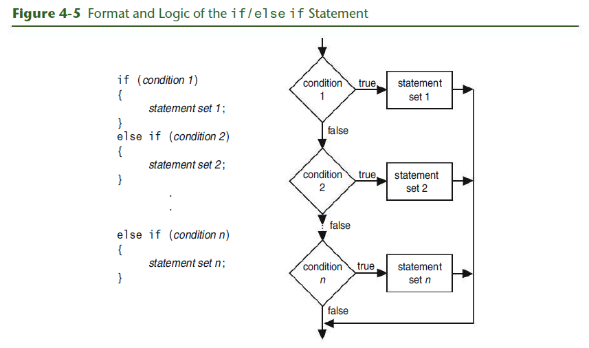
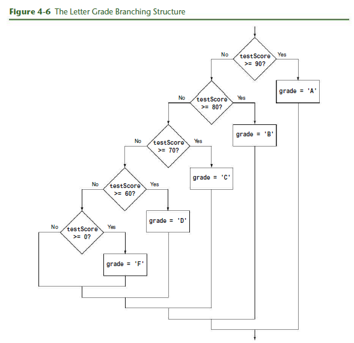

# Chapter 4: Making Decision

## Textbook

### 4.1 Relational Operators

**CONCEPT:** Relational operators allow you to compare numeric and char values
to determine whether one is greater than, less than, equal to, or not equal to
another.

> Program 4-1

```cpp
// This program displays the values C++ uses to represent true and false.
#include <iostream>
using namespace std;

int main()
{
  bool trueValue, falseValue;
  int x = 5, y = 10;

  trueValue = (x < y);
  falseValue = (y == x);

  cout << "True is " << trueValue << endl;
  cout << "False is " << falseValue << endl;
  return 0;
}
```

> Program 4-1 Output

```
True  is 1
False is 0
```

Let's examine the statements containing the relational expressions a little
closer:

```
trueValue = (x < y);
falseValue = (y == x);
```

These statements may seem odd because they are assigning the value of a
comparison to a variable. In the first statement, the variable `trueValue` is
being assigned the result of `x < y`.  Because x is less than y, the expression
is true, and the variable `trueValue` is assigned a nonzero value. In the second
statement, the expression `y == x` is false, so the variable `falseValue` is set
to 0.

When writing statements such as these, most programmers enclose the relational
expression in parentheses, as shown above, to make it clearer.

Parentheses are not actually required, however, because even without them the
relational operation is carried out before the assignment operation is
performed. This occurs because **relational operators have a higher precedence
than the assignment operator**. Likewise, arithmetic operators have a higher
precedence than relational operators.

The statement

```cpp
result = x < y - 8;
```

is equivalent to the statement

```cpp
result = x < (y - 8);
```

In both cases, `y - 8` is evaluated first.

**Table 4-3:** Statements that incude Relational Expressions (Assume `x` is
`10`, `y` is `7`, and `z` is an `int` or `bool`.)

| Stat |   |
|------|---|
|      |   |

| Statement                 | Outcome                                                  |
|---------------------------|----------------------------------------------------------|
| `z = x < y`               | z is assigned 0 because x is not less than y.            |
| `cout << (x > y);`        | Displays 1 because x is greater than y.                  |
| `z = (x >= y);`           | z is assigned 1 because x is greater than or equal to y. |
| `cout << (x <= y);`       | Displays 0 because x is not less than or equal to y.     |
| `z = (y != x);`           | z is assigned 1 because y is not equal to x.             |
| `cout << (x == (y + 3));` | Displays 1 because x is equal to y + 3.                  |

Relational operators also have a precedence order among themselves. The two
operators that test for equality or lack of equality (`==` and `!=`) have the
same precedence as each other.

**Table 4-4:** Precedence of Relational Operators (Highest to Lowest)

|             |
|-------------|
| `> >= < <=` |
| `== !=`     |


### 4.2 The `if` Statement

**CONCEPT:** the `if` statement can cause other statements to execute only under
certain conditions


The type of code in Figure 4-1 is called a _sequence structure_ because the
statements are executed in sequence, one after another, without branching off in
another direction. Programs often need more than one path of execution, however.
Many algorithms require a program to execute some statements only under certain
circumstances. This can be accomplished with a _decision structure_.

Because a decision structure determines which path, or branch, the program will
follow, it is sometimes referred to as a _branching structure_.


Notice that the statements inside the body of the `if` construct are contained
within a set of curly braces. This creates what C++ calls a _block_ and lets the
compiler know which statements are associated with the if.

> Program 4-2

```cpp
// This program correctly averages 3 test scores.
#include <iostream>
#include <iomanip>
using namespace std;

int main()
{
  int score1, score2, score3;
  double average;

  // Get the three test scores
  cout << "Enter 3 test scores and I will average them: ";
  cin >> score1 >> score2 >> score3;

  // Calculate and display the average score
  average = (score1 + score2 + score3) / 3.0;
  cout << fixed << showpoint << setprecision(1);
  cout << "Your average is " << average << endl;

  // If the average equals 100, congratulate the user
  if (average == 100)
  { cout << "Congratulations! ";
    cout << "That's a perfect score!\n";
  }
  return 0;
}
```

#### Programming Style and the `if` Statement

Even though `if` statements usually span more than one line, they are
technically one long statement. For instance, the following `if` statements are
identical except in style:

```cpp
if (a >= 100)
  cout << "The number is out of range.\n";


if (a >= 100) cout << "The number is out of range.\n";
```

#### Three Common Errors to Watch Out For

1. Misplaced semicolons
2. Missing braces
3. Confusing `=` with `==`

**Be Careful with Semicolons**

```cpp
if (condition)  // No smicolong goes here
{
  statement 1;  // Semicolon goes here
  statement 2;  // Semicolon goes here
}
```

**Don't Forget the Braces**

```cpp
if (average == 100)
  cout << "Congratulations! ";          // There are no braces needed for this line
  cout << "That's a perfect score;\n"   // This is outside the if
```

**Don't Confuse `==` With `=`**

```cpp
if (x = 2)                // Caution here!
  cout << "It is True!";
```

#### More about Truth

Here are the rules you have seen so far:

- When a relational expression is true, it has a nonzero value, which in most
  cases is represented by the value `1`.
- When a relational expression is false, it has the value `0`.
- An expression that has the value `0` is considered false by the if statement.
  This includes the `bool` value `false`, which is equivalent to `0`.
- An expression that has any value other than `0` is considered true. This
  includes the `bool` value `true`, which is equivalent to `1`.

```cpp
if (value)
  cout << "It is True!";

// This is equivalent to the statement

if (value != 0)
  cout << "It is True!";
```

#### Flags

A _flag_ is a variable that signals whether or not some condition currently
exists in a program. Because `bool` variables hold the values `true` and
`false`, they are the perfect type of variables to use for flags.

```cpp
bool salesQuotaMet = false;

if (sales >= QUOTA_AMOUNT)
  salesQuotaMet = true;
```
#### Integer Flags

Although a Boolean variable is normally used when a programmer wants to create a
flag, an integer variable may also be used.

```cpp
int salesQuotaMet = 0; // 0 means false

if (sales >= QUOTA_AMOUNT)
  salesQuotaMet = 1; // 1 means true
```


### 4.3 The `if/else` Statement

**CONCEPT:** The if/else statement executes one set of statements when the if
condition is true and another set when the condition is false.


> Program 4-3

```cpp
// This program uses the modulus operator to determine
// if a number is odd or even. If the number is evenly divisible
// by 2, it is an even number. A remainder indicates it is odd.
#include <iostream>
using namespace std;

int main()
{
  int number;

  cout << "Enter an integer and I will tell you if it\n";
  cout << "is odd or even. ";
  cin >> number;

  if (number % 2 == 0)
    cout << number << " is even.\n";
  else
    cout << number << " is odd.\n";
  return 0;
}
```

> Program 4-4

```cpp
// This program makes sure that the divisor is not
// equal to 0 before it performs a divide operation.
#include <iostream>
using namespace std;

int main()
{
  double num1, num2, quotient;

  // Get the two numbers
  cout << "Enter two numbers: ";
  cin  >> num1 >> num2;

  // If num2 is not zero, perform the division.
  if (num2 != 0)
  {
    quotient = num1 / num2;
    cout << "The quotient of " << num1 << " divided by "
         << num2 << " is " << quotient << ".\n";
  }
  else
  {
    cout << "Division by zero is not possible.\n";
    cout << "Please run the program again and enter "
         << "a number other than zero.\n";
  }
  return 0;
}
```

#### Comparing Floating-Point Numbers

Testing floating-point numbers for equality can sometimes give erroneous
results. Because of a lack of precision or round-off errors, a number that
should be mathematically equal to another might not be. In Program 4-5, the
number 6 is multiplied by 0.666667, a decimal version of 2/3. Of course, 6 times
2/3 is 4. The program, however, disagrees.


> Program 4-5

```cpp
// This program demonstrates how a lack of precision in
// floating-point numbers can make equality comparisons unreliable.
#include <iostream>
using namespace std;

int main()
{
  double result = .666667 * 6.0;

  // 2/3 of 6 should be 4 and, if you print result, 4 is displayed.
  cout << "result = " << result << endl;

  // However, internally result is NOT precisely equal to 4.
  if (result == 4.0)
    cout << "result DOES equal 4!" << endl;
  else
    cout << "result DOES NOT equal 4!" << endl;

  return 0;
}
```

Typically, the value in `result` will be a number just short of 4, like 3.999996.
To prevent errors like this, it is wise to stick with greater-than and less-than
comparisons when using floating-point numbers. For example, instead of testing
if the result equals 4.0, you could test to see if it is very close to 4.0.
Program 4-6 demonstrates this technique.

> Program 4-6

```cpp
// This program demonstrates how to safely test a floating-point number
// to see if it is, for all practical purposes, equal to some value.
#include <iostream>
#include <cmath>
using namespace std;

int main()
{
  double result = .666667 * 6.0;

  // 2/3 of 6 should be 4 and, if you print result, 4 is displayed.
  cout << "result = " << result << endl;

  // However, internally result is NOT precisely equal to 4.
  // So test to see if it is "close" to 4.
  if (abs(result - 4.0 < .0001))
    cout << "result DOES equal 4!" << endl;
  else
    cout << "result DOES NOT equal 4!" << endl;

  return 0;
}
```


### 4.4 The `if/else if` Statement

**CONCEPT:** The if/else if statement is a chain of if statements. They perform
their tests, one after the other, until one of them is found to be true.



> Program 4-7

```cpp
// This program uses an if/else if statement to assign a
// letter grade of A, B, C, D, or F to a numeric test score.
#include <iostream>
using namespace std;

int main()
{
  // Create named constants to hold minimum
  // scores required for each letter grade.
  const int MIN_A_SCORE = 90,
  MIN_B_SCORE = 80,
  MIN_C_SCORE = 70,
  MIN_D_SCORE = 60;

  int testScore; // Holds a numeric test score
  char grade; // Holds a letter grade

  // Get the numeric score
  cout << "Enter your numeric test score and I will\n";
  cout << "tell you the letter grade you earned: ";
  cin  >> testScore;

  // Determine the letter grade
  if (testScore >= MIN_A_SCORE)
    grade = 'A';
  else if (testScore >= MIN_B_SCORE)
    grade = 'B';
  else if (testScore >= MIN_C_SCORE)
    grade = 'C';
  else if (testScore >= MIN_D_SCORE)
    grade = 'D';
  else if (testScore >= 0)
    grade = 'F';

  // Display the letter grade
  cout << "Your grade is " << grade << ".\n";

  return 0;
}
```



```cpp
// This program illustrates a bug that occurs when independent if/else
// statements are used to assign a letter grade to a numeric test score.
#include <iostream>
using namespace std;

int main()
{
  // Create named constants to hold minimum
  // scores required for each letter grade.
  const int MIN_A_SCORE = 90,
  MIN_B_SCORE = 80,
  MIN_C_SCORE = 70,
  MIN_D_SCORE = 60;

  int testScore; // Holds a numeric test score
  char grade; // Holds a letter grade

  // Get the numeric score
  cout << "Enter your numeric test score and I will\n";
  cout << "tell you the letter grade you earned: ";
  cin  >> testScore;

  // Determine the letter grade
  if (testScore >= MIN_A_SCORE)
    grade = 'A';

  if (testScore >= MIN_B_SCORE)
    grade = 'B';

  if (testScore >= MIN_C_SCORE)
    grade = 'C';

  if (testScore >= MIN_D_SCORE)
    grade = 'D';

  if (testScore >= 0)
    grade = 'F';

  // Display the letter grade
  cout << "Your grade is " << grade << ".\n";
  return 0;
}
```

```cpp
// This program uses an if/else if statement to assign a letter
// grade of A, B, C, D, or F to a numeric test score. A trailing
// else is used to set a flag if a negative value is entered.
#include <iostream>
using namespace std;
int main()
{
  // Create named constants to hold minimum
  // scores required for each letter grade.
  const int MIN_A_SCORE = 90,
  MIN_B_SCORE = 80,
  MIN_C_SCORE = 70,
  MIN_D_SCORE = 60,
  MIN_POSSIBLE_SCORE = 0;

  int testScore; // Holds a numeric test score
  char grade; // Holds a letter grade
  bool goodScore = true;

  // Get the numeric score
  cout << "Enter your numeric test score and I will\n";
  cout << "tell you the letter grade you earned: ";
  cin  >> testScore;

  // Determine the letter grade
  if (testScore >= MIN_A_SCORE)
    grade = 'A';
  else if (testScore >= MIN_B_SCORE)
    grade = 'B';
  else if (testScore >= MIN_C_SCORE)
    grade = 'C';
  else if (testScore >= MIN_D_SCORE)
    grade = 'D';
  else if (testScore >= MIN_POSSIBLE_SCORE)
    grade = 'F';
  else
    goodScore = false; // The score was below 0

  // Display the letter grade
  if (goodScore)
    cout << "Your grade is " << grade << ".\n";
  else
    cout << "The score cannot be below zero. \n";

  return 0;
}
```


### 4.5 Menu-Driven Programs

**CONCEPT:** A menu is a set of choices presented to the user. A menu-driven
program allows the user to determine the course of action by selecting it from
the menu.

> Program 4-10

```cpp
// This menu-driven program uses an if/else statement to carry
// out the correct set of actions based on the user's menu choice.
#include <iostream>
#include <iomanip>
using namespace std;

int main()
{
  // Constants for membership rates
  const double ADULT_RATE = 120.0;
  const double CHILD_RATE = 60.0;
  const double SENIOR_RATE = 100.0;

  int choice; // Menu choice
  int months; // Number of months
  double charges; // Monthly charges

  // Display the menu and get the user's choice
  cout << " Health Club Membership Menu\n\n";
  cout << "1. Standard Adult Membership\n";
  cout << "2. Child Membership\n";
  cout << "3. Senior Citizen Membership\n";
  cout << "4. Quit the Program\n\n";
  cout << "Enter your choice: ";
  cin  >> choice;

  // Set the numeric output formatting
  cout << fixed << showpoint << setprecision(2);

  // Use the menu selection to execute the correct set of actions
  if (choice == 1)
  { cout << "For how many months? ";
    cin >> months;
    charges = months * ADULT_RATE;
    cout << "\nThe total charges are $" << charges << endl;
  }
  else if (choice == 2)
  { cout << "For how many months? ";
    cin >> months;
    charges = months * CHILD_RATE;
    cout << "\nThe total charges are $" << charges << endl;
  }
  else if (choice == 3)
  { cout << "For how many months? ";
    cin >> months;
    charges = months * SENIOR_RATE;
    cout << "\nThe total charges are $" << charges << endl;
  }
  else if (choice != 4)
  { cout << "\nThe valid choices are 1 through 4.\n"
         << "Run the program again and select one of those.\n";
  }
  return 0;
}
```


### 4.6 Nested `if` Statements

**CONCEPT:** To test more than one condition, an if statement can be nested
inside another if statement.

> Program 4-11

```cpp
// This program determines whether a loan applicant qualifies for
// a special loan interest rate. It uses nested if/else statements.
#include <iostream>
using namespace std;

int main()
{
  char employed, // Currently employed? (Y or N)
  recentGrad; // Recent college graduate? (Y or N)

  // Is the applicant employed and a recent college graduate?
  cout << "Answer the following questions\n";
  cout << "with either Y for Yes or N for No.\n";

  cout << "Are you employed? ";
  cin  >> employed;
  cout << "Have you graduated from college in the past two years? ";
  cin  >> recentGrad;

  // Determine the applicant's loan qualifications
  if (employed == 'Y')
  {
    if (recentGrad == 'Y') // Employed and a recent grad
    {
      cout << "You qualify for the special interest rate.\n";
    }
    else // Employed but not a recent grad
    {
      cout << "You must have graduated from college in the past\n";
      cout << "two years to qualify for the special interest rate.\n";
    }
  }
  else // Not employed
  {
    cout << "You must be employed to qualify for the "
         << "special interest rate. \n";
  }
  return 0;
}
```


### 4.7 Logical Operators

> **Table 4-6** C++ Logical Operators

<center>

| Operator | Meaning | Effect                                                                                                                                                                                |
|----------|---------|---------------------------------------------------------------------------------------------------------------------------------------------------------------------------------------|
| `&&`     | AND     | Connects two expressions into one. Both expressions must be true for the overall expression to be true.                                                                               |
| `||`     | OR      | Connects two expressions into one. One or both expressions must be true for the overall expression to be true. It is only necessary for one to be true, and it does not matter which. |
| `!`      | NOT     | Reverses the “truth” of an expression. It makes a true expression false and a false expression true.                                                                                  |

</center>

#### The `&&` Operator

The `&&` operator is known as the logical AND operator. It takes two
expressions as operands and creates an expression that is true only when both
subexpressions are true. Here is an example of an `if` statement that uses the
`&&` operator:

```cpp
if ((temperature < 20) && (minutes > 12))
  cout << "The temperature is in the danger zone.";
```

> Program 4-12

```cpp
// This program determines whether a loan applicant qualifies for
// a special loan interest rate. It uses the && logical operator.
#include <iostream>
using namespace std;

int main()
{
  char employed, // Currently employed? (Y or N)
  recentGrad; // Recent college graduate? (Y or N)

  // Is the applicant employed and a recent college graduate?
  cout << "Answer the following questions\n";
  cout << "with either Y for Yes or N for No.\n";

  cout << "Are you employed? ";
  cin  >> employed;
  cout << "Have you graduated from college in the past two years? ";
  cin  >> recentGrad;

  // Determine the applicant's loan qualifications
  if (employed == 'Y' && recentGrad == 'Y') // Uses logical AND
    cout << "\nYou qualify for the special interest rate.\n";
  else
  { cout << "\nYou must be employed and have graduated from college\n"
    << "in the past two years to qualify "
    << "for the special interest rate. \n";
  }
  return 0;
}
```

#### The `||` Operator

The `||` operator is known as the logical OR operator. It takes two expressions
as operands and creates an expression that is true when either of the
subexpressions is true. Here is an example of an `if` statement that uses the
`||` operator:


```cpp
if ((temperature < 20) || (temperature > 100))
  cout << "The temperature is in the danger zone.";
```

> Program 4-13

```cpp
// This program determines whether or not an applicant qualifies
// for a loan. It uses the logical || operator.
#include <iostream>
using namespace std;

int main()
{
  const double MIN_INCOME = 35000.0;
  const int MIN_YEARS = 5;

  double income; // Annual income
  int years; // Years at the current job

  // Get annual income and years on the job
  cout << "What is your annual income? ";
  cin  >> income;
  cout << "How many years have you worked at your current job? ";
  cin  >> years;

  // Determine if the applicant qualifies for a loan
  if (income >= MIN_INCOME || years > MIN_YEARS) // Uses logical OR
    cout << "You qualify for a loan.\n";
  else
  { cout << "\nYou must earn at least $" << MIN_INCOME
    << " or have been employed \n"
    << "for more than " << MIN_YEARS << " years "
    << "to qualify for a loan. \n";
  }
  return 0;
}
```

#### The `!` Operator

The `!` operator performs a logical NOT operation. It takes an operand and
reverses its truth or falsehood. In other words, if the expression is true, the
`!` operator returns false, and if the expression is false, it returns true.
Here is an `if` statement using the `!` operator:

```cpp
if (!(temperature > 100))
  cout << "You are below the maximum temperature.\n";
```

```cpp
// This program determines whether or not an applicant
// qualifies for a loan. It uses the ! logical operator
// to reverse the logic of the if statement.
#include <iostream>
using namespace std;

int main()
{
  const double MIN_INCOME = 35000.0;
  const int MIN_YEARS = 5;

  double income; // Annual income
  int years; // Years at the current job

  // Get annual income and years on the job
  cout << "What is your annual income? ";
  cin  >> income;
  cout << "How many years have you worked at your current job? ";
  cin  >> years;

  // Determine if the applicant qualifies for a loan
  if ( !(income >= MIN_INCOME || years > MIN_YEARS) ) // Uses logical NOT
  { cout << "\nYou must earn at least $" << MIN_INCOME
    << " or have been employed \n"
    << "for more than " << MIN_YEARS << " years "
    << "to qualify for a loan. \n";
  }
  else
    cout << "You qualify for a loan.\n";
  return 0;
}
```

#### Boolean Variables and the ! Operator

As you learned earlier in this chapter, a Boolean variable can be tested to see
if it is set to true just by naming it. For example, if moreData is a Boolean
variable, the test

```cpp
if (moreData == true)
```

can be written simply as

```cpp
if (moreData)
```

By using the logical NOT operator, something similar can be done to test if a Boolean
variable is set to false. The test

```cpp
if (moreData == false)
```

can be written simply as

```cpp
if (!moreData)
```

```cpp
// This program illustrates what can happen when a
// Boolean value is compared to the C++ constant true.
#include <iostream>
#include <cctype> // Needed to use the isalpha function
using namespace std;

int main()
{
  cout << "Is '?' an alphabetic character? " << isalpha('?') << "\n";
  cout << "Is 'X' an alphabetic character? " << isalpha('X') << "\n";
  cout << "Is 'x' an alphabetic character? " << isalpha('x') << "\n\n";

  cout << "Ask if(isalpha('x') == true) \n";
  if (isalpha('x') == true)
    cout << "The letter x IS an alphabetic character. \n\n";
  else
    cout << "The letter x is NOT an alphabetic character. \n\n";

  cout << "Ask if(isalpha('x')) \n";
  if (isalpha('x'))
    cout << "The letter x IS an alphabetic character. \n";
  else
    cout << "The letter x is NOT an alphabetic character. \n";

  return 0;
}
```

#### Precedence and Associativity of Logical Operators

> **Table 4-10** Precedence of Logical Operators

|      |
|------|
| `!`  |
| `&&` |
| `||` |

The ! operator has a higher precedence than many of the C++ operators.
Therefore, to avoid an error, it is a good idea always to enclose its operand
in parentheses, unless you intend to apply it to a variable or a simple
expression with no other operators. For example, consider the following
expressions:

```cpp
!(x > 2)
!x > 2
```

The `&&` and `||` operators rank lower in precedence than relational operators,
which means that relational expressions are evaluated before their results are
logically ANDed or ORed.

```cpp
a > b && x < y is the same as (a > b) && (x < y)
a > b || x < y is the same as (a > b) || (x < y)
```

Thus you don't normally need parentheses when mixing relational operators with
`&&` and `||`. However it is a good idea to use them anyway to make your intent
clearer for someone reading the program.

#### Checking Numeric Ranges with Logical Operators

Logical operators are effective for determining if a number is in or out of a
range.

```cpp
if ((x >= 20) && (x <= 40))
  cout << x << " is in the acceptable range.\n";
```

```cpp
if ((x < 20) || (x > 40))
  cout << x << " is outside the acceptable range.\n";
```


#### 4.8 Validating User Input

**CONCEPT:** As long as the user of a program enters bad input, the program
will produce bad output. Programs should be written to filter out bad input.

_Input validation_ is the process of inspecting information given to a program
by the user and determining if it is valid.

> Program 4-16

```cpp
// This test scoring program does not accept test
// scores that are less than 0 or greater than 100.
#include <iostream>
using namespace std;

int main()
{
  // Constants for grade thresholds
  const int A_SCORE = 90,
  B_SCORE = 80,
  C_SCORE = 70,
  D_SCORE = 60,
  MIN_SCORE = 0, // Minimum valid score
  MAX_SCORE = 100; // Maximum valid score

  int testScore; // Holds the user entered numeric test score

  // Get the numeric test score
  cout << "Enter your numeric test score and I will\n"
       << "tell you the letter grade you earned: ";
  cin  >> testScore;

  // Check if the input is valid
  if (testScore >= MIN_SCORE && testScore <= MAX_SCORE)
  {
    // The score is valid, so determine the letter grade
    if (testScore >= A_SCORE)
      cout << "Your grade is A.\n";
    else if (testScore >= B_SCORE)
      cout << "Your grade is B.\n";
    else if (testScore >= C_SCORE)
      cout << "Your grade is C.\n";
    else if (testScore >= D_SCORE)
      cout << "Your grade is D.\n";
    else
      cout << "Your grade is F.\n";
    }
    else
    {
    // An invalid score was entered
    cout << "That is an invalid score. Run the program\n"
         << "again and enter a value in the range of\n"
         << MIN_SCORE << " through " << MAX_SCORE << ".\n";
  }
  return 0;
}
```


#### 4.9 More about Blocks and Scope

**CONCEPT:** The scope of a variable is limited to the block in which it is
defined.

> Program 4-17

```cpp
// This program determines whether or not an applicant qualifies
// for a loan. It demonstrates late variable declaration, and
// even has a variable defined in an inner block.
#include <iostream>
using namespace std;

int main()
{
  // Constants for minimum income and years
  const double MIN_INCOME = 35000.0;
  const int MIN_YEARS = 5;

  // Get the annual income
  cout << "What is your annual income? ";

  double income; // Variable definition
  cin >> income;

  if (income >= MIN_INCOME)
  {
  // Income is high enough, so get years at current job
  cout << "How many years have you worked at your current job? ";

  int years; // Variable defined inside the if block
  cin >> years;

  if (years > MIN_YEARS)
    cout << "\nYou qualify.\n";
  else
    cout << "\nYou must have been employed for more than "
         << MIN_YEARS << " years to qualify.\n";
  }
  else // Income is too low
  {
    cout << "\nYou must earn at least $" << MIN_INCOME
         << " to qualify.\n";
  }
  return 0;
}
```

#### Variables with the Same Name

When a block is nested inside another block, a variable defined in the inner
block may have the same name as a variable defined in the outer block. This is
generally not considered a good idea, as it can lead to confusion. However, it
is permitted.

> Program 4-18

```cpp
// This program uses two variables with the same name.
#include <iostream>
using namespace std;

int main()
{
  int number; // Define a variable named number

  cout << "Enter a number greater than 0: ";
  cin  >> number;

  if (number > 0)
  { int number; // Define another variable named number

    cout << "Now enter another number: ";
    cin >> number;
    cout << "The second number you entered was ";
    cout << number << endl;
  }
  cout << "Your first number was " << number << endl;
  return 0;
}
```


### 4.10 More about Characters and Strings

**CONCEPT:** Relational operators can also be used to compare characters and
string objects.

#### Comparing Characters

As you learned in Chapter 3, characters are actually stored in memory as
integers. On most systems, this integer is the ASCII value of the character. For
example, the letter 'A' is represented by the number 65, the letter 'B' is
represented by the number 66, and so on. Table 4-11 shows the ASCII numbers that
correspond to some of the commonly used characters.

> **Table 4-11** ASCII Values of Commonly Used Characters

<center>

| Character | ASCII Value |
|-----------|-------------|
| '0'–'9'   | 48–57       |
| 'A'–'Z'   | 65–90       |
| 'a'–'z'   | 97–122      |
| blank     | 32          |
| period    | 46          |

</center>

> Program 4-19

```cpp
// This program demonstrates how characters can
// be compared with the relational operators.
#include <iostream>
using namespace std;

int main()
{
  char ch;

  // Get a character from the user
  cout << "Enter a digit or a letter: ";
  ch = cin.get();

  // Determine what the user entered
  if (ch >= '0' && ch <= '9')
    cout << "You entered a digit.\n";
  else if (ch >= 'A' && ch <= 'Z')
    cout << "You entered an uppercase letter.\n";
  else if (ch >= 'a' && ch <= 'z')
    cout << "You entered a lowercase letter.\n";
  else
    cout << "That is not a digit or a letter.\n";

  return 0;
}
```

#### Comparing string Objects

string objects can also be compared with relational operators. As with
individual characters, when two `string` objects are compared, it is actually
the ASCII value of the characters making up the strings that are being compared.
For example, assume the following definitions exist in a program:

```cpp
string str1 = "ABC";
string str2 = "XYZ";
```

The `string` object `str1` is considered less than the `string` object `str2`
because the characters “ABC” alphabetically precede (have lower ASCII values
than) the characters “XYZ”. So the following `if` statement will cause the
message “str1 is less than str2.” to be displayed on the screen.

```cpp
if (str1 < str2)
  cout << "str1 is less than str2.";
```

One by one, each character in the first operand is compared with the character
in the corresponding position in the second operand. If all the characters in
both string objects match, the two strings are equal.

> Program 4-20

```cpp
// This program uses relational operators to compare a string
// entered by the user with valid part numbers.
#include <iostream>
#include <iomanip>
#include <string>
using namespace std;

int main()
{
  const double PRICE_A = 249.0, // Price for item A
  PRICE_B = 199.0; // Price for item B

  string partNum; // Holds an item number

  // Display available items and get the user's selection
  cout << "The headphone item numbers are \n"
       << " Noise canceling: item number S-29A \n"
       << " Wireless: item number S-29B \n\n"
       << "Enter the item number of the headphones you \n"
       << "wish to purchase: ";
  cin  >> partNum;

  // Set the numeric output formatting
  cout << fixed << showpoint << setprecision(2);

  // Determine and display the correct price
  // Accept uppercase or lowercase user input
  if (partNum == "S-29A" || partNum == "s-29a")
    cout << "The price is $" << PRICE_A << endl;
  else if (partNum == "S-29B" || partNum == "s-29b")
    cout << "The price is $" << PRICE_B << endl;
  else
    cout << partNum << " is not a valid part number.\n";
  return 0;
}
```

#### Testing Characters


> Program 4-21

```cpp
// This program demonstrates some of the available
// C++ character testing functions.
#include <iostream>
#include <cctype> // Needed to use character testing functions
using namespace std;

int main()
{
  char input;

  cout << "Enter any character: ";
  cin.get(input);

  cout << "The character you entered is: " << input << endl;
  cout << "Its ASCII code is: " << static_cast<int>(input) << endl;

  if (isalpha(input))
    cout << "That's an alphabetic character.\n";

  if (isdigit(input))
    cout << "That's a numeric digit.\n";

  if (islower(input))
    cout << "The letter you entered is lowercase.\n";

  if (isupper(input))
    cout << "The letter you entered is uppercase.\n";

  if (isspace(input))
    cout << "That's a whitespace character.\n";

  return 0;
}
```

#### 4.11 The Conditional Operator

**CONCEPT:** You can use the conditional operator to create short expressions
that work like if/else statements.

The conditional operator is powerful and unique. It provides a shorthand method
of expressing a simple `if/else` statement. The operator consists of the
question mark (?) and the colon(:). Its format is

```cpp
expression ? expression : expression;
```

Here is an example of a statement using the conditional operator:

```cpp
x < 0 ? y = 10 : z = 20;
```

This statement is called a conditional expression and consists of three
subexpressions separated by the ? and : symbols. The expressions are `x < 0`, `y
= 10`, and `z = 20`.

#### Using the Value of a Conditional Expression

Remember, in C++ all expressions have a value, and this includes the conditional
expression.  If the first subexpression is true, the value of the conditional
expression is the value of the second subexpression. Otherwise it is the value
of the third subexpression. Here is an example of an assignment statement that
uses the value of a conditional expression:

```cpp
a = (x > 100) ? 0 : 1;
```

The value assigned to variable a will be either 0 or 1, depending on whether x
is greater than 100. This statement has the same logic as the following if/else
statement:

```cpp
if (x > 100)
  a = 0;
else
  a = 1;
```


### 4.12 The `switch` Statement

**CONCEPT:** The switch statement uses the value of a variable or expression to
determine where the program will branch to.

```cpp
switch (IntegerExpression)
{
  case ConstantExpression: // Place one or more
                            // statements here
  case ConstantExpression: // Place one or more
                           // statements here
  // case statements may be repeated
  // as many times as necessary
  default:                 // Place one or more
                           // statements here
}
```

An optional `default` section comes after all the `case` statements. This
section is branched to if none of the `case` expressions match the switch
expression.

```cpp
// This program demonstrates the use of a switch statement.
// The program simply tells the user what character they entered.
#include <iostream>
using namespace std;

int main()
{
  char choice;

  cout << "Enter A, B, or C: ";
  cin  >> choice;

  switch (choice)
  {
    case 'A':cout << "You entered A.\n";
            break;
    case 'B':cout << "You entered B.\n";
            break;
    case 'C':cout << "You entered C.\n";
            break;
    default: cout << "You did not enter A, B, or C!\n";
  }
  return 0;
}
```

The `break` statement causes the program to exit the switch statement. The next
statement executed after encountering a `break` statement will be whatever
statement follows the closing brace that terminates the entire `switch`
statement.  A `break` statement is needed whenever you want to "break out of" a
`switch` statement because it is not automatically exited after carrying out a
set of statements the way an `if/else if` statement is.

> Program 4-24

```cpp
// This program demonstrates how a switch statement
// works if there are no break statements.
#include <iostream>
using namespace std;

int main()
{
  char choice;

  cout << "Enter A, B, or C: ";
  cin  >> choice;

  // The following switch statement is missing its break statements!
  switch (choice)
  {
    case 'A':cout << "You entered A.\n";
    case 'B':cout << "You entered B.\n";
    case 'C':cout << "You entered C.\n";
    default :cout << "You did not enter A, B, or C!\n";
  }
  return 0;
}
```

Without the break statement, Program 4-24 “falls through” all of the statements
below the one with the matching case expression. Sometimes this is what you
want.

> Program 4-25

```cpp
// This program is carefully constructed to use the
// "fall through" feature of the switch statement.
#include <iostream>
using namespace std;

int main()
{
  int modelNum;

  // Display available models and get the user's choice
  cout << "Our TVs come in three models: The 100, 200, and 300. \n";
  cout << "Which do you want? ";
  cin  >> modelNum;

  // Display the features of the selected model
  cout << "\nThat model has the following features:\n";

  switch (modelNum)
  {
    case 300: cout << " Built-in DVR \n";
    case 200: cout << " 1080p high definition picture \n";
    case 100: cout << " 42\" LCD flat screen \n";
    break;
    default : cout << "You can only choose the 100, 200, or 300. \n ";
  }
  return 0;
}
```

```cpp
// The switch statement in this program uses the "fall through" feature
// to accept both uppercase and lowercase letters entered by the user.
#include <iostream>
using namespace std;

int main()
{
  char feedGrade;

  // Get the desired grade of feed
  cout << "Our dog food is available in three grades:\n";
  cout << "A, B, and C. Which do you want pricing for? ";
  cin  >> feedGrade;

  // Find and display the price
  switch(feedGrade)
  {
    case 'a':
    case 'A': cout << "30 cents per pound.\n";
              break;
    case 'b':
    case 'B': cout << "20 cents per pound.\n";
              break;
    case 'c':
    case 'C': cout << "15 cents per pound.\n";
              break;
    default : cout << "That is an invalid choice.\n";
  }
  return 0;
}
```

#### Using `switch` in Menu-Driven Systems

> Program 4-27

```cpp
// This menu-driven program uses a switch statement to carry out
// the appropriate set of actions based on the user's menu choice.
#include <iostream>
#include <iomanip>
using namespace std;

int main()
{
  // Constants for membership rates
  const double ADULT_RATE = 120.0;
  const double CHILD_RATE = 60.0;
  const double SENIOR_RATE = 100.0;

  int choice; // Menu choice
  int months; // Number of months
  double charges; // Monthly charges

  // Display the menu and get the user's choice
  cout << " Health Club Membership Menu\n\n";
  cout << "1. Standard Adult Membership\n";
  cout << "2. Child Membership\n";
  cout << "3. Senior Citizen Membership\n";
  cout << "4. Quit the Program\n\n";
  cout << "Enter your choice: ";
  cin  >> choice;

  // Validate and process the menu choice
  if (choice >= 1 && choice <= 3)
  { cout << "For how many months? ";
    cin >> months;

    // Set charges based on user input
    switch (choice)
    {
      case 1: charges = months * ADULT_RATE;
              break;
      case 2: charges = months * CHILD_RATE;
              break;
      case 3: charges = months * SENIOR_RATE;
    }
    // Display the monthly charges
    cout << fixed << showpoint << setprecision(2);
    cout << "The total charges are $" << charges << endl;
  }
  else if (choice != 4)
  { cout << "The valid choices are 1 through 4.\n";
    cout << "Run the program again and select one of these.\n";
  }
    return 0;
}
```


### 4.13 Enumerated Data Types

**CONCEPT:** An enumerated data type in C++ is a programmer-defined data type
whose legal values are a set of named integer constants.

An enumerated data type is a programmer-defined data type whose only legal
values are those associated with a set of named integer constants. It is called
an enumerated type because the named constants are enumerated, or listed, as
part of the definition of the data type. Here is an example of an
enumerated-type declaration.

```cpp
enum Roster { Tom, Sharon, Bill, Teresa, John };
```

This creates a data type named Roster. Because the word `enum` is a C++ key
word, it must be in lowercase. However, notice that the data type name itself
begins with a capital letter. Although this is not required, most programmers do
capitalize this name.  The named integer constants associated with the Roster
data type are called enumerators. A variable of the `Roster` data type may only
have one of the values associated with these enumerators. But what are their
values? By default, the compiler sets the first enumerator to 0, the next one to
1, and so on. In our example then, the value of `Tom` would be 0, the value of
`Sharon` would be 1, and so forth. The final enumerator, John, would have the
value 4.

It is important to realize that the example `enum` statement does not actually
create any variables. It just defines the data type. It says that when we later
create variables of this data type, this is what they will look like--integers
whose values are limited to the integers associated with the symbolic names in
the enumerated set.

The following statement shows how a variable of the Roster data type would be
defined.

```cpp
Roster student;
student = Sharon;

// Now that the student variable has been created, it can be assigned a value,
// like this:
if (student == Sharon)
```

Notice in these two examples that there are no quotation marks around `Sharon`
because it is a named constant, not a string literal.

Even though the values in an enumerated data type are actually stored as
integers, you cannot always substitute the integer value for the symbolic name.
For example, we could not have assigned Sharon as the value of student like
this:

```cpp
student = 1; // Error!
```

You can, however, test an enumerated variable by using an integer value instead
of a symbolic name. For example, because Bill is stored as 2, the following two
if statements are equivalent.

```cpp
if (student == Bill)
if (student == 2)
```

You can also use relational operators to compare two enumerated variables.

```cpp
if (student1 < student2)
```

As mentioned earlier, the symbols in the enumeration list are assigned the
integer values 0, 1, 2, and so forth by default. If this is not appropriate, you
can specify the values to be assigned, as in the following example.

```cpp
enum Department { factory = 1, sales = 2, warehouse = 4 };
```

Remember that if you do assign values to the enumerated symbols, they must be
integers. The following value assignments would produce an error.

```cpp
enum Department { factory = 1.0, sales = 2.0, warehouse = 4.0 }; // Error!
```

Although there is no requirement that assigned integer values be placed in
ascending order, it is generally considered a good idea to do so.

If you leave out the value assignment for one or more of the symbols, they will
be assigned default values, as illustrated by the following two examples.

```cpp
enum Colors { red, orange, yellow = 9, green, blue };
```

In this example, the named constant red will be assigned the value 0, orange
will be 1, yellow will be 9, green will be 10, and blue will be 11.

One purpose of an enumerated data type is that the symbolic names **help to make
a program self-documenting**. However, because these names are not strings, they
are for use inside the program only. Using the `Roster` data type defined at the
beginning of this section, the following two statements would output a 2, not
the name Sharon.

```cpp
Roster topStudent = Sharon;
cout << topStudent;
```

> Program 4-28

```cpp
// This program demonstrates an enumerated data type.
#include <iostream>
using namespace std;

// Declare the enumerated type
enum Roster { Tom = 1, Sharon, Bill, Teresa, John };
// Sharon – John will be assigned default values 2–5.
int main()
{
  int who;

  cout << "This program will give you a student's birthday.\n";
  cout << "Whose birthday do you want to know?\n";
  cout << "1 = Tom\n";
  cout << "2 = Sharon\n";
  cout << "3 = Bill\n";
  cout << "4 = Teresa\n";
  cout << "5 = John\n";
  cin  >> who;

  switch (who)
  {
    case Tom   : cout << "\nTom's birthday is January 3.\n";
                 break;
    case Sharon: cout << "\nSharon's birthday is April 22.\n";
                 break;
    case Bill  : cout << "\nBill's birthday is December 19.\n";
                 break;
    case Teresa: cout << "\nTeresa's birthday is February 2.\n";
                 break;
    case John  : cout << "\nJohn's birthday is June 17.\n";
                 break;
    default    : cout << "\nInvalid selection\n";
  }
  return 0;
}
```


#### 4.14 Focus on Testing and Debugging: Validating Output Results

**CONCEPT:** When testing a newly created or modified program, the output it
produces must be carefully examined to ensure it is correct.

> Program 4-29

```cpp
// This program determines a client's total buffet luncheon cost
// when the number of guests and the per person cost are known.
// It contains a logic error.
#include <iostream>
#include <iomanip>
using namespace std;

int main()
{
  const int ADULT_MEAL_COST = 8.25; // Child meal cost = 60% of this

  int numAdults,         // Guests ages 12 and older
  numChildren;           // Guests ages 2-11
  double adultMealTotal, // Total for all adult meals
  childMealTotal,        // Total for all child meals
  totalMealCost;

  // Get number of adults and children attending
  cout << "This program calculates total cost "
       << "for a buffet luncheon.\n";
  cout << "Enter the number of adult guests (age 12 and over): ";
  cin  >> numAdults;
  cout << "Enter the number of child guests (age 2-11): ";
  cin  >> numChildren;

  // Calculate meal costs
  adultMealTotal = numAdults * ADULT_MEAL_COST;
  childMealTotal = numChildren * ADULT_MEAL_COST * .60;
  totalMealCost = adultMealTotal + childMealTotal;

  // Display total meal cost
  cout << fixed << showpoint << setprecision(2);
  cout << "\nTotal buffet cost is $" << totalMealCost << endl;
  return 0;
}
```

At first glance the program may appear to run correctly. The per person charge
for adults is \$8.25, so if there were 100 adult guests the price would be
\$825. But there are only 69 guests and four of them are children, making the
cost about 2/3 of this. \$571.20 sounds "about right."

However, "about right" is not a sufficient test of accuracy. If the program had
been run with data whose output could have been more easily checked, the
programmer would have quickly seen that there is an error. Here is the output
from two more runs of the same program using more carefully selected sample
data.

**Program Output with Still Different Example Input Shown in Bold**

```
This program calculates total cost for a buffet luncheon.
Enter the number of adult guests (age 12 and over): 0[Enter]
Enter the number of child guests (age 2–11): 1[Enter]

Total buffet cost is $4.80
```

From this output we can see that the cost of a child meal is correctly being
calculated as 60 percent of the cost of an adult meal, but the adult meal cost
is wrong. For one adult, it is coming out as \$8.00, when it should have been
\$8.25.

To find the problem, the programmer should determine which lines of code are
most apt to have caused the problem. Most likely, something is wrong either in
the initialization or storage of `ADULT_MEAL_COST` on line 10, in the
calculation or storage of `adultMealTotal` or `totalMealCost` on lines 14, 16,
27, and 29, or in the printing of `totalMealCost` on line 33.  Because the cost
for one adult meal is erroneously coming out as a whole dollar amount, even
though it is formatted to appear as a floating-point number, one of the things
to check is whether all the variables that need to hold floating-point values
have been defined as type `float` or `double`. Sure enough, although
`adultMealTotal` and `totalMealCost` have each been defined as a `double`, the
named constant `ADULT_MEAL_COST` has been defined to be an int. So the 8.25 with
which it is initialized is truncated to 8 when it is stored. When the definition
of this named constant is rewritten as

```cpp
const double ADULT_MEAL_COST = 8.25;
```


## Video Lectures

- [📺 section 4 1 relational operators cpp i 9 23](https://www.youtube.com/watch?v=MXr8KRtldBE)
- [📺 CPP section 4 2 if statement cpp i](https://www.youtube.com/watch?v=j9SgUWV76vg)
- [📺 Section 4 3 Expanding if statement i](https://www.youtube.com/watch?v=WlQAb0EQMUU)
- [📺 Section 4 4 if else cpp i](https://www.youtube.com/watch?v=qZBNBoMGa5Q)
- [📺 CPP Section 4 5 nested if cpp i](https://www.youtube.com/watch?v=hs9yAZ_dk4I)
- [📺 section 4 6 if else if](https://www.youtube.com/watch?v=bgFSwx7JrGE)
- [📺 section 4 7 flags cpp i 9 24 17](https://www.youtube.com/watch?v=bz1VA2XatKQ)
- [📺 Section 4 8 logical operators cpp](https://www.youtube.com/watch?v=Pt8fd3YdUVg)
- [📺 Section 4 9 checking numeric ranges with logical operators cpp i](https://www.youtube.com/watch?v=1_rxyzQ1L9I)
- [📺 Section 4 10 menus cpp i](https://www.youtube.com/watch?v=W4-1-tWeo9E)
- [📺 section 4 11 cpp i](https://www.youtube.com/watch?v=Z4ZhXLNViIA)
- [📺 section 4 12 comparing strings and characters cpp i](https://www.youtube.com/watch?v=O__vzQx79q8)
- [📺 Section 4.13 The Conditional Operator](https://www.youtube.com/watch?v=P59EHUoCSHo&feature=emb_title)
- [📺 Section 4.14 The switch Statement](https://www.youtube.com/watch?v=Tg3K8fatxeQ)

<br>

# Resources

- [📺 section 4 1 relational operators cpp i 9 23](https://www.youtube.com/watch?v=MXr8KRtldBE)
- [📺 CPP section 4 2 if statement cpp i](https://www.youtube.com/watch?v=j9SgUWV76vg)
- [📺 Section 4 3 Expanding if statement i](https://www.youtube.com/watch?v=WlQAb0EQMUU)
- [📺 Section 4 4 if else cpp i](https://www.youtube.com/watch?v=qZBNBoMGa5Q)
- [📺 CPP Section 4 5 nested if cpp i](https://www.youtube.com/watch?v=hs9yAZ_dk4I)
- [📺 section 4 6 if else if](https://www.youtube.com/watch?v=bgFSwx7JrGE)
- [📺 section 4 7 flags cpp i 9 24 17](https://www.youtube.com/watch?v=bz1VA2XatKQ)
- [📺 Section 4 8 logical operators cpp](https://www.youtube.com/watch?v=Pt8fd3YdUVg)
- [📺 Section 4 9 checking numeric ranges with logical operators cpp i](https://www.youtube.com/watch?v=1_rxyzQ1L9I)
- [📺 Section 4 10 menus cpp i](https://www.youtube.com/watch?v=W4-1-tWeo9E)
- [📺 section 4 11 cpp i](https://www.youtube.com/watch?v=Z4ZhXLNViIA)
- [📺 section 4 12 comparing strings and characters cpp i](https://www.youtube.com/watch?v=O__vzQx79q8)
- [📺 Section 4.13 The Conditional Operator](https://www.youtube.com/watch?v=P59EHUoCSHo&feature=emb_title)
- [📺 Section 4.14 The switch Statement](https://www.youtube.com/watch?v=Tg3K8fatxeQ)

Textbook

- Starting Out with C++: Early Objects by Tony Gaddis, Judy Walters, Godfrey
  Muganda

