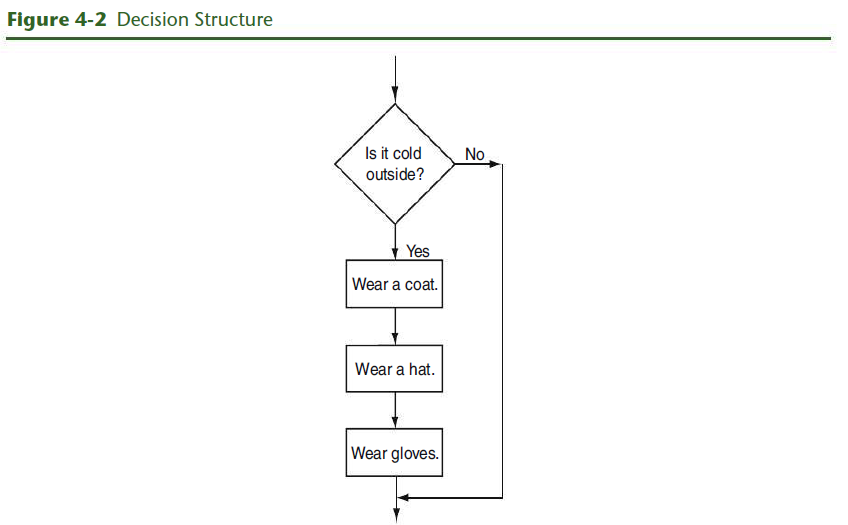
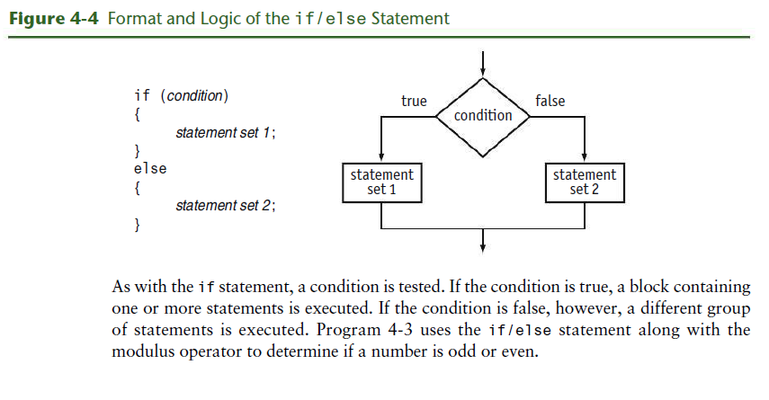

# Chapter 4: Making Decision

## Textbook

### 4.1 Relational Operators

**CONCEPT:** Relational operators allow you to compare numeric and char values
to determine whether one is greater than, less than, equal to, or not equal to
another.

> Program 4-1

```cpp
// This program displays the values C++ uses to represent true and false.
#include <iostream>
using namespace std;

int main()
{
  bool trueValue, falseValue;
  int x = 5, y = 10;

  trueValue = (x < y);
  falseValue = (y == x);

  cout << "True is " << trueValue << endl;
  cout << "False is " << falseValue << endl;
  return 0;
}
```

> Program 4-1 Output

```
True  is 1
False is 0
```

Let's examine the statements containing the relational expressions a little
closer:

```
trueValue = (x < y);
falseValue = (y == x);
```

These statements may seem odd because they are assigning the value of a
comparison to a variable. In the first statement, the variable `trueValue` is
being assigned the result of `x < y`.  Because x is less than y, the expression
is true, and the variable `trueValue` is assigned a nonzero value. In the second
statement, the expression `y == x` is false, so the variable `falseValue` is set
to 0.

When writing statements such as these, most programmers enclose the relational
expression in parentheses, as shown above, to make it clearer.

Parentheses are not actually required, however, because even without them the
relational operation is carried out before the assignment operation is
performed. This occurs because **relational operators have a higher precedence
than the assignment operator**. Likewise, arithmetic operators have a higher
precedence than relational operators.

The statement

```cpp
result = x < y - 8;
```

is equivalent to the statement

```cpp
result = x < (y - 8);
```

In both cases, `y - 8` is evaluated first.

**Table 4-3:** Statements that incude Relational Expressions (Assume `x` is
`10`, `y` is `7`, and `z` is an `int` or `bool`.)

| Stat |   |
|------|---|
|      |   |

| Statement                 | Outcome                                                  |
|---------------------------|----------------------------------------------------------|
| `z = x < y`               | z is assigned 0 because x is not less than y.            |
| `cout << (x > y);`        | Displays 1 because x is greater than y.                  |
| `z = (x >= y);`           | z is assigned 1 because x is greater than or equal to y. |
| `cout << (x <= y);`       | Displays 0 because x is not less than or equal to y.     |
| `z = (y != x);`           | z is assigned 1 because y is not equal to x.             |
| `cout << (x == (y + 3));` | Displays 1 because x is equal to y + 3.                  |

Relational operators also have a precedence order among themselves. The two
operators that test for equality or lack of equality (`==` and `!=`) have the
same precedence as each other.

**Table 4-4:** Precedence of Relational Operators (Highest to Lowest)

|             |
|-------------|
| `> >= < <=` |
| `== !=`     |


### 4.2 The `if` Statement

**CONCEPT:** the `if` statement can cause other statements to execute only under
certain conditions


The type of code in Figure 4-1 is called a _sequence structure_ because the
statements are executed in sequence, one after another, without branching off in
another direction. Programs often need more than one path of execution, however.
Many algorithms require a program to execute some statements only under certain
circumstances. This can be accomplished with a _decision structure_.

Because a decision structure determines which path, or branch, the program will
follow, it is sometimes referred to as a _branching structure_.




Notice that the statements inside the body of the `if` construct are contained
within a set of curly braces. This creates what C++ calls a _block_ and lets the
compiler know which statements are associated with the if.

> Program 4-2

```cpp
// This program correctly averages 3 test scores.
#include <iostream>
#include <iomanip>
using namespace std;

int main()
{
  int score1, score2, score3;
  double average;

  // Get the three test scores
  cout << "Enter 3 test scores and I will average them: ";
  cin >> score1 >> score2 >> score3;

  // Calculate and display the average score
  average = (score1 + score2 + score3) / 3.0;
  cout << fixed << showpoint << setprecision(1);
  cout << "Your average is " << average << endl;

  // If the average equals 100, congratulate the user
  if (average == 100)
  { cout << "Congratulations! ";
    cout << "That's a perfect score!\n";
  }
  return 0;
}
```

#### Programming Style and the `if` Statement

Even though `if` statements usually span more than one line, they are
technically one long statement. For instance, the following `if` statements are
identical except in style:

```cpp
if (a >= 100)
  cout << "The number is out of range.\n";


if (a >= 100) cout << "The number is out of range.\n";
```

#### Three Common Errors to Watch Out For

1. Misplaced semicolons
2. Missing braces
3. Confusing `=` with `==`

**Be Careful with Semicolons**

```cpp
if (condition)  // No smicolong goes here
{
  statement 1;  // Semicolon goes here
  statement 2;  // Semicolon goes here
}
```

**Don't Forget the Braces**

```cpp
if (average == 100)
  cout << "Congratulations! ";          // There are no braces needed for this line
  cout << "That's a perfect score;\n"   // This is outside the if
```

**Don't Confuse `==` With `=`**

```cpp
if (x = 2)                // Caution here!
  cout << "It is True!";
```

#### More about Truth

Here are the rules you have seen so far:

- When a relational expression is true, it has a nonzero value, which in most
  cases is represented by the value `1`.
- When a relational expression is false, it has the value `0`.
- An expression that has the value `0` is considered false by the if statement.
  This includes the `bool` value `false`, which is equivalent to `0`.
- An expression that has any value other than `0` is considered true. This
  includes the `bool` value `true`, which is equivalent to `1`.

```cpp
if (value)
  cout << "It is True!";

// This is equivalent to the statement

if (value != 0)
  cout << "It is True!";
```

#### Flags

A _flag_ is a variable that signals whether or not some condition currently
exists in a program. Because `bool` variables hold the values `true` and
`false`, they are the perfect type of variables to use for flags.

```cpp
bool salesQuotaMet = false;

if (sales >= QUOTA_AMOUNT)
  salesQuotaMet = true;
```
#### Integer Flags

Although a Boolean variable is normally used when a programmer wants to create a
flag, an integer variable may also be used.

```cpp
int salesQuotaMet = 0; // 0 means false

if (sales >= QUOTA_AMOUNT)
  salesQuotaMet = 1; // 1 means true
```


### 4.3 The `if/else` Statement

**CONCEPT:** The if/else statement executes one set of statements when the if
condition is true and another set when the condition is false.



> Program 4-3

```cpp
// This program uses the modulus operator to determine
// if a number is odd or even. If the number is evenly divisible
// by 2, it is an even number. A remainder indicates it is odd.
#include <iostream>
using namespace std;

int main()
{
  int number;

  cout << "Enter an integer and I will tell you if it\n";
  cout << "is odd or even. ";
  cin >> number;

  if (number % 2 == 0)
    cout << number << " is even.\n";
  else
    cout << number << " is odd.\n";
  return 0;
}
```

> Program 4-4

```cpp
// This program makes sure that the divisor is not
// equal to 0 before it performs a divide operation.
#include <iostream>
using namespace std;

int main()
{
  double num1, num2, quotient;

  // Get the two numbers
  cout << "Enter two numbers: ";
  cin  >> num1 >> num2;

  // If num2 is not zero, perform the division.
  if (num2 != 0)
  {
    quotient = num1 / num2;
    cout << "The quotient of " << num1 << " divided by "
         << num2 << " is " << quotient << ".\n";
  }
  else
  {
    cout << "Division by zero is not possible.\n";
    cout << "Please run the program again and enter "
         << "a number other than zero.\n";
  }
  return 0;
}
```

#### Comparing Floating-Point Numbers

Testing floating-point numbers for equality can sometimes give erroneous
results. Because of a lack of precision or round-off errors, a number that
should be mathematically equal to another might not be. In Program 4-5, the
number 6 is multiplied by 0.666667, a decimal version of 2/3. Of course, 6 times
2/3 is 4. The program, however, disagrees.


> Program 4-5

```cpp
// This program demonstrates how a lack of precision in
// floating-point numbers can make equality comparisons unreliable.
#include <iostream>
using namespace std;

int main()
{
  double result = .666667 * 6.0;

  // 2/3 of 6 should be 4 and, if you print result, 4 is displayed.
  cout << "result = " << result << endl;

  // However, internally result is NOT precisely equal to 4.
  if (result == 4.0)
    cout << "result DOES equal 4!" << endl;
  else
    cout << "result DOES NOT equal 4!" << endl;

  return 0;
}
```

Typically, the value in `result` will be a number just short of 4, like 3.999996.
To prevent errors like this, it is wise to stick with greater-than and less-than
comparisons when using floating-point numbers. For example, instead of testing
if the result equals 4.0, you could test to see if it is very close to 4.0.
Program 4-6 demonstrates this technique.

> Program 4-6

```cpp
// This program demonstrates how to safely test a floating-point number
// to see if it is, for all practical purposes, equal to some value.
#include <iostream>
#include <cmath>
using namespace std;

int main()
{
  double result = .666667 * 6.0;

  // 2/3 of 6 should be 4 and, if you print result, 4 is displayed.
  cout << "result = " << result << endl;

  // However, internally result is NOT precisely equal to 4.
  // So test to see if it is "close" to 4.
  if (abs(result - 4.0 < .0001))
    cout << "result DOES equal 4!" << endl;
  else
    cout << "result DOES NOT equal 4!" << endl;

  return 0;
}
```


### 4.4 The `if/else if` Statement

**CONCEPT:** The if/else if statement is a chain of if statements. They perform
their tests, one after the other, until one of them is found to be true.


> Program 4-7

```cpp
// This program uses an if/else if statement to assign a
// letter grade of A, B, C, D, or F to a numeric test score.
#include <iostream>
using namespace std;

int main()
{
  // Create named constants to hold minimum
  // scores required for each letter grade.
  const int MIN_A_SCORE = 90,
  MIN_B_SCORE = 80,
  MIN_C_SCORE = 70,
  MIN_D_SCORE = 60;

  int testScore; // Holds a numeric test score
  char grade; // Holds a letter grade

  // Get the numeric score
  cout << "Enter your numeric test score and I will\n";
  cout << "tell you the letter grade you earned: ";
  cin  >> testScore;

  // Determine the letter grade
  if (testScore >= MIN_A_SCORE)
    grade = 'A';
  else if (testScore >= MIN_B_SCORE)
    grade = 'B';
  else if (testScore >= MIN_C_SCORE)
    grade = 'C';
  else if (testScore >= MIN_D_SCORE)
    grade = 'D';
  else if (testScore >= 0)
    grade = 'F';

  // Display the letter grade
  cout << "Your grade is " << grade << ".\n";

  return 0;
}
```


```cpp
// This program illustrates a bug that occurs when independent if/else
// statements are used to assign a letter grade to a numeric test score.
#include <iostream>
using namespace std;

int main()
{
  // Create named constants to hold minimum
  // scores required for each letter grade.
  const int MIN_A_SCORE = 90,
  MIN_B_SCORE = 80,
  MIN_C_SCORE = 70,
  MIN_D_SCORE = 60;

  int testScore; // Holds a numeric test score
  char grade; // Holds a letter grade

  // Get the numeric score
  cout << "Enter your numeric test score and I will\n";
  cout << "tell you the letter grade you earned: ";
  cin  >> testScore;

  // Determine the letter grade
  if (testScore >= MIN_A_SCORE)
    grade = 'A';

  if (testScore >= MIN_B_SCORE)
    grade = 'B';

  if (testScore >= MIN_C_SCORE)
    grade = 'C';

  if (testScore >= MIN_D_SCORE)
    grade = 'D';

  if (testScore >= 0)
    grade = 'F';

  // Display the letter grade
  cout << "Your grade is " << grade << ".\n";
  return 0;
}
```

```cpp
// This program uses an if/else if statement to assign a letter
// grade of A, B, C, D, or F to a numeric test score. A trailing
// else is used to set a flag if a negative value is entered.
#include <iostream>
using namespace std;
int main()
{
  // Create named constants to hold minimum
  // scores required for each letter grade.
  const int MIN_A_SCORE = 90,
  MIN_B_SCORE = 80,
  MIN_C_SCORE = 70,
  MIN_D_SCORE = 60,
  MIN_POSSIBLE_SCORE = 0;

  int testScore; // Holds a numeric test score
  char grade; // Holds a letter grade
  bool goodScore = true;

  // Get the numeric score
  cout << "Enter your numeric test score and I will\n";
  cout << "tell you the letter grade you earned: ";
  cin  >> testScore;

  // Determine the letter grade
  if (testScore >= MIN_A_SCORE)
    grade = 'A';
  else if (testScore >= MIN_B_SCORE)
    grade = 'B';
  else if (testScore >= MIN_C_SCORE)
    grade = 'C';
  else if (testScore >= MIN_D_SCORE)
    grade = 'D';
  else if (testScore >= MIN_POSSIBLE_SCORE)
    grade = 'F';
  else
    goodScore = false; // The score was below 0

  // Display the letter grade
  if (goodScore)
    cout << "Your grade is " << grade << ".\n";
  else
    cout << "The score cannot be below zero. \n";

  return 0;
}
```


%% STOPPED AT p.185


## Video


<br>

# Resources

Textbook

- Starting Out with C++: Early Objects by Tony Gaddis, Judy Walters, Godfrey
  Muganda

