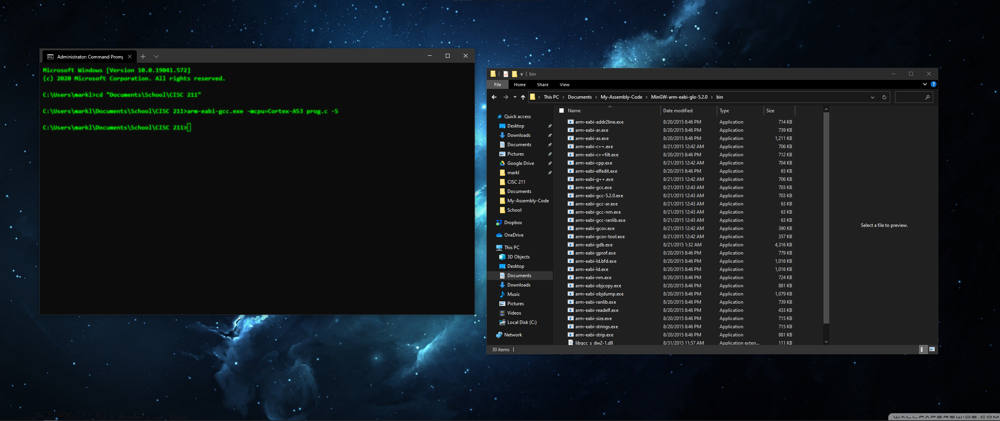

## Notes

- [↪ Unit 5 Assignment](notes)

## Assignment

- [⬇ Unit 5 Assignment](file:../../../../files/fall-2020/CISC-211/unit-5/unit-5_assignment.pdf)

## Lab

- [⬇ prog.c](vfile:../../../../files/fall-2020/CISC-211/unit-5/prog.c)
- [⬇ prog.s](vfile:../../../../files/fall-2020/CISC-211/unit-5/prog.s)
- 

### For Windows

Using [📄 MinGW GCC For
ARM](https://sourceforge.net/projects/mingw-gcc-arm-eabi/) to compile `prog.c`
with `arm-eabi-gcc.exe`

```powershell
arm-eabi-gcc.exe -mcpu=Cortex-A53 prog.c -S
```

### For Linux (Ubuntu)

Using `gcc-arm-linux-gnueabi`

Installation

```bash
sudo apt install -y gcc-arm-linux-gnueabi
```

Usage 

```bash
arm-linux-gnueabi-gcc -mtune=cortex-a53 prog.c -S
```

### For Mac:

Using `arm-none-eabi-gcc`

Installation

```bash
xcode-select --install
brew install arm-none-eabi-gcc
```

Usage

```bash
arm-none-eabi-gcc -mtune=cortex-a53 prog.c -S
```

