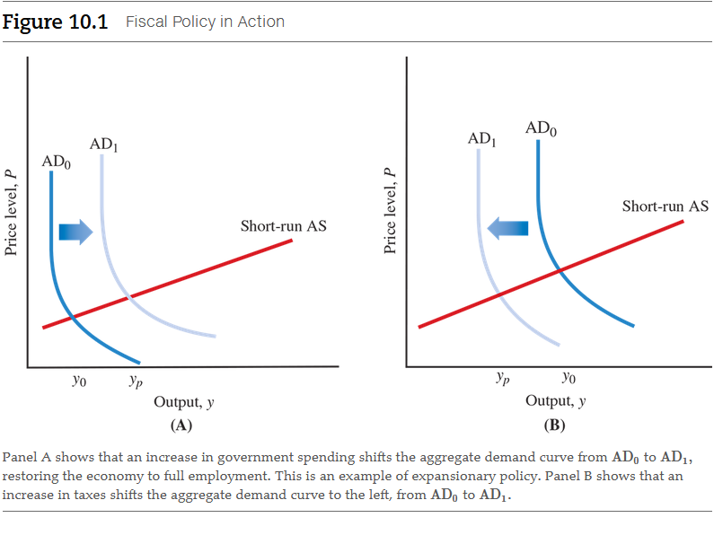
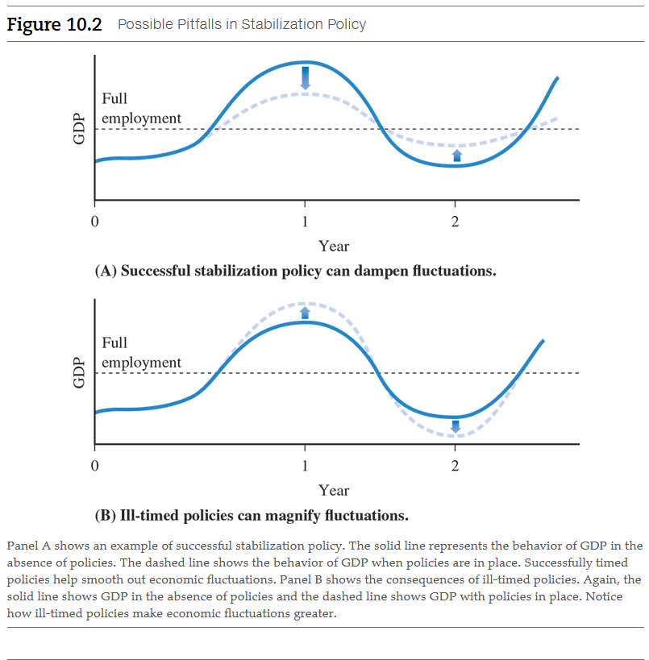

# Chapter 10: Fiscal Policy

**Economists generally believe that permanent tax cuts will stimulate the
economy and lead to higher output, but disagree about why this happens.**

<a name="fiscal-policy-term">**Fiscal policy**</a>

- Changes in government taxes and spending that affect the level of GDP.

## 10.1 The Role of Fiscal Policy

### 10.1.1 Fiscal Policy and Aggregate Demand

As we discussed in the last chapter, government spending and taxes can affect
the level of aggregate demand. Increases in government spending or decreases in
taxes will increase aggregate demand and shift the aggregate demand curve to the
right. Decreases in government spending or increases in taxes will decrease
aggregate demand and shift the aggregate demand curve to the left.

Why do changes in government spending or taxes shift the aggregate demand curve?
Recall from our discussion in the last chapter that aggregate demand consists of
four components: consumption spending, investment spending, government
purchases, and net exports. These four components are the four parts of
aggregate demand. Thus, increases in government purchases directly increase
aggregate demand because they are a component of aggregate demand. Decreases in
government purchases directly decrease aggregate demand.

Changes in taxes affect aggregate demand indirectly. For example, if the
government lowers taxes consumers pay, consumers will have more income at their
disposal and will increase their consumption spending. Because consumption
spending is a component of aggregate demand, aggregate demand will increase as
well. Increases in taxes will have the opposite effect. Consumers will have less
income at their disposal and will decrease their consumption spending. As a
result, aggregate demand will decrease. Changes in taxes can also affect
businesses and lead to changes in investment spending. Suppose, for example,
that the government cuts taxes in such a way as to provide incentives for new
investment spending by businesses. Because investment spending is a component of
aggregate demand, the increase in investment spending will increase aggregate
demand.

<a name="expansionary-policies-term">**Expansionary policies**</a>

- Government policy actions that lead to increase in aggregate demand.

The government can also use fiscal policy to decrease GDP if the economy is
operating at too high a level of output, which would lead to an overheating
economy and rising prices. In Panel B of Figure 10.1, the economy is initially
operating at a level of output, $y_{0}$, that exceeds full-employment output,
$y_{p}$.  An increase in taxes can shift the aggregate demand curve from
$AD_{0}$ to $AD_{1}$. This shift will bring the economy back to full employment.

Alternatively, the government could cut its spending to move the aggregate
demand curve to the left. Government policies that decrease aggregate demand are
called **contractionary policies**. Decreasing government spending and
increasing taxes are examples of contractionary policies.

<a name="contractionary-policies-term">**Contractionary policies**</a>

- Government policy actions that lead to decreases in aggregate demand.

### 10.1.2 The Fiscal Multiplier

Let's recall the multiplier we developed in the last chapter. The idea is that
the final shift in the aggregate demand curve will be larger than the initial
increase. For example, if government purchases increased by \$10 billion, that
would initially shift the aggregate demand curve to the right by \$10 billion.
However, the total shift in the aggregate demand curve will be larger, say, \$15
billion. Conversely, a decrease in purchases by \$10 billion may cause a total
shift of the aggregate demand curve to the left by \$15 billion.

This multiplier effect occurs because an initial change in output will affect
the income of households and thus change consumer spending. For example, an
increase in government spending of \$10 billion will initially raise household
incomes by \$10 billion and lead to increases in consumer spending. As we
discussed in the last chapter, the precise amount of the increase will depend on
the marginal propensity to consume and other factors. In turn, the increase in
consumer spending will raise output and income further, leading to further
increases in consumer spending. The multiplier takes all these effects into
account.

As the government develops policies to stabilize the economy, it needs to take
the multiplier into account. The total shift in aggregate demand will be larger
than the initial shift. As we will see later in this chapter, U.S. policymakers
have taken the multiplier into account as they have developed policies for the
economy.

### 10.1.3 The Limits to Stabilization Policy

We've seen that the government can use fiscal policy--changes in the level of
taxes or government spending--to alter the level of GDP. If the current level of
GDP is below full employment or potential output, the government can use
expansionary policies, such as tax cuts and increased spending, to raise the
level of GDP and reduce unemployment.

Both expansionary and contractionary policies are examples of **stabilization
policies**, actions to move the economy closer to full employment or potential
output.

<a name="stabilization-policies-term">**Stabilization policies**</a>

- Policy actions taken to move the economy closer to full employment or
  potential output.

It is very difficult to implement stabilization policies for two big reasons.
First, there are lags, or delays, in stabilization policy. Lags arise because
decision makers are often slow to recognize and respond to changes in the
economy, and fiscal policies and other stabilization policies take time to
operate. Second, economists simply do not know enough about all aspects of the
economy to be completely accurate in all their forecasts. Although economists
have made great progress in understanding the economy, the difficulties of
forecasting the precise behavior of human beings, who can change their minds or
sometimes act irrationally, place limits on our forecasting ability.

#### Lags

Poorly timed policies can magnify economic fluctuations. Suppose that (1) GDP is
currently below full employment but will return to full employment on its own
within 1 year, and that (2) stabilization policies take a full year to become
effective. If policymakers tried to expand the economy today, their actions
would not take effect until a year from now. One year from now, the economy
would normally be back at full employment by itself. But if stabilization
policies were enacted, 1 year from now the economy would be stimulated
unnecessarily, and output would exceed full employment.

Panel B shows the consequences of ill-timed policies. Again, assume that
policies take a year before they are effective. At the start of year 0, the
economy is below potential. If policymakers engaged in expansionary policies at
the start of year 1, the change would not take effect until the end of year 1.
This would raise output even higher above full employment. Ill-timed
stabilization policies can magnify economic fluctuations.

Where do the lags in policy come from? Economists recognize two broad classes of
lags: _inside lags_ and _outside lags_. **Inside lags** refer to the time it
takes to formulate a policy. **Outside lags** refer to the time it takes for the
policy to actually work. To help you understand inside and outside lags, imagine
that you are steering a large ocean liner and you are looking out for possible
collisions with hidden icebergs. The time it takes you to spot an iceberg,
communicate this information to the crew, and initiate the process of changing
course is the inside lag. Because ocean liners are large and have lots of
momentum, it will take a long time before your ocean liner begins to turn; this
time is the outside lag.

<a name="inside-lags-term">**Inside lags**</a>

- The time it takes to formulate a policy.

<a name="outisde-lags-term">**Outisde lags**</a>

- The time it takes for the policy to actually work.

Inside lags occur for two basic reasons. One is that it takes time to identify
and recognize a problem. For example, the data available to policymakers may be
poor and conflicting. Some economic indicators may look fine, but others may
cause concern. It often takes several months to a year before it is clear that
there is a serious problem with the economy.

A good example of an inside lag occurred at the beginning of the Great
Depression. Although the stock market crashed in October 1929, we know from
newspaper and magazine accounts that business leaders were not particularly
worried about the economy for some time. Not until late in 1930 did the public
begin to recognize the severity of the depression.

The other reason for inside lags is that once a problem has been diagnosed, it
still takes time before the government can take action. This delay is most
severe for fiscal policy because any changes in taxes or spending must be
approved by both houses of Congress and by the president. In recent years,
political opponents have been preoccupied with disagreements about the size of
the government and the role it should play in the economy, making it difficult
to reach a consensus on action in a timely manner.

Policies are also subject to outside lags--the time it takes for them to become
effective. For example, if taxes are cut, it takes time for individuals and
businesses to change their spending plans to take advantage of the tax cuts.
Therefore, it will be a while before increases in spending raise GDP. Outside
lags in fiscal policy are relatively short. Moreover, the multiplier effects
tend to work through the economy rather quickly.

Economists use _econometric models_ to replicate the behavior of the economy
mathematically and statistically, and to assist them in developing economic
forecasts. They can also use models to estimate the length of outside lags. One
such model predicts that an increase in government spending will increase GDP by
its maximum effect after just 6 months.

#### Forecasting Uncertainties

What makes the problem of lags even worse is that economists are not very
accurate in forecasting what will happen in the economy. For example, a classic
problem policymakers face when the economy appears to be slowing down is knowing
whether the slowdown is temporary or will persist. Unfortunately, stabilization
policy cannot be effective without accurate forecasting. If economic forecasters
predict an overheated economy and the government adopts a contractionary policy,
the result could be disastrous if the economy weakened before the policy took
effect. Today, most economic policymakers understand these limitations and are
cautious in using activist policies.

## 10.2 The Federal Budget

The federal budget--the document that describes what the federal government
spends and how it pays for that spending--provides the framework for fiscal
policy. In this section, we take a closer look at federal spending and taxation
and what happens when one exceeds the other. The federal budget is extremely
large, and the programs that the federal government supports are very complex.
To give you a sense of the magnitude of the budget, in 2016 total federal
spending was approximately 20.9 percent of GDP, or \$3.9 trillion. Federal
revenues were 17.8 percent of GDP. With a U.S. population of about 325 million,
total federal spending amounted to approximately \$11,860 per person.

### 10.2.1 Federal Spending

Federal spending, spending by the U.S. government, consists of two broad
components: federal government purchases of goods and services and transfer
payments. As you should recall from our discussion of GDP accounting, only
federal government purchases of goods and services are included in GDP. Transfer
payments, although an important part of the federal budget, are not a component
of GDP because they do not represent any currently produced goods or services.

To study the components of federal spending, we look at the final data from
fiscal year 2016 provided by the Congressional Budget Office, a nonpartisan
agency of Congress that provides both budgetary forecasts and historical data on
the budget. Table 10.1 provides key data on federal expenditures for fiscal year
2016, both in absolute dollar terms and as a percent of GDP.

> **Table 10.1** Federal Spending for Fiscal Year 2016

| Category                               | Outlays, in billions | Percent of GDP |
|----------------------------------------|----------------------|----------------|
| Total outlays                          | $3,854               | 20.9%          |
| Discretionary spending                 | 1184                 | 6.4            |
| Defense                                | 584                  | 3.2            |
| Nondefense                             | 600                  | 3.3            |
| Entitlements and mandatory spending    | 2,429                | 13.2           |
| Social Security                        | 910                  | 4.9            |
| Medicare and Medicaid                  | 1080                 | 5.9            |
| Other programs and offsetting receipts | 439                  | 2.4            |
| Net interest                           | 241                  | 1.3            |

_SOURCE: Congressional Budget Office, January 2017_

Let's begin with the broad categories of the budget. Total spending, or outlays,
in fiscal year 2016 were \$3,854 billion, or approximately 20.9 percent of GDP.
Three components of the budget comprise this total: discretionary spending,
entitlements and mandatory spending, and net interest.

**Discretionary spending** constitutes all the programs that Congress authorizes
on an annual basis that are not automatically funded by prior laws. It includes
defense spending and all nondefense domestic spending. When people commonly
discuss federal spending, they often focus on this category, which includes the
Defense Department, the Environmental Protection Agency, the State Department,
the Interior Department, and other agencies. However, discretionary spending is
only about 30 percent of total federal spending. Total discretionary nondefense
spending is about 15.6 percent of total federal spending.

<a name="discretionary-spending-term">**Discretionary spending**</a>

- The spending programs that Congress authorizes on an annual basis.

Congress and the president can use discretionary funds directly for activist
fiscal policy. To stimulate the economy, they can authorize additional spending
by government agencies, or they can urge agencies to accelerate their current
spending plans. However, it does take time for bureaucracies to act, and just
because Congress authorizes new spending does not mean the agencies will spend
the funds immediately.

**Entitlement and mandatory spending** constitutes all spending that Congress
has authorized by prior law. These expenditures must be made by the federal
government unless Congress changes the laws. The terms entitlement and mandatory
spending are not totally accurate, however. Individuals are "entitled" to
benefits only to the extent they meet the requirements passed by Congress.
Congress can always change the rules. Similarly, this category of spending is
"mandatory" only to the extent Congress maintains the current programs in place.

<a name="entitlement-and-mandatory-spending-term">**Entitlement and mandatory spending**</a>

- Spending that Congress has authorized by prior law, primarily providing
  support for individuals.

Entitlements and mandatory spending are the single largest component of the
federal budget. One of the most familiar programs is **Social Security**, which
provides retirement payments to retirees as well as a host of other benefits to
widows and families of disabled workers. Medicare provides health care to all
individuals once they reach the age of 65. Medicaid provides health care to the
poor, in conjunction with the states. Spending on these two health programs by
the federal government now exceeds spending on Social Security. The government
provides a range of other programs as well, including additional retirement and
disability programs (aside from Social Security) and farm price supports to
provide income to farmers. Some of these programs are means tested. That is, the
amount of benefit is partly based on the income of the recipient. Medicaid, for
example, is a means-tested program.

<a name="social-security-term">**Social Security**</a> - A federal government
program to provide retirement support and a host of other benefits. 
<a name="medicare-term">**Medicare**</a> - A federal government health program
for older adults. 
<a name="medicaid-term">**Medicaid**</a> - A federal and state government health
program for the poor. 

Net interest is the interest the government pays on the government debt held by
the public, for example, U.S. Treasury bonds, bills, and U.S. savings bonds. We
discuss how the government borrows money later in the chapter. In fiscal year
2016, total net interest payments to the public were \$241 billion, or
approximately 1.3 percent of GDP. Total expenditures on net interest are
directly related to the total government debt held by the public and the level
of interest rates. Increased government debt and higher interest rates will lead
to higher net interest payments by the government.

### 10.2.2 Federal Revenues

The federal government receives its revenue from taxes levied on both
individuals and businesses. Table 10.2 shows the revenues the federal government
received in fiscal year 2016 in both dollar terms and as a percent of GDP.

> **Table 10.2** Sources of Federal Government Revenue, Fiscal Year 2016

| Category                   | Receipts, in billions | Percent of GDP |
|----------------------------|-----------------------|----------------|
| Total revenue              | $3,267                | 17.8%          |
| Individual income taxes    | 1,546                 | 8.4            |
| Social insurance taxes     | 1,115                 | 6.1            |
| Corporate taxes            | 300                   | 1.6            |
| Estate, excise, and others | 306                   | 1.7            |

_SOURCE: Congressional Budget Office, January 2017_

Let's review the categories that comprise total federal revenue. The single
largest component of federal revenue is the familiar _individual income tax_.
Tax returns calculating the tax individuals or couples owed during the prior
year must be filed by April 15 of every year. During the year, the federal
government collects in advance some of the taxes due by _withholding_ a portion
of workers' paychecks. Taxpayers not subject to withholding or who earn income
through investments must make estimated tax payments each quarter, so the tax
due the federal government is paid evenly over the year in which it is earned.

The second-largest component of federal revenue is _social insurance taxes_,
which are taxes levied on earnings to pay for Social Security and Medicare.
Today, social insurance taxes are almost as large as individual income taxes,
and together they comprise 81 percent of total federal revenue. Unlike
individual income taxes, social insurance taxes are paid only on wages and not
on income from investments.

Other taxes paid directly by individuals and families include _estate and gift
taxes_, _excise taxes_, and _custom duties_. Estate and gift taxes, sometimes
known as the "death tax," are levied on the estates and previous gifts of
individuals when they pass away. In 2016, estates were taxed only if they
exceeded a threshold of \$5.45 million per person--so small estates did not pay
this tax.  The estate and gift tax typically raises little revenue but generates
a great deal of controversy. Opponents of the tax argue that it destroys
family-held businesses, such as family farms passed down from one generation to
the next.  Proponents claim the tax is necessary to prevent what they see as
unfair accumulation of wealth across generations.

The corporate tax is a tax levied on the earnings of corporations. This tax
raised about 9 percent of total federal revenues during fiscal year 2016. The
tax was a more important source of revenue in past decades but has declined to
today's relatively low level. This decline has been attributed to many factors,
including falling corporate profits as a share of GDP, the growth of
opportunities for tax shelters, incentives provided by Congress to stimulate
business investment and research and development, and complex rules for taxing
multinational corporations that operate on a global basis. In addition, more
businesses are now being conducted in organizational structures, such as
partnerships, that are not subject to the corporate tax. Income from those
businesses is reported on individual tax returns.

The other sources of government revenue are relatively minor. _Federal excise
taxes_ are taxes levied on the sale of certain products, for example, gasoline,
tires, firearms, alcohol, and tobacco. _Custom duties_ are taxes levied on goods
imported to the United States, such as foreign cars or wines.

#### Supply-Side Economics and the Laffer Curve

Is it possible for a government to cut tax rates yet still raise more revenue?
That's a politician's dream. People would face lower tax rates, yet there would
be more money for politicians to spend. Economist Arthur Laffer argued in the
late 1970s that there was a strong possibility we could do this in the U.S.
economy. Laffer's views influenced many politicians at the time and became the
basis for supply-side economics. **Supply-side economics** is a school of
thought that emphasizes the role taxes play in the supply of output in the
economy. Supply-side economists look at the effects of taxes not just on
aggregate demand, as we did earlier in this chapter, but also on aggregate
supply. A decrease in tax rates will typically tend to increase labor supply and
output. Thus, changes in taxes can also shift the aggregate supply curve.

<a name="supply-side-economics-term">**Supply-side economics**</a>

- A school of thought that emphasizes the role that taxes play in the supply of
  output in the economy.

Laffer also developed a model known today as the **Laffer curve**. Suppose a
government imposed extremely high tariffs (taxes) on imported goods--tariffs so
high that no one could afford to import any goods whatsoever. If this were the
case, the government would not collect any revenue from the tariffs. But if the
government cut the rates and individuals began to buy imported goods, the
government would start to collect at least some tariff revenue. This was
Laffer's point: Lower taxes (tariffs) could actually lead to higher government
revenues.

<a name="laffer-curve-term">**Laffer curve**</a>

- A relationship between the tax rates and the tax revenues that illustrates
  that high tax rates could lead to lower tax revenues if economic activity is
  severely discouraged.

Virtually all economists today believe Laffer's tax revenue idea won't work when
it comes to broad-based income taxes or payroll taxes. For these types of taxes,
cutting rates from their current levels would simply reduce the revenues the
government collects because most economists believe the supply of labor is not
as sensitive to changes in tax rates as Laffer believed it was. But there are
some taxes, such as tariffs or taxes on the gains investors earn by holding
stocks and bonds, for which Laffer's claim is plausible.

Even if taxes do not pay for themselves, they can have important incentive
effects. The taxes enacted by the Trump administration in 2018 were focused on
business investment and applied both to corporations and other organizational
forms, such as partnerships. Their purpose was to stimulate investment spending
and lead, in the long run, to a higher stock of capital. This was an example of
supply-side policies for the long run.

### 10.2.3 The Federal Deficit and Fiscal Policy

The federal government runs a **budget deficit** when it spends more than it
receives in tax revenues in a given year. The budget deficit for fiscal year
2016 was 567 billion dollars or 3.2 percent of GDP. Here is how budget deficits
work. Suppose a government wishes to spend \$100 billion but receives only \$95
billion in tax revenue. To actually spend the \$100 billion, the government must
obtain funds from some source. Facing a \$5 billion shortfall, it will borrow
that money from the public by selling the public government bonds. A government
bond is an IOU in which the government promises to later pay back the money lent
to it, with interest. Thus, when the public purchases \$5 billion of these
bonds, it transfers \$5 billion to the government. Later the public will receive
its \$5 billion back with interest.

<a name="budget-deficit-term">**Budget deficit**</a>

- The amount by which government spending exceeds revenues in a given year.

If the government collects more in taxes than it wishes to spend in a given
year, it is running a **budget surplus**. In this case, the government has
excess funds and can buy back bonds it previously sold to the public,
eliminating some of its debt.

<a name="budget-surplus-term">**Budget surplus**</a>

- The amount by which government revenues exceed government expenditures in a
  given year.

Many political and economic considerations enter into the decisions to change
government spending or taxes or raise or lower deficits. In the last part of
this chapter we see how fiscal policy has been used historically in the United
States. In later chapters, we look in more depth at other political
considerations that influence fiscal policy.

### 10.2.4 Automatic Stabilizers

Both government spending and tax revenues are very sensitive to the state of the
economy. Because tax collections are based largely on individual and corporate
income, tax revenues will fall sharply during a recession as national income
falls. At the same time, government transfer payments for programs such as
unemployment insurance and food stamps will also tend to increase during a
recession. The result is higher government spending and lower tax collections
and the increased likelihood that the government will run a budget deficit.
Similarly, when the economy grows rapidly, tax collections increase and
government expenditures on transfer payments decrease, and the likelihood of the
federal government running a surplus is greater.

Now suppose an economy had a balanced federal budget--neither deficit nor
surplus. An external shock (such as a dramatic increase in oil prices or
drought) then plunged the economy into a recession. Tax revenues fall and
expenditures on transfer payments increase, resulting in a budget deficit.
Believe it or not, the deficit actually serves a valuable role in stabilizing
the economy. It works through three channels:

1. Increased transfer payments such as unemployment insurance, food stamps, and
   other welfare payments increase the income of some households, partly
   offsetting the fall in household income.
2. Other households whose incomes are falling pay less in taxes, which partly
   offsets the decline in their household income. Because incomes do not fall as
   much as they would have in the absence of the deficit, consumption spending
   does not decline as much.
3. Because the corporation tax depends on corporate profits and profits fall in
   a recession, taxes on businesses also fall. Lower corporate taxes help to
   prevent businesses from cutting spending as much as they would otherwise
   during a recession.

The government deficit itself, in effect, offsets part of the adverse effect of
the recession and thus helps stabilize the economy.

Similarly, during an economic boom, transfer payments fall and tax revenues
increase. This dampens the increase in household income and also the increase in
consumption and investment spending that would accompany higher household income
and higher corporate profits. Taxes and transfer payments that stabilize GDP
without requiring explicit actions by policymakers are called **automatic
stabilizers**.

<a name="automatic-stabilizers-term">**Automatic stabilizers**</a>

- Taxes and transfer payments that stabilize GDP without requiring policymakers
  to take explicit action.

The great virtue of automatic stabilizers is that they do not require explicit
action from the president and Congress to change the law. Given the long inside
lags caused by ideological battles in Washington, D.C., over spending, taxes,
and the deficit, it is fortunate that we have mechanisms in place to dampen
economic fluctuations without requiring explicit and deliberative action.

### 10.2.5 Are Deficits Bad?

Let's take a closer look at fiscal policy designed to stabilize the economy. If
the budget were initially balanced and the economy plunged into a recession, a
budget deficit would emerge as tax revenues fell and expenditures increased. To
combat the recession, policymakers could then either increase government
spending or cut taxes. Both actions, however, would increase the deficit--an
important point to remember.

Despite concerns about increasing the deficit, this is precisely the right
policy. If policymakers tried to avoid running a deficit by raising taxes or
cutting spending, that would actually make the recession worse. The key lesson
here is that during a recession, we should focus on what our fiscal policy
actions do to the economy, not what they do to the deficit.

Does that mean concerns about the federal budget deficit are misplaced? No,
because in the long run, large budget deficits can have an adverse effect on the
economy. We explore these issues in more detail in a later chapter, but we can
easily understand the basic problem. We have seen that when an economy is
operating at full employment, output must be divided between consumption,
investment, government spending, and net exports. Suppose, then, the government
cuts taxes for households and runs a deficit. The reduced taxes will tend to
increase consumer spending. Consumers may save some of the tax cut but will
consume the rest. However, because output is fixed at full employment, some
other component of output must be reduced, or crowded out. Crowding out is an
example of the principle of opportunity cost.

> [📑 Principle of Opportunity Cost](../../../spring-2020/ECON-121/notes/ch-2#the-principle-of-opportunity-cost)

In this case, we normally expect that the increased consumption spending will
come at the sacrifice of reduced investment spending. As we have seen, with
reduced investment spending the economy will grow more slowly in the future.
Thus, the budget deficit will increase current consumption but slow the growth
of the economy in the future. This is the real concern with prolonged budget
deficits.

Another way to understand the concern about long-run deficits is to think of
what happens in the financial markets when the government runs large deficits.
As the government runs large deficits, it will have to borrow increasing amounts
of money from the public by selling U.S. government bonds. In the financial
markets, the government will be in increased competition with businesses that
are trying to raise funds from the public to finance their investment plans,
too. This increased competition from the government will make it more difficult
and costly for businesses to raise funds and, as a result, investment spending
will decrease.

## 10.3 Fiscal Policy in U.S. History

### 10.3.1 The Depression Era

The basic principles of fiscal policy--using government spending and taxation to
stabilize the economy--have been known for many years and, indeed, were
discussed in the 1920s. However, it took a long time before economic policy
decisions were based on these principles. Many people associate active fiscal
policy in the United States with actions taken by President Franklin Roosevelt
during the Great Depression of the 1930s. But this view is misleading, according
to E. Cary Brown, a former economics professor at the Massachusetts Institute of
Technology.1

During the 1930s, politicians did not believe in modern fiscal policy, largely
because they feared the consequences of government budget deficits. According to
Brown, fiscal policy was expansionary only during 2 years of the Great
Depression, 1931 and 1936. In those years, Congress voted for substantial
payments to veterans, over objections of presidents Herbert Hoover and Franklin
Roosevelt. Although government spending increased during the 1930s, taxes
increased sufficiently during that same period, with the result that there was
no net fiscal expansion.

### 10.3.2 The Kennedy Administration

Although modern fiscal policy was not deliberately used during the 1930s, the
growth in military spending at the onset of World War II in 1941 increased total
demand in the economy and helped pull the economy out of its long decade of poor
performance. But to see fiscal policy in action, we need to turn to the 1960s.
It was not until the presidency of John F. Kennedy during the early 1960s that
modern fiscal policy came to be accepted.

Walter Heller, the chairman of the president's Council of Economic Advisers
under John F. Kennedy, was a forceful advocate of active fiscal policy. From his
perspective, the economy was operating far below its potential, and a tax cut
was the perfect medicine to bring it back to full employment. When Kennedy
entered office, the unemployment rate was 6.7 percent. Heller believed the
unemployment rate at full employment--the "natural rate" of unemployment, that
is--was really only about 4 percent. He convinced Kennedy of the need for a tax
cut to stimulate the economy, and Kennedy put forth an economic program based
largely on modern fiscal policy principles.

Two other factors led the Kennedy administration to support the tax cut. First,
tax rates were extremely high at the time. The top individual tax rate was 91
percent, compared to about 40 percent today. The corporate tax rate was 52
percent, compared to 22 percent today. Second, Heller convinced Kennedy that
even if a tax cut led to a federal budget deficit, it was not a problem. In
1961, the federal deficit was less than 1 percent of GDP, and future projections
indicated it would disappear as the economy grew because of higher tax revenues.

The tax cuts were enacted in February 1964, after Lyndon Johnson became
president following Kennedy's assassination. They included permanent cuts in
rates for both individuals and corporations. Estimating the actual effects these
tax cuts had on the economy is difficult. To make a valid comparison, we need to
estimate how the economy would have behaved without them. What we do know is
that the economy grew at a rapid rate following the tax cuts. From 1963 to 1966,
both real GDP and consumption grew at rates exceeding 4 percent per year. We
cannot rule out the possibility that the economy could have grown just as
rapidly without the tax cuts. Nonetheless, the rapid growth during this period
suggests the tax cuts had the effect, predicted by Heller's theory, of
stimulating economic growth.

### 10.3.3 The Vietnam War Era

The next major use of modern fiscal policy occurred in 1968. As the Vietnam War
began and military spending increased, unemployment fell to very low levels.
From 1966 to 1969, the overall unemployment rate fell below 4 percent.
Policymakers became concerned that the economy was overheating and this would
lead to a higher inflation rate. In 1968, a temporary tax surcharge of 10
percent was enacted to reduce total demand for goods and services. The 10
percent surcharge was a "tax on a tax," so it raised the taxes paid by
households by 10 percent. Essentially, the surcharge was specifically designed
to be temporary and expired within a year.

The surcharge did not decrease consumer spending as much as economists had
initially estimated, however. Part of the reason was that it was temporary.
Economists who have studied consumption behavior have noticed that consumers
often base their spending on an estimate of their long-run average income, or
**permanent income**, not on their current income.

<a name="permanent-income-term">**Permanent income**</a>

- An estimate of a household's long-run average level of income.

For example, consider a salesperson who usually earns \$50,000 a year, although
her income in any single year might be slightly higher or lower. Knowing her
permanent income is \$50,000, she consumes \$45,000. If her income in 1 year is
higher than average, say \$55,000, she is still likely to consume \$45,000 (as
if she earned just her normal $50,000) and save the rest.

The 1-year tax surcharge during the Vietnam War had a similar effect. Because
consumers knew the surcharge was not permanent, they didn't alter their spending
habits very much. The surtax reduced households' savings, not their consumption.
The result was a smaller decrease in demand for goods and services than
economists anticipated.

During the 1970s, there were many changes in taxes and spending but no major
changes in overall fiscal policy. A recession in 1973 led to a tax rebate and
other incentives in 1975, but, by and large, changes to fiscal policy were mild.

### 10.3.4 The Reagan Administration

The tax cuts enacted during 1981 at the beginning of the first term of President
Ronald Reagan were significant. However, they were not proposed to increase
aggregate demand. Instead, the tax cuts were justified on the basis of improving
economic incentives and increasing the supply of output. In other words, they
were supply-side motivated. Taxes can have important effects on the supply of
labor, saving, and economic growth. Proponents of the 1981 tax cuts emphasized
the effects of supply and not increases in aggregate demand. Nonetheless, the
tax cuts did appear to increase consumer demand and helped the economy recover
from the back-to-back recessions in the early 1980s.

By the mid-1980s, large government budget deficits began to emerge, and
policymakers became concerned. As the deficits grew and became the focus of
attention, interest in using fiscal policy to manage the economy waned because
policymakers placed primary concern on deficit reduction, not stabilization
policy. Although there were government spending and tax changes in the 1980s and
1990s, few were justified solely as policies to change aggregate demand.

### 10.3.5 The Clinton and George W. Bush Administrations

At the beginning of his administration, President Bill Clinton proposed a
"stimulus package" that would increase aggregate demand, but it was defeated in
Congress. Clinton later successfully passed a major tax increase that brought
the budget into balance. A Republican-controlled Congress that had different
priorities than the Clinton administration limited government spending. By 1998,
the federal budget actually began to show surpluses rather than deficits,
setting the stage for tax cuts.

During his first year in office in 2001, President George W. Bush passed a
10-year tax cut plan that decreased tax rates, in part to eliminate the
government surpluses and return revenues to households, but also to stimulate
the economy that was slowing down as the high-tech investment boom was ending.

The first year of the tax cut featured tax rebates or refunds of up to \$600 per
married couple. The refunds were intended to increase aggregate demand.

After the September 11, 2001, terrorist attacks, President Bush and Congress
became less concerned with balancing the federal budget and authorized new
spending programs to provide relief to victims and to stimulate the economy,
which had entered into a recession prior to September 11.

In May 2003, President Bush signed another tax bill to stimulate the sluggish
economy and, in particular, to increase investment spending. This bill had many
distinct features, including moving up some of the previously scheduled cuts in
tax rates that were part of the 2001 tax bill, increasing the child tax credit,
and lowering taxes on dividends and capital gains.

### 10.3.6 The Obama and Trump Administrations

In 2008, a slowing economy led President Bush and Congress to adopt tax rebates
and some investment incentives. The tax cuts were relatively large,
approximately 1 percent of GDP, and the rebates, some as large as \$1,800, were
designed to reach 128 million households. In February 2009, President Barack
Obama and Congress enacted the largest stimulus package in United States
history. The stimulus package proved to be controversial both in its size and
composition. While many economists believe it helped the economy recover, others
have been more skeptical.

The combination of the 2001 and 2007 recessions, the financial crisis of 2008
and its aftermath, the various tax cuts, the large stimulus package of 2009, and
the increased expenses associated with the wars in Afghanistan and Iraq sharply
changed the fiscal landscape from the beginning of the decade. Although the
deficit temporarily became smaller in 2006 and 2007, the situation changed
radically. By fiscal year 2011, the deficit was 8.7 percent of GDP, far above
usual historical levels. As the economy recovered, the deficit did fall as a
fraction of GDP but remained high.

In December 2017, President Donald Trump signed into law a major tax cut. The
tax law was designed primarily to stimulate growth in the economy and to fix a
dysfunctional international tax system. This legislation cut the corporate tax
rate from 35 to 22 percent, provided an additional deduction for noncorporate
businesses, reduced individual tax rates for five years, and made important
changes to the international tax system. At the time of the tax cut, the
unemployment rate was 4.1 percent, near full employment. The Congressional
Budget Office predicted that the tax cut and prior spending policies enacted in
recent years would raise the level of debt held by the public from 77.5 percent
of GDP to nearly 97.5 percent by 2027. This led some economists to worry that
GDP could exceed full employment and potentially risk higher inflation.

Figure 10.3 plots the course of spending, taxes, and the deficit since 1996 and
shows the recent reemergence of deficits from the surpluses of the late 1990s
and the subsequent deficits caused by the series of spending increases and tax
cuts. The prospect of continuing deficits can limit the ability of the U.S.
government to conduct expansionary fiscal policy in the near future and will set
the background for the political debates in Washington, D.C., for many years to
come.

## Chapter Summary

This chapter explored the role of government fiscal policy. Using the AD–AS
model, we showed how fiscal policy can stabilize the economy. We also discussed
the multiplier and the limits to stabilization policy. In addition, the chapter
gave us an overview of the federal budget, including spending, revenues,
deficits, and surpluses. Finally, we explored how fiscal policy in the United
States has changed over time. Here are the key points:

1. Increases in government spending or decreases in taxes will increase
   aggregate demand.
2. Decreases in government spending or increases in taxes will decrease
   aggregate demand.
3. Because of the multiplier, the total shift in the aggregate demand curve will
   be larger than the initial shift. Policymakers need to take the multiplier
   into account as they formulate policy.
4. Both inside lags (the time it takes to formulate policy) and outside lags
   (the time it takes the policy to work) limit the effectiveness of active
   fiscal policy.
5. The largest component of federal spending is entitlements and mandatory
   programs.
6. The largest components of federal revenues are income taxes and social
   insurance taxes collected from individuals.
7. Government deficits act as an automatic stabilizer that helps to stabilize
   the economy in the short run.
8. In the short run, fiscal policy actions taken to combat a recession will
   increase the deficit; in the long run, deficits are a concern because they
   may lead to the crowding out of investment spending.
9. Active fiscal policy has been periodically used in the United States to
   stimulate the economy; at other times, concerns about deficits have limited
   the use of fiscal policy.

 

# Resources

- [📑 Principle of Opportunity Cost](../../../spring-2020/ECON-121/notes/ch-2#the-principle-of-opportunity-cost)

Textbook

- Macroeconomics: Principles/Applications/Tools, 10e by Arthur O'Sullivan,
  Steven Sheffrin, Stepehn Perez

