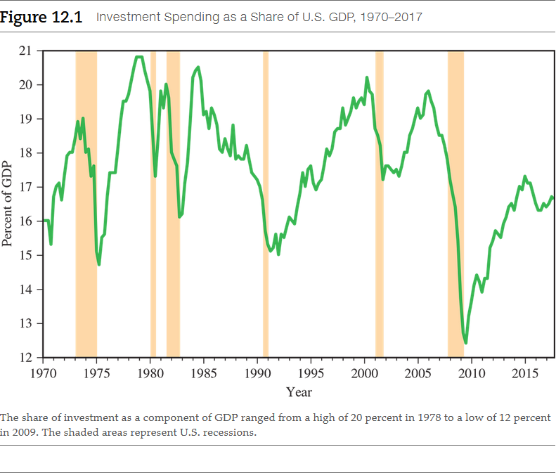
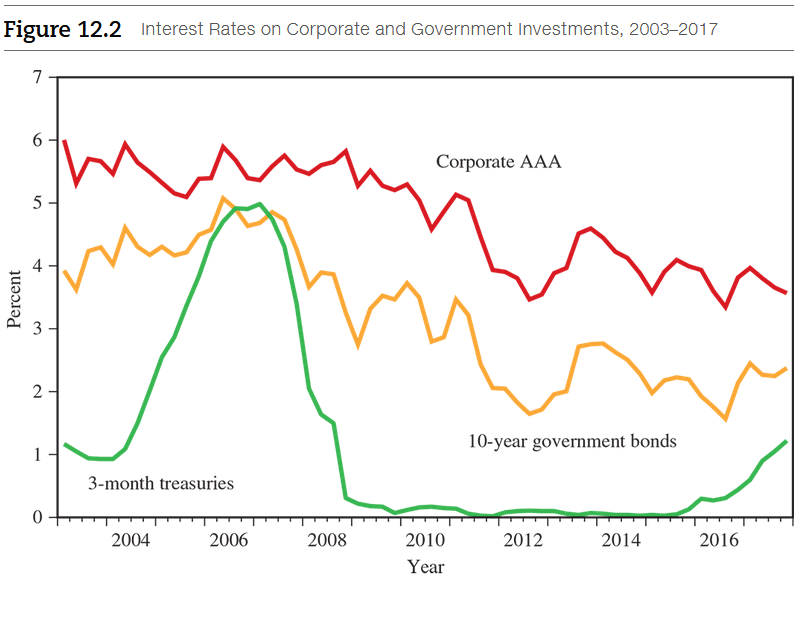
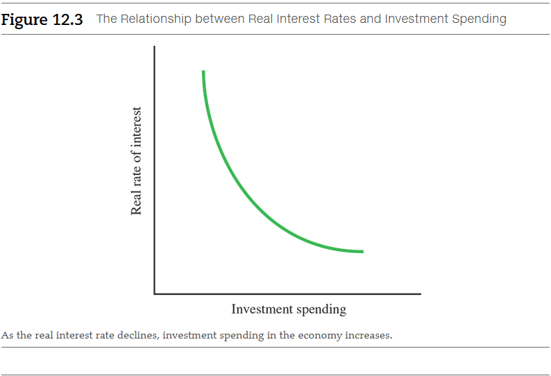
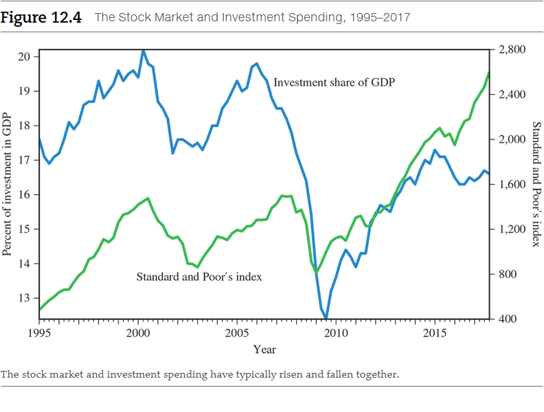
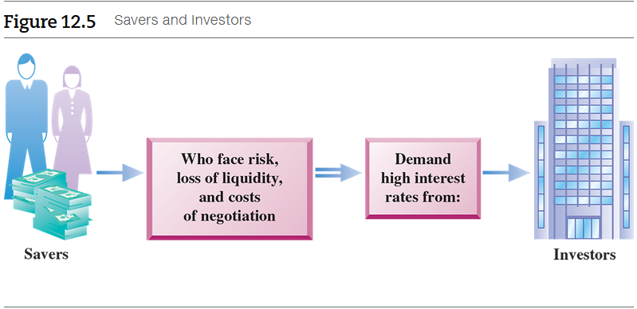
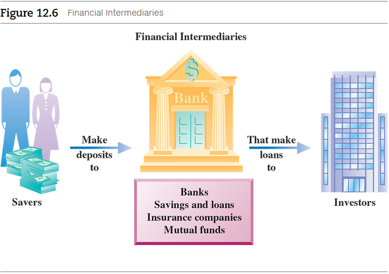

# Chapter 12: Investment and Financial Markets

**The housing market is a perfect example of the close links between investment
and finance.**

With the stock market falling sharply in 2000, housing looked like an
alternative and attractive investment. Interest rates were low and homeowners
and potential investors found that it was easy to borrow money to purchase new
or larger homes. Wall Street and government agencies developed ever more complex
ways to pour money into the housing market, and banks and finance companies did
not seem to be asking too many questions about their borrowers. As housing
prices continued to rise, the building industry responded to the general
euphoria. Investment in residential housing increased 40 percent in real terms
from 2000 to 2006.

It was too good to last. With all the new construction, the increased supply of
housing stopped the rise in prices. Some buyers made foolish decisions and took
on loans that were too large for their incomes. As financial markets became
nervous, lenders became more cautious and sharply cut back on funds available to
the market. With increased supply and reduced demand, housing prices began to
fall. The building industry recognized it had too many new houses in the
pipeline and began to cut back. From its peak in the first quarter of 2006 to
the fourth quarter of 2009, new housing construction fell by 53 percent. The
fall in residential housing alone brought down real GDP by 3 percent and
devastated many state economies. The lingering effects of the housing crisis
prevented a fast recovery from the recession.

An _investment_, broadly defined, is an action that creates a cost today but
provides benefits in the future.

## 12.1 An Investment: A Plunge into the Unknown

When individuals, firms, or governments make an investment, they incur costs
today in the hope of future gains. The phrase "hope of" is an important aspect
of investment decisions. That simply means that payoffs occurring in the future
cannot be known with certainty. Investments are a plunge into the unknown.

Firms and individuals frequently revise their outlook on the future precisely
because it is uncertain. These revisions can occur suddenly and lead to sharp
swings in investment spending. Sometimes investors are optimistic and decide to
increase their investment spending; at other times, they may quickly become
pessimistic and cut back on their investment spending. To estimate future
events, firms pay careful attention to the current pace of the economy. If
economic growth is sluggish, they are likely to forecast that it will be
sluggish in the future and cut back on investment spending. If economic growth
is strong, they are likely to forecast that it will remain so and increase their
investment spending. In other words, investment spending tends to be closely
related to the current pace of economic growth.

This phenomenon is known as the **accelerator theory** of investment spending.
It postulates that when real GDP growth is expected to be high, firms anticipate
that investing in plants and equipment will pay off later, so they increase
their total investment spending. However, John Maynard Keynes had another
theory. Keynes said the sharp swings in optimism and pessimism related to
investment spending were often irrational, reflecting, perhaps, our most basic,
primal instincts. He often referred to them as the “animal spirits” of
investors. It was, in part, animal spirits that led to the rise and fall in
residential investment that we discussed in the chapter-opening story.

<a name="accelerator-theory-term">**Accelerator theory**</a>

- The theory of investment that says that current investment spending depends
  positively on the expected future growth of real GDP.

It is likely that _both_ projections for the future _and_ Keynes's animal
spirits are closely associated with current investment. If this is the case, we
would expect investment spending to be a very volatile component of GDP. As
Figure 12.1 indicates, this is indeed the case.

- From 1970 to 2017, the share of investment as a component of GDP ranged from a
  high of 20 percent in 1978 to a low of 12 percent in 2009--a dramatic 8
  percentage point difference.
- Swings in investment spending often occurred over short periods of time. For
  example, during recessions (noted by the shaded areas in the figure),
  investment spending fell sharply. During booms, investment spending rose
  sharply. In other words, investment spending is highly **procyclical**; it
  increases during booms and falls during recessions.

<a name="procyclical-term">**Procyclical**</a>

- Moving in the same direction as real GDP.

Many different factors can contribute to uncertainty in the economy. Volatile
energy prices are one. In general, when the future is uncertain, firms become
cautious in their behavior and may postpone making investment decisions.

Although investment spending is a much smaller component of GDP than consumption
(approximately 68 versus 17 percent), it is much more volatile than consumption.
Recall that changes in the components of GDP--C, I, G, or NX--are amplified by
the multiplier. For example, if the multiplier is 1.5, and investment spending
initially falls by 1 percent of GDP, then GDP will fall by 1.5 percent. However,
if the fall in GDP makes firms more pessimistic, they may cut investment even
further. This further cut in investment will decrease GDP even more. That is, a
small initial fall in investment can trigger a much larger fall in GDP. Nobel
Laureate Paul Samuelson described this phenomenon of investment volatility by
developing the multiplier-accelerator model. The multiplier-accelerator model
showed that a downturn in real GDP leads to an even sharper fall in investment,
which further reduces GDP via the multiplier.

<a name="multiplier-accelerator-model-term">**Multiplier-accelerator model**</a>

- A model in which a downturn in real GDP leads to a sharp fall in investment,
  which triggers further reductions in GDP through the multiplier.

## 12.2 Evaluating the Future

### 12.2.1 Understanding Present Value

Suppose a good friend comes to you and says, "I need some cash, badly. If you
give me \$100 today, I can give you back \$105 next year. Do we have a deal?"
How would you decide whether to accept this deal? Somehow, you need a tool to be
able to compare dollars today with dollars received in the future. That tool is
present value. The present value of a payment to be received in the future is
the maximum amount a person is willing to pay today to receive the future
payment. Recall the principle of opportunity cost.

[📑 Principle of Opportunity Cost](../../../spring-2020/ECON-121/notes/ch-2.md#principle-of-opportunity-cost)

<a name="present-value-term">**Present value**</a>

- The maximum amount a person is willing to pay today to receive a payment in
  the future.

Let's think about how much you are willing to pay for the right to receive \$105
in 1 year. Suppose you can earn 5 percent per year in a savings account or money
market account. A moment of thought will show you that you would be willing to
lend your friend \$100. Here is why: If you kept your \$100 in the bank at 5
percent interest, you would have \$105 at the end of the year--just the amount
your friend would repay you. While you would have sacrificed \$5 in interest,
you would have earned \$5 on the loan $(\$105 − \$100)$.

However, you would not want to lend your friend more than \$100. If you lent
more--say, \$102--then your loss in interest of \$5.10 (5 percent of \$102)
would be greater than your \$3 gain on the loan $(\$105 − \$102)$. In this case,
the amount you sacrifice will be greater than what you get in return.

Of course, you would like to lend your friend less than \$100 and make even more
profit. But the _maximum amount_ you would be willing to pay today to receive
\$105 next year, when the interest rate is 5 percent, is \$100. Thus, the
present value of \$105 in this example is \$100.

#### Present Value and Interest Rates

Here is another useful way to think of present value. Suppose you want to buy a
new car in 5 years for \$20,000. You want to know how much you need to have in
your bank account today, so that after 5 years you have the \$20,000 to make the
payment for the car. A simple formula can answer this and similar questions. If
$K$ is an amount of money at some point in the future; $t$ is the amount of
time, or years, in the future until you need the money; and i is the interest
rate you earn on your account, then the amount you need today is just the
present value of the $K$ dollars, which is

$$
\text{ present value } = \frac{K}{(1 + i)^{t}}
$$

In the example of your friend, her payment ($K$) is \$105, the interval of time
($t$) in which she's going to pay it is 1 year, and the interest rate ($i$) is 0.05.
Using the present value formula, the present value of \$105 in 1 year is $100:

$$
\text{ present value } = \frac{\$105}{(1 + 0.05)^{1}} = \$100
$$

This is the maximum amount you are willing to lend her today to receive \$105
from her in 1 year.

Let's consider another example. Suppose the interest rate were 10 percent and
you were offered \$1,000 to be paid to you in 20 years. How much is that \$1,000
worth today? That is, how much of your money today would you be willing to "tie
up" (loan out) to get \$1,000 in 20 years? At an interest rate of 10 percent,
this is how much:

$$
\text{ present value } = \frac{\$1,000}{(1 + 0.10)^{2}} = \$148.64
$$

You would be willing to pay only \$148.64 today to receive \$1,000 in 20 years.

Returning to our original example with your friend, what happens if the interest
rate is 10 percent instead of 5 percent? If your friend still promises you \$105
after 1 year but the interest rate is double, how much would you be willing to
loan her today? Using the formula, you would loan only \$95.45 today:

$$
\text{ present value } = \frac{\$105}{(1 + 0.10)^{1}} = \$95.45
$$

What this means is that if the interest rate is higher, you will be willing to
pay _less_ for the same payment in the future.

Let's summarize our discussion of present value:

1. The present value--the value today--of a given payment in the future is the
   maximum amount a person is willing to pay today for that payment.
2. As the interest rate increases, the opportunity cost of your funds also
   increases, so the present value of a given payment in the future falls. In
   other words, you need less money today to get to your future "money goal."
3. As the interest rate decreases, the opportunity cost of your funds also
   decreases, so the present value of a given payment in the future rises. In
   other words, you need more money today to get to your money goal.

### 12.2.2 Real and Nominal Interest Rates

[📑 The Real-Nominal Principle](../../../spring-2020/ECON-121/notes/ch-2.md#the-real-nominal-principle)

When there is inflation, economists make a distinction between the interest rate
quoted in the market, which is called the **nominal interest rate**, and the
**real interest rate**, which is what you actually earn after taking account of
inflation. The real interest rate is defined as the nominal interest rate minus
the inflation rate:

<a name="nominal-interest-rate-term">**Nominal interest rate**</a> - Interest
rate quoted in the market. 
<a name="real-interest-rate-term">**Real interest rate**</a> - The nominal
interest rate minus the inflation rate. 

$$
\text{ real rate } = \text{ nominal rate } - \text{ inflation rate }
$$

If the nominal rate of interest is 6 percent per year and the inflation rate is
4 percent during the year, the real rate of interest is 2 percent $(6−4)$.

Let's see what happens when you borrow money. Suppose you borrow \$100 at a 10
percent annual interest rate, but inflation is 6 percent during the year. At the
end of the year, you must pay back \$110 $(\$100 \times 1.10)\$. But with an
inflation rate of 6 percent, the lender would need \$6 of the \$10 you paid in
interest just to keep up with inflation. That means the lender would effectively
get just a \$4 gain $(\$10 − \$6)$, instead of the full \$10 gain. Thus, when
corrected for the effects of inflation, the real rate of interest you will have
to pay is just 4 percent, or \$4, on the original \$100 loan.

As an example, in 2002 if seniors invested their money in 3-month U.S.
government Treasury bills, they would have earned an average interest rate of
1.6 percent. However, inflation, as measured by the Consumer Price Index, was
2.4 percent. In real terms, these seniors would have actually lost money during
the year, earning a negative real rate of interest of $−0.8$ percent.

We defined the real interest rate as the nominal interest rate minus the actual
inflation rate. When firms or individuals borrow or lend money, they do not know
what the rate of inflation will actually be in the future. Instead, they must
form an expectation--an estimate--of what they believe the inflation rate will
be. For a given nominal interest rate, we can define the **expected real
interest** rate as the nominal interest rate minus the expected inflation rate.
The expected real interest rate is the rate at which borrowers or lenders expect
to make transactions.

<a name="expected-real-interest-rate-term">**Expected real interest rate**</a>

- The nominal interest rate minus the expected inflation rate.

## 12.3 Understanding Investment Decisions

Now that we understand the concept of present value and interest rates, we can
use these tools to understand investment decisions. Consider a project we have
to pay for today in order to benefit in the future. Here is the simple
investment rule for such a project: Invest in a project if the cost you incur
today is less than or equal to the present value of the future payments from the
project.

In our first present-value example, the "project" (the loan to your friend) pays
\$105 in 1 year, and the present value (with an interest rate of 5 percent) is
\$100. Because the cost of the project is also \$100, the project is worthwhile.

Consider a more complicated project that pays \$110 in year 1 and in year 2. The
interest rate is 10 percent. The present value of the benefits from this project
is

$$
\text{ present value } = \frac{\$110}{(1 + 0.10)} + \frac{\$110}{(1.10)^{2}} = \$191
$$

As long as the cost of the project today is less than \$191, it pays to invest
in it.

We can use our theory to develop the relationship between investment spending
and the real rate of interest in the economy. In the economy as a whole,
millions of different investment projects can be undertaken, nearly all
providing different returns. Consider the array of investments A through E in
Table 12.1. Each project costs \$100 in the current period and provides a return
one period later. The returns are expressed in real terms; that is, they have
been adjusted for inflation.

> **Table 12.1:** Return on Investment by Project

| Project | Cost | Returns |
|---------|------|---------|
| A       | $100 | $101    |
| B       | 100  | 103     |
| C       | 100  | 105     |
| D       | 100  | 107     |
| E       | 100  | 109     |

Let's look at the present value of these investments at various interest rates.
At an interest rate of 2 percent per year, only investment A is unprofitable.
For the other investments, the present value of the return exceeds the cost. If
the interest rate in the market increases to 4 percent, both A and B will be
unprofitable. At an interest rate of 6 percent, A, B, and C will be
unprofitable; D will be unprofitable as well if the market interest rate
increases to 8 percent. If the interest rate exceeds 9 percent, all the
investments will be unprofitable.

As interest rates rise, there will be fewer profitable investments in which
firms are willing to invest, and the total level of investment spending in the
economy will decline. Figure 12.3 depicts the negative relationship, graphically
represented as the downward-sloping line, between real interest rates and
investment. As the graph indicates, high real interest rates will deter
investment spending. As an example, during the early 1980s when real interest
rates rose, business investment dropped sharply.

In practice, firms need to take into account other factors besides interest
rates in making their investment decisions. In the **neoclassical theory of
investment**, pioneered by Dale Jorgenson of Harvard University, taxes along
with real interest rates play a key role in determining investment spending.
Jorgenson used his theory to analyze how investors respond to a variety of tax
incentives, including investment tax credits.

<a name="neoclassical-theory-of-investment-term">**Neoclassical theory of investment**</a>

- A theory of investment that says both real interest rates and taxes are
important determinants of investment.

Should we use a real or nominal interest rate to determine whether to invest?
The answer is that it doesn't really matter, as long as we are consistent. If
the future benefits of the project are not adjusted for inflation, then we
should use the nominal interest rate because it takes into account overall
inflation--inflation is built into the nominal rate, so to speak. But if we
first express the future benefits of the investment in current dollars--that is,
if we reduce their nominal value by the amount that prices in the economy are
expected to increase--then we should use the real rate of interest in our
calculations.

#### Investment and the Stock Market

Economists have long noticed a correlation between the stock market and
investment spending. All other things being equal, when the level of the stock
market is high, investment spending also tends to be high. It makes sense that
the two are related. Consider a firm's options when it wants to finance a new
project. The firm really has three choices: First, it can rely on its **retained
earnings**--the earnings the firm hasn't paid out in divi- dends to its owners.
Second, it can borrow funds from a bank or sell **corporate bonds** to the
public.  Third, it can issue and sell new shares, or stock. When a firm's stock
price is high, it can issue shares at a premium and use the proceeds from their
sale to finance new investments. The higher the share price, the fewer shares
the firm needs to sell to raise capital. This means, essentially, that the cost
of the project the firm wants to undertake falls as the company's stock price
climbs.  In other words, high stock prices lead to high investment. This is
known as the **Q-theory of investment**, and it was originally developed by the
late Nobel Laureate James Tobin of Yale University. In the boom of the late
1990s when the level of the stock market was high along with share prices, many
firms financed large investments by selling their shares.

<a name="retained-earnings-term">**Retained earnings**</a> - Corporate earnings
that are not paid out as dividends to their owners. 
<a name="corporate-bonds-term">**Corporate bonds**</a> - A bond sold by a
corporation to the public in order to borrow money. 
<a name="q-theory-of-investment-term">**Q-theory of investment**</a> - The
theory of investment that links investment spendings to stock prices. 

During roughly this same time period, the stock market and investment spending
appeared to be even more tightly linked than in the past. Figure 12.4 plots the
Standard and Poor's index of stock prices on the same graph as the share of
investment spending as a component of GDP from 1995 to 2017. Looking at a
historical example, both the stock market and investment spending rose sharply
from 1997, peaking in mid-2000. They then both fell sharply--the stock market
plunged, investment spending fell, and the economy entered a recession. This is
a typical pattern. We can also see a sharp rise and fall in both series in 2006
to 2007.

## 12.4 How Financial Intermediaries Facilitate Investment

Households save and invest their funds for different reasons than firms. A
typical couple might be saving money for their retirement or for their
children's education, and they generally won't like the idea of their savings
being subject to risk. They do, however, want their savings to be readily
accessible and convertible to money--what economists call **liquid**--in case
they have a financial emergency. Funds deposited in a bank account, for example,
provide a source of liquidity for households because they can be withdrawn at
any time.

<a name="liquid-term">**Liquid**</a>

- Easily convertible into money on short notice.

Suppose individual entrepreneurs had to obtain funds directly from individual
savers. First, they would have to negotiate with thousands of people to obtain
sufficient funds. This would take a lot of time and be costly. Second, the
savers would face extraordinarily high risks if they loaned all their money to a
single entrepreneur who had a risky project to undertake. Not only would all
their funds be tied up in a single project, it would not be easy to monitor the
investor's decisions. How could they be certain the entrepreneur wouldn't run
off with their money? Additionally, their investments would not be liquid. To
compensate these savers for the risk they would be taking and the lack of
liquidity they would face, entrepreneurs would have to pay them extremely high
interest rates, but higher interest rates would make it harder, perhaps
impossible, for the entrepreneur to make a profit. No prospect of profits would
mean no one would invest in the project in the first place. In other words,
society would not be able to turn its savings into profitable investment
projects. Figure 12.5 depicts this dilemma. How can the problem be solved?

The answer is through financial intermediaries. **Financial intermediaries**
include banks, savings and loans, insurance companies, brokerage firms,
companies that run mutual funds, and other types of financial institutions.
These institutions accept funds from savers and make loans to businesses and
individuals. For example, a local bank accepts deposits from savers and uses the
funds to make loans to local businesses. Savings and loan institutions will
accept deposits in savings accounts and use these funds to make loans, often for
housing. Insurance companies accept premium payments from individuals in
exchange for the protection provided by the insurance payments. Then insurance
companies lend the premiums received to earn returns from investments so they
can pay off the insurance claims of individuals. Figure 12.6 shows how financial
intermediaries create a valuable link between savers and investors. Pooling the
funds of savers to make loans to individual borrowers reduces the costs of
negotiation. Financial institutions also have more expertise to evaluate and
monitor investments than most individual investors.

<a name="financial-intermediaries-term">**Financial intermediaries**</a>

- Organization that receive funds from savers and channel them to investors.

To some degree, these financial intermediaries also provide liquidity. In normal
circumstances, not all households withdraw their money at the same time, so
financial intermediaries can lend out most of the money and still have enough on
hand to meet withdrawals by depositors.

But how do financial intermediaries reduce risk? They do this by diversifying
investors' assets--by not putting "all the eggs in one basket," so to speak.
Intermediaries invest (that is, make loans) in a large number of projects whose
returns, although uncertain, are independent of one another. By independent, we
mean the return from one investment is unrelated to the return on another
investment. Consider a bank investing in a large number of projects that all
together produce an average return of 8 percent annually. Each project alone is
risky and could pay a return either higher or lower than 8 percent. However, as
long as the returns on all these projects are independent of one another, those
with higher returns will likely offset those with lower returns. By investing in
a large number of projects, the bank increases the odds that as a group the
projects will earn 8 percent.

In recent years, we have seen an innovation in financial intermediation. In the
past, if a savings and loan company made a loan to a home purchaser, it would
hold onto the loan until it was paid off. That meant the savings and loan could
make new loans or mortgages only if it was able to attract new deposits to
provide the funds.

Two large government-sponsored financial intermediaries, Fannie Mae and Freddie
Mac, changed the way mortgage markets operated. They purchased mortgages from
savings and loans and banks throughout the country, packaged them, and sold them
to investors in the financial market. This enabled savings and loans to offer
additional mortgages with the funds they received from Fannie Mae or Freddie
Mac, and it allowed investors to own a part of a diversified collection of
mortgages from around the country. The private sector quickly adopted these
practices as well.

The practice of purchasing loans, repackaging them, and selling them to the
financial markets is known as **securitization**. Although it started with home
mortgages, securitization now applies to other types of financial obligations,
such as credit card and consumer debt. Financial intermediaries will often
borrow money from financial markets to purchase loans in order to repackage and
sell them. Using borrowed funds to purchase assets is known as **leverage**.
Increases in leverage increase the risk that financial intermediaries undertake
because they are obligated to pay off the funds they have borrowed, regardless
of the actual performance of the assets they have purchased.

<a name="securitization-term">**Securitization**</a> - The practice of
purchasing loans, repackaging them, and selling them to the financial markets. 
<a name="leverage-term">**Leverage**</a> - Using borrowed funds to purchase
assets. 

#### When Financial Intermediaries Malfunction

Financial intermediation can sometimes go wrong. When it does, the economy
suffers. Important examples of the failure of financial intermediation include
commercial bank failures during the Great Depression, the U.S. savings and loan
crisis of the 1980s, a similar crisis in Japan in the 1990s, and the U.S.
housing credit and securitization crisis of 2007 and 2008.

In the early days of the Great Depression, many banks in the United States,
particularly in rural areas, provided farmers and local businesses with loans
that turned out to be unprofitable. This worried depositors, and rumors
circulated that banks would fail. Depositors panicked, and many tried to
withdraw their money simultaneously in what is called a **bank run**. During the
Great Depression, bank runs occurred throughout the world. In 1931, a panic
broke out after the collapse of Creditanstalt, Austria's largest bank. Banking
panics occurred throughout other countries in Europe, including Belgium, France,
Germany, Italy, and Poland.

<a name="bank-run-term">**Bank run**</a>

- Panicky investor simultaneously trying to withdraw their funds from a bank
they believe may fail.

Few banks, profitable or unprofitable, can survive a run because not all
deposits are kept on hand. The result of the bank runs was that thousands of
healthy U.S. banks shut down, leaving large parts of the United States without a
banking system. Many farms and businesses could no longer find a source of
loans, and the severity of the Great Depression worsened. Studies have shown
that the countries with the most severe banking panics were hardest hit by the
Depression.

To prevent banking panics from happening again, in 1933 the U.S. government
began providing **deposit insurance** on money placed in banks and savings and
loans. Today deposit insurance guarantees the government will reimburse
depositors for amounts up to \$250,000 in each account at each bank should their
banks fail. Because everyone knows their deposits are secure, bank runs no
longer regularly occur. Today, most countries have some form of deposit
insurance intended to prevent panics.

<a name="deposit-insurance-term">**Deposit insurance**</a>

- Federal government insurance on deposits in banks and savings and loans.

## Chapter Summary

In this chapter, we discussed investment spending, present value, interest
rates, and financial intermediaries. We saw that investment spending is
volatile, rising and falling sharply with real GDP, and depends on expectations
about the future. By developing the concept of present value, we saw how firms
can make investment decisions when the costs and benefits of an investment occur
at different times. We also explained why investment spending also depends
inversely on real interest rates and explained the distinction between real and
nominal interest rates. Finally, we examined how financial intermediaries
channel funds from savers to investors, reduce interest rates, and promote
investment--and sometimes malfunction. Here are the main points to keep in mind:

1. Investments incur costs today but provide benefits in the future.  
2. Investment spending is a volatile component of GDP because expectations about
   the future are uncertain and ever changing.
3. We use the concept of _present value_ to compare the costs and benefits of
   investments that occur at different points in time. The present value of a
   payment $K$, $t$ years in the future, at an interest rate of $i$ is

$$
\text{ present value } = \frac{K}{(1 + i)^{t}}
$$

4. The _real interest_ rate equals the _nominal interest_ rate minus inflation.
5. Investment spending depends inversely on real interest rates.
6. _Financial intermediaries_ reduce the risk and costs of making investments by
   pooling the funds of savers and monitoring the projects of borrowers.
   Financial intermediaries can package loans for sale to the broader financial
   markets through _securitization_.
7. While financial intermediaries do make the economy more efficient, they can
   break down at times, causing severe economic disruptions.

 

# Resources

- [📑 Principle of Opportunity Cost](../../../spring-2020/ECON-121/notes/ch-2.md#principle-of-opportunity-cost)
- [📑 The Real-Nominal Principle](../../../spring-2020/ECON-121/notes/ch-2.md#the-real-nominal-principle)

Textbook

- Macroeconomics: Principles/Applications/Tools, 10e by Arthur O'Sullivan,
  Steven Sheffrin, Stepehn Perez

