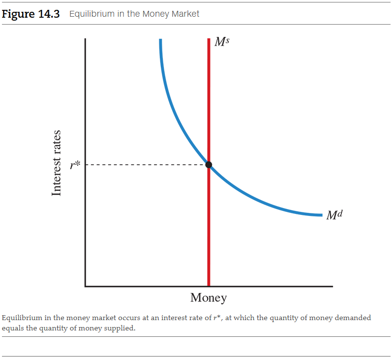
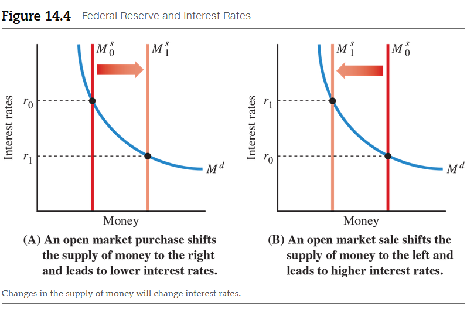
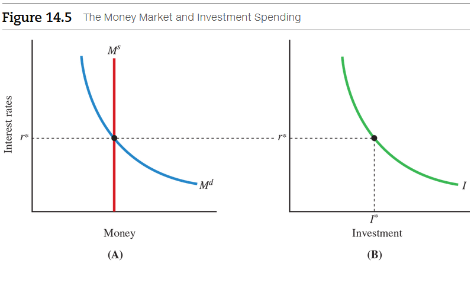

# Chapter 14: The Federal Reserve and Monetary Policy

The **money market** is the market for money where the amount supplied and the
amount demanded meet to determine the nominal interest rate. Recall that the
nominal interest rate is the stated or quoted interest rate before adjusting for
inflation. We begin by learning the factors that determine the public's demand
for money. Once we understand what affects the demand for money, we can see how
the actions of the Federal Reserve determine the supply of money. Then, we see
how the demand and supply of money together determine interest rates.

<a name="money-market-term">**Money market**</a>

- The market for money in which the amount supplied and the amount demanded meet
  to determine the nominal interest rate.

## 14.1 The Demand for Money

Let's think of money as simply one part of wealth. Suppose your total wealth is
valued at \$1,000. In what form will you hold your wealth? Should you put all
your wealth into the stock market? Or perhaps into the bond market? Or should
you hold some of your wealth in money--that is, currency and deposits in
checking accounts?

### 14.1.1 Interest Rates Affect Money Demands

If you invest in assets such as stocks or bonds, you will generally earn income
on them. _Stocks_ are shares in the ownership of a corporation. There are two
sources of income from stocks: dividends paid to their owners out of the profits
of the corporation, and the typical increase in their value over time. _Bonds_
are loans that are repaid with interest. Thus, both stocks and bonds provide
returns to investors. If you hold your wealth in currency or in a checking
account, however, you will receive either no interest or very low interest. And
if inflation rises sharply, you might even lose money. Holding your wealth as
money in currency or a checking account means you sacrifice some potential
income.

Money does, however, provide a valuable service. It facilitates transactions. If
you go to a grocery store to purchase cereal, the store will accept currency or
a check, but you won't be able to pay for cereal with your stocks and bonds.
People hold money primarily for this basic reason: Money makes it easier to
conduct everyday transactions.  Economists call this reason for holding money
the **transaction demand for money**.  To understand the demand for money, we
rely on the principle of opportunity cost.

<a name="transaction-demand-for-money-term">**Transaction demand for money**</a>

- The demand for money based on the desire to facilitate transactions.

The opportunity cost of holding money is the return you could have earned by
holding your wealth in other assets. We measure the opportunity cost of holding
money by the interest rate. Suppose the interest rate available to you on a
long-term bond is 6 percent per year. If you hold \$100 of your wealth in the
form of this bond, you'll earn \$6 a year. If you hold currency instead, you'll
earn no interest. So, the opportunity cost of holding \$100 in currency is \$6
per year, or 6 percent per year.

As interest rates increase in the economy, the opportunity cost of holding money
also increases. Economists have found that as the opportunity cost of holding
money increases, the public demands less money. The quantity demanded of money
will decrease with an increase in interest rates.

In Figure 14.1, we draw a demand for money curve, $M^{d}$, as a function of the
interest rate. At higher interest rates, individuals will want to hold less
money than they will at lower interest rates because the opportunity cost of
holding money is higher. As interest rates rise from $r_{0}$ to $r_{1}$, the
quantity of money demanded falls from $M^{0}$ to $M^{1}$.

### 14.1.2 Other Components of Money Demand

Traditionally, economists have identified other motives besides transactions for
individuals or firms to hold money. If you hold your wealth in the form of
property, such as a house or a boat, it is costly to sell it on short notice if
you need to obtain funds. These forms of wealth are **illiquid**, meaning that
they are not easily transferable into money. If you hold your wealth in currency
or checking accounts, you do not have this problem. Economists recognize that
people have a **liquidity demand for money**; they want to hold money to make
transactions on quick notice.

<a name="illiquid-term">**Illiquid**</a> - Not easily transferable to money. 
<a name="liquidity-demand-for-money-term">**Liquidity demand for money**</a> -
The demand for money that represents the needs and desires individuals and firms
have to make transactions on short notice without incurring excessive costs. 

During periods of economic volatility, investors might not want to hold stocks
and bonds because their prices might fall. Instead, they might convert them into
holdings that fall into the M2 category, such as savings accounts and money
market funds. These investments earn lower interest rates on average, but are
less risky than stocks and bonds, whose prices can fluctuate. This demand for
safer assets is called the **speculative demand for money**. For example, after
the stock market began to fall in 2000, individuals became very uncertain about
the future and shifted their funds from the stock market to money market mutual
funds. This shift of assets from stocks to money temporarily increased M2. When
the market started to recover, some investors shifted funds back into the stock
market.

<a name="speculative-demand-for-money-term">**Speculative demand for money**</a>

- The demand for money that arises because holding money over short periods is
  less risky than holding stocks or bonds.

## 14.2 How the Federal Reserve Can Change the Money Supply

### 14.2.1 Open Market Operations

The Fed can increase or decrease the total amount of reserves in the banking
system through **open market operations**, which are the purchase or sale of
U.S.  government securities by the Fed. There are two types of open market
operations:

- In **open market purchases**, the Fed buys government bonds from the private
  sector.
- In **open market sales**, the Fed sells government bonds to the private
  sector.

<a name="open-market-operations-term">**Open market operations**</a> - The
purchase or slae of U.S. government securities by the Fed. 
<a name="open-market-purchases-term">**Open market purchases**</a> - The Fed's
purchase of government bonds from the private sector. 
<a name="open-market-sales-term">**Open market sales**</a> - The Fed's sale of
government bonds to the private sector. 

To understand how the Fed can increase the supply of money, let's trace what
happens after an open market purchase.  Suppose the Federal Reserve purchases
\$1 million worth of government bonds currently owned by the private sector. The
Fed writes a check for \$1 million and presents it to the party who sold the
bonds. The Federal Reserve now owns those bonds. The party who sold the bonds
then deposits the \$1 million in its bank.

Here is the key to how the supply of money increases when the Fed purchases
government bonds: As we explained in the last chapter, each bank must keep an
account with the Fed containing both its required and excess reserves. The check
written against the Federal Reserve increases the bank's total reserves,
essentially giving it more money to loan out. In this case, the bank's account
balance increases by \$1 million. If the reserve requirement is 10 percent, the
bank must keep \$100,000 in reserves, but it can now loan out \$900,000 from its
excess reserves. Basically, when the Fed buys bonds, the proceeds go out into
the economy. Open market purchases of bonds therefore increase the money supply.

The Federal Reserve has powers that ordinary citizens and even banks do not
have. The Fed can write checks against itself to purchase government bonds
without having any explicit "funds" in its account for the purchase. Banks
accept these checks because they count as part of their total reserves.

As you might expect, open market sales will, conversely, decrease the supply of
money.  Suppose the Federal Reserve sells \$1 million worth of government bonds
to a Wall Street firm. The firm will pay for the bonds with a check for \$1
million drawn on its bank and give this check to the Federal Reserve. The bank
must either hand over \$1 million in cash or, more likely, reduce its total
reserves with the Federal Reserve by \$1 million. When the Fed sells bonds, it
is basically taking the money exchanged for them out of the hands of the public.
Open market sales therefore decrease the money freely available in the economy.

### 14.2.2 Other Tools of the Fed

Open market operations are the most important way in which the Federal Reserve
changes the supply of money. There are four other ways in which the Fed can
change the supply of money, which we discuss next.

Traditionally, open market operations have been the most important way in which
the Federal Reserve has changed the supply of money. After the financial crisis,
the Fed started to pay interest on reserves and banks dramatically increased
their holdings of excess reserves. In this setting, five other tools to increase
the money supply and change interest rates can be very important.

#### Changing Reserve Requirements

Another way the Fed can change the money supply is by changing the reserve
requirements for banks. If the Fed wishes to increase the supply of money, it
can reduce banks' reserve requirements, so they have more money to loan out.
This would expand the money supply. To decrease the supply of money, the Federal
Reserve can raise reserve requirements.

Changing reserve requirements is a powerful tool, but the Federal Reserve
doesn't use it very often because it disrupts the banking system. Suppose a bank
is required to hold exactly 10 percent of its deposits as reserves and has
loaned the other 90 percent out. If the Federal Reserve suddenly increases its
reserve requirement to 20 percent, the bank would be forced to call in or cancel
many of its loans. Its customers would not like this! Today, the Fed doesn't
make sharp changes in reserve requirements. It did in the past, including during
the Great Depression, because it mistakenly believed that the banks were holding
too much in excess reserves. Banks, however, were holding additional reserves
because they wanted to protect themselves from bank runs. As a result, after the
increase in required reserves, banks increased their reserves even more, further
reducing the supply of money to the economy.

#### Paying Interest on Reserves

Since 2008, the Fed has paid interest on required and excess reserves that banks
hold. By paying interest on reserves, the Fed can affect the willingness of
banks to hold reserves. Higher interest payments on reserves will lead banks to
hold more reserves, thereby reducing the money supply. Conversely, lower
interest payments will lead to fewer reserves and an increased money supply.
This tool has now become the single most important one that the Fed uses to
change interest rates.

#### Changing the Discount Rate

A third way the Fed can change the money supply is by changing the _discount
rate_. The **discount rate** is the interest rate at which banks can borrow
directly from the Fed. Suppose a major customer asks for a large loan from a
bank that has no excess reserves. Unless the bank can find an additional source
of funds, it will not be able to make the loan. Banks are reluctant to turn away
major customers.  They first try to borrow reserves from other banks through the
**federal funds market**, a market in which banks borrow and lend reserves to
and from one another. If the rate--called the **federal funds rate**--seems too
high to the bank, it could borrow directly from the Federal Reserve at the
discount rate. By changing the discount rate, the Federal Reserve can influence
the amount of borrowing by banks. If the Fed raises the discount rate, banks
will be discouraged from borrowing reserves because it costs more.  Lowering the
discount rate will induce banks to borrow additional reserves.

<a name="discount-rate-term">**Discount rate**</a> - The interest rate at which
banks can borrow from the Fed. 
<a name="federal-funds-market-term">**Federal funds market**</a> - The market in
which banks borrow and lend reserves to and from one another. 
<a name="federal-funds-rate-term">**Federal funds rate**</a> - The interest rate
on reserves that banks lend each other. 

## 14.3 How Interest Rates Are Determined: Combining the Demand and Supply of Money

Combining the demand for money, determined by the public, with the supply of
money, determined by the Fed, we can see how interest rates are determined in
the short run in a demand-and-supply model of the money market.

Figure 14.3 depicts a model of the money market. The supply of money is
determined by the Federal Reserve, and we assume for simplicity that it is
independent of interest rates. We represent this independence by a vertical
supply curve for money, $M^{s}$. In the same graph, we draw the demand for money
$M^{d}\$. Market equilibrium occurs where the demand for money equals the supply
of money, at an interest rate of $r^{*}$.

At this equilibrium interest rate $r^{*}$, the quantity of money demanded by the
private sector equals the quantity of money supplied by the Federal Reserve.
What happens if the interest rate is higher than $r^{*}$? At a higher interest
rate, the quantity of money demanded will be less than the fixed quantity
supplied, so there will be an excess supply of money. In other markets, excess
supplies cause the price to fall. The same result happens here. The "price of
money" in the market for money is the interest rate. If the interest rate were
below $r^{*}$, the demand for money would exceed the fixed supply: There would
be an excess demand for money. As in other markets when there are excess
demands, the price rises.  Here, the price of money or the interest rate would
rise until it reached $r^{*}$. As you can see, money-market equilibrium follows
the same logic as any other economic equilibrium.

we can use this simple model of the money market to understand the power of the
Federal Reserve. Suppose the Federal Reserve increases the money supply through
an open market purchase of bonds. In Panel A of Figure 14.4, an increase in the
supply of money shifts the money supply curve to the right, leading to lower
interest rates. A decrease in the money supply through the Fed's open market
sale of bonds, as depicted in Panel B of Figure 14.4, decreases the supply of
money, shifting the money supply curve to the left and increasing interest
rates.

We can also think of the process from the perspective of banks. Recall our
discussion of money creation through the banking system. After the Fed's open
market purchase of bonds, some of the money the Fed paid for the bonds gets
deposited into banks. Banks will want to make loans to consumers and businesses
with that money because holding it in their reserves with the Fed earns them no
interest. To entice people to borrow, banks will lower the interest rates they
charge on their loans. After an open market purchase of bonds by the Fed,
interest rates will fall throughout the entire economy.

### 14.3.1 Interest Rates and Bond Prices

To see why, recall that bonds represent a promise to pay money in the future. If
you own a bond, you are entitled to receive payments on it at a later time. But
why do the prices of bonds move in the opposite direction of interest rates?

Because a bond payment occurs in the future, we need to use the concept of
present value from Chapter 12 to determine the value of this payment today. The
price of a bond is simply the present value of its future payments. Consider a
bond that makes a payment one period in the future. The price of the bond--the
present value of the payment--is equal to

$$
\text{ price of bonds } = \frac{\text{ promised payment }}{1 + \text{ interest rate }}
$$

That is, the price of a bond is the payment promised, divided by one plus the
interest rate.

Suppose the promised payment next year is \$106 and the interest rate is 6
percent per year. The price of the bond will be

$$
\text{ price of bonds } = \frac{\$106}{1.06} = \$100
$$

In this case, the bond would cost \$100 if it were issued today. But what
happens if interest rates in the economy change later? What if rates rise higher
than 6 percent or fall lower than 6 percent? What will the bond you are holding
be worth then, if you decided, for example, you needed the money and had to sell
it to someone else? This is an important question because most of the bonds for
sale on the market are not newly issued bonds--they are bonds that have already
been issued with specific promised payments that people are buying and selling
from one another.

Let's consider two examples:

- Suppose the promised payment is still \$106, but the interest rate falls from
  6 to 4 percent per year. Using the formula, the price of the bond will rise to
  \$106/1.04, or \$101.92--\$1.92 more than it was with an interest rate of 6
  percent. The price of the bond rose because, at the lower interest rate of 4
  percent, a buyer will need more money--\$101.92 versus \$100--to get the same
  \$106 the bond will pay next year.  In other words, at a lower interest rate
  the value today of a future payment (its present value) is higher.
- Now suppose interest rates rise from 6 to 8 percent per year. In this case,
  the price you could sell your bond for will fall to \$106/1.08, or \$98.15. The
  reason the price falls is that a buyer would need only \$98.15 to get the
  \$106 next year.  As interest rates rose, the price of the bond fell. In other
  words, at a higher interest rate, the value today of a future payment (its
  present value) is lower.

#### How Open Market Operations Directly Affect Bond Prices

There is another way to understand why when bond prices change in one direction,
interest rates will change in the opposite direction. We know that when the
Federal Reserve buys bonds in the open market, interest rates fall. But think
about what the Federal Reserve is doing when it conducts the open market
purchase. The Federal Reserve is buying bonds from the public. As the Fed buys
bonds, it increases the demand for bonds and raises their price. This is another
reason bond prices rise as interest rates fall.

Similarly, interest rates rise following an open market sale of bonds by the
Fed. When the Fed conducts an open market sale, it is selling bonds, increasing
the supply of bonds in the market.  With an increase in the supply of bonds, the
price of bonds will fall.

Because the Federal Reserve can change interest rates with open market purchases
and sales and thereby affect the price of bonds, you can now see why Wall Street
firms typically hire Fed watchers (often former officials of the Federal
Reserve) to try to predict what the Fed will do. If a Wall Street firm correctly
predicts the Fed will surprise the market and lower interest rates, the firm
could buy millions of dollars of bonds for itself or its clients prior to the
Fed's announcement and make vast profits as the prices of the bonds inevitably
rise.

#### Good News for the Economy is Bad News for Bond Prices

You may have heard on television or read in the newspaper that prices in the
bond market often fall in the face of good economic news, such as an increase in
real output. Are the markets perverse? Why is good news for the economy bad news
for the bond market?

We can understand the behavior of the bond market by thinking about the demand
for money. When real GDP increases, the demand for money will increase. As the
demand for money increases, the money demand curve will shift to the right. From
our model of the money market, we know that increased money demand will increase
interest rates. Bond prices move in the opposite direction from interest rates.
Therefore, good news for the economy is bad news for the bond market.

## 14.4 Interest Rates and How They Change Investment and Output (GDP)

Higher or lower interest rates are just a means to an end, though, for the Fed.
The Fed's ultimate goal is to change output--either to slow or speed the economy
by influencing aggregate demand.

To show how the Fed affects the interest rate, which in turn affects investment
(a component of GDP), and finally GDP itself, we combine our demand and supply
for money with the curve that shows how investment spending is related to
interest rates. This appears in Figure 14.5.  Panel A in Figure 14.5 shows how
interest rates are determined by the demand and supply for money. It is
identical to Figure 14.3, which we studied earlier. The graph shows us the
equilibrium interest rate for money. Now let's move to Panel B in Figure 14.5.
We can see that at the equilibrium interest rate $r^{*}$ the level of investment
in the economy will be given by $I^{*}$.

We should note that consumption as well as investment can depend on interest
rates. That is, spending on consumer durables, such as automobiles and
refrigerators, will also depend negatively on the rate of interest. Consumer
durables are really investment goods for the household: If you buy an
automobile, you incur the cost today and receive benefits, such as the ability
to use the car, in the future. As interest rates rise, the opportunity costs of
investing in an automobile will rise. Consumers will respond to the increase in
opportunity cost by purchasing fewer cars. In this chapter, we discuss how
changes in interest rates affect investment, but keep in mind that the purchases
of consumer durables are affected, too.

The equilibrium interest rate $r^{*}$ is determined in the money market. At that
interest rate, investment spending is given by $I^{*}$.

In Figure 14.6, we show the effects of an increase in the money supply using our
money market and investment graphs. As the supply of money increases, interest
rates fall from $r_{0}$ to $r_{1}$. With lower interest rates, investment
spending will increase from $I_{0}$ to $I_{1}$. This increase in investment
spending will then increase aggregate demand--the total demand for goods and
services in the economy--and shift the aggregate demand curve to the right.

We show the shift of the aggregate demand curve in Figure 14.7. With the
increase in aggregate demand, both output (y) and the price level (P) in the
economy as a whole will increase in the short run. Thus, by reducing interest
rates, the Fed affects output and prices in the economy.

In summary, when the Fed increases the money supply, it leads to lower interest
rates and increased investment spending. In turn, a higher level of investment
spending will ultimately lead to a higher level of GDP.

$$
\begin{array}{lllllllll}
  \text{open} &  & \text{increase} &  & \text{fall in} &  & \text{rise in} &  & \text{increase}\\
  \text{market} & \to & \text{in money} & \to & \text{interest} & \to & \text{investment} & \to & \text{in} \\
  \text{bond purchases} &  & \text{supply} &  & \text{rates} &  & \text{spending} &  & \text{GDP} \\
\end{array}
$$

The Fed can also use its influence to increase interest rates, which will have
the exact opposite effect. Investment spending will fall, along with aggregate
demand. The aggregate demand curve will shift to the left, and the price level
and output in the economy will fall, too. We can again represent this entire
sequence of events:

$$
\begin{array}{lllllllll}
  \text{open} &  & \text{decrease} &  & \text{rise in} &  & \text{fall in} &  & \text{decrease}\\
  \text{market sale} & \to & \text{in money} & \to & \text{interest} & \to & \text{investment} & \to & \text{in} \\
  \text{bond} &  & \text{supply} &  & \text{rates} &  & \text{spending} &  & \text{GDP} \\
\end{array}
$$

### 14.4.1 Monetary Policy and International Trade

Suppose the Federal Reserve lowers U.S. interest rates through an open market
purchase of bonds. As a result, investors in the United States will be earning
lower interest rates and will seek to invest some of their funds abroad. To
invest abroad, they will need to sell their U.S. dollars and buy the foreign
currency of the country where they intend to invest. This will affect the
**exchange rate**--the rate at which one currency trades for another currency in
the market. As more investors sell their dollars to buy foreign currency, the
exchange rate will fall. A fall in the exchange rate or a decrease in the value
of a currency is called **depreciation of a currency**. Lower U.S. interest
rates brought on by the Fed will cause the dollar to depreciate. This will
ultimately change the demand and supply of goods and services around the globe
because it will make U.S. goods cheaper than foreign goods. Let's see why.

<a name="exchange-rate-term">**Exchange rate**</a> - The price at which
currencies trade for one another in the market. 
<a name="depreciation-of-a-currency-term">**Depreciation of a currency**</a> - A
decrease in the value of a currency. 

In this case, the lower value of the dollar will mean that U.S. goods become
relatively cheaper on world markets. Suppose the exchange rate is two Swiss
francs to the dollar, meaning you will receive two Swiss francs for every dollar
you exchange. If a U.S. machine sells for \$100,000, it will cost 200,000 Swiss
francs. Now suppose the value of the dollar depreciates so that one dollar now
buys only one Swiss franc. The same U.S. machine will now cost Swiss residents
half of what they used to pay for it--just 100,000 francs instead of 200,000. In
other words, the lower value of the dollar makes U.S. goods cheaper for
foreigners. As a result, foreign residents will want to buy more U.S. goods, and
U.S. companies will want to export more goods to meet the higher foreign demand.

That's the good news about the lower value of the U.S. dollar. The bad news is
that the lower value of the dollar will make it more expensive for U.S.
residents to buy foreign goods. If the exchange rate were still two Swiss francs
to the dollar as it originally was at the outset of our example, Swiss chemicals
with a price tag of 60,000 francs would cost a U.S. resident \$30,000. If the
exchange rate of the dollar depreciates to one franc per dollar, however, the
same chemicals will cost twice as much--\$60,000. As the dollar depreciates,
imports become more expensive, and U.S. residents tend to import fewer of them.

Let's recap this: As the exchange rate for the U.S. dollar falls, U.S. goods
become cheaper and foreign goods become more expensive. The United States then
exports more goods and imports fewer goods. Net exports increase, in other
words. This increase in net exports increases the demand for U.S. goods and
increases GDP. Remember that this all began with an open market purchase of
bonds by the Fed that increased the money supply. Here is the sequence of
events:

$$
\begin{array}{lllllllllll}
  \text{open} &  & \text{decrease} &  & \text{fall in} &  & \text{fall in} &  & \text{increase in} & & \text{increase} \\
  \text{market} & \to & \text{in money} & \to & \text{interest} & \to & \text{exchange} & \to & \text{net} & \to & \text{in} \\
  \text{bond purchase} &  & \text{supply} &  & \text{rates} &  & \text{rate} & & \text{exports} & & \text{GDP} \\
\end{array}
$$

The three new links in the sequence are from interest rates to exchange rates,
from exchange rates to net exports, and from net exports to GDP.

This sequence also works in reverse. If the Fed conducts an open market sale of
bonds, U.S. interest rates rise. As a result, foreign investors earning lower
interest rates elsewhere will want to move their money to the United States
where they can earn a higher return. As they buy more U.S. dollars, the exchange
rate for the dollar will increase, and the dollar will increase in value. An
increase in the value of a currency is called **appreciation of a currency**.
The appreciation of the dollar will make U.S. goods more expensive for
foreigners and imports cheaper for U.S. residents. Suppose the U.S. dollar
appreciates, and each dollar can now be exchanged for three Swiss francs instead
of two. The same machine the Swiss had to pay 200,000 francs for when the
exchange rate was one dollar to two francs now costs 300,000 francs. The Swiss
chemicals U.S.  residents bought for \$30,000 will now cost them less--just
\$20,000.

<a name="appreciation-of-a-currency-term">**Appreciation of a currency**</a>

- An increase in the value of a currency.

When U.S. interest rates rise as a result of an open market sale by the Fed, we
expect exports to decrease and imports to increase, decreasing net exports. The
decrease in net exports will reduce the demand for U.S. goods and lead to a fall
in output. Here is the sequence of events:

$$
\begin{array}{lllllllllll}
  \text{open} &  & \text{decrease} &  & \text{rise in} &  & \text{rise in} &  & \text{decrease in} & & \text{decrease} \\
  \text{market} & \to & \text{in money} & \to & \text{interest} & \to & \text{exchange} & \to & \text{net} & \to & \text{in} \\
  \text{bond sale} &  & \text{supply} &  & \text{rates} &  & \text{rate} & & \text{exports} & & \text{GDP} \\
\end{array}
$$

To summarize, an increase in interest rates will reduce both investment spending
(including consumer durables) and net exports. A decrease in interest rates will
increase investment spending and net exports. As you can see, monetary policy in
an open economy is even more powerful than monetary policy used in a closed
economy.

The Fed and other central banks are well aware of the power they have to
influence exchange rates and international trade. Countries that depend
extensively on international trade--such as Canada and Switzerland--find that
the effects of monetary policy on exchange rates are critical to their economic
well-being.

## 14.5 Monetary Policy Challenges for the Fed

Now that we have seen how changes in the money supply affect aggregate demand,
we can see that the government has two different types of tools to change the
level of GDP in the short run: The government can use either fiscal
policy--changes in the level of taxes or government spending--or monetary
policy--changes in the supply of money and interest rates--to alter the level of
GDP.

If the current level of GDP is below full employment or potential output, the
government can use expansionary policies such as tax cuts, increased spending,
or increases in the money supply to raise the level of GDP and reduce
unemployment. If the current level of GDP exceeds full employment or potential
output, the economy will overheat, and the rate of inflation will increase. To
avoid this overheating, the government can use contractionary policies to reduce
the level of GDP back to full employment or potential output.

Earlier, we explored some of the limitations of stabilization policy. We saw
that fiscal policy is subject to lags and fraught with complications because
political parties have different ideas about what the government should or
should not do, and it takes them time to reach agreement. Monetary policy also
has its complications.

### 14.5.1 Lags in Monetary Policy

Recall that there are two types of lags in policy. _Inside lags_ are the time it
takes for policymakers to recognize and implement policy changes. _Outside lags_
are the time it takes for policy to actually work.

The inside lags for monetary policy are relatively short compared to those for
fiscal policy. The FOMC meets eight times a year and can decide on major policy
changes at any time and very quickly. It can even give the chairperson of the
Board of Governors some discretion to make changes between meetings.

Of course, it does take time for the people working at the Fed to recognize that
problems are beginning to occur in the economy. A good example is the 1990
recession. In 1990, Iraq invaded Kuwait. After the invasion, there was some
concern that higher oil prices and the uncertainty of the political situation in
Kuwait would trigger a recession in the United States, which, of course, is
heavily dependent on oil. However, Alan Greenspan, then chairman of the Federal
Reserve, testified before Congress as late as October 1990 that the economy had
not yet slipped into a recession.  Not until December did Greenspan declare that
the economy had entered into a recession. Yet, looking back, we now know the
recession had actually started 5 months earlier, in July.

The outside lags related to monetary policy, however, are quite long. Most
econometric models predict it will take at least 2 years for most of the effects
of an interest rate cut to be felt. This delay means that for the Fed to conduct
successful monetary policy, it must be able to accurately forecast 2 years in
the future! However, the Fed has difficulty predicting when recessions are about
to occur. As an example, in May 2000 the Fed--fearing a rise in
inflation--raised the federal funds rate from 6.00 to 6.50 percent. Yet, on
January 3, 2001, the Fed reversed itself and restored the rate to 6.00 percent
because it feared a recession. It was too little--and too late--to prevent the
2001 recession. And the Fed also failed to predict our latest severe recession
and did not believe the problems in the housing market would spill over to the
financial sector.

Because of the lags for monetary policy and the difficulties of forecasting the
economy, many economists believe the Fed should not take a very active role in
trying to stabilize the economy.  Instead, they recommend the Fed concentrate on
keeping the inflation rate low and stable.

### 14.5.2 Influencing Market Expectations: From the Federal Funds Rate to Interest Rates on Long-Term Bonds

It is important to recognize that through its traditional open market policies,
the Fed directly controls only very short-term interest rates in the economy,
not long-term interest rates. In fact, when the Fed makes its decisions on
monetary policy, it really decides what the rate should be in the federal funds
market--the market in which banks trade reserves overnight. Once the Fed decides
what rate it wants in the market, it conducts open market operations--buying and
selling short-term government bonds--to achieve this rate. Thus, when the
Federal Reserve decides the course of monetary policy, it is really just setting
a very short-term interest rate for the economy.

However, when a firm is deciding on a long-term investment or a household is
deciding whether to purchase a new home, it will base its decisions on the
interest rate at which it can borrow money, and this will typically be a
long-term interest rate--not a short-term rate. For example, a household might
take out a 30-year mortgage to purchase a home. If the rate is too high, it
might not take out the loan. So, for the Fed to control investment spending, it
must also somehow influence long-term rates. It can do this indirectly by
influencing short-term rates.  Here's how.

Long-term interest rates can be thought of as averages of current and expected
future short-term interest rates. To see why future short-term interest rates
are important, consider putting \$100 of your money in the bank for 2 years. If
the interest rate is 5 percent for the first year, you would have \$105 at the
end of that year. If the interest rate for the following year were 10 percent,
you would then have $\$115.50(\$105 \times 1.10)$

## Chapter Summary

This chapter showed how monetary policy affects aggregate demand and the economy
in the short run. Together, the demand for money by the public and the supply of
money determined by the Federal Reserve determine interest rates. Changes in
interest rates will in turn affect investment and output. In the international
economy, interest rates also affect exchange rates and net exports. Still, there
are limits to what effective monetary policies can do. Here are the main points
of the chapter:

1. The demand for money depends negatively on the interest rate and positively
   on the level of prices and real GDP.
2. The Fed can determine the supply of money through _open market purchases_ and
   _sales_, changing reserve requirements, changing the discount rate, or
   increasing lending to banks and other institutions. Open market operations
   are the primary tool the Fed uses to implement monetary policy.
3. The level of interest rates is determined in the _money market_ by the demand
   for money and the supply of money.
4. To increase the level of GDP, the Federal Reserve buys bonds on the open
   market.  To decrease the level of GDP, the Federal Reserve sells bonds on the
   open market.
5. An increase in the money supply will decrease interest rates, increase
   investment spending, and increase output. A decrease in the money supply will
   increase interest rates, decrease investment spending, and decrease output.
6. In an open economy, a decrease in interest rates will depreciate the local
   currency and lead to an increase in net exports. Conversely, an increase in
   interest rates will appreciate the local currency and lead to a decrease in
   net exports.
7. Both lags in economic policies and the need to influence market expectations
   make successful monetary policy difficult in practice.

 

# Resources

Textbook

- Macroeconomics: Principles/Applications/Tools, 10e by Arthur O'Sullivan,
  Steven Sheffrin, Stepehn Perez

