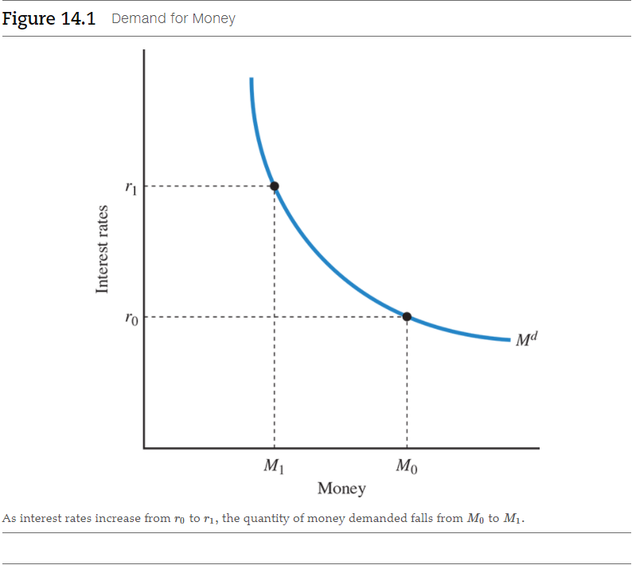

# Chapter 14: The Federal Reserve and Monetary Policy

The **money market** is the market for money where the amount supplied and the
amount demanded meet to determine the nominal interest rate. Recall that the
nominal interest rate is the stated or quoted interest rate before adjusting for
inflation. We begin by learning the factors that determine the public's demand
for money. Once we understand what affects the demand for money, we can see how
the actions of the Federal Reserve determine the supply of money. Then, we see
how the demand and supply of money together determine interest rates.

<a name="money-market-term">**Money market**</a>

- The market for money in which the amount supplied and the amount demanded meet
  to determine the nominal interest rate.

## 14.1 The Demand for Money

Let's think of money as simply one part of wealth. Suppose your total wealth is
valued at \$1,000. In what form will you hold your wealth? Should you put all
your wealth into the stock market? Or perhaps into the bond market? Or should
you hold some of your wealth in money--that is, currency and deposits in
checking accounts?

### 14.1.1 Interest Rates Affect Money Demands

If you invest in assets such as stocks or bonds, you will generally earn income
on them. _Stocks_ are shares in the ownership of a corporation. There are two
sources of income from stocks: dividends paid to their owners out of the profits
of the corporation, and the typical increase in their value over time. _Bonds_
are loans that are repaid with interest. Thus, both stocks and bonds provide
returns to investors. If you hold your wealth in currency or in a checking
account, however, you will receive either no interest or very low interest. And
if inflation rises sharply, you might even lose money. Holding your wealth as
money in currency or a checking account means you sacrifice some potential
income.

Money does, however, provide a valuable service. It facilitates transactions. If
you go to a grocery store to purchase cereal, the store will accept currency or
a check, but you won't be able to pay for cereal with your stocks and bonds.
People hold money primarily for this basic reason: Money makes it easier to
conduct everyday transactions.  Economists call this reason for holding money
the **transaction demand for money**.  To understand the demand for money, we
rely on the principle of opportunity cost.

<a name="transaction-demand-for-money-term">**Transaction demand for money**</a>

- The demand for money based on the desire to facilitate transactions.

The opportunity cost of holding money is the return you could have earned by
holding your wealth in other assets. We measure the opportunity cost of holding
money by the interest rate. Suppose the interest rate available to you on a
long-term bond is 6 percent per year. If you hold \$100 of your wealth in the
form of this bond, you'll earn \$6 a year. If you hold currency instead, you'll
earn no interest. So, the opportunity cost of holding \$100 in currency is \$6
per year, or 6 percent per year.

As interest rates increase in the economy, the opportunity cost of holding money
also increases. Economists have found that as the opportunity cost of holding
money increases, the public demands less money. The quantity demanded of money
will decrease with an increase in interest rates.

In Figure 14.1, we draw a demand for money curve, $M^{d}$, as a function of the
interest rate. At higher interest rates, individuals will want to hold less
money than they will at lower interest rates because the opportunity cost of
holding money is higher. As interest rates rise from $r_{0}$ to $r_{1}$, the
quantity of money demanded falls from $M^{0}$ to $M^{1}$.

### 14.1.2 Other Components of Money Demand

Traditionally, economists have identified other motives besides transactions for
individuals or firms to hold money. If you hold your wealth in the form of
property, such as a house or a boat, it is costly to sell it on short notice if
you need to obtain funds. These forms of wealth are **illiquid**, meaning that
they are not easily transferable into money. If you hold your wealth in currency
or checking accounts, you do not have this problem. Economists recognize that
people have a **liquidity demand for money**; they want to hold money to make
transactions on quick notice.

<a name="illiquid-term">**Illiquid**</a> - Not easily transferable to money. 
<a name="liquidity-demand-for-money-term">**Liquidity demand for money**</a> -
The demand for money that represents the needs and desires individuals and firms
have to make transactions on short notice without incurring excessive costs. 

During periods of economic volatility, investors might not want to hold stocks
and bonds because their prices might fall. Instead, they might convert them into
holdings that fall into the M2 category, such as savings accounts and money
market funds. These investments earn lower interest rates on average, but are
less risky than stocks and bonds, whose prices can fluctuate. This demand for
safer assets is called the **speculative demand for money**. For example, after
the stock market began to fall in 2000, individuals became very uncertain about
the future and shifted their funds from the stock market to money market mutual
funds. This shift of assets from stocks to money temporarily increased M2. When
the market started to recover, some investors shifted funds back into the stock
market.

<a name="speculative-demand-for-money-term">**Speculative demand for money**</a>

- The demand for money that arises because holding money over short periods is
  less risky than holding stocks or bonds.

## 14.2 How the Federal Reserve Can Change the Money Supply

### 14.2.1 Open Market Operations

The Fed can increase or decrease the total amount of reserves in the banking
system through **open market operations**, which are the purchase or sale of
U.S.  government securities by the Fed. There are two types of open market
operations:

- In **open market purchases**, the Fed buys government bonds from the private
  sector.
- In **open market sales**, the Fed sells government bonds to the private
  sector.

<a name="open-market-operations-term">**Open market operations**</a> - The
purchase or slae of U.S. government securities by the Fed. 
<a name="open-market-purchases-term">**Open market purchases**</a> - The Fed's
purchase of government bonds from the private sector. 
<a name="open-market-sales-term">**Open market sales**</a> - The Fed's sale of
government bonds to the private sector. 

To understand how the Fed can increase the supply of money, let's trace what
happens after an open market purchase.  Suppose the Federal Reserve purchases
\$1 million worth of government bonds currently owned by the private sector. The
Fed writes a check for \$1 million and presents it to the party who sold the
bonds. The Federal Reserve now owns those bonds. The party who sold the bonds
then deposits the \$1 million in its bank.

Here is the key to how the supply of money increases when the Fed purchases
government bonds: As we explained in the last chapter, each bank must keep an
account with the Fed containing both its required and excess reserves. The check
written against the Federal Reserve increases the bank's total reserves,
essentially giving it more money to loan out. In this case, the bank's account
balance increases by \$1 million. If the reserve requirement is 10 percent, the
bank must keep \$100,000 in reserves, but it can now loan out \$900,000 from its
excess reserves. Basically, when the Fed buys bonds, the proceeds go out into
the economy. Open market purchases of bonds therefore increase the money supply.

The Federal Reserve has powers that ordinary citizens and even banks do not
have. The Fed can write checks against itself to purchase government bonds
without having any explicit "funds" in its account for the purchase. Banks
accept these checks because they count as part of their total reserves.

As you might expect, open market sales will, conversely, decrease the supply of
money.  Suppose the Federal Reserve sells \$1 million worth of government bonds
to a Wall Street firm. The firm will pay for the bonds with a check for \$1
million drawn on its bank and give this check to the Federal Reserve. The bank
must either hand over \$1 million in cash or, more likely, reduce its total
reserves with the Federal Reserve by \$1 million. When the Fed sells bonds, it
is basically taking the money exchanged for them out of the hands of the public.
Open market sales therefore decrease the money freely available in the economy.

### 14.2.2 Other Tools of the Fed

Open market operations are the most important way in which the Federal Reserve
changes the supply of money. There are four other ways in which the Fed can
change the supply of money, which we discuss next.

Traditionally, open market operations have been the most important way in which
the Federal Reserve has changed the supply of money. After the financial crisis,
the Fed started to pay interest on reserves and banks dramatically increased
their holdings of excess reserves. In this setting, five other tools to increase
the money supply and change interest rates can be very important.

#### Changing Reserve Requirements

Another way the Fed can change the money supply is by changing the reserve
requirements for banks. If the Fed wishes to increase the supply of money, it
can reduce banks' reserve requirements, so they have more money to loan out.
This would expand the money supply. To decrease the supply of money, the Federal
Reserve can raise reserve requirements.

Changing reserve requirements is a powerful tool, but the Federal Reserve
doesn't use it very often because it disrupts the banking system. Suppose a bank
is required to hold exactly 10 percent of its deposits as reserves and has
loaned the other 90 percent out. If the Federal Reserve suddenly increases its
reserve requirement to 20 percent, the bank would be forced to call in or cancel
many of its loans. Its customers would not like this! Today, the Fed doesn't
make sharp changes in reserve requirements. It did in the past, including during
the Great Depression, because it mistakenly believed that the banks were holding
too much in excess reserves. Banks, however, were holding additional reserves
because they wanted to protect themselves from bank runs. As a result, after the
increase in required reserves, banks increased their reserves even more, further
reducing the supply of money to the economy.

#### Paying Interest on Reserves

Since 2008, the Fed has paid interest on required and excess reserves that banks
hold. By paying interest on reserves, the Fed can affect the willingness of
banks to hold reserves. Higher interest payments on reserves will lead banks to
hold more reserves, thereby reducing the money supply. Conversely, lower
interest payments will lead to fewer reserves and an increased money supply.
This tool has now become the single most important one that the Fed uses to
change interest rates.

#### Changing the Discount Rate

A third way the Fed can change the money supply is by changing the _discount
rate_. The **discount rate** is the interest rate at which banks can borrow
directly from the Fed. Suppose a major customer asks for a large loan from a
bank that has no excess reserves. Unless the bank can find an additional source
of funds, it will not be able to make the loan. Banks are reluctant to turn away
major customers.  They first try to borrow reserves from other banks through the
**federal funds market**, a market in which banks borrow and lend reserves to
and from one another. If the rate--called the **federal funds rate**--seems too
high to the bank, it could borrow directly from the Federal Reserve at the
discount rate. By changing the discount rate, the Federal Reserve can influence
the amount of borrowing by banks. If the Fed raises the discount rate, banks
will be discouraged from borrowing reserves because it costs more.  Lowering the
discount rate will induce banks to borrow additional reserves.

<a name="discount-rate-term">**Discount rate**</a> - The interest rate at which
banks can borrow from the Fed. 
<a name="federal-funds-market-term">**Federal funds market**</a> - The market in
which banks borrow and lend reserves to and from one another. 
<a name="federal-funds-rate-term">**Federal funds rate**</a> - The interest rate
on reserves that banks lend each other. 

## 14.3 How Interest Rates Are Determined: Combining the Demand and Supply of Money

Combining the demand for money, determined by the public, with the supply of
money, determined by the Fed, we can see how interest rates are determined in
the short run in a demand-and-supply model of the money market.

Figure 14.3 depicts a model of the money market. The supply of money is
determined by the Federal Reserve, and we assume for simplicity that it is
independent of interest rates. We represent this independence by a vertical
supply curve for money, $M^{s}$. In the same graph, we draw the demand for money
$M^{d}\$. Market equilibrium occurs where the demand for money equals the supply
of money, at an interest rate of $r^{*}$.

 

# Resources

- [📑 The Principle of Voluntary Exchange](../../../spring-2020/ECON-121/notes/ch-2.md#the-principle-of-voluntary-exchange)

Textbook

- Macroeconomics: Principles/Applications/Tools, 10e by Arthur O'Sullivan,
  Steven Sheffrin, Stepehn Perez

