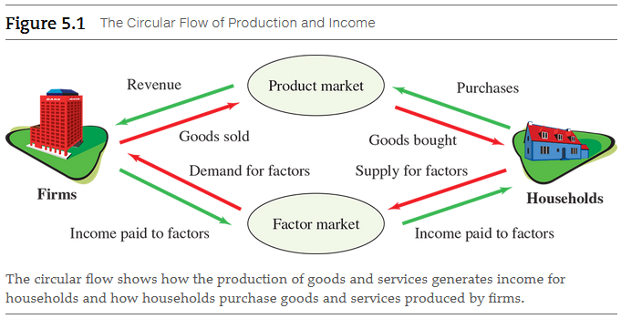
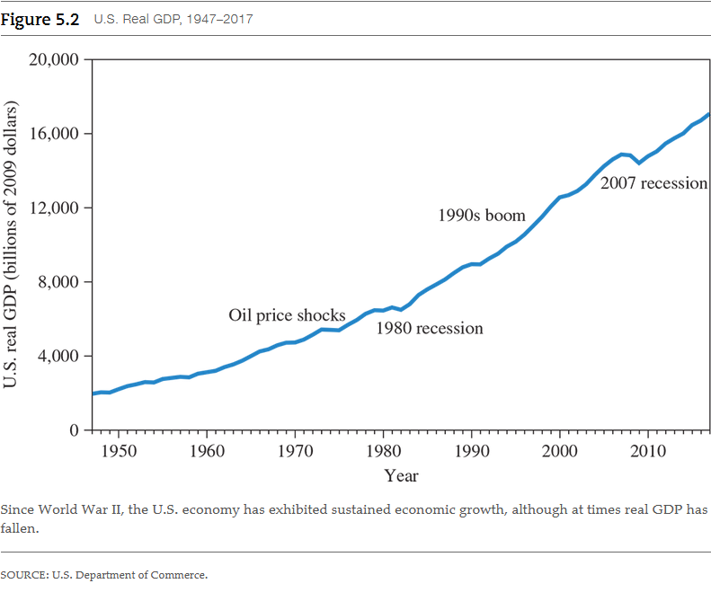
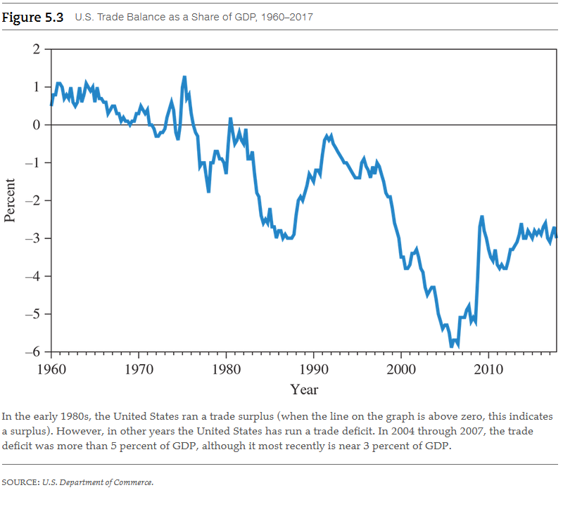
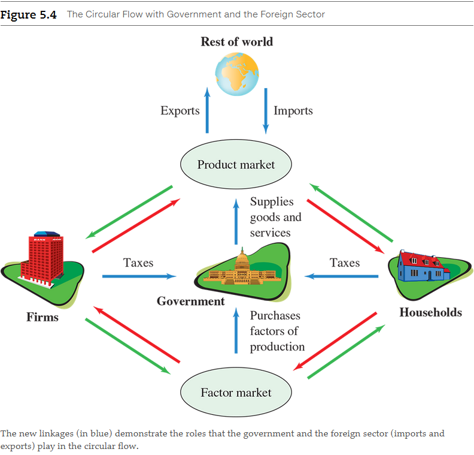
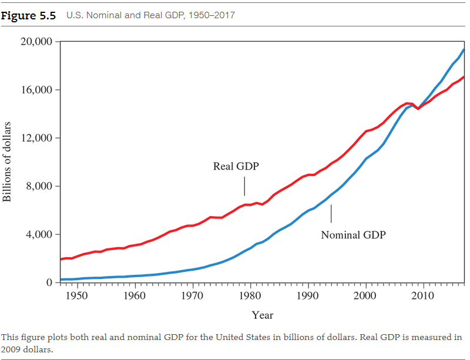
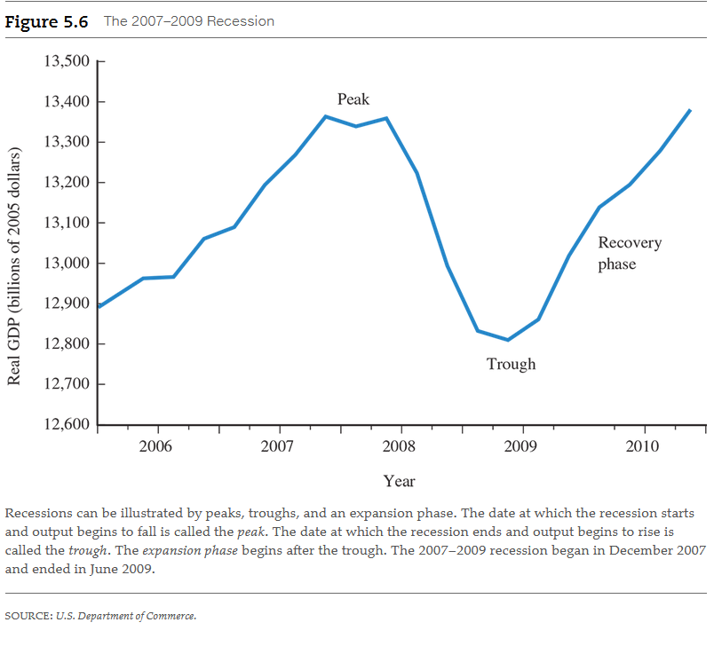

# Chapter 5: Measuring a Nation's Production and Income

<a name="macroeconomics-term">**Macroeconomics**</a>

- The study of the nation's economy as a whole; focuses on the issues of
  inflation, unemployment and economic growth.

<a name="inflation-term">**Inflation**</a>

- Sustained increase in the average prices of all goods and services.

## 5.1 The Flip Sides of Macroeconomic Activity: Production and Income

Before we can study growth and fluctuations, we need to have a basic vocabulary
and understanding of some key concepts. We begin with the terms production and
income because these are the flip sides of the macroeconomic coin, so to speak.
Every day, men and women go off to work, where they produce or sell merchandise
or provide services. At the end of the week or month, they return home with
their paychecks or income. They spend some of that money on other products and
services, which are produced by other people. **In other words, production leads
to income, and income leads to production**.

From a big picture perspective, we look at certain measures that will tell us
how much the economy is producing and how well it is growing. We will also be
able to measure the total income generated in the economy and how this income
flows back to workers and investors. These two measures--a country's production
and income--are critical to a nation's economic health. Macroeconomists collect
and analyze production and income data to understand how many people will find
jobs and whether their living standards are rising or falling. Government
officials use the data and analysis to develop economic policies.

### The Circular Flow of Production and Income

Let's begin with a simple diagram known as the _circular flow_, shown in Figure
5.1. We start with a very simple economy that does not have a government or a
foreign sector. Households and firms make transactions in two markets known as
_factor markets_ and _product markets_. In factor, or input, markets, households
supply labor to firms. Households are also the ultimate owners of firms, as well
as of all the resources firms use in their production, which we call _capital_.
Consequently, we can think of households as providing capital to firms--land,
buildings, and equipment--to produce output. Product, or output, markets are
markets in which firms sell goods and services to consumers.

The point of the circular flow diagram is simple and fundamental: Production
generates income. In factor markets, when households supply labor and capital to
firms, they are compensated by the firms. They earn wages for their work, and
they earn interest, dividends, and rents on the capital they supply to the
firms. The households then use their income to purchase goods and services in
the product markets. The firm uses the revenues it receives from the sale of its
products to pay for the factors of production (land, labor, and capital).

## 5.2 The Production Approach: Measuring a Nation's Macroeconomic Activity Using Gross Domestic Product

<a name="gross-domestic-product-term">**Gross Domestic Product (GDP)**</a>

- The total market value of final goods and services produced within an economy
  in a given year.
- GDP is also the most common measure of an economy's total output.

All the words in the GDP definition are important, so let's analyze them

_Total market_ value means we take the quantity of goods produced, multiply them
by their respective prices, and then add up the totals. If an economy produced
two cars at $25,000 per car and three computers at $2,000 per computer, the
total value of these goods will be

$$
\begin{aligned}
2 \text{ cars } \times \$25,000 \text{ per car }          & = \$50,000 \\
3 \text{ computers } \times \$2,000 \text{ per computer } & = \$\:\:6,000 \\
                                                          & = \$56,000
\end{aligned}
$$

Final goods and services in the GDP definition means those goods and services
that are sold to ultimate, or final, purchasers. For example, the two cars that
were produced would be final goods if they were sold to households or to a
business. However, to produce the cars the automobile manufacturer bought steel
that went into the body of the cars, and we do not count this steel as a final
good or service in GDP. Steel is an example of an intermediate good, one that is
used in the production process. An **intermediate good** is not considered a
final good or service.

<a name="intermediate-good-term">**Intermediate good**</a>

- Goods used in the production process that are not final goods and services.

The reason we do not count intermediate goods as final goods is to avoid
double-counting. The price of the car already reflects the price of the steel
contained in it. We do not want to count the steel twice.

The final words in our GDP definition are in _a given year_. GDP is expressed as
a rate of production--that is, as "X" amount of dollars per year. In 2014, for
example, GDP in the United States was $17,420 billion. Goods produced in prior
years, such as cars or houses, are not included in GDP for a given year, even if
one consumer sells a house or car to another in that year. Only newly produced
products are included in GDP.

Because we measure GDP using the current prices for goods and services, GDP will
increase if prices increase, even if the physical amount of goods that are
produced remains the same. Suppose that next year the economy again produces two
cars and three computers, but all the prices in the economy double: The price of
cars is $50,000, and the price of computers is $4,000. GDP will also be twice as
high, or $112,000, even though the quantity produced is the same as during the
prior year:

$$
\begin{aligned}
2 \text{ cars } \times \$50,000 \text{ per car } &= \$100,000  \\
+ \\
3 \text{ computers } \times \$4,000 \text{ per computer } &= \$\:\:12,000  \\
 &= \$112,000
\end{aligned}
$$

But to say that GDP has doubled would be misleading because exactly the same
goods were produced. To avoid this problem, let's apply the real-nominal
principle, one of our five basic principles of economics.

<a name="real-nominal-principle-term">**Real-nominal principle**</a>

- What matters to people is the real value of money or income--its purchasing
  power-- not the face value of money or income.

What we need is another measure of total output that doesn't increase just
because prices increase. For this reason, economists have developed the concept
of **real GDP**, a measure that controls for changes in prices. Later in this
chapter, we explain how real GDP is calculated. The basic idea is simple. When
we use current prices to measure GDP, we are using **nominal GDP**. Nominal GDP
can increase for one of two reasons: Either the production of goods and services
has increased, or the prices of those goods and services have increased.

<a name="real-gdp-term">**Real GDP**</a> - A measure of GDP that controls for
changes in price. 
<a name="nominal-gdp-term">**Nominal GDP**</a> - The value of GDP in current
dollars. 

To explain the concept of real GDP, we first need to look at a simple example.
Suppose an economy produces a single good: computers. In year 1, 10 computers
were produced, and each sold for $2,000. In year 2, 12 computers were produced,
and each sold for $2,100. Nominal GDP is $20,000 in year 1 and $25,200 in year
2; it has increased by a factor of 1.26 or 26 percent. However, we can also
measure real GDP by using year 1 prices as a measure of what was produced in
year 1 and what was produced in year 2.

In year 1, real GDP is

$$
10 \text{ computers } \times \$2,000 \text{ per computer } = \$20,000
$$

In year 2, real GDP (in year 1 terms) is

$$
12 \text{ computers } \times \$2,000 \text{ per computer } = \$24,000
$$

Real GDP in year 2 is still greater than real GDP in year 1, now by a factor of
1.2, or 20 percent. The key idea is that we construct a measure using the same
prices for both years and thereby take price changes into account.

Figure 5.2 plots real GDP for the U.S. economy for the years 1947 through 2013.
The graph shows that real GDP has grown substantially over this period. This is
what economists call **economic growth**--sustained increases in the real GDP of
an economy over a long period of time.

<a name="economic-growth-term">**Economic growth**</a> - Sustained increase in
the real GDP of an economy over a long period of time. 

### 5.2.1 The Components of GDP

Economists divide GDP into four broad categories, each corresponding to
different types of purchases represented in GDP:

1. Consumption expenditures: purchases by consumers
2. Private investment expenditures: purchases by firms
3. Government purchases: purchases by federal, state, and local governments
4. Net exports: net purchases by the foreign sector (domestic exports minus
   domestic imports)

#### Consumption Expenditures

<a name="consumption-expenditures-term">**Consumption expenditures**</a>

- Purchases of newly produced goods and services by households.
- These purchases include flat-screen TVs, smartphones, automobiles, clothing,
  hairstyling services, jewelry, movie or basketball tickets, food, and all
  other consumer items.

We can break down consumption into durable goods, nondurable goods, and
services. _Durable goods_, such as automobiles or refrigerators, last for a long
time. _Nondurable goods_, such as food, last for a short time. _Services_ are
work in which people play a prominent role in delivery (such as a dentist
filling a cavity). They range from manicures to health care and are the
fastest-growing component of consumption in the United States. Overall,
consumption spending is the most important component of GDP, constituting about
69 percent of total purchases.

#### Private Investment Expenditures

<a name="private-investment-expenditures-term">**Private investment expenditures**</a>

- Purchases of newly produced goods and services by firms

Consist of three components:

1. First, there is spending on new plants and equipment during the year. If a
   firm builds a new factory or purchases a new machine, the new factory or new
   machine is included in the year's GDP. Purchasing an existing building or
   buying a used machine does not count in GDP, because the goods were not
   produced during the current year.
2. Second, newly produced housing is included in investment spending. The sale
   of an existing home to a new owner is not counted because the house was not
   built in the current year.
3. Finally, if firms add to their stock of inventories, the increase in
   inventories during the current year is included in GDP. If a hardware store
   had \$1,000 worth of nuts and bolts on its shelves at the beginning of the
   year and \$1,100 at the year's end, its inventory investment is \$100
   $(\$1,000 - \$,1000)\$. This \$100 increase in inventory investment is
   included in GDP.

We call the total of new investment expenditures **gross investment**. During
the year, some of the existing plant, equipment, and housing will deteriorate or
wear out. This wear and tear is called **depreciation**, or sometimes a capital
consumption allowance. If we subtract depreciation from gross investment, we
obtain **net investment**.

<a name="gross-investment-term">**Gross investment**</a> - Total new investment
expenditures. 
<a name="depreciation-term">**Depreciation**</a> - Reduction in the value of
capital goods over a 1-year period due to physical wear and tear and to
obsolescence; also called _capital consumption allowance_. 
<a name="net-investment-term">**Net investment**</a> - Gross investment minus
depreciation. 

#### Government Purchases

<a name="government-purchases-term">**Government purchases**</a>

- Purchases of newly produced goods and services by local, state, and federal
  governments.
- This category does not include all spending by governments. It excludes
  **transfer payments**.

<a name="transfer-payments-term">**Transfer payments**</a>

- Payments from governments to individuals that do not correspond to the
  production of goods and services.
- For example, payments for Social Security, welfare, and interest on government
  debt are all considered transfer payments and thus are not included in
  government purchases in GDP. Nothing is being produced by the recipients in
  return for money being paid, or "transferred," to them. But wage payments to
  the police, postal workers, and the staff of the Internal Revenue Service are
  all included because they do correspond to services these workers are
  currently producing.

Because transfer payments are excluded from GDP, a vast portion of the budget
of the federal government is not part of GDP.

#### Net Exports

To understand the role of the foreign sector, we first need to define three
terms. **Imports** are goods and services we buy from other countries.
**Exports** are goods and services made here and sold to other countries. **Net
exports** are total exports minus total imports.

<a name="imports-term">**Imports**</a> - A good or service produced in a foreign
country and purchased by residents of the home countery (e.g., the United
States). 
<a name="export-term">**Export**</a> - A good or service produced in the home
counter (e.g., the United States) and sold in another country. 
<a name="net-exports-term">**Net exports**</a> - Exports minus imports. 

Consumption, investment, and government purchases include all purchases by
consumers, firms, and the government, whether or not the goods were produced in
the United States. However, **GDP is supposed to measure the goods produced in
the United States. Consequently, we subtract purchases of foreign goods by
consumers, firms, or the government when we calculate GDP because these goods
were not produced in the United States. At the same time, we add to GDP any
goods produced here and sold abroad**, for example, airplanes made in the United
States and sold in Europe. By including net exports as a component of GDP, we
correctly measure U.S. production by adding exports and subtracting imports.

When we buy more goods from abroad than we sell, we have a **trade deficit**. A
trade surplus occurs when our exports exceed our imports. Figure 5.3 shows the
U.S. **trade surplus** as a share of GDP from 1960 to 2017. Although at times
the United States has had a small trade surplus, it has generally run a trade
deficit. In recent years, the trade deficit has increased and has fluctuated
between 2 and 6 percent of GDP.

<a name="trade-deficit-term">**Trade deficit**</a> - the excess of imports over
exports 
<a name="trade-surplus-term">**Trade surplus**</a> - The excess of exports over
imports 

### 5.2.2 Putting It All Together: The GDP Equation

We can summarize our discussion of who purchases GDP with a simple equation that
combines the four components of GDP:

$$
Y = C + I + G + NX
$$

where

$$
\begin{aligned}
Y  &= \text{GDP} \\
C  &= \text{Consumption} \\
I  &= \text{Investment} \\
G  &= \text{Government purchases} \\
NX &= \text{Net exports}
\end{aligned}
$$

## 5.3 The Income Approach: Measuring a Nation’s Macroeconomic Activity Using National Income

Recall from the circular flow that one person's production ends up being another
person's income. Income is the flip side of our macroeconomic coin. As a result,
in addition to measuring a nation's activity by measuring production, we can
also gauge it by measuring a nation's income. The total income earned by U.S.
residents working in the United States and abroad is called **national income**.

<a name="national-income-term">**National income**</a>

- The total income earned by a nation's residents both domestically and abroad
  in the production of goods and services.

### 5.3.1 Measuring National Income

<a name="gross-national-product-term">**Gross national product (GNP)**</a>

- GDP plus net income earned abroad.

In addition to national income, which measures the income earned in a given year
by the entire private sector, we are sometimes interested in determining the
total payments that flow directly into households, a concept known as **personal
income**. To calculate personal income, we begin with national income and
subtract any corporate profits that are retained by the corporation and not paid
out as dividends to households. We also subtract all taxes on production and
imports and social insurance taxes, which are payments for Social Security and
Medicare.  We then add any personal interest income received from the government
and consumers and all transfer payments. The result is the total income
available to households, or personal income. The amount of personal income that
households retain after paying income taxes is called **personal disposable
income**.

<a name="personal-income-term">**Personal income**</a> - Income, including
transfer payments, received by households.  <a
name="personal-disposable-income-term">**Personal disposable income**</a> -
Personal income that households retain after paying income taxes. 

### 5.3.2 Measuring National Income through Value Added

Another way to measure national income is to look at the **value added** of each
firm in the economy. For a firm, we can measure its value added by the dollar
value of the firm's sales minus the dollar value of the goods and services
purchased from other firms. What remains is the sum of all the income--wages,
profits, rents, and interest--that the firm generates. By adding up the value
added for all the firms in the economy (plus nonprofit and governmental
organizations), we can calculate national income. Let's consider a simple
example illustrated in Table 5.3.

> **Table 5.3:** Calculating Value Added in a Simple Economy

|                                                                        | Automobile Firm | Steel Firm | Total Economy |
|------------------------------------------------------------------------|-----------------|------------|---------------|
| Total sales                                                            | \$16,000        | \$6,000    | \$22,000      |
| Less purchases from other firms                                        | 6,000           | 0          | 6,000         |
| Equals value added: the sum of all wages, interest, profits, and rents | 10,000          | 6,000      | 16,000        |

### 5.3.3 An Expanded Circular Flow

## 5.4 A Closer Examination of Nominal and Real GDP

### 5.4.1 Measuring Real versus Nominal GDP

Now we take a closer look at how real GDP is measured in modern economies. Let's
start with a simple economy in which there are only two goods--cars and
computers--produced in the years 2011 and 2012. The data for this economy--the
prices and quantities produced for each year--are shown in Table 5.4. The
production of cars and the production of computers increased, but the production
of computers increased more rapidly. The price of cars rose, while the price of
computers remained the same.

> **Table 5.4:** GDP Data for a Simple Economy

|      | Quantity Produced |           | Price    |           |
|------|-------------------|-----------|----------|-----------|
| Year | Cars              | Computers | Cars     | Computers |
| 2011 | 4                 | 1         | \$10,000 | \$5,000   |
| 2012 | 5                 | 3         | 12,000   | 5,000     |

Let's first calculate nominal GDP for this economy in each year. Nominal GDP is
the total market value of goods and services produced in each year. Using the
data in the table, we can see that nominal GDP for the year 2011 is

$$
(4 \text{ cars } \times \$10,000) + (1 \text{ computers } \times \$5,000) = \$45,000
$$

Similarly, nominal GDP for the year 2012 is

$$
(5 \text{ cars } \times \$12,000) + (3 \text{ computers } \times \$5,000) = \$75,000
$$

Now we find real GDP. To compute real GDP, we calculate GDP using constant
prices. What prices should we use? For the moment, let's use the prices for the
year 2011. Because we are using 2011 prices, real GDP and nominal GDP for 2011
are both equal to \$45,000. But for 2012, they are different. In 2012, real GDP
is

$$
(5 \text{ cars } \times \$10,000) +(3 \text{ computers } \times \$5,000) =
\$65,000
$$

Note that real GDP for 2012, which is \$65,000, is less than nominal GDP for
2012, which is \$75,000. The reason real GDP is less than nominal GDP here is
that prices of cars rose by \$2,000 between 2011 and 2012, and we are measuring
GDP using 2011 prices. We can measure real GDP for any other year simply by
calculating GDP using constant prices.

We now calculate the growth in real GDP for this economy between 2011 and 2012.
Because real GDP was \$45,000 in 2011 and \$65,000 in 2012, real GDP grew by
\$20,000. In percentage terms, this is a \$20,000 increase from the initial
level of \$45,000 or

$$
\text{ Percentage growth in real GDP } = \frac{\$20,000}{\$45,000} = .444
$$

which equals 44.4 percent. This percentage is an average of the growth rates for
both goods--cars and computers.

### 5.4.2 How to Use the GDP Deflator

<a name="gdp-deflator-term">**GDP deflator**</a>

- An index that measures how the prices of goods and services included in GDP
  change over time.

$$
\text{ GDP Deflator } = \frac{\text{Nominal GDP}}{\text{Real GDP}} \times 100
$$

Using this formula, we find that the value of the GDP deflator for 2012 is

$$
\frac{\$75,000}{\$65,000} \times 100 = 1.15 \times 100 = 115
$$

Because the value of the GDP deflator is 115 in 2012 and was 100 in the base
year of 2011, this means prices rose by 15 percent between the two years:

$$
\frac{115 - 100}{100} = \frac{15}{100} = 0.15
$$

Note that this 15 percent is a weighted average of the price changes for the two
goods--cars and computers.

Until 1996, the Commerce Department, which produces the GDP figures, used these
formulas to calculate real GDP and measure changes in prices. Economists at the
department chose a base year and measured real GDP by using the prices in that
base year. They also calculated the GDP deflator, just as we did, by taking the
ratio of nominal GDP to real GDP. Today, the Commerce Department calculates real
GDP and the price index for real GDP using a more complicated method. In our
example, we measured real GDP using 2011 prices. But we could have also measured
real GDP using prices from 2012. If we did, we would have come up with slightly
different numbers both for the increase in prices between the two years and for
the increase in real GDP. To avoid this problem, the Commerce Department now
uses a **chain-weighted index**, which is a method for calculating price changes
that takes an average of price changes using base years from consecutive years
(i.e., 2011 and 2012 in our example). If you look online or at the data produced
by the Commerce Department, you will see real GDP measured in chained dollars
and a chain-type price index for GDP.

<a name="chain-weighted-index-term">**Chain-weighted index**</a>

- A method for calculating changes in prices that uses an average base years
from neighboring years.

## 5.5 Fluctuations in GDP

As we have discussed, real GDP does not always grow smoothly--sometimes it
collapses suddenly, and the result is an economic downturn. We call such
fluctuations business cycles. Let's look at an example of a business cycle from
the late 1980s and early 1990s. Figure 5.6 plots real GDP for the United States
from 2007 to 2009. Notice that in mid-1990, real GDP begins to fall. A recession
is a period when real GDP falls for 6 or more consecutive months. Economists
talk more in terms of quarters of the year--consecutive 3-month periods--than in
terms of months. So, they would say that a recession occurs when real GDP falls
for two consecutive quarters. The date at which the recession starts--that is,
when output starts to decline--is called the peak. The date at which it
ends--that is, when output starts to increase again--is called the trough. In
Figure 5.6, we see the peak and trough of the recession. After a trough, the
economy enters a recovery period, or period of expansion.

<a name="recession-term">**Recession**</a> - Commonly defined as 6  consecutive
months of declining real GDP. 
<a name="peak-term">**Peak**</a> - The date at which a recession starts. 
<a name="expansion-term">**Expansion**</a> - The period after a trough in the
business cycle during which the economy recovers. 

<a name="depression-term">**Depression**</a>

- The common name for a severe recession

## 5.6 GDP as a Measure of Welfare

### 5.6.1 Shortcomings of GDP as a Measure of Welfare

There are several recognized flaws in the construction of GDP. We should thus be
cautious in interpreting GDP as a measure of our economic well-being because it
does not take into account housework and childcare, leisure, the underground
economy, or pollution.

#### Housework And Childcare

First, GDP ignores transactions that do not take place in organized markets. The
most important example is services--such as cleaning, cooking, and providing
free childcare--that people do for themselves in their own homes. Because these
services are not transferred through markets, GDP statisticians cannot measure
them. If we included household production in GDP, measured GDP would be
considerably higher than currently reported.

#### Leisure

Second, leisure time is not included in GDP because GDP is designed to be a
measure of the production that occurs in the economy. To the extent that
households value leisure, increases in leisure time will lead to higher social
welfare, but not to higher GDP.

#### Underground Economy

Third, GDP ignores the underground economy, where transactions are not reported
to official authorities. These transactions can be legal, but people don't
report the income they have generated because they want to avoid paying taxes on
it. For example, wait staff may not report all their tips and owners of flea
markets may make under-the-table cash transactions with their customers. Illegal
transactions, such as profits from the illegal drug trade, also result in
unreported income. In the United States in 2005, the Internal Revenue Service
estimated (based on tax returns from 2001) that about \$310 billion in federal
income taxes from the underground economy was not collected each year. If the
federal income tax rate that applies to income evaded from taxes was about 20
percent, approximately \$1.5 trillion ($310/0.20) in income from the underground
economy escaped the GDP accountants that year, or about 15 percent of GDP at the
time.

## Chapter Summary

In this chapter, we learned how economists and government statisticians measure
the income and production for an entire country and what these measures are used
for. Developing meaningful statistics for an entire economy is difficult. As we
have seen, statistics can convey useful information--if they are used with care.
Here are some of the main points to remember in this chapter:

1. The circular flow diagram shows how the production of goods and services
   generates income for households and how households purchase goods and
   services by firms. The expanded circular flow diagram includes government and
   the foreign sector.
2. _Gross domestic product_ (GDP) is the market value of all final goods and
   services produced in a given year.
3. GDP consists of four components: consumption, investment, government
   purchases, and net exports. The following equation combines these components:

$$
Y = C + I + G + N + X
$$

The GDP deflator is an index that measures how the prices of goods and services
included in GDP change over time. The following equation helps us find the GDP
deflator:

$$
\text{ GDP Deflator } = \frac{Nominal GDP}{Real GDP} \times 100
$$

4. _National income_ is obtained from GDP by adding the net income U.S.
   individuals and firms earn from abroad, then subtracting depreciation.
5. _Real GDP_ is calculated by using constant prices. The Commerce Department
   now uses methods that take an average using base years from neighboring
   years.
6. A _recession_ is commonly defined as a 6-month consecutive period of negative
   growth. However, in the United States, the National Bureau of Economic
   Research uses a broader definition.
7. GDP does not include nonmarket transactions, leisure time, the underground
   economy, or changes to the environment.

 

# Resources

Textbook

- Macroeconomics: Principles/Applications/Tools, 10e by Arthur O'Sullivan,
  Steven Sheffrin, Stepehn Perez

