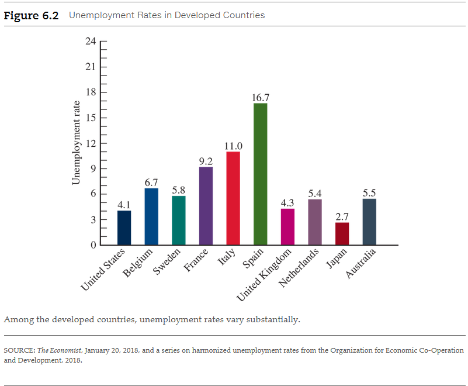
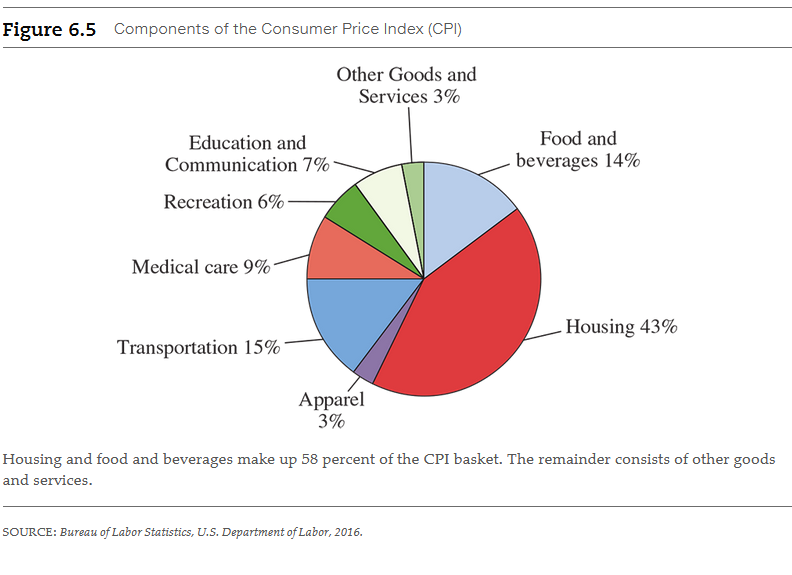

# Chapter 6: Unemployment and Inflation

## 6.1 Examining Unemployment

### 6.1.1 How Is Unemployment Defined and Measured?

Let's begin with some definitions. The unemployed are those individuals who do
not currently have a job but who are actively looking for work. The phrase
actively looking is critical. Individuals who looked for work in the past but
who are not looking currently are not counted as unemployed. The employed are
individuals who currently have jobs. Together, the unemployed and employed
comprise the labor force:

<a name="labor-force-term">**Labor force**</a>

- The total number of workers, both the employed and unemployed.

$$
\text{ labor force } = \text{ employed } + \text{ unemployed }
$$

<a name="unemployment-rate-term">**Unemployment rate**</a>

- The percentage of the labor force that is unemployed.

$$
\text{ unemployment rate } = \frac{\text{unemployed}}{\text{labor force}} \times 100
$$

<a name="labor-force-participation-rate-term">**Labor force participation rate**</a>

- The percentage of the population older than 16 years of age that is in the
  labor force.

$$
\text{ labor force participation rate } = \frac{\text{labor force}}{\text{population 16 years and older}} \times 100
$$

To illustrate these concepts, suppose an economy consists of 200,000 individuals
16 years of age and older. Of all these people, 122,000 are employed and 8,000
are unemployed. This means that 130,000 $(122,000 + 88,000)$ people are in the
labor force. The labor force participation rate is 0.65, or 65 percent
(130,000/200,000), and the unemployment rate is 0.0615, or 6.15 percent
(8,000/130,000).

One of the most important trends in the last 50 years has been the increase in
the participation of women in the labor force. In 1948, the labor force
participation rate for women 20 years and older was 32 percent. By 1970, it had
grown to 43 percent, and by 1997 it had reached 60 percent. This trend reflected
remarkable changes in our economy and society as women dramatically increased
their presence in the workforce. In 2018, the participation rate for women had
fallen to approximately 57 percent.

Figure 6.2 contains international data on unemployment for 2017 for developed
countries. Despite the fact these countries all have modern, industrial
economies, notice the sharp differences in unemployment. **For example, Spain
had a 16.7 percent unemployment rate, whereas Japan had an unemployment rate of
2.7 percent. These sharp differences reflect a number of factors, including how
much government support is provided to unemployed workers. In countries in which
support is the most generous, there is less incentive to work and unemployment
will tend to be higher.**

### 6.1.2 Alternative Measures of Unemployment and Why They Are Important

It is relatively straightforward in principle to determine who is employed: Just
count the people who are working. What is more difficult is to distinguish
between those who are unemployed and those who are not in the labor force. How
are these two groups distinguished? The Bureau of Labor Statistics (BLS), which
is part of the Department of Labor, interviews a large sample of households each
month. The BLS asks about the employment situation of all household members 16
years of age and older. If someone in a household is not working, the
interviewer asks whether the person is actively looking for work. If the answer
is "yes," he or she is classified as unemployed. If the answer is "no"--he or
she is not actively looking for work--that person is classified as not being in
the labor force.

Individuals who want to work and have searched for work in the prior year, but
are not currently looking for work because they believe they won't be able to
find a job are called **discouraged workers**. Note that these individuals are
not included in the official statistics because they are not currently looking
for work.

<a name="discouraged-workers-term">**Discouraged workers**</a>

- Workers who left the labor force because they could not find jobs.

In addition to discouraged workers, there are individuals who would like to work
and have searched for work in the recent past, but have stopped looking for work
for a variety of reasons. These individuals are known as _marginally attached
workers_. Marginally attached workers consist of two groups: discouraged workers
(who left the labor force because they could not find jobs) and workers who are
not looking for jobs for other reasons, including lack of transportation or
childcare.

$$
\text{ unemployment rate } = \frac{\text{ unemployed } + \text{ discouraged workers }}{\text{ labor force } + \text{ discouraged workers }} \times 100
$$

Finally, there are those workers who would like to be employed full time but
hold part-time jobs. These individuals are counted as employed in the BLS
statistics because they have a job. However, they would like to be working more
hours. They are known as _individuals working part time for economic reasons_.
We do not include in this category individuals who prefer part-time employment.

How important are these alternative measures? Figure 6.3 puts them into
perspective. In January 2018, 6.68 million individuals were officially
classified as unemployed. The number of discouraged workers was 0.45 million.
Including the discouraged workers, there were 1.64 million marginally attached
workers. If we add the marginally attached individuals to those who were
involuntarily working part time, the total is 6.57 million. Thus, depending on
the statistic you want to emphasize, there were anywhere between 6.68 million
unemployed (the official number) and 13.25 million unemployed (the official
number plus all those seeking full-time employment who did not have it). If we
count those 13.25 million as unemployed and include the marginally attached in
the labor force, the unemployment rate in 2018 would be 8.1
percent--substantially higher than the official rate of 4.1 percent. As we have
seen, the official statistics for unemployment do not include the full range of
individuals who would like to participate fully in the labor market.

### 6.1.3 Who Are the Unemployed?

Another fact about unemployment is that different groups of people suffer more
unemployment than others. Figure 6.4 contains some unemployment statistics for
selected groups for January 2018. Adults have substantially lower unemployment
rates than teenagers. Minorities have higher unemployment rates. African
American teenagers have extremely high unemployment rates. On average, men and
women have similar unemployment rates, but the unemployment rates for married
men and married women are lower than unemployment rates of women who maintain
families alone.

These differentials do vary somewhat as GDP rises and falls. Teenage and
minority unemployment rates often rise very sharply during poor economic times,
as was the case in the most recent recession. In better times, a reduction of
unemployment for all groups typically occurs. Nonetheless, teenage and minority
unemployment remains relatively high at all times.

Many economic time series, including employment and unemployment, are
substantially influenced by seasonal factors. These are recurring
calendar-related effects caused by, for example, the weather, holidays, the
opening and closing of schools, and related factors. Unemployment due to
recurring calendar effects is called **seasonal unemployment**. Examples of
seasonal unemployment include higher rates of unemployment for farm workers and
construction workers in the winter and higher unemployment rates for teenagers
in the early summer as they look for summer jobs.

<a name="seasonal-unemployment-term">**Seasonal unemployment**</a>

- The component of unemployment attributed to seasonal factors.

## 6.2 Categories of Unemployment

### 6.2.1 Types of Unemployment: Cyclical, Frictional, and Structural

After seasonally adjusting the unemployment statistics, we can divide
unemployment into three other basic types: cyclical, frictional, and structural.
By studying each type separately, we can gain insight into some of the causes of
each type of unemployment.

The unemployment rate is closely tied to the overall fortunes of the economy.
Unemployment rises sharply during periods when real GDP falls and decreases when
real GDP grows rapidly. During periods of falling GDP, firms will not want to
employ as many workers as they do in good times because they are not producing
as many goods and services. Firms will lay off or fire some current workers and
will be more reluctant to add new workers to their payrolls. The result will be
fewer workers with jobs and rising unemployment. Economists call the
unemployment that occurs during fluctuations in real GDP **cyclical
unemployment**.  Cyclical unemployment rises during periods when real GDP falls
or grows at a slower-than-normal rate and decreases when the economy improves.

<a name="cyclical-unemployment-term">**Cyclical unemployment**</a>

- Unemployment that occurs during fluctuations in real GDP.

**Frictional unemployment** is the unemployment that occurs naturally during the
normal workings of an economy. It occurs because it simply takes time for people
to find the right jobs and for employers to find the right people to hire. This
happens when people change jobs, move across the country, get laid off from
their current jobs and search for new opportunities, or take their time after
they enter the labor force to find an appropriate job. Suppose that when you
graduate from college, you take 6 months to find a job you like. During the 6
months in which you are looking for a good job, you are among those unemployed
who make up frictional unemployment. However, searching for a job makes good
sense. It would not be wise to take the first job you were offered if it had low
wages, poor benefits, and no future. Likewise, employers are wise to interview
multiple applicants for jobs to find the best employees, even if it takes some
time.

<a name="frictional-unemployment-term">**Frictional unemployment**</a>

- Unemployment that occurs with the normal workings of the economy, such as
  workers taking time to search for suitable jobs and firms taking time to
  search for qualified employees.

Could we eliminate unemployment by posting all job vacancies on the Internet
along with the résumés of job seekers and automatically match them up with one
another? It's possible that such an automated system could shorten the duration
of frictional unemployment, but it wouldn't eliminate it entirely. Some workers,
for example, would prefer to continue searching for jobs in their own area
rather than moving across the country to take the jobs they had been
automatically matched with. Firms would also still want to scrutinize employees
very carefully because hiring and training a worker is costly.

**Structural unemployment** occurs when the economy evolves. It occurs when
different sectors give way to other sectors or certain jobs are eliminated while
new types of jobs are created. For example, when the vinyl record industry gave
way to the CD music industry in the 1980s, some workers found themselves
structurally unemployed, which meant they had to take the time to train
themselves for jobs in different industries. Structural unemployment is more of
a "permanent condition" than frictional unemployment.

<a name="structural-unemployment-term">**Structural unemployment**</a>

- Unemployment that occurs when there is a mismatch of skills and jobs.

The line between frictional unemployment and structural unemployment is
sometimes hard to draw. Suppose a highly skilled software engineer is laid off
because his company shuts down its headquarters in his area and moves his job
overseas. The worker would like to find a comparable job, but only lower-wage
work is available in his immediate geographic location. Jobs are available, but
not his kind of job, and this high-tech company will never return to the area.
Is this person's unemployment frictional or structural? There really is no
correct answer. You might think of the software engineer as experiencing either
frictional or structural unemployment. For all practical purposes, however, it
does not matter which it is. The former software engineer is still unemployed.

### 6.2.2 The Natural Rate of Unemployment

Total unemployment in an economy is composed of all three types of unemployment:
cyclical, frictional, and structural. The level of unemployment at which there
is no cyclical unemployment is called the **natural rate of unemployment**,
consisting of only frictional unemployment and structural unemployment. The
natural rate of unemployment is the economist's notion of what the rate of
unemployment should be when there is full employment. It may seem strange to
think that workers can be unemployed when the economy is at **full employment**.
However, the economy needs some frictional unemployment to operate efficiently:
It exists so that workers and firms find the right employment matches. An
economy that lacks frictional unemployment will become stagnant.

<a name="natural-rate-of-unemployment-term">**Natural rate of unemployment**</a>

- The level of unemployment at which there is no cyclical unemployment. It
  consists of only frictional and structural unemployment

<a name="full-employment-term">**Full employment**</a>

- The level of unemployment that occurs when the unemployment rate is the
  natural rate.

The actual unemployment rate can be higher or lower than the natural rate of
unemployment. During a period in which the real GDP fails to grow at its normal
rate, there will be positive cyclical unemployment, and actual unemployment can
far exceed the natural rate of unemployment. For example, in the United States
in 2010 unemployment was 9.6 percent of the labor force. As we pointed out in
the previous chapter, a more extreme example occurred in 1933 during the Great
Depression, when the unemployment rate reached 25 percent. When the economy
grows very rapidly for a long period, actual unemployment can fall below the
natural rate of unemployment. With sustained rapid economic growth, employers
will be aggressive in hiring workers. During the late 1960s, unemployment rates
fell below 4 percent, and the natural rate of unemployment was estimated to be
more than 5 percent. In this case, cyclical unemployment was negative.

Unemployment also fell to 4 percent in 2000. In this case, many economists
believed that the natural rate of unemployment had fallen to close to 5 percent,
so that cyclical unemployment in that year was negative.

Just as a car will overheat if the engine is overworked, so will the economy
overheat if economic growth is too rapid. At low unemployment rates, firms will
find it difficult to recruit workers, and competition among firms will lead to
increases in wages. As wages increase, increases in prices soon follow. The sign
of this overheating will be a general rise in prices for the entire economy,
which we commonly call inflation. As we discuss in later chapters, when the
actual unemployment rate falls below the natural rate of unemployment, inflation
will increase.

## 6.3 The Costs of Unemployment

When there is excess unemployment--actual unemployment above the natural rate of
unemployment--both society and individuals suffer economic loss. From a social
point of view, excess unemployment means that the economy is no longer producing
at its potential. The resulting loss of output can be very large. For example,
in 1983, when the unemployment rate averaged 9.6 percent, typical estimates of
the shortfall of GDP from potential were near 6 percent. Simply put, this meant
that society was wasting 6 percent of the total resources at its disposal.

<a name="unemployment-insurance-term">**Unemployment insurance**</a>

- Payments unemployed people receive from the government.

The effects of unemployment can also linger into the future. Workers who suffer
from a prolonged period of unemployment are likely to lose some of their skills.
For example, an unemployed stockbroker might be unaware of the latest
developments and trends in financial markets. This lack of knowledge will make
it more difficult for that person to find a job in the future. Economists who
have studied the high rates of unemployment among young people in Europe point
to the loss of both skills and good work habits (such as coming to work on time)
as key factors leading to long-term unemployment.

The costs of unemployment are not simply financial. In our society, a person's
status and position are largely associated with the type of job the person
holds. Losing a job can impose severe psychological costs. Some studies have
found, for example, that increased crime, divorce, and suicide rates are
associated with increased unemployment.

Not all unemployment lasts a long period of time for individuals. Some
unemployment is very short term. Table 6.1 shows the percent of unemployed by
the duration or length of unemployment.

> **Table 6.1:** The Duration of Unemployment, January 2018

| Weeks of Unemployment | Percent of the Unemployed |
|-----------------------|---------------------------|
| Fewer than 5 weeks    | 34.4                      |
| 5 to 14 weeks         | 29.3                      |
| 15 to 26 weeks        | 14.8                      |
| 27 weeks or longer    | 21.5                      |

## 6.4 The Consumer Price Index and the Cost of Living

Suppose you were reading a book written in 1964 in which the main character
received a starting salary of \$5,000. Was that a high or low salary back then?
To answer that, we need to know what \$5,000 could purchase. Or, to put it
another way, we need to know the value of the dollar--what a dollar would
actually buy--in 1964. Only then could we begin to know whether this was a high
or low salary.

Or take another example. In 1976, a new starting professor in economics received
a salary of \$15,000. In 2010, at the same university, a new starting professor
received \$90,000. Prices, of course, had risen in these 30 years, along with
salaries. Which starting professor had the better deal?

These examples are illustrations of one of our five principles of economics, the
real-nominal principle.

- [📑 Real-Nominal Principle](chapter-5#real-nominal-principle-term)

<a name="consumer-price-index-term">**Consumer Price Index (CPI)**</a>

- A price index that measures the cost of a fixed basket of goods chosen to
  represent the consumption pattern of a typical consumer.

The CPI is widely used to measure changes in the prices consumers face. It
measures changes in prices of a fixed basket of goods—a collection of items
chosen to represent the purchasing pattern of a typical consumer. We first find
out how much this basket of goods costs in a given year. This is called the base
year (it serves a similar purpose as the base year we designated for the GDP
deflator). We then ask how much it costs in other years and measure changes in
the cost of living relative to this base year. The CPI index for a given year,
say year K, is defined as

$$
\text{ CPI in year K } = \frac{\text{cost of basket in year K}}{\text{cost of basket in base year}} \times 100
$$

Suppose a basket of goods costs \$200 in 1992, which we'll define as the base
year. In 2004, the same basket of goods is \$250. First, the value for the CPI
in 1992 (the base year) is

$$
\text{ CPI in 1992 } = \frac{200}{200} \times 100 = 100
$$

That is, the CPI for 1992 is 100. Note that the base year for the CPI will
always equal 100. Now let's calculate the value of the CPI for 2004:

$$
\text{ CPI in 2004 } = \frac{250}{200} \times 100 = 125
$$

The CPI in 2004 is 125. The CPI rose from 100 in 1992 to 125 in 2004 in this
example, a 25 percent increase in average prices over this 12-year period.

Here is how you would use this information. Suppose you had \$300 in 1992. How
much money would you need to be able to have the same standard of living in
2004? Find the answer by multiplying the \$300 by the ratio of the CPI in 2004
to the CPI in 1992:

$$
\$300 \times \frac{125}{100} = 375
$$

You need \$375 in 2004 just to maintain what was your standard of living in
1992. This is the type of calculation that economists do to evaluate changes in
living standards over time.

### 6.4.1 The CPI versus the Chain Index for GDP

First, the CPI measures the costs of a typical basket of goods for consumers. It
includes goods produced in prior years (such as older cars) as well as imported
goods. The chain-weighted price index for GDP does not measure price changes
from either used goods or imports. The reason is that it is based on the
calculation of GDP, which, as we've seen, measures only goods and services
produced in the United States in the current year.

Second, unlike the chain-weighted price index for GDP, the CPI asks how much a
_fixed_ basket of goods costs in the current year compared to the cost of those
same goods in a base year. Because consumers tend to buy less of goods whose
prices rise, the CPI will tend to overstate true changes in the cost of living.
For example, if the price of steak rises, consumers may switch to chicken and
spend less on steak. But if the current basket of goods and services in the CPI
includes steak, the CPI thinks the amount of higher-priced steak in the basket
is the same as the amount of steak before its price increase. It does not allow
the amount of steak in the index to decrease. Another measurement problem occurs
when new products are introduced into the marketplace, again because the CPI
measures a fixed basket of goods. The BLS will eventually adjust its "basket" to
account for successful new products, but it takes some time.

### 6.4.2 Problems in Measuring Changes in Prices

Most economists believe that in reality all the indexes, including the
chain-weighted index for GDP and the CPI, overstate actual changes in prices. In
other words, the increase in prices is probably less than the reported indexes
tell us. The principal reason for this overstatement is that we have a difficult
time measuring quality improvements. Suppose the new computers sold to consumers
become more powerful and more efficient each year. Suppose further that the
dollar price of a new computer remains the same each year. Even though the price
remains the same, the computers in later years are of much higher quality. If we
looked simply at the price and did not take into account the change in quality,
we would say there was no price change for computers. But in later years we are
getting more computer power for the same price. If we failed to take the quality
change into account, we would not see that the price of computer power has
fallen.

Government statisticians do try to adjust for quality when they can. But quality
changes are so common in our economy and products evolve so rapidly that it is
impossible to keep up with all that is occurring. As a result, most economists
believe we overestimate the inflation rate by between 0.5 and 1.5 percent each
year. This overstatement has important consequences. Some government programs,
such as Social Security, automatically increase payments when the CPI goes up.
Some union contracts also have **cost-of-living adjustments (COLAs)**, automatic
wage changes based on the CPI. If the CPI overstates increases in the cost of
living, the government and employers might be overpaying Social Security
recipients and workers for changes in the cost of living.

<a name="cost-of-living-adjustments-term">**Cost-of-living adjustments (COLAs)**</a>

- Automatic increases in wages or other payments that are tied to the CPI.

## 6.5 Inflation

We have now looked at two different price indexes: the chain-weighted price
index used for calculating real GDP and the Consumer Price Index. Using either
price index, we can calculate the percentage rate of change of the index. The
percentage rate of change of a price index is the **inflation rate**:

<a name="inflation-rate-term">**Inflation rate**</a>

- The percentage rate of change of a price index.

$$
\text{ inflation rate } = \text{ percentage rate of change of a price index }
$$

Here is an example. Suppose a price index in a country was 200 in 1998 and 210
in 1999. Then the inflation rate between 1998 and 1999 was

$$
\text{ inflation rate } = \frac{210 - 200}{200} = 0.05 = 5\%
$$

### 6.5.1 Historical U.S. Inflation Rates

> **Table 6.2** Prices of Selected Goods, 1940s and 2018

| Item                                       | 1940s Price | 2018 Price |
|--------------------------------------------|-------------|------------|
| Gallon of gasoline                         | \$0.18      | \$2.55     |
| Loaf of bread                              | 0.08        | 2.50       |
| Gallon of milk                             | 0.34        | 3.49       |
| Postage stamp                              | 0.03        | 0.50       |
| House                                      | 6,550       | 188,900    |
| Car                                        | 800         | 33,560     |
| Woman’s haircut in New York City           | 0.50        | 73         |
| Movie tickets in New York City             | 0.25        | 12         |
| Men’s tweed sports jacket in New York City | 15          | 189        |
| Snake tattoo on arm                        | 0.25        | 100        |

### 6.5.2 The Perils of Deflation

Prices rarely fall today, but they have actually fallen at times in world
history. You might think it would be great if prices fell and we had what
economists term a deflation. It may surprise you, however, that we think you
should hope **deflation** never occurs.

<a name="deflation-term">**Deflation**</a>

- Negative inflation or falling prices of goods and services.

During the Great Depression, the United States underwent a severe deflation.
Prices fell 33 percent on average, and wages fell along with prices. The biggest
problem caused by a deflation is that people cannot repay their debts. Imagine
you owe \$40,000 for your education and expect to be able to pay it off over
several years if you earn \$27,000 a year. If a massive deflation caused your
wages to fall to \$18,000, you might not be able to pay your \$40,000 debt,
which does not fall with deflation. You would be forced to default on your loan,
as millions of people did during the Great Depression.

In the 1990s, Japan experienced a deflation, although much milder than the Great
Depression in the United States--only about 1 percent per year. Nonetheless,
banks in Japan faced rocky economic times as borrowers, including large
corporations, defaulted on their loans. With its banks in difficult shape,
Japan's economy has suffered. Its experience in the 1990s mirrored the
experience of other countries throughout the world in the 1930s during the
period of deflation.

## 6.6 The Costs of Inflation

Economists typically separate the costs of inflation into two categories. One
includes costs associated with fully expected or **anticipated inflation**. The
other includes costs associated with unexpected or **unanticipated inflation**.
Although inflation causes both types of costs, it is convenient to discuss each
case separately.

<a name="anticipated-inflation-term">**Anticipated inflation**</a> - Inflation
that is expected. 
<a name="unanticipated-inflation-term">**Unanticipated inflation**</a> -
Inflation that is not expected. 

### 6.6.1 Anticipated Inflation

Let's consider the costs of anticipated inflation first. Suppose the economy had
been experiencing 5 percent annual inflation for many years and everyone was
fully adjusted to it.

Even in this case, inflation still has some costs. First, there are the actual
physical costs of changing prices, which economists call **menu costs**.
Restaurant owners, catalog producers, and any other business that must post
prices will have to incur costs to physically change their prices because of
inflation. For example, they will need to pay to reprint their menus or
billboards. Economists believe these costs are relatively small for the economy.

<a name="menu-costs-term">**Menu costs**</a>

- The costs associated with changing prices and printing new price lists when
  there is inflation.

Second, inflation will erode the value of the cash people hold. They will
respond by holding less cash at any one time. If they hold less cash, they must
visit the bank or their ATM more frequently because they will run out of cash
sooner. Economists use the term **shoe-leather costs** to refer to the
additional costs people incur to hold less cash. Economists who have estimated
these costs find that they can be large, as much as 1 percent of GDP.

<a name="shoe-leather-costs-term">**Shoe-leather costs**</a>

- Costs of inflation that arise from trying to reduce holdings of cash.

In practice, our tax and financial systems do not fully adjust even to
anticipated inflation. It is difficult for the government and businesses to
change their normal rules of operation every time inflation changes. As an
example, consider the tax system. Our tax system is typically based on nominal
income, not real income. Suppose you own a stock in a corporation and its value
increases by 5 percent during the year. If the inflation rate is also 5 percent
a year, your stock did not increase in real terms--it just kept up with
inflation. Nonetheless, if you sold your stock at the end of the year, you would
be taxed on the full 5 percent gain, despite the fact that the real value of
your stock did not increase. Inflation distorts the operation of our tax and
financial system.

### 6.6.2 Unanticipated Inflation

What if inflation is unexpected? The cost of unexpected inflation is arbitrary
redistributions of income. Suppose you expected the inflation rate would be 5
percent and you negotiated a salary based on that expectation. On the one hand,
if you miscalculate and the inflation rate turns out to be higher, the
purchasing power of your wages will be less than you anticipated. Your employer
will have gained at your expense. On the other hand, if the inflation rate
turned out to be less than 5 percent, the purchasing power of your wage would be
higher than you had anticipated. In this case, you would gain at the expense of
the company. As long as the inflation rate differs from what is expected, there
will be winners and losers.

These redistributions eventually impose real costs on the economy. Consider an
analogy. Suppose you live in a very safe neighborhood where no one locks the
doors. If a rash of burglaries (transfers between you and crooks) starts to
occur, people will invest in locks, alarms, and more police. You and your
community will incur real costs to prevent these arbitrary redistributions.

The same is true for unanticipated inflation. If a society experiences
unanticipated inflation, individuals and institutions will change their
behavior. For example, potential homeowners will not be able to borrow from
banks at fixed rates of interest, but will be required to accept loans whose
rates can be adjusted as inflation rates change. Banks do not want to lend money
at a fixed interest rate if there is a strong likelihood that inflation will
erode the real value of the income stream they expected. However, if banks
become reluctant to make loans with fixed interest rates, this imposes more risk
on homeowners.

What about the loans made prior to the unanticipated inflation? In this case,
debtors will gain at the expense of creditors. Creditors, on the one hand, will
lose because inflation will erode the amount of money they planned to earn on
the loans. But since the loans have already been made, there's nothing they can
do about it. Debtors, on the other hand, will get a deal. It will be easier for
them to repay their loans with inflated dollars.

If unanticipated inflation becomes extreme, individuals will spend more of their
time trying to profit from inflation rather than working at productive jobs. As
inflation became more volatile in the late 1970s in the United States, many
people devoted their time to speculation in real estate and commodity markets to
try to beat inflation, and the economy became less efficient. Latin American
countries that have experienced high and variable inflation rates know all too
well these costs from inflation. Indeed, when inflation rates exceed 50 percent
per month, we have what is called **hyperinflation**. Think about what an
inflation rate of 50 percent a month means: If a can of soda costs \$1.25 at the
beginning of the year, it would cost \$162.00 at the end of the year! In a later
chapter, we study the causes of hyperinflation, but you can readily see that
inflation of this magnitude would seriously disrupt normal commerce.

<a name="hyperinflation-term">**Hyperinflation**</a>

- An inflation rate exceeding 50 percent per month.

Even in less extreme cases, the costs of inflation are compounded as inflation
rises. At high inflation rates, these costs grow rapidly, and at some point
policymakers are forced to take actions to reduce inflation. As we mentioned
earlier, when unemployment falls below the natural rate, inflation increases.
Similarly, in later chapters we'll see that stopping inflation may require
unemployment to exceed its natural rate and even plunge an economy into a
recession. Although unemployment and recessions are quite costly to society,
they sometimes become necessary in the face of high inflation.

## Chapter Summary

In this chapter, we continued our introduction to the basic concepts of
macroeconomics and explored the nature of both unemployment and inflation. We
also looked at the complex issues involved in measuring unemployment and
inflation as well as the costs of both to society. Here are the key points to
remember:

1. The unemployed are individuals who do not have jobs but who are actively
   seeking employment. The _labor force_ comprises both the employed and the
   unemployed. The unemployment rate is the percentage of the labor force that
   is unemployed:

$$
\text{ unemployment rate } = \frac{\text{unemployed}}{\text{labor force}} \times 100
$$

2. Economists distinguish among different types of unemployment. Seasonal
   patterns of economic activity lead to _seasonal unemployment_. There are
   three other types of unemployment. _Frictional unemployment_ occurs through
   the normal dynamics of the economy as workers change jobs and industries
   expand and contract. _Structural unemployment_ arises because of a mismatch
   of workers’ skills with job opportunities. _Cyclical unemployment_ occurs
   with the fluctuations in economic activity.
3. Unemployment rates vary across demographic groups. Alternative measures of
   unemployment take into account individuals who would like to work full time,
   but who are no longer in the labor force or are holding part-time jobs.
4. Economists measure changes in the cost of living through the _Consumer Price
   Index (CPI)_, which is based on the cost of purchasing a standard basket of
   goods and services. The CPI is used to measure changes in average prices over
   different periods of time. The CPI index for a given year, say year K, is
   defined as

$$
\text{ CPI in year K } = \frac{\text{cost of basket in year K}}{\text{cost of basket in base year}} \times 100
$$

5. We measure _inflation_ as the percentage change in the price level.
6. Economists believe that most price indexes, including the CPI and the
   chain-weighted index for GDP, overstate true inflation because they fail to
   capture quality improvements in goods and services.
7. Unemployment imposes both financial and psychological costs on workers.
8. Both _anticipated_ and _unanticipated_ inflation impose costs on society.

 

# Resources

- [📑 Real-Nominal Principle](chapter-5#real-nominal-principle-term)

Textbook

- Macroeconomics: Principles/Applications/Tools, 10e by Arthur O'Sullivan,
  Steven Sheffrin, Stepehn Perez

