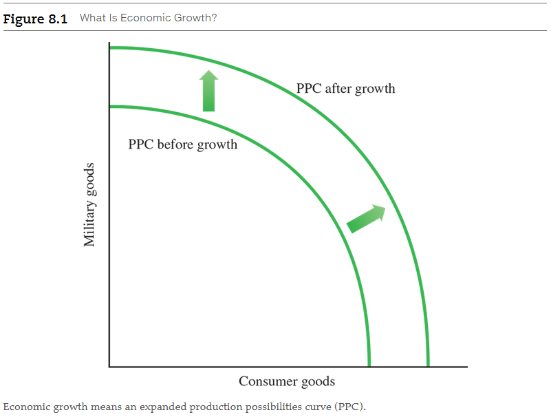
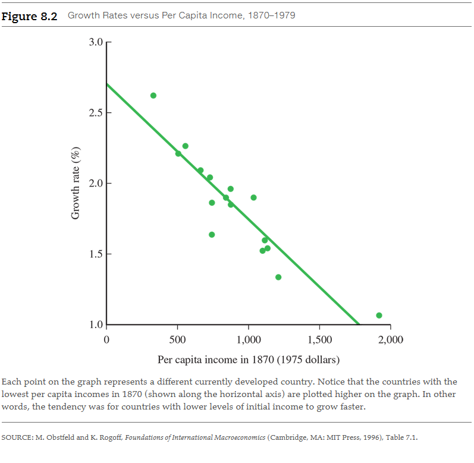
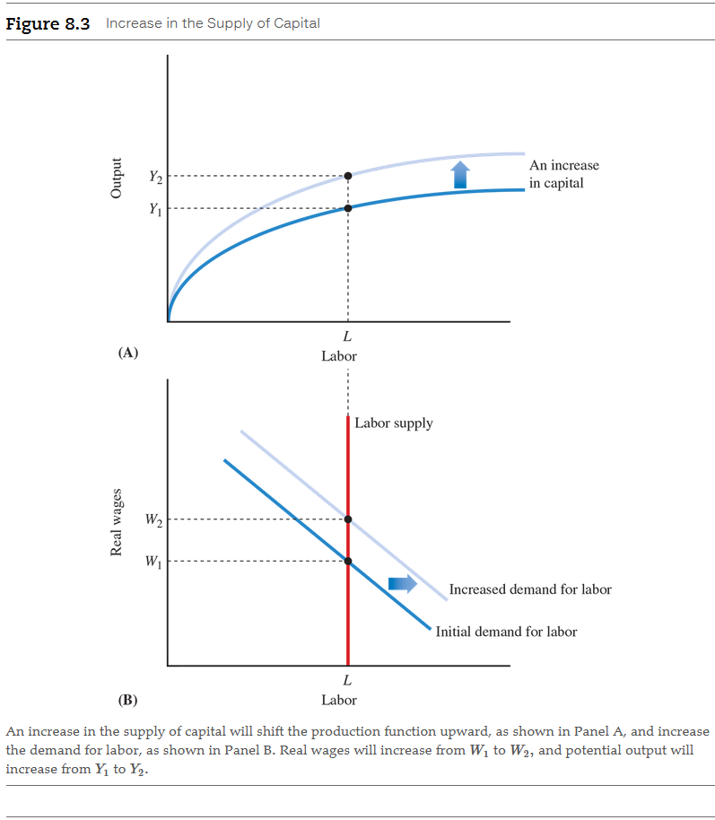
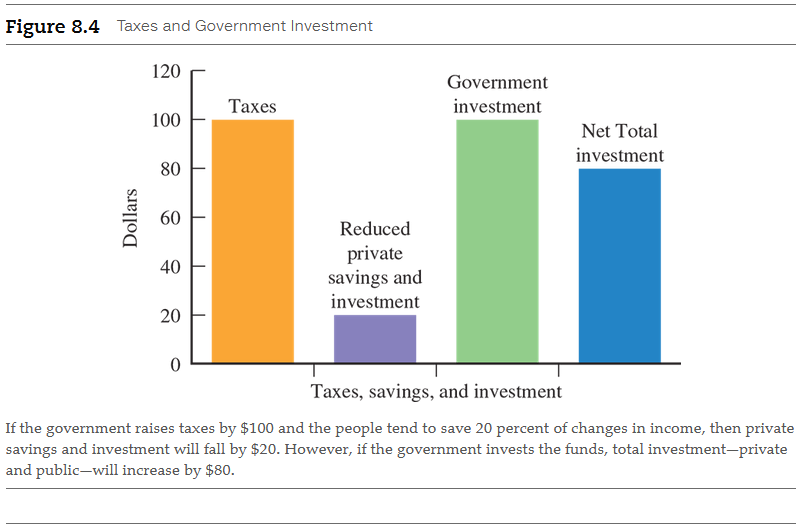
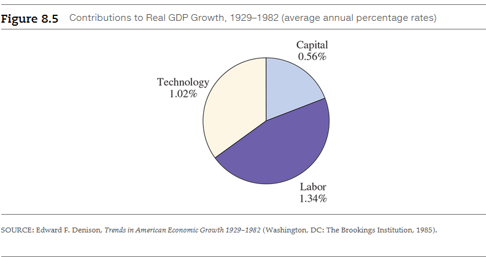
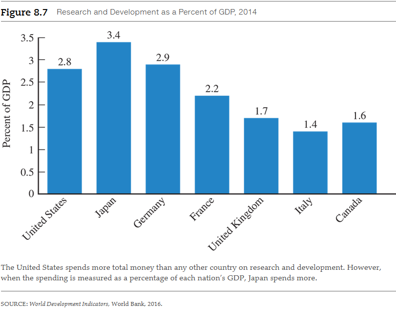

# Chapter 8: Why Do Economies Grow?

<a name="capital-deepening-term">**Capital deepening**</a>

- Increase in the stock of capital per worker.

<a name="technological-progress-term">**Technological progress**</a>

- More efficient ways of organizing economic affairs that allow an economy to
  increase output without increasing inputs.

<a name="human-capital-term">**Human capital**</a>

- The knowledge and skills acquired by a worker through education and experience
  and used to produce goods and services.

## 8.1 Economic Growth Rates

Throughout the world there are vast differences in standards of living and in
rates of economic growth. To understand these differences, we first need to look
at the concepts and the tools economists use to study economic growth.

### 8.1.1 Measuring Economic Growth

<a name="real-gdp-per-capita-term">**Real GDP per capita**</a>

- Gross domestic product per person adjusted for changes in prices. It is the
  usual measure of living standards across time and among countries.

Real GDP per capita typically grows over time. A convenient way to describe the
changes in real GDP per capita is with growth rates.

<a name="growth-rate-term">**Growth rate**</a>

- The percentage rate of change of a variable from one period to another.

For example, to calculate the growth rate of real GDP from year 1 to year 2,
suppose real GDP was 100 in year 1 and 104 in year 2. In this case, the growth
rate of real GDP is:

$$
\begin{aligned}
\text{ growth rate } &= \frac{(\text{GDP in year 2} - \text{GDP in year 1})}{(\text{GDP in year 1})} \\
 &= \frac{104 - 100}{100} \\
 &= \frac{4}{100} \\
 &= 4\% \text{ per year }
\end{aligned}
$$

In other words, real GDP grew by 4 percent from year 1 to year 2. This also
means that GDP in year 2 was $(1 + 0.04)$ times GDP in year 1.

Economies can grow at different rates from one year to the next. But it often is
useful to consider what happens when an economy grows at a constant rate, say g,
for a number of years. Let's start simply. Suppose real GDP for an economy was
100 and the economy grew at a rate g for 2 years. How large would the real GDP
be 2 years later? After 1 year, GDP would be $(1 + g)$ 100. Ine the second year,
it would grow by $(1 + g)$ again or

$$
\text{ GDP } [2 \text{ years later }] = (1 + g)^{2}(100)
$$

We can generalize this to consider the case where the economy grows a constant
rate g for n years. How large would GDP be after n years? A simple formula gives
the answer:

$$
\text{ GDP } [n \text{ years later }] = (1 + g)^{n}(100)
$$

Here's a rule of thumb to help you understand the power of growth rates. Suppose
you know the growth rate of real GDP, and it is constant, but you want to know
how many years it will take until the level of real GDP doubles. The answer is
given by **the rule of 70**:

$$
\text{ years to double } = \frac{70}{(\text{percentage growth rate})}
$$

Example: For an economy that grew at 5 percent a year, it would take

$$
\frac{70}{5} = 14 \text{ years }
$$

for real GDP to double. (In case you are curious, the rule of 70 is derived by
using the mathematics of logarithms.)

### 8.1.2 Comparing the Growth Rates of Various Countries

Making comparisons of real GDP or GNP across countries is difficult. Not only do
countries have their own currencies, but patterns of consumption and prices can
differ sharply among countries. Two examples can illustrate this point. First,
because land is scarce in Japan, people live in smaller spaces than do residents
of the United States, so the price of housing is higher (relative to other
goods) than in the United States. Second, developing countries (such as India or
Pakistan) have very different price structures than developed countries. In
particular, in developing countries goods that are not traded--such as household
services or land--are relatively cheaper than goods that are traded in world
markets. In other words, while all residents of the world may pay the same price
for gold jewelry, hiring a cook or household helper is considerably less
expensive in India or Pakistan than in the United States.

It is important to take these differences into account. Fortunately, a team of
economists led by Robert Summers and Alan Heston of the University of
Pennsylvania has devoted decades to developing methods for measuring real GNP
across countries. The team's procedures are based on gathering extensive data on
prices of comparable goods in each country and adjusting for differences in
relative prices and consumption patterns. These methods are now used by the
World Bank and the International Monetary Fund, two prominent international
organizations.

Table 8.1 lists real expenditures per capita for 2014, expressed in 2011
dollars, and the average annual growth rate of real expenditures per capita
between 1960 and 2014 for 11 countries. With this data, we can compare
countries' real income over time. In terms of real expenditures per capita, the
United States led this group, followed by the United Kingdom, France, Italy, and
Japan. More representative of typical countries in the world are Mexico and
Costa Rica. Expenditures per capita in Costa Rica are slightly more than
one-fourth of the United States. Very poor countries have extremely low
expenditures per capita. Pakistan, for example, has only \$4,645 in expenditures
per person--less than 9 percent of the value for the United States.

| Country        | Real Expenditures Per Capita for 2014 in 2011 Dollars | Per Capita Growth Rate, 1960–2014 |
|----------------|-------------------------------------------------------|-----------------------------------|
| United States  | 52,292                                                | 2.02                              |
| United Kingdom | 40,241                                                | 2.25                              |
| France         | 39,374                                                | 2.45                              |
| Italy          | 35,806                                                | 2.97                              |
| Japan          | 35,358                                                | 3.50                              |
| Mexico         | 15,852                                                | 1.88                              |
| Costa Rica     | 14,185                                                | 2.05                              |
| Nigeria        | 5,500                                                 | 0.60                              |
| India          | 5,224                                                 | 3.00                              |
| Pakistan       | 4,645                                                 | 2.52                              |
| Zambia         | 3,726                                                 | 0.63                              |

In the third column of Table 8.1, notice the differences in growth rates.
Consider Japan. In 1960, Japan had expenditures per capita that was 51 percent
that of France. But notice from the third column that Japan grew on average 3.50
percent per year during the period, compared to 2.45 percent for France. By
2014, its expenditures per capita were 90 percent of that of France. To place
Japan's growth rate for this period into perspective, recall the rule of 70. If
an economy grows at an average annual rate of x percent a year, it takes 70/x
years for output to double. In Japan's case, per capita output was doubling
every 70/3.50 years, or approximately every 20 years. At this rate, from the
time someone was born to the time he or she reached the age of 40, living
standards would have increased by a factor of four--an extraordinary rate of
growth. The rule of 70 reinforces the importance of small differences in
economic growth rates. A per capita GDP growth rate of 5 percent per year means
that the living standard doubles in 14 years. With only 1 percent growth,
doubling would take 70 years.

### 8.1.3 Are Poor Countries Catching Up?

One question economists ask is whether poorer countries can close the gap
between their level of GDP per capita and the GDP per capita of richer
countries. Closing this gap is called **convergence**. To converge, poorer
countries have to grow at more rapid rates than richer countries. Since 1960,
Japan, Italy, the United Kingdom, and France all have grown more rapidly than
the United States and have narrowed the gap in per capita incomes.

<a name="convergence-term">**Convergence**</a>

- The process by which poorer countries close the gap with richer countries in
  terms of real GDP per capita.

Figure 8.2 plots the average growth rate for 16 currently developed countries
from 1870 to 1979 against the level of per capita income in 1870. Each point
represents a different country. Notice that the countries with the lowest
initial per capita incomes are plotted higher on the graph. That is, they had
higher growth rates than the countries with more income per capita. The
downward-sloping line plotted through the points indicates that the countries
with higher levels of per capita income in 1870 grew more slowly than countries
with lower levels. In other words, the tendency was for countries with lower
levels of initial income to grow faster and catch up. The graph shows that among
the currently developed countries--for example, the United States, France, and
the United Kingdom--there was a tendency for convergence over the last century.

## 8.2 Capital Deepening

One of the most important mechanisms of economic growth economists have
identified is increases in the amount of capital per worker due to capital
deepening.

Figure 8.3 shows the effects on output and real wages. For simplicity, we assume
the supply of labor is not affected by real wages and therefore draw a vertical
line (see Panel B). In Panel A, an increase in capital shifts the production
function upward because more output can be produced from the same amount of
labor. In addition, firms increase their demand for labor because the marginal
benefit from employing labor will increase. Panel B shows how the increase in
capital raises the demand for labor and increases real wages. That is, as firms
increase their demand and compete for a fixed supply of labor, they will bid up
real wages in the economy.

### 8.2.1 Saving and Investment

Let's begin with the simplest case: an economy with a constant population,
producing at full employment. This particular economy has no government or
foreign sector. Its output can be purchased only by consumers or by firms. In
other words, output consists solely of consumption (C) and investment (I). At
the same time, output generates an amount of income equivalent to the amount of
output. That is, output (Y  ) equals income. Any income that is not consumed we
call saving.

<a name="saving-term">**Saving**</a>

- Income that is not consumed

In this economy, saving must equal investment. Here's why: By definition,
consumption plus saving equals income:

$$
\text{ C } - \text{ S } = \text{ Y }
$$

but at the same time income--which is equivalent to output--also equals
consumption plus investment:

$$
\text{ C } + \text{ I } = \text{ Y }
$$

Thus, saving must equal investment:

$$
\text{ S } = \text{ I }
$$

This means that whatever consumers decide to save goes directly into investment.
Here is a simple way to remember this idea: A farmer produces corn (Y) and can
either consume it directly (C) or set it aside as "seed corn" (I) for next year.
The part the farmer sets aside and does not consume is also the farmer's saving
(S).

Next, we need to link the level of investment in the economy to the stock of
capital in the economy. The stock of capital depends on two factors: investment
and depreciation. The stock of capital increases with any gross investment
spending but decreases with depreciation. Why does depreciation decrease the
stock of capital? The answer is simple: As capital stock items such as buildings
and equipment get older (depreciate), they wear out and become less productive.
New investment is needed to replace the buildings and equipment that become
obsolete.

Suppose, for example, the stock of capital at the beginning of the year is
\$10,000. During the year, if there were \$1,000 in gross investment and \$400
in depreciation, the capital stock at the end of the year would be \$10,600
$(=\$10,000 + \$1000 - \$400)$.

It may be helpful to picture a bathtub. The level of water in the bathtub (the
stock of capital) depends on the flow of water into the bathtub through the
input faucet (gross investment) minus the flow of water out of the bathtub down
the drain (depreciation). As long as the flow in exceeds the flow out, the water
level in the bathtub (the stock of capital) will increase.

Higher saving, which leads to higher gross investment, will therefore tend to
increase the stock of capital available for production. As the stock of capital
grows, however, there typically will be more depreciation because there is more
capital (building and equipment) to depreciate. It is the difference between
gross investment and depreciation--net investment--that ultimately determines
the change in the stock of capital for the economy, the level of real wages, and
output. In our example, net investment is $\$1,000 - \$400 = \$600$.

### 8.2.2 How Do Population Growth, Government, and Trade Affect Capital Deepening?

So far, we've considered the simplest economy. Let's consider a more realistic
economy that includes population growth, a government, and trade.

First, consider the effects of population growth: A larger labor force will
allow the economy to produce more total output. However, with a fixed amount of
capital and an increasing labor force, the amount of capital per worker will be
less. With less capital per worker, output per worker will also be less because
each worker has fewer machines to use. This is an illustration of the principle
of diminishing returns.

- [⚓ The Principle of diminishing returns](../../../spring-2020/ECON-121/notes/ch-2.md#the-principle-of-diminishing-returns)

Consider India, the world's second most populous country, with over a billion
people. Although India has a large labor force, its amount of capital per worker
is low. With sharp diminishing returns to labor, per capita output in India is
low, only \$5,350 per person in 2013.

The government can affect the process of capital deepening in several ways
through its policies of spending and taxation. Suppose the government taxed its
citizens so that it could fight a war, pay its legislators higher salaries, or
give foreign aid to needy countries--in other words, to engage in government
consumption spending. The higher taxes will reduce total income. If consumers
save a fixed fraction of their income, total private savings (savings from the
nongovernmental sector) will fall. This taxation drains the private sector of
savings that would have been used for capital deepening.

Now suppose the government took all the extra tax revenues and invested them in
valuable infrastructure, such as roads, buildings, and airports. These
infrastructure investments add to the capital stock. We illustrate this idea in
Figure 8.4. If consumers were saving 20 percent of their incomes and the
government collected \$100 in taxes from each taxpayer, private saving and
investment would fall by \$20 per taxpayer, but government investment in the
infrastructure would increase by a full \$100 per taxpayer. In other words, the
government "forces" consumers (by taxing them) to invest an additional \$80 in
infrastructure that they otherwise wouldn't invest. The net result is an
increase in total social investment (private plus government) of \$80 per
taxpayer.

Finally, the foreign sector can affect capital deepening. The United States,
Canada, and Australia built their vast railroad systems in the nineteenth
century by running trade deficits--selling fewer goods and services to the rest
of the world than they were buying--and financing this gap by borrowing. This
enabled them to purchase the large amount of capital needed to build their rail
networks and grow at more rapid rates by deepening capital. Eventually, these
economies had to pay back the funds they had borrowed from abroad by running
trade surpluses--selling more goods and services to the rest of the world than
they were buying from abroad. But because economic growth had increased their
GDP and wealth, the three countries were able to afford to pay back the borrowed
funds. Therefore, this approach to financing deepening capital was a reasonable
strategy for them to pursue.

Not all trade deficits promote capital deepening, however. Suppose a country
runs a trade deficit because it wants to buy more consumer goods. The country
would be borrowing from abroad, but there would be no additional capital
deepening--just additional consumption spending. When the country is forced to
pay back the funds, there will be no additional GDP to help foot the bill. To
fund current consumption, the country will be poorer in the future.

## 8.3 The Key Role of Technological Progress

The other mechanism affecting economic growth is technological progress.
Economists use the term technological progress in a very specific way: It means
an economy operates more efficiently by producing more output without using any
more inputs.

In practice, technological progress can take many forms. The invention of the
light bulb made it possible to read and work indoors at night, the invention of
the thermometer assisted doctors and nurses in their diagnoses, and the
invention of disposable diapers made life easier at home. All these
examples--and you could provide many more--enable society to produce more output
without more labor or more capital. With higher output per person, we enjoy a
higher standard of living.

We can think of technological progress as the birth of new ideas. These new
ideas enable us to rearrange our economic affairs and become more productive.
Not all technological innovations are necessarily major scientific
breakthroughs; some are much more basic. An employee of a soft-drink company who
discovers a new and popular flavor for a soft drink is engaged in technological
progress, just like scientists and engineers. Even simple, commonsense ideas
from workers or managers can help a business use its capital and labor more
efficiently to deliver a better product to consumers at a lower price. For
example, a store manager may decide that rearranging the layout of merchandise
and the location of cash registers helps customers find products and pay for
them more quickly and easily. This change is also technological progress. As
long as there are new ideas, inventions, and new ways of doing things, the
economy can become more productive and per capita output can increase.

### 8.3.1 How Do We Measure Technological Progress?

If someone asked you how much of the increase in your standard of living was due
to technological progress, how would you answer? Robert Solow, a Nobel Laureate
in economics from the Massachusetts Institute of Technology, developed a method
for measuring technological progress in an economy. Like most good ideas, his
theory was simple. It was based on the idea of a production function.

$$
\text{ Y } = \text{ F(K, L) }
$$

where output (Y) is produced from capital (K) and labor (L), which are linked
through the production function (F). What Solow did was include in the
production function some measure of technological progress, A:

$$
\text{ Y } = \text{ F(K, L, A) }
$$

Increases in A represent technological progress. Higher values of A mean that
more output is produced from the same level of inputs K and L. If we could find
some way to measure A, we could estimate how much technological progress affects
output.

Solow noted that over any period we can observe increases in capital, labor, and
output. Using these we can measure technological progress indirectly. We first
ask how much of the change in output can be explained by contributions from
increases in the amount of capital and labor used. Whatever growth we cannot
explain in this way must therefore be caused by technological progress. The
method Solow developed to measure the contributions to economic growth from
capital, labor, and technological progress is called **growth accounting**.

Figure 8.5 illustrates the relative contributions of these growth sources for
the U.S. economy from 1929 to 1982 using growth accounting, based on a classic
study by economist Edward Denison. During this period, total output grew at a
rate of nearly 3 percent. Because capital and labor growth are measured at 0.56
and 1.34 percent per year, respectively, the remaining portion of output growth,
1.02 percent per year, must be due to technological progress. That means
approximately 35 percent of output growth came directly from technological
progress.

### 8.3.2 Using Growth Accounting

Growth accounting is a useful tool for understanding different aspects of
economic growth. As one example, economic growth slowed throughout the entire
world during the 1970s. Using growth accounting methods, economists typically
found the slowdown could not be attributed to changes in the quality or quantity
of labor inputs or to capital deepening. Either a slowdown in technological
progress or other factors not directly included in the analysis, such as higher
worldwide energy prices, must have been responsible. This led economists to
suspect that higher energy prices were the primary explanation for the reduction
in economic growth.

<a name="labor-productivity-term">**Labor productivity**</a>

- Output produced per hour of work.

## 8.4 What Causes Technological Progress?

### 8.4.1 Research and Development Funding

One way for a country to induce more technological progress in its economy is to
pay for it. If the government or large firms employ workers and scientists to
advance the frontiers of knowledge in basic sciences, their work can lead to
technological progress in the long run. Figure 8.7 presents data on the spending
on research and development as a percent of GDP for seven major countries for
2014. The United States has the highest number of scientists and engineers in
the world. However, although it spends the most money overall, as a percent of
GDP the United States spends less than Japan. A big part of U.S. spending on
research and development is in defense-related areas, unlike in Japan. Some
economists believe defense-related research and development is less likely to
lead to long-run technological change than nondefense spending; however, many
important technological developments, including the Internet, partly resulted
from military-sponsored research and development.

### 8.4.2 Monopolies That Spur Innovation

The radical notion that monopolies spur innovation was put forth by economist
Joseph Schumpeter. In Schumpeter's view, a firm will try to innovate--that is,
come up with new products and more efficient ways to produce existing
products--only if it reaps a reward. The reward a firm seeks from its
innovations is high profit, and it can obtain a high profit if it is the sole
seller, or monopolist, for the product. Other firms will try to break the firm's
monopoly through more innovation, a process Schumpeter called **creative
destruction**. Schumpeter believed that by allowing firms to compete to become
monopolies, society benefits from increased innovation.

<a name="creative-destruction-term">**Creative destruction**</a>

- The view that a firm will try to come up with new products and more efficient
  ways to produce to earn monopoly profits.

Governments do allow temporary monopolies for new ideas by issuing patents. A
patent allows the inventor of a product to have a monopoly until the term of the
patent expires, which in the United States is now 20 years. With a patent, we
tolerate some monopoly power (the power to raise prices that comes with limited
competition) in the hope of spurring innovation.

An idea related to patents that is becoming increasingly important is the need
to protect intellectual property rights. Information technology has made
possible the free flow of products and ideas around the world. Publishers of
both books and computer software face problems of unauthorized copying,
particularly in some developing countries. While residents of those countries
clearly benefit from inexpensively copied books or software, producers in the
developed countries then face reduced incentives to enter the market. Even in
the United States, pirated music and movies pose a threat to the viability of
the entertainment industry. Large and profitable firms may continue to produce
despite unauthorized copying, but other firms may be discouraged. The United
States has put piracy and unauthorized reproduction among its top agenda items
in recent trade talks with several countries.

### 8.4.3 The Scale of the Market

Adam Smith stressed that the size of a market was important for economic
development. In larger markets, firms have more incentives to come up with new
products and new methods of production. Just as Schumpeter suggested, the lure
of profits guides the activities of firms, and larger markets provide firms the
opportunity to make larger profits. This supplies another rationale for free
trade. With free trade, markets are larger, and there is more incentive to
engage in technological progress.

### 8.4.4 Induced Innovations

Some economists have emphasized that innovations come about through inventive
activity designed specifically to reduce costs. This is known as induced
innovation. For example, during the nineteenth century in the United States, the
largest single cost in agriculture was wages. Ingenious farmers and inventors
came up with many different machines and methods to cut back on the amount of
labor required.

### 8.4.5 Education, Human Capital, and the Accumulation of Knowledge

Education can contribute to economic growth in two ways. First, the increased
knowledge and skills of people complement our current investments in physical
capital. Second, education can enable the workforce in an economy to use its
skills to develop new ideas or to copy ideas or import them from abroad.
Consider a developing country today. In principle, it has at its disposal the
vast accumulated knowledge of the developed economies. But using this knowledge
probably requires a skilled workforce--one reason why many developing countries
send their best students to educational institutions in developed countries.

Increasing knowledge and skills are part of human capital--an investment in
human beings. Human capital is as important, maybe even more important, than
physical capital. Many economists, including Nobel Laureate Gary Becker of the
University of Chicago, have studied human capital in detail.

Human capital theory has two implications for understanding economic growth.
First, not all labor is equal. When economists measure the labor input in a
country, they must adjust for differing levels of education. These levels of
education reflect past investments in education and skills; individuals with
higher educational levels will, on average, be more productive. Second, health
and fitness also affect productivity. In developing countries, economists have
found a strong correlation between the height of individuals (reflecting their
health) and the wages they can earn in the farming sector.

Human capital theory can also serve as a basis for important public policy
decisions. Should a developing country invest in capital (either public or
private) or in education? The poorest developing countries lack good sanitation
systems, effective transportation, and capital investment for agriculture and
industry. However, the best use of investment funds may not be for bridges,
sewer systems, and roads, but for human capital and education. Studies
demonstrate that the returns from investing in education are extremely high in
developing countries. The gains from elementary and secondary education, in
particular, often exceed the gains from more conventional investments. In
developing countries, an extra year in school can often raise individuals' wages
by 15–20 percent a year.

### 8.4.6 New Growth Theory

For many years, economists who studied technological progress typically did so
independently of economists who studied models of economic growth. But starting
in the mid-1980s, several economists, including Nobel Laureate Robert E. Lucas
of the University of Chicago and Paul Romer of Stanford University, began to
develop models of growth that contained technological progress as essential
features. Their work helped to initiate what is known as **new growth theory**,
which accounts for technological progress within a model of economic growth.

<a name="new-growth-theory-term">**New growth theory**</a>

- Modern theories of growth that try to explain the origins of technological
  progress.

In this field, economists study, for example, how incentives for research and
development, new product development, or international trade interact with the
accumulation of physical capital. New growth theory enables economists to
address policy issues, such as whether subsidies for research and development
are socially justified and whether policies that place fewer taxes on income
earned from investment will spur economic growth or increase economic welfare.
Current research in economic growth now takes place within a broad framework
that includes explanations of technological progress. As an example, new growth
theory suggests that investment in comprehensive education in a developing
country will lead to permanent increases in the rate of technological progress,
as the workforce will be better able to incorporate new ideas and technologies
into the workplace.

New growth theory also suggests that any social factor influencing the
willingness of individuals to pursue technological advancement will be a key to
understanding economic growth. Can cultural factors also play a role? Historical
sociologist Max Weber argued that changes in religious beliefs could help us
understand growth, as he emphasized how the rise of Protestantism, with its
emphasis on the individual, set the stage for the Industrial Revolution in
Europe. This thesis has always been controversial because the links between
changes in religious beliefs and changes in economic or other behaviors are not
well understood. More recently, Professor Gregory Clark has emphasized how the
growth of middle-class values in England could possibly explain why the
Industrial Revolution began there.

## 8.5 A Key Governmental Role: Providing the Correct Incentives and Property Rights

As we discussed in Chapter 3, governments play a critical role in a market
economy. They must enforce the rules of the market economy, using police powers
to ensure that contracts are upheld, individual property rights are enforced,
and firms can enter safely into economic transactions. Although we may take
these features of our economy for granted, not all countries enjoy the benefits
of clear enforcement of property rights.

Clear property rights are, unfortunately, lacking in many developing countries
throughout the world. As many economists have argued, their absence has severely
impeded the growth of these economies.

Governments also have a broader role in designing the institutions in which
individuals and firms work, save, and invest. Economists have increasingly
recognized the importance of these institutions in determining economic growth.
For example, the residents of Hong Kong link their rapid economic growth to free
and open institutions that provide the right incentives for technological
innovations. They wanted to preserve these institutions after they officially
became part of China in 1997 and have worked hard to maintain an open society.

But for many countries, growth has been more elusive. For many years,
international organizations such as the World Bank—a consortium of countries
created to promote development—have tried a variety of diverse methods to assist
developing countries. These have included increases in foreign aid, infusions of
new machinery, promotion of universal education, and efforts to stem population
growth. Despite these efforts, some areas of the world, such as sub-Saharan
Africa, have failed to grow at all.

## Chapter Summary

In this chapter, we explored the mechanisms of economic growth. Although
economists do not have a complete understanding of what leads to growth, they
regard increases in capital per worker, technological progress, human capital,
and governmental institutions as key factors. Here are the main points to
remember:

1. _Per capita_ GDP varies greatly throughout the world. There is debate about
   whether poorer countries in the world are converging in per capita incomes to
   richer countries.
2. Economies grow through two basic mechanisms: _capital deepening_ and
   _technological progress_. Capital deepening is an increase in capital per
   worker. Technological progress is an increase in output with no additional
   increases in inputs.
3. Ongoing technological progress will lead to sustained economic growth.
4. Various theories try to explain the origins of technological progress and
   determine how we can promote it. They include spending on research and
   development, _creative destruction_, the scale of the market, induced
   inventions, and education and the accumulation of knowledge, including
   investments in human capital.
5. Governments can play a key role in designing institutions that promote
   economic growth, including providing secure property rights.

 

# Resources

Textbook

- Macroeconomics: Principles/Applications/Tools, 10e by Arthur O'Sullivan,
  Steven Sheffrin, Stepehn Perez

