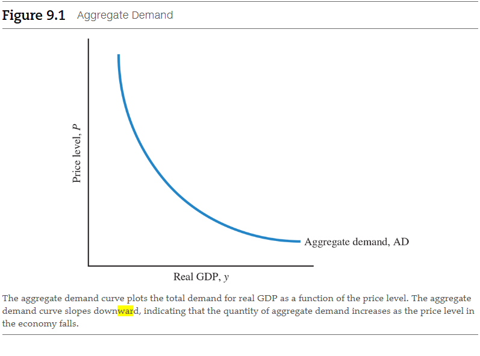
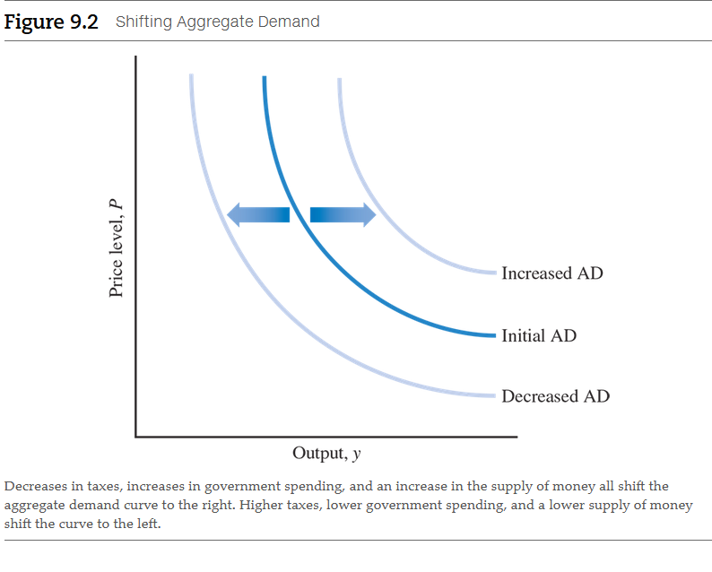
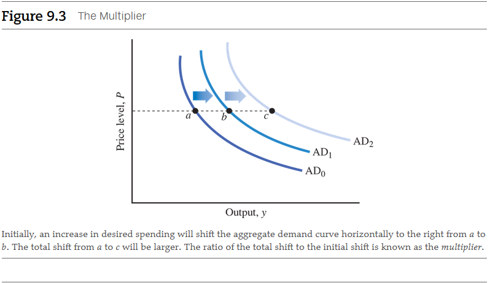
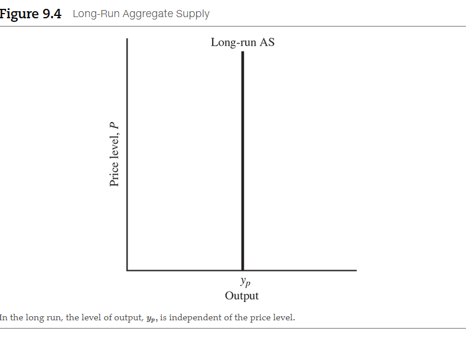
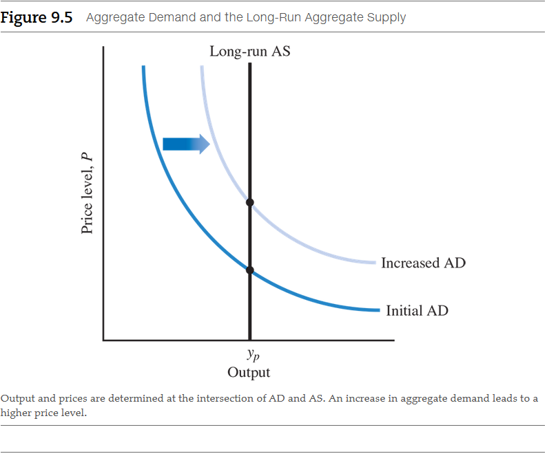
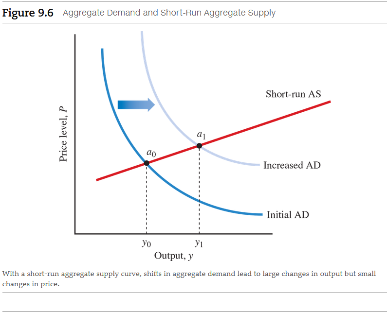
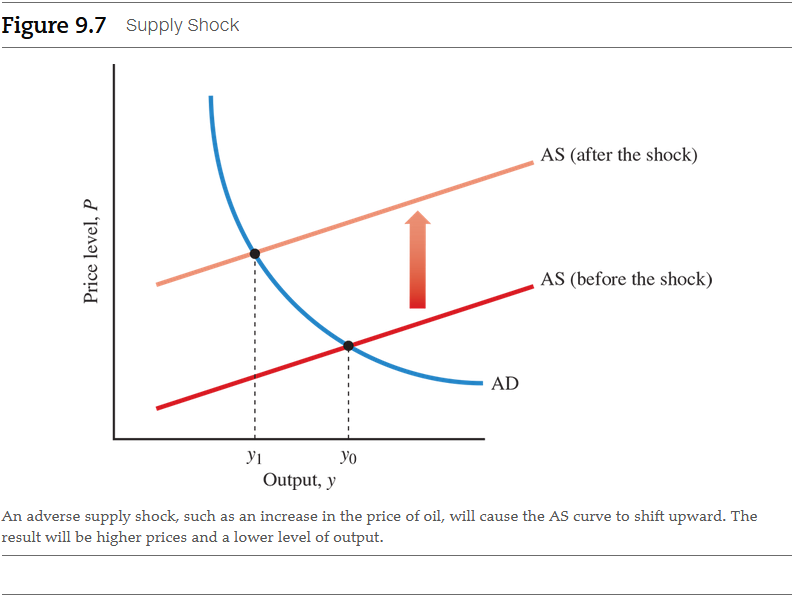
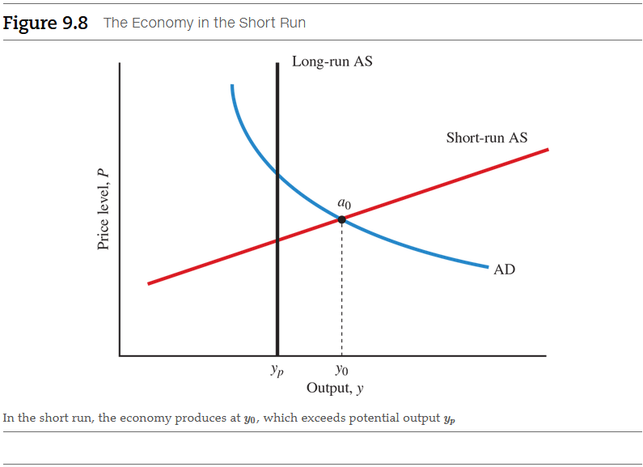
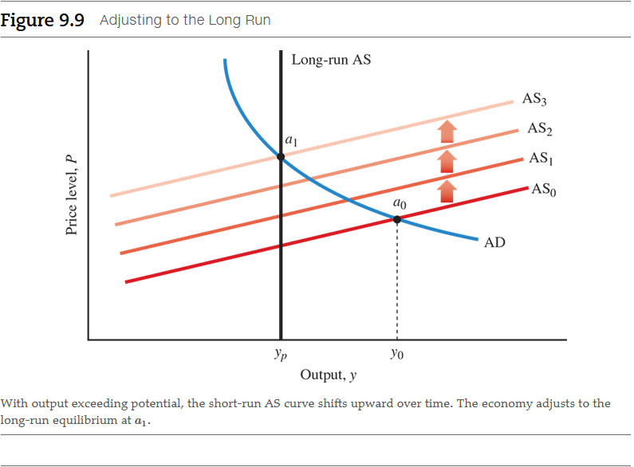

# Chapter 9: Aggregate Demand and Aggregate Supply

**Are all recessions alike?**

Recessions are downturns in an economy that affect virtually all sectors of the
economy. We want to avoid recessions, but in order to do so, we need to
understand them. One complicating factor is that recessions are not all alike.
Not all recessions have the same characteristics and causes. Both during the
Great Depression and the 2007 recession, there were massive failures of
financial institutions. In the 1970s, oil price increases caused the recessions.
In the 1980s, our government created a recession to bring down inflation. And in
the late 1990s, a stock market bubble in technology stocks eventually led to a
downturn in investment. Understanding why recessions occur is important for
diagnosing policies to cure them.

## 9.1 Sticky Prices and Their Macroeconomic Consequences

Led by Keynes, many economists have focused attention on economic coordination
problems. Normally, the price system efficiently coordinates what goes on in an
economy--even in a complex economy. The price system provides signals to firms
as to who buys what, how much to produce, what resources to use, and from whom
to buy. For example, if consumers decide to buy fresh fruit rather than
chocolate, the price of fresh fruit will rise and the price of chocolate will
fall. More fresh fruit and less chocolate will be produced on the basis of these
price signals. On a day-to-day basis, the price system works silently in the
background, matching the desires of consumers with the output from producers.

### 9.1.1 Flexible and Sticky Prices

But the price system does not always work instantaneously. If prices are slow to
adjust, then they do not give the proper signals to producers and consumers
quickly enough to bring them together. Demands and supplies will not be brought
immediately into equilibrium, and coordination can break down. In modern
economies, some prices are very flexible, whereas others are not. In the 1970s,
U.S. economist Arthur Okun distinguished between _auction prices_, prices that
adjust on a nearly daily basis, and _custom prices_, prices that adjust slowly.
Prices for fresh fish, vegetables, and other food products are examples of
auction prices--they typically are very flexible and adjust rapidly. Prices for
industrial commodities, such as steel rods or machine tools, are custom prices
and tend to adjust slowly to changes in demand. As shorthand, economists often
refer to slowly adjusting prices as "sticky prices" (just like a door that won't
open immediately but sometimes gets stuck).

Steel rods and machine tools are input prices. Like other input prices, the
price of labor also adjusts very slowly. Workers often have long-term contracts
that do not allow employers to change wages at all during a given year. Union
workers, university professors, high-school teachers, and employees of state and
local governments are all groups whose wages adjust very slowly. As a general
rule, there are very few workers in the economy whose wages change quickly.
Perhaps movie stars, athletes, and rock stars are the exceptions because their
wages rise and fall with their popularity. But they are far from the typical
worker in the economy. Even unskilled, low-wage workers are often protected from
a decrease in their wages by minimum-wage laws.

**For most firms, the biggest cost of doing business is wages. If wages are
sticky, firms' overall costs will be sticky as well. This means that firms'
product prices will remain sticky, too. Sticky wages cause sticky prices and
hamper the economy's ability to bring demand and supply into balance in the
short run.**

### 9.1.2 How Demand Determines Output in the Short Run

Typically, firms that supply intermediate goods such as steel rods or other
inputs let demand--not price--determine the level of output in the short run. To
understand this idea, consider an automobile firm that buys material from a
steelmaker on a regular basis. Because the auto firm and the steel producer have
been in business with one another for a long time and have an ongoing
relationship, they have negotiated a contract that keeps steel prices fixed in
the short run.

Suppose the automobile company's cars suddenly become very popular. The firm
needs to expand production, so it needs more steel. Under the agreement made
earlier by the two firms, the steel company would meet this higher demand and
sell more steel--without raising its price--to the automobile company. As a
result, the production of steel is totally determined in the short run by the
demand from automobile producers, not by price.

Typically, firms that supply intermediate goods such as steel rods or other
inputs let demand--not price--determine the level of output in the short run. To
understand this idea, consider an automobile firm that buys material from a
steelmaker on a regular basis. Because the auto firm and the steel producer have
been in business with one another for a long time and have an ongoing
relationship, they have negotiated a contract that keeps steel prices fixed in
the short run.

Suppose the automobile company's cars suddenly become very popular. The firm
needs to expand production, so it needs more steel. Under the agreement made
earlier by the two firms, the steel company would meet this higher demand and
sell more steel--without raising its price--to the automobile company. As a
result, the production of steel is totally determined in the short run by the
demand from automobile producers, not by price.

To summarize, the **short run in macroeconomics** is the period in which prices
do not change or do not change very much. In the macroeconomic short run, both
formal and informal contracts between firms mean that changes in demand will be
reflected primarily in changes in output, not prices.

<a name="short-run-in-macroeconomics-term">**Short run in macroeconomics**</a>

- The period of time in which prices do not change or do not change very much.

## 9.2 Understanding Aggregate Demand

### 9.2.1 What Is the Aggregate Demand Curve?

_Aggregate demand_ is the total demand for goods and services in an entire
economy. In other words, it is the demand for currently produced GDP by
consumers, firms, the government, and the foreign sector. Aggregate demand is a
macroeconomic concept because it refers to the economy as a whole, not to
individual goods or markets.

The **aggregate demand curve (AD)** shows the relationship between the level of
prices and the quantity of real GDP demanded. An aggregate demand curve is shown
in Figure 9.1. It plots the total demand for GDP as a function of the price
level. (Recall that the price level is the average level of prices in the
economy, as measured by a price index.) At each price level, shown on the y
axis, we ask what the total quantity demanded will be for all goods and services
in the economy, shown on the x axis. In Figure 9.1, the aggregate demand curve
is downward-sloping. As the price level falls, the total quantity demanded for
goods and services increases. To understand what the aggregate demand curve
represents, we must first learn the components of aggregate demand, why the
aggregate demand curve slopes downward, and the factors that can shift the
curve.

<a name="aggregate-demand-curve-term">**Aggregate demand curve (AD)**</a>

- A curve that shows the relationship between the level of prices and the
  quantity of real GDP demanded.

### 9.2.2 The Components of Aggregate Demand

In our study of GDP accounting, we divided GDP into four components: consumption
spending (C), investment spending (I), government purchases (G), and net exports
(NX). These four components are also the four parts of aggregate demand because
the aggregate demand curve really just describes the demand for total GDP at
different price levels. As we will see, changes in demand coming from any of
these four sources--C, I, G, or NX--will shift the aggregate demand curve.

### 9.2.3 Why the Aggregate Demand Curve Slopes Downward

To understand the slope of the aggregate demand curve, we need to consider the
effects of a change in the overall price level in the economy. First, let's
consider the supply of money in the economy. We discuss the supply of money in
detail in later chapters, but for now, just think of the supply of money as
being the total amount of currency (cash plus coins) held by the public and the
value of all deposits in savings and checking accounts. As the price level or
average level of prices in the economy changes, so does the purchasing power of
your money. This is an example of the real-nominal principle.

- [⚓ Real-Nominal Principle](./chapter-5.md#real-nominal-principle-term)

As the purchasing power of money changes, the aggregate demand curve is affected
in three different ways:

- The wealth effects
- The interest rate effect
- The international trade effect

Let's take a closer look at each.

#### The Wealth Effect

The increase in spending that occurs because the real value of money increases
when the price level falls is known as the **wealth effect**. Lower prices lead
to higher levels of wealth, and higher levels of wealth increase spending on
total goods and services. Conversely, when the price level rises, the real value
of money decreases, which reduces people's wealth and their total demand for
goods and services in the economy. When the price level rises, consumers can't
simply substitute one good for another that's cheaper because at a higher price
level _everything_ is more expensive.

<a name="wealth-effect-term">**Wealth effect**</a>

- The increase in spending that occurs because the real value of money increases
  when the price level falls.

#### The Interest Rate Effect

With a given supply of money in the economy, a lower price level will lead to
lower interest rates. With lower interest rates, both consumers and firms will
find it cheaper to borrow money to make purchases. As a consequence, the demand
for goods in the economy (consumer durables purchased by households and
investment goods purchased by firms) will increase. (We explain the effects of
interest rates in more detail in later chapters.)

#### The International Trade Effect

In an open economy, a lower price level will mean that domestic goods (goods
produced in the home country) become cheaper relative to foreign goods, so the
demand for domestic goods will increase. For example, if the price level in the
United States falls, it will make U.S. goods cheaper relative to foreign goods.
If U.S. goods become cheaper than foreign goods, exports from the United States
will increase and imports will decrease. Thus, net exports--a component of
aggregate demand--will increase.

### 9.2.4 Shifts in the Aggregate Demand Curve

A fall in price causes the aggregate demand curve to slope downward because of
three factors: the wealth effect, the interest rate effect, and the
international trade effect. What happens to the aggregate demand curve if a
variable other than the price level changes? An increase in aggregate demand
means that total demand for all the goods and services contained in real GDP has
increased--even though the price level hasn't changed. **In other words, increases
in aggregate demand shift the curve to the right. Conversely, factors that
decrease aggregate demand shift the curve to the left--even though the price
level hasn't changed.**

Let's look at the key factors that cause these shifts. We discuss each factor in
detail in later chapters.

- Changes in the supply of money
- Changes in taxes
- Changes in government spending
- All other changes in demand

#### Changes in the Supply of Money

An increase in the supply of money in the economy will increase aggregate demand
and shift the aggregate demand curve to the right. We know that an increase in
the supply of money will lead to higher demand by both consumers and firms. At
any given price level, a higher supply of money will mean more consumer wealth
and an increased demand for goods and services. A decrease in the supply of
money will decrease aggregate demand and shift the aggregate demand curve to the
left.

#### Changes in Taxes

A decrease in taxes will increase aggregate demand and shift the aggregate
demand curve to the right. Lower taxes will increase the income available to
households and increase their spending on goods and services--even though the
price level in the economy hasn't changed. An increase in taxes will decrease
aggregate demand and shift the aggregate demand curve to the left. Higher taxes
will decrease the income available to households and decrease their spending.

#### Changes in Government Spending

At any given price level, an increase in government spending will increase
aggregate demand and shift the aggregate demand curve to the right. For example,
the government could spend more on national defense or on interstate highways.
Because the government is a source of demand for goods and services, higher
government spending naturally leads to an increase in total demand for goods and
services. Similarly, decreases in government spending will decrease aggregate
demand and shift the curve to the left.

#### All Other Changes in Demand

Any change in demand from households, firms, or the foreign sector will also
change aggregate demand. For example, if the Chinese economy expands very
rapidly and Chinese citizens buy more U.S. goods, U.S. aggregate demand will
increase. Or, if U.S. households decide they want to spend more, consumption
will increase and aggregate demand will increase. Expectations about the future
also matter. For example, if firms become optimistic about the future and
increase their investment spending, aggregate demand will also increase.
However, if firms become pessimistic, they will cut their investment spending
and aggregate demand will fall.

When we discuss factors that shift aggregate demand, we must not include any
changes in the demand for goods and services that arise from movements in the
price level. **Changes in aggregate demand that accompany changes in the price
level are already included in the curve and do not shift the curve**. The
increase in consumer spending that occurs when the price level falls from the
wealth effect, the interest rate effect, and the international trade effect is
already in the curve and does not shift it.

> **Table 9.1** Factors That Shift Aggregate Demand

| Factors That Increase Aggregate Demand | Factors That Decrease Aggregate Demand |
|----------------------------------------|----------------------------------------|
| Decrease in taxes                      | Increase in taxes                      |
| Increase in government spending        | Decrease in government spending        |
| Increase in money supply               | Decrease in the money supply           |

### 9.2.5 How the Multiplier Makes the Shift Bigger

Let's take a closer look at the shift in the aggregate demand curve and see how
far changes really make the curve shift. Suppose the government increases its
spending on goods and services by \$10 billion. You might think the aggregate
demand curve would shift to the right by \$10 billion, reflecting the increase
in demand for these goods and services. Initially, the shift will be precisely
\$10 billion. In Figure 9.3, this is depicted by the shift (at a given price
level) from a to b. But after a brief period of time, total aggregate demand
will increase by more than \$10 billion. In Figure 9.3, the total shift in the
aggregate demand curve is shown by the larger movement from a to c. The ratio of
the total shift in aggregate demand to the initial shift in aggregate demand is
known as the **multiplier**.

<a name="multiplier-term">**Multiplier**</a>

- The ratio of the total shift in aggregate demand to the shift in aggregate
  demand.

Why does the aggregate demand curve shift more than the initial increase in
desired spending? The logic goes back to the ideas of economist John Maynard
Keynes. Here's how it works: Keynes believed that as government spending
increases and the aggregate demand curve shifts to the right, output will
subsequently increase, too. As we saw with the circular flow in Chapter 5,
increased output also means increased income for households, as firms pay
households for their labor and for supplying other factors of production.
Typically, households will wish to spend, or consume, part of that income, which
will further increase aggregate demand. It is this additional spending by
consumers, over and above what the government has already spent, that causes the
further shift in the aggregate demand curve.

The basic idea of how the multiplier works in an economy is simple. Let's say
the government invests \$10 million to renovate a federal court building.
Initially, total spending in the economy increases by this \$10 million paid to
a private construction firm. The construction workers and owners are paid \$10
million for their work. Suppose the owners and workers spend \$6 million of
their income on new cars (although, as we will see, it does not really matter
what they spend it on). To meet the increased demand for new cars, automobile
producers will expand their production and earn an additional \$6 million in
wages and profits. They, in turn, will spend part of this additional
income--let's say, \$3.6 million--on televisions. The workers and owners who
produce televisions will then spend part of the \$3.6 million they earn, and so
on.

To take a closer look at this process, we first need to look more carefully at
the behavior of consumers and how their behavior helps to determine the level of
aggregate demand. Economists have found that consumer spending depends on the
level of income in the economy. When consumers have more income, they want to
purchase more goods and services. The relationship between the level of income
and consumer spending is known as the **consumption function**:

<a name="consumption-function-term">**Consumption function**</a>

- The relationship between consumption spending and the level of income.

$$
C = C_{a} + by
$$

where consumption spending, $C$, has two parts. The first part, $C_{a}$, is a
constant and is independent of income. Economists call this **autonomous
consumption spending**.

<a name="autonomous-consumption-spending-term">**Autonomous consumption spending**</a>

- The part of consumption spending that does not depend on income.

Autonomous spending is spending that does not depend on the level of income. For
example, all consumers, regardless of their current income, will have to
purchase some food. The second part, $by$, represents the part of consumption
that is dependent on income. It is the product of a fraction, $b$, called the
**marginal propensity to consume (MPC)**, and the level of income, or $y$, in
the economy. The MPC (or $b$ in our formula) tells us how much consumption
spending will increase for every dollar that income increases. For example, if
$b$ is 0.6, then for every \$1.00 that income increases, consumption increases
by \$0.60.

<a name="marginal-propensity-to-consume-term">**Marginal propensity to consume (MPC)**</a>

- The fraction of additional income that is spent

Here is another way to think of the MPC: If a household receives some additional
income, it will increase its consumption by some additional amount. The MPC is
defined as the ratio of additional consumption to additional income, or

$$
\text{ MPC } = \frac{\text{additional consumption}}{\text{additional income}}
$$

For example, if the household receives an additional \$100 and consumes an
additional \$70, the MPC will be

$$
\frac{\$70}{\$100} = 0.7
$$

You may wonder what happens to the other \$30. Whatever the household does not
spend out of income, it saves. Therefore, the **marginal propensity to save
(MPS)** is defined as the ratio of additional savings to additional income

$$
\text{ MPS } = \frac{\text{additional savings}}{\text{additional income}}
$$

You may wonder what happens to the other \$30. Whatever the household does not
spend out of income, it saves. Therefore, the marginal propensity to save (MPS)
is defined as the ratio of additional savings to additional income

Now we are in a better position to understand the multiplier. Suppose the
government increases its purchases of goods and services by \$10 million. This
will initially raise aggregate demand and income by \$10 million. But because
income has risen by \$10 million, consumers will now wish to increase their
spending by an amount equal to the marginal propensity to consume multiplied by
the \$10 million. (Remember that the MPC tells us how much consumption spending
will increase for every dollar that income increases.) If the MPC were 0.6, then
consumer spending would increase by \$6 million when the government spends \$10
million. Thus, the aggregate demand curve would continue to shift to the right
by another \$6 million in addition to the original \$10 million, for a total of
\$16 million.

But the process does not end there. As aggregate demand increases by \$6
million, income will also increase by \$6 million. Consumers will then wish to
increase their spending by the $\text{ MPC } \times \$6 \text{ million }$ or, in
our example, by \$3.6 million $(0.6 \times \$6 \text{ million })$. The
aggregate demand curve will continue to shift to the right, now by _another_
\$3.6 million. Adding \$3.6 million to \$16 million gives us a new aggregate
demand total of \$19.6 million. As you can see, this process will continue, as
consumers now have an additional \$3.6 million in income, part of which they
will spend again. Where will it end?

Table 9.2 shows how the multiplier works in detail. In the first round, there is
an initial increase in government spending of \$10 million. This additional
demand leads to an initial increase in GDP and income of \$10 million. Assuming
that the MPC is 0.6, the \$10 million of additional income will increase
consumer spending by \$6 million. The second round begins with this \$6 million
increase in consumer spending. Because of this increase in demand, GDP and
income increase by \$6 million. At the end of the second round, consumers will
have an additional \$6 million; with an MPC of 0.6, consumer spending will
therefore increase by \$0.6 \times \$6 \text{ million }\$, or \$3.6 million.
The process continues in the third round with an increase in consumer spending
of $2.16 million. It continues, in diminishing amounts, through subsequent
rounds. If we add up the spending in all the (infinite) rounds, we will find
that the initial $10 million of spending leads to a $25 million increase in GDP
and income. That's 2.5 times what the government initially spent. So, in this
case, the multiplier is 2.5.

> **Table 9.2** The Multiplier in Action

| Round of Spending | Increases in aggregate demand, in millions | Increase in G D P and income, in millions | Increase in consumption, in millions |
|-------------------|--------------------------------------------|-------------------------------------------|--------------------------------------|
| 1                 | $10.00                                     | $10.00                                    | $6.00                                |
| 2                 | 6.00                                       | 6.00                                      | 3.60                                 |
| 3                 | 3.60                                       | 3.60                                      | 2.16                                 |
| 4                 | 2.16                                       | 2.16                                      | 1.30                                 |
| .                 | .                                          | .                                         | .                                    |
| Total             | 25.00                                      | 25.00                                     | 15.00                                |

Instead of calculating spending round by round, we can use a simple formula to
figure out what the multiplier is:

$$
\text{ multiplier } = \frac{1}{(1 - \text{ MPC })}
$$

Thus, in the preceding example, when the MPC is 0.6, the multiplier would be:

$$
\frac{1}{(1 - 0.6)} = 2.5
$$

Now you should clearly understand why the total shift in the aggregate demand
curve from a to c in Figure 9.3 is greater than the initial shift in the curve
from a to b. This is the multiplier in action. The multiplier is important
because it means that relatively small changes in spending could lead to
relatively large changes in output. For example, if firms cut back on their
investment spending, the effects on output would be "multiplied," and this
decrease in spending could have a large, adverse impact on the economy.

## 9.3 Understanding Aggregate Supply

Now we turn to the supply side of our model. The **aggregate supply curve (AS)**
shows the relationship between the level of prices and the total quantity of
final goods and output that firms are willing and able to supply. The aggregate
supply curve will complete our macroeconomic picture, uniting the economy's
demand for real output with firms' willingness to supply output. To determine
both the price level and real GDP, we need to combine both aggregate demand and
aggregate supply. One slight complication is that because prices are "sticky" in
the short run, we need to develop two different aggregate supply curves, one
corresponding to the long run and one to the short run.

<a name="aggregate-supply-curve-term">**Aggregate supply curve (AS)**</a>

- A curve that shows the relationship between the level of prices and the
  quantity of output supplied.

### 9.3.1 The Long-Run Aggregate Supply Curve

First, we consider the aggregate supply curve for the long run, that is, when
the economy is at full employment. This curve is also called the **long-run
aggregate supply curve**. In previous chapters, we saw that the level of
full-employment output, $y_{p}$ (the "p" stands for potential), depends solely
on the supply of factors--capital, labor--and the state of technology. These are
the fundamental factors that determine output in the long run, that is, when the
economy operates at full employment.

<a name="long-run-aggregate-supply-curve-term">**Long-run aggregate supply curve**</a>

- A vertical aggregate supply curve that reflects the idea that in the long run,
  output is determined solely by the factors of production and technology.

In the long run, the economy operates at full employment and changes in the
price level do not affect employment. To illustrate why this is so, imagine that
the price level in the economy increases by 50 percent. That means firms’
prices, on average, will also increase by 50 percent. However, so will their
input costs. Their profits will be the same and, consequently, so will their
output. Because the level of full-employment output does not depend on the price
level, we can plot the long-run aggregate supply curve as a vertical line
(unaffected by the price level), as shown in Figure 9.4.

#### Determining Output and the Price Level

We combine the aggregate demand curve and the long-run aggregate supply curve in
Figure 9.5. Together, the curves show us the price level and output in the long
run when the economy returns to full employment. Combining the two curves will
enable us to understand how changes in aggregate demand affect prices in the
long run.

The intersection of an aggregate demand curve and an aggregate supply curve
determines the price level and equilibrium level of output. At that intersection
point, the total amount of output demanded will just equal the total amount
supplied by producers--the economy will be in macroeconomic equilibrium. The
exact position of the aggregate demand curve will depend on the level of taxes,
government spending, and the supply of money, although it will always slope
downward. The level of full-employment output determines the long-run aggregate
supply curve.

An increase in aggregate demand (perhaps brought about by a tax cut or an
increase in the supply of money) will shift the aggregate demand curve to the
right, as shown in Figure 9.5. In the long run, the increase in aggregate demand
will raise prices but leave the level of output unchanged. In general, shifts in
the aggregate demand curve in the long run do not change the level of output in
the economy, but only change the level of prices. Here is an important example
to illustrate this idea: If the money supply is increased by 5 percent a year,
the aggregate demand curve will also shift by 5 percent a year. In the long run,
this means that prices will increase by 5 percent a year--that is, there will be
5 percent inflation. **An important lesson: In the long run, increases in the
supply of money do not increase real GDP--they only lead to inflation.**

### 9.3.2 The Short-Run Aggregate Supply Curve

In the short run, prices are sticky (slow to adjust) and output is determined
primarily by demand. This is what Keynes thought happened during the Great
Depression. We can use the aggregate demand curve combined with a **short-run
aggregate supply curve** to illustrate this idea. Figure 9.6 shows a relatively
flat short-run aggregate supply curve (AS). The short-run aggregate supply curve
shows the short-run relationship between the price level and the willingness of
firms to supply output to the economy. Let's look first at its slope and then
the factors that shift the curve.

<a name="short-run-aggregate-supply-curve-term">**Short-run aggregate supply curve**</a>

- A relatively flat aggregate supply curve that represents the idea that prices
  do not change very much in the short run and that firms adjust production to
  meet demand.

The short-run aggregate supply curve has a relatively flat slope because we
assume that in the short run firms supply all the output demanded, with small
changes in prices. We've said that with formal and informal contracts firms will
supply all the output demanded with only relatively small changes in prices.

Most studies find that changes in demand have relatively little effect on prices
within a few quarters. Thus, we can think of the aggregate supply curve as
relatively flat over a limited time.

The position of the short-run supply curve will be determined by the costs of
production that firms face. **Higher costs will shift up the short-run aggregate
supply curve, while lower costs will shift it down. Higher costs will shift up
the curve because, faced with higher costs, firms will need to raise their
prices to continue to make a profit**. What factors determine the costs firms
must incur to produce output? The key factors are:

- Input prices (wages and materials)
- The state of technology
- Taxes, subsidies, or economic regulations

Increases in input prices (e.g., from higher wages or oil prices) will increase
firms' costs. This will shift up the short-run aggregate supply curve.
Improvement in technology will shift the curve down. Higher taxes or more
onerous regulations raise costs and shift the curve up, while subsidies to
production shift the curve down. As we shall see later in this chapter, when the
economy is not at full employment, wages and other costs will change. These
changes in costs will shift the entire short-run supply curve upward or downward
as costs rise or fall.

The intersection of the AD and AS curves at point $a_{0}$ determines the price
level and the level of output. Because the aggregate supply curve is flat,
aggregate demand primarily determines the level of output. In Figure 9.6, as
aggregate demand increases, the new equilibrium will be at a slightly higher
price, and output will increase from $y_{0}$ to $y_{1}$

### 9.3.3 Supply Shocks

Up to this point, we have been exploring how changes in aggregate demand affect
output and prices in the short run and in the long run. However, even in the
short run, it is possible for external disturbances to hit the economy and cause
the short-run aggregate supply curve to move. **Supply shocks** are external
events that shift the aggregate supply curve.

<a name="supply-shocks-term">**Supply shocks**</a>

- External events that shift the aggregate supply curve.

The most notable supply shocks for the world economy occurred in 1973 and again
in 1979 when oil prices increased sharply. Oil is a vital input for many
companies because it is used to both manufacture and transport their products to
warehouses and stores around the country. The higher oil prices raised firms'
costs and reduced their profits. To maintain their profit levels, firms raised
their product prices. As we have seen, increases in firms' costs will shift up
the short-run aggregate supply curve--increases in oil prices are a good
example.

Figure 9.7 illustrates a supply shock that raises prices. The short-run
aggregate supply curve shifts up with the supply shock because, as their costs
rise, firms will supply their output only at a higher price. The AS curve shifts
up, raising the price level and lowering the level of output from $y_{0}$ to
$y_{1}$. Adverse supply shocks can therefore cause a recession (a fall in real
output) with increasing prices. This phenomenon is known as stagflation, and it
is precisely what happened in 1973 and 1979. The U.S. economy suffered on two
grounds: rising prices and falling output. Favorable supply shocks, such as
falling prices, are also possible, and changes in oil prices can affect
aggregate demand. 

## 9.4 From the Short Run to the Long Run

In Figure 9.8, we show the aggregate demand curve intersecting the short-run
aggregate supply curve at $a_{0}$ at an output level $y_{0}$. We also depict the
long-run aggregate supply curve in this figure. The level of output in the
economy, $y_{0}\$, exceeds the level of potential output, $y_{p}$. In other
words, this is a boom economy: Output exceeds potential.

What happens during a boom? Because the economy is producing at a level beyond
its long-run potential, the level of unemployment will be very low. This will
make it difficult for firms to recruit and retain workers. Firms will also find
it more difficult to purchase needed raw materials and other inputs for
production. As firms compete for labor and raw materials, the tendency will be
for both wages and prices to increase over time.

Increasing wages and prices will shift the short-run aggregate supply curve
upward as the costs of inputs rise in the economy. Figure 9.9 shows how the
short-run aggregate supply curve shifts upward over time. As long as the economy
is producing at a level of output that exceeds potential output, there will be
continuing competition for labor and raw materials that will lead to continuing
increases in wages and prices. In the long run, the short-run aggregate supply
curve will keep rising until it intersects the aggregate demand curve at
$a_{1}$. At this point, the economy reaches the long-run equilibrium--precisely
the point where the aggregate demand curve intersects the long-run aggregate
supply curve.

When the economy is producing below full employment or potential output, the
process works in reverse. Unemployment will exceed the natural rate, and there
will be excess unemployment. Firms will find it easy to hire and retain workers,
and they will offer workers less wages. As firms cut wages, the average wage
level in the economy falls. Because wages are the largest component of costs and
costs are decreasing, the short-run aggregate supply curve shifts down, causing
prices to fall as well.

**The lesson here is that adjustments in wages and prices take the economy from
the short-run equilibrium to the long-run equilibrium.**

## Chapter Summary

In this chapter we discussed how sticky prices--or lack of full-wage and price
flexibility--cause output to be determined by demand in the short run. We
developed a model of aggregate demand and supply to help us analyze what is
happening or has happened in the economy. Here are the main points in this
chapter:

1. Because prices are sticky in the short run, economists think of GDP as being
   determined primarily by demand factors in the short run.
2. The _aggregate demand curve_ depicts the relationship between the price level
   and total demand for real output in the economy. The aggregate demand curve
   is downward-sloping because of the wealth effect, the interest rate effect,
   and the international trade effect.
3. Decreases in taxes, increases in government spending, and increases in the
   supply of money all increase aggregate demand and shift the aggregate demand
   curve to the right. Increases in taxes, decreases in government spending, and
   decreases in the supply of money all decrease aggregate demand and shift the
   aggregate demand curve to the left. In general, anything (other than price
   movements) that increases the demand for total goods and services will
   increase aggregate demand.
4. The total shift in the aggregate demand curve is greater than the initial
   shift. The ratio of the total shift in aggregate demand to the initial shift
   in aggregate demand is known as the _multiplier_.
5. The _aggregate supply curve_ depicts the relationship between the price level
   and the level of output that firms supply in the economy. Output and prices
   are determined at the intersection of the aggregate demand and aggregate
   supply curves.
6. The _long-run aggregate supply curve_ is vertical because, in the long run,
   output is determined by the supply of factors of production. The _short-run
   aggregate supply curve_ is fairly flat because, in the short run, prices are
   largely fixed, and output is determined by demand. The costs of production
   determine the position of the short-run aggregate supply curve.
7. _Supply shocks_ can shift the short-run aggregate supply curve.
8. As costs change, the short-run aggregate supply curve shifts in the long run,
   restoring the economy to the full-employment equilibrium.

 

# Resources

Textbook

- Macroeconomics: Principles/Applications/Tools, 10e by Arthur O'Sullivan,
  Steven Sheffrin, Stepehn Perez

