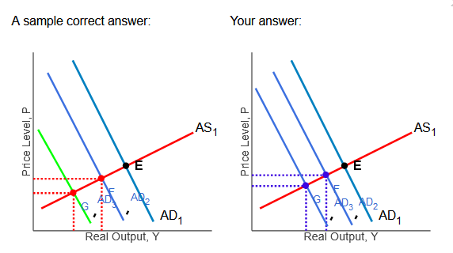

# Chapter 10

## Homework

### Q1

A Chinese Experiment. In 2000, the Chinese government mandated three one-week
holidays throughout the year to stimulate consumer spending. The idea was that
these extended vacations would induce the Chinese to spend more of their
earnings while on vacation.

1. Using the line drawing tool, shift the appropriate $AD$-$AS$ lines in the
   accompanying graph, to illustrate the mechanism through which the Chinese
   government believed that the mandated holidays would stimulate the economy.
   Label the new $AD/AS$ lines $AD_{2}$ or $AS_{2}$ as appropriate.
2. Using the point drawing tool, locate the new equilibrium point and label it
   $F$.

### Q2

The States and Balanced Budgets. The accompanying figure shows the initial
aggregate demand and aggregate supply curves for the U.S.  Suppose the national
economy experiences a recession.

1. Using the line drawing tool, show the effect of the recession by
   appropriately shifting the $AD$-$AS$ curves. Label the new curve(s) $AD_{2}$
   and $AS_{2}$ as appropriate.
2. Using the point drawing tool, label the new equilibrium $F$.  Unlike the U.S.
   federal government, virtually all states have requirements that they must
   either plan for or maintain a balanced budget.
3. Using the line drawing tool, show the impact on the national economy of the
   actions taken by the states to balance their budgets when the national
   economy experiences a recession. Appropriately shift the $AD$-$AS$ curves and
   label the shifted curve(s) $AD_{3}$ and $AS_{3}$ as needed.
4. Using the point drawing tool, label the new equilibrium $G$.

### Q3

The U.S. economy witnessed federal budget surpluses in the late 20th century
under **President Clinton**.

Tax cuts in 2008 under President Bush, the large stimulus package of 2009 under
President Obama, and the tax cuts of 2017 under President Trump **increased**
the debt to GDP ratio **significantly** and could limit the ability of the U.S.
government to conduct expansionary fiscal policy in the near future.

## Quiz

### Q1

Political Systems and the Inside Lag for Fiscal Policy. Under a parliamentary
system like in Britain, there are fewer checks and balances on the government
than in the United States. In a parliamentary system, the party that controls
the legislature also runs the executive branch. Consider the inside lag for
fiscal policy in England compared to that in the United States.

The inside lag would be

**D. shorter in England since it would be easier to reach a consensus on policy
changes. **

### Q2

Why are stabilization policies difficult to implement effectively?

**D. All of the above.**

### Q3

_Just Raise Taxes?_ As the population ages and entitlement spending on Social
Security and Medicare increase, some have argued that we should just raise taxes
to pay for them.

The main argument against this solution is that the level of entitlements as a
fraction of GDP is predicted to

**B. rise so high that raising taxes would dramatically increase the tax burden
on the economy and impede economic growth.**

### Q4

_The Rise and Fall of Fiscal Surpluses_. Which of the following factors led the
United States from federal surpluses at the end of the 1990s to deficits in the
first decade of 2000?

**A. Tax cuts combined with increased spending.**

### Q5

_Debit Cards as a Fiscal Stimulus_. Here is one unusual fiscal policy: The
government would issue time-dated debit cards to each person that had to be
spent on goods and services produced only by U.S. firms within a fixed period
(say, three months) or become worthless. Suppose the government was considering
whether to issue \$400 in time-dated debit cards to each household or give each
household \$400 in cash instead.

Which of the following statements regarding the two plans is true?

**A. Time-dated debit cards would have greater immediate impact on consumption
spending since they had to be spent within a specific period of time and the
higher the value of the MPC, the greater the total impact on spending and
income.**

