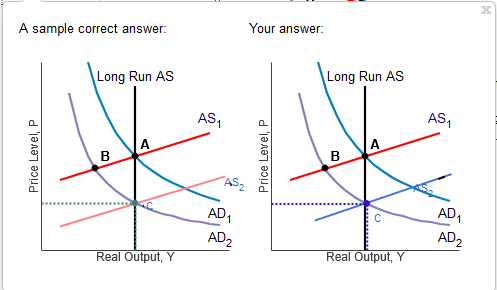

# Chapter 9

## Homework

### Q1

Shown at right is an aggregate demand curve.

Congress has decided to enact a tax cut for all Americans earning less than
\$50,000 in gross income.

Determine the effect on aggregate demand.

Using the line drawing tool, draw a new aggregate demand curve. Label this line
'AD 1'.

### Q2

The government spent \$46 billion for various infrastructure upgrades. If the marginal propensity to
consume is 0.62 , the marginal propensity to save is **0.38**.

> 1 - 0.62 = 0.38

The increased government spending created \$**121.05** billion of additional
spending.

$$
\begin{aligned}
\text{ Total spending increase } &= \text{ Increased government spending } \times \frac{1}{1 - \text{ marginal propensity to consume }} \\
\text{ Total spending increase } &= 46 \times \frac{1}{1 - 0.62} \approx 121.05
\end{aligned}
$$

### Q3

The short-run aggregate supply curve is shown at right.  Suppose OPEC decides to
reduce oil production.  Using the line drawing tool, draw and label a new
short-run aggregate supply.

> short-run aggregate supply shifts upward

The impact would result in

- **stagflation: a higher price level and higher unemployment.**

### Q4

Consider a decrease in the supply of money that causes output to fall short of
full employment as shown in the diagram to the right.

1. Using the line drawing tool, show how the short-run aggregate supply curve
   changes to restore full employment. Label the curve AS2.

2. Using the point drawing tool, locate the new long-run equilibrium point.
   Label it C.

### Q5

A negative supply shock temporarily **lowers** output **below** full employment
and **raises** prices.

After the negative supply shock, real GDP is **lower than** potential GDP.

This implies that unemployment is **rising**, driving wages **down**. This
results in a **rightward or downward**. shift of the short-run aggregate supply
curve.

## Quiz

### Q1

In the diagram to the right, the economy is currently at point A.

President Donald Trump lowered taxes in 2018. The Congress also increased
government spending that year. Ceteris paribus, these actions are represented
by:

- a shift of the aggregate demand curve from $AD_{1}$ to $AD_{2}$ (point A to
  C).

### Q2

Calculating the MPS and MPC. In one year, a consumer's income increases by \$300
and her savings increases by \$180.

Her marginal propensity to consume is equal to **0.4**.

Her marginal propensity to save is equal to **0.6**.

> MPS = $\frac{\text{additional savings}}{\text{additional income}}$

> MPC = $1 - \text{MPS}$

### Q3

The short-run aggregate supply curve shows the short-run relationship between
the

- price level and the willingness of firms to supply output to the economy.

Evidence about the behavior of prices in the economy suggests that changes in
aggregate demand have a relatively **small** effect on prices within a few
quarters so that the short-run aggregate supply curve is relatively **flat**.
Thus, shifts in aggregate demand lead to **large** changes in output, but
**small** changes in price.

### Q4

State and Local Governments During Recessions. During recessions, state
governments often will have to raise taxes and cut spending in order to keep
their own budgets balanced. If a large number of states do this, at the national
level, the aggregate demand curve will

- shift to the left since both of these actions are contractionary.

### Q5

Saving Behavior and Multipliers in Two Countries. Consumers in Country A have an
MPS of 0.2 while consumers in Country B have an MPS of 0.1. Country **B** has
the higher value for the multiplier.

