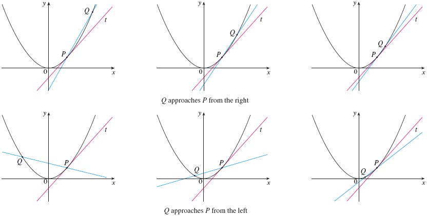

# Chapter 2: Limits and Derivatives

## 2.1 The Tangent Line and Velocity Problem

- [`The Tangent Line and Velocity Problem](https://www.youtube.com/watch?v=EvAa4p-tWlQ)

<a name="tangent-term">**Tangent**</a>

- The word _tangent_ is derived from the Latin word _tangent_, which means
  "touching".

<a name="secant-term">**Secant**</a>

- A _secant line_, from the Latin word _secant_, meaning cutting, is a line that
  cuts (intersects) a curve more than once.

### The Tangent Problem

Finding the slope of a tangent (approximation) using only the tangent point.

Example 1: Find an equation of the tangent line to the parabola $y = x^{2}$

Solution:

$$
m_{PQ} = \frac{x^{2} - 1}{x - 1}
$$

For instance, for the point $Q$ (1.5, 2.25) we have

$$
m_{PQ} = \frac{2.25 - 1}{1.5 - 1} = \frac{1.25}{0.5} = 2.5
$$

<table>
<tr><td>

| $x$   | $m_{PQ}$ |
|-------|----------|
| 2     | 3        |
| 1.5   | 2.5      |
| 1.1   | 2.1      |
| 1.01  | 2.01     |
| 1.001 | 2.001    |

</td><td>

| $x$   | $m_{PQ}$ |
|-------|----------|
| 0     | 1        |
| 0.5   | 1.5      |
| 0.9   | 1.9      |
| 0.99  | 1.99     |
| 0.999 | 1.999    |

</td></tr>
</table>

This suggests that the slope of the tangent line $t$ should be $m = 2$.

We say that the slope of the tangent line is the _limit_ of the slopes of the
secant lines, and we express this symbolically by writing

$$
\lim_{Q \to P} m_{PQ} = m
$$

and

$$
\lim_{x \to 1} \frac{x^{2} - 1}{x - 1} = 2
$$

Assuming that the slope of the tangent line is indeed 2, we use the point-slope
form of the equation of a line [#Point-Slope Form](../../../spring-2020/MATH-141/notes/ch-2#point-slope-form-term)
to write the equation of the tangent line through (1, 1) as

$$
y - 1 = 2(x - 1)
$$

or

$$
y = 2x - 1
$$

> Figure 3 illustrates the limiting process that occurs in this example. As $Q$
approaches $P$ along the parabola, the corresponding secant lines rotate about
$P$ and approach the tangent line $t$.

Other Resources:

- [Calculus 1: Limits & Derivatives (2 of 27) The Slope of a Line](https://www.youtube.com/watch?v=723jsxCO7Oc)

 

# Resources

- [`The Tangent Line and Velocity Problem](https://www.youtube.com/watch?v=EvAa4p-tWlQ)

Textbook

+ [Cengage e-Textbook: Calculus Early Transcendentals, Eighth Edition, Stewart](https://webassign.com/)
