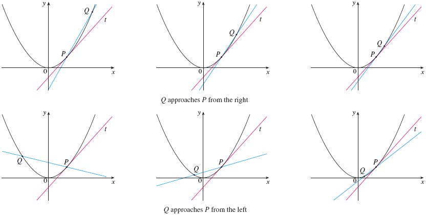
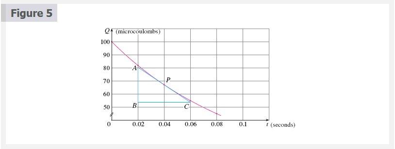
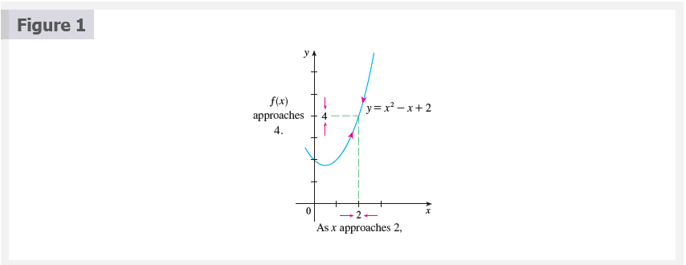
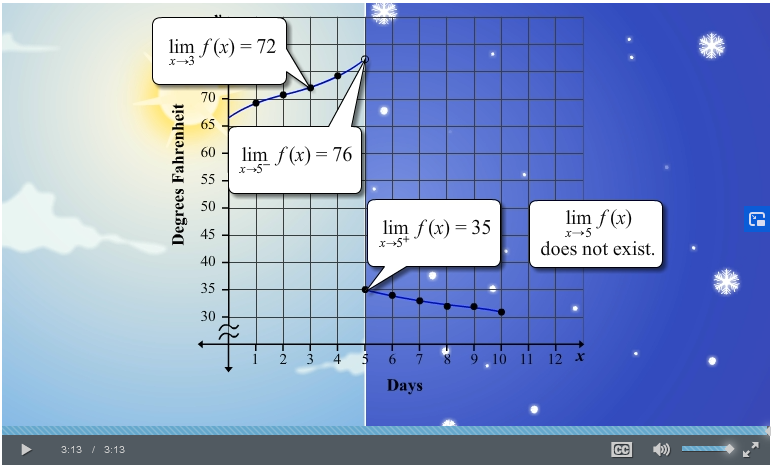

# Chapter 2: Limits and Derivatives

## 2.1 The Tangent Line and Velocity Problem

- [`The Tangent Line and Velocity Problem](https://www.youtube.com/watch?v=EvAa4p-tWlQ)

<a name="tangent-term">**Tangent**</a>

- The word _tangent_ is derived from the Latin word _tangent_, which means
  "touching".

<a name="secant-term">**Secant**</a>

- A _secant line_, from the Latin word _secant_, meaning cutting, is a line that
  cuts (intersects) a curve more than once.

### The Tangent Problem

Finding the slope of a tangent (approximation) using only the tangent point.

**Example 1:**

Find an equation of the tangent line to the parabola $y = x^{2}$

**Solution:**

$$
m_{PQ} = \frac{x^{2} - 1}{x - 1}
$$

For instance, for the point $Q$ (1.5, 2.25) we have

$$
m_{PQ} = \frac{2.25 - 1}{1.5 - 1} = \frac{1.25}{0.5} = 2.5
$$

<table>
<tr><td>

| $x$   | $m_{PQ}$ |
|-------|----------|
| 2     | 3        |
| 1.5   | 2.5      |
| 1.1   | 2.1      |
| 1.01  | 2.01     |
| 1.001 | 2.001    |

</td><td>

| $x$   | $m_{PQ}$ |
|-------|----------|
| 0     | 1        |
| 0.5   | 1.5      |
| 0.9   | 1.9      |
| 0.99  | 1.99     |
| 0.999 | 1.999    |

</td></tr>
</table>

This suggests that the slope of the tangent line $t$ should be $m = 2$.

We say that the slope of the tangent line is the _limit_ of the slopes of the
secant lines, and we express this symbolically by writing

$$
\lim_{Q \to P} m_{PQ} = m
$$

and

$$
\lim_{x \to 1} \frac{x^{2} - 1}{x - 1} = 2
$$

Assuming that the slope of the tangent line is indeed 2, we use the point-slope
form of the equation of a line [#Point-Slope Form](../../../spring-2020/MATH-141/notes/ch-2#point-slope-form-term)
to write the equation of the tangent line through (1, 1) as

$$
y - 1 = 2(x - 1)
$$

or

$$
y = 2x - 1
$$

> Figure 3 illustrates the limiting process that occurs in this example. As $Q$
approaches $P$ along the parabola, the corresponding secant lines rotate about
$P$ and approach the tangent line $t$.

**Example 2:**

Use the data to draw the graph of this function and estimate the slope of the
tangent line at the point where $t = 0.04$

| t    | Q      |
|------|--------|
| 0.00 | 100.00 |
| 0.02 | 81.87  |
| 0.04 | 67.03  |
| 0.06 | 54.88  |
| 0.08 | 44.93  |
| 0.10 | 36.76  |

**Solution:**

Given the points $P(0.04, 67.03)$ and $R(0.00, 100.00)$ on the graph, we find
that the slope of the secant line $PR$ is

$$
m_{PR} = \frac{100.00 - 67.03}{0.00 - 0.04} = -824.25
$$

The table below shows the results of similar calculations for the slopes of
other secant lines.

| $R$            | $m_{PR}$ |
|----------------|----------|
| (0.00, 100,00) | -824.25  |
| (0.02, 81.87)  | -742.00  |
| (0.06, 54.88 ) | -607.50  |
| (0.08, 44,93)  | -552.50  |
| (0.10, 36.76)  | -504.50  |

From this table we would expect the slope of the tangent line at $t=  0.04$ to
lie somewhere between $-742$ and $-607.5$. In fact, the average of the slopes of
the two closest secant lines is

$$
\frac{1}{2}(-742 - 607.5) = -674.75
$$

By this method, the slope of the tangent line is approximately $\mathbf{-675}$

Another method is to draw an approximation to the tangent line at $P$ and
measure the sides of the triangle $ABC$

This gives an estimate of the slop of the tangent line as

$$
-\frac{\left | AB \right |}{\left | BC \right |} \approx
- \frac{80.4 - 53.6}{0.06 - 0.02} = 670
$$

### The Velocity Problem

**Example 3:**

Suppose that a ball is dropped from the upper observation deck of the CN Tower
in Toronto, $450 m$ above the ground. Find the velocity of the ball after 5
seconds.

**Solution:**

If the distance fallen after $t$ seconds is denoted by $s(t)$ and measured in
meters

$$
s(t) = 4.9t^{2}
$$

The difficulty in finding the velocity after 5 seconds is that we are dealing
with a single instant of time $(t = 5)$, so no time interval is involved.
However, we can approximate the desired quantity by computing the average
velocity over the brief time interval of a tenth of a second from $t = 5$ to $t
= 5.1$:

$$
\begin{aligned}
\text{average velocity} &= \tfrac{\text{change in position}}{\text{time elapsed}} \\
                        &= \tfrac{s(5.1) - s(5)}{0.1} \\
                        &= \tfrac{4.9(5.1)^{2} - 4.9(5)^{2}}{0.1} = 49.49m/s
\end{aligned}
$$

The following table shows the results of similar calculations of the average
velocity over successively smaller time periods.

| **Time interval**   | **Average velocity** (m/s) |
|---------------------|----------------------------|
| $5 \le t \le 6$     | 53.9                       |
| $5 \le t \le 5.1$   | 49.49                      |
| $5 \le t \le 5.05$  | 49.245                     |
| $5 \le t \le 5.01$  | 49.049                     |
| $5 \le t \le 5.001$ | 49.0049                    |

It appears that as we shorten the time period, the average velocity is becoming
closer to $49m/s$. The **instantaneous velocity** when $t = 5$ is defined to be
the limiting value of these average velocities over shorter and shorter time
periods that start at $t = 5$. Thus it appears that the (instantaneous)
velocity after 5 seconds is

$$
v = 49m/s
$$

This is also related to the tangent problem and finding velocities. If we
consider the points $P(a, 4.9a^{2}$ and $Q(a + h, 4.9(a + h)^{2}$ on the graph,
then the slope of the secant line $PQ$ is

$$
m_{PQ} = \frac{4.9(a + h)^{2} - 4.9a^{2}}{(a + h) + a}
$$

which is the same as the average velocity over the time interval $[a, a + h]$.
Therefore the velocity at time $t = a$ (the limit of these average velocities as
$h$ approaches $0$) must be equal to the slope of the tangent line at $P$ (the
limit of the slopes of the secant lines).

Other Resources:

- [`Calculus 1: Limits & Derivatives (2 of 27) The Slope of a Line](https://www.youtube.com/watch?v=723jsxCO7Oc)

## 2.2 The Limit of a Function

Behavior of the function $f$ defined by $f(x) = x^{2} - x + 2$ for values of
$x$ near 2.

The following table gives values of $f(x)$ for values of $x$ close to 2 but not
equal to 2.

| $x$   | $f(x)$   |
|-------|----------|
| 1.0   | 2.000000 |
| 1.5   | 2.750000 |
| 1.8   | 3.440000 |
| 1.9   | 3.710000 |
| 1.95  | 3.852500 |
| 1.99  | 3.970100 |
| 1.995 | 3.985025 |
| 1.999 | 3.997001 |
| 3.0   | 8.000000 |
| 2.5   | 5.750000 |
| 2.2   | 4.640000 |
| 2.1   | 4.310000 |
| 2.05  | 4.152500 |
| 2.01  | 4.030100 |
| 2.005 | 4.015025 |
| 2.001 | 4.003001 |

From the table and the graph of $f$(a parabola) shown in Figure 1 we see that
the closer $x$ is to 2 (on either side of 2), the closer $f(x)$ is to 4. In
fact, it appears that we can make the values of $f(x)$ as close as we like to 4
by taking $x$ sufficiently close to 2. We express this by saying "the limit of
the function $f(x) = x^{2} - x + 2$ as $x$ approaches 2 is equal to 4". The
notation for this is

$$
\lim_{x \to 2} (x^{2} - x + 2) = 4
$$

**Intuitive Definition of a Limit**

Suppose $f(x)$ is defined when $x$ is near the number $a$. (This means that $f$
is defined on some open interval that contains $a$, except possibly at $a$
itself.) then we write

$$
\lim_{x \to a} f(x) = L
$$

and say

"the limit of $f(x)$, as $x$ approaches $a$, equals $L$"

if we can make the value of $f(x)$ arbitrarily close to $L$ (as close to $L$ as
we like) by restricting $x$ to be sufficiently close to $a$ (on either side of
$a$) but not equal to $a$.

 

# Resources

- [`The Tangent Line and Velocity Problem](https://www.youtube.com/watch?v=EvAa4p-tWlQ)
- [`Calculus 1: Limits & Derivatives (2 of 27) The Slope of a Line](https://www.youtube.com/watch?v=723jsxCO7Oc)

Textbook

+ [Cengage e-Textbook: Calculus Early Transcendentals, Eighth Edition, Stewart](https://webassign.com/)

