# Chapter 2: Limits and Derivatives

## 2.1 The Tangent Line and Velocity Problem

- [🎬 The Tangent Line and Velocity Problem](https://www.youtube.com/watch?v=EvAa4p-tWlQ)

<a name="tangent-term">**Tangent**</a>

- The word _tangent_ is derived from the Latin word _tangent_, which means
  "touching".

<a name="secant-term">**Secant**</a>

- A _secant line_, from the Latin word _secant_, meaning cutting, is a line that
  cuts (intersects) a curve more than once.

### The Tangent Problem

Finding the slope of a tangent (approximation) using only the tangent point.

**Example 1:**

Find an equation of the tangent line to the parabola $y = x^{2}$

**Solution:**

$$
m_{PQ} = \frac{x^{2} - 1}{x - 1}
$$

For instance, for the point $Q$ (1.5, 2.25) we have

$$
m_{PQ} = \frac{2.25 - 1}{1.5 - 1} = \frac{1.25}{0.5} = 2.5
$$

<table>
<tr><td>

| $x$   | $m_{PQ}$ |
|-------|----------|
| 2     | 3        |
| 1.5   | 2.5      |
| 1.1   | 2.1      |
| 1.01  | 2.01     |
| 1.001 | 2.001    |

</td><td>

| $x$   | $m_{PQ}$ |
|-------|----------|
| 0     | 1        |
| 0.5   | 1.5      |
| 0.9   | 1.9      |
| 0.99  | 1.99     |
| 0.999 | 1.999    |

</td></tr>
</table>

This suggests that the slope of the tangent line $t$ should be $m = 2$.

We say that the slope of the tangent line is the _limit_ of the slopes of the
secant lines, and we express this symbolically by writing

$$
\lim_{Q \to P} m_{PQ} = m
$$

and

$$
\lim_{x \to 1} \frac{x^{2} - 1}{x - 1} = 2
$$

Assuming that the slope of the tangent line is indeed 2, we use the point-slope
form of the equation of a line [⚓ Point-Slope Form](../../../spring-2020/MATH-141/notes/ch-2#point-slope-form-term)
to write the equation of the tangent line through (1, 1) as

$$
y - 1 = 2(x - 1)
$$

or

$$
y = 2x - 1
$$

> Figure 3 illustrates the limiting process that occurs in this example. As $Q$
approaches $P$ along the parabola, the corresponding secant lines rotate about
$P$ and approach the tangent line $t$.

**Example 2:**

Use the data to draw the graph of this function and estimate the slope of the
tangent line at the point where $t = 0.04$

| t    | Q      |
|------|--------|
| 0.00 | 100.00 |
| 0.02 | 81.87  |
| 0.04 | 67.03  |
| 0.06 | 54.88  |
| 0.08 | 44.93  |
| 0.10 | 36.76  |

**Solution:**

Given the points $P(0.04, 67.03)$ and $R(0.00, 100.00)$ on the graph, we find
that the slope of the secant line $PR$ is

$$
m_{PR} = \frac{100.00 - 67.03}{0.00 - 0.04} = -824.25
$$

The table below shows the results of similar calculations for the slopes of
other secant lines.

| $R$            | $m_{PR}$ |
|----------------|----------|
| (0.00, 100,00) | -824.25  |
| (0.02, 81.87)  | -742.00  |
| (0.06, 54.88 ) | -607.50  |
| (0.08, 44,93)  | -552.50  |
| (0.10, 36.76)  | -504.50  |

From this table we would expect the slope of the tangent line at $t=  0.04$ to
lie somewhere between $-742$ and $-607.5$. In fact, the average of the slopes of
the two closest secant lines is

$$
\frac{1}{2}(-742 - 607.5) = -674.75
$$

By this method, the slope of the tangent line is approximately $\mathbf{-675}$

Another method is to draw an approximation to the tangent line at $P$ and
measure the sides of the triangle $ABC$

This gives an estimate of the slop of the tangent line as

$$
-\frac{\left | AB \right |}{\left | BC \right |} \approx
- \frac{80.4 - 53.6}{0.06 - 0.02} = 670
$$

### The Velocity Problem

**Example 3:**

Suppose that a ball is dropped from the upper observation deck of the CN Tower
in Toronto, $450 m$ above the ground. Find the velocity of the ball after 5
seconds.

**Solution:**

If the distance fallen after $t$ seconds is denoted by $s(t)$ and measured in
meters

$$
s(t) = 4.9t^{2}
$$

The difficulty in finding the velocity after 5 seconds is that we are dealing
with a single instant of time $(t = 5)$, so no time interval is involved.
However, we can approximate the desired quantity by computing the average
velocity over the brief time interval of a tenth of a second from $t = 5$ to $t
= 5.1$:

$$
\begin{aligned}
\text{average velocity} &= \tfrac{\text{change in position}}{\text{time elapsed}} \\
                        &= \tfrac{s(5.1) - s(5)}{0.1} \\
                        &= \tfrac{4.9(5.1)^{2} - 4.9(5)^{2}}{0.1} = 49.49m/s
\end{aligned}
$$

The following table shows the results of similar calculations of the average
velocity over successively smaller time periods.

| **Time interval**   | **Average velocity** (m/s) |
|---------------------|----------------------------|
| $5 \le t \le 6$     | 53.9                       |
| $5 \le t \le 5.1$   | 49.49                      |
| $5 \le t \le 5.05$  | 49.245                     |
| $5 \le t \le 5.01$  | 49.049                     |
| $5 \le t \le 5.001$ | 49.0049                    |

It appears that as we shorten the time period, the average velocity is becoming
closer to $49m/s$. The **instantaneous velocity** when $t = 5$ is defined to be
the limiting value of these average velocities over shorter and shorter time
periods that start at $t = 5$. Thus it appears that the (instantaneous)
velocity after 5 seconds is

$$
v = 49m/s
$$

This is also related to the tangent problem and finding velocities. If we
consider the points $P(a, 4.9a^{2}$ and $Q(a + h, 4.9(a + h)^{2}$ on the graph,
then the slope of the secant line $PQ$ is

$$
m_{PQ} = \frac{4.9(a + h)^{2} - 4.9a^{2}}{(a + h) + a}
$$

which is the same as the average velocity over the time interval $[a, a + h]$.
Therefore the velocity at time $t = a$ (the limit of these average velocities as
$h$ approaches $0$) must be equal to the slope of the tangent line at $P$ (the
limit of the slopes of the secant lines).

Other Resources:

- [🎬 Calculus 1: Limits & Derivatives (2 of 27) The Slope of a Line](https://www.youtube.com/watch?v=723jsxCO7Oc)

Other Resources:

- [🎬 Limits Intro](https://www.khanacademy.org/math/ap-calculus-ab/ab-limits-new/ab-1-2/v/introduction-to-limits-hd)
- [🌎 Limits Intro Article](https://www.khanacademy.org/math/ap-calculus-ab/ab-limits-new/ab-1-2/a/limits-intro)

## 2.2 The Limit of a Function

Behavior of the function $f$ defined by $f(x) = x^{2} - x + 2$ for values of
$x$ near 2.

The following table gives values of $f(x)$ for values of $x$ close to 2 but not
equal to 2.

| $x$   | $f(x)$   |
|-------|----------|
| 1.0   | 2.000000 |
| 1.5   | 2.750000 |
| 1.8   | 3.440000 |
| 1.9   | 3.710000 |
| 1.95  | 3.852500 |
| 1.99  | 3.970100 |
| 1.995 | 3.985025 |
| 1.999 | 3.997001 |
| 3.0   | 8.000000 |
| 2.5   | 5.750000 |
| 2.2   | 4.640000 |
| 2.1   | 4.310000 |
| 2.05  | 4.152500 |
| 2.01  | 4.030100 |
| 2.005 | 4.015025 |
| 2.001 | 4.003001 |

From the table and the graph of $f$(a parabola) shown in Figure 1 we see that
the closer $x$ is to 2 (on either side of 2), the closer $f(x)$ is to 4. In
fact, it appears that we can make the values of $f(x)$ as close as we like to 4
by taking $x$ sufficiently close to 2. We express this by saying "the limit of
the function $f(x) = x^{2} - x + 2$ as $x$ approaches 2 is equal to 4". The
notation for this is

$$
\lim_{x \to 2} (x^{2} - x + 2) = 4
$$

**Intuitive Definition of a Limit**

Suppose $f(x)$ is defined when $x$ is near the number $a$. (This means that $f$
is defined on some open interval that contains $a$, except possibly at $a$
itself.) then we write

$$
\lim_{x \to a} f(x) = L
$$

and say

"the limit of $f(x)$, as $x$ approaches $a$, equals $L$"

if we can make the value of $f(x)$ arbitrarily close to $L$ (as close to $L$ as
we like) by restricting $x$ to be sufficiently close to $a$ (on either side of
$a$) but not equal to $a$.

### One-Sided Limits

We write

$$
\lim_{x \to a^{-}} f(x) = L
$$

and say the **left-hand limit of $f(x)$ as $x$ approaches $a$** [or the **limit
of $f(x)$ as $x$ approaches $a$ from the left**] is equal to $L$ we can make the
values of $f(x)$ arbitrarily close to $L$ by taking $x$ to be sufficiently close
to $a$ with $x$ less less than $a$.

Similarly, if we require that $x$ be greater than $a$ we get "the **right-hand
limit of $f(x)$ as $x$ approaches $a$** is equal to $L$" and we write

$$
\lim_{x \to a^{+}} f(x) = L
$$

$$
\lim_{x \to a} = L
\text{\;\;if and only if\;\;}
\lim_{x \to a^{-}} f(x) = L
\text{\;\;and\;\;}
\lim_{x \to a^{+}} f(x) = L
$$

When a limit doesn't approach the same value from both sides, we say that the
limit doesn't exist.

- $\lim_{x \to 2^{-}} g(x) = 3$ and
- $\lim_{x \to 2^{+}} g(x) = 1$
  - Since the left and right limits are different, we conclude that
    $\lim_{x \to 2} g(x)$ does not exist.
- $\lim_{x \to 5^{-}} g(x) = 2$ and
- $\lim_{x \to 5^{+}} g(x) = 2$
  - This time the left and right limits are the same and so we have
    $\lim_{x \to 5} g(x) = 2$

Despite this fact, notice that $g(5) \neq 2$.

### Infinite Limits

Let $f$ be a function defined on both sides of $a$, except possibly at
$a$itself. then

$$
\lim_{x \to a} f(x) = \infty
$$

means that the values of $f(x)$ can be made arbitrarily large (as large as we
please) by taking $x$ sufficiently close to $a$, but not equal to $a$.

Another notation for $\lim_{x \to a} f(x) = \infty$ is

$$
f(x) = \infty \;\;\; as \;\;\; x \to a
$$

The vertical line $x = a$ is called a **vertical asymptote** of the curve
$y = f(x)$ if at least one of the following statements is true:

$$
\lim_{x \to a} f(x) = \infty  \lim_{x \to a^{-}} f(x) = \infty \;\; \lim_{x \to a^{+}} = \infty \\
\lim_{x \to a} f(x) = -\infty \;\; \lim_{x \to a^{-}} f(x) = -\infty \;\; \lim_{x \to a^{+}} f(x) = -\infty
$$

**Example 10:**

Find the vertical asymptote of $f(x) = \tan(x)$.

**Solution**

Because

$$
\tan(x) = \frac{\sin(x)}{\cos(x)}
$$

There are potential vertical asymptotes where $\cos(x) = 0$. In fact, since
$\cos(x) \to 0^{+}$ as $x \to (\pi/2)^{-}$ and $\cos(x) \to 0^{-}$ as
$x \to (\pi/2)^{+}$, whereas $\sin(x)$ is positive (near 1) when $x$ is near
$\pi/2$, we have

$$
\lim_{x \to (\pi/2)^{-}} \tan(x) = \infty
$$

and

$$
\lim_{x \to (\pi/2)^{+}} \tan(x) = -\infty
$$

Other Resources:

- [🎬 Estimating limit values from graphs](https://www.khanacademy.org/math/ap-calculus-ab/ab-limits-new/ab-1-3/v/limits-from-graphs)
- [🎬 Unbounded limits](https://www.khanacademy.org/math/ap-calculus-ab/ab-limits-new/ab-1-3/v/unbounded-limits)
- [🎬 One-sided limits from graphs](https://www.khanacademy.org/math/ap-calculus-ab/ab-limits-new/ab-1-3/v/one-sided-limits-from-graphs)
- [🎬 One-sided limits from graphs: asymptote](https://www.khanacademy.org/math/ap-calculus-ab/ab-limits-new/ab-1-3/v/one-sided-limits-from-graphs-asymptote)
- [🎬 Connecting limits and graphical behavior](https://www.khanacademy.org/math/ap-calculus-ab/ab-limits-new/ab-1-3/v/connecting-limits-and-graphical-behavior)
- [🎬 Approximating limits using tables](https://www.khanacademy.org/math/ap-calculus-ab/ab-limits-new/ab-1-4/v/approximating-limit-from-table)
- [🎬 Estimating limits from tables](https://www.khanacademy.org/math/ap-calculus-ab/ab-limits-new/ab-1-4/v/estimating-limit-from-table)
- [🎬 One-sided limits from tables](https://www.khanacademy.org/math/ap-calculus-ab/ab-limits-new/ab-1-4/v/one-sided-limits-from-tables)

## 2.3 Calculating Limits Using the Limit Laws

Suppose that $c$ is a constant and the limits

$$
\lim_{x \to a} f(x)
$$

and

$$
\lim_{x \to a} g(x)
$$

exist. Then...

> Limit Laws

$$
\underline{\boldsymbol{Sum Law}} \\
1.\; \lim_{x \to a} [f(x) + g(x)] = \lim_{x \to a} f(x) + \lim_{x \to a} g(x) \\
~\\
\underline{\boldsymbol{Difference Law}} \\
2.\; \lim_{x \to a} [f(x) - g(x)] = \lim_{x \to a} f(x) - \lim_{x \to a} g(x) \\
~\\
\underline{\boldsymbol{Constant Multiple Law}} \\
3.\; \lim_{x \to a} [cf(x)] = c \lim_{x \to a} f(x) \\
~\\
\underline{\boldsymbol{Product Law}} \\
4.\; \lim_{x \to a} [f(x)g(x)] = \lim_{x \to a} f(x) \cdot \lim_{x \to a} g(x) \\
~\\
\underline{\boldsymbol{Quotient Law}} \\
5.\; \lim_{x \to a} \frac{f(x)}{g(x)} = \frac{\lim_{x \to a} f(x)}{\lim_{x \to a} g(x)} \text{ if } \lim_{x \to a} g(x) \neq 0 \\
~\\
\underline{\boldsymbol{Power Law}} \\
6.\; \lim_{x \to a} [f(x)]^{n} = [\lim_{x \to a} f(x)]^{n} \; \text{ where } n \text{ is a positive integer } \\
7.\; \lim_{x \to a} c = c \\
8.\; \lim_{x \to a} x = a \\
9.\; \lim_{x \to a} x^{n} = a^{n} \; \text{ where } n \text{ is a positive integer } \\
10.\; \lim_{x \to a} \sqrt[n]{x} = \sqrt[n]{a} \; \text{ where } n \text{ is a positive integer }
~\\
\underline{\boldsymbol{Root Law}} \\
11.\; \lim_{x \to a} \sqrt[n]{f(x)} = \sqrt[n]{\lim_{x \to a} f(x)} \; \text{ where } n \text{ is a positive integer } \\
[\text{ if  } n \text{ is even, we assume that } \lim_{x \to a} f(x) > 0 \text{. }]
$$

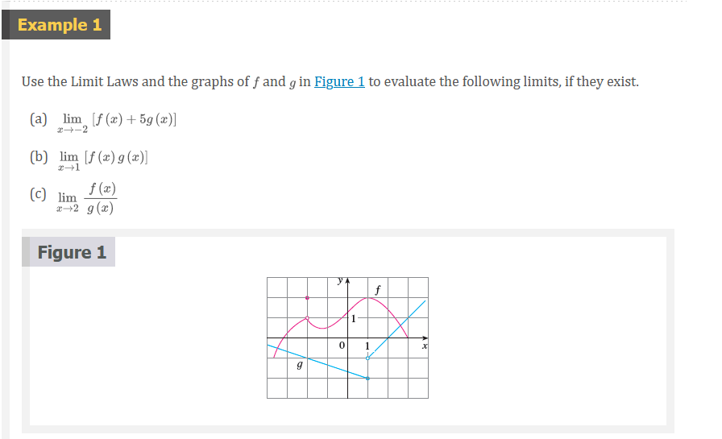

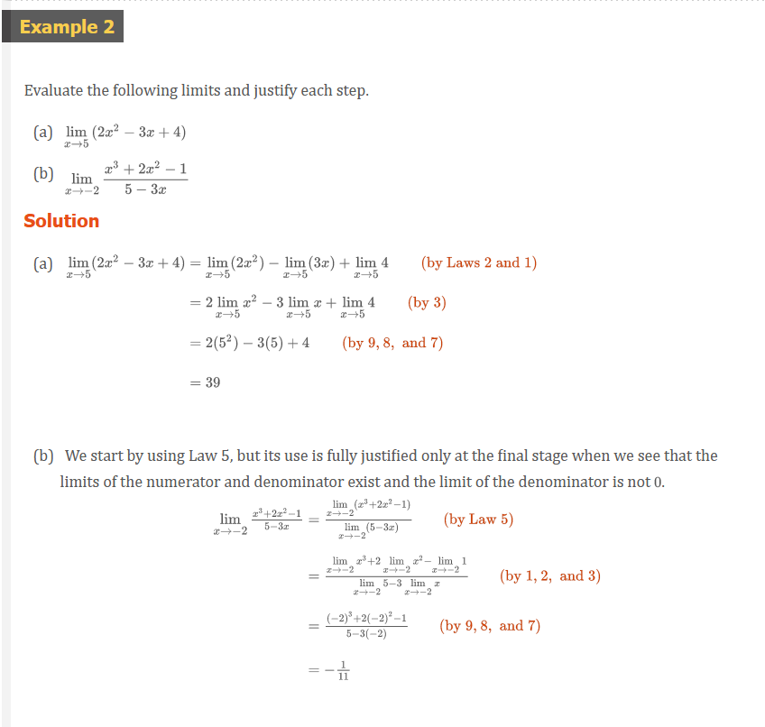

> Direct Substitution Property

If $f$ is a polynomial or a rational function and $a$ is in the domain of $f$,
then

$$
\lim_{x \to a} f(x) = f(a)
$$

> **NOTE:** Notice that in Example 3 we do not have an infinite limit even
though the denominator approaches $0$ as $x \to 1$. When both numerator and
denominator approach 0 the limit may be infinite or it may be some finite value.

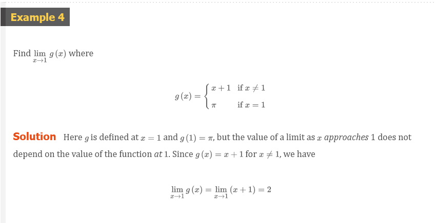
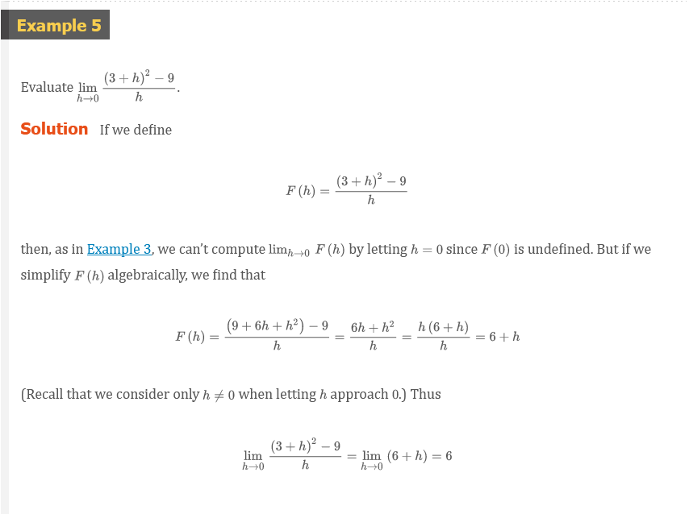

[⚓ Conjugates](../../../spring-2020/MATH-141/notes/ch-7.md#conjugates-term)

> Theorem 1

$$
\lim_{x \to a} f(x) = L
$$

if and only if

$$
\lim_{x \to a^{-}} f(x) = L = \lim_{x \to a^{+}} f(x)
$$

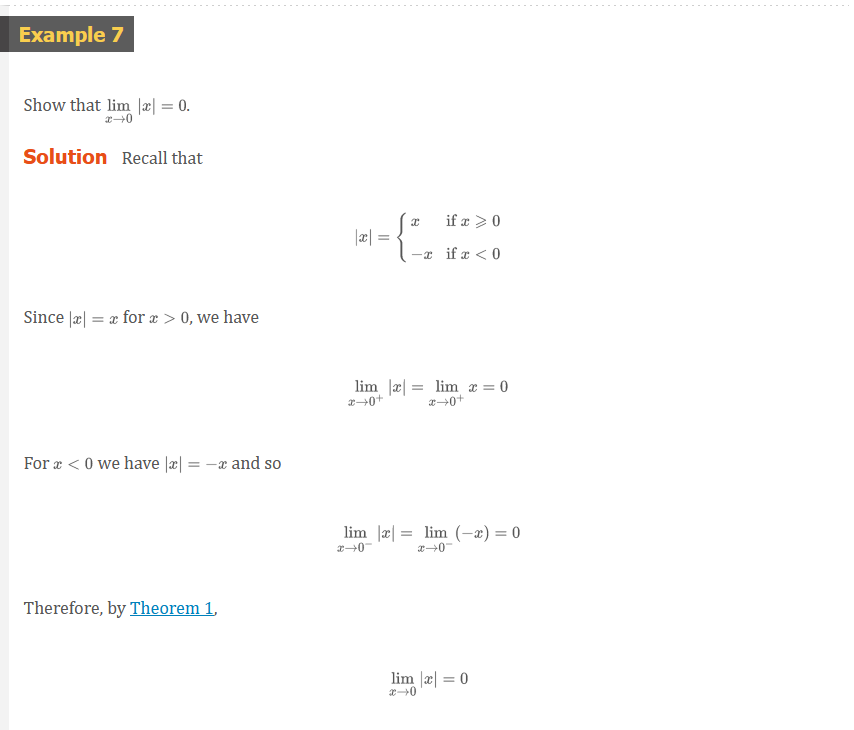

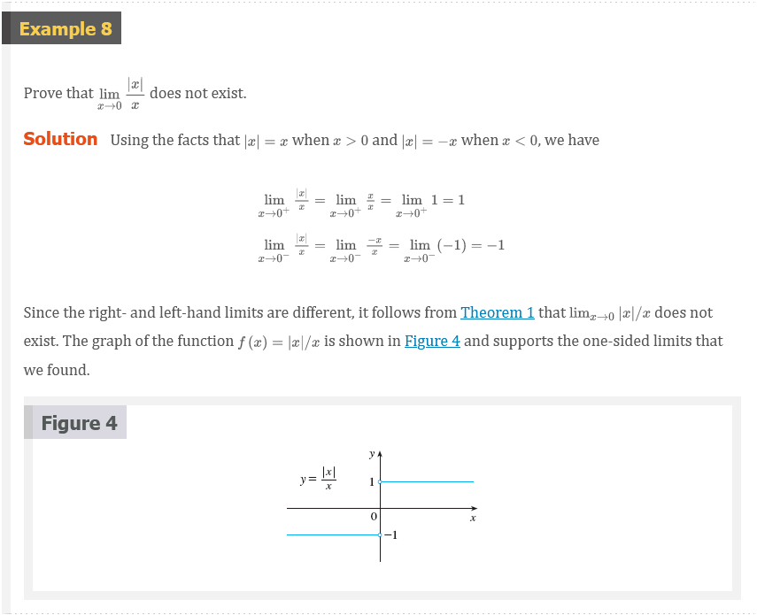
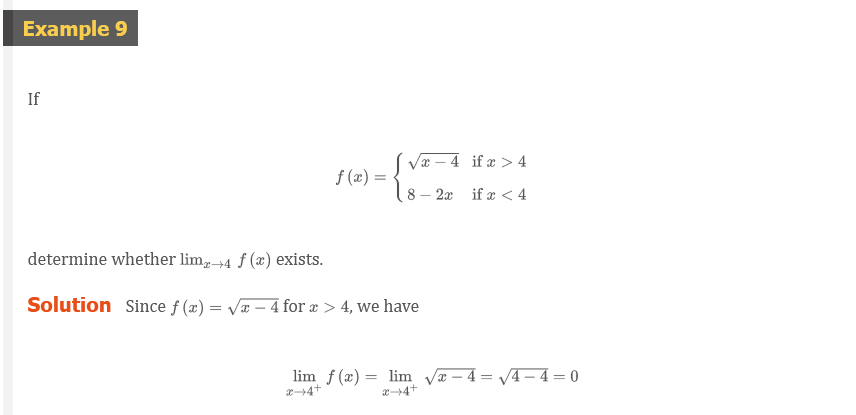

> Theorem 2

if $f(x) \le g(x)$ when $x$ is near $a$ (except possibly at $a$) and the limits
of $f$ and $g$ both exist as $x$ approaches $a$ then

$$
\lim_{x \to a} f(x) \le \lim_{x \to a} g(x)
$$

> The Squeeze Theorem

if $f(x) \le g(x) \le h(x)$ when $x$ is near $a$ (except possibly at $x$) and

$$
\lim_{x \to a} f(x) = \lim_{x \to a} h(x) = L
$$

then

$$
\lim_{x \to a} g(x) = L
$$

The Squeeze Theorem, which is sometimes called the _Sandwich Theorem_ or the
_Pinching Theorem_, is illustrated by Figure 7. It says if $g(x)$ is squeezed
between $f(x)$ and $h(x)$ near $a$, and if $f$ and $h$ have the same limit $L$
at $a$, then $g$ is forced to have the same limit $L$ at $a$.

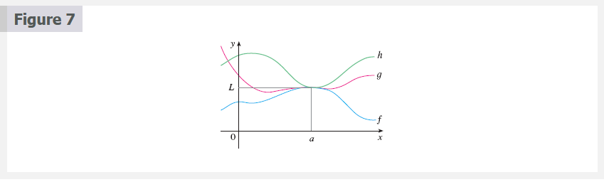

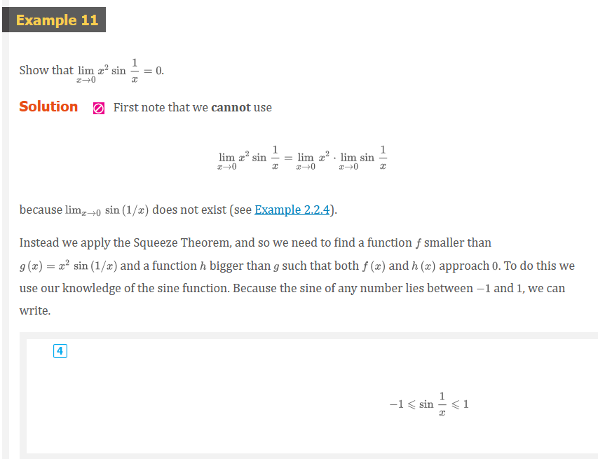

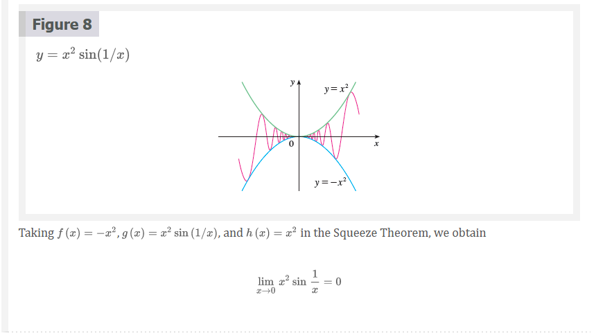

Other Resources:

- [🎬 Limit properties](https://www.khanacademy.org/math/ap-calculus-ab/ab-limits-new/ab-1-5a/v/limit-properties)
- [🎬 Limits of combined functions](https://www.khanacademy.org/math/ap-calculus-ab/ab-limits-new/ab-1-5a/v/limits-of-combined-functions)
- [🎬 Limits of combined functions: piecewise functions](https://www.khanacademy.org/math/ap-calculus-ab/ab-limits-new/ab-1-5a/v/limits-of-combined-functions-piecewise)
- [🎬 Limits by direct substitution](https://www.khanacademy.org/math/ap-calculus-ab/ab-limits-new/ab-1-5b/v/limit-by-substitution)
- [🎬 Undefined limits by direct substitution](https://www.khanacademy.org/math/ap-calculus-ab/ab-limits-new/ab-1-5b/v/undefined-limit-by-substitution)
- [🎬 Limits of trigonometric functions](https://www.khanacademy.org/math/ap-calculus-ab/ab-limits-new/ab-1-5b/v/limits-of-trigonometric-functions)
- [🎬 Limits of piecewise functions](https://www.khanacademy.org/math/ap-calculus-ab/ab-limits-new/ab-1-5b/v/limits-of-piecewise-functions)
- [🎬 How to Graph a Piecewise Function](https://www.youtube.com/watch?v=n-EgnuaThpE)
- [🎬 Graphing a Piecewise Function](https://www.youtube.com/watch?v=QIG8LvPNNJQ)
- [🎬 Limits of piecewise functions: absolute value](https://www.khanacademy.org/math/ap-calculus-ab/ab-limits-new/ab-1-5b/v/limit-at-a-point-of-discontinuity)
- [🎬 Limits by factoring](https://www.khanacademy.org/math/ap-calculus-ab/ab-limits-new/ab-1-6/v/limit-example-1?modal=1)
- [🎬 Limits by rationalizing](https://www.khanacademy.org/math/ap-calculus-ab/ab-limits-new/ab-1-6/v/limits-by-rationalizing?modal=1)

## 2.5 Continuity

### 1 Definition

A function $f$ is **continuous at a number a** if

$$
\lim_{x \to a} f(x) = f(a)
$$

Three things if $f$ is continuous at $a$:

1. $f(a)$ is defined (that is, $a$ is in the domain of $f$)
2. $\lim_{x \to a} f(x)$ exists
3. $\lim_{x \to a} f(x) = f(a)$

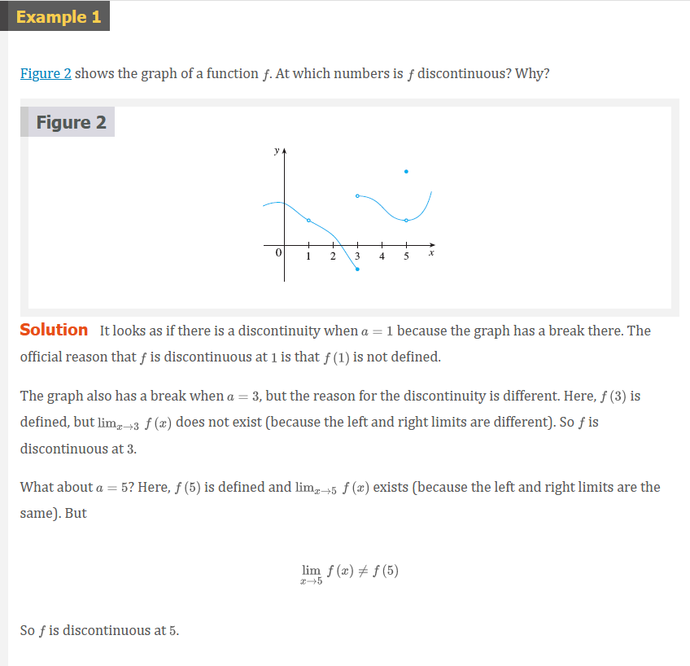

### 2 Definition

A function $f$ is **continuous from the right at a number a** if

$$
\lim_{x \to a^{+}} f(x) = f(a)
$$

and $f$ is **continuous from the left at a** if

$$
\lim_{x \to a^{-}} f(x) = f(a)
$$

### 3 Definition

A function $f$ is **continuous on an interval** if it is continuous at every
number in the interval. (if $f$ is defined only on one side of an endpoint of
the interval, we understand _continuous_ at the endpoint to mean _continuous
from the right_ or _continuous from the left_)

Other Resources:

### 4 Theorem

If $f$ and $g$ are continuous at $a$ and $c$ is a constant, then the following
functions are also continuous at a:

1. $f + g$
2. $f - g$
3. $cf$
4. $fg$
5. $\frac{f}{g}$ if $g(a) \neq 0$

### 5 Theorem

(a) Any polynomial is continuous everywhere; that is continuous on $\mathbb{R} =
(-\infty, \infty)$.

(b) Any rational function is coninouos whereever it is defined; that is, it is
continuous on its domain.

### 7 Theorem

The following types of functions are continuous at every number in their
domains:

- polynomials
- rational functions
- root functions
- trigonometric functions
- inverse trigonometric functions
- exponential functions
- logarithmic functions

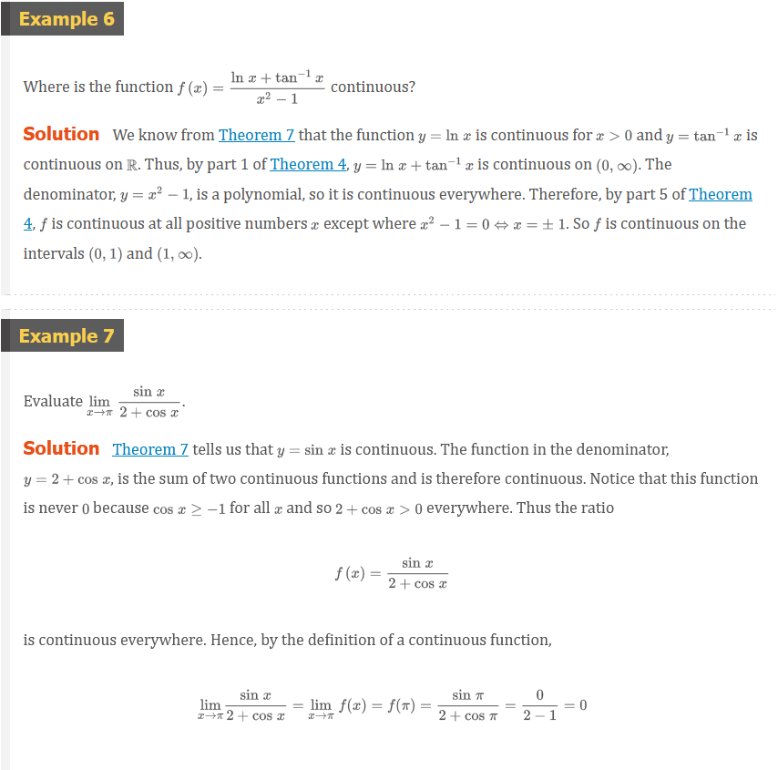

### 8 Theorem

If $f$ is continuous at $b$ and $\lim_{x \to a} g(x) = b$, then $\lim_{x \to a}
f(g(x)) = f(b)$. In other words,

$$
\lim_{x \to a} f(g(x)) = f(\lim_{x \to a} g(x))
$$

> Note: this theorem says that a limit symbol can be moved through a function
symbol if the function is continuous and the limit exists. In other words, the
order of these two symbols can be reversed.

### 9 Theorem

If $g$ is continuous at $a$ and $f$ is continuous at $g(a)$, then the composite
function $f \circ g$ given by $f \circ g)(x) = f(g(x))$ is continuous at $a$.

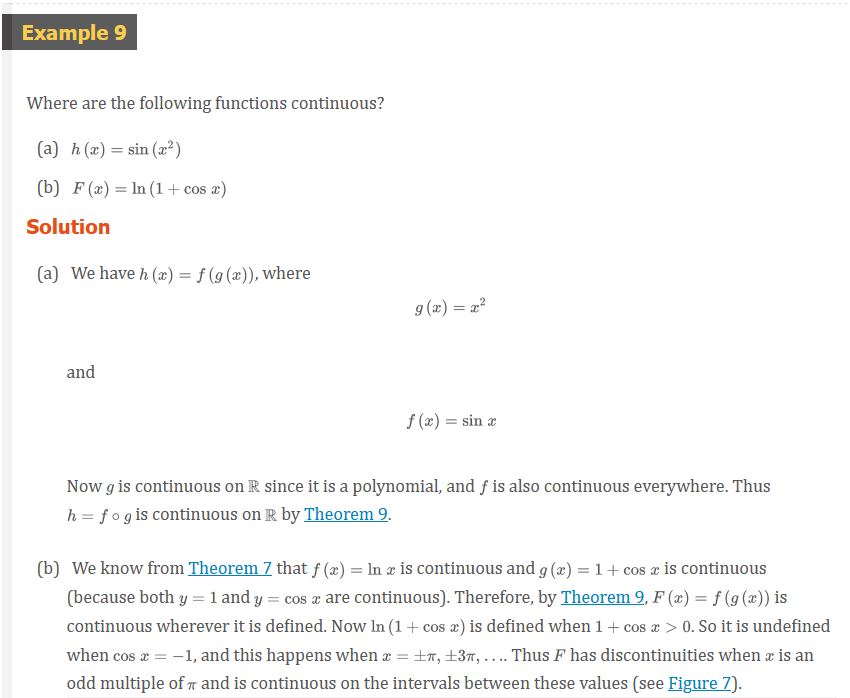

### 10 The Intermediate Value Theorem

Suppose that $f$ is continuous on the closed interval $[a, b]$ and let $N$ by
any number between $f(a)$ and $f(b)$, where $f(a) \neq f(b)$. Then there exists
a number $c$ in $(a, b)$ such that $f(c) = N$.

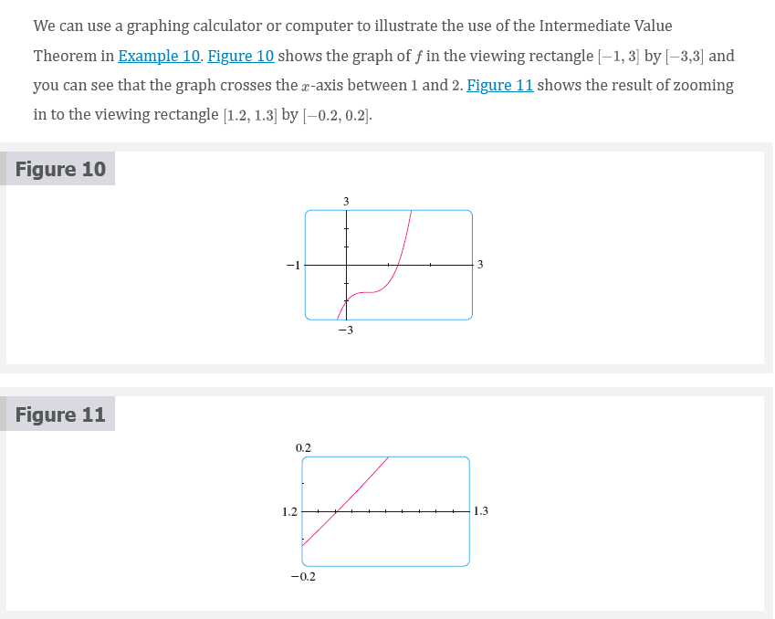

Other Resources:

- [🎬 Types of discontinuities](https://www.khanacademy.org/math/ap-calculus-ab/ab-limits-new/ab-1-10/v/types-of-discontinuities?modal=1)
- [🎬 Continuity at a point](https://www.khanacademy.org/math/ap-calculus-ab/ab-limits-new/ab-1-11/v/continuity-at-a-point)
- [🎬 Worked example: Continuity at a point(graphical)](https://www.khanacademy.org/math/ap-calculus-ab/ab-limits-new/ab-1-11/v/continuity-at-a-point-graphically)
- [🎬 Worked example: point where a function is continuous](https://www.khanacademy.org/math/ap-calculus-ab/ab-limits-new/ab-1-11/v/limit-of-piecewise-function-that-is-defined)
- [🎬 Worked example: point where a function isn't continuous](https://www.khanacademy.org/math/ap-calculus-ab/ab-limits-new/ab-1-11/v/limit-of-piecewise-function-that-is-undefined)
- [🎬 Continuity over an interval](https://www.khanacademy.org/math/ap-calculus-ab/ab-limits-new/ab-1-12/v/continuity-over-an-interval)
- [🎬 Functions continuous on all real numbers](https://www.khanacademy.org/math/ap-calculus-ab/ab-limits-new/ab-1-12/v/functions-continuous-on-all-numbers)
- [🎬 Functions continuous at specific x-values](https://www.khanacademy.org/math/ap-calculus-ab/ab-limits-new/ab-1-12/v/functions-continuous-on-specific-numbers)
- [🎬 Removing discontinuities (factoring)](https://www.khanacademy.org/math/ap-calculus-ab/ab-limits-new/ab-1-13/v/defining-a-function-at-a-point-to-make-it-continuous)
- [🎬 Removing discontinuities (rationalization)](https://www.khanacademy.org/math/ap-calculus-ab/ab-limits-new/ab-1-13/v/fancy-algebra-to-find-a-limit-and-make-a-function-continuous)

 

# Resources

- [🎬 The Tangent Line and Velocity Problem](https://www.youtube.com/watch?v=EvAa4p-tWlQ)
- [🎬 Calculus 1: Limits & Derivatives (2 of 27) The Slope of a Line](https://www.youtube.com/watch?v=723jsxCO7Oc)
- [🎬 Limits Intro](https://www.khanacademy.org/math/ap-calculus-ab/ab-limits-new/ab-1-2/v/introduction-to-limits-hd)
- [🌎 Limits Intro Article](https://www.khanacademy.org/math/ap-calculus-ab/ab-limits-new/ab-1-2/a/limits-intro)
- [🎬 Estimating limit values from graphs](https://www.khanacademy.org/math/ap-calculus-ab/ab-limits-new/ab-1-3/v/limits-from-graphs)
- [🎬 Unbounded limits](https://www.khanacademy.org/math/ap-calculus-ab/ab-limits-new/ab-1-3/v/unbounded-limits)
- [🎬 One-sided limits from graphs](https://www.khanacademy.org/math/ap-calculus-ab/ab-limits-new/ab-1-3/v/one-sided-limits-from-graphs)
- [🎬 One-sided limits from graphs: asymptote](https://www.khanacademy.org/math/ap-calculus-ab/ab-limits-new/ab-1-3/v/one-sided-limits-from-graphs-asymptote)
- [🎬 Connecting limits and graphical behavior](https://www.khanacademy.org/math/ap-calculus-ab/ab-limits-new/ab-1-3/v/connecting-limits-and-graphical-behavior)
- [🎬 Approximating limits using tables](https://www.khanacademy.org/math/ap-calculus-ab/ab-limits-new/ab-1-4/v/approximating-limit-from-table)
- [🎬 Estimating limits from tables](https://www.khanacademy.org/math/ap-calculus-ab/ab-limits-new/ab-1-4/v/estimating-limit-from-table)
- [🎬 One-sided limits from tables](https://www.khanacademy.org/math/ap-calculus-ab/ab-limits-new/ab-1-4/v/one-sided-limits-from-tables)
- [🎬 Limit properties](https://www.khanacademy.org/math/ap-calculus-ab/ab-limits-new/ab-1-5a/v/limit-properties)
- [🎬 Limits of combined functions](https://www.khanacademy.org/math/ap-calculus-ab/ab-limits-new/ab-1-5a/v/limits-of-combined-functions)
- [🎬 Limits of combined functions: piecewise functions](https://www.khanacademy.org/math/ap-calculus-ab/ab-limits-new/ab-1-5a/v/limits-of-combined-functions-piecewise)
- [🎬 Limits by direct substitution](https://www.khanacademy.org/math/ap-calculus-ab/ab-limits-new/ab-1-5b/v/limit-by-substitution)
- [🎬 Undefined limits by direct substitution](https://www.khanacademy.org/math/ap-calculus-ab/ab-limits-new/ab-1-5b/v/undefined-limit-by-substitution)
- [🎬 Limits of trigonometric functions](https://www.khanacademy.org/math/ap-calculus-ab/ab-limits-new/ab-1-5b/v/limits-of-trigonometric-functions)
- [🎬 Limits of piecewise functions](https://www.khanacademy.org/math/ap-calculus-ab/ab-limits-new/ab-1-5b/v/limits-of-piecewise-functions)
- [🎬 How to Graph a Piecewise Function](https://www.youtube.com/watch?v=n-EgnuaThpE)
- [🎬 Graphing a Piecewise Function](https://www.youtube.com/watch?v=QIG8LvPNNJQ)
- [🎬 Limits of piecewise functions: absolute value](https://www.khanacademy.org/math/ap-calculus-ab/ab-limits-new/ab-1-5b/v/limit-at-a-point-of-discontinuity)
- [🎬 Limits by factoring](https://www.khanacademy.org/math/ap-calculus-ab/ab-limits-new/ab-1-6/v/limit-example-1?modal=1)
- [🎬 Limits by rationalizing](https://www.khanacademy.org/math/ap-calculus-ab/ab-limits-new/ab-1-6/v/limits-by-rationalizing?modal=1)
- [🎬 Types of discontinuities](https://www.khanacademy.org/math/ap-calculus-ab/ab-limits-new/ab-1-10/v/types-of-discontinuities?modal=1)
- [🎬 Continuity at a point](https://www.khanacademy.org/math/ap-calculus-ab/ab-limits-new/ab-1-11/v/continuity-at-a-point)
- [🎬 Worked example: Continuity at a point(graphical)](https://www.khanacademy.org/math/ap-calculus-ab/ab-limits-new/ab-1-11/v/continuity-at-a-point-graphically)
- [🎬 Worked example: point where a function is continuous](https://www.khanacademy.org/math/ap-calculus-ab/ab-limits-new/ab-1-11/v/limit-of-piecewise-function-that-is-defined)
- [🎬 Worked example: point where a function isn't continuous](https://www.khanacademy.org/math/ap-calculus-ab/ab-limits-new/ab-1-11/v/limit-of-piecewise-function-that-is-undefined)
- [🎬 Continuity over an interval](https://www.khanacademy.org/math/ap-calculus-ab/ab-limits-new/ab-1-12/v/continuity-over-an-interval)
- [🎬 Functions continuous on all real numbers](https://www.khanacademy.org/math/ap-calculus-ab/ab-limits-new/ab-1-12/v/functions-continuous-on-all-numbers)
- [🎬 Functions continuous at specific x-values](https://www.khanacademy.org/math/ap-calculus-ab/ab-limits-new/ab-1-12/v/functions-continuous-on-specific-numbers)
- [🎬 Removing discontinuities (factoring)](https://www.khanacademy.org/math/ap-calculus-ab/ab-limits-new/ab-1-13/v/defining-a-function-at-a-point-to-make-it-continuous)
- [🎬 Removing discontinuities (rationalization)](https://www.khanacademy.org/math/ap-calculus-ab/ab-limits-new/ab-1-13/v/fancy-algebra-to-find-a-limit-and-make-a-function-continuous)

Textbook

+ [🌎 Cengage e-Textbook: Calculus Early Transcendentals, Eighth Edition, Stewart](https://webassign.com/)

