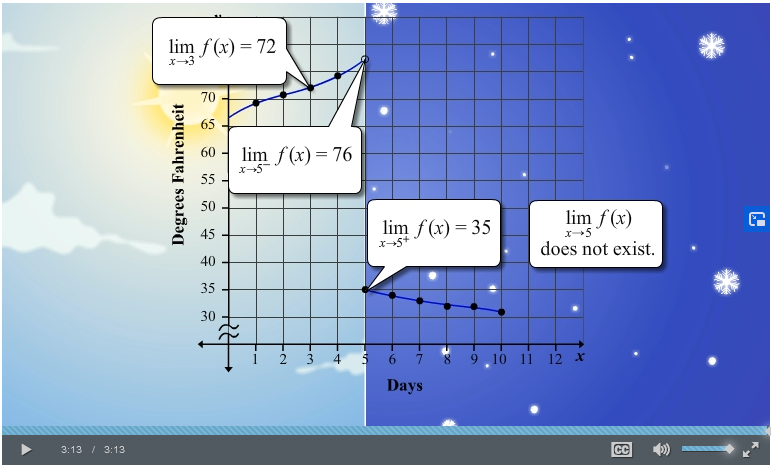
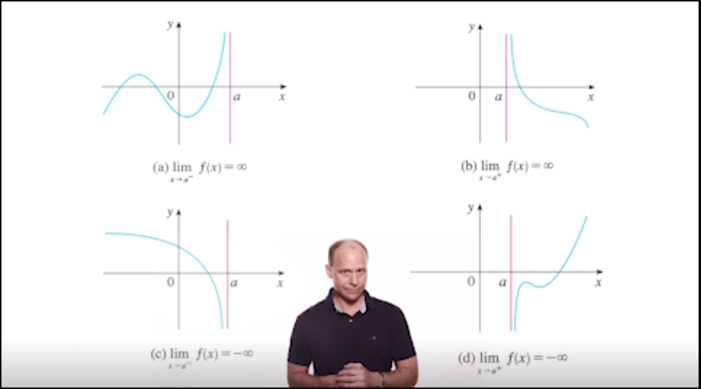
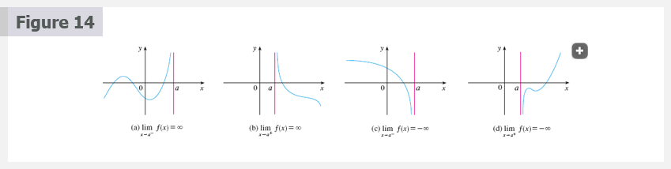

# 2.2 The Limit of a Function

Behavior of the function $f$ defined by $f(x) = x^{2} - x + 2$ for values of
$x$ near 2.

The following table gives values of $f(x)$ for values of $x$ close to 2 but not
equal to 2.

| $x$   | $f(x)$   |
|-------|----------|
| 1.0   | 2.000000 |
| 1.5   | 2.750000 |
| 1.8   | 3.440000 |
| 1.9   | 3.710000 |
| 1.95  | 3.852500 |
| 1.99  | 3.970100 |
| 1.995 | 3.985025 |
| 1.999 | 3.997001 |
| 3.0   | 8.000000 |
| 2.5   | 5.750000 |
| 2.2   | 4.640000 |
| 2.1   | 4.310000 |
| 2.05  | 4.152500 |
| 2.01  | 4.030100 |
| 2.005 | 4.015025 |
| 2.001 | 4.003001 |

From the table and the graph of $f$(a parabola) shown in Figure 1 we see that
the closer $x$ is to 2 (on either side of 2), the closer $f(x)$ is to 4. In
fact, it appears that we can make the values of $f(x)$ as close as we like to 4
by taking $x$ sufficiently close to 2. We express this by saying "the limit of
the function $f(x) = x^{2} - x + 2$ as $x$ approaches 2 is equal to 4". The
notation for this is

$$
\lim_{x \to 2} (x^{2} - x + 2) = 4
$$

**Intuitive Definition of a Limit**

Suppose $f(x)$ is defined when $x$ is near the number $a$. (This means that $f$
is defined on some open interval that contains $a$, except possibly at $a$
itself.) then we write

$$
\lim_{x \to a} f(x) = L
$$

and say

"the limit of $f(x)$, as $x$ approaches $a$, equals $L$"

if we can make the value of $f(x)$ arbitrarily close to $L$ (as close to $L$ as
we like) by restricting $x$ to be sufficiently close to $a$ (on either side of
$a$) but not equal to $a$.

## One-Sided Limits

We write

$$
\lim_{x \to a^{-}} f(x) = L
$$

and say the **left-hand limit of $f(x)$ as $x$ approaches $a$** [or the **limit
of $f(x)$ as $x$ approaches $a$ from the left**] is equal to $L$ we can make the
values of $f(x)$ arbitrarily close to $L$ by taking $x$ to be sufficiently close
to $a$ with $x$ less less than $a$.

Similarly, if we require that $x$ be greater than $a$ we get "the **right-hand
limit of $f(x)$ as $x$ approaches $a$** is equal to $L$" and we write

$$
\lim_{x \to a^{+}} f(x) = L
$$

$$
\lim_{x \to a} = L
\text{\;\;if and only if\;\;}
\lim_{x \to a^{-}} f(x) = L
\text{\;\;and\;\;}
\lim_{x \to a^{+}} f(x) = L
$$

When a limit doesn't approach the same value from both sides, we say that the
limit doesn't exist.

- $\lim_{x \to 2^{-}} g(x) = 3$ and
- $\lim_{x \to 2^{+}} g(x) = 1$
  - Since the left and right limits are different, we conclude that
    $\lim_{x \to 2} g(x)$ does not exist.
- $\lim_{x \to 5^{-}} g(x) = 2$ and
- $\lim_{x \to 5^{+}} g(x) = 2$
  - This time the left and right limits are the same and so we have
    $\lim_{x \to 5} g(x) = 2$

Despite this fact, notice that $g(5) \neq 2$.

## Infinite Limits

Let $f$ be a function defined on both sides of $a$, except possibly at
$a$itself. then

$$
\lim_{x \to a} f(x) = \infty
$$

means that the values of $f(x)$ can be made arbitrarily large (as large as we
please) by taking $x$ sufficiently close to $a$, but not equal to $a$.

Another notation for $\lim_{x \to a} f(x) = \infty$ is

$$
f(x) = \infty \;\;\; as \;\;\; x \to a
$$

The vertical line $x = a$ is called a **vertical asymptote** of the curve
$y = f(x)$ if at least one of the following statements is true:

$$
\lim_{x \to a} f(x) = \infty  \lim_{x \to a^{-}} f(x) = \infty \;\; \lim_{x \to a^{+}} = \infty \\
\lim_{x \to a} f(x) = -\infty \;\; \lim_{x \to a^{-}} f(x) = -\infty \;\; \lim_{x \to a^{+}} f(x) = -\infty
$$

**Example 10:**

Find the vertical asymptote of $f(x) = \tan(x)$.

**Solution**

Because

$$
\tan(x) = \frac{\sin(x)}{\cos(x)}
$$

There are potential vertical asymptotes where $\cos(x) = 0$. In fact, since
$\cos(x) \to 0^{+}$ as $x \to (\pi/2)^{-}$ and $\cos(x) \to 0^{-}$ as
$x \to (\pi/2)^{+}$, whereas $\sin(x)$ is positive (near 1) when $x$ is near
$\pi/2$, we have

$$
\lim_{x \to (\pi/2)^{-}} \tan(x) = \infty
$$

and

$$
\lim_{x \to (\pi/2)^{+}} \tan(x) = -\infty
$$

Other Resources:

- [🎬 Estimating limit values from graphs](https://www.khanacademy.org/math/ap-calculus-ab/ab-limits-new/ab-1-3/v/limits-from-graphs)
- [🎬 Unbounded limits](https://www.khanacademy.org/math/ap-calculus-ab/ab-limits-new/ab-1-3/v/unbounded-limits)
- [🎬 One-sided limits from graphs](https://www.khanacademy.org/math/ap-calculus-ab/ab-limits-new/ab-1-3/v/one-sided-limits-from-graphs)
- [🎬 One-sided limits from graphs: asymptote](https://www.khanacademy.org/math/ap-calculus-ab/ab-limits-new/ab-1-3/v/one-sided-limits-from-graphs-asymptote)
- [🎬 Connecting limits and graphical behavior](https://www.khanacademy.org/math/ap-calculus-ab/ab-limits-new/ab-1-3/v/connecting-limits-and-graphical-behavior)
- [🎬 Approximating limits using tables](https://www.khanacademy.org/math/ap-calculus-ab/ab-limits-new/ab-1-4/v/approximating-limit-from-table)
- [🎬 Estimating limits from tables](https://www.khanacademy.org/math/ap-calculus-ab/ab-limits-new/ab-1-4/v/estimating-limit-from-table)
- [🎬 One-sided limits from tables](https://www.khanacademy.org/math/ap-calculus-ab/ab-limits-new/ab-1-4/v/one-sided-limits-from-tables)

 

# Resources

- [🎬 Estimating limit values from graphs](https://www.khanacademy.org/math/ap-calculus-ab/ab-limits-new/ab-1-3/v/limits-from-graphs)
- [🎬 Unbounded limits](https://www.khanacademy.org/math/ap-calculus-ab/ab-limits-new/ab-1-3/v/unbounded-limits)
- [🎬 One-sided limits from graphs](https://www.khanacademy.org/math/ap-calculus-ab/ab-limits-new/ab-1-3/v/one-sided-limits-from-graphs)
- [🎬 One-sided limits from graphs: asymptote](https://www.khanacademy.org/math/ap-calculus-ab/ab-limits-new/ab-1-3/v/one-sided-limits-from-graphs-asymptote)
- [🎬 Connecting limits and graphical behavior](https://www.khanacademy.org/math/ap-calculus-ab/ab-limits-new/ab-1-3/v/connecting-limits-and-graphical-behavior)
- [🎬 Approximating limits using tables](https://www.khanacademy.org/math/ap-calculus-ab/ab-limits-new/ab-1-4/v/approximating-limit-from-table)
- [🎬 Estimating limits from tables](https://www.khanacademy.org/math/ap-calculus-ab/ab-limits-new/ab-1-4/v/estimating-limit-from-table)
- [🎬 One-sided limits from tables](https://www.khanacademy.org/math/ap-calculus-ab/ab-limits-new/ab-1-4/v/one-sided-limits-from-tables)

