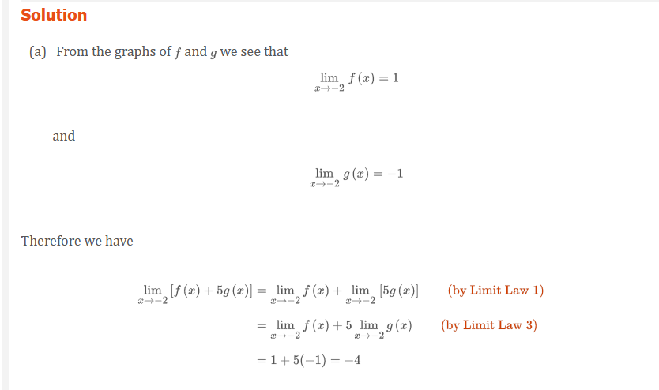
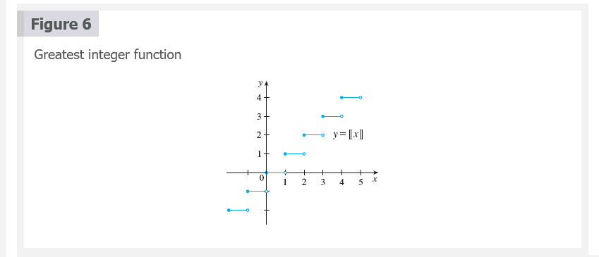

# 2.3 Calculating Limits Using the Limit Laws

Suppose that $c$ is a constant and the limits

$$
\lim_{x \to a} f(x)
$$

and

$$
\lim_{x \to a} g(x)
$$

exist. Then...

> Limit Laws

$$
\underline{\boldsymbol{Sum Law}} \\
1.\; \lim_{x \to a} [f(x) + g(x)] = \lim_{x \to a} f(x) + \lim_{x \to a} g(x) \\
~\\
\underline{\boldsymbol{Difference Law}} \\
2.\; \lim_{x \to a} [f(x) - g(x)] = \lim_{x \to a} f(x) - \lim_{x \to a} g(x) \\
~\\
\underline{\boldsymbol{Constant Multiple Law}} \\
3.\; \lim_{x \to a} [cf(x)] = c \lim_{x \to a} f(x) \\
~\\
\underline{\boldsymbol{Product Law}} \\
4.\; \lim_{x \to a} [f(x)g(x)] = \lim_{x \to a} f(x) \cdot \lim_{x \to a} g(x) \\
~\\
\underline{\boldsymbol{Quotient Law}} \\
5.\; \lim_{x \to a} \frac{f(x)}{g(x)} = \frac{\lim_{x \to a} f(x)}{\lim_{x \to a} g(x)} \text{ if } \lim_{x \to a} g(x) \neq 0 \\
~\\
\underline{\boldsymbol{Power Law}} \\
6.\; \lim_{x \to a} [f(x)]^{n} = [\lim_{x \to a} f(x)]^{n} \; \text{ where } n \text{ is a positive integer } \\
7.\; \lim_{x \to a} c = c \\
8.\; \lim_{x \to a} x = a \\
9.\; \lim_{x \to a} x^{n} = a^{n} \; \text{ where } n \text{ is a positive integer } \\
10.\; \lim_{x \to a} \sqrt[n]{x} = \sqrt[n]{a} \; \text{ where } n \text{ is a positive integer }
~\\
\underline{\boldsymbol{Root Law}} \\
11.\; \lim_{x \to a} \sqrt[n]{f(x)} = \sqrt[n]{\lim_{x \to a} f(x)} \; \text{ where } n \text{ is a positive integer } \\
[\text{ if  } n \text{ is even, we assume that } \lim_{x \to a} f(x) > 0 \text{. }]
$$

> Direct Substitution Property

If $f$ is a polynomial or a rational function and $a$ is in the domain of $f$,
then

$$
\lim_{x \to a} f(x) = f(a)
$$

> **NOTE:** Notice that in Example 3 we do not have an infinite limit even
though the denominator approaches $0$ as $x \to 1$. When both numerator and
denominator approach 0 the limit may be infinite or it may be some finite value.

[⚓ Conjugates](../../../../spring-2020/MATH-141/notes/ch-7.md#conjugates-term)

> Theorem 1

$$
\lim_{x \to a} f(x) = L
$$

if and only if

$$
\lim_{x \to a^{-}} f(x) = L = \lim_{x \to a^{+}} f(x)
$$

> Theorem 2

if $f(x) \le g(x)$ when $x$ is near $a$ (except possibly at $a$) and the limits
of $f$ and $g$ both exist as $x$ approaches $a$ then

$$
\lim_{x \to a} f(x) \le \lim_{x \to a} g(x)
$$

> The Squeeze Theorem

if $f(x) \le g(x) \le h(x)$ when $x$ is near $a$ (except possibly at $x$) and

$$
\lim_{x \to a} f(x) = \lim_{x \to a} h(x) = L
$$

then

$$
\lim_{x \to a} g(x) = L
$$

The Squeeze Theorem, which is sometimes called the _Sandwich Theorem_ or the
_Pinching Theorem_, is illustrated by Figure 7. It says if $g(x)$ is squeezed
between $f(x)$ and $h(x)$ near $a$, and if $f$ and $h$ have the same limit $L$
at $a$, then $g$ is forced to have the same limit $L$ at $a$.

## Video Lectures

- [🎬 Limit properties](https://www.khanacademy.org/math/ap-calculus-ab/ab-limits-new/ab-1-5a/v/limit-properties)
- [🎬 Limits of combined functions](https://www.khanacademy.org/math/ap-calculus-ab/ab-limits-new/ab-1-5a/v/limits-of-combined-functions)
- [🎬 Limits of combined functions: piecewise functions](https://www.khanacademy.org/math/ap-calculus-ab/ab-limits-new/ab-1-5a/v/limits-of-combined-functions-piecewise)
- [🎬 Limits by direct substitution](https://www.khanacademy.org/math/ap-calculus-ab/ab-limits-new/ab-1-5b/v/limit-by-substitution)
- [🎬 Undefined limits by direct substitution](https://www.khanacademy.org/math/ap-calculus-ab/ab-limits-new/ab-1-5b/v/undefined-limit-by-substitution)
- [🎬 Limits of trigonometric functions](https://www.khanacademy.org/math/ap-calculus-ab/ab-limits-new/ab-1-5b/v/limits-of-trigonometric-functions)
- [🎬 Limits of piecewise functions](https://www.khanacademy.org/math/ap-calculus-ab/ab-limits-new/ab-1-5b/v/limits-of-piecewise-functions)
- [🎬 How to Graph a Piecewise Function](https://www.youtube.com/watch?v=n-EgnuaThpE)
- [🎬 Graphing a Piecewise Function](https://www.youtube.com/watch?v=QIG8LvPNNJQ)
- [🎬 Limits of piecewise functions: absolute value](https://www.khanacademy.org/math/ap-calculus-ab/ab-limits-new/ab-1-5b/v/limit-at-a-point-of-discontinuity)
- [🎬 Limits by factoring](https://www.khanacademy.org/math/ap-calculus-ab/ab-limits-new/ab-1-6/v/limit-example-1?modal=1)
- [🎬 Limits by rationalizing](https://www.khanacademy.org/math/ap-calculus-ab/ab-limits-new/ab-1-6/v/limits-by-rationalizing?modal=1)

 

# Resources

- [⚓ Conjugates](../../../../spring-2020/MATH-141/notes/ch-7.md#conjugates-term)
- [🎬 Limit properties](https://www.khanacademy.org/math/ap-calculus-ab/ab-limits-new/ab-1-5a/v/limit-properties)
- [🎬 Limits of combined functions](https://www.khanacademy.org/math/ap-calculus-ab/ab-limits-new/ab-1-5a/v/limits-of-combined-functions)
- [🎬 Limits of combined functions: piecewise functions](https://www.khanacademy.org/math/ap-calculus-ab/ab-limits-new/ab-1-5a/v/limits-of-combined-functions-piecewise)
- [🎬 Limits by direct substitution](https://www.khanacademy.org/math/ap-calculus-ab/ab-limits-new/ab-1-5b/v/limit-by-substitution)
- [🎬 Undefined limits by direct substitution](https://www.khanacademy.org/math/ap-calculus-ab/ab-limits-new/ab-1-5b/v/undefined-limit-by-substitution)
- [🎬 Limits of trigonometric functions](https://www.khanacademy.org/math/ap-calculus-ab/ab-limits-new/ab-1-5b/v/limits-of-trigonometric-functions)
- [🎬 Limits of piecewise functions](https://www.khanacademy.org/math/ap-calculus-ab/ab-limits-new/ab-1-5b/v/limits-of-piecewise-functions)
- [🎬 How to Graph a Piecewise Function](https://www.youtube.com/watch?v=n-EgnuaThpE)
- [🎬 Graphing a Piecewise Function](https://www.youtube.com/watch?v=QIG8LvPNNJQ)
- [🎬 Limits of piecewise functions: absolute value](https://www.khanacademy.org/math/ap-calculus-ab/ab-limits-new/ab-1-5b/v/limit-at-a-point-of-discontinuity)
- [🎬 Limits by factoring](https://www.khanacademy.org/math/ap-calculus-ab/ab-limits-new/ab-1-6/v/limit-example-1?modal=1)
- [🎬 Limits by rationalizing](https://www.khanacademy.org/math/ap-calculus-ab/ab-limits-new/ab-1-6/v/limits-by-rationalizing?modal=1)

Textbook

+ [🌎 Cengage e-Textbook: Calculus Early Transcendentals, Eighth Edition, Stewart](https://webassign.com/)

