# Chapter 2.4: The Precise Definition of a Limit

## The Precise Definition of a Limit

The intuitive definition of a limit given in Section 2.2 is inadequate for some
purposes because such phrases as "is close to" and "gets closer and closer to"
are vague. In order to be able to prove conclusively that

$$
\lim_{x \to 0} (x^{3} + \frac{\cos(5x)}{10,000}) = 0.0001
$$

or

$$
\lim_{x \to 0} \frac{\sin(x)}{x} = 1
$$

we must make the definition of a limit precise.

To motivate the precise definition of a limit, let's consider the function

$$
f(x) =
\left \{
  \begin{array}{ll}
    2x - 1 & \text{ if } x \neq 3 \\
    6      & \text{ if } x = 3 \\
  \end{array}
\right .
$$

Intuitively, it is clear that when $x$ is close to $3$ but $x \neq 3$, then
$f(x)$ is close to $5$, and so $\lim_{x \to 3} f(x) = 5$.

To obtain more detailed information about how $f(x)$ varies when $x$ is close to
$3$, we ask the following question:

_How close to does have to be so that $f(x)$ differs from $5$ by less than
$0.1$?_

The distance from $x$ to $3$ is $|x - 3|$ and the distance from $f(x)$ to $5$ is
$|f(x) -5|$, so our problem is to find a number $\delta$ such that

$$
|f(x) - 5| < 0.1 \;\;\; \text{ if } \;\;\; |x - 3| < \delta \;\;\; \text{ but } x \neq 3
$$

> **NOTE:** It is traditional to use the Greek letter $\delta$ (delta) in this
situation.

If $|x - 3| > 0$, then $x \neq 3$, so an equivalent formulation of our problem
is to find a number $\delta$ such that

$$
|f(x) - 5| < 0.1
$$

if

$$
0 < |x - 3| < \delta
$$

Notice that if $0 < |x - 3| < (0.1)/2 = 0.05$, then

$$
|f(x) - 5| = |(2x - 1) - 5| = |2x - 6| = 2|x - 3| < 2(0.05) = 0.1
$$

that is,

$$
|f(x) - 5| < 0.1
$$

if

$$
0 < |x - 3| < 0.05
$$

Thus an answer to the problem is given by $\delta = 0.05$; that is, if $x$ is
within a distance of $0.05$ from $3$, then $f(x)$ will be within a distance of
$0.1$ from $5$.

If we change the number $0.1$ in our problem to the smaller number $0.01$, then
by using the same method we find that $f(x)$ will differ from $5$ by less than
$0.01$ provided that $x$ differs from $3$ by less than $(0.01)/2 = 0.005$:

$$
|f(x) - 5| < 0.01
$$

if

$$
0 < |x - 3| < 0.005
$$

Similarly,

$$
|f(x) - 5| < 0.001
$$

if

$$
0 < |x - 3| < 0.0005
$$

The numbers $0.1$, $0.01$, and $0.001$ that we have considered are _error
tolerances_ that we might allow. For $5$ to be the precise limit of $f(x)$ as
$x$ approaches $3$, we must not only be able to bring the difference between
$f(x)$ and $5$ below each of these three numbers; we must be able to bring it
below _any_ positive number. And, by the same reasoning, we can!  If we write
$\varepsilon$ (the Greek letter epsilon) for an arbitrary positive number, then
we find as before that

### Definition 1

$$
|f(x) - 5| < \varepsilon \;\;\;\;\; \text{ if } \;\;\;\;\; 0 < |x - 3| < \delta = \frac{\delta}{2}
$$

This is a precise way of saying that $f(x)$ is close to $5$ when $x$ is close to
$3$ because (Definition 1) says that we can make the values $f(x)$ of within an
arbitrary distance $\varepsilon$ from $5$ by restricting the values of $x$ to be
within a distance $\varepsilon / 2$ from $3$ (but $x \neq 3$).

Note that (Definition 1) can be rewritten as follows:

$$
\text{ if } \;\;\; 3 - \delta < x < 3 + \delta \;\;\; (x \neq 3) \;\;\; \text{ then } \;\;\; 5 - \varepsilon < f(x) < 5 + \varepsilon
$$

and this is illustrated in Figure 1. By taking the values of $x (\neq 3)$ to lie
in the interval $(3 - \delta, 3 + \delta)$ we can make the values of $f(x)$ lie
in the interval $(5 - \varepsilon, 5 + \varepsilon)$.

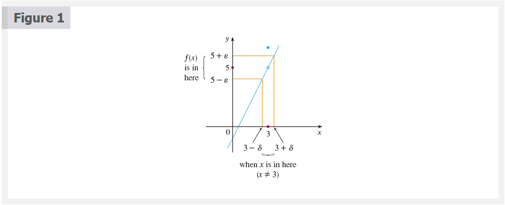

### Precise Definition of a Limit 2

Let $f$ be a function defined on some open interval that contains the number
$a$, except possibly at $a$ itself. Then we say that the **limit of $f(x)$ as
$x$ approaches $a$ is $L$**, and we write

$$
\lim_{x \to a} f(x) = L
$$

if for every number $\varepsilon > 0$ there is a number $\delta > 0$ such that

$$
\text{ if } \;\;\; 0 < |x - a| < \delta \;\;\; then \;\;\; |f(x) - L| < \varepsilon
$$

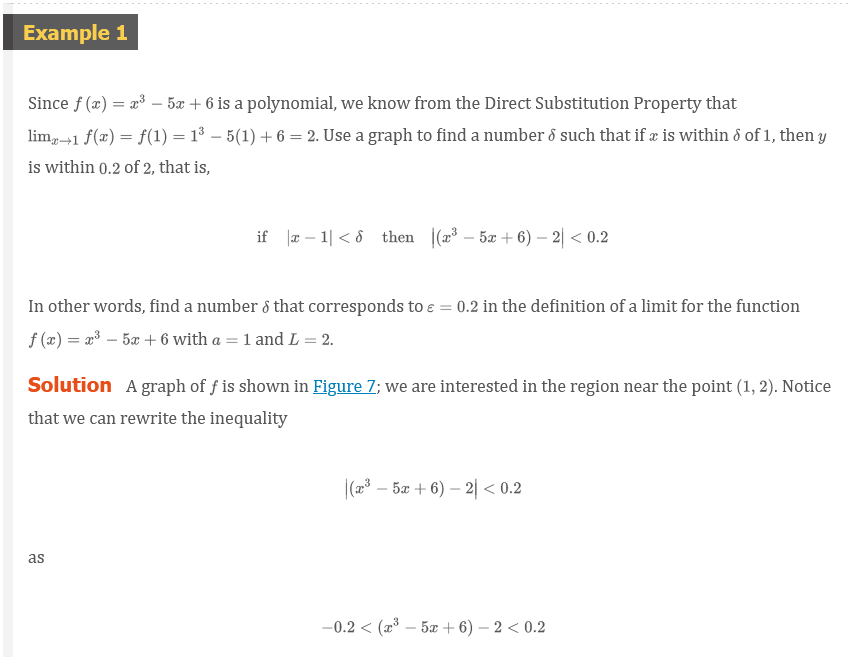

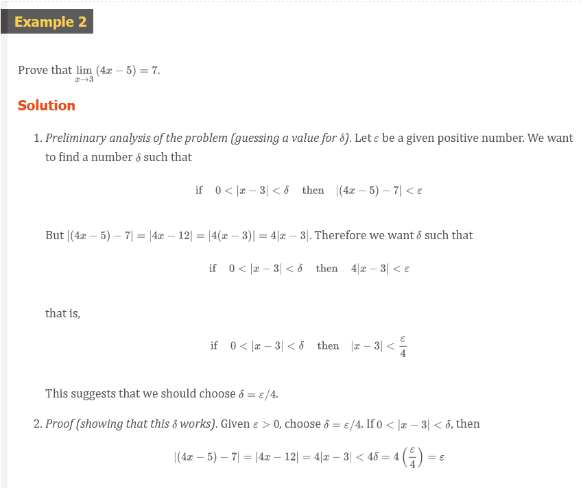

### Cauchy and Limits

After the invention of calculus in the 17th century, there followed a period of
free development of the subject in the 18th century. Mathematicians like the
Bernoulli brothers and Euler were eager to exploit the power of calculus and
boldly explored the consequences of this new and wonderful mathematical theory
without worrying too much about whether their proofs were completely correct.

The 19th century, by contrast, was the Age of Rigor in mathematics. There was a
movement to go back to the foundations of the subject--to provide careful
definitions and rigorous proofs. At the forefront of this movement was the
French mathematician Augustin-Louis Cauchy (1789–1857), who started out as a
military engineer before becoming a mathematics professor in Paris. Cauchy took
Newton's idea of a limit, which was kept alive in the 18th century by the French
mathematician Jean d'Alembert, and made it more precise. His definition of a
limit reads as follows: "When the successive values attributed to a variable
approach indefinitely a fixed value so as to end by differing from it by as
little as one wishes, this last is called the limit of all the others." But when
Cauchy used this definition in examples and proofs, he often employed
delta-epsilon inequalities similar to the ones in this section. A typical Cauchy
proof starts with: "Designate by and two very small numbers;..." He used because
of the correspondence between epsilon and the French word erreur and because
delta corresponds to différence. Later, the German mathematician Karl
Weierstrass (1815–1897) stated the definition of a limit exactly as in our
Definition 2.

### Definition of Left-Hand Limit 3

$$
\lim_{x \to a^{-}} f(x) = L
$$

if for every number $\varepsilon > 0$ there is a number $\delta > 0$ such that

$$
\text{ if } \;\;\; a - \delta < x < a \;\;\; \text{ then } \;\;\; |f(x) - L| < \varepsilon
$$

### Definition of Right-Hand Limit

$$
\lim_{x \to a^{+}} f(x) = L
$$

if for every number $\varepsilon > 0$ there is a number $\delta > 0$ such that

$$
\text{ if } \;\;\; a < x < a + \delta \;\;\; \text{ then } \;\;\; |f(x) - L| < \varepsilon
$$

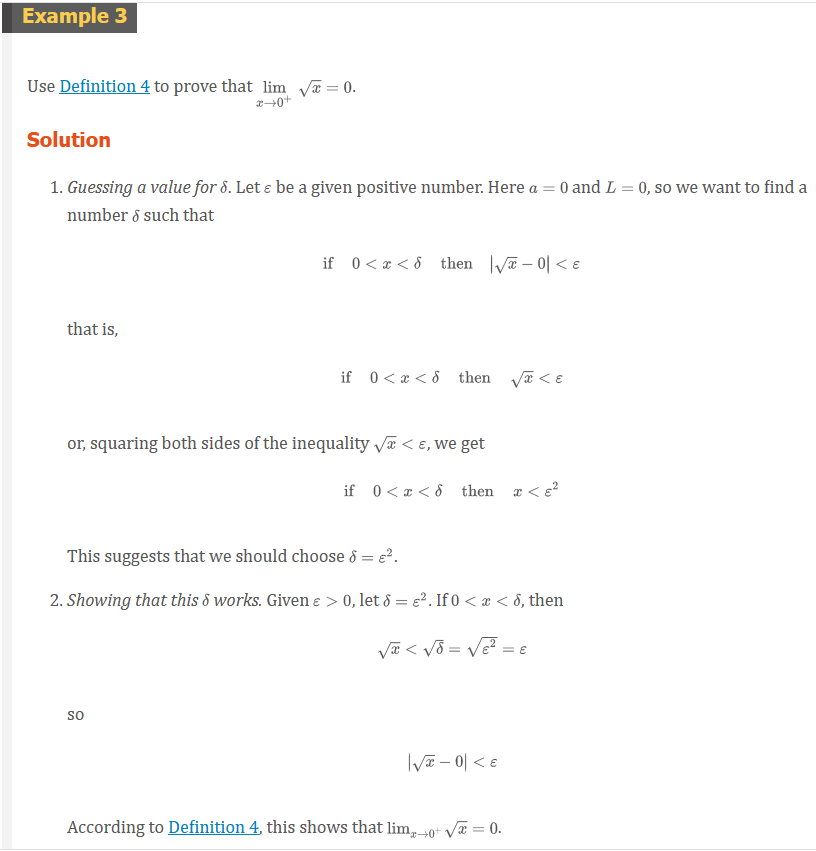

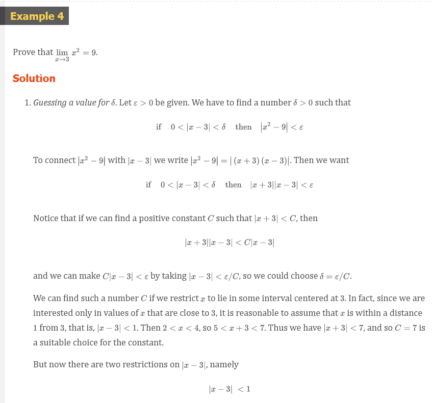
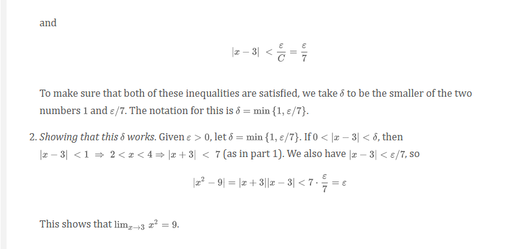

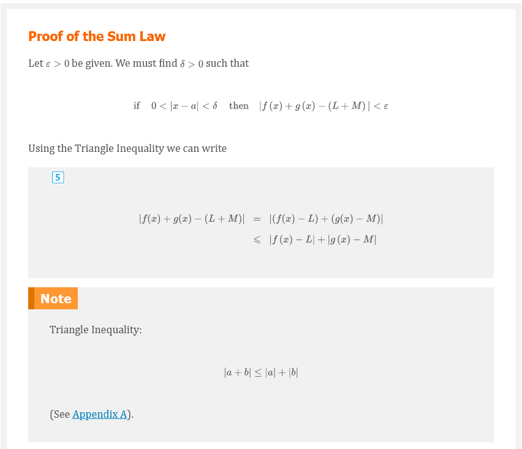
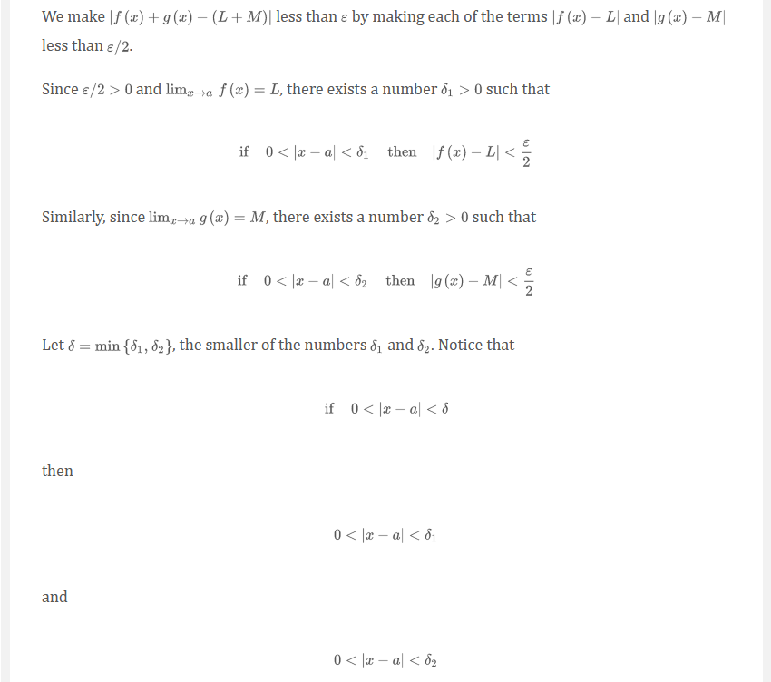
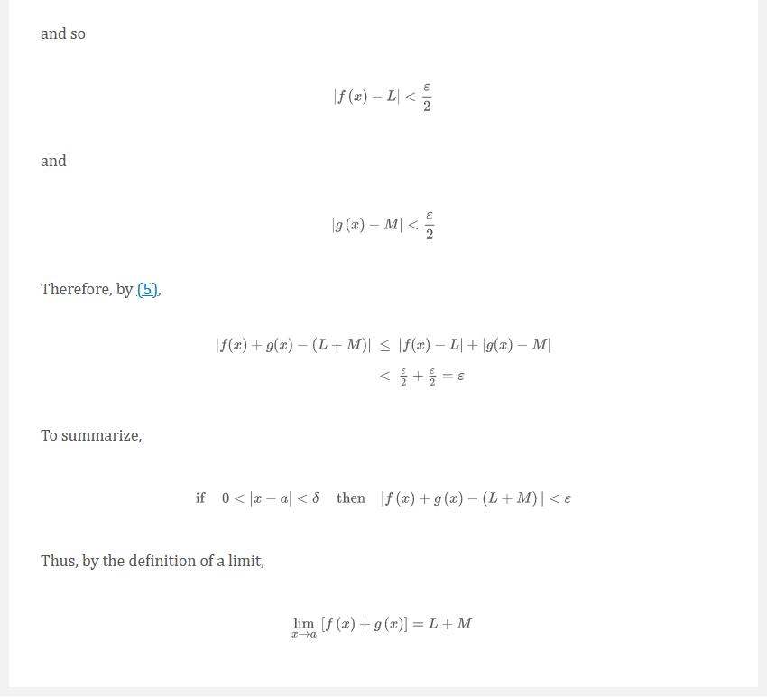

## Infinite Limits

### Precise Definition of an Infinite Limit 6

Let $f$ be a function defined on some open interval that contains the number
$a$, except possibly at $a$ itself. Then

$$
\lim_{x \to a} f(x) = \infty
$$

means that for every positive number $M$ there is a positive number $\delta$
such that

$$
\text{ if } \;\;\; 0 < |x - a| < \delta \;\;\; \text{ then } \;\;\; f(x) > M
$$

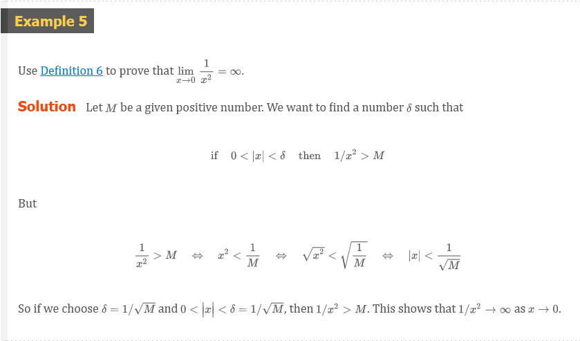

Similarly, the following is a precise version of Definition 2.2.5. It is
illustrated by Figure 11.

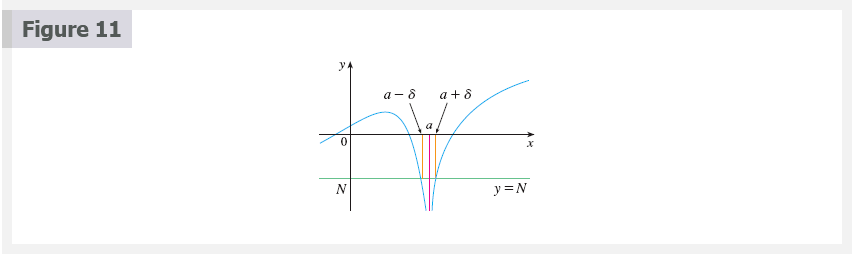

### Definition 7

Let $f$ be a function defined on some open interval that contains the number
$a$, except possibly at itself $a$. Then

$$
\lim_{x \to a} f(x) = -\infty
$$

means that for every negative number $N$ there is a positive number $\delta$
such that

$$
\text{ if } \;\;\; 0 < |x - a| < \delta \;\;\; \text{ then } \;\;\; f(x) < N
$$

## Video Lectures

- [📺 Formal definition of limits Part 1: intuition review](https://www.khanacademy.org/math/ap-calculus-ab/ab-limits-new/ab-limits-optional/v/limit-intuition-review)
- [📺 Formal definition of limits Part 2: building the idea](https://www.khanacademy.org/math/ap-calculus-ab/ab-limits-new/ab-limits-optional/v/building-the-idea-of-epsilon-delta-definition)
- [📺 Formal definition of limits Part 3: the definition](https://www.khanacademy.org/math/ap-calculus-ab/ab-limits-new/ab-limits-optional/v/epsilon-delta-definition-of-limits)
- [📺 Formal definition of limits Part 4: using the definition](https://www.khanacademy.org/math/ap-calculus-ab/ab-limits-new/ab-limits-optional/v/proving-a-limit-using-epsilon-delta-definition)

 

# Resources

- [📺 Formal definition of limits Part 1: intuition review](https://www.khanacademy.org/math/ap-calculus-ab/ab-limits-new/ab-limits-optional/v/limit-intuition-review)
- [📺 Formal definition of limits Part 2: building the idea](https://www.khanacademy.org/math/ap-calculus-ab/ab-limits-new/ab-limits-optional/v/building-the-idea-of-epsilon-delta-definition)
- [📺 Formal definition of limits Part 3: the definition](https://www.khanacademy.org/math/ap-calculus-ab/ab-limits-new/ab-limits-optional/v/epsilon-delta-definition-of-limits)
- [📺 Formal definition of limits Part 4: using the definition](https://www.khanacademy.org/math/ap-calculus-ab/ab-limits-new/ab-limits-optional/v/proving-a-limit-using-epsilon-delta-definition)

Textbook

+ [📄 Cengage e-Textbook: Calculus Early Transcendentals, Eighth Edition, Stewart](https://webassign.com/)

