# 2.5 Continuity

## 1 Definition

A function $f$ is **continuous at a number a** if

$$
\lim_{x \to a} f(x) = f(a)
$$

Three things if $f$ is continuous at $a$:

1. $f(a)$ is defined (that is, $a$ is in the domain of $f$)
2. $\lim_{x \to a} f(x)$ exists
3. $\lim_{x \to a} f(x) = f(a)$

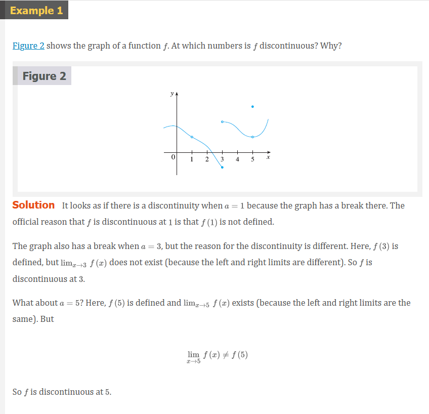
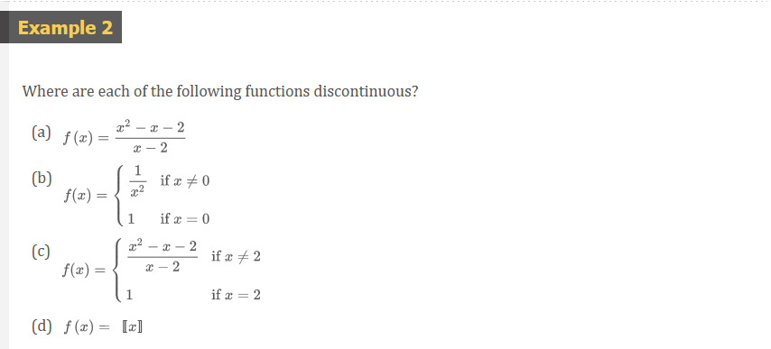
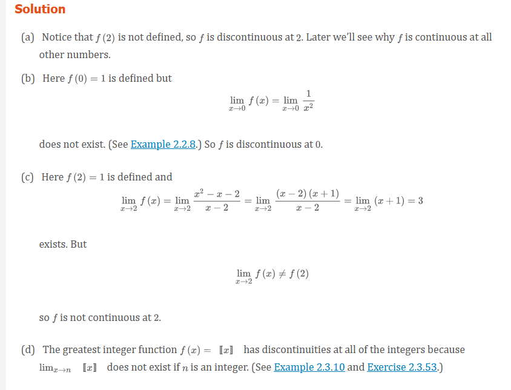
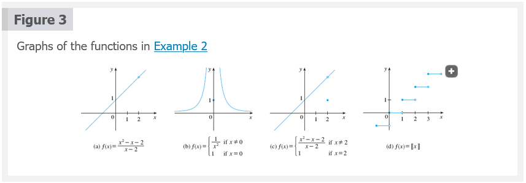

## 2 Definition

A function $f$ is **continuous from the right at a number a** if

$$
\lim_{x \to a^{+}} f(x) = f(a)
$$

and $f$ is **continuous from the left at a** if

$$
\lim_{x \to a^{-}} f(x) = f(a)
$$

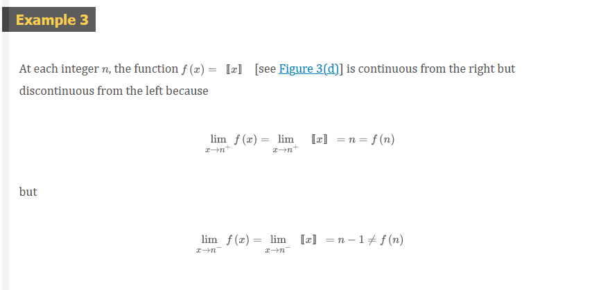
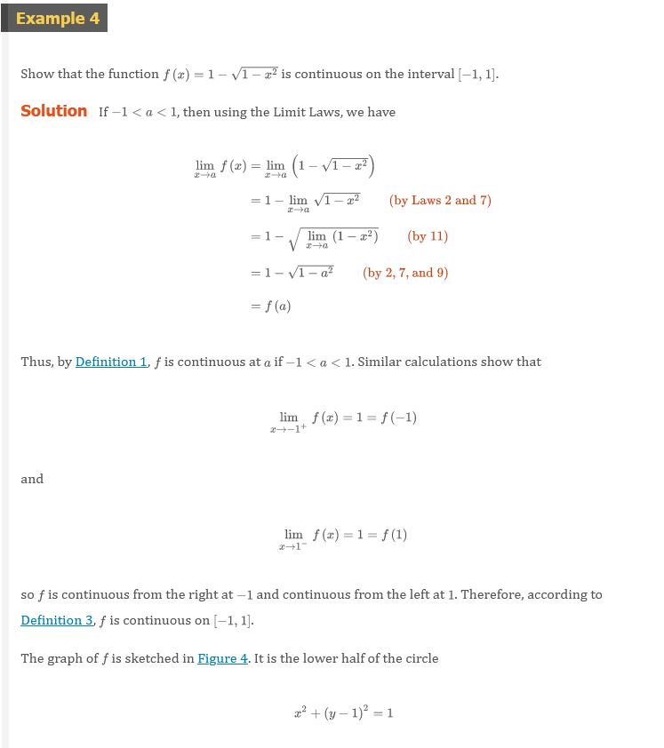
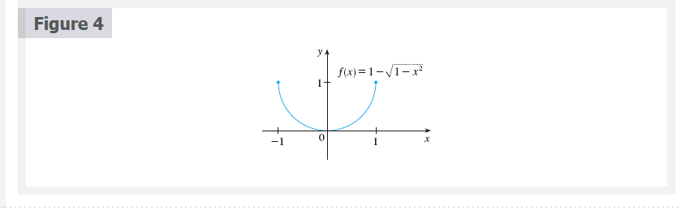

## 3 Definition

A function $f$ is **continuous on an interval** if it is continuous at every
number in the interval. (if $f$ is defined only on one side of an endpoint of
the interval, we understand _continuous_ at the endpoint to mean _continuous
from the right_ or _continuous from the left_)

Other Resources:

## 4 Theorem

If $f$ and $g$ are continuous at $a$ and $c$ is a constant, then the following
functions are also continuous at a:

1. $f + g$
2. $f - g$
3. $cf$
4. $fg$
5. $\frac{f}{g}$ if $g(a) \neq 0$

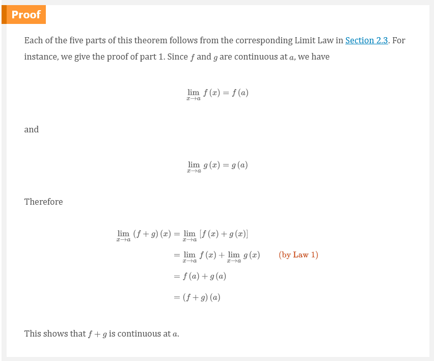

## 5 Theorem

(a) Any polynomial is continuous everywhere; that is continuous on $\mathbb{R} =
(-\infty, \infty)$.

(b) Any rational function is coninouos whereever it is defined; that is, it is
continuous on its domain.

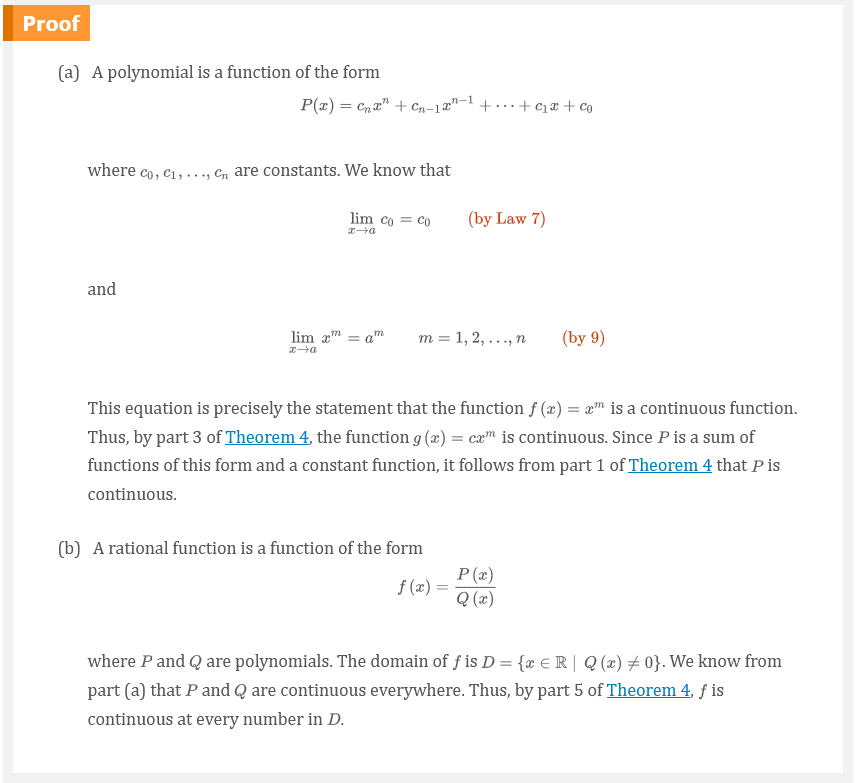
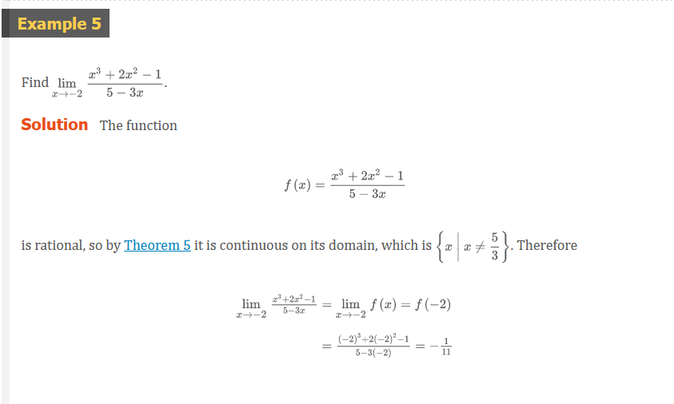

## 7 Theorem

The following types of functions are continuous at every number in their
domains:

- polynomials
- rational functions
- root functions
- trigonometric functions
- inverse trigonometric functions
- exponential functions
- logarithmic functions

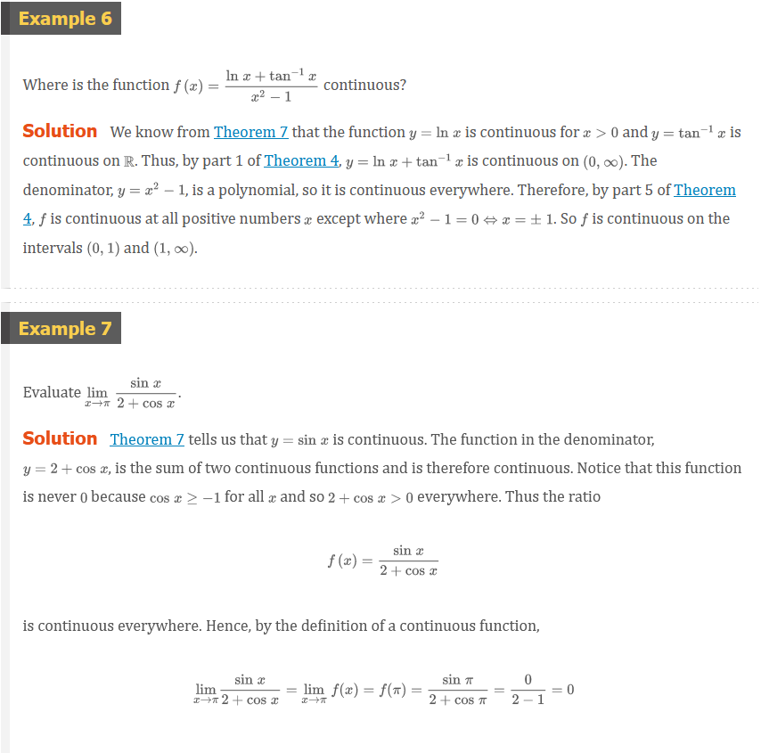

## 8 Theorem

If $f$ is continuous at $b$ and $\lim_{x \to a} g(x) = b$, then $\lim_{x \to a}
f(g(x)) = f(b)$. In other words,

$$
\lim_{x \to a} f(g(x)) = f(\lim_{x \to a} g(x))
$$

> Note: this theorem says that a limit symbol can be moved through a function
symbol if the function is continuous and the limit exists. In other words, the
order of these two symbols can be reversed.

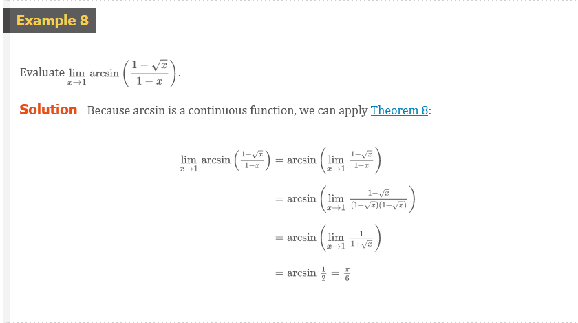

## 9 Theorem

If $g$ is continuous at $a$ and $f$ is continuous at $g(a)$, then the composite
function $f \circ g$ given by $f \circ g)(x) = f(g(x))$ is continuous at $a$.

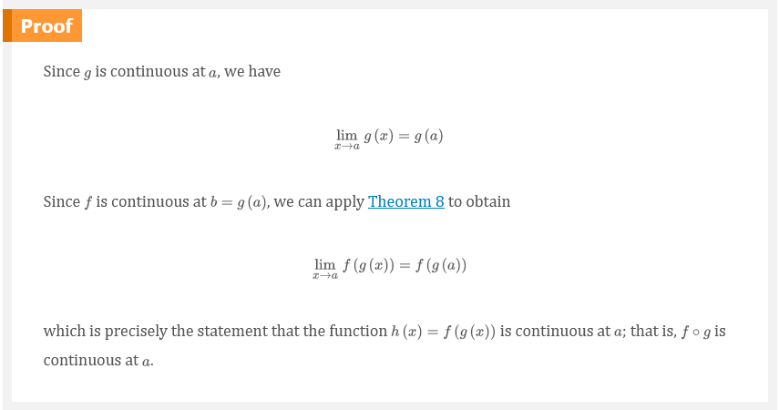
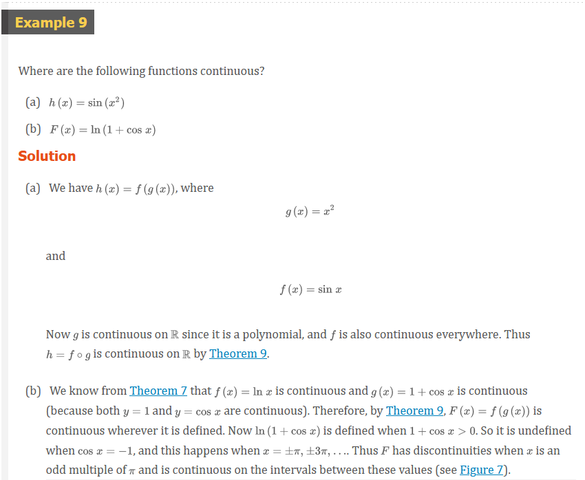

## 10 The Intermediate Value Theorem

Suppose that $f$ is continuous on the closed interval $[a, b]$ and let $N$ by
any number between $f(a)$ and $f(b)$, where $f(a) \neq f(b)$. Then there exists
a number $c$ in $(a, b)$ such that $f(c) = N$.

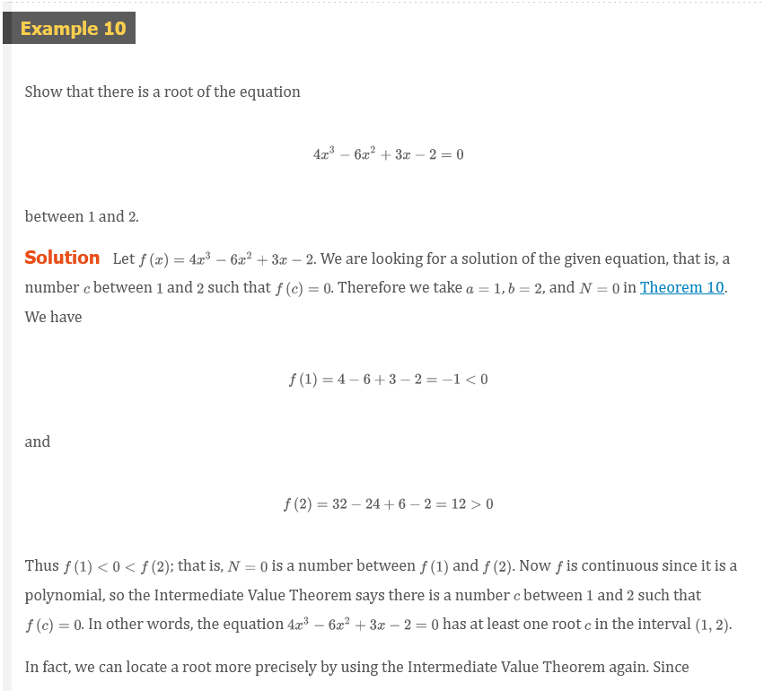
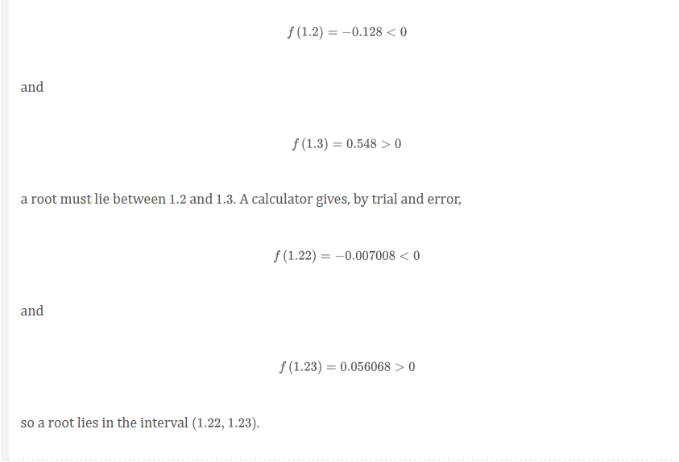
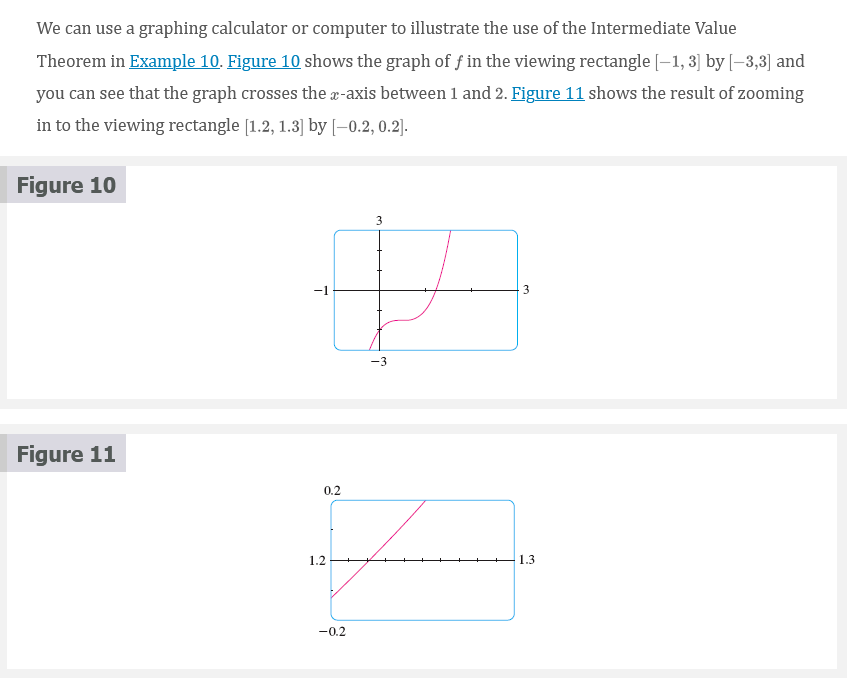

Other Resources:

- [🎬 Types of discontinuities](https://www.khanacademy.org/math/ap-calculus-ab/ab-limits-new/ab-1-10/v/types-of-discontinuities?modal=1)
- [🎬 Continuity at a point](https://www.khanacademy.org/math/ap-calculus-ab/ab-limits-new/ab-1-11/v/continuity-at-a-point)
- [🎬 Worked example: Continuity at a point(graphical)](https://www.khanacademy.org/math/ap-calculus-ab/ab-limits-new/ab-1-11/v/continuity-at-a-point-graphically)
- [🎬 Worked example: point where a function is continuous](https://www.khanacademy.org/math/ap-calculus-ab/ab-limits-new/ab-1-11/v/limit-of-piecewise-function-that-is-defined)
- [🎬 Worked example: point where a function isn't continuous](https://www.khanacademy.org/math/ap-calculus-ab/ab-limits-new/ab-1-11/v/limit-of-piecewise-function-that-is-undefined)
- [🎬 Continuity over an interval](https://www.khanacademy.org/math/ap-calculus-ab/ab-limits-new/ab-1-12/v/continuity-over-an-interval)
- [🎬 Functions continuous on all real numbers](https://www.khanacademy.org/math/ap-calculus-ab/ab-limits-new/ab-1-12/v/functions-continuous-on-all-numbers)
- [🎬 Functions continuous at specific x-values](https://www.khanacademy.org/math/ap-calculus-ab/ab-limits-new/ab-1-12/v/functions-continuous-on-specific-numbers)
- [🎬 Removing discontinuities (factoring)](https://www.khanacademy.org/math/ap-calculus-ab/ab-limits-new/ab-1-13/v/defining-a-function-at-a-point-to-make-it-continuous)
- [🎬 Removing discontinuities (rationalization)](https://www.khanacademy.org/math/ap-calculus-ab/ab-limits-new/ab-1-13/v/fancy-algebra-to-find-a-limit-and-make-a-function-continuous)

 

# Resources

- [🎬 Types of discontinuities](https://www.khanacademy.org/math/ap-calculus-ab/ab-limits-new/ab-1-10/v/types-of-discontinuities?modal=1)
- [🎬 Continuity at a point](https://www.khanacademy.org/math/ap-calculus-ab/ab-limits-new/ab-1-11/v/continuity-at-a-point)
- [🎬 Worked example: Continuity at a point(graphical)](https://www.khanacademy.org/math/ap-calculus-ab/ab-limits-new/ab-1-11/v/continuity-at-a-point-graphically)
- [🎬 Worked example: point where a function is continuous](https://www.khanacademy.org/math/ap-calculus-ab/ab-limits-new/ab-1-11/v/limit-of-piecewise-function-that-is-defined)
- [🎬 Worked example: point where a function isn't continuous](https://www.khanacademy.org/math/ap-calculus-ab/ab-limits-new/ab-1-11/v/limit-of-piecewise-function-that-is-undefined)
- [🎬 Continuity over an interval](https://www.khanacademy.org/math/ap-calculus-ab/ab-limits-new/ab-1-12/v/continuity-over-an-interval)
- [🎬 Functions continuous on all real numbers](https://www.khanacademy.org/math/ap-calculus-ab/ab-limits-new/ab-1-12/v/functions-continuous-on-all-numbers)
- [🎬 Functions continuous at specific x-values](https://www.khanacademy.org/math/ap-calculus-ab/ab-limits-new/ab-1-12/v/functions-continuous-on-specific-numbers)
- [🎬 Removing discontinuities (factoring)](https://www.khanacademy.org/math/ap-calculus-ab/ab-limits-new/ab-1-13/v/defining-a-function-at-a-point-to-make-it-continuous)
- [🎬 Removing discontinuities (rationalization)](https://www.khanacademy.org/math/ap-calculus-ab/ab-limits-new/ab-1-13/v/fancy-algebra-to-find-a-limit-and-make-a-function-continuous)

