# 2.6 Limits at Infinity; Horizontal Asymptotes

## 1 Intuitive Definition of a Limit at Infinity

Let $f$ be a function defined on some interval $(a, \infty)$. Then

$$
\lim_{x \to \infty} f(x) = L
$$

means that the values of $f(x)$ can be made arbitrarily close to $L$ by
requiring $x$ to be sufficiently large.

## 2 Definition

Let $f$ be a function defined on some interval $(-\infty, a)$. Then

$$
\lim_{x \to -\infty} f(x) = L
$$

means that the values of $f(x)$ can be made arbitrarily close to $L$ by
requiring $x$ to be sufficiently large negative.

## 3 Definition

The line $y = L$ a **horizontal asymptote** of the curve $y = f(x)$ if either

$$
\lim_{x \to \infty} f(x) = L
$$

or

$$
\lim_{x \to -\infty} f(x) = L
$$

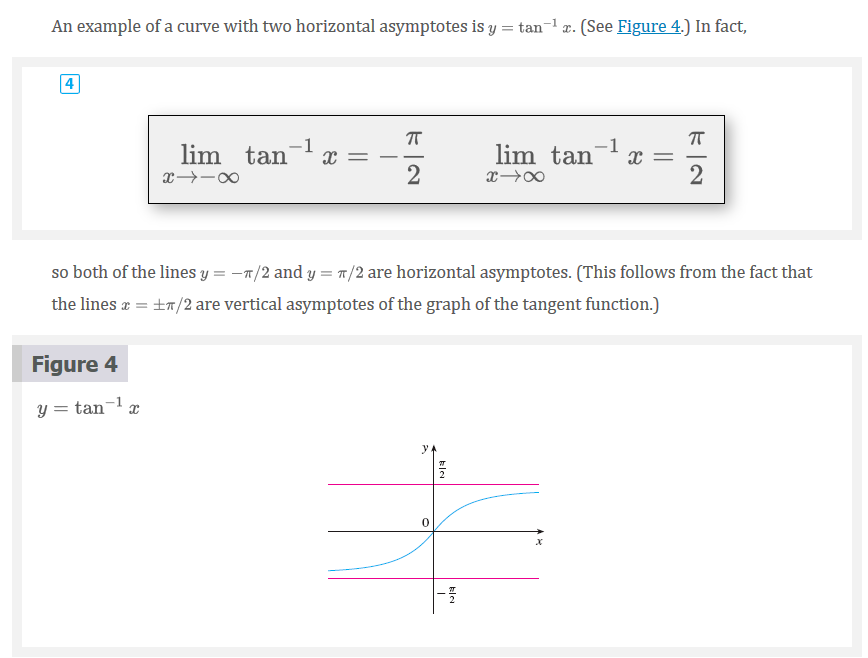

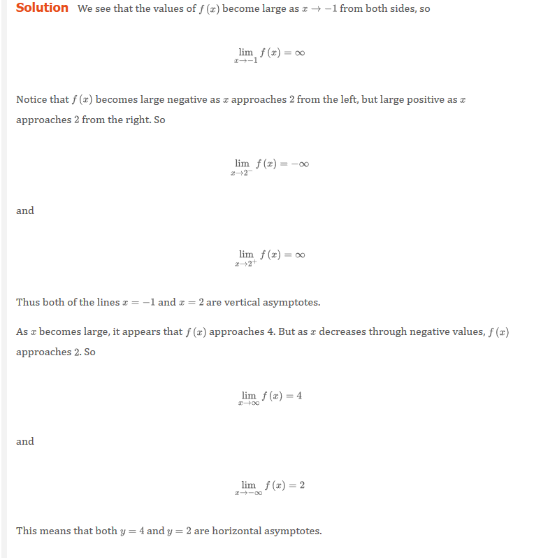

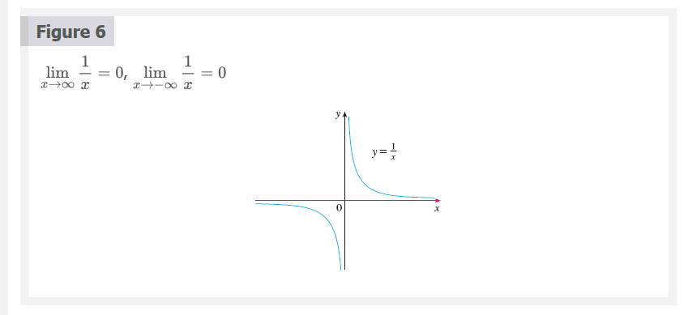

## 5 Theorem

If $r > 0$ is a rational number, then

$$
\lim_{x \to \infty} \frac{1}{x^{r}} = 0
$$

If $r > 0$ is a rational number such tat $x^{r}$ is defined for all $x$, then

$$
\lim_{x \to -\infty} \frac{1}{x^{r}} = 0
$$

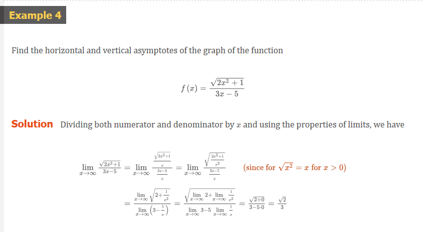
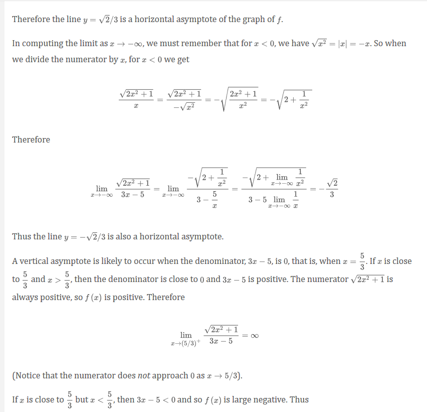

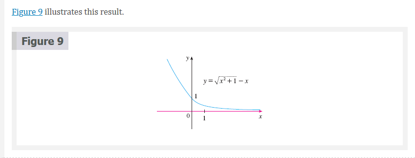

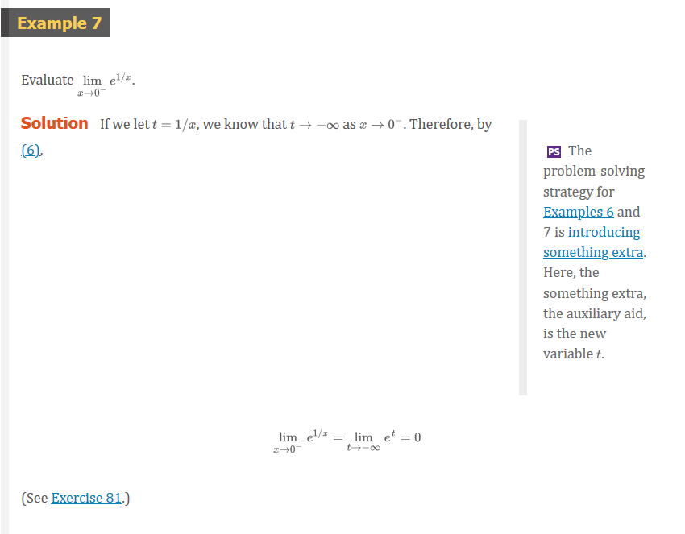
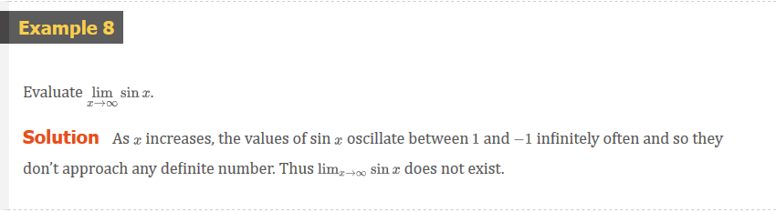

# Infinite Limits at Infinity

The notation

$$
\lim_{x \to \infty} f(x) = \infty
$$

is used to indicate that the values of $f(x)$ become large as $x$ becomes large.
Similar meanings are attached to the following symbols:

$$
\lim_{x \to -\infty} = \infty \;\;\; \lim_{x \to \infty} = -\infty \;\;\; \lim_{x \to -\infty} = -\infty
$$

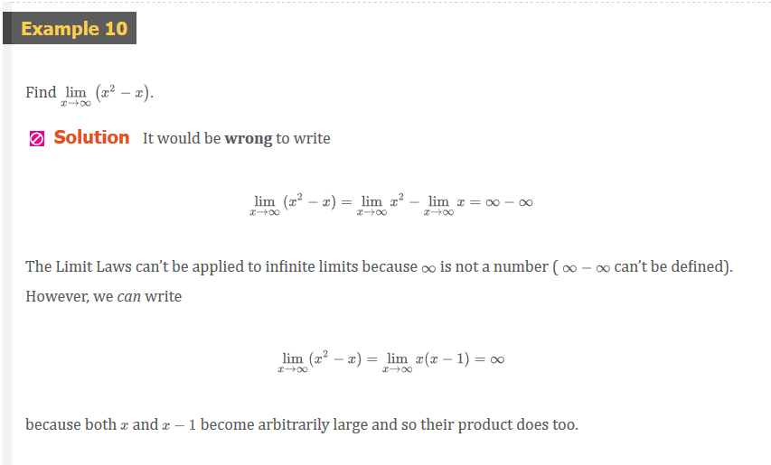

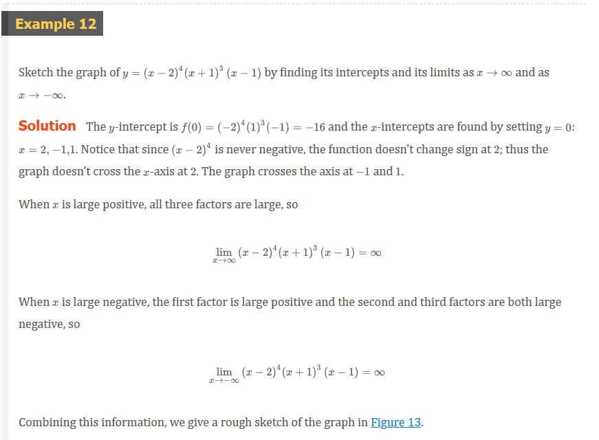
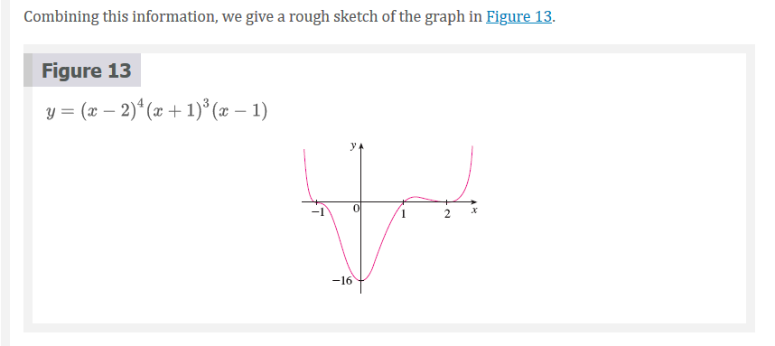

# Precise Definitions

## 7 Precise Definition of a Limit at Infinity

Let $f$ be a function defined on some interval $(a, \infty)$. Then

$$
\lim_{x \to \infty} f(x) = L
$$

means that for every $\varepsilon > 0$ there is a corresponding number $N$ such
that

$$
\text{if} \;\;\; x > N \;\;\; \text{then} \;\;\; |f(x) - L| < \varepsilon
$$

## 8 Definition

Let $f$ be a function defined on some interval $-\infty, a)$. Then

$$
\lim_{x \to -\infty} f(x) = L
$$

means that for every $\varepsilon > 0$ there is a corresponding number $N$ such
that

$$
\text{if} \;\;\; \text{then} \;\;\; |f(x) - L| < \varepsilon
$$

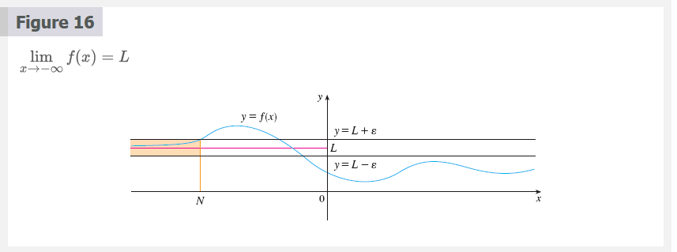

## 9 Definition of an Infinite Limit at Infinity

Let $f$ be a function defined on some interval $(a, \infty)$. Then

$$
\lim_{x \to \infty} f(x) = \infty
$$

means that for every positive number $M$ there is a corresponding positive
number $N$ such that

$$
\text{if} \;\;\; x > N \;\;\; \text{then} \;\;\; f(x) > M
$$

# Video Lectures

- [🎬 Introcution to infinite limits](https://www.khanacademy.org/math/ap-calculus-ab/ab-limits-new/ab-1-14/v/introduction-to-infinite-limits)
- [🎬 Infinite limits and asymptotes](https://www.khanacademy.org/math/ap-calculus-ab/ab-limits-new/ab-1-14/v/infinite-limits-and-asymptotes)
- [🎬 Analyzing unbounded limits: rational function](https://www.khanacademy.org/math/ap-calculus-ab/ab-limits-new/ab-1-14/v/unbounded-limits-algebraic-1)
- [🎬 Analyzing unbounded limits: mixed function](https://www.khanacademy.org/math/ap-calculus-ab/ab-limits-new/ab-1-14/v/unbounded-limits-algebraic-2)
- [🎬 Introduction to limits at infinity](https://www.khanacademy.org/math/ap-calculus-ab/ab-limits-new/ab-1-15/v/introduction-to-limits-at-infinity)
- [🎬 Functions with same limit at infinity](https://www.khanacademy.org/math/ap-calculus-ab/ab-limits-new/ab-1-15/v/functions-with-same-limit-at-inifinity)
- [🎬 Limits at infinity of quotients (Part 1)](https://www.khanacademy.org/math/ap-calculus-ab/ab-limits-new/ab-1-15/v/limits-at-positive-and-negative-infinity)
- [🎬 Limits at infinity of quotients (Part 2)](https://www.khanacademy.org/math/ap-calculus-ab/ab-limits-new/ab-1-15/v/more-limits-at-infinity)
- [🎬 Limits at infinity of quotients with square roots (odd power)](https://www.khanacademy.org/math/ap-calculus-ab/ab-limits-new/ab-1-15/v/limits-with-two-horizontal-asymptotes)
- [🎬 Limits at infinity of quotients with square roots (even power)](https://www.khanacademy.org/math/ap-calculus-ab/ab-limits-new/ab-1-15/v/limit-at-infinity-of-rational-expression-with-radical-even)

 

# Resources

- [🎬 Introcution to infinite limits](https://www.khanacademy.org/math/ap-calculus-ab/ab-limits-new/ab-1-14/v/introduction-to-infinite-limits)
- [🎬 Infinite limits and asymptotes](https://www.khanacademy.org/math/ap-calculus-ab/ab-limits-new/ab-1-14/v/infinite-limits-and-asymptotes)
- [🎬 Analyzing unbounded limits: rational function](https://www.khanacademy.org/math/ap-calculus-ab/ab-limits-new/ab-1-14/v/unbounded-limits-algebraic-1)
- [🎬 Analyzing unbounded limits: mixed function](https://www.khanacademy.org/math/ap-calculus-ab/ab-limits-new/ab-1-14/v/unbounded-limits-algebraic-2)
- [🎬 Introduction to limits at infinity](https://www.khanacademy.org/math/ap-calculus-ab/ab-limits-new/ab-1-15/v/introduction-to-limits-at-infinity)
- [🎬 Functions with same limit at infinity](https://www.khanacademy.org/math/ap-calculus-ab/ab-limits-new/ab-1-15/v/functions-with-same-limit-at-inifinity)
- [🎬 Limits at infinity of quotients (Part 1)](https://www.khanacademy.org/math/ap-calculus-ab/ab-limits-new/ab-1-15/v/limits-at-positive-and-negative-infinity)
- [🎬 Limits at infinity of quotients (Part 2)](https://www.khanacademy.org/math/ap-calculus-ab/ab-limits-new/ab-1-15/v/more-limits-at-infinity)
- [🎬 Limits at infinity of quotients with square roots (odd power)](https://www.khanacademy.org/math/ap-calculus-ab/ab-limits-new/ab-1-15/v/limits-with-two-horizontal-asymptotes)
- [🎬 Limits at infinity of quotients with square roots (even power)](https://www.khanacademy.org/math/ap-calculus-ab/ab-limits-new/ab-1-15/v/limit-at-infinity-of-rational-expression-with-radical-even)

