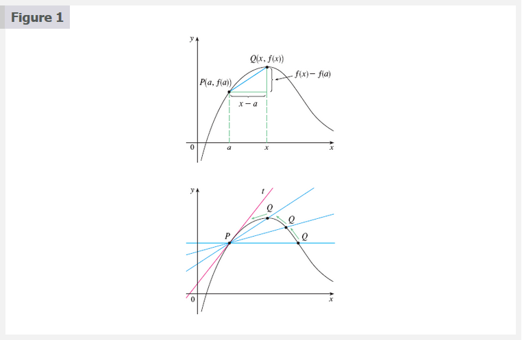
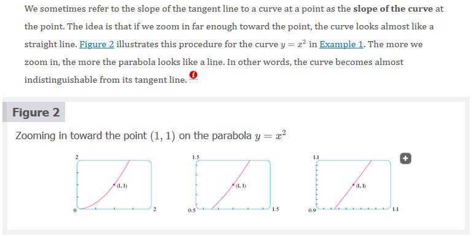
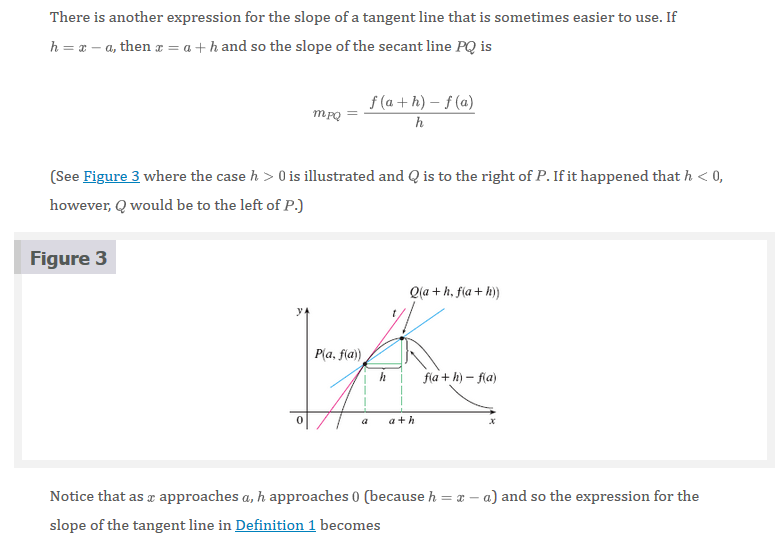
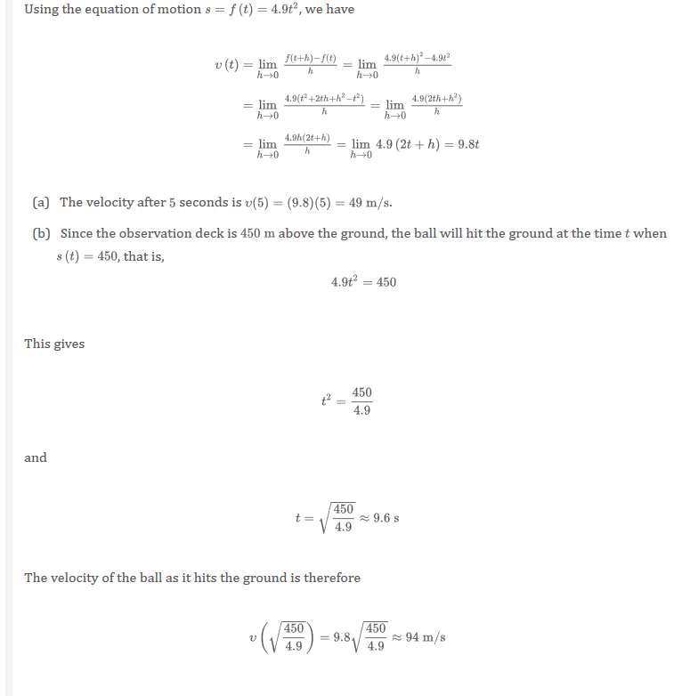
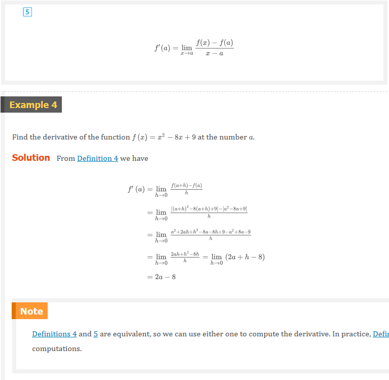
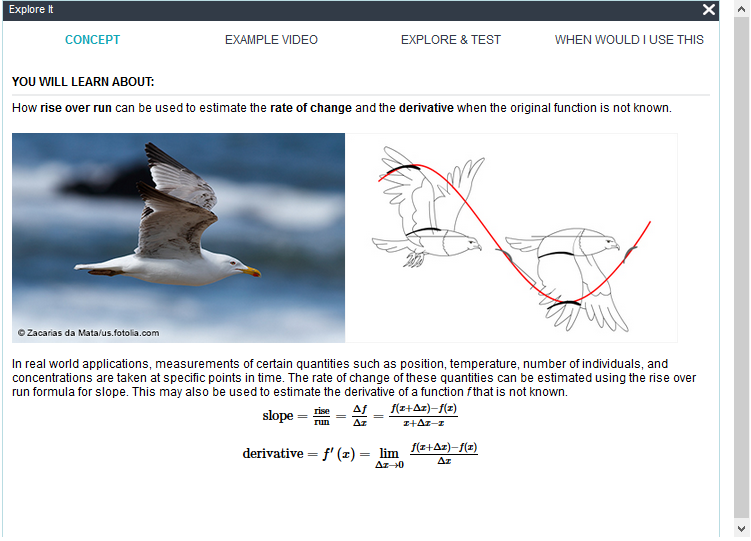
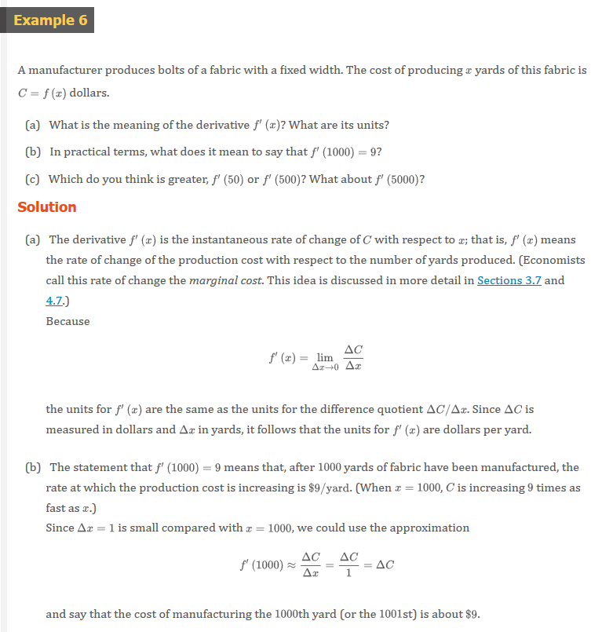

# 2.7 Derivatives and Rates of Changes

The problem of finding the tangent line to a curve and the problem of finding
the velocity of an object both involve finding the same type of limit, as we saw
in [⚓ Section 2.1](ch-2-1#the-tangent-line-and-velocity-problem). This special
type of limit is called a _derivative_ and we will see that it can be interpreted
as a rate of change in any of the natural or social sciences or engineering.

## Tangents

If a curve $C$ has equation $y = f(x)$ and we want to find the tangent line to
$C$ at the point $P(a, f(a))$, then we consider a nearby point $Q(x, f(x))$,
where $x \neq a$, and compute the slope of the secant line $PQ$:

$$
m_{PQ} = \frac{f(x) - f(a)}{x - a}
$$

Then we let $Q$ approach $P$ along the curve $C$ by letting $x$ approach $a$. If
$m_{PQ}$ approaches a number $m$, then we define the $\text{tangent } t$ to be
the line through $P$ with slope $m$. (This amounts to saying that the tangent
line is the limiting position of the secant line $PQ$ as $Q$ approaches $P$.)

### 1 Definition

The **tangent line** to the curve $y = f(x)$ at the point $(a, f(a))$ is the
line through $P$ with slope

$$
m = \lim_{x \to a} \frac{f(x) - f(a)}{x - a}
$$

provided that this limit exists.

## Velocities

In [⚓ Section 2.1](ch-2-1#the-velocity-problem) we investigated the motion of a ball dropped from the CN Tower
and defined its velocity to be the limiting value of average velocities over
shorter and shorter time periods.

In general, suppose an object moves along a straight line according to an
equation of motion $s = f(t)$, where is the displacement (directed distance) of
the object from the origin at time $t$. The function that $f$ describes the
motion is called the **position function** of the object. In the time interval
from $t = a$ to $t = a + h$ the change in position is $f(a + h) - f(a)$.

The average velocity over this time interval is

$$
\text{average velocity } = \frac{\text{displacement}}{\text{time}} = \frac{f(a + h) - f(a)}{h}
$$

## Derivatives

### 4 Definition

The **derivative of a function $f$ at a number a**, denoted by $f^{\prime}(a)$,
is

$$
f^{\prime}(a) = \lim_{h \to 0} \frac{f(a + h) - f(a)}{h}
$$

if this limit exists.

> Note: $f^{\prime}(a)$ is read "$f$ prime of $a$."

## Rates of Change

Suppose $y$ is a quantity that depends on another quantity $x$. Thus $y$ is a
function of $x$ and we write $y = f(x)$. If $x$ changes from $x_{1}$ to $x_{2}$,
then the change in $x$ (also called the **increment** of $x$) is

$$
\Delta{x} = x_{2} - x_{1}
$$

and the corresponding change in $y$ is

$$
\Delta{y} = f(x_{2}) - f(x_{1})
$$

The difference quotient

$$
\frac{\Delta{y}}{\Delta{x}} = \frac{f(x_{2}) - f(x_{1})}{x_{2} - x_{1}}
$$

is called the **average rate of change if $y$ with respect to $x$** over the
interval $[x_{1}, x_{2}]$ and can be interpreted as the slope of the secant line
$PQ$ in Figure 8.

By analogy with velocity, we consider the average rate of change over smaller
and smaller intervals by letting $x_{2}$ approach $x_{1}$ and therefore letting
$\Delta{x}$ approach $0$. The limit of these average rates of change is called
the **(instantaneous) rate of change of $y$ with respect to $x$ at $x =
x_{1}$**, which (as in the case of velocity) is interpreted as the slope of the
tangent to the curve at $y = f(x)$ at $P(x_{1}, f(x_{1}))$:

### 6 Instantaneous Rate of Change

$$
\text{instantaneous rate of change } = \lim_{\Delta{x} \to 0} \frac{\Delta{y}}{\Delta{x}} = \lim_{x_{2} \to x_{1}} \frac{f(x_{2}) - f(x_{1})}{x_{2} - x{1}}
$$

# Video Lectures

- [🎬 Newton, Leibniz, and Usain Bolt](https://www.khanacademy.org/math/ap-calculus-ab/ab-differentiation-1-new/ab-2-1/v/newton-leibniz-and-usain-bolt)
- [🎬 Derivative as a concept](https://www.khanacademy.org/math/ap-calculus-ab/ab-differentiation-1-new/ab-2-1/v/derivative-as-a-concept)
- [🎬 Secant line & average rate of change](https://www.khanacademy.org/math/ap-calculus-ab/ab-differentiation-1-new/ab-2-1/v/secant-lines-and-average-rate-of-change)
- [🎬 Derivative as a slope of curve](https://www.khanacademy.org/math/ap-calculus-ab/ab-differentiation-1-new/ab-2-1/v/derivative-as-slope-of-curve)
- [🎬 The derivative & tangent line equations](https://www.khanacademy.org/math/ap-calculus-ab/ab-differentiation-1-new/ab-2-1/v/derivative-as-slope-of-tangent-line)
- [🎬 Formal definition of the derivative as a limit](https://www.khanacademy.org/math/ap-calculus-ab/ab-differentiation-1-new/ab-2-2/v/calculus-derivatives-1-new-hd-version) ❗
- [🎬 Formal and alternate form of the derivative](https://www.khanacademy.org/math/ap-calculus-ab/ab-differentiation-1-new/ab-2-2/v/alternate-form-of-the-derivative)
- [🎬 Worked example: Derivative as a limit](https://www.khanacademy.org/math/ap-calculus-ab/ab-differentiation-1-new/ab-2-2/v/formal-and-alternate-form-of-the-derivative-for-ln-x)
- [🎬 Worked example: Derivative from limit expression](https://www.khanacademy.org/math/ap-calculus-ab/ab-differentiation-1-new/ab-2-2/v/formal-and-alternate-form-of-the-derivative-example-1)
- [🎬 The derivative of $x^{2}$ at $x = 3$ using the formal definition](https://www.khanacademy.org/math/ap-calculus-ab/ab-differentiation-1-new/ab-2-2/v/calculus-derivatives-2-new-hd-version)
- [🎬 The derivative of $x^{2}$ at any point using the formal definition](https://www.khanacademy.org/math/ap-calculus-ab/ab-differentiation-1-new/ab-2-2/v/calculus-derivatives-2-5-new-hd-version)

 

# Resources

- [🎬 Newton, Leibniz, and Usain Bolt](https://www.khanacademy.org/math/ap-calculus-ab/ab-differentiation-1-new/ab-2-1/v/newton-leibniz-and-usain-bolt)
- [🎬 Derivative as a concept](https://www.khanacademy.org/math/ap-calculus-ab/ab-differentiation-1-new/ab-2-1/v/derivative-as-a-concept)
- [🎬 Secant line & average rate of change](https://www.khanacademy.org/math/ap-calculus-ab/ab-differentiation-1-new/ab-2-1/v/secant-lines-and-average-rate-of-change)
- [🎬 Derivative as a slope of curve](https://www.khanacademy.org/math/ap-calculus-ab/ab-differentiation-1-new/ab-2-1/v/derivative-as-slope-of-curve)
- [🎬 The derivative & tangent line equations](https://www.khanacademy.org/math/ap-calculus-ab/ab-differentiation-1-new/ab-2-1/v/derivative-as-slope-of-tangent-line)
- [🎬 Formal definition of the derivative as a limit](https://www.khanacademy.org/math/ap-calculus-ab/ab-differentiation-1-new/ab-2-2/v/calculus-derivatives-1-new-hd-version)
- [🎬 Formal and alternate form of the derivative](https://www.khanacademy.org/math/ap-calculus-ab/ab-differentiation-1-new/ab-2-2/v/alternate-form-of-the-derivative)
- [🎬 Worked example: Derivative as a limit](https://www.khanacademy.org/math/ap-calculus-ab/ab-differentiation-1-new/ab-2-2/v/formal-and-alternate-form-of-the-derivative-for-ln-x)
- [🎬 Worked example: Derivative from limit expression](https://www.khanacademy.org/math/ap-calculus-ab/ab-differentiation-1-new/ab-2-2/v/formal-and-alternate-form-of-the-derivative-example-1)
- [🎬 The derivative of $x^{2}$ at $x = 3$ using the formal definition](https://www.khanacademy.org/math/ap-calculus-ab/ab-differentiation-1-new/ab-2-2/v/calculus-derivatives-2-new-hd-version)
- [🎬 The derivative of $x^{2}$ at any point using the formal definition](https://www.khanacademy.org/math/ap-calculus-ab/ab-differentiation-1-new/ab-2-2/v/calculus-derivatives-2-5-new-hd-version)

