# 2.8 The Derivative as a Function

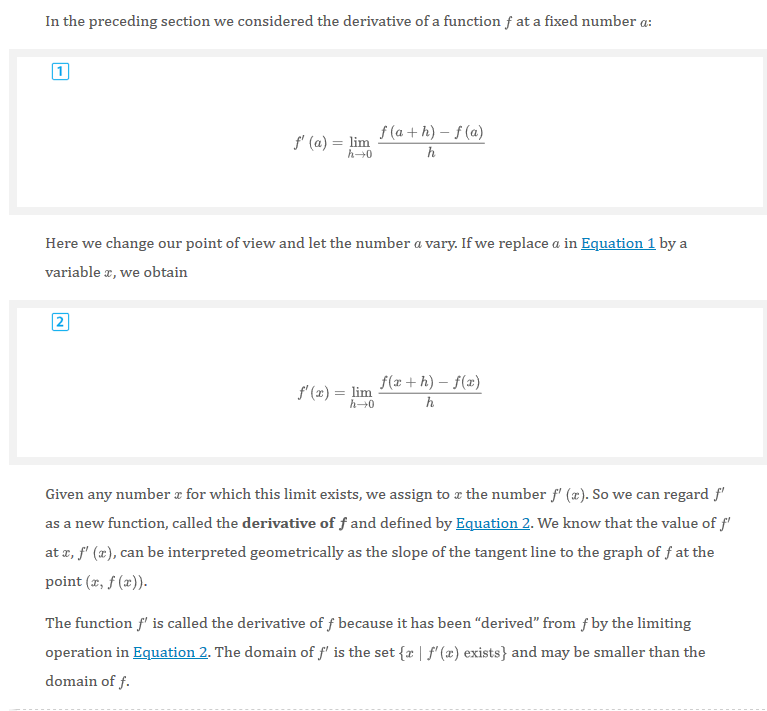
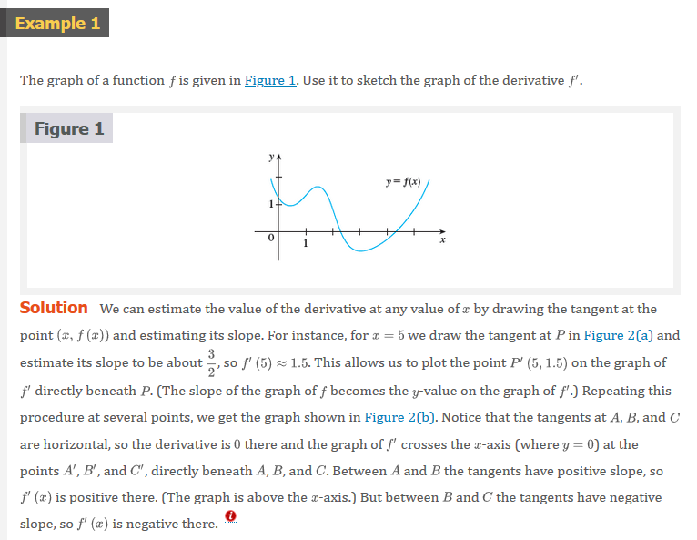
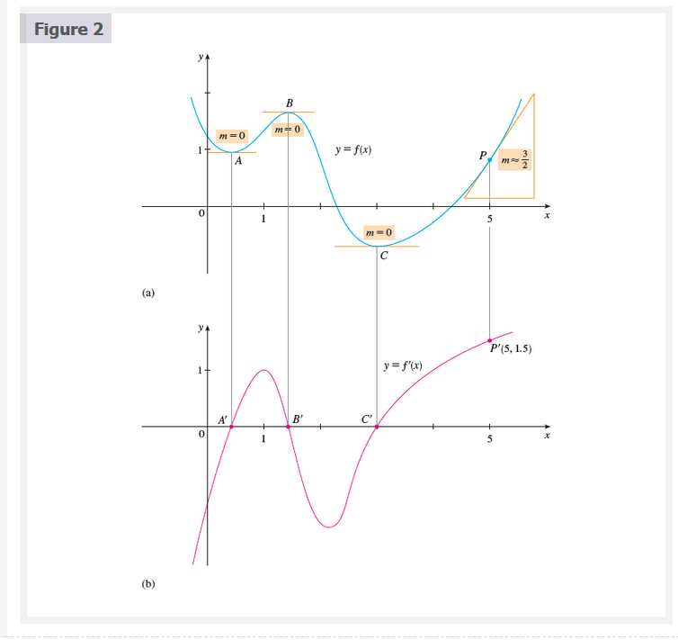
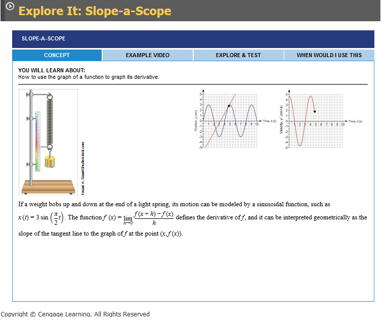
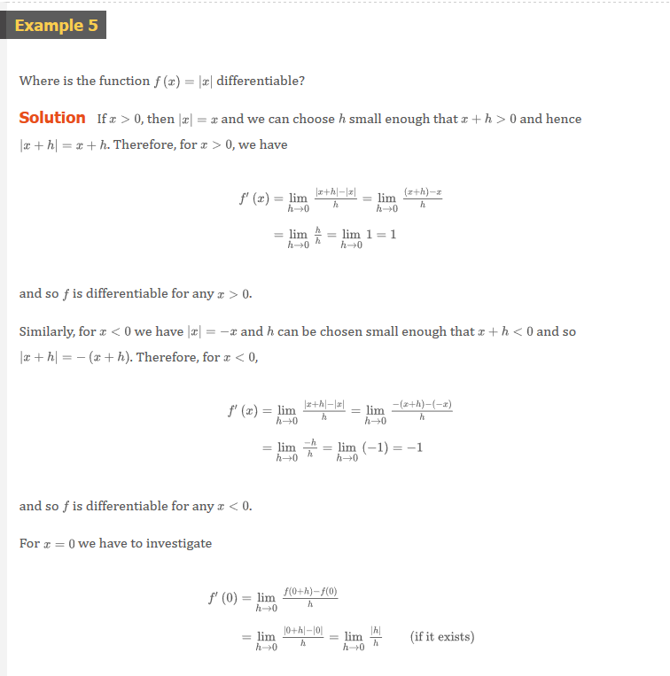
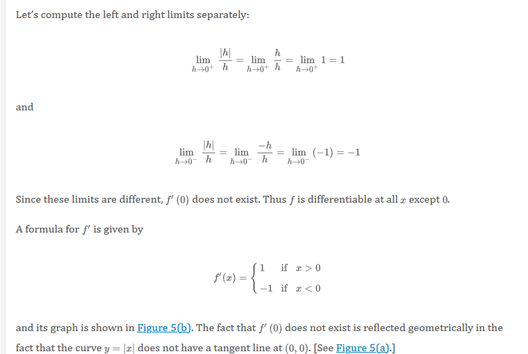
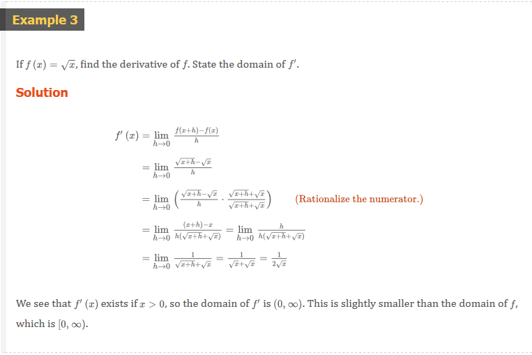
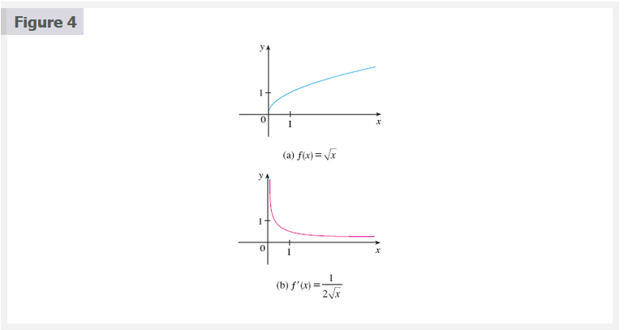
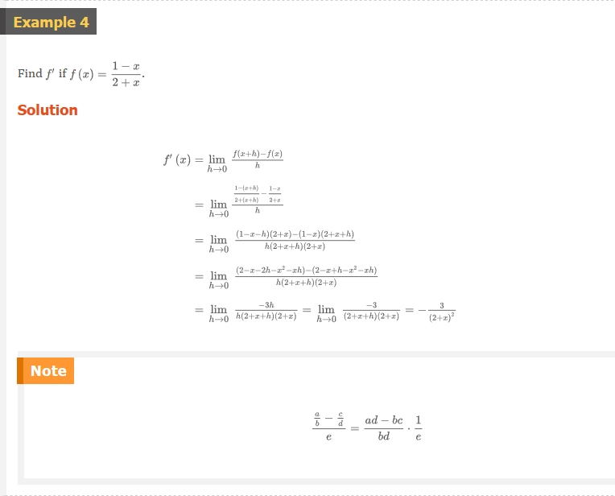

## Other Notations

If we use the traditional notation $y = f(x)$ to indicate that the independent
variable is $x$ and the dependent variable is $y$, then some common alternative
notations for the derivative are as follows:

$$
f^{\prime}(x) = y^{\prime} = \frac{dy}{dx} = \frac{df}{dx} = \frac{d}{dx} f(x) = Df(x) = D_{x}f(x)
$$

The symbols $D$ and $d/dx$ are called **differentiation operators** because they
indicate the operation of **differentiation**, ,which is the process of
calculating a derivative

The symbol $dy/dx$, which was introduced by Leibniz, should not be regarded as a
ration (for the time being); it is simply a synonym for $f^{\prime}(x)$.
Nonetheless, it is a very useful and suggestive notation, especially when used
in conjunction with increment notation. Referring to
[⚓ Equation 2.7.6](ch-2-7#instantaneous-rate-of-change), we can rewrite the
definition of derivative in Leibniz notation in the form

$$
\frac{dy}{dx} = \lim_{\Delta{x} \to 0} \frac{\Delta{y}}{\Delta{x}}
$$

If we want to indicate the value of a derivative $dy/dx$ in Liebniz notation at
a specific number $a$, we use the notation

$$
\left.\begin{matrix}
\frac{dy}{dx}
\end{matrix}\right|
_{x = a}
$$

or

$$
\left.\begin{matrix}
\frac{dy}{dx}
\end{matrix}\right]
_{x = a}
$$

which is a synonym for $f^{\prime}(a)$. The vertical bar means "evaluate at."

### 3 Definition

A function $f$ is **differentiable at $a$** if $f^{\prime}(a)$ exists. It is
**differentiable on an open interval $(a, b)$** [or $(a, \infty)$ or $(-\infty,
a)$ or $(-\infty, \infty)$] if it is differentiable at every number in the
interval.

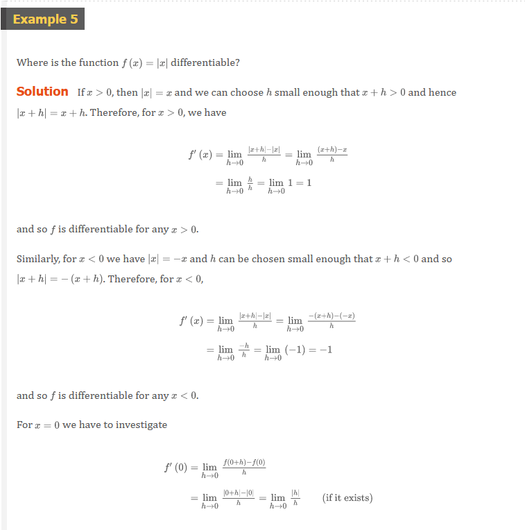
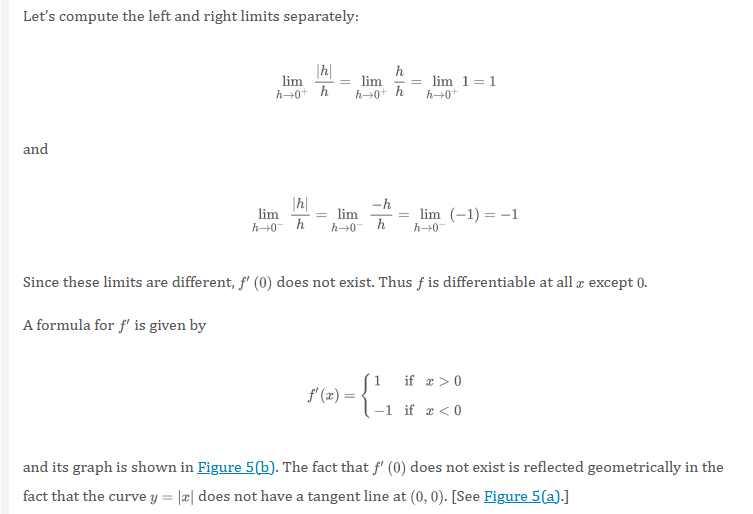
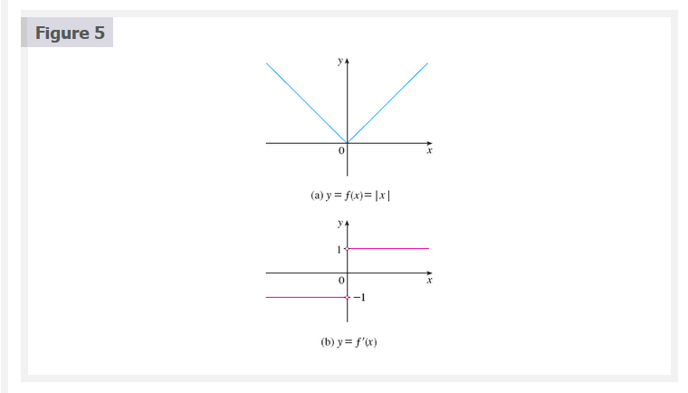

### 4 Theorem

If $f$ is differentiable at $a$, then $f$ is continuous at $a$.

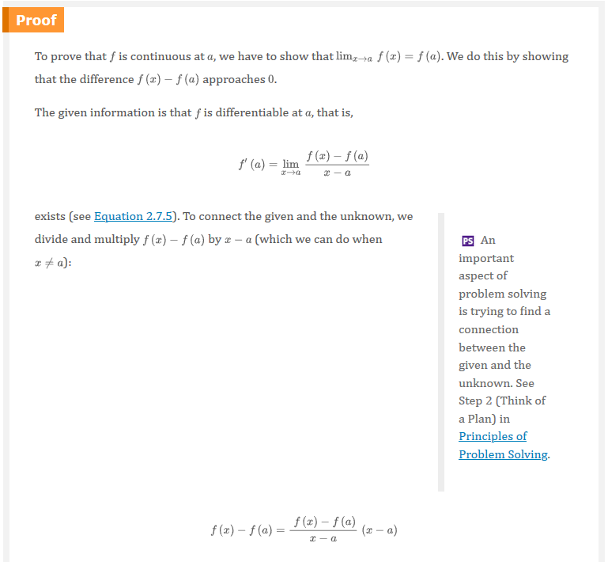
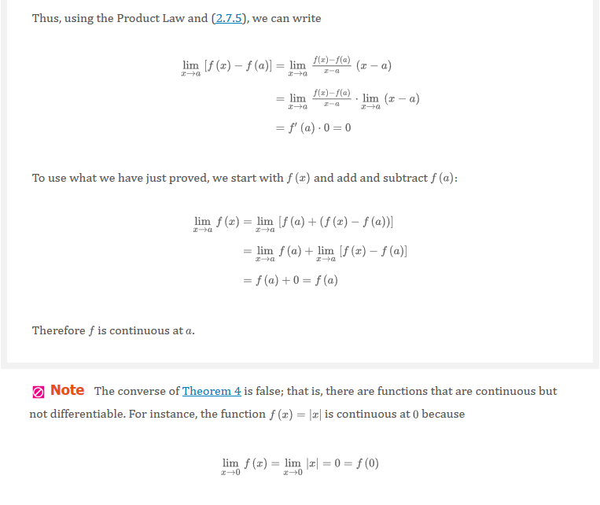

## How Can a Function Fail to Be Differentiable?

A third possibility is that the curve has a **vertical tangent line** when $x =
a$; that is, $f$ is continuous at $a$ and

$$
\lim_{x \to a} \left | f^{\prime}(x) \right | = \infty
$$

This means that the tangent lines become steeper and steeper as $x \to a$.
Figure 6 shows one way that this can happen; Figure 7(c) shows another. Figure 7
illustrates the three possibilities that we have discussed

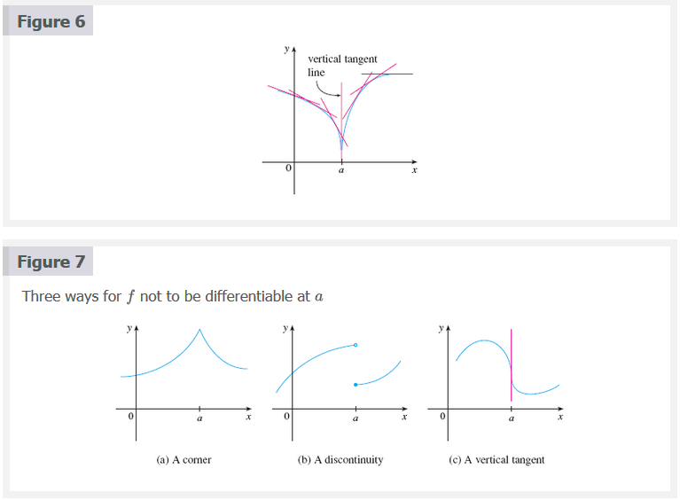
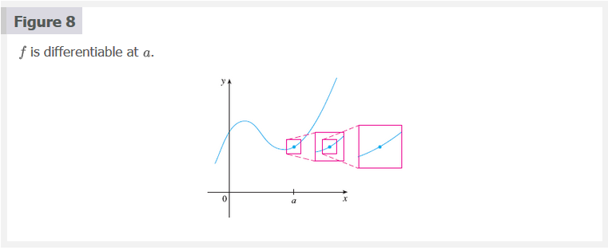
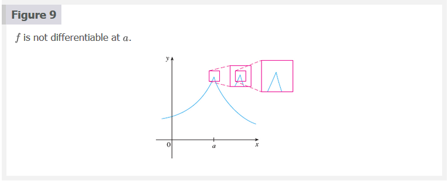

## Higher Derivatives

If $f$is a differentiable function, then its derivative $f^{\prime}$is also a
function, so $f^{\prime}$ may have a derivative of its own, denoted by
$(f^{\prime}) = f^{\prime \prime}$. This new function $f^{\prime \prime}$ is
called the **second derivative** of $f$ because it is the derivative of the
derivative of $f$. Using Leibniz notation, we write the second derivative of $y
= f(x)$ as

$$
\begin{matrix}
\underbrace{\frac{d}{dx}} & (\underbrace{\frac{dy}{dx}}) &= \underbrace{\frac{d^{2}y}{dx^{2}}} \\
\text{derivative}         & \text{first}                 & \text{second} \\
\text{of}                 & \text{derivative}            & \text{derivative}
\end{matrix}
$$

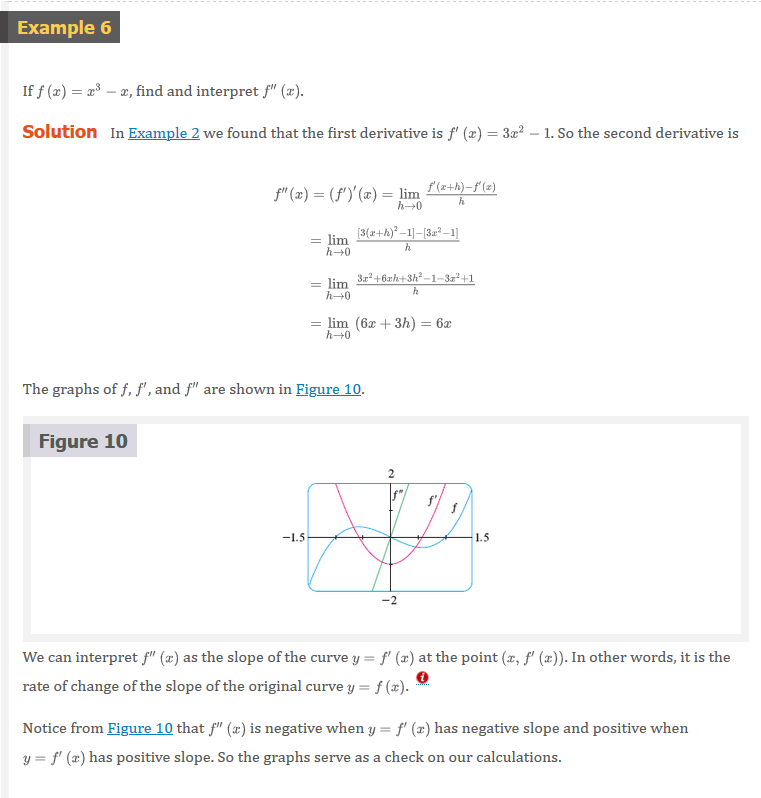
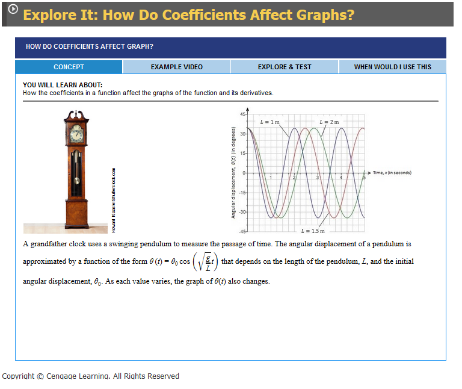

In general, we can interpret a second derivative as a rate of change of a rate
of change. The most familiar example of this is acceleration, which we define as
follows.

If $s = s(t)$ is the position function of an object that moves in a straight
line, we know that its first derivative represents the velocity $v(t)$ of the
object as a function of time:

$$
v(t) = s^{\prime}(t) = \frac{ds}{dt}
$$

The instantaneous rate of change with respect to time is called the
**acceleration $a(t)$** of the object. Thus the acceleration function is the
derivative of the velocity function and therefore the second derivative of the
position function:

$$
a(t) = v^{\prime}(t) = s^{\prime \prime}(t)
$$

or, in Leibniz notation,

$$
a = \frac{dv}{dt} = \frac{d^{2}s}{dt^{2}}
$$

Acceleration is the change in velocity you feel when speeding up or slowing down
in a car. The **third derivative $f^{\prime \prime \prime}$** is the derivative
of the second derivative: $f^{\prime \prime \prime} = (f^{\prime \prime})^{\prime}$.
So $f^{\prime \prime \prime}(x)$ can be interpreted as the slope of the curve $y
= f^{\prime \prime}(x)$ or as the rate of change of $f^{\prime \prime}(x)$. if
$y = f(x)$, then alternative notations for the third derivative are

$$
y^{\prime \prime \prime} = f^{\prime \prime \prime} = \frac{d}{dx} \left ( \frac{d^{2}y}{dx^{2}} \right ) = \frac{d^{3}y}{dx^{3}}
$$

We can also interpret the third derivative physically in the case where the
function is the position function $s = s(t)$ of an object that moves along a
straight line. Because $s^{\prime \prime \prime} = (s^{\prime \prime})^{\prime}
= a^{\prime}$, the third derivative oof the position function is the derivative
of the acceleration function and is called the **jerk:**

$$
j = \frac{da}{dt} = \frac{d^{3}s}{dt^{3}}
$$

Thus the jerk $j$ is the rate of change of acceleration. It is aptly named
because large jerk means a sudden change in acceleration, which causes an abrupt
movement in a vehicle.

The differentiation process can be continued. The fourth derivative $f^{\prime
\prime \prime}$ is usually denoted by $f^{(4)}$. In general, the $n$th
derivative of $f$ is denoted by $f^{n}$ and is obtained from $f$by
differentiating $n$ times. If $y = f(x)$, we write

$$
y^{(n)} = f^{(n)}(x) = \frac{d^{n}y}{dx^{n}}
$$

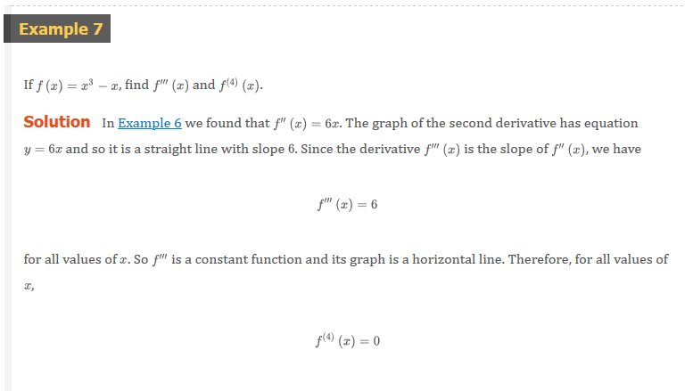

 

# Resources

