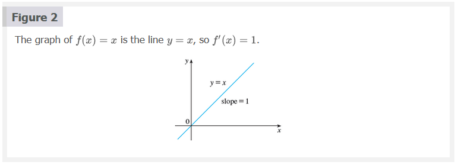
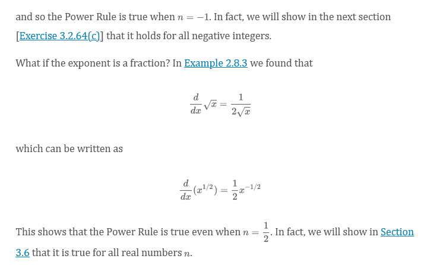
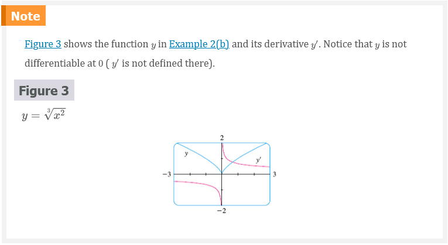
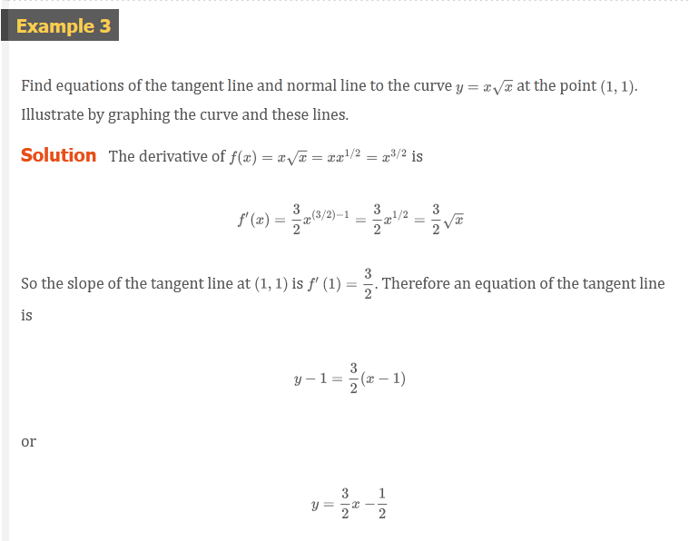
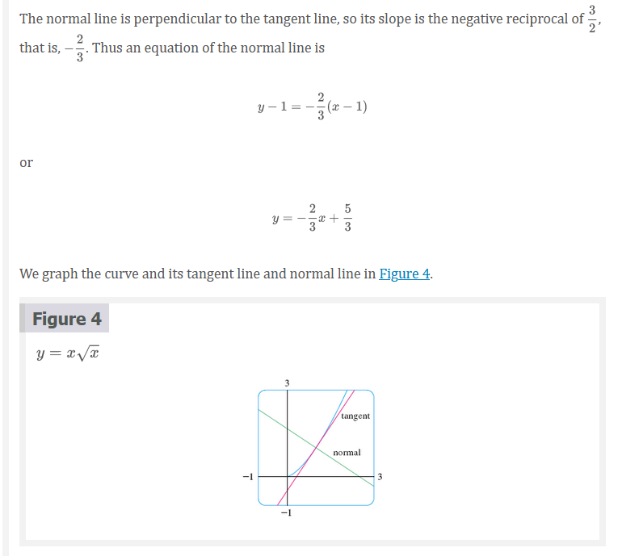
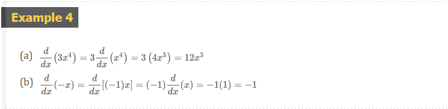
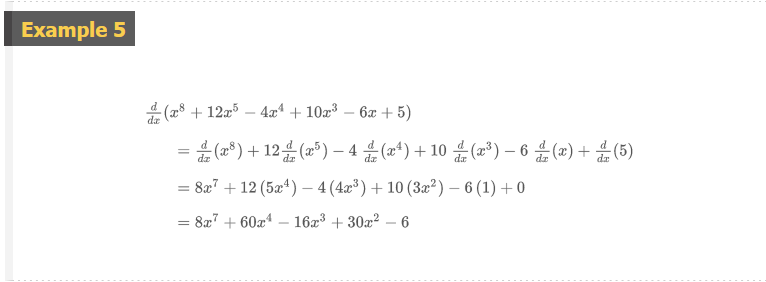
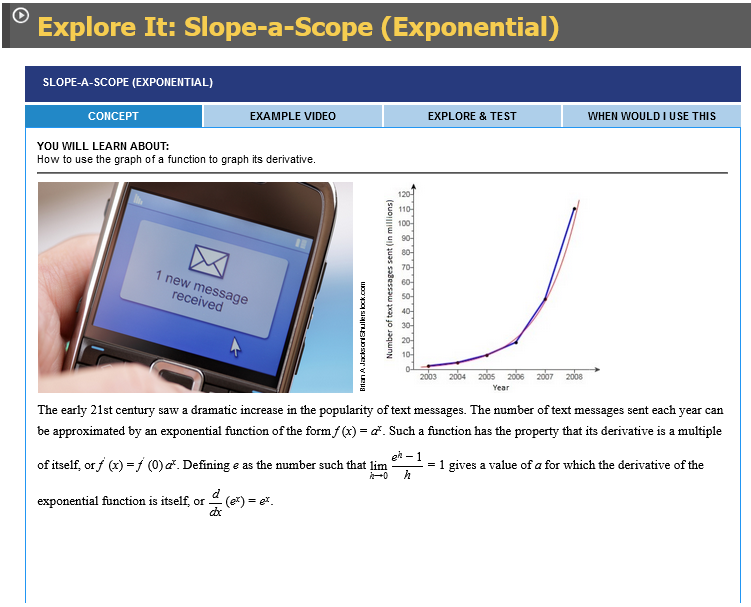
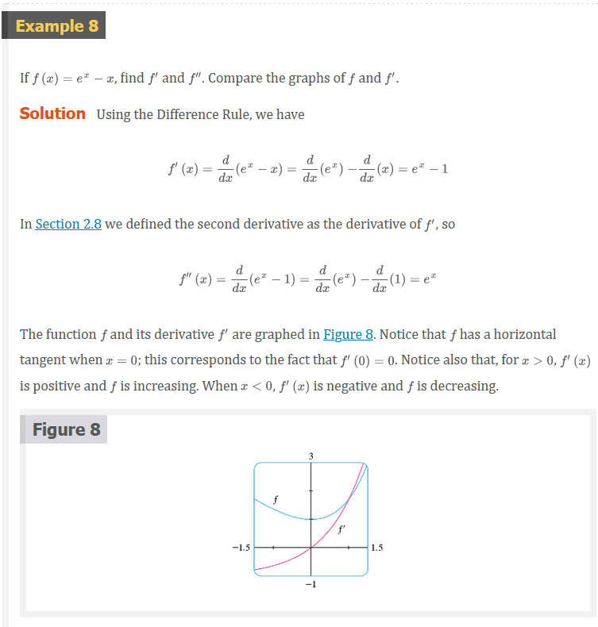
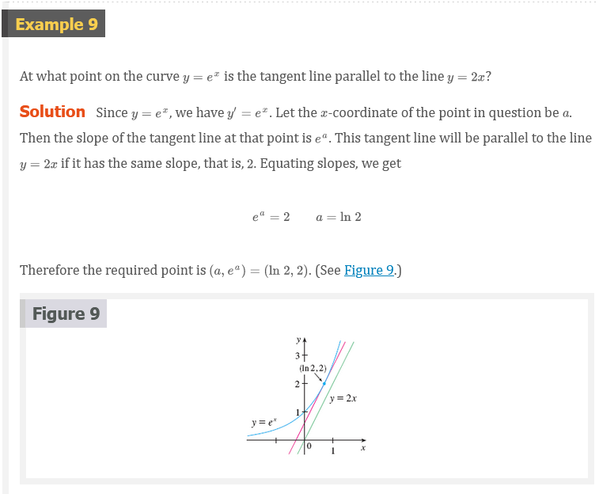

# 3.1 Derivatives of Polynomials and Exponential Functions

Let’s start with the simplest of all functions, the constant function $f(x) =
c$. The graph of this function is the horizontal line $y = c$, which has slope ,
so we must have $f^{\prime}(x) = 0$. (See Figure 1.) A formal proof, from the
definition of a derivative, is also easy:

$$
f^{\prime}(x) = \lim_{h \to 0} \frac{f(x + h) - f(x)}{h} = \lim_{h \to 0} \frac{c - c}{h} \lim_{h \to 0} 0 = 0
$$

In Leibniz notation, we write this rule as follows.

$$
\frac{d}{dx}(c) = 0
$$

## Power Functions

We next look at the function $f(x) = x^{n}$, where $n$ is a positive integer. If
$n = 1$, the graph of $f(x) = x$ is the line $y = x$, which has slope 1. (See
Figure 2.) So

### Equation 1

$$
\frac{d}{dx}(x) = 1
$$

### Equation 2

$$
\frac{d}{dx}(x^{2}) = 2x \;\;\; \frac{d}{dx}(x^{3}) = 3x^{2}
$$

For $n = 4$ we find the derivative of $f(x) = x^{4}$ as follows:

$$
\begin{aligned}
f^{\prime}(x) &= \lim_{h \to 0} \frac{f(x + h) - f(x)}{h} = \lim_{h \to 0} \frac{(x + h)^{4} - x^{4}}{h} \\
 &= \frac{x^{4} + 4x^{3} + 6x^{2}h^{2} + 4xh^{3} + h^{4} - x^{4}}{h} \\
 &= \frac{4x^{3}h + 6x^{2}h^{2} + 4xh^{3} + h^{4}}{h} \\
 &= \lim_{h \to 0} (4x^{3} + 6x^{2}h + 4xh^{2} + h^{3}) = 4x^{3}
\end{aligned}
$$

Thus

### Equation 3

$$
\frac{d}{dx}(x^{4}) = 4x^{3}
$$

### The Power Rule

If $n$ is a positive integer, then

$$
\frac{d}{dx}(x^{n}) = nx^{n - 1}
$$

We illustrate the Power Rule using various notations in Example 1.

> The Power Rule (General Version)

If $n$ is any real number, then

$$
\frac{d}{dx}(x^{n}) = nx^{n - 1}
$$

Observe from Figure 3 that the function $y$ in Example 2(b) is increasing when
$y^{\prime}$ is positive and is decreasing when $y^{\prime}$ is negative. In
Chapter 4 we will prove that, in general, a function increases when its
derivative is positive and decreases when its derivative is negative.

The Power Rule enables us to find tangent lines without having to resort to the
definition of a derivative. It also enables us to find normal lines. The normal
line to a curve $C$ at a point $P$ is the line through $P$ that is perpendicular
to the tangent line at $P$. (In the study of optics, one needs to consider the
angle between a light ray and the normal line to a lens.)

### New Derivatives from Old

When new functions are formed from old functions by addition, subtraction, or
multiplication by a constant, their derivatives can be calculated in terms of
derivatives of the old functions. In particular, the following formula says that
_the derivative of a constant times a function is the constant times the
derivative of the function_.

> The Constant Multiple Rule

If $c$ is a constant and $f$ is a differentiable function, then

$$
\frac{d}{dx}[cf(x)] = c\frac{d}{dx}f(x)
$$

- [⚓ Limit Laws](../chapter-2/ch-2-3#calculating-limits-using-the-limit-laws)

> The Sum Rule

If $f$ and $g$ are both differentiable, then

$$
\frac{d}{dx}[f(x) + g(x)] = \frac{d}{dx}f(x) + \frac{d}{dx}g(x)
$$

Using the prime notation, we can write the Sum Rule as

$$
(f + g)^{\prime} = f^{\prime} + g^{\prime}
$$

- [⚓ Limit Laws](../chapter-2/ch-2-3#calculating-limits-using-the-limit-laws)

> The Difference Rule

If $f$ and $g$ are both differentiable, then

$$
\frac{d}{dx}[f(x) - g(x)] = \frac{d}{dx}f(x) - \frac{d}{dx}g(x)
$$

The Constant Multiple Rule, the Sum Rule, and the Difference Rule can be
combined with the Power Rule to differentiate any polynomial, as the following
examples demonstrate.

### Exponential Functions

Let’s try to compute the derivative of the exponential function $f(x) = b^{x}$
using the definition of a derivative:

$$
\begin{aligned}
f^{\prime} &= \lim_{h \to 0}\frac{f(x + h) - f(x)}{h} = \lim_{h \to 0}\frac{b^{x + h} - b^{x}}{h} \\
 &= \lim_{h \to 0}\frac{b^{x}b^{h} - b^{x}}{h} = \lim_{h \to 0}\frac{b^{x}(b^{h} - 1)}{h}
\end{aligned}
$$

The factor doesn’t depend on , so we can take it in front of the limit:

$$
f^{\prime}(x) = b^{x} \lim_{h \to 0}\frac{b^{h} - 1}{h}
$$

Notice that the limit is the value of the derivative of at , that is,

$$
\lim_{h \to 0}\frac{b^{h} - 1}{h} = f^{\prime}(0)
$$

Therefore we have shown that if the exponential function $f(x) = b^{x}$ is
differentiable at $0$, then it is differentiable everywhere and

### Equation 4

$$
f^{\prime}(x) = f^{\prime}(0)b^{x}
$$

This equation says that _the rate of change of any exponential function is
proportional to the function itself_. (The slope is proportional to the height.)

Numerical evidence for the existence of $f^{\prime}(0)$ is given in the table
below for the cases $b = 2$ and $b = 3$. (Values are stated correct to four
decimal places.) It appears that the limits exist and

$$
\begin{aligned}
\text{for } b &= 2, f^{\prime}(0) = \lim_{h \to 0}\frac{2^{h} - 1}{h} \approx 0.69 \\
\text{for } b &= 3, f^{\prime}(0) = \lim_{h \to 0}\frac{3^{h} - 1}{h} \approx 1.10
\end{aligned}
$$

| $h$    | $\frac{2^{h} - 1}{h}$ | $\frac{3^{h} - 1}{h}$ |
|--------|-----------------------|-----------------------|
| 0.1    | 0.7177                | 1.1612                |
| 0.01   | 0.6956                | 1.1047                |
| 0.001  | 0.6934                | 1.0992                |
| 0.0001 | 0.6932                | 1.0987                |

In fact, it can be proved that these limits exist and, correct to six decimal
places, the values are

$$
\frac{d}{dx}(2^{x})\Bigl |_{x = 0} \approx 0.693147 \;\;\; \frac{d}{dx}(3^{3}) \Bigr |_{x = 0} \approx
$$

### Equation 5

$$
\frac{d}{dx}(2^{x}) \approx (0.69)2^{x} \;\;\; \frac{d}{dx}(3^{3}) \approx (1.10)3^{x}
$$

Of all possible choices for the base in Equation 4, the simplest
differentiation formula occurs when $f^{\prime}(0) = 1$. In view of the
estimates of $f^{\prime}(0)$ for $b = 2$ and $b = 3$, it seems reasonable that
there is a number $b$ between $2$ and $3$ for which $f^{\prime}(0) = 1$. It is
traditional to denote this value by the letter $e$. (In fact, that is how we
introduced in Section 1.4.) Thus we have the following definition.

> Definition of the Number $e$

$e$ is the number such that

$$
\lim_{h \to 0}\frac{e^{h} - 1}{h} = 1
$$

> Derivative of the Natural Exponential Function

$$
\frac{d}{dx}(e^{x}) = e^{x}
$$

## Video Lectures

- [🎬 Power Rule](https://www.khanacademy.org/math/ap-calculus-ab/ab-differentiation-1-new/ab-2-5/v/power-rule)
- [🎬 Power Rule (withrewriting the expression)](https://www.khanacademy.org/math/ap-calculus-ab/ab-differentiation-1-new/ab-2-5/v/power-rule-with-rewriting)
- [🎬 Basic Derivative rules](https://www.khanacademy.org/math/ap-calculus-ab/ab-differentiation-1-new/ab-2-6a/v/derivative-properties-and-polynomial-derivatives)
- [🎬 Basic derivative rules: find the error](https://www.khanacademy.org/math/ap-calculus-ab/ab-differentiation-1-new/ab-2-6a/v/differentiating-linear-functions)
- [🌎 Justifying the basic derivative rules](https://www.khanacademy.org/math/ap-calculus-ab/ab-differentiation-1-new/ab-2-6a/a/justifying-the-basic-derivative-rules)
- [🎬 Differentiating polyynomials](https://www.khanacademy.org/math/ap-calculus-ab/ab-differentiation-1-new/ab-2-6b/v/differentiating-polynomials-example)
- [🎬 Differentiating integer powers (mixed positive and negative)](https://www.khanacademy.org/math/ap-calculus-ab/ab-differentiation-1-new/ab-2-6b/v/negative-powers-differentiation)
- [🎬 Tangents of polynomials](https://www.khanacademy.org/math/ap-calculus-ab/ab-differentiation-1-new/ab-2-6b/v/tangents-of-polynomials)

 

# Resources

- [⚓ Limit Laws](../chapter-2/ch-2-3#calculating-limits-using-the-limit-laws)
- [🎬 Power Rule](https://www.khanacademy.org/math/ap-calculus-ab/ab-differentiation-1-new/ab-2-5/v/power-rule)
- [🎬 Power Rule (withrewriting the expression)](https://www.khanacademy.org/math/ap-calculus-ab/ab-differentiation-1-new/ab-2-5/v/power-rule-with-rewriting)
- [🎬 Basic Derivative rules](https://www.khanacademy.org/math/ap-calculus-ab/ab-differentiation-1-new/ab-2-6a/v/derivative-properties-and-polynomial-derivatives)
- [🎬 Basic derivative rules: find the error](https://www.khanacademy.org/math/ap-calculus-ab/ab-differentiation-1-new/ab-2-6a/v/differentiating-linear-functions)
- [🌎 Justifying the basic derivative rules](https://www.khanacademy.org/math/ap-calculus-ab/ab-differentiation-1-new/ab-2-6a/a/justifying-the-basic-derivative-rules)
- [🎬 Differentiating polyynomials](https://www.khanacademy.org/math/ap-calculus-ab/ab-differentiation-1-new/ab-2-6b/v/differentiating-polynomials-example)
- [🎬 Differentiating integer powers (mixed positive and negative)](https://www.khanacademy.org/math/ap-calculus-ab/ab-differentiation-1-new/ab-2-6b/v/negative-powers-differentiation)
- [🎬 Tangents of polynomials](https://www.khanacademy.org/math/ap-calculus-ab/ab-differentiation-1-new/ab-2-6b/v/tangents-of-polynomials)

Textbook

+ [🌎 Cengage e-Textbook: Calculus Early Transcendentals, Eighth Edition, Stewart](https://webassign.com/)

