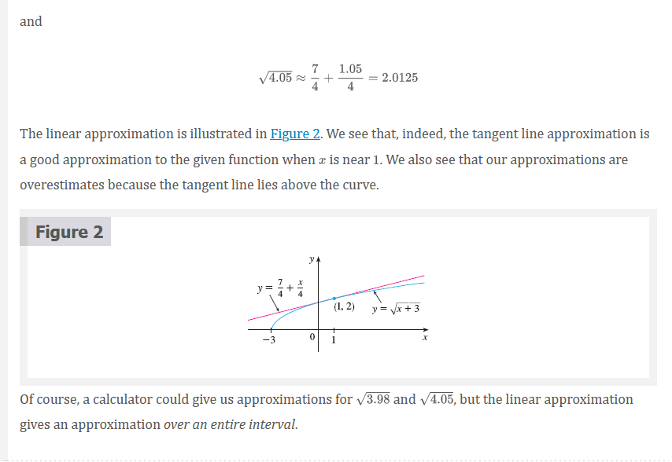
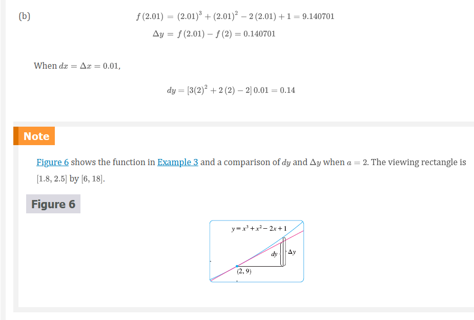

# Chapter 3.10: Linear Approximations and Differentials

The idea is that it might be easy to calculate a value of $f(a)$ a function, but
difficult (or even impossible) to compute nearby values of $f$. So we settle for
the easily computed values of the linear function $L$ whose graph is the tangent
line of $f$ at $(a, f(a))$.

In other words, we use the tangent line at $(a, f(a))$ as an approximation to
the curve $y = f(x)$ when $x$ is near $a$. An equation of this tangent line is

$$
y = f(a) + f^{\prime}(a)(x - a)
$$

and the approximation

## Equation 1

$$
f() \approx f(a) + f^{\prime}(a)(x - a)
$$

is called the **linear approximation** or **tangent line approximation** of at.
The linear function whose graph is this tangent line, that is,

## Equation 2

$$
L(x) = f(a) + f^{\prime}(a)(x - a)
$$

is called the **linearization** of $f$ at $a$

In the following table we compare the estimates from the linear approximation in
Example 1 with the true values. Notice from this table, and also from Figure 2,
that the tangent line approximation gives good estimates when $x$ is close $1$
to but the accuracy of the approximation deteriorates when is farther away from
$1$.

|               | $x$  | From   | Actual value  |
|---------------|------|--------|---------------|
| $\sqrt{3.9}$  | 0.9  | 1.975  | 1.97484176... |
| $\sqrt{3.98}$ | 0.98 | 1.995  | 1.99499373... |
| $\sqrt{4}$    | 1    | 2      | 2.00000000... |
| $\sqrt{4.05}$ | 1.05 | 2.0125 | 2.01246117... |
| $\sqrt{4.1}$  | 1.1  | 2.025  | 2.02484567... |
| $\sqrt{5}$    | 2    | 2.25   | 2.23606797... |
| $\sqrt{6}$    | 3    | 2.5    | 2.44948974... |

How good is the approximation that we obtained in Example 1? The next example
shows that by using a graphing calculator or computer we can determine an
interval throughout which a linear approximation provides a specified accuracy.

## Applications to Physics

Linear approximations are often used in physics. In analyzing the consequences
of an equation, a physicist sometimes needs to simplify a function by replacing
it with its linear approximation. For instance, in deriving a formula for the
period of a pendulum, physics textbooks obtain the expression $a_{T} =
-g\sin{\theta}$ for tangential acceleration and then replace $\sin{\theta}$ by
$\theta$ with the remark that $\sin{\theta}$ is very close to $\theta$ if
$\theta$ is not too large. [See, for example, Physics: Calculus, 2d ed., by
Eugene Hecht (Pacific Grove, CA: Brooks/Cole, 2000), p. 431.] You can verify
that the linearization of the function $f(x) = \sin{x}$ at $a = 0$ is $L(x) = x$
and so the linear approximation at $0$ is

$$
\sin{x} \approx x
$$

So, in effect, the derivation of the formula for the period of a pendulum uses
the tangent line approximation for the sine function.

Another example occurs in the theory of optics, where light rays that arrive at
shallow angles relative to the optical axis are called _paraxial rays_. In
paraxial (or Gaussian) optics, both $\sin{\theta}$ and $\cos{\theta}$ are
replaced by their linearizations. In other words, the linear approximations

$$
\sin{\theta} \approx \theta
$$

and

$$
\cos{\theta} \approx 1
$$

are used because $\theta$ is close to $0$. The results of calculations made with these
approximations became the basic theoretical tool used to design lenses. [See
Optics, 4th ed., by Eugene Hecht (San Francisco, 2002), p. 154.]

## Differentials

The ideas behind linear approximations are sometimes formulated in the
terminology and notation of _differentials_. If $y = f(x)$, where $f$ is a
differentiable function, then the **differential** $dx$ is an independent
variable; that is, $dx$ can be given the value of any real number. The
**differential** $dy$ is then defined in terms of $dx$ by the equation

## Equation 3

$$
dy = f^{\prime}(x)dx
$$

> **NOTE**

If $dx \neq 0\$, we can devide both sides of Equation 3 by $dx$ to obtain

$$
\frac{dy}{dx} = f^{\prime}(x)
$$

We have seen similar equations before, but now the left side can genuinely be
interpreted as a ratio of differentials.

So $dy$ is a dependent variable; it depends on the values of $x$ and $dx$. If
$dx$ is given a specific value and $x$ is taken to be some specific number in
the domain of $f$, then the numerical value of $dy$ is determined.

The geometric meaning of differentials is shown in Figure 5. Let $P(x, f(x))$
and $Q(x + \Delta{x}, f(x + \Delta{x}))$ be points on the graph of $f$ and let
$dx = \Delta{x}$. The corresponding change in $y$ is

$$
\Delta{y} = f(x + \Delta{x}) - f(x)
$$

> **NOTE**

Although the possible error in Example 4 may appear to be rather large, a better
picture of the error is given by the relative error, which is computed by
dividing the error by the total volume:

$$
\frac{\Delta{V}}{V} \approx \frac{dV}{V} = \frac{4 \pi r^{2}dr}{\frac{4}{3} \pi r^{3}} = 3\frac{dr}{r}
$$

Thus the relative error in the volume is about three times the relative error in
the radius. In Example 4 the relative error in the radius is approximately $dr/r
= 0.51/21 \approx 0.0024$ and it produces a relative error of about $0.007$ in
the volume. The errors could also be expressed as **percentage errors** of
$0.24%$ in the radius and $0.7%$ in the volume.

## Video Lectures

- [🎬 Local linearity](https://www.khanacademy.org/math/ap-calculus-ab/ab-diff-contextual-applications-new/ab-4-6/v/local-linearization-intro)
- [🎬 Local linearity and differentiability](https://www.khanacademy.org/math/ap-calculus-ab/ab-diff-contextual-applications-new/ab-4-6/v/local-linearity-and-differentiability)
- [🎬 Worked example: Approximation with local linearity](https://www.khanacademy.org/math/ap-calculus-ab/ab-diff-contextual-applications-new/ab-4-6/v/approximation-with-local-linearity)
- [🎬 Linear approximation of a rational function](https://www.khanacademy.org/math/ap-calculus-ab/ab-diff-contextual-applications-new/ab-4-6/v/linear-approximation-example)
- [🎬 Addressing treating differentials algebraically](https://www.khanacademy.org/math/ap-calculus-ab/ab-differential-equations-new/ab-7-6/v/addressing-treating-differentials-algebraically)

 

# Resources

- [🎬 Local linearity](https://www.khanacademy.org/math/ap-calculus-ab/ab-diff-contextual-applications-new/ab-4-6/v/local-linearization-intro)
- [🎬 Local linearity and differentiability](https://www.khanacademy.org/math/ap-calculus-ab/ab-diff-contextual-applications-new/ab-4-6/v/local-linearity-and-differentiability)
- [🎬 Worked example: Approximation with local linearity](https://www.khanacademy.org/math/ap-calculus-ab/ab-diff-contextual-applications-new/ab-4-6/v/approximation-with-local-linearity)
- [🎬 Linear approximation of a rational function](https://www.khanacademy.org/math/ap-calculus-ab/ab-diff-contextual-applications-new/ab-4-6/v/linear-approximation-example)
- [🎬 Addressing treating differentials algebraically](https://www.khanacademy.org/math/ap-calculus-ab/ab-differential-equations-new/ab-7-6/v/addressing-treating-differentials-algebraically)

Textbook

+ [🌎 Cengage e-Textbook: Calculus Early Transcendentals, Eighth Edition, Stewart](https://webassign.com/)

