# Chapter 3.11: Hyperbolic Functions

Certain even and odd combinations of the exponential functions $e^{x}$ and
$e^{-x}$ arise so frequently in mathematics and its applications that they
deserve to be given special names. In many ways they are analogous to the
trigonometric functions, and they have the same relationship to the hyperbola
that the trigonometric functions have to the circle. For this reason they are
collectively called hyperbolic functions and individually called hyperbolic
sine, hyperbolic cosine, and so on.

$$
\begin{aligned}
\sinh{x} &= \frac{e^{x} - e^{-x}}{2} \;\;\;\;\;\;\;\;\;\;\; \operatorname{csch}{x} = \frac{1}{\sinh{x}} \\
\cosh{x} &= \frac{e^{x} + e^{-x}}{2} \;\;\;\;\;\;\;\;\;\;\; \operatorname{sech}{x} = \frac{1}{\cosh{x}} \\
\tanh{x} &= \frac{\sinh{x}}{\cosh{x}} \;\;\;\;\;\;\;\;\;\;\;\;\;\; \coth{x} = \frac{\cosh{x}}{\sinh{x}}
\end{aligned}
$$

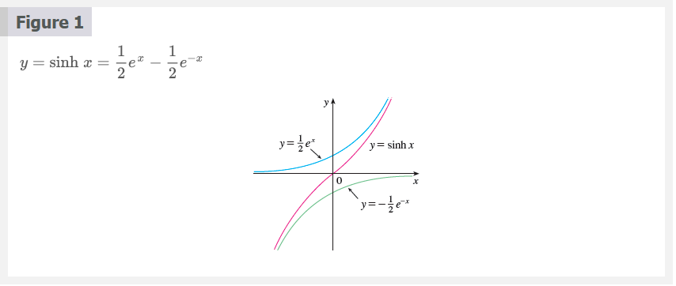
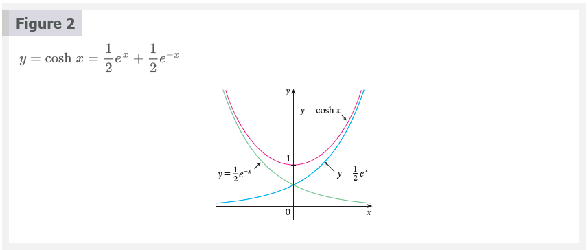

Note that sinh has domain $\mathbb{R}$ and range $\mathbb{R}$, while cosh has
domain $\mathbb{R}$ and range $[1, \infty)$. The graph of tanh is shown in
Figure 3. It has the horizontal asymptotes $y = \pm 1$.

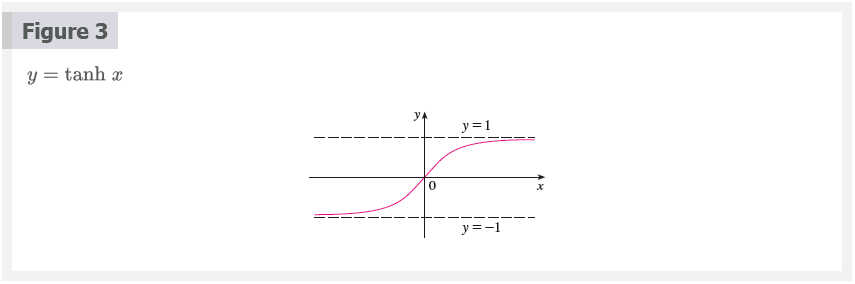

Some of the mathematical uses of hyperbolic functions will be seen in Chapter 7.
Applications to science and engineering occur whenever an entity such as light,
velocity, electricity, or radioactivity is gradually absorbed or extinguished,
for the decay can be represented by hyperbolic functions. The most famous
application is the use of hyperbolic cosine to describe the shape of a hanging
wire. It can be proved that if a heavy flexible cable (such as a telephone or
power line) is suspended between two points at the same height, then it takes
the shape of a curve with equation $y = c + a \cosh{(x/a)}$ called a catenary.
(The Latin word catena means "chain.")

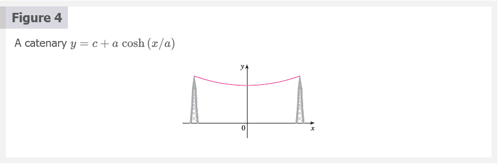

Another application of hyperbolic functions occurs in the description of ocean
waves: The velocity of a water wave with length $L$ moving across a body of
water with depth $d$ is modeled by the function

$$
v = \sqrt{\frac{gL}{2\pi} \tanh{\frac{2 \pi d}{L}}}
$$

where $g$ is the acceleration due to gravity.

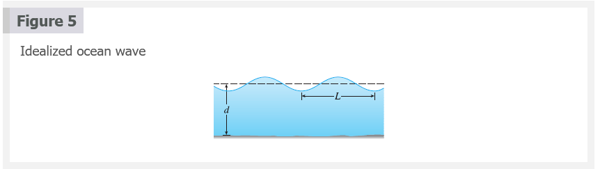

## Hyperbolic Identities

$$
\sinh{(-x)} = -\sinh{h} \\
\cosh{(-x)} = \cosh{x} \\
\cosh^{2}{x} - \sinh^{2}{x} = 1 \\
1 - \tanh^{2}{x} = \operatorname{sech}^{2}{x} \\
\sinh{(x + y)} = \sinh{x} \cosh{y} + \cosh{x} \sinh{y} \\
\cosh{(x + y)} = \cosh{x} \cosh{y} + \sinh{x} \sinh{y}
$$

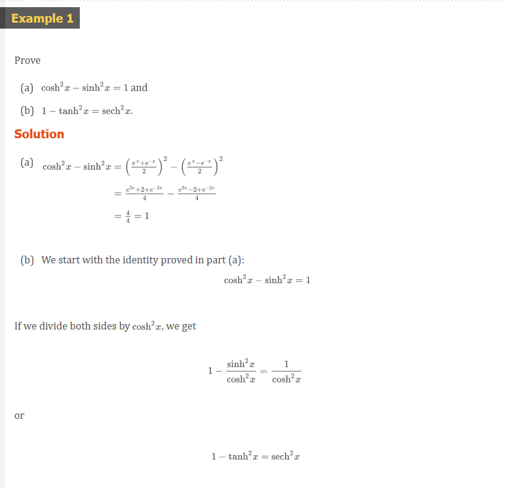

The identity proved in Example 1(a) gives a clue to the reason for the name
"hyperbolic" functions:

If $t$ is any real number, then the point $P(\cos{t}, \sin{t})$ lies on the unit
circle $x^{2} + y^{2} = 1$ because $\cos^{2}{t + \sin^{2}{t} = 1}$. In fact, $t$
can be interpreted as the radian measure of $\angle{POQ}$ in Figure 6. For this
reason the trigonometric functions are sometimes called _circular_ functions.

Likewise, if $t$ is any real number, then the point $P(\cosh{t}, \sinh{t})$ lies
on the right branch of the hyperbola $x^{2} - y^{2} = 1$ because $\cosh^{2}{t} -
\sinh^{2}{t} = 1$ and $\cosh{t} \ge 1$. This time, $t$ does not represent the
measure of an angle.  However, it turns out that $t$ represents twice the area
of the shaded hyperbolic sector in Figure 7, just as in the trigonometric case
$t$ represents twice the area of the shaded circular sector in Figure 6.

The derivatives of the hyperbolic functions are easily computed. For example,

$$
\frac{d}{dx}(\sinh{x}) = \frac{d}{dx}(\frac{e^{x} - e^{-x}}{2}) = \frac{e^{x} + e^{-x}}{2} = \cosh{x}
$$

## Derivatives of Hyperbolic Functions 1

$$
\begin{aligned}
\frac{d}{dx}(\sinh{x}) &= \cosh{x} \;\;\;\;\;\;\;\;\;\;\; \frac{d}{dx}(\operatorname{csch}{x}) = -\operatorname{csch}{x}\coth{x} \\
\frac{d}{dx}(\cosh{x}) &= \sinh{x} \;\;\;\;\;\;\;\;\;\;\; \frac{d}{dx}(\operatorname{sech}{x}) = -\operatorname{sech}{x}\tanh{x} \\
\frac{d}{dx}(\tanh{x}) &= \operatorname{sech}^{2}{x} \;\;\;\;\;\;\;\;\; \frac{d}{dx}(\coth{x}) = -\operatorname{csch}^{2}{x}
\end{aligned}
$$

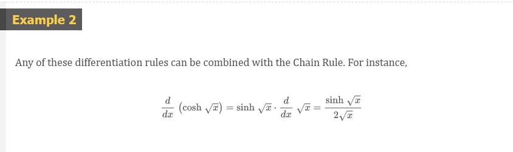

## Inverse Hyperbolic Functions 2

$$
\begin{aligned}
y = \sinh^{-1}{x} \; &\Leftrightarrow \; \sinh{y} = x \\
y = \cosh^{-1}{x} \; &\Leftrightarrow \; \cosh{y} = x \text{ and } y \ge 0 \\
y = \tanh^{-1}{x} \; &\Leftrightarrow \; \tanh{y} = x
\end{aligned}
$$

We can sketch the graphs of $\sinh^{-1}\$, $\cosh^{-1}$, $\tanh^{-1}$ and in
Figures 8, 9, and 10 by using Figures 1, 2, and 3.

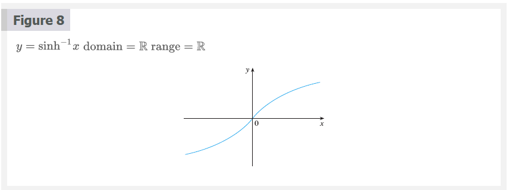
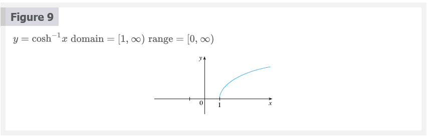
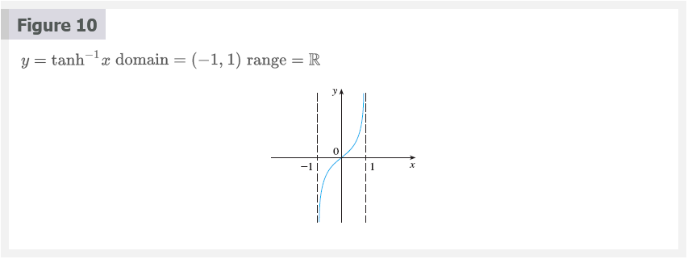

Since the hyperbolic functions are defined in terms of exponential functions,
it's not surprising to learn that the inverse hyperbolic functions can be
expressed in terms of logarithms. In particular, we have:

## Equation 3

$$
\sinh^{-1}{x} = \ln{(x + \sqrt{x^{2} + 1})} \;\;\; x \in \mathbb{R}
$$

## Equation 4

$$
\cosh^{-1}{x} = \ln{(x + \sqrt{x^{2} - 1})} \;\;\; x \ge 1
$$

## Equation 5

$$
\tanh^{-1}{x} = \frac{1}{2}\ln{(\frac{1 + x}{1 - x})} \;\;\; -1 < x < 1
$$

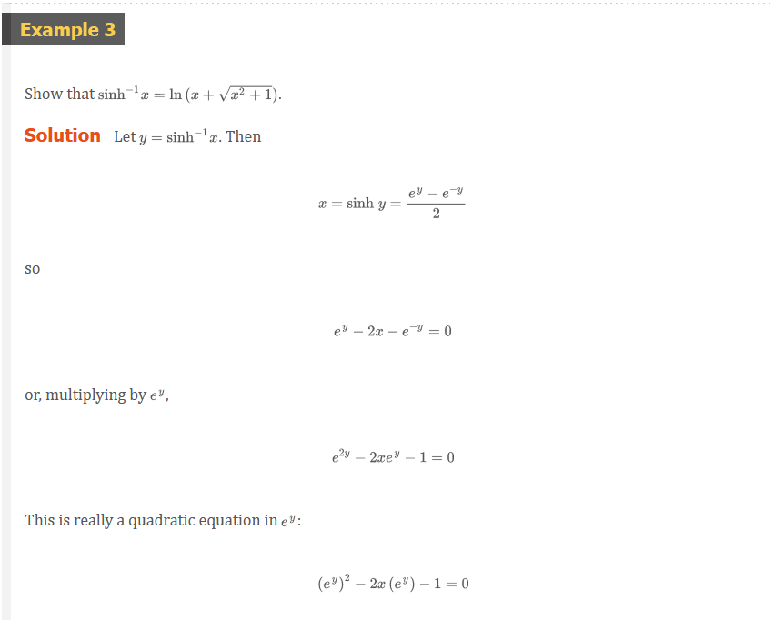
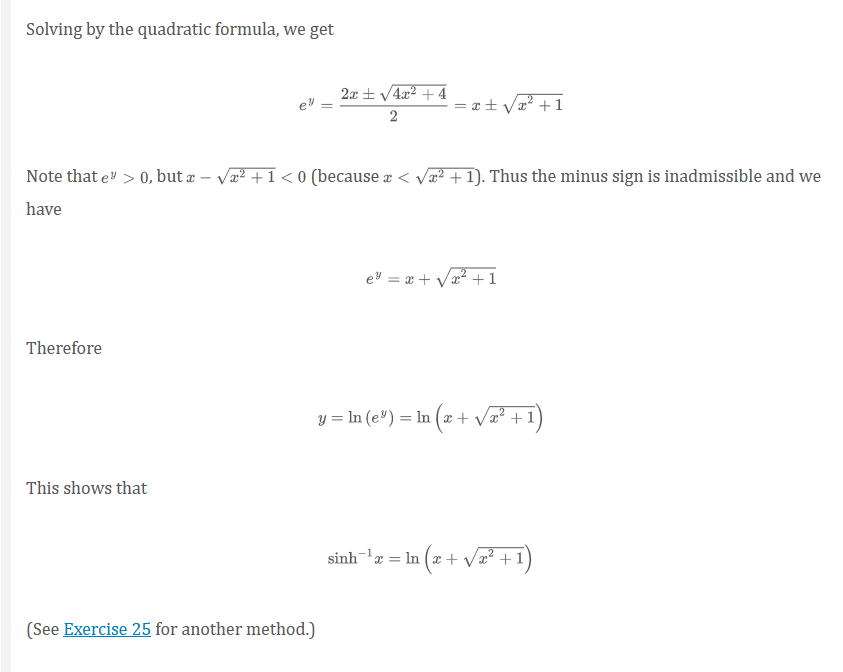

## Derivatives of Inverse Hyperbolic Functions 6

$$
\begin{aligned}
\frac{d}{dx}(\sinh^{-1}{x}) &= \frac{1}{\sqrt{1 + x^{2}}} \;\;\;\;\;\;\;\;\;\;\; \frac{d}{dx}(\operatorname{csch}^{-1}{x}) = -\frac{1}{\left | x \right |\sqrt{x^{2} + 1}} \\
\frac{d}{dx}(\cosh^{-1}{x}) &= \frac{1}{\sqrt{x^{2} - 1}} \;\;\;\;\;\;\;\;\;\;\; \frac{d}{dx}(\operatorname{sech}^{-1}{x}) = -\frac{1}{x\sqrt{1 - x^{2}}} \\
\frac{d}{dx}(\tanh^{-1}{x}) &= \frac{1}{1 - x^{2}} \;\;\;\;\;\;\;\;\;\;\;\;\;\; \frac{d}{dx}(\coth^{-1}{x}) = \frac{1}{1 - x^{2}}
\end{aligned}
$$

> **NOTE**

Notice that the formulas for the derivatives of $\tanh^{-1}{x}$ and
$\coth^{-1}{x}$ appear to be identical. But the domains of these functions have
no numbers in common: $\tanh^{-1}{x}$ is defined for $\left | x \right | < 1$,
$\coth^{-1}{x}$ whereas is defined for $\left | x \right | > 1$.

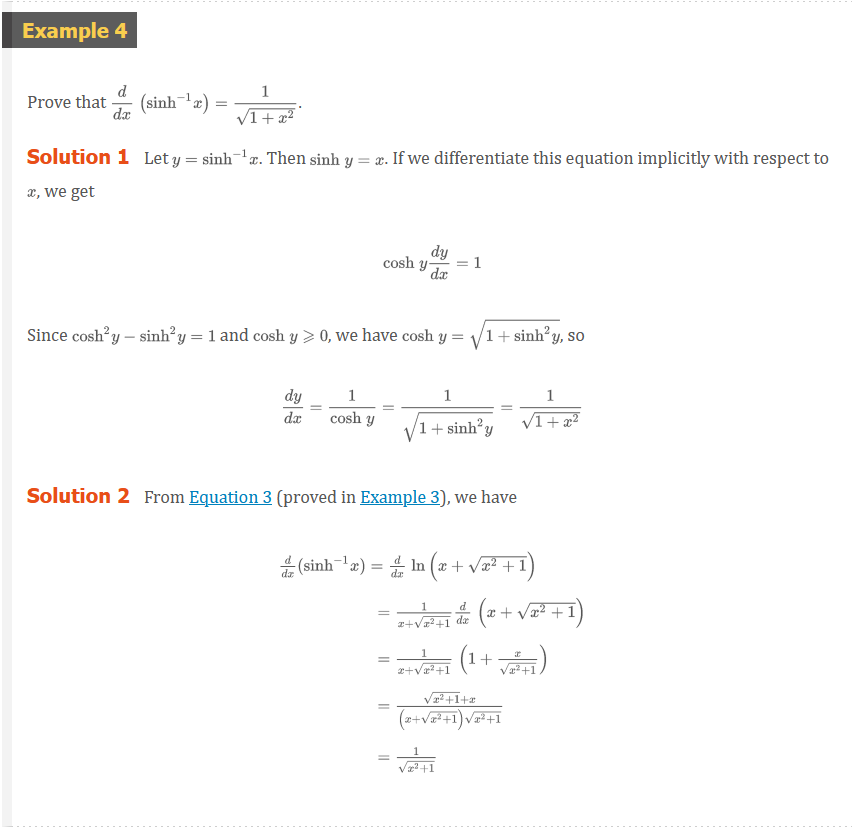
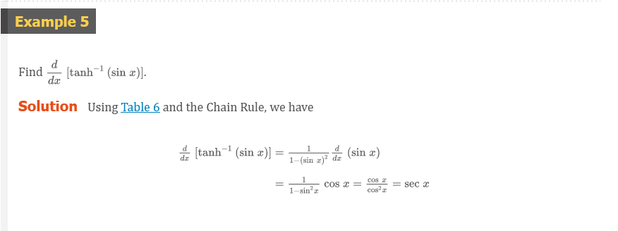

 

# Resources

Textbook

+ [📄 Cengage e-Textbook: Calculus Early Transcendentals, Eighth Edition, Stewart](https://webassign.com/)

