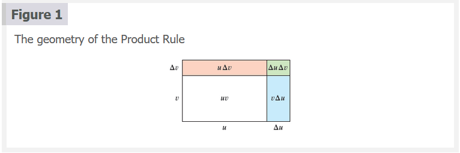
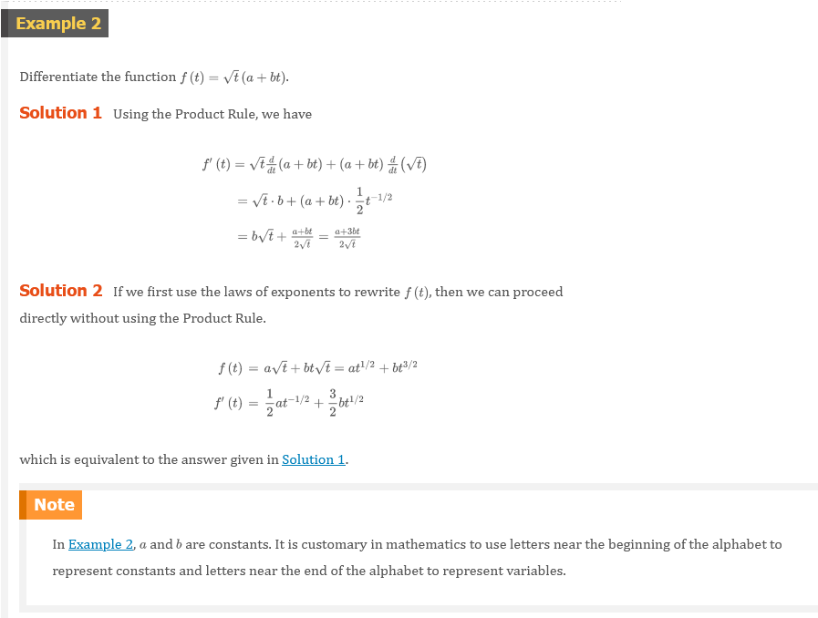
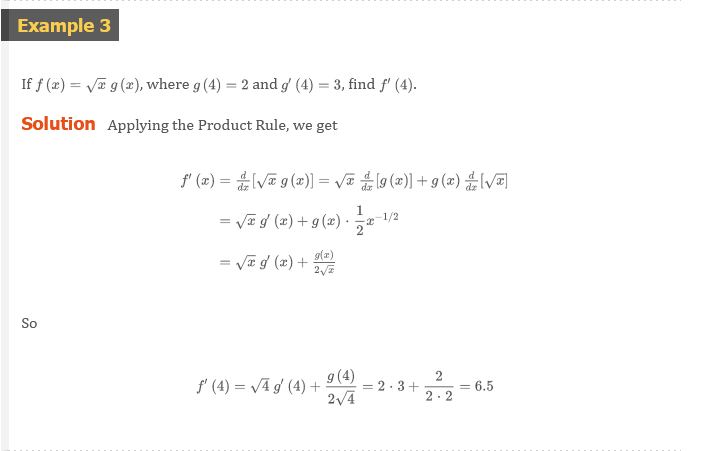

# Chapter 3.2: The Product and Quotient Rules

## The Product Rule

Before stating the Product Rule, let's see how we might discover it. We start by
assuming that $u = f(x)$ and $v = g(x)$ are both positive differentiable
functions. Then we can interpret the product $uv$ as an area of a rectangle (see
Figure 1). If changes by an amount $\Delta{x}$, then the corresponding changes in
$u$ and $v$ are

$$
\Delta{u} = f(x + \Delta{x}) - f(x) \;\;\; \Delta{v} = g(x + \Delta{x}) - g(x)
$$

and the new value of the product, $(u + \Delta{u})(v + \Delta{v}$, can be
interpreted as the area of the large rectangle in Figure 1 (provided that
$\Delta{u}$ and $\Delta{v}$ happen to be positive).

The change in the area of the rectangle is

### 1 Definition

$$
\begin{aligned}
\Delta{(uv)} & = (u + \Delta{u})(v + \Delta{v}) - uv = u\Delta{v} + v\Delta{u} + \Delta{u}\Delta{v} \\
             & = \text{The sum of the three shaded areas}
\end{aligned}
$$

If we divide by $\Delta{x}$, we get

$$
\frac{\Delta{(uv)}}{\Delta{x}} = u\frac{\Delta{v}}{\Delta{x}} + v\frac{\Delta{u}}{\Delta{x}} + \Delta{u}\frac{\Delta{v}}{\Delta{x}}
$$

If we not let $\Delta{x} \to 0$, we get the derivative of $uv$:

$$
\begin{aligned}
\frac{d}{dx}(uv) & = \lim_{x \to 0}\frac{\Delta{(uv)}}{\Delta{x}} = \lim_{x \to 0} \Bigl( u\frac{\Delta{v}}{\Delta{x}} + v\frac{\Delta{u}}{\Delta{x}} + \Delta{u}\frac{\Delta{v}}{\Delta{x}} \Bigr) \\
                 & = u\lim_{\Delta{x} \to 0}\frac{\Delta{v}}{\Delta{x}} + v\lim_{\Delta{x} \to 0}\frac{\Delta{u}}{\Delta{x}} + \Bigl( \lim_{\Delta{x} \to 0}\Delta{u} \Bigr)\Bigl( \lim_{\Delta{x} \to 0}\frac{\Delta{v}}{\Delta{x}} \Bigr) \\
                 & = u\frac{dv}{dx} + v\frac{du}{dx} + 0 \cdot \frac{dv}{dx} \\
\frac{d}{dx}(uv) & = u\frac{dv}{dx} + v\frac{du}{dx}
\end{aligned}
$$

> **NOTE**

Recall that in Leibniz notation the definition of a derivative can be written as

$$
\frac{dy}{dx} = \lim_{x \to 0}\frac{\Delta{y}}{\Delta{x}}
$$

(Notice that $\Delta{u} \to 0$ as $\Delta{x} \to 0$ since $f$ is differentiable
and therefore continuous).

### The Product Rule

If $f$ and $g$ are both differentiable, then

$$
\frac{d}{dx}[f(x)g(x)] = f(x)\frac{d}{dx}[g(x)] + g(x)\frac{d}{dx}[f(x)]
$$

> **NOTE**

In prime notation:

$$
(fg)^{\prime} = fg^{\prime} + gf^{\prime}
$$

## Quotient Rule

We find a rule for differentiating the quotient of two differentiable functions
$u = f(x)$ and $v = g(x)$ in much the same way that we found the Product Rule.
If $x$, $u$, and $v$ change by amounts $\Delta{x}$, $\Delta{u}$, and
$\Delta{v}$, then the corresponding change in the quotient $u/v$ is

$$
\Delta{\left ( \frac{u}{v} \right )} = \frac{u + \Delta{u}}{v + \Delta{v}} - \frac{u}{v} = \frac{(u + \Delta{u})v - u(v + \Delta{v})}{v(v + \Delta{v})}
$$

so

$$
\frac{d}{dx}\left ( \frac{u}{v} \right ) = \lim_{x \to 0}\frac{\Delta{(u/v)}}{\Delta{x}} =\lim_{x \to 0}\frac{v\dfrac{\Delta{u}}{\Delta{x}} - u\dfrac{\Delta{v}}{\Delta{x}}}{v(v + \Delta{v})}
$$

As $\Delta{x} \to 0$, $\Delta{v} \to 0$ also, because $v = g(x)$ is
differentiable and therefore continuous. Thus, using the Limit Laws, we get

$$
\frac{d}{dx}\left ( \frac{u}{v} \right ) = \frac{v\lim_{\Delta{x} \to 0}\dfrac{\Delta{u}}{\Delta{x}} - u\lim_{\Delta{x} \to 0}\dfrac{\Delta{v}}{\Delta{x}}}{v\lim_{\Delta{x} \to 0}(v + \Delta{v})} = \frac{v\dfrac{du}{dx} - u\dfrac{dv}{dx}}{v^{2}}
$$

### The Quotient Rule

If $f$ and $g$ are differentiable, then

$$
\frac{d}{dx}\left [ \frac{f(x)}{g(x)} \right ] = \frac{g(x)\dfrac{d}{dx}[f(x)] - f(x)\dfrac{d}{dx}[g(x)]}{[g(x)]^{2}}
$$

> **NOTE**

In prime notation:

$$
\left ( \frac{f}{g} \right )^{\prime} = \frac{gf^{\prime} - fg^{\prime}}{g^{2}}
$$

> **NOTE**

Don't use the Quotation Rule **every** time you see a quotient. Sometimes it's
easier to rewrite a quotient first to put it in a form that is simpler for the
purpose of differentiation. For instance, although it is possible to
differentiate the function

$$
F(x) = \frac{3x^{2} + 2\sqrt{x}}{x}
$$

using the Quotient Rule, it is much easier to perform the division first and
write the function as

$$
F(x) = 3x + 2x^{-1/2}
$$

before differentiating.

We summarize the differentiation formulas we have learned so far as follows.

# Video Lectures

- [🎬 Derivatives of $\sin{x}$ and $\cos{x}$](https://www.khanacademy.org/math/ap-calculus-ab/ab-differentiation-1-new/ab-2-7/v/derivatives-of-sinx-and-cosx)
- [🎬 Worked example: Derivatives of $\sin{x}$ and $\cos(x)$](https://www.khanacademy.org/math/ap-calculus-ab/ab-differentiation-1-new/ab-2-7/v/sine-and-cosine-differentiation)
- [🎬 Derivative of $e^{x}$](https://www.khanacademy.org/math/ap-calculus-ab/ab-differentiation-1-new/ab-2-7/v/derivative-of-ex)
- [🎬 Derivative of $ln(x)$](https://www.khanacademy.org/math/ap-calculus-ab/ab-differentiation-1-new/ab-2-7/v/derivative-of-lnx)
- [🎬 Product rule](https://www.khanacademy.org/math/ap-calculus-ab/ab-differentiation-1-new/ab-2-8/v/applying-the-product-rule-for-derivatives)
- [🎬 Differentiating products](https://www.khanacademy.org/math/ap-calculus-ab/ab-differentiation-1-new/ab-2-8/v/differentiating-products)
- [🌎 Product rule review](https://www.khanacademy.org/math/ap-calculus-ab/ab-differentiation-1-new/ab-2-8/a/product-rule-review)
- [🎬 Quotient rule](https://www.khanacademy.org/math/ap-calculus-ab/ab-differentiation-1-new/ab-2-9/v/quotient-rule)
- [🎬 Differentiating rational functions](https://www.khanacademy.org/math/ap-calculus-ab/ab-differentiation-1-new/ab-2-9/v/rational-functions-differentiation)
- [🌎 Quotient rule review](https://www.khanacademy.org/math/ap-calculus-ab/ab-differentiation-1-new/ab-2-9/a/quotient-rule-review)

 

# Resources

- [🎬 Derivatives of $\sin{x}$ and $\cos{x}$](https://www.khanacademy.org/math/ap-calculus-ab/ab-differentiation-1-new/ab-2-7/v/derivatives-of-sinx-and-cosx)
- [🎬 Worked example: Derivatives of $\sin{x}$ and $\cos(x)$](https://www.khanacademy.org/math/ap-calculus-ab/ab-differentiation-1-new/ab-2-7/v/sine-and-cosine-differentiation)
- [🎬 Derivative of $e^{x}$](https://www.khanacademy.org/math/ap-calculus-ab/ab-differentiation-1-new/ab-2-7/v/derivative-of-ex)
- [🎬 Derivative of $ln(x)$](https://www.khanacademy.org/math/ap-calculus-ab/ab-differentiation-1-new/ab-2-7/v/derivative-of-lnx)
- [🎬 Product rule](https://www.khanacademy.org/math/ap-calculus-ab/ab-differentiation-1-new/ab-2-8/v/applying-the-product-rule-for-derivatives)
- [🎬 Differentiating products](https://www.khanacademy.org/math/ap-calculus-ab/ab-differentiation-1-new/ab-2-8/v/differentiating-products)
- [🌎 Product rule review](https://www.khanacademy.org/math/ap-calculus-ab/ab-differentiation-1-new/ab-2-8/a/product-rule-review)
- [🎬 Quotient rule](https://www.khanacademy.org/math/ap-calculus-ab/ab-differentiation-1-new/ab-2-9/v/quotient-rule)
- [🎬 Differentiating rational functions](https://www.khanacademy.org/math/ap-calculus-ab/ab-differentiation-1-new/ab-2-9/v/rational-functions-differentiation)
- [🌎 Quotient rule review](https://www.khanacademy.org/math/ap-calculus-ab/ab-differentiation-1-new/ab-2-9/a/quotient-rule-review)

