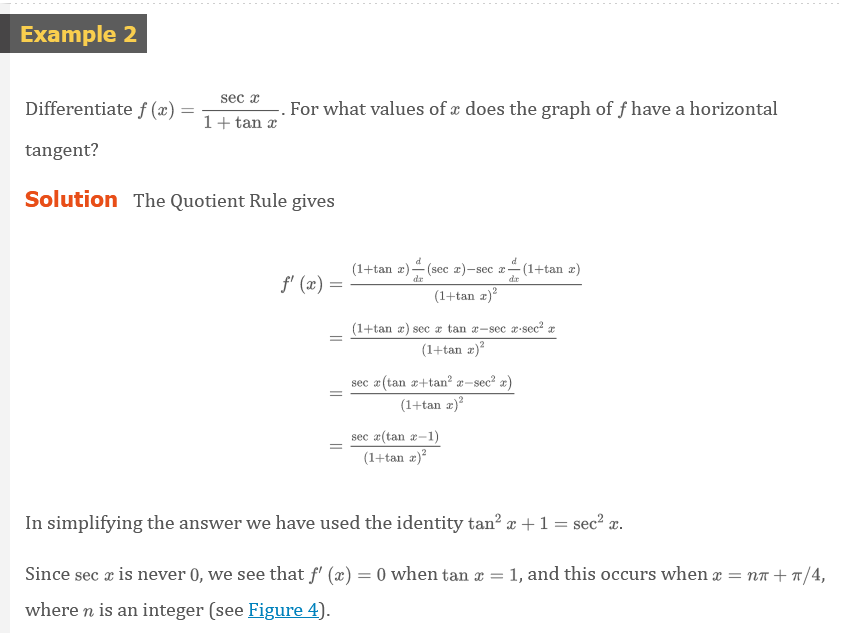
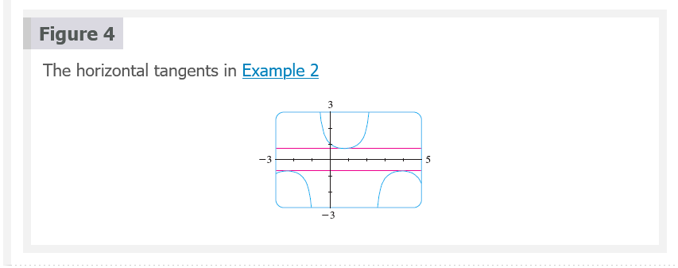
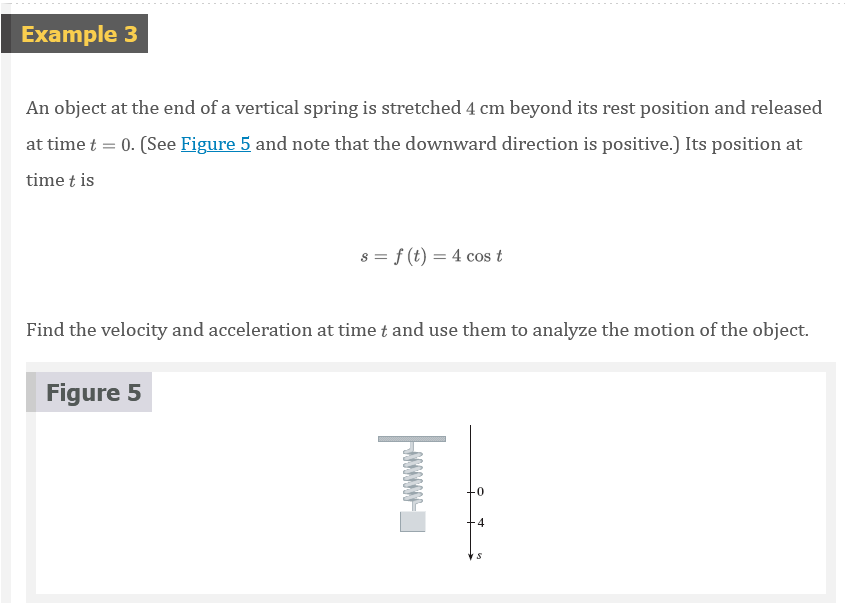
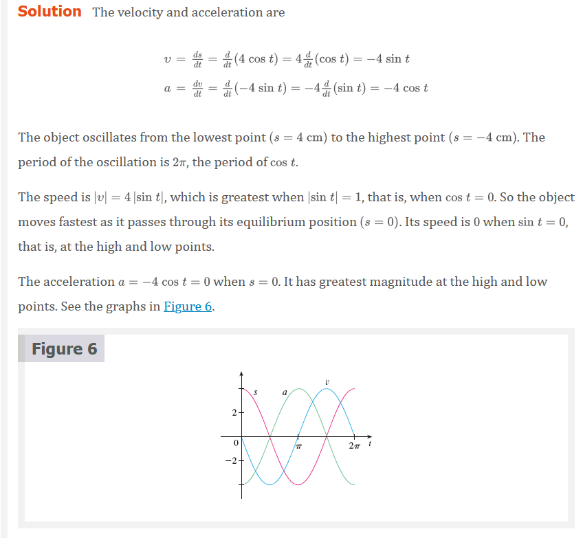
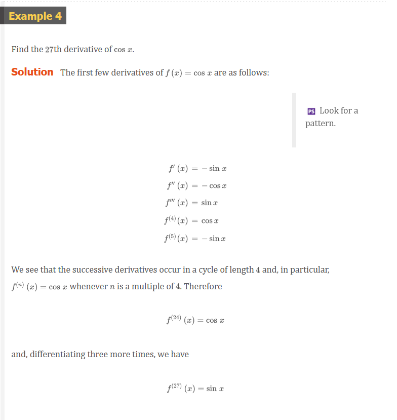
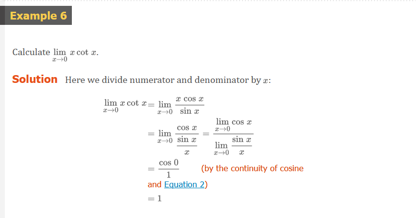

# Chapter 3.3: Derivatives of Trigonometric Functions

Let's try to confirm our guess that if $f(x) = \sin{x}$, then $f^{\prime}(x) =
\cos{x}$. From the definition of a derivative, we have

## Equation 1

$$
\begin{aligned}
f^{\prime}(x) & = \lim_{h \to 0}\frac{f(x + h) - f(x)}{h} = \lim_{h \to 0}\frac{\sin{(x + h)} - \sin{x}}{h} \\
              & = \lim_{h \to 0}\frac{\sin{x}\cos{h} + \cos{x}\sin{h} - \sin{x}}{h} \\
              & = \lim_{h \to 0}\left [ \frac{\sin{x}\cos{h} - \sin{x}}{h} + \frac{\cos{x}\sin{h}}{h} \right ] \\
              & = \lim_{h \to 0}\left [ \sin{x}\left ( \frac{\cos{h} - 1}{h} \right ) + \cos{x}\left ( \frac{\sin{h}}{h}\right ) \right ] \\
              & = \lim_{h \to 0}\sin{x} \cdot \lim_{h \to 0}\frac{\cos{h} - 1}{h} + \lim_{h \to 0}\cos{x} \cdot \lim_{h \to 0}\frac{\sin{h}}{h}
\end{aligned}
$$

## Equation 2

$$
\lim_{\theta \to 0}\frac{\sin{\theta}}{\theta} = 1
$$

We noe use a geometric argument to prove Equation 2. Assume first that $\theta$
lies between $0$ and $\pi/2$. Figure 2(a) shows a sector of a circle with center
$O$, central angle $\theta$, and radius $1$. $BC$ is drawn perpendicular to
$OA$. By the definition of radian measure, we have arc $AB = \theta$. Also $|BC|
= |OB|\sin{\theta} = \sin{\theta}$. From the diagram we see that

$$
|BC| < |AB| < \text{ arc } AB
$$

Therefore

$$
\sin{\theta} < \theta
$$

so

$$
\frac{\sin{\theta}}{\theta} < 1
$$

Let the tangent lines at $A$ and $B$ intersect at $E$. You can see from Figure
2(b) that the circumference of a circle is smaller than the length of a
circumscribed polygon, and so arc $AB < |AE| + |EB|$. Thus

$$
\begin{aligned}
\theta = \text{ arc } AB &< |AE| + |EB| \\
 &< |AE| + |ED| \\
 &= |AD| = |OA|\tan{\theta} \\
 &= \tan{\theta}
\end{aligned}
$$

(In Appendix F the inequality $\theta \le \tan{\theta}$ is proved directly from
the definition of the length of an arc without resorting to geometric intuition
as we did here.) Therefore we have

$$
\theta < \frac{\sin{\theta}}{\cos{\theta}}
$$

so

$$
\cos{\theta} < \frac{\sin{\theta}}{\theta} < 1
$$

We know that $\lim_{\theta \to 0}1 = 1$ and $\lim_{\theta \to 0}\cos{\theta} =
1$, so by the Squeeze Theorem, we have

$$
\lim_{\theta \to 0^{+}}\frac{\sin{\theta}}{\theta} = 1
$$

But the function $(\sin{\theta})/\theta$ is an even function, so its right and
left limits must be equal. Hence, we have

$$
\lim_{\theta \to 0}\frac{\sin{\theta}}{\theta} = 1
$$

so we have proved Equation 2.

We can deduce the value of the remaining limit in (1) as follows:

$$
\begin{aligned}
\lim_{\theta \to 0}\frac{\cos{\theta} - 1}{\theta} &= \lim_{\theta \to 0}\left ( \frac{\cos{\theta} - 1}{\theta} \cdot \frac{\cos{\theta} + 1}{\cos{\theta} + 1} = \lim_{\theta \to 0}\frac{\cos^{2}{\theta} - 1}{\theta(\cos{\theta} + 1)} \right ) \\
 &= \lim_{\theta \to 0}\frac{-\sin^{2}{\theta}}{\theta(\cos{\theta} + 1)} = -\lim_{\theta \to 0}\left ( \frac{\sin{\theta}}{\theta} \cdot \frac{\sin{\theta}}{\cos{\theta} + 1} \right ) \\
 &= -\lim_{\theta \to 0}\frac{\sin{\theta}}{\theta} \cdot \lim_{\theta \to 0}\frac{\sin{\theta}}{\cos{\theta} + 1} \\
 &= -1 \cdot \left ( \frac{0}{1 + 1} \right ) = 0 \;\;\; \text{(by Equation 2)}
\end{aligned}
$$

## Equation 3

$$
\lim_{\theta \to 0}\frac{\cos{\theta} - 1}{\theta} = 0
$$

> **NOTE**

If we now put the limit in equation (2) and (3) in (1), we get

$$
\begin{aligned}
f^{\prime} & = \lim_{h \to 0}\sin{x} \cdot \lim_{h \to 0}\frac{\cos{h} - 1}{h} + \lim_{h \to 0}\cos{x} \cdot \lim_{h \to 0}\frac{\sin{h}}{h} \\
           & = (\sin{x}) \cdot 0 + (\cos{x}) \cdot 1 = \cos{x}
\end{aligned}
$$

So we have proved the formula for the derivative of the sine function:

## Equation 4

$$
\frac{d}{dx}(\sin{x}) = \cos{x}
$$

## Equation 5

$$
\frac{d}{dx}(\cos{x}) = -\sin{x}
$$

The tangent function can also be differentiated by using the definition of a
derivative, but it is easier to use the Quotient Rule together with Formula 4
and Equation 4 and Equation 5:

$$
\begin{aligned}
\frac{d}{dx}(\tan{x}) &= \frac{d}{dx}(\frac{\sin{x}}{\cos{x}}) \\
 &= \frac{\cos{x}\frac{d}{dx}(\sin{x})-\sin{x}\frac{d}{dx}(\cos{x})}{\cos^{2}{x}} \\
 &= \frac{\cos{x} \cdot \cos{x}-\sin{x}(-\sin{x})}{\cos^{2}{x}} \\
 &= \frac{\cos^{2}{x} + \sin^{2}{x}}{\cos^{2}{x}} \\
 &= \frac{1}{\cos^{2}{x}} = \sec^{2}{x}
\end{aligned}
$$

## Equation 6

$$
\frac{d}{dx}(\tan{x}) = \sec^{2}{x}
$$

## Derivatives of Trigonometric Functions

$$
\begin{aligned}
\frac{d}{dx}(\sin{x}) &= \cos{x} \;\;\;\;\;\;\;\;\;\;\; \frac{d}{dx}(\csc{x}) = -\csc{x}\cot{x} \\
\frac{d}{dx}(\cos{x}) &= -\sin{x} \;\;\;\;\;\;\;\; \frac{d}{dx}(\sec{x}) = \sec{x}\tan{x} \\
\frac{d}{dx}(\tan{x}) &= \sec^{2}{x} \;\;\;\;\;\;\;\;\; \frac{d}{dx}(\cot{x}) = -\csc^{2}{x}
\end{aligned}
$$

# Video Lectures

- [🎬 Derivatives of $\tan{x}$ and $\cot{x}$](https://www.khanacademy.org/math/ap-calculus-ab/ab-differentiation-1-new/ab-2-10/v/derivatives-of-tanx-and-cotx)
- [🎬 Derivatives of $\sec{x}$ and $\csc{x}$](https://www.khanacademy.org/math/ap-calculus-ab/ab-differentiation-1-new/ab-2-10/v/derivatives-of-secx-and-cscx)

 

# Resources

- [🎬 Derivatives of $\tan{x}$ and $\cot{x}$](https://www.khanacademy.org/math/ap-calculus-ab/ab-differentiation-1-new/ab-2-10/v/derivatives-of-tanx-and-cotx)
- [🎬 Derivatives of $\sec{x}$ and $\csc{x}$](https://www.khanacademy.org/math/ap-calculus-ab/ab-differentiation-1-new/ab-2-10/v/derivatives-of-secx-and-cscx)

