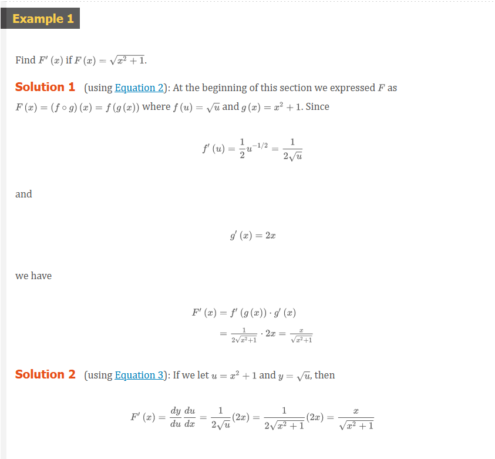
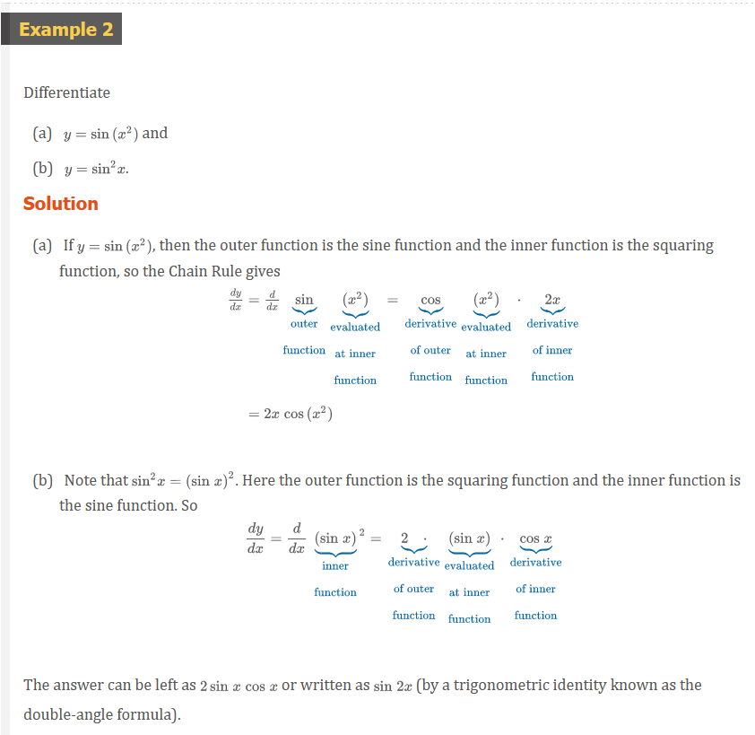
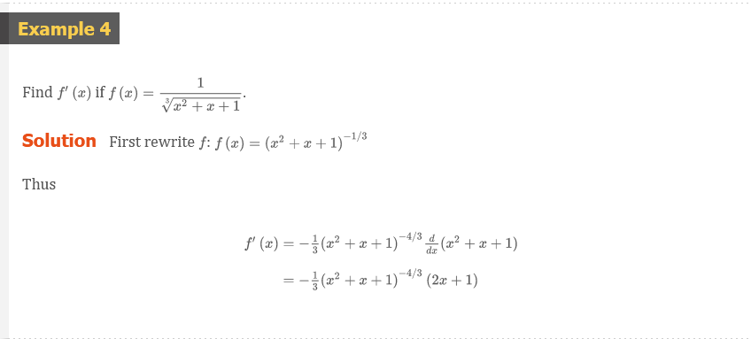
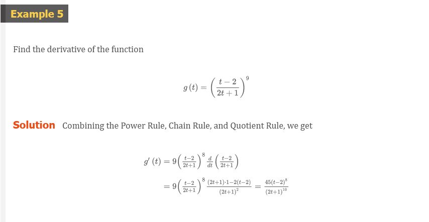
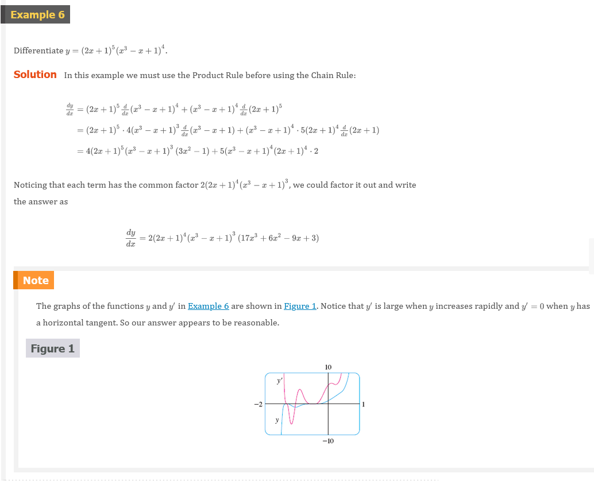
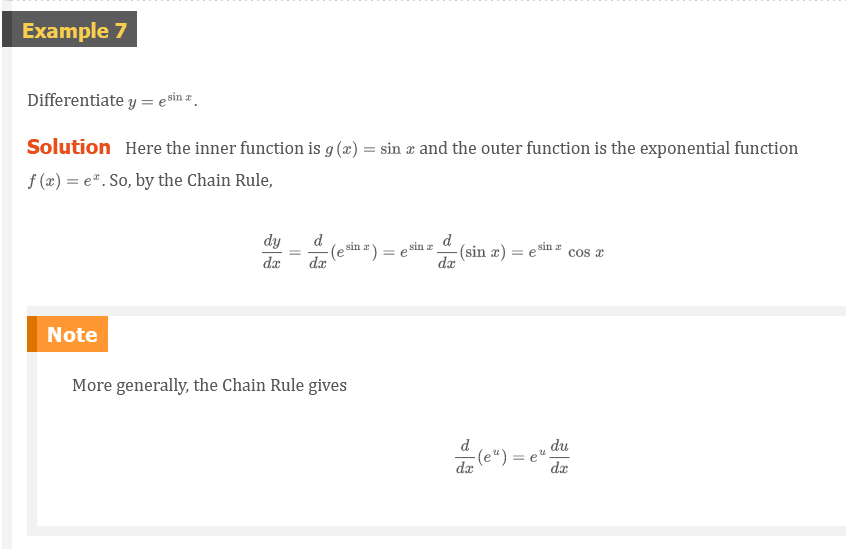
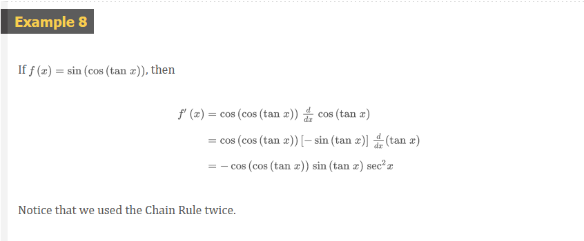
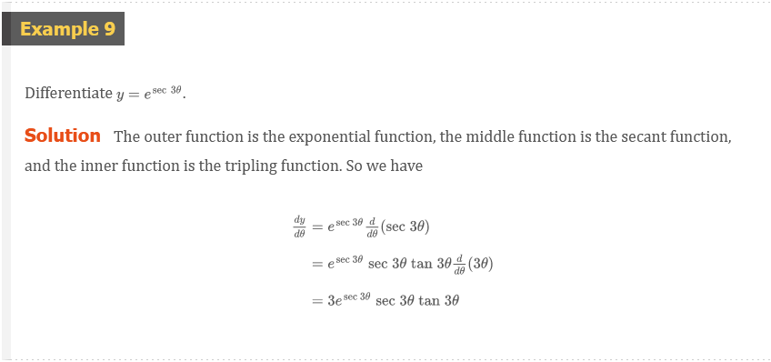
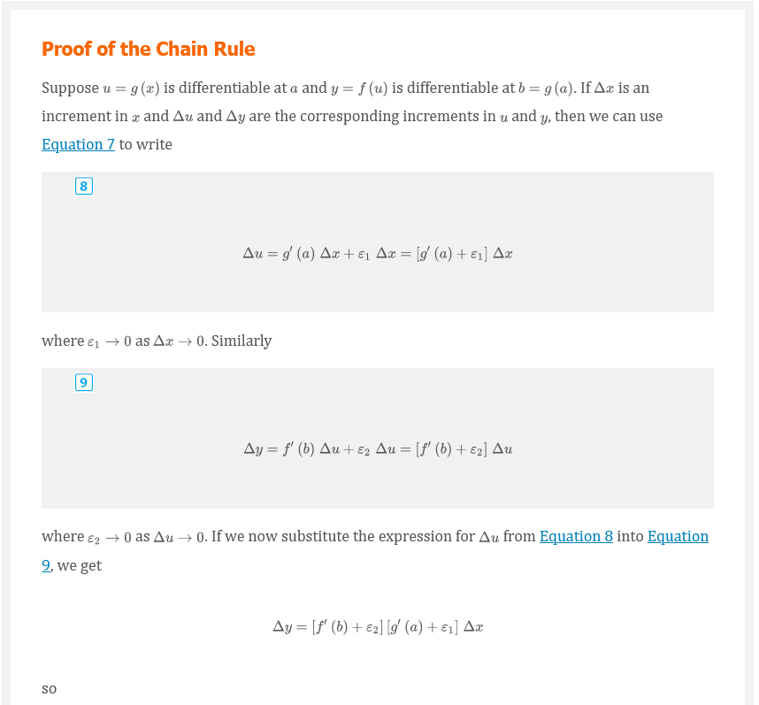
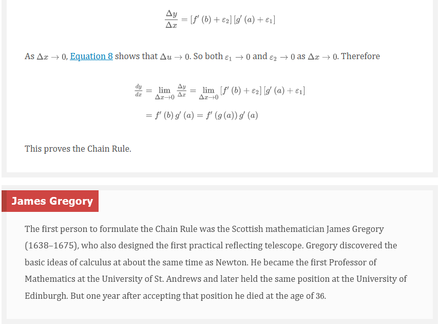

# Chapter 3.4: The Chain Rule

Suppose you are asked to differentiate the function

$$
F(x) = \sqrt{x^{2} + 1}
$$

The differentiation formulas you learned in the previous sections of this
chapter do not enable you to calculate .

Observe that $F$ is a composite function. In fact, if we let $y = f(u) =
\sqrt{u}$ and let $u = g(x) = x^{2} + 1$, then we can write $y = F(x) =
f(g(x))$, that is, $F = f \circ g$. We know how to differentiate both $f$ and
$g$, so it would be useful to have a rule that tells us how to find the
derivative of $F = f \circ g$ in terms of the derivatives of $f$ and $g$.

It turns out that the derivative of the composite function $f \circ g$ is the
product of the derivatives of $f$ and $g$. This fact is one of the most
important of the differentiation rules and is called the Chain Rule. It seems
plausible if we interpret derivatives as rates of change. Regard $du/dx$ as the
rate of change of $u$ with respect to $x$, $dy/du$ as the rate of change of $y$
with respect to $u$, $dy/dx$ and as the rate of change of $y$ with respect to
$x$. If $u$ changes twice as fast as $x$ and $y$ changes three times as fast as
$u$, then it seems reasonable that $y$ changes six times as fast as $x$, and so
we expect that

$$
\frac{dy}{dx} = \frac{dy}{du}\frac{du}{dx}
$$

## The Chain Rule

If $g$ is differentiable at $x$ and $f$ is differentiable at $g(x)$, then the
composite function $f = f \circ g$ defined by $F(x) = f(g(x))$ is differentiable
at $x$ and $F^{\prime}$ is given by the product

$$
F^{\prime}(x) = f^{\prime}(g(x)) \cdot g^{\prime}(x)
$$

In Leibniz notation, if $y = f(u)$ and $u = g(x)$ are both differentiable
functions, then

$$
\frac{dy}{dx} = \frac{dy}{du}\frac{du}{dx}
$$

> Comments on the Proof of the Chain Rule

Let $\Delta{u}$ be the change in $u$ corresponding to a change of $\Delta{x}$ in
$x$, that is,

$$
\Delta{u} = g(x + \Delta{x}) - g(x)
$$

Then the corresponding change in $y$ is

$$
\Delta{y} = f(u + \Delta{u}) - f(u)
$$

It is tempting to write

## Formula 1

$$
\begin{aligned}
\frac{dy}{dx} & = \lim_{x \to 0}\frac{\Delta{y}}{\Delta{x}} \\
              & = \lim_{x \to 0}\frac{\Delta{y}}{\Delta{u}} \cdot \frac{\Delta{u}}{\Delta{x}} \\
              & = \lim_{x \to 0}\frac{\Delta{y}}{\Delta{u}} \cdot \lim_{x \to 0}\frac{\Delta{u}}{\Delta{x}} \\
              & = \lim_{u \to 0}\frac{\Delta{y}}{\Delta{u}} \cdot \lim_{x \to 0}\frac{\Delta{u}}{\Delta{x}} \\
              & = \frac{dy}{du}\frac{du}{dx}
\end{aligned}
$$

The Chain Rule can be written either in the prime notation

## Formula 2

$$
(f \circ g)^{\prime}(x) = f^{\prime}(g(x)) \cdot g^{\prime}(x)
$$

or, if $y = f(u)$ and $u = g(x)$, in Leibniz notation:

## Formula 3

$$
\frac{dy}{dx} = \frac{dy}{du}\frac{du}{dx}
$$

In Example 2(a) we combined the Chain Rule with the rule for differentiating
sine function. In general, if $y = \sin{u}$, where $u$ is a differentiable
function of $x$, then, by the Chain Rule,

$$
\frac{dy}{dx} = \frac{dy}{du}\frac{du}{dx} = \cos{u}\frac{du}{dx}
$$

Thus

$$
\frac{d}{dx}(\sin{u}) = \cos{u}\frac{du}{dx}
$$

In a similar fashion, all of the formulas for differentiating trigonometric
functions can be combined with the Chain Rule.

Let's make explicit the special case of the Chain Rule where the outer function
$f$ is a power function. If $y = [g(x)]^{n}$, then we can write $y = f(u) =
u^{n}$ where $u = g(x)$. By using the Chain Rule and then the Power Rule, we get

$$
\frac{dy}{dx} = \frac{dy}{du}\frac{du}{dx} = nu^{n - 1}\frac{du}{dx} = n[g(x)]^{n - 1}g^{\prime}(x)
$$

## Formula 4: The Power Rule Combined with the Chain Rule

If $n$ is any real number and $u = g(x)$ is differentiable, then

$$
\frac{d}{dx}(u^{n}) = nu^{n - 1}\frac{du}{dx}
$$

Alternatively,

$$
\frac{d}{dx}[g(x)]^{n} = n[g(x)]^{n - 1} \cdot g^{\prime}(x)
$$

We can use the Chain Rule to differentiate an exponential function with any base
$b > 0$.

$$
b^{x} = (e^{\ln{b}})^{} = e^{(\ln{b})x}
$$

and the Chain Rule gives

$$
\begin{aligned}
\frac{d}{dx}(b^{x}) & = \frac{d}{dx}(e^{(\ln{b}})x)\frac{d}{dx}(\ln{b})x \\
                    & = e^{(\ln{b})x} \cdot \ln{b} = b^{x}\ln{b}
\end{aligned}
$$

because $\ln{b}$ is a constant. So we have the formula

## Formula 5

$$
\frac{d}{dx}(b^{x}) = b^{x}\ln{b}
$$

In particular, if $b = 2$, we get

$$
\frac{d}{dx}(2^{x}) = 2^{x}\ln{2}
$$

## How to Prove the Chain Rule

Recall that if $y = f(x)$ and $x$ changes from $a$ to $a + \Delta{x}$, we define
the increment of $y$ as

$$
\Delta{y} = f(a + \Delta{x}) - f(a)
$$

According to the definition of a derivative, we have

$$
\lim_{\Delta{x} \to 0}\frac{\Delta{y}}{\Delta{x}} = f^{\prime}(a)
$$

So if we denote by $\varepsilon$ the difference between the difference quotient
and the derivative, we obtain

$$
\lim_{\Delta{x} \to 0}\varepsilon = \lim_{x \to 0}\left ( \frac{\Delta{y}}{\Delta{x}} - f^{\prime}(a) \right ) = f^{\prime}(a) - f^{\prime}(a) = 0
$$

But

$$
\varepsilon = \frac{\Delta{y}}{\Delta{x}} - f^{\prime}(a) \implies \Delta{y} = f^{\prime}(a)\Delta{x} + \varepsilon\Delta{x}
$$

If we define $\varepsilon$ to be $0$ when $\Delta{x} = 0$, then $\varepsilon$
becomes a continuous function of $\Delta{x}$. Thus, for a differentiable
function $f$, we can write

## Formula 7

$$
\Delta{y} = f^{\prime}(a)\Delta{x} + \varepsilon\Delta{x} \;\;\; \text{where} \;\;\; \varepsilon \to 0 \text{ as } \Delta{x} \to 0
$$

## Video Lectures

- [🎬 Chain Rule](https://www.khanacademy.org/math/ap-calculus-ab/ab-differentiation-2-new/ab-3-1a/v/chain-rule-introduction)
- [🎬 Common chain rule misunderstanding](https://www.khanacademy.org/math/ap-calculus-ab/ab-differentiation-2-new/ab-3-1a/v/common-chain-rule-misunderstandings)
- [🎬 Identifying composite functions](https://www.khanacademy.org/math/ap-calculus-ab/ab-differentiation-2-new/ab-3-1a/v/recognizing-compositions-of-functions)
- [🎬 Worked example: Derivative of $\cos^{3}{x}$ using the chain rule](https://www.khanacademy.org/math/ap-calculus-ab/ab-differentiation-2-new/ab-3-1a/v/differentiating-composite-functions-1)
- [🎬 Worked example: Derivative of $\sqrt{3x^{2} - x}$ using the chain rule](https://www.khanacademy.org/math/ap-calculus-ab/ab-differentiation-2-new/ab-3-1a/v/chain-rule-definition-and-example)
- [🎬 Worked example: Derivative of $\ln{\sqrt{x}}$ using the chain rule](https://www.khanacademy.org/math/ap-calculus-ab/ab-differentiation-2-new/ab-3-1a/v/differentiating-composite-functions-2)
- [🎬 Worked example: Chain rule with table](https://www.khanacademy.org/math/ap-calculus-ab/ab-differentiation-2-new/ab-3-1b/v/chain-rule-example-implicit)
- [🎬 Derivative of $a^{x}$ (for any positive base $a$)](https://www.khanacademy.org/math/ap-calculus-ab/ab-differentiation-2-new/ab-3-1b/v/exponential-functions-differentiation-intro)
- [🎬 Derivative of $\log_{a}x$ (for any positive base $a \neq 1$)](https://www.khanacademy.org/math/ap-calculus-ab/ab-differentiation-2-new/ab-3-1b/v/logarithmic-functions-differentiation-intro)
- [🎬 Worked example: Derivative of $7^{(x^{2} - x)}$ using the chain rule](https://www.khanacademy.org/math/ap-calculus-ab/ab-differentiation-2-new/ab-3-1b/v/exponential-functions-differentiation)
- [🎬 Worked example: Derivative of $\log_{4}(x^{2} + x)$ using the chain rule](https://www.khanacademy.org/math/ap-calculus-ab/ab-differentiation-2-new/ab-3-1b/v/log-functions-differentiation)
- [🎬 Worked example: Derivative of $\sec{\frac{3\pi}{2 - x}}$ using the chain rule](https://www.khanacademy.org/math/ap-calculus-ab/ab-differentiation-2-new/ab-3-1b/v/trig-functions-differentiation-sec)
- [🎬 Worked example: Derivative of $\sqrt[4]{x^{3} + 4x^{2} + 7}$](https://www.khanacademy.org/math/ap-calculus-ab/ab-differentiation-2-new/ab-3-1b/v/radical-functions-differentiation)

 

# Resources

- [🎬 Chain Rule](https://www.khanacademy.org/math/ap-calculus-ab/ab-differentiation-2-new/ab-3-1a/v/chain-rule-introduction)
- [🎬 Common chain rule misunderstanding](https://www.khanacademy.org/math/ap-calculus-ab/ab-differentiation-2-new/ab-3-1a/v/common-chain-rule-misunderstandings)
- [🎬 Identifying composite functions](https://www.khanacademy.org/math/ap-calculus-ab/ab-differentiation-2-new/ab-3-1a/v/recognizing-compositions-of-functions)
- [🎬 Worked example: Derivative of $\cos^{3}{x}$ using the chain rule](https://www.khanacademy.org/math/ap-calculus-ab/ab-differentiation-2-new/ab-3-1a/v/differentiating-composite-functions-1)
- [🎬 Worked example: Derivative of $\sqrt{3x^{2} - x}$ using the chain rule](https://www.khanacademy.org/math/ap-calculus-ab/ab-differentiation-2-new/ab-3-1a/v/chain-rule-definition-and-example)
- [🎬 Worked example: Derivative of $\ln{\sqrt{x}}$ using the chain rule](https://www.khanacademy.org/math/ap-calculus-ab/ab-differentiation-2-new/ab-3-1a/v/differentiating-composite-functions-2)
- [🎬 Worked example: Chain rule with table](https://www.khanacademy.org/math/ap-calculus-ab/ab-differentiation-2-new/ab-3-1b/v/chain-rule-example-implicit)
- [🎬 Derivative of $a^{x}$ (for any positive base $a$)](https://www.khanacademy.org/math/ap-calculus-ab/ab-differentiation-2-new/ab-3-1b/v/exponential-functions-differentiation-intro)
- [🎬 Derivative of $\log_{a}x$ (for any positive base $a \neq 1$)](https://www.khanacademy.org/math/ap-calculus-ab/ab-differentiation-2-new/ab-3-1b/v/logarithmic-functions-differentiation-intro)
- [🎬 Worked example: Derivative of $7^{(x^{2} - x)}$ using the chain rule](https://www.khanacademy.org/math/ap-calculus-ab/ab-differentiation-2-new/ab-3-1b/v/exponential-functions-differentiation)
- [🎬 Worked example: Derivative of $\log_{4}(x^{2} + x)$ using the chain rule](https://www.khanacademy.org/math/ap-calculus-ab/ab-differentiation-2-new/ab-3-1b/v/log-functions-differentiation)
- [🎬 Worked example: Derivative of $\sec{\frac{3\pi}{2 - x}}$ using the chain rule](https://www.khanacademy.org/math/ap-calculus-ab/ab-differentiation-2-new/ab-3-1b/v/trig-functions-differentiation-sec)
- [🎬 Worked example: Derivative of $\sqrt[4]{x^{3} + 4x^{2} + 7}$](https://www.khanacademy.org/math/ap-calculus-ab/ab-differentiation-2-new/ab-3-1b/v/radical-functions-differentiation)

Textbook

+ [🌎 Cengage e-Textbook: Calculus Early Transcendentals, Eighth Edition, Stewart](https://webassign.com/)

