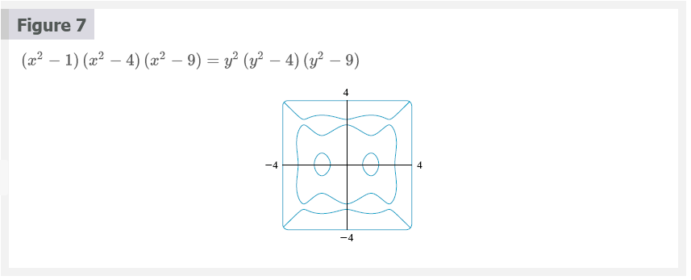
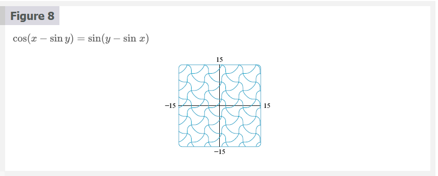

# Chapter 3.5: Implicit Differentiation

Some functions are defined implicitly by a relation between $x$ and $y$ such as

## Equation 1

$$
x^{2} + y^{2} = 25
$$

or

## Equation 2

$$
x^{3} + y^{3} = 6xy
$$

In some cases it is possible to solve such an equation for $y$ as an explicit
function (or serveral functions) of $x$. For instance, if we solve Equation 1
for $y$, we get $y \pm\sqrt{25 - x^{2}}$, so two of the functions determinded by
the implicit Equation 1 are $f(x) = \sqrt{25 - x^{2}}$ and $g(x) = -\sqrt{25 -
x^{2}}$. The graphs of $f$ and $g$ are the upper and lower semicircles of the
circle $x^{2} + y^{2} = 25$.

It's not easy to solve Equation 2 for $y$ explicitly as a function of $x$ by
hand. Nonetheless, Equation 2 is the equation of a curve called **folium of
Descartes** shown in Figure 2 and it implicitly defines $y$ as several functions
of $x$. The graphs of three such functions are shown in Figure 3. When we say
that $f$ is a function implicitly by Equation 2, we mean that the equation

$$
x^{3} + [f(x)]^{3} = 6xf(x)
$$

is true for all values of $x$ in the domain of $f$.

Fortunately, we don't need to solve an equation for $y$ in terms of $x$ in order
to find the derivative of $y$. Instead we can use the method of implicit
differentiation.  This consists of differentiating both sides of the equation
with respect to $x$ and then solving the resulting equation for $y^{\prime}$. In
the examples and exercises of this section it is always assumed that the given
equation determines $y$ implicitly as a differentiable function of $x$ so that
the method of implicit differentiation can be applied.

## Note 1

The expression $dy/dx = -x/y$ in Solution 1 gives the derivative in terms of
both $x$ and $y$. It is correct no matter which function $y$ is determined by
the given equation. For instance, for $y = f(x) = \sqrt{25 - x^{2}}$ we have

$$
\frac{dy}{dx} = -\frac{x}{y} = -\frac{x}{\sqrt{25 - x^{2}}}
$$

wheraas for $y = g(x) = -\sqrt{25 - x^{2}}$ we have

$$
\frac{dy}{dx} = -\frac{x}{y} = -\frac{x}{-\sqrt{25 - x^{2}}} = \frac{x}{\sqrt{25 x^{2}}}
$$

## Note 2

There is a formula for the three roots of a cubic equation that is like the
quadratic formula but much more complicated. If we use this formula (or a
computer algebra system) to solve the equation $x^{3} + y^{3} = 6xy$ for $y$ in
terms of $x$, we get three functions determined by the equation:

$$
y = f(x) = \sqrt[3]{-\frac{1}{2}x^{3} + \sqrt{\frac{1}{4}x^{6} - 8x^{3}}} + \sqrt[3]{-\frac{1}{2}x^{3} - \sqrt{\frac{1}{4}x^{6} - 8x^{3}}}
$$

and

$$
y = \frac{1}{2}\left [ -f(x) \pm \sqrt{-3}\left ( \sqrt[3]{-\frac{1}{2}x^{3} + \sqrt{\frac{1}{4}x^{6} - 8x^{3}}} - \sqrt[3]{-\frac{1}{2}x^{3} - \sqrt{\frac{1}{4}x^{6} - 8x^{3}}} \right ) \right ]
$$

(These are the three functions whose graphs are shown in Figure 3.) You can see
that the method of implicit differentiation saves an enormous amount of work in
cases such as this. Moreover, implicit differentiation works just as easily for
equations such as

$$
y^{5} + 3x^{2}y^{2} + 5x^{4} = 12
$$

for which it is _impossible_ to find a similar expression for $y$ in terms of
$x$.

Figures 7, 8, and 9 show three more curves produced by a computer algebra system
with an implicit-plotting command. In Exercises 41 and 42 you will have an
opportunity to create and examine unusual curves of this nature.

## Derivatives of Inverse Trigonometric Functions

Recall the definition of the arcsine function:

$$
y = 2\sin^{(-1 \cdot 4)}{asdf}
$$

means

$$
sin y = x
$$

and

$$
-\frac{\pi}{2} \le y \le \frac{\pi}{2}
$$

Differentiating $sin y = x$ implicitly with respect to $x$, we obtain

$$
\cos{y}\frac{dy}{dx} = 1
$$

or

$$
\frac{dy}{dx} = \frac{1}{\cos{y}}
$$

Now $\cos{y} \ge 0$, since $-\pi/2 \le y \le \pi/2$, so

$$
\cos{y} = \sqrt{1 - \sin^{2}{y}} = \sqrt{1 - x^{2}}
$$

Therefore

$$
\frac{dy}{dx} = \frac{1}{\cos{y}} = \frac{1}{\sqrt{1 - x^{2}}}
$$

> $\frac{d}{dx}(\sin^{-1}{x}) = \frac{1}{\sqrt{1 - x^{2}}}$

The formula for the derivative of the arctangent function is derived in a
similar way. If $y = \tan^{-1}{x}$, then $\tan{y} = x$. Differentiating this
latter equation implicitly with respect to $x$, we have

$$
\begin{aligned}
\sec^{2}{y}\frac{dy}{dx} &= 1 \\
           \frac{dy}{dx} &= \frac{1}{\sec^{2}{y}} = \frac{1}{1 + \tan^{2}{y}} = \frac{1}{1 x^{2}}
\end{aligned}
$$

> $\frac{d}{dx}(\tan^{-1}{x}) = \frac{1}{1 + x^{2}}$

> Derivatives of Inverse Trigonometric Functions

$$
\frac{d}{dx}(\sin^{-1}{x}) = \frac{1}{\sqrt{1 - x^{2}}} \;\;\;\;\;\;\; \frac{d}{dx}(\csc^{-1}{x}) = -\frac{1}{x\sqrt{x^{2} - 1}} \\
\frac{d}{dx}(\cos^{-1}{x}) = -\frac{1}{\sqrt{1 - x^{2}}} \;\;\;\;\;\;\; \frac{d}{dx}(\sec^{-1}{x}) = \frac{1}{x\sqrt{x^{2} - 1}} \\
\frac{d}{dx}(\tan^{-1}{x}) = \frac{1}{1 + x^{2}} \;\;\;\;\;\;\; \frac{d}{dx}(\cot^{-1}{x}) = -\frac{1}{1 + x^{2}}
$$

### Abel and Galois

The Norwegian mathematician Niels Abel proved in 1824 that no general formula
can be given for the roots of a fifth-degree equation in terms of radicals.
Later the French mathematician Evariste Galois proved that it is impossible to
find a general formula for the roots of an $n$th-degree equation (in terms of
algebraic operations on the coefficients) if $n$ is any integer larger than $4$.

## Video Lectures

- [🎬 Implicit Differentiation](https://www.khanacademy.org/math/ap-calculus-ab/ab-differentiation-2-new/ab-3-2/v/implicit-differentiation-1)
- [🎬 Worked example: Implicit differentiation](https://www.khanacademy.org/math/ap-calculus-ab/ab-differentiation-2-new/ab-3-2/v/implicit-derivative-of-x-y-2-x-y-1)
- [🎬 Worked example: Evaluation derivative with implicit differentiation](https://www.khanacademy.org/math/ap-calculus-ab/ab-differentiation-2-new/ab-3-2/v/finding-slope-of-tangent-line-with-implicit-differentiation)
- [🎬 Showing explicit and implicit differentiation give same result](https://www.khanacademy.org/math/ap-calculus-ab/ab-differentiation-2-new/ab-3-2/v/showing-explicit-and-implicit-differentiation-give-same-result)
- [🌎 Implicit differentiation review](https://www.khanacademy.org/math/ap-calculus-ab/ab-differentiation-2-new/ab-3-2/a/implicit-differentiation-review)
- [🎬 Derivative of inverse sine](https://www.khanacademy.org/math/ap-calculus-ab/ab-differentiation-2-new/ab-3-4/v/derivative-inverse-sine)
- [🎬 Derivative of inverse cosine](https://www.khanacademy.org/math/ap-calculus-ab/ab-differentiation-2-new/ab-3-4/v/derivative-inverse-cosine)
- [🎬 Derivative of inverse tangent](https://www.khanacademy.org/math/ap-calculus-ab/ab-differentiation-2-new/ab-3-4/v/derivative-inverse-tangent)
- [🌎 Differentiating inverse trig functions review](https://www.khanacademy.org/math/ap-calculus-ab/ab-differentiation-2-new/ab-3-4/a/differentiating-inverse-trig-functions-review)

 

# Resources

- [🎬 Implicit Differentiation](https://www.khanacademy.org/math/ap-calculus-ab/ab-differentiation-2-new/ab-3-2/v/implicit-differentiation-1)
- [🎬 Worked example: Implicit differentiation](https://www.khanacademy.org/math/ap-calculus-ab/ab-differentiation-2-new/ab-3-2/v/implicit-derivative-of-x-y-2-x-y-1)
- [🎬 Worked example: Evaluation derivative with implicit differentiation](https://www.khanacademy.org/math/ap-calculus-ab/ab-differentiation-2-new/ab-3-2/v/finding-slope-of-tangent-line-with-implicit-differentiation)
- [🎬 Showing explicit and implicit differentiation give same result](https://www.khanacademy.org/math/ap-calculus-ab/ab-differentiation-2-new/ab-3-2/v/showing-explicit-and-implicit-differentiation-give-same-result)
- [🌎 Implicit differentiation review](https://www.khanacademy.org/math/ap-calculus-ab/ab-differentiation-2-new/ab-3-2/a/implicit-differentiation-review)
- [🎬 Derivative of inverse sine](https://www.khanacademy.org/math/ap-calculus-ab/ab-differentiation-2-new/ab-3-4/v/derivative-inverse-sine)
- [🎬 Derivative of inverse cosine](https://www.khanacademy.org/math/ap-calculus-ab/ab-differentiation-2-new/ab-3-4/v/derivative-inverse-cosine)
- [🎬 Derivative of inverse tangent](https://www.khanacademy.org/math/ap-calculus-ab/ab-differentiation-2-new/ab-3-4/v/derivative-inverse-tangent)
- [🌎 Differentiating inverse trig functions review](https://www.khanacademy.org/math/ap-calculus-ab/ab-differentiation-2-new/ab-3-4/a/differentiating-inverse-trig-functions-review)

Textbook

+ [🌎 Cengage e-Textbook: Calculus Early Transcendentals, Eighth Edition, Stewart](https://webassign.com/)

