# Chapter 3.6: Derivatives of Logarithmic Functions

In this section we use implicit differentiation to find the derivatives of the
logarithmic functions $y = \log_{b}{x}$ and, in particular, the natural
logarithmic function $y = \ln{x}$.

## Equation 1

$$
\frac{d}{dx}(\log_{b}{x}) = \frac{1}{x\ln{b}}
$$

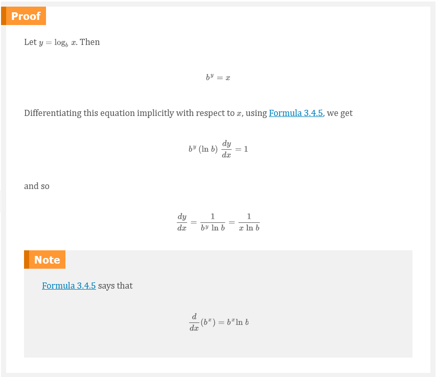

If we put $b = e$ in Formula 1, then the factor $\ln{b}$ on the right side
becomes $\ln{e} = 1$ and we get the formula for the derivative of the natural
logarithmic function $\log_{e}{x} = \ln{x}$:

## Equation 2

$$
\frac{d}{dx}(\ln{x}) = \frac{1}{x}
$$

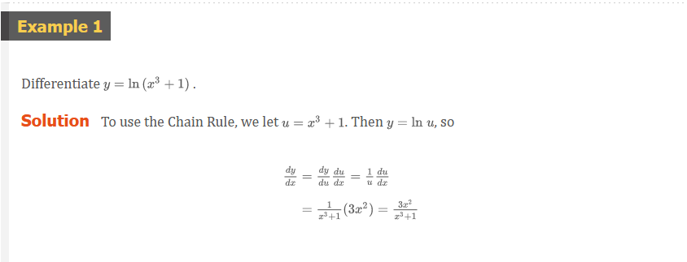

## Equation 3

$$
\frac{d}{dx}(\ln{u}) = \frac{1}{u}\frac{du}{dx} \;\;\;\;\; \text{or} \;\;\;\;\; \frac{d}{dx}[\ln{g}(x)] = \frac{g^{\prime}(x)}{g(x)}
$$

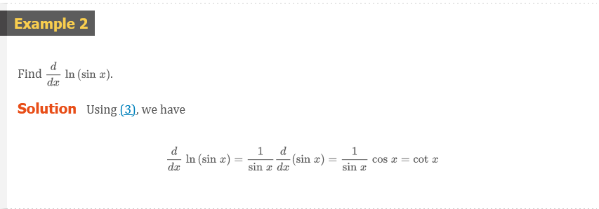
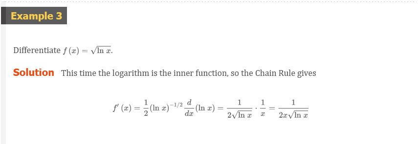
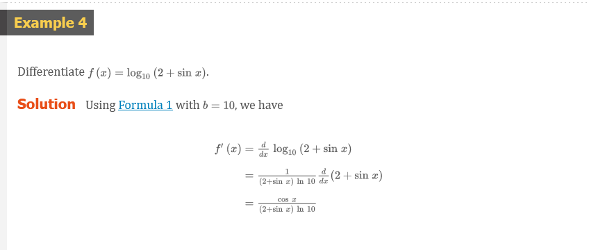
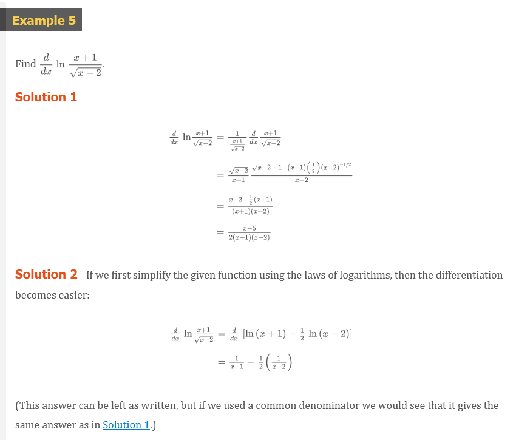
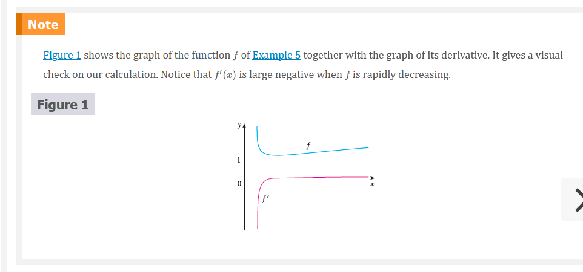
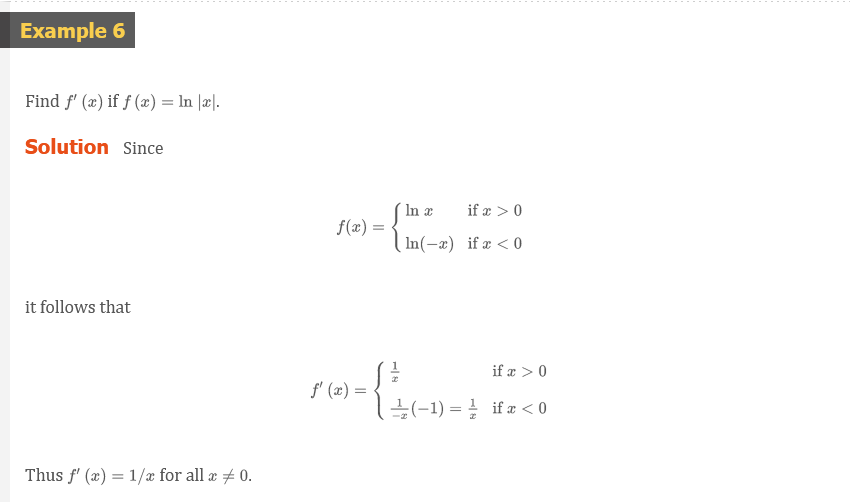
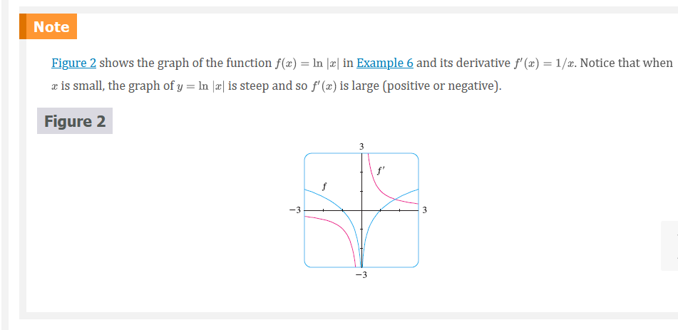

## Equation 4

$$
\frac{d}{dx}\ln{\left | x \right |} = \frac{1}{x}
$$

## Logarithmic Differentiation

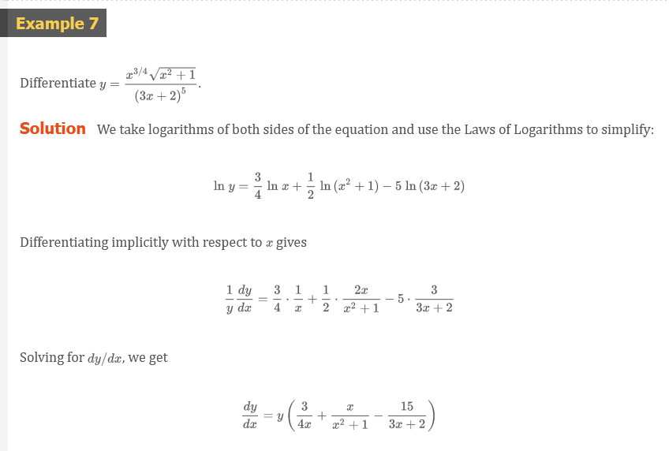
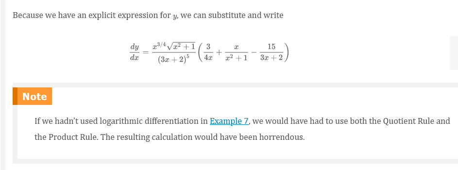

> Steps in Logarithmic Differentiation

1. Take natural logarithms of both sides of an equation $y = f(x)$ and use the
   Laws of Logarithms to simplify.
2. Differentiate implicitly with respect to $x$.
3. Solve the resulting equation for $y^{\prime}$

### The Power Rule

If $n$ is any real number and $f(x) = x^{n}$, then

$$
f^{\prime}(x) = nx^{n - 1}
$$

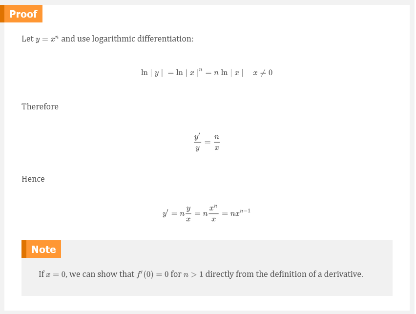
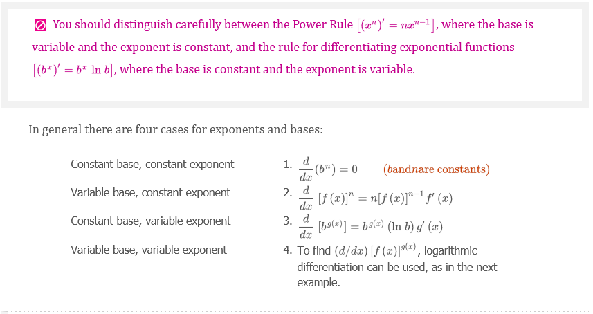
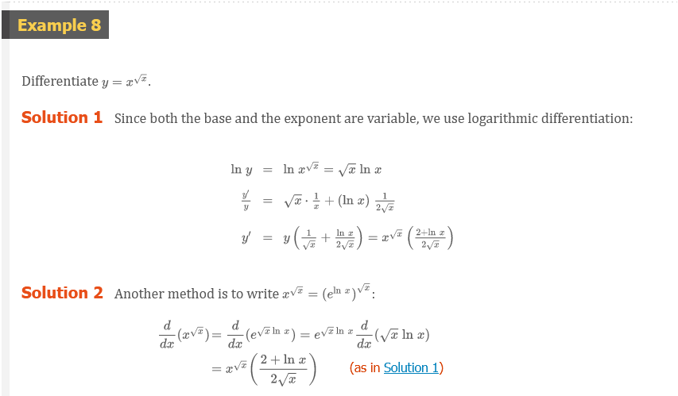
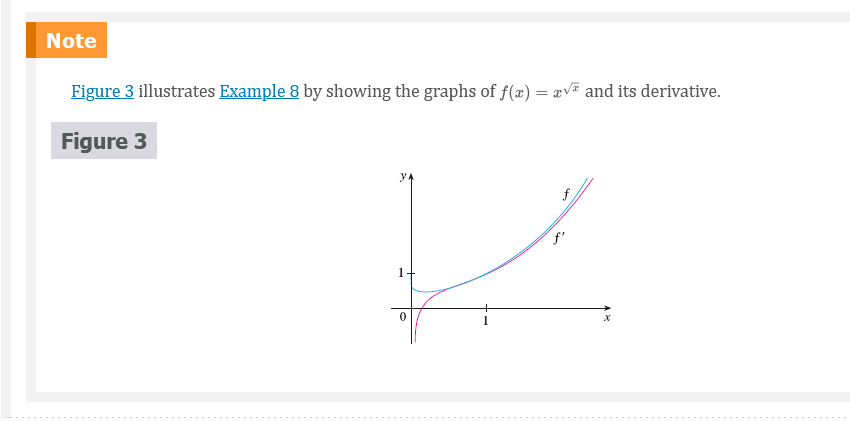

## The Number $e$ as a Limit

We have shown that if $f(x) = \ln{x}$, then $f^{\prime}(x) = 1/x$. Thus
$f^{\prime}(1) = 1$. We now use this fact to express the number $e$ as a limit.

From the definition of a derivative as a limit, we have

$$
\begin{aligned}
f^{\prime}(1) &= \lim_{h \to 0}\frac{f(1 + h) - f(1)}{h} = \lim_{x \to 0}\frac{f(1 + x) - f(1)}{x} \\
              &= \lim_{x \to 0}\frac{\ln{(1 + x) - \ln{1}}}{x} = \lim_{x \to 0}\frac{1}{x} \ln{(1 + x)} \\
              &= \lim_{x \to 0}\ln{(1 + x)^{1/x}}
\end{aligned}
$$

Because $f^{\prime}(1) = 1$, we have

$$
\lim_{x \to 0}\ln{(1 + x)^{1/x}} = 1
$$

Then, by Theorem 2.5.8 and the continuity of the exponential function, we have

$$
e = e^{1} = e^{\lim_{x \to 0}\ln{(1 + x)^{1/x}}} = \lim_{x \to 0}e^{\ln{(1 + x)^{1/x}}} = \lim_{x \to 0}(1 + x)^{1/x}
$$

## Equation 5

$$
e = \lim_{x \to 0}(1 + x)^{1/x}
$$

Formula 5 is illustrated by the graph of the function $y = (1 + x)^{1/x}$ in
Figure 4 and a table of values for small values of $x$. This illustrates the
fact that, correct to seven decimal places

$$
e \approx 2.7182818
$$

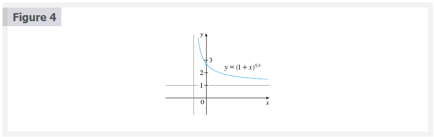

If we put $n = 1/x$ in Formula 5, then $n \to \infty$ as $x \to 0^{+}$ and so an
alternative expression for $e$ is

## Equation 6

$$
e = \lim_{n \to \infty}\left ( 1 + \frac{1}{n} \right )^{n}
$$

|    $x$     | $(1 + x)^{1/x}$ |
|:----------:|:---------------:|
|    0.1     |   2.59374246    |
|    0.01    |   2.70481383    |
|   0.001    |   2.71692393    |
|   0.0001   |   2.71814593    |
|  0.00001   |   2.71826824    |
|  0.000001  |   2.71828047    |
| 0.0000001  |   2.71828169    |
| 0.00000001 |   2.71828181    |

## Video Lectures

- [📺 Differentiating functions: Find the error](https://www.khanacademy.org/math/ap-calculus-ab/ab-differentiation-2-new/ab-3-5a/v/correcting-work-on-derivative-strategies)
- [📺 Manipulating functions before differentiation](https://www.khanacademy.org/math/ap-calculus-ab/ab-differentiation-2-new/ab-3-5a/v/strategies-applying-derivative-rules)
- [📄 Strategy in differentiating functions](https://www.khanacademy.org/math/ap-calculus-ab/ab-differentiation-2-new/ab-3-5a/a/review-categorizing-functions-for-taking-derivatives)
- [📺 Differentiating using multiple rules: strategy](https://www.khanacademy.org/math/ap-calculus-ab/ab-differentiation-2-new/ab-3-5b/v/differentiating-using-multiple-rules-strategy)
- [📺 Applying the chain rule and product rule](https://www.khanacademy.org/math/ap-calculus-ab/ab-differentiation-2-new/ab-3-5b/v/applying-the-chain-rule-and-product-rule)
- [📺 Applying the chain rule twice](https://www.khanacademy.org/math/ap-calculus-ab/ab-differentiation-2-new/ab-3-5b/v/applying-chain-rule-twice)
- [📺 Derivative of $e^{\cos{x}} \cdot \cos{e^{x}}$](https://www.khanacademy.org/math/ap-calculus-ab/ab-differentiation-2-new/ab-3-5b/v/using-the-product-rule-and-the-chain-rule)
- [📺 Derivative of $\sin{(\ln{(x^{2})})}$](https://www.khanacademy.org/math/ap-calculus-ab/ab-differentiation-2-new/ab-3-5b/v/chain-rule-with-triple-composition)
- [📺 Second derivatives](https://www.khanacademy.org/math/ap-calculus-ab/ab-differentiation-2-new/ab-3-6/v/second-derivatives)
- [📺 Second derivatives (implicit equations): find expression](https://www.khanacademy.org/math/ap-calculus-ab/ab-differentiation-2-new/ab-3-6/v/finding-second-derivative-implicit)
- [📺 Second derivatives (implicit equations): evaluate derivative](https://www.khanacademy.org/math/ap-calculus-ab/ab-differentiation-2-new/ab-3-6/v/evaluating-second-derivative-implicit)

 

# Resources

- [📺 Differentiating functions: Find the error](https://www.khanacademy.org/math/ap-calculus-ab/ab-differentiation-2-new/ab-3-5a/v/correcting-work-on-derivative-strategies)
- [📺 Manipulating functions before differentiation](https://www.khanacademy.org/math/ap-calculus-ab/ab-differentiation-2-new/ab-3-5a/v/strategies-applying-derivative-rules)
- [📄 Strategy in differentiating functions](https://www.khanacademy.org/math/ap-calculus-ab/ab-differentiation-2-new/ab-3-5a/a/review-categorizing-functions-for-taking-derivatives)
- [📺 Differentiating using multiple rules: strategy](https://www.khanacademy.org/math/ap-calculus-ab/ab-differentiation-2-new/ab-3-5b/v/differentiating-using-multiple-rules-strategy)
- [📺 Applying the chain rule and product rule](https://www.khanacademy.org/math/ap-calculus-ab/ab-differentiation-2-new/ab-3-5b/v/applying-the-chain-rule-and-product-rule)
- [📺 Applying the chain rule twice](https://www.khanacademy.org/math/ap-calculus-ab/ab-differentiation-2-new/ab-3-5b/v/applying-chain-rule-twice)
- [📺 Derivative of $e^{\cos{x}} \cdot \cos{e^{x}}$](https://www.khanacademy.org/math/ap-calculus-ab/ab-differentiation-2-new/ab-3-5b/v/using-the-product-rule-and-the-chain-rule)
- [📺 Derivative of $\sin{(\ln{(x^{2})})}$](https://www.khanacademy.org/math/ap-calculus-ab/ab-differentiation-2-new/ab-3-5b/v/chain-rule-with-triple-composition)
- [📺 Second derivatives](https://www.khanacademy.org/math/ap-calculus-ab/ab-differentiation-2-new/ab-3-6/v/second-derivatives)
- [📺 Second derivatives (implicit equations): find expression](https://www.khanacademy.org/math/ap-calculus-ab/ab-differentiation-2-new/ab-3-6/v/finding-second-derivative-implicit)
- [📺 Second derivatives (implicit equations): evaluate derivative](https://www.khanacademy.org/math/ap-calculus-ab/ab-differentiation-2-new/ab-3-6/v/evaluating-second-derivative-implicit)

Textbook

+ [📄 Cengage e-Textbook: Calculus Early Transcendentals, Eighth Edition, Stewart](https://webassign.com/)

