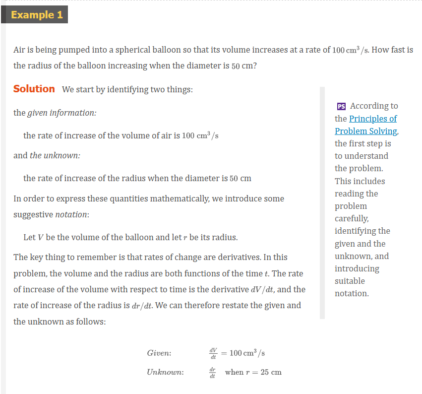
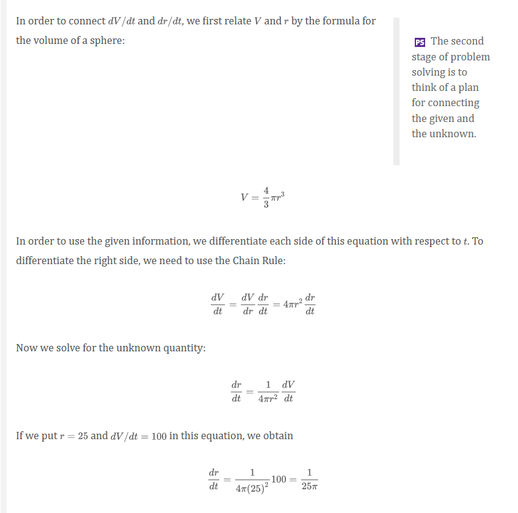
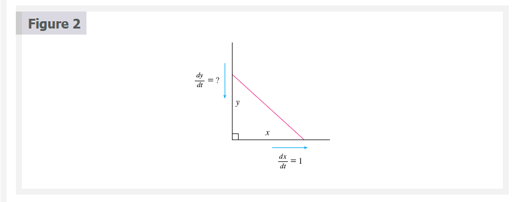
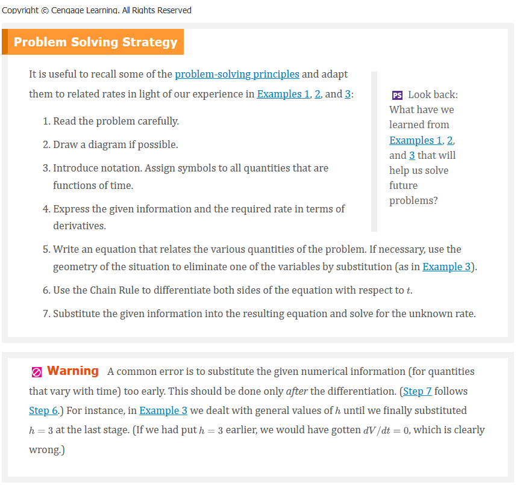
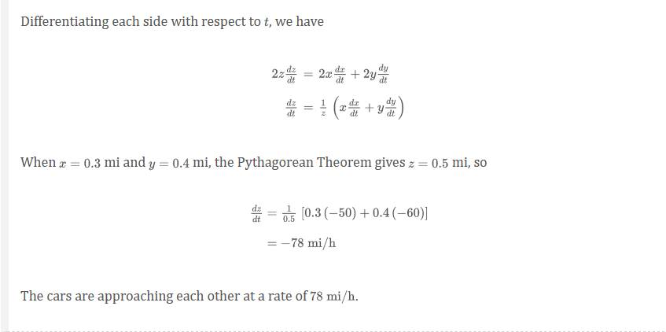
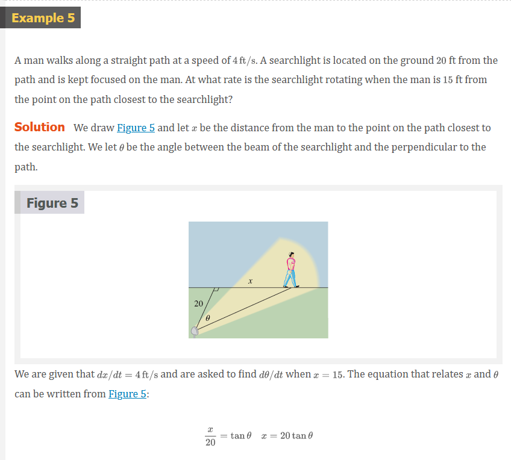
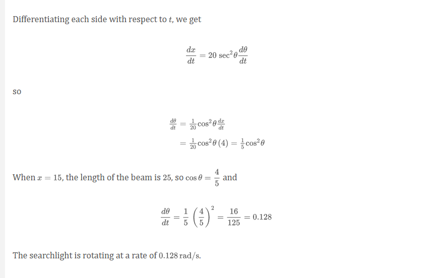

# Chapter 3.9: Related Rates

If we are pumping air into a balloon, both the volume and the radius of the
balloon are increasing and their rates of increase are related to each other.
But it is much easier to measure directly the rate of increase of the volume
than the rate of increase of the radius.

In a related rates problem the idea is to compute the rate of change of one
quantity in terms of the rate of change of another quantity (which may be more
easily measured). The procedure is to find an equation that relates the two
quantities and then use the Chain Rule to differentiate both sides with respect
to time.

## Video Lectures

- [🎬 Related rates intro](https://www.khanacademy.org/math/ap-calculus-ab/ab-diff-contextual-applications-new/ab-4-4/v/rates-of-change-between-radius-and-area-of-circle)
- [🎬 Analyzing related rates problems: expressions](https://www.khanacademy.org/math/ap-calculus-ab/ab-diff-contextual-applications-new/ab-4-4/v/analyzing-related-rates-problems-expressions)
- [🎬 Analyzing related rates problems: equations (Pythagoras)](https://www.khanacademy.org/math/ap-calculus-ab/ab-diff-contextual-applications-new/ab-4-4/v/analyzing-related-rates-problems-equations)
- [🎬 Analyzing related rates problems: equations (trig)](https://www.khanacademy.org/math/ap-calculus-ab/ab-diff-contextual-applications-new/ab-4-4/v/related-rates-example-with-trigonometry)
- [🎬 Differentiating related functions intro](https://www.khanacademy.org/math/ap-calculus-ab/ab-diff-contextual-applications-new/ab-4-4/v/differentiating-related-functions-intro)
- [🎬 Worked example: Differentiating related functions](https://www.khanacademy.org/math/ap-calculus-ab/ab-diff-contextual-applications-new/ab-4-4/v/differentiating-related-functions)
- [🎬 Related rates: Approaching cars](https://www.khanacademy.org/math/ap-calculus-ab/ab-diff-contextual-applications-new/ab-4-5/v/rate-of-change-of-distance-between-approaching-cars)
- [🎬 Related rates: Falling ladder](https://www.khanacademy.org/math/ap-calculus-ab/ab-diff-contextual-applications-new/ab-4-5/v/falling-ladder-related-rates)
- [🎬 Related rates: water pouring into a cone](https://www.khanacademy.org/math/ap-calculus-ab/ab-diff-contextual-applications-new/ab-4-5/v/related-rates-of-water-pouring-into-cone)
- [🎬 Related rates: shadow](https://www.khanacademy.org/math/ap-calculus-ab/ab-diff-contextual-applications-new/ab-4-5/v/speed-of-shadow-of-diving-bird)
- [🎬 Related rates: balloon](https://www.khanacademy.org/math/ap-calculus-ab/ab-diff-contextual-applications-new/ab-4-5/v/rate-of-change-of-balloon-height)

 

# Resources

- [🎬 Related rates intro](https://www.khanacademy.org/math/ap-calculus-ab/ab-diff-contextual-applications-new/ab-4-4/v/rates-of-change-between-radius-and-area-of-circle)
- [🎬 Analyzing related rates problems: expressions](https://www.khanacademy.org/math/ap-calculus-ab/ab-diff-contextual-applications-new/ab-4-4/v/analyzing-related-rates-problems-expressions)
- [🎬 Analyzing related rates problems: equations (Pythagoras)](https://www.khanacademy.org/math/ap-calculus-ab/ab-diff-contextual-applications-new/ab-4-4/v/analyzing-related-rates-problems-equations)
- [🎬 Analyzing related rates problems: equations (trig)](https://www.khanacademy.org/math/ap-calculus-ab/ab-diff-contextual-applications-new/ab-4-4/v/related-rates-example-with-trigonometry)
- [🎬 Differentiating related functions intro](https://www.khanacademy.org/math/ap-calculus-ab/ab-diff-contextual-applications-new/ab-4-4/v/differentiating-related-functions-intro)
- [🎬 Worked example: Differentiating related functions](https://www.khanacademy.org/math/ap-calculus-ab/ab-diff-contextual-applications-new/ab-4-4/v/differentiating-related-functions)
- [🎬 Related rates: Approaching cars](https://www.khanacademy.org/math/ap-calculus-ab/ab-diff-contextual-applications-new/ab-4-5/v/rate-of-change-of-distance-between-approaching-cars)
- [🎬 Related rates: Falling ladder](https://www.khanacademy.org/math/ap-calculus-ab/ab-diff-contextual-applications-new/ab-4-5/v/falling-ladder-related-rates)
- [🎬 Related rates: water pouring into a cone](https://www.khanacademy.org/math/ap-calculus-ab/ab-diff-contextual-applications-new/ab-4-5/v/related-rates-of-water-pouring-into-cone)
- [🎬 Related rates: shadow](https://www.khanacademy.org/math/ap-calculus-ab/ab-diff-contextual-applications-new/ab-4-5/v/speed-of-shadow-of-diving-bird)
- [🎬 Related rates: balloon](https://www.khanacademy.org/math/ap-calculus-ab/ab-diff-contextual-applications-new/ab-4-5/v/rate-of-change-of-balloon-height)

Textbook

+ [🌎 Cengage e-Textbook: Calculus Early Transcendentals, Eighth Edition, Stewart](https://webassign.com/)

