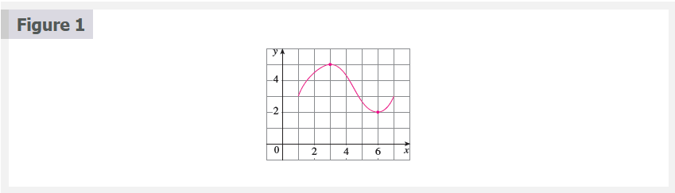
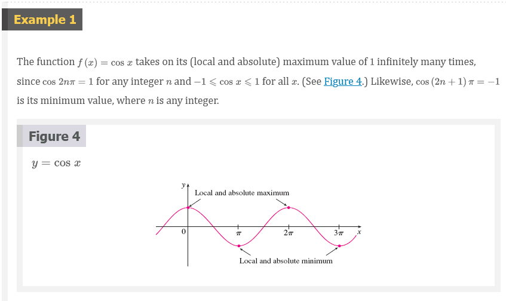
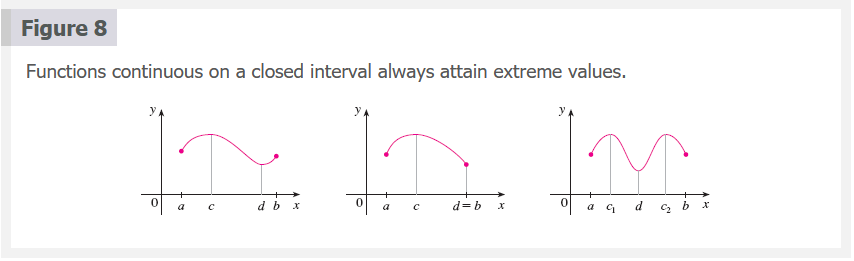
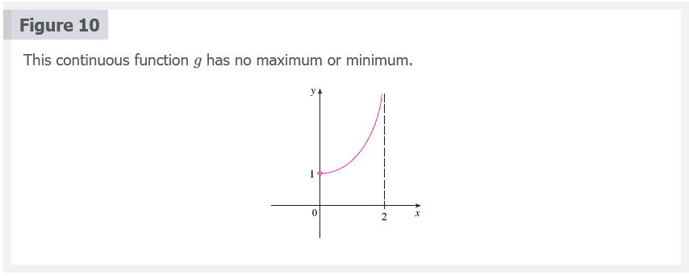
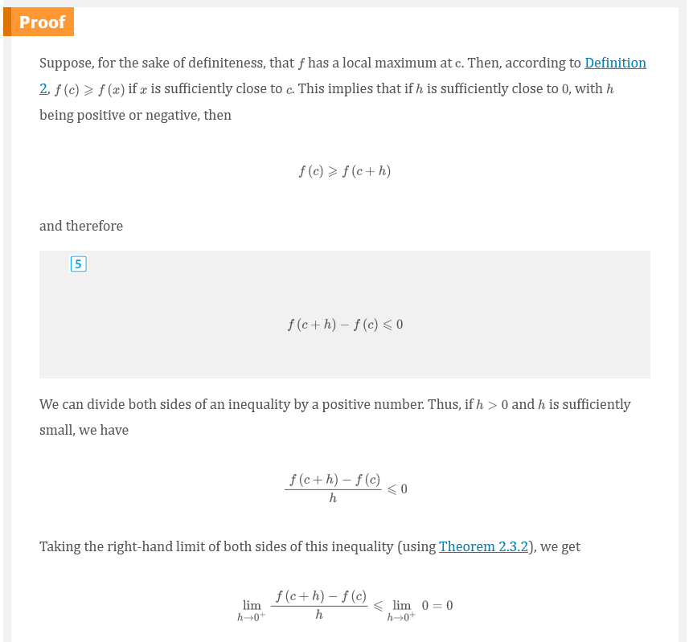
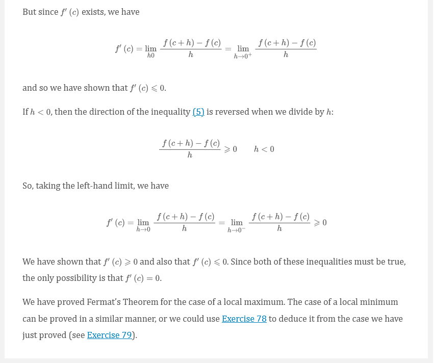
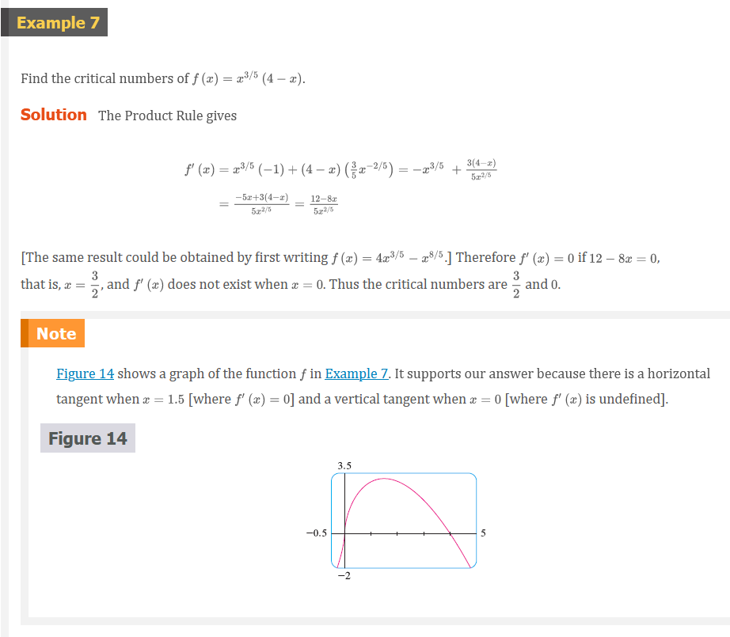
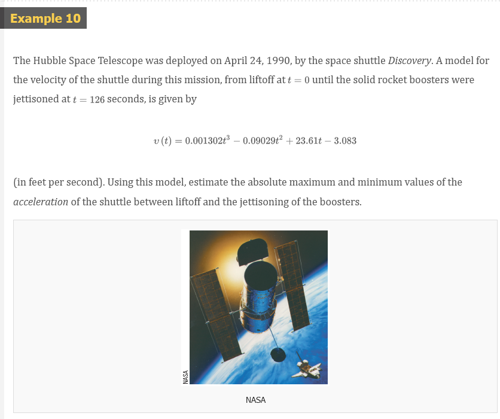

# Chapter 4.1: Maximum and Minimum Values

Some of the most important applications of differential calculus are
optimization problems, in which we are required to find the optimal (best) way
of doing something. Here are examples of such problems that we will solve in
this chapter:

- What is the shape of a can that minimizes manufacturing costs?
- What is the maximum acceleration of a space shuttle? (This is an important
  question to the astronauts who have to withstand the effects of acceleration.)
- What is the radius of a contracted windpipe that expels air most rapidly
  during a cough?
- At what angle should blood vessels branch so as to minimize the energy
  expended by the heart in pumping blood?

These problems can be reduced to finding the maximum or minimum values of a
function. Let's first explain exactly what we mean by maximum and minimum
values.

We see that the highest point on the graph of the function $f$ shown in Figure 1
is the point $(3, 5)$. In other words, the largest value of $f$ is $f(3) = 5$.
Likewise, the smallest value is $f(6) = 2$. We say that $f(3) = 5$ is the
absolute maximum of $f$ and $f(6) = 2$ is the _absolute minimum_. In general, we
use the following definition.

## Definition 1

Let $c$ be a number in the domain $D$ of a function $f$. Then $f(c)$ is the

- **absolute maximum** value of $f$ on $D$ if $f(c) \ge f(x)$ for all $x$ in $D$
- **absolute minimum** value of $f$ on $D$ if $f(c) \le f(x)$ for all $x$ in $D$

An absolute maximum or minimum is sometimes called a global maximum or minimum.
The maximum and minimum values of $f$ are called extreme values of $f$.

## Definition 2

The number $f(c)$ is a

- **local maximum** value of $f$ if $f(c) \ge f(x)$ when $x$ is near $c$
- **local minimum** value of $f$ if $f(c) \le f(x)$ when $x$ is near $c$

## The Extreme Value Theorem 3

If $f$ is continuous on a closed interval $[a, b]$, then $f$ attains an absolute
maximum value $f(c)$ and an absolute minimum value $f(d)$ at some numbers $c$
and $d$ in $[a, b]$.

The Extreme Value Theorem is illustrated in Figure 8. Note that an extreme value
can be taken on more than once. Although the Extreme Value Theorem is
intuitively very plausible, it is difficult to prove and so we omit the proof.

Figures 9 and 10 show that a function need not possess extreme values if either
hypothesis (continuity or closed interval) is omitted from the Extreme Value
Theorem.

The function $f$ whose graph is shown in Figure 9 is defined on the closed
interval $[0, 2]$ but has no maximum value. (Notice that the range of $f$ is
$[0, 3)$. The function takes on values arbitrarily close to $3$, but never
actually attains the value 3.) This does not contradict the Extreme Value
Theorem because $f$ is not continuous.

The function $g$ shown in Figure 10 is continuous on the open interval $(0, 2)$
but has neither a maximum nor a minimum value. [The range of $g$ is $(1,
\infty)$. The function takes on arbitrarily large values.] This does not
contradict the Extreme Value Theorem because the interval $(0, 2)$ is not
closed.

The Extreme Value Theorem says that a continuous function on a closed interval
has a maximum value and a minimum value, but it does not tell us how to find
these extreme values. Notice in Figure 8 that the absolute maximum and minimum
values that are _between_ $a$ and $b$ occur at local maximum or minimum values,
so we start by looking for local extreme values.

Figure 11 shows the graph of a function $f$ with a local maximum at $c$ and a
local minimum at $d$. It appears that at the maximum and minimum points the
tangent lines are horizontal and therefore each has slope $0$. We know that the
derivative is the slope of the tangent line, so it appears that $f^{\prime}(c) =
0$ and $f^{\prime}(d)$. The following theorem says that this is always true for
differentiable functions.

## Fermat's Theorem

If $f$ has a local maximum or minimum at $c$, and if $f^{\prime}(c)$ exists,
then $f^{\prime}(c) = 0$.

> **Warning** Examples 5 and 6 show that we must be careful when using Fermat's
Theorem. Example 5 demonstrates that even when $f^{\prime}(c) = 0$ there need
not be a maximum or minimum at $c$. (In other words, the converse of Fermat's
Theorem is false in general.) Furthermore, there may be an extreme value even
when $f^{\prime}(c)$ does not exist (as in Example 6).

Fermat's Theorem does suggest that we should at least start looking for extreme
values of $f$ at the numbers $c$ where $f^{\prime}(c) = 0$ or where
$f^{\prime}(c)$ does not exist. Such numbers are given a special name.

## Definition 6

A **critical number** of a function $f$ is a number $c$ in the domain of $f$
such that either $f^{\prime}(c) = 0$ or $f^{\prime}(c)$ does not exist.

## Definition 7

If $f$ has a local maximum or minimum at $c$, then $c$ is a critical number of
$f$.

To find an absolute maximum or minimum of a continuous function on a closed
interval, we note that either it is local [in which case it occurs at a critical
number by (7)] or it occurs at an endpoint of the interval, as we see from the
examples in Figure 8. Thus the following three-step procedure always works.

## The Closed Interval Method

To find the _absolute_ maximum and minimum values of a continuous function $f$
on a closed interval $[a, b]$:

1. Find the values of $f$ at the critical numbers of $f$ in $(a, b)$.
2. Find the values of $f$ at the endpoints of the interval.
3. The largest of the values from Steps 1 and 2 is the absolute maximum value;
   the smallest of these values is the absolute minimum value.

## Fermat

Fermat's Theorem is named after Pierre Fermat (1601–1665), a French lawyer who
took up mathematics as a hobby. Despite his amateur status, Fermat was one of
the two inventors of analytic geometry (Descartes was the other). His methods
for finding tangents to curves and maximum and minimum values (before the
invention of limits and derivatives) made him a forerunner of Newton in the
creation of differential calculus.

## Video Lectures

- [🎬 Extreme value theorem](https://www.khanacademy.org/math/ap-calculus-ab/ab-diff-analytical-applications-new/ab-5-2/v/extreme-value-theorem)
- [🎬 Critical points introduction](https://www.khanacademy.org/math/ap-calculus-ab/ab-diff-analytical-applications-new/ab-5-2/v/minima-maxima-and-critical-points)
- [🎬 Finding critical points](https://www.khanacademy.org/math/ap-calculus-ab/ab-diff-analytical-applications-new/ab-5-2/v/finding-critical-numbers)
- [🎬 Introduction to minimum and maximum points](https://www.khanacademy.org/math/ap-calculus-ab/ab-diff-analytical-applications-new/ab-5-4/v/relative-minima-maxima)
- [🎬 Finding relative extrema (first derivative test)](https://www.khanacademy.org/math/ap-calculus-ab/ab-diff-analytical-applications-new/ab-5-4/v/testing-critical-points-for-local-extrema)
- [🎬 Worked example: finding relative extrema](https://www.khanacademy.org/math/ap-calculus-ab/ab-diff-analytical-applications-new/ab-5-4/v/finding-relative-maximum-example)
- [🎬 Analyzing mistakes when finding extrema (example 1)](https://www.khanacademy.org/math/ap-calculus-ab/ab-diff-analytical-applications-new/ab-5-4/v/analyzing-mistakes-when-finding-extrema-1)
- [🎬 Analyzing mistakes when finding extrema (example 2)](https://www.khanacademy.org/math/ap-calculus-ab/ab-diff-analytical-applications-new/ab-5-4/v/analyzing-mistakes-when-finding-extrema-2)
- [🌎 Relative minima & maxima review](https://www.khanacademy.org/math/ap-calculus-ab/ab-diff-analytical-applications-new/ab-5-4/a/relative-minima-and-maxima-review)
- [🎬 Finding absolute extrema on a closed interval](https://www.khanacademy.org/math/ap-calculus-ab/ab-diff-analytical-applications-new/ab-5-5/v/using-extreme-value-theorem)
- [🎬 Absolute minima & maxima (entire domain)](https://www.khanacademy.org/math/ap-calculus-ab/ab-diff-analytical-applications-new/ab-5-5/v/absolute-extrema-on-entire-domain)
- [🌎 Absolute minima & maxima review](https://www.khanacademy.org/math/ap-calculus-ab/ab-diff-analytical-applications-new/ab-5-5/a/absolute-minima-and-maxima-review)

 

# Resources

- [🎬 Extreme value theorem](https://www.khanacademy.org/math/ap-calculus-ab/ab-diff-analytical-applications-new/ab-5-2/v/extreme-value-theorem)
- [🎬 Critical points introduction](https://www.khanacademy.org/math/ap-calculus-ab/ab-diff-analytical-applications-new/ab-5-2/v/minima-maxima-and-critical-points)
- [🎬 Finding critical points](https://www.khanacademy.org/math/ap-calculus-ab/ab-diff-analytical-applications-new/ab-5-2/v/finding-critical-numbers)
- [🎬 Introduction to minimum and maximum points](https://www.khanacademy.org/math/ap-calculus-ab/ab-diff-analytical-applications-new/ab-5-4/v/relative-minima-maxima)
- [🎬 Finding relative extrema (first derivative test)](https://www.khanacademy.org/math/ap-calculus-ab/ab-diff-analytical-applications-new/ab-5-4/v/testing-critical-points-for-local-extrema)
- [🎬 Worked example: finding relative extrema](https://www.khanacademy.org/math/ap-calculus-ab/ab-diff-analytical-applications-new/ab-5-4/v/finding-relative-maximum-example)
- [🎬 Analyzing mistakes when finding extrema (example 1)](https://www.khanacademy.org/math/ap-calculus-ab/ab-diff-analytical-applications-new/ab-5-4/v/analyzing-mistakes-when-finding-extrema-1)
- [🎬 Analyzing mistakes when finding extrema (example 2)](https://www.khanacademy.org/math/ap-calculus-ab/ab-diff-analytical-applications-new/ab-5-4/v/analyzing-mistakes-when-finding-extrema-2)
- [🌎 Relative minima & maxima review](https://www.khanacademy.org/math/ap-calculus-ab/ab-diff-analytical-applications-new/ab-5-4/a/relative-minima-and-maxima-review)
- [🎬 Finding absolute extrema on a closed interval](https://www.khanacademy.org/math/ap-calculus-ab/ab-diff-analytical-applications-new/ab-5-5/v/using-extreme-value-theorem)
- [🎬 Absolute minima & maxima (entire domain)](https://www.khanacademy.org/math/ap-calculus-ab/ab-diff-analytical-applications-new/ab-5-5/v/absolute-extrema-on-entire-domain)
- [🌎 Absolute minima & maxima review](https://www.khanacademy.org/math/ap-calculus-ab/ab-diff-analytical-applications-new/ab-5-5/a/absolute-minima-and-maxima-review)

Textbook

+ [🌎 Cengage e-Textbook: Calculus Early Transcendentals, Eighth Edition, Stewart](https://webassign.com/)

