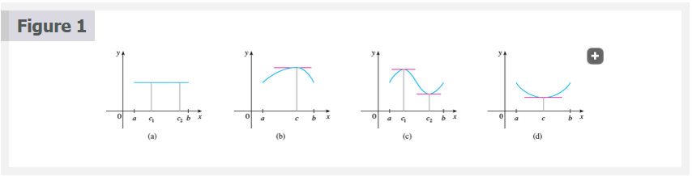
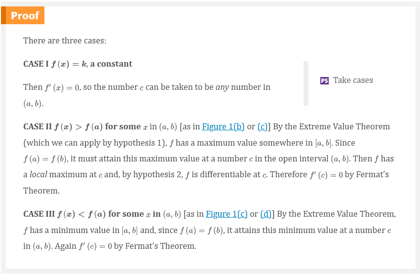
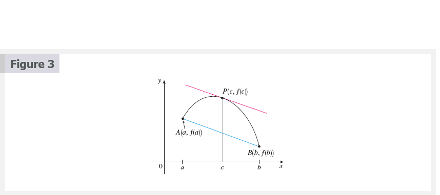
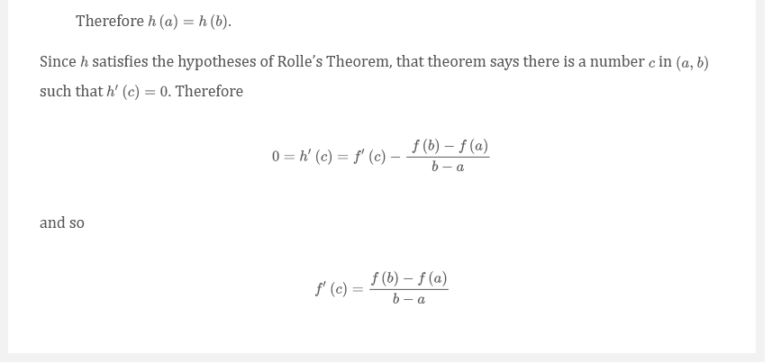
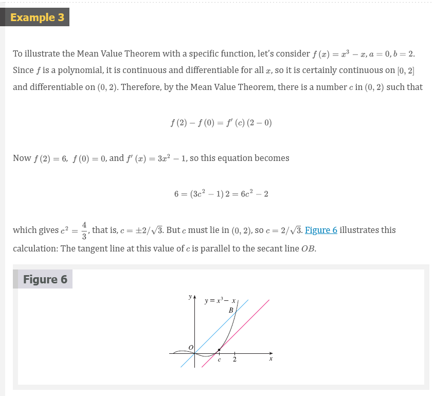

# Chapter 4.2: The Mean Value Theorem

## Rolle's Theorem

Let $f$ be a function that satisfies the following three hypotheses:

1. $f$ is continuous on the closed interval $[a, b]$.
2. $f$ is differentiable on the open interval $(a, b)$.
3. $f(a) = f(b)$

Then there is a number $c$ in $(a, b)$ such that $f^{\prime}(c) = 0$.

Before giving the proof let's take a look at the graphs of some typical
functions that satisfy the three hypotheses. Figure 1 shows the graphs of four
such functions. In each case it appears that there is at least one point $(c,
f(c))$ on the graph where the tangent is horizontal and therefore $f^{\prime}(c)
= 0$. Thus Rolle's Theorem is plausible.

## The Mean Value Theorem

Let be a function that satisfies the following hypotheses:

1. $f$ is continuous on the closed interval $[a, b]$.
2. $f$ is differentiable on the open interval $(a, b)$.

Then there is a number $c$ in $(a, b)$ such that

## Equation 1

$$
f^{\prime}(c) = \frac{f(b) - f(a)}{b - a}
$$

or, equivalently,

## Equation 2

$$
f(b) - f(a) = f^{\prime}(c)(b - a)
$$

> **NOTE:** The Mean Value Theorem is an example of what is called an existence
theorem. Like the Intermediate Value Theorem, the Extreme Value Theorem, and
Rolle's Theorem, it guarantees that there exists a number with a certain
property, but it doesn't tell us how to find the number.

Before proving this theorem, we can see that it is reasonable by interpreting it
geometrically. Figures 3 and 4 show the points $A(a, f(a))$ and $B(b, f(b))$ on
the graphs of two differentiable functions. The slope of the secant line $AB$ is

## Equation 3

$$
m_{AB} = \frac{f(b) - f(a)}{b - a}
$$

## Equation 4

$$
h(x) = f(x) - f(a) - \frac{f(b) - f(a)}{b - a}(x - a)
$$

## Theorem 5

If $f^{\prime}(x) = 0$ for all $x$ in an interval $(a, b)$, then $f$ is constant
on $(a, b)$.

> Proof

Let $x_{1}$ and $x_{2}$ be any two numbers in $(a, b)$ with $x_{1} < x_{2}$.
Since $f$ is differentiable on $(a, b)$, it must be differentiable on $(x_{1},
x_{2})$ and continuous on $[x_{1}, x_{2}]$. By applying the Mean Value Theorem
to $f$ on the interval $[x_{1}, x_{2}]$, we get a number $c$ such that $x_{1} <
c < x_{2}$ and

## Equation 6

$$
f(x_{2}) - f(x_{1}) = f^{\prime}(c)(x_{2} - x_{1})
$$

Since $f^{\prime}(x) = 0$ for all $x$, we have $f^{\prime}(c)$, and so Equation
6 becomes

$$
f(x_{2}) - f(x_{1}) = 0
$$

or

$$
f(x_{2}) = f(x_{1})
$$

Therefore $f$ has the same value at any two numbers $x_{1}$ and $x_{2}$ in $(a,
b)$. This means that $f$ is constant on $(a, b)$.

## Collary 7

If $f^{\prime}(x) = g^{\prime}(x)$ for all $x$ in an interval $(a, b)$, then $f - g$
is constant on $(a, b)$; that is $f(x) = g(x) + c$, where $c$ is a
constant.

> **NOTE:** Corollary 7 says that if two functions have the same derivatives on
an interval, then their graphs must be vertical translations of each other
there. In other words, the graphs have the same shape, but could be shifted up
or down.

> Proof

Let $F(x) = f(x) - g(x)$. Then

$$
F^{\prime}(x) = f^{\prime}(x) - g^{\prime}(x) = 0
$$

for all $x$ in $(a, b)$. Thus, by Theorem 5, $F$ is constant; that is, $f - g$
is constant.

## Rolle

Rolle's Theorem was first published in 1691 by the French mathematician Michel
Rolle (1652–1719) in a book entitled Méthode pour resoudre les Egalitez. He was
a vocal critic of the methods of his day and attacked calculus as being a
"collection of ingenious fallacies." Later, however, he became convinced of the
essential correctness of the methods of calculus.

## Lagrange and the Mean Value Theorem

The Mean Value Theorem was first formulated by Joseph-Louis Lagrange
(1736–1813), born in Italy of a French father and an Italian mother. He was a
child prodigy and became a professor in Turin at the tender age of 19. Lagrange
made great contributions to number theory, theory of functions, theory of
equations, and analytical and celestial mechanics. In particular, he applied
calculus to the analysis of the stability of the solar system. At the invitation
of Frederick the Great, he succeeded Euler at the Berlin Academy and, when
Frederick died, Lagrange accepted King Louis XVI's invitation to Paris, where he
was given apartments in the Louvre and became a professor at the Ecole
Polytechnique. Despite all the trappings of luxury and fame, he was a kind and
quiet man, living only for science.

## Video Lectures

- [🎬 Mean value theorem](https://www.khanacademy.org/math/ap-calculus-ab/ab-diff-analytical-applications-new/ab-5-1/v/mean-value-theorem-1)
- [🎬 Mean value theorem example: polynomial](https://www.khanacademy.org/math/ap-calculus-ab/ab-diff-analytical-applications-new/ab-5-1/v/finding-where-the-derivative-is-equal-to-the-average-change)
- [🎬 Mean value theorem example: square root function](https://www.khanacademy.org/math/ap-calculus-ab/ab-diff-analytical-applications-new/ab-5-1/v/mean-value-theorem-example-square-root)
- [🎬 Justification with the mean value theorem: table](https://www.khanacademy.org/math/ap-calculus-ab/ab-diff-analytical-applications-new/ab-5-1/v/justification-with-the-mean-value-theorem-table)
- [🎬 Justification with the mean value theorem: equation](https://www.khanacademy.org/math/ap-calculus-ab/ab-diff-analytical-applications-new/ab-5-1/v/justification-with-the-mean-value-theorem-equation)
- [🎬 Mean value theorem application](https://www.khanacademy.org/math/ap-calculus-ab/ab-diff-analytical-applications-new/ab-5-1/v/getting-a-ticket-because-of-the-mean-value-theorem)
- [🌎 Mean value theorem review](https://www.khanacademy.org/math/ap-calculus-ab/ab-diff-analytical-applications-new/ab-5-1/a/mean-value-theorem-review)

 

# Resources

- [🎬 Mean value theorem](https://www.khanacademy.org/math/ap-calculus-ab/ab-diff-analytical-applications-new/ab-5-1/v/mean-value-theorem-1)
- [🎬 Mean value theorem example: polynomial](https://www.khanacademy.org/math/ap-calculus-ab/ab-diff-analytical-applications-new/ab-5-1/v/finding-where-the-derivative-is-equal-to-the-average-change)
- [🎬 Mean value theorem example: square root function](https://www.khanacademy.org/math/ap-calculus-ab/ab-diff-analytical-applications-new/ab-5-1/v/mean-value-theorem-example-square-root)
- [🎬 Justification with the mean value theorem: table](https://www.khanacademy.org/math/ap-calculus-ab/ab-diff-analytical-applications-new/ab-5-1/v/justification-with-the-mean-value-theorem-table)
- [🎬 Justification with the mean value theorem: equation](https://www.khanacademy.org/math/ap-calculus-ab/ab-diff-analytical-applications-new/ab-5-1/v/justification-with-the-mean-value-theorem-equation)
- [🎬 Mean value theorem application](https://www.khanacademy.org/math/ap-calculus-ab/ab-diff-analytical-applications-new/ab-5-1/v/getting-a-ticket-because-of-the-mean-value-theorem)
- [🌎 Mean value theorem review](https://www.khanacademy.org/math/ap-calculus-ab/ab-diff-analytical-applications-new/ab-5-1/a/mean-value-theorem-review)

Textbook

+ [🌎 Cengage e-Textbook: Calculus Early Transcendentals, Eighth Edition, Stewart](https://webassign.com/)

