# Chapter 4.3: How Derivatives Affect the Shape of the Graph

Many of the applications of calculus depend on our ability to deduce facts about
a function $f$ from information concerning its derivatives. Because
$f^{\prime}(x)$ represents the slope of the curve $y = f(x)$ at the point $(x,
f(x))$, it tells us the direction in which the curve proceeds at each point. So
it is reasonable to expect that information about $f^{\prime}(x)$ will provide
us with information about $f(x)$.

## What Does $f^{\prime}$ Say about $f$?

To see how the derivative of $f$ can tell us where a function is increasing or
decreasing, look at Figure 1. (Increasing functions and decreasing functions
were defined in Section 1.1.) Between $A$ and $B$ and between $C$ and $D$, the
tangent lines have positive slope and so $f^{\prime}(x)$. Between $B$ and $C$,
the tangent lines have negative slope and so $f^{\prime}(x) < 0$. Thus it
appears that $f$ increases when $f^{\prime}(x)$ is positive and decreases when
$f^{\prime}(x)$ is negative. To prove that this is always the case, we use the
Mean Value Theorem.

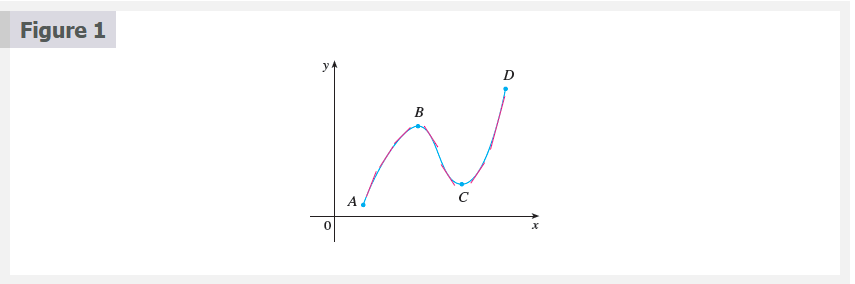

### Increasing/Decreasing Test

a. If $f^{\prime}(x) > 0$ on an interval, then $f$ is increasing on that interval.

b. If $f^{\prime}(x) < 0$on an interval, then $f$ is decreasing on that interval.

> **NOTE:** Let's abbreviate the name of this test to the I/D Test.

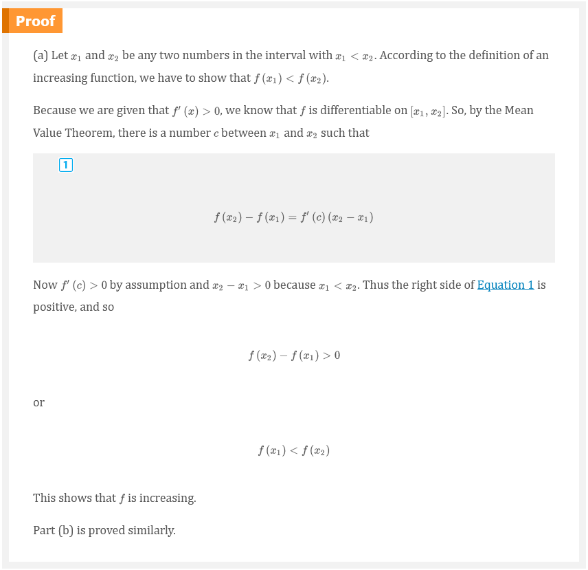

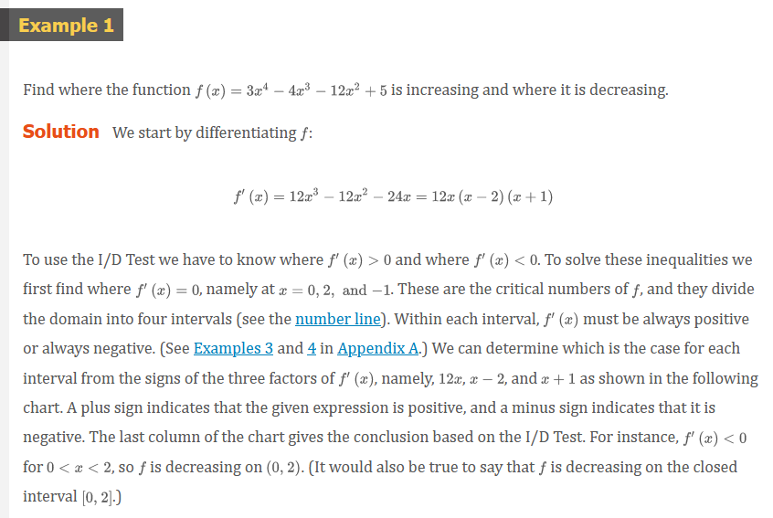
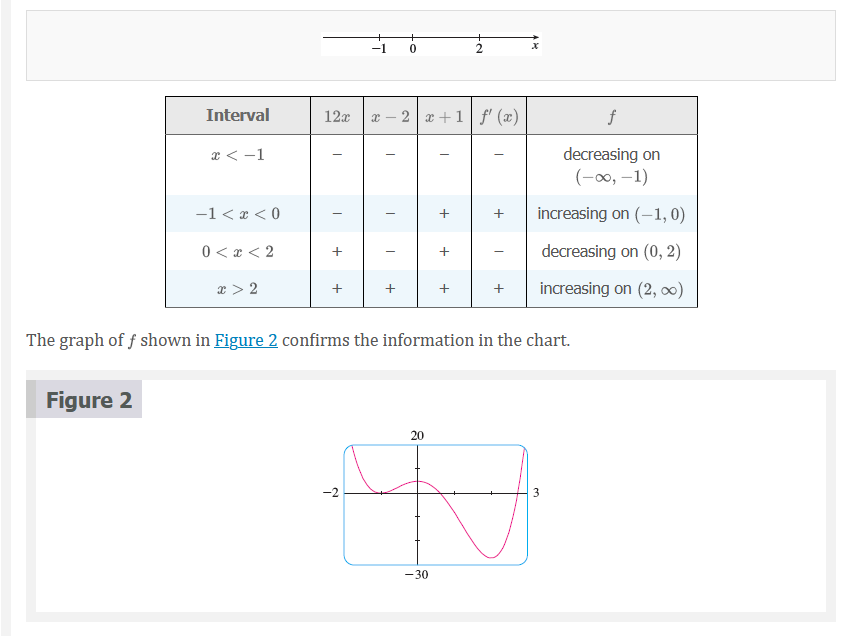

## Local Extreme Values

Recall from Section 4.1 that if $f$ has a local maximum or minimum at $c$, $c$
then must be a critical number of $f$ (by Fermat's Theorem), but not every
critical number gives rise to a maximum or a minimum. We therefore need a test
that will tell us whether or not $f$ has a local maximum or minimum at a
critical number.

You can see from Figure 2 that $f(0) = 5$ is a local maximum value of $f$
because $f$ increases on $(-1, 0)$ and decreases on $(0, 2)$. Or, in terms of
derivatives, $f^{\prime}(x) > 0$ for $-1 < x < 0$ and $f^{\prime}(x) < 0$ for $0
< x < 2$. In other words, the sign of $f^{\prime}(x)$ changes from positive to
negative at $0$. This observation is the basis of the following test.

### The First Derivative Test

Suppose that $c$ is a critical number of a continuous function $f$.

a. If $f^{\prime}$ changes from positive to negative at $c$, then $f$ has a
local maximum at $c$.

b. If $f^{\prime}$ changes from negative to positive at $c$, then $f$ has a
local minimum at $c$.

c. If $f^{\prime}$ is positive to the left and right of $c$, or negative to the
left and right of $c$, then $f$ has no local maximum or minimum at $c$.

The First Derivative Test is a consequence of the I/D Test. In part (a), for
instance, since the sign of $f^{\prime}(x)$ changes from positive to negative at
$c$, $f$ is increasing to the left of $c$ and decreasing to the right of $c$. It
follows that $f$ has a local maximum at $c$.

It is easy to remember the First Derivative Test by visualizing diagrams such as
those in Figure 3.

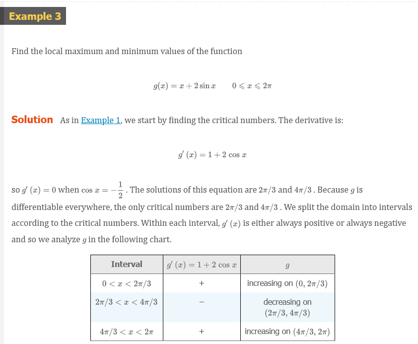
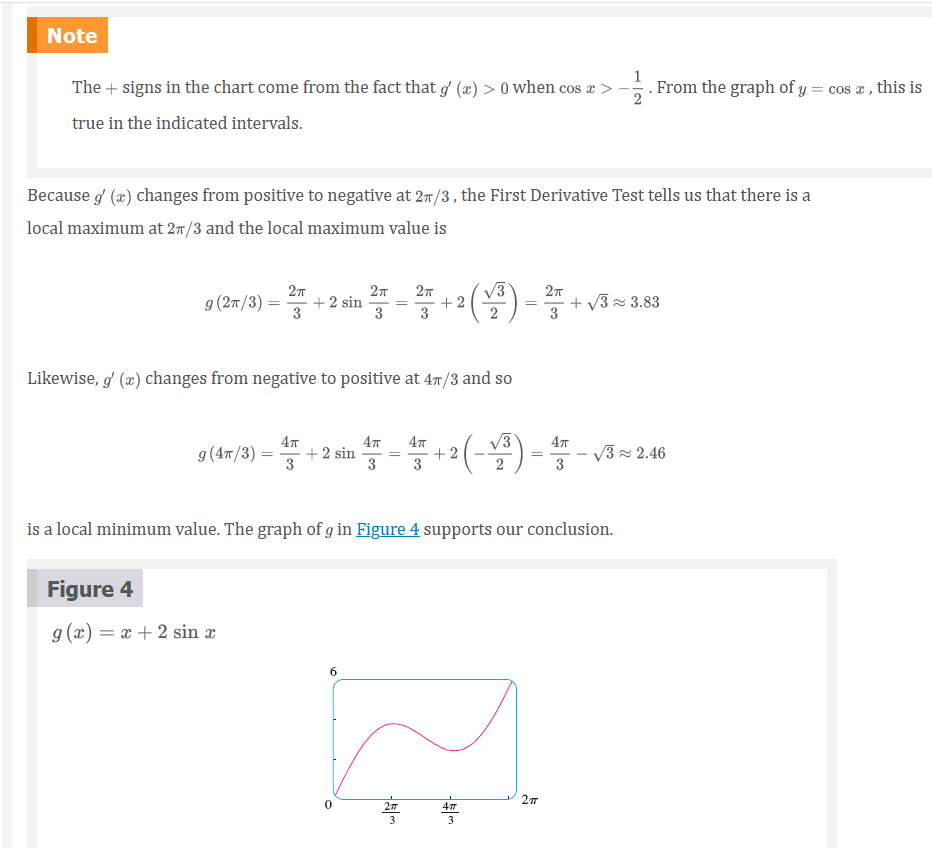

## What Does $f^{\prime \prime}$ Say about $f$?

Figure 5 shows the graphs of two increasing functions on $(a, b)$. Both graphs
join point $A$ to point $B$ but they look different because they bend in
different directions. How can we distinguish between these two types of
behavior?

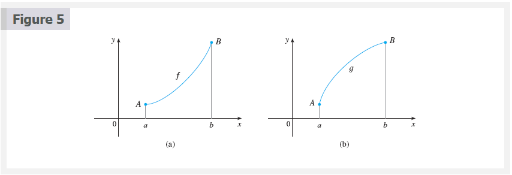

In Figure 6 tangents to these curves have been drawn at several points. In (a)
the curve lies above the tangents and $f$ is called _concave upward_ on $(a,
b)$. In (b) the curve lies below the tangents and $g$ is called _concave
downward_ on $(a, b)$.

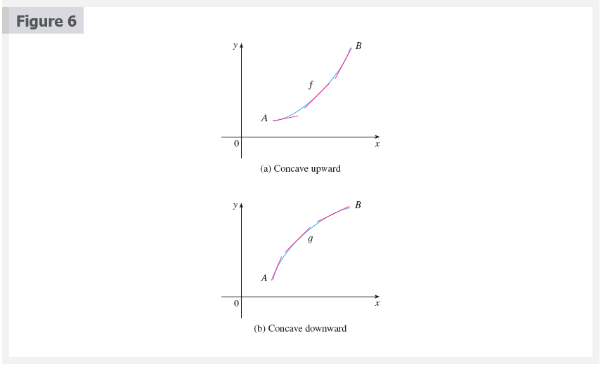

### Concave Upward and Downward Definition

If the graph of $f$ lies above all of its tangents on an interval $I$, then it
is called **concave upward** on $I$. If the graph of $f$ lies below all of its
tangents on $I$, it is called **concave downward** on $I$.

Figure 7 shows the graph of a function that is concave upward (abbreviated CU)
on the intervals $(b, c)$, $(d, e)$, and $(e, p)$ and concave downward (CD) on
the intervals $(a, b)$, $(c, d)$, and $(p, q)$.

### Concavity Test

a. If $f^{\prime \prime}$ for all $x$ in $I$, then the graph of $f$ is concave
upward on $I$.

b. If $f^{\prime \prime}$ for all $x$ in $I$, then the graph of $f$ is concave
downward on $I$.

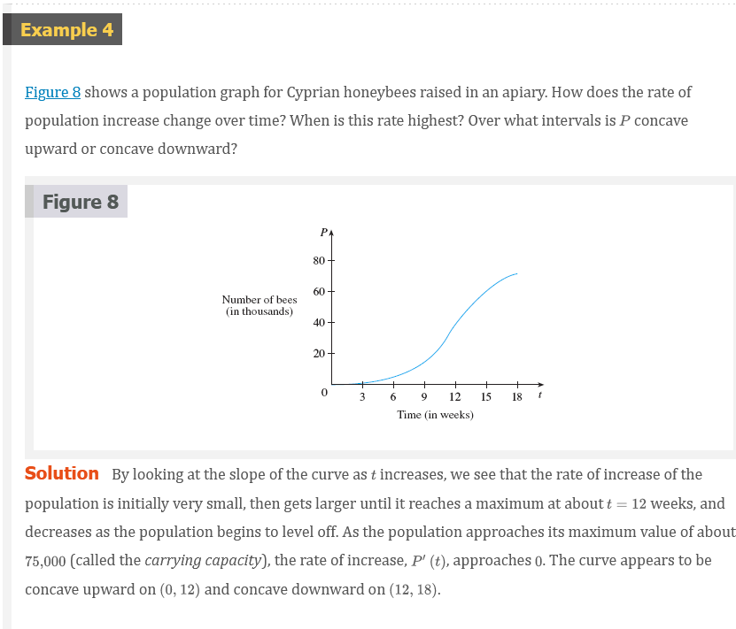

### Inflection Point Definition

A point $P$ on a curve $y = f(x)$ is called an inflection point if $f$ is
continuous there and the curve changes from concave upward to concave downward
or from concave downward to concave upward at $P$.

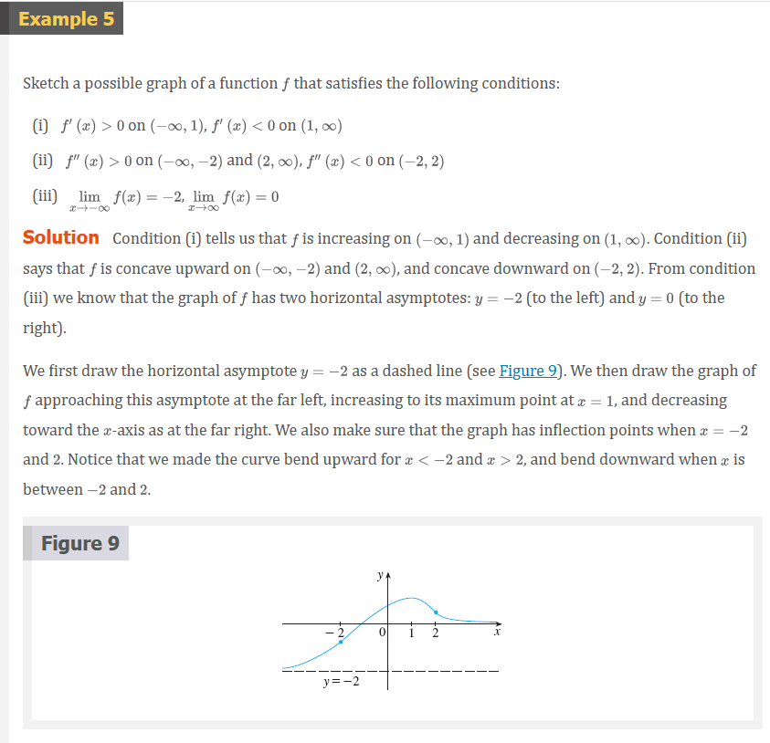

### The Second Derivative Test

Suppose $f^{\prime \prime}$ is continuous near $c$.

a. If $f^{\prime}(c) = 0$ and $f^{\prime \prime}(c) > 0$, then $f$ has a local
minimum at $c$.

b. If $f^{\prime}(c) = 0$ and $f^{\prime \prime}(c) < 0$, then $f$ has a local
maximum at $c$.

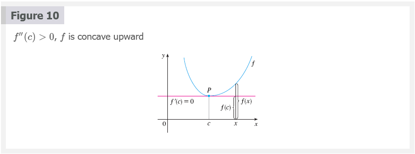

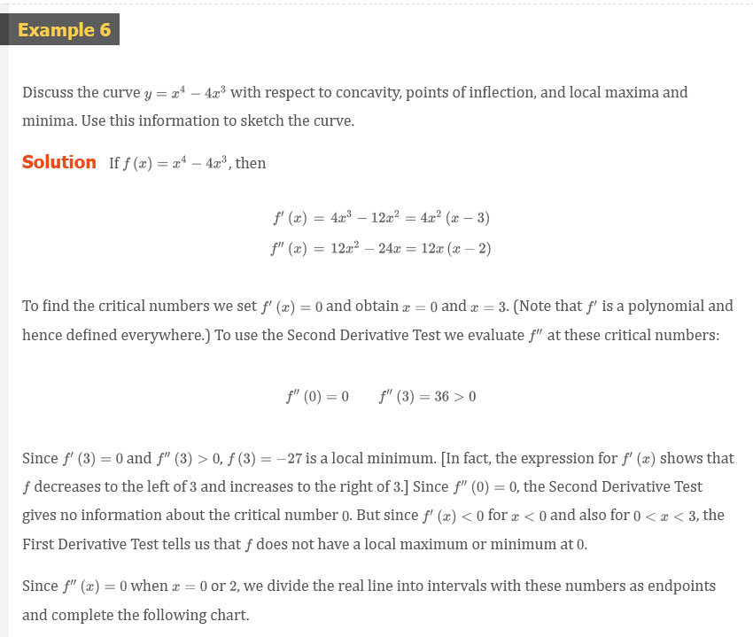
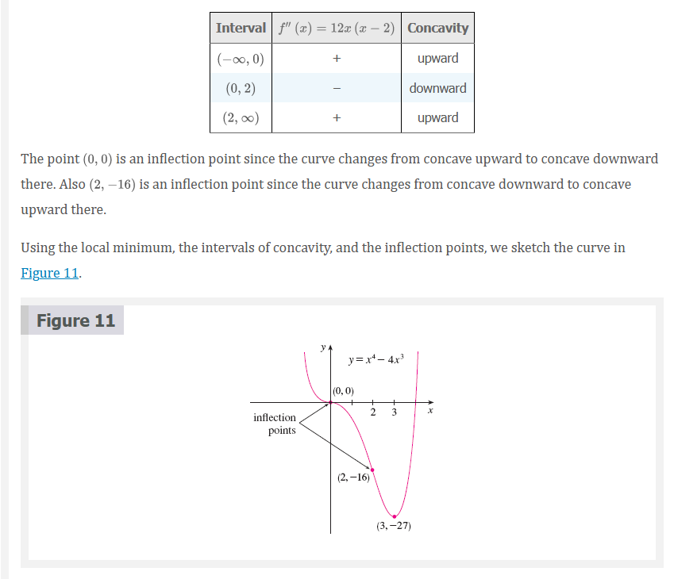

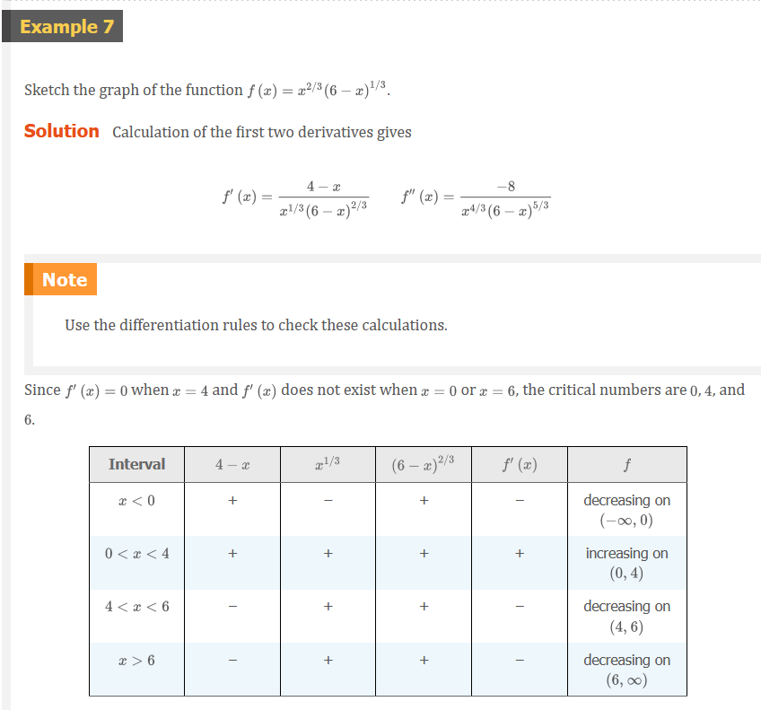
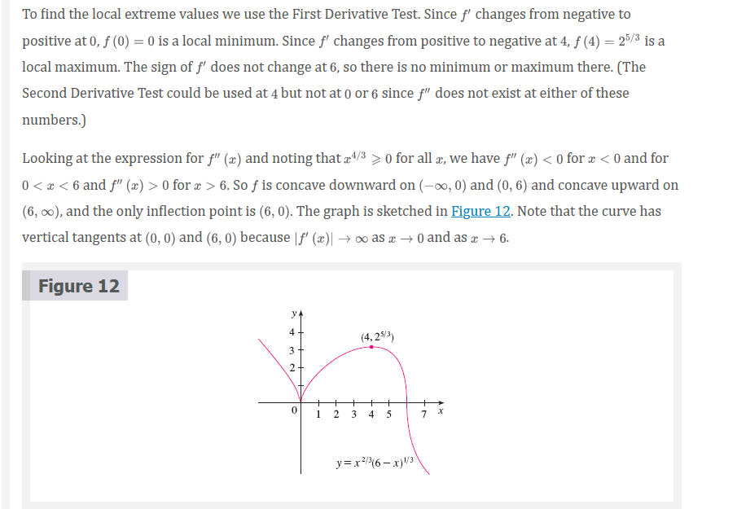
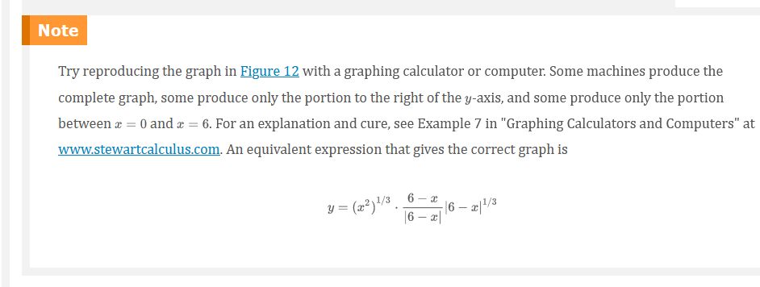

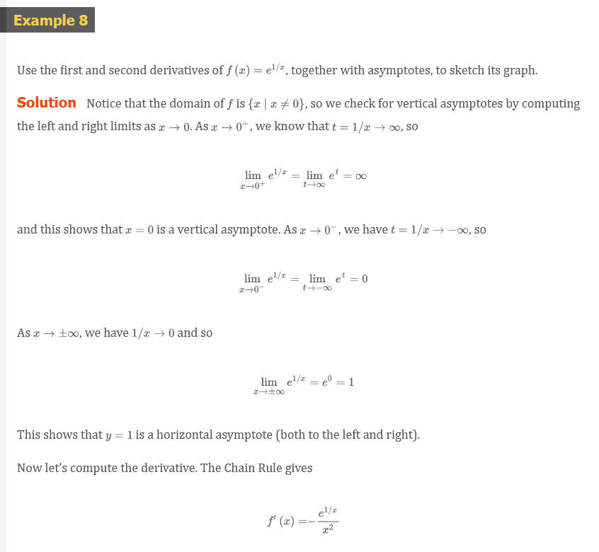
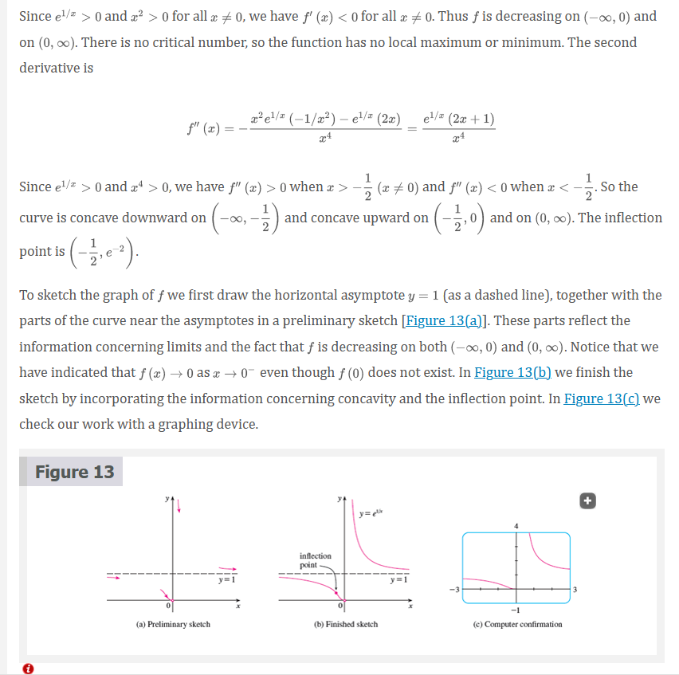

## Video Lectures

- [🎬 Finding decreasing interval given the function](https://www.khanacademy.org/math/ap-calculus-ab/ab-diff-analytical-applications-new/ab-5-3/v/increasing-decreasing-intervals-given-the-function)
- [🎬 Finding increasing interval given the derivative](https://www.khanacademy.org/math/ap-calculus-ab/ab-diff-analytical-applications-new/ab-5-3/v/finding-increasing-interval-given-derivative)
- [🌎 Increasing & decreasing intervals review](https://www.khanacademy.org/math/ap-calculus-ab/ab-diff-analytical-applications-new/ab-5-3/a/increasing-and-decreasing-intervals-review)
- [🎬 Concavity introduction](https://www.khanacademy.org/math/ap-calculus-ab/ab-diff-analytical-applications-new/ab-5-6a/v/concavity-concave-upwards-and-concave-downwards-intervals)
- [🎬 Analyzing concavity (graphical)](https://www.khanacademy.org/math/ap-calculus-ab/ab-diff-analytical-applications-new/ab-5-6a/v/recognizing-concavity-exercise)
- [🎬 Inflection points introduction](https://www.khanacademy.org/math/ap-calculus-ab/ab-diff-analytical-applications-new/ab-5-6a/v/inflection-points)
- [🎬 Inflection points (graphical)](https://www.khanacademy.org/math/ap-calculus-ab/ab-diff-analytical-applications-new/ab-5-6a/v/inflection-points-graphically-given-function)
- [🎬 Analyzing concavity (algebraic)](https://www.khanacademy.org/math/ap-calculus-ab/ab-diff-analytical-applications-new/ab-5-6b/v/analyzing-concavity-algebraically)
- [🎬 Inflection points (algebraic)](https://www.khanacademy.org/math/ap-calculus-ab/ab-diff-analytical-applications-new/ab-5-6b/v/inflection-points-algebraically)
- [🎬 Mistakes when finding inflection points: second derivative undefined](https://www.khanacademy.org/math/ap-calculus-ab/ab-diff-analytical-applications-new/ab-5-6b/v/mistakes-when-finding-inflection-points-second-derivative-undefined)
- [🎬 Mistakes when finding inflection points: not checking candidates](https://www.khanacademy.org/math/ap-calculus-ab/ab-diff-analytical-applications-new/ab-5-6b/v/mistakes-when-finding-inflection-points-not-checking-candidates)
- [🌎 Concavity review](https://www.khanacademy.org/math/ap-calculus-ab/ab-diff-analytical-applications-new/ab-5-6b/a/concavity-review)
- [🌎 Inflection points review](https://www.khanacademy.org/math/ap-calculus-ab/ab-diff-analytical-applications-new/ab-5-6b/a/inflection-points-review)
- [🎬 Second derivative test](https://www.khanacademy.org/math/ap-calculus-ab/ab-diff-analytical-applications-new/ab-5-7/v/second-derivative-test)

 

# Resources

- [🎬 Finding decreasing interval given the function](https://www.khanacademy.org/math/ap-calculus-ab/ab-diff-analytical-applications-new/ab-5-3/v/increasing-decreasing-intervals-given-the-function)
- [🎬 Finding increasing interval given the derivative](https://www.khanacademy.org/math/ap-calculus-ab/ab-diff-analytical-applications-new/ab-5-3/v/finding-increasing-interval-given-derivative)
- [🌎 Increasing & decreasing intervals review](https://www.khanacademy.org/math/ap-calculus-ab/ab-diff-analytical-applications-new/ab-5-3/a/increasing-and-decreasing-intervals-review)
- [🎬 Concavity introduction](https://www.khanacademy.org/math/ap-calculus-ab/ab-diff-analytical-applications-new/ab-5-6a/v/concavity-concave-upwards-and-concave-downwards-intervals)
- [🎬 Analyzing concavity (graphical)](https://www.khanacademy.org/math/ap-calculus-ab/ab-diff-analytical-applications-new/ab-5-6a/v/recognizing-concavity-exercise)
- [🎬 Inflection points introduction](https://www.khanacademy.org/math/ap-calculus-ab/ab-diff-analytical-applications-new/ab-5-6a/v/inflection-points)
- [🎬 Inflection points (graphical)](https://www.khanacademy.org/math/ap-calculus-ab/ab-diff-analytical-applications-new/ab-5-6a/v/inflection-points-graphically-given-function)
- [🎬 Analyzing concavity (algebraic)](https://www.khanacademy.org/math/ap-calculus-ab/ab-diff-analytical-applications-new/ab-5-6b/v/analyzing-concavity-algebraically)
- [🎬 Inflection points (algebraic)](https://www.khanacademy.org/math/ap-calculus-ab/ab-diff-analytical-applications-new/ab-5-6b/v/inflection-points-algebraically)
- [🎬 Mistakes when finding inflection points: second derivative undefined](https://www.khanacademy.org/math/ap-calculus-ab/ab-diff-analytical-applications-new/ab-5-6b/v/mistakes-when-finding-inflection-points-second-derivative-undefined)
- [🎬 Mistakes when finding inflection points: not checking candidates](https://www.khanacademy.org/math/ap-calculus-ab/ab-diff-analytical-applications-new/ab-5-6b/v/mistakes-when-finding-inflection-points-not-checking-candidates)
- [🌎 Concavity review](https://www.khanacademy.org/math/ap-calculus-ab/ab-diff-analytical-applications-new/ab-5-6b/a/concavity-review)
- [🌎 Inflection points review](https://www.khanacademy.org/math/ap-calculus-ab/ab-diff-analytical-applications-new/ab-5-6b/a/inflection-points-review)
- [🎬 Second derivative test](https://www.khanacademy.org/math/ap-calculus-ab/ab-diff-analytical-applications-new/ab-5-7/v/second-derivative-test)

Textbook

+ [🌎 Cengage e-Textbook: Calculus Early Transcendentals, Eighth Edition, Stewart](https://webassign.com/)

