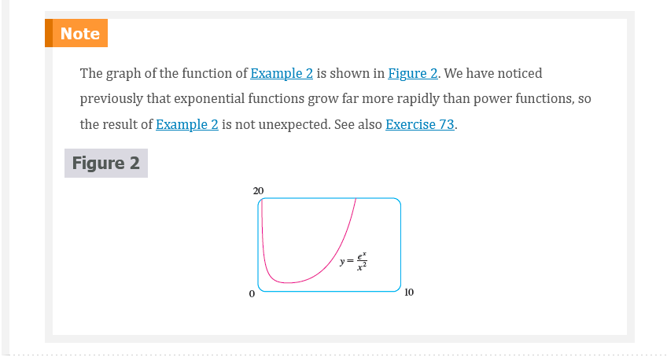
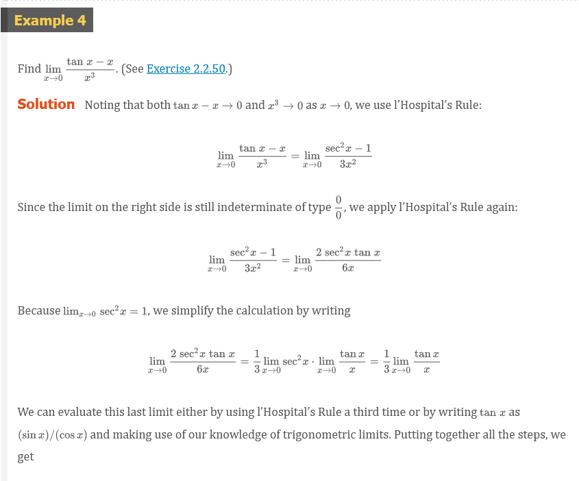
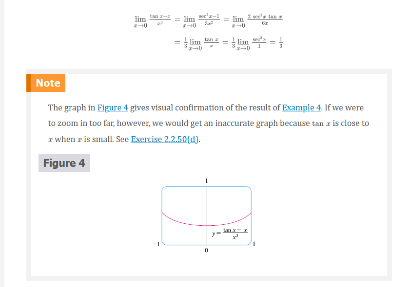
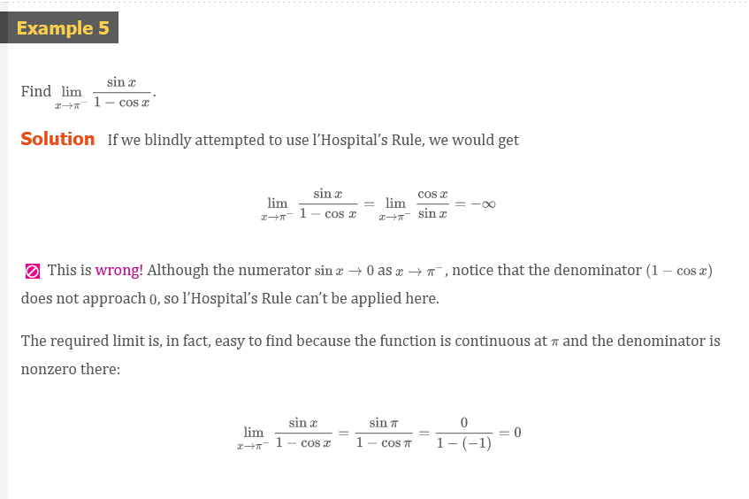
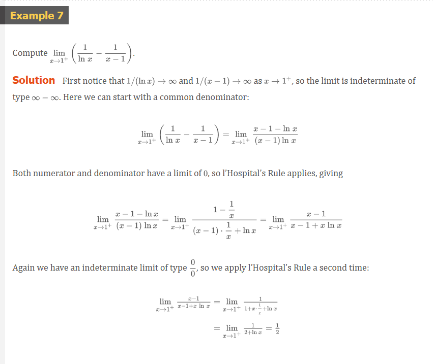
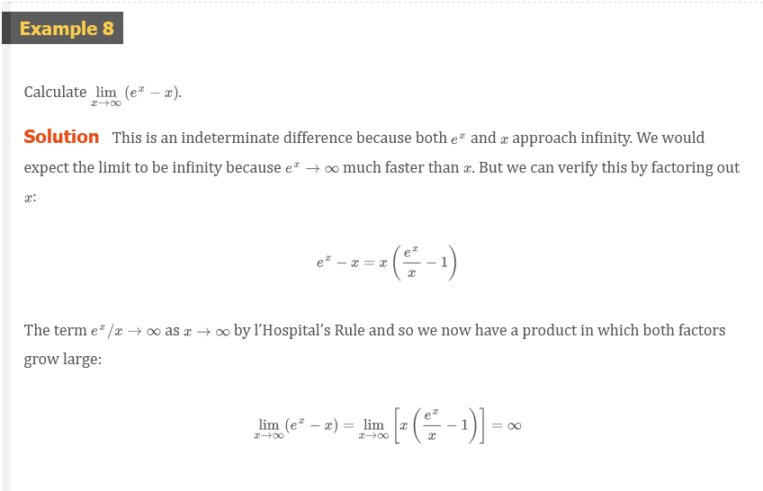

# Chapter 4: Indeterminate Forms and l'Hopital's Rule

## Indeterminate Forms and l'Hopital's Rule

Suppose we are trying to analyze the behavior of the function

$$
F(x) = \frac{\ln{x}}{x - 1}
$$

Although $F$ is not defined when $x = 1$, we need to know how $F$ behaves near
$1$. In particular, we would like to know the value of the limit

### Definition 1

$$
\lim_{x \to 1}\frac{\ln{x}}{x - 1}
$$

In computing this limit we can't apply Law 5 of limits (the limit of a quotient
is the quotient of the limits, see Section 2.3) because the limit of the
denominator is. In fact, although the limit in (1) exists, its value is not
obvious because both numerator and denominator approach and is not defined.

In general, if we have a limit of the form

$$
\lim_{x \to a}\frac{f(x)}{g(x)}
$$

where both $f(x) \to 0$ and $g(x) \to 0$ as $x \to a$, then this limit may or
may not exist and is called an **indeterminate form of type** $\frac{0}{0}$. We
met some limits of this type in Chapter 2. For rational functions, we can cancel
common factors:

$$
\lim_{x \to 1}\frac{x^{2} - x}{x^{2} - 1} = \lim_{x \to 1}\frac{x(x - 1)}{(x + 1)(x - 1)} = \lim_{x \to 1}\frac{x}{x + 1} = \frac{1}{2}
$$

We used a geometric argument to show that

$$
\lim_{x \to 0}\frac{\sin{x}}{x} = 1
$$

But these methods do not work for limits such as (1), so in this section we
introduce a systematic method, known as _l'Hopital's Rule_, for the evaluation
of indeterminate forms.

Another situation in which a limit is not obvious occurs when we look for a
horizontal asymptote $F$ of and need to evaluate the limit

### Definition 2

$$
\lim_{x \to \infty}\frac{\ln{x}}{x - 1}
$$

It isn't obvious how to evaluate this limit because both numerator and
denominator become large as $x \to \infty$. There is a struggle between
numerator and denominator. If the numerator wins, the limit will be $\infty$
(the numerator was increasing significantly faster than the denominator); if the
denominator wins, the answer will be. Or there may be some compromise, in which
case the answer will be some finite positive number.

In general, if we have a limit of the form

$$
\lim_{x \to a}\frac{f(x)}{g(x)}
$$

where both $f(x) \to \infty$ (or $-\infty$) and $g(x) \to \infty$ (or
$-\infty$), then the limit may or may not exist and is called an **indeterminate
form of type** $\infty/\infty$. We saw in Section 2.6 that this type of limit can be evaluated
for certain functions, including rational functions, by dividing numerator and
denominator by the highest power of that occurs in the denominator. For
instance,

$$
\lim_{x \to \infty}\frac{x^{2} - 1}{2x^{2} + 1} = \lim_{x \to \infty}\frac{1 - \frac{1}{x^{2}}}{2 + \frac{1}{x^{2}}} = \frac{1 - 0}{2 + 0} = \frac{1}{2}
$$

This method does not work for limits such as (2), but l’Hospital’s Rule also
applies to this type of indeterminate form.

### L'Hopital's Rule

Suppose $f$ and $g$ are differentiable and $g^{\prime}(x) \neq 0$ on an open
interval $I$ that contains $a$ (except possibly at $a$). Suppose that

$$
\lim_{x \to a}f(x) = 0
$$

and

$$
\lim_{x \to a}g(x) = 0
$$

or that

$$
\lim_{x \to a}f(x) = \pm \infty
$$

and

$$
\lim_{x \to a}g(x) = \pm \infty
$$

(In other words, we have an indeterminate form of type $\frac{0}{0}$ or
$\infty/\infty$.) Then

$$
\lim_{x \to a}\frac{f(x)}{g(x)} = \lim_{x \to a}\frac{f^{\prime}(x)}{g^{\prime}(x)}
$$

if the limit on the right side exists (or is $\infty$ or $-\infty$).

> **Note 1** L'Hopital's Rule says that the limit of a quotient of functions is
equal to the limit of the quotient of their derivatives, provided that the given
conditions are satisfied. It is especially important to verify the conditions
regarding the limits of $f$ and $g$ before using l'Hopital's Rule.

> **Note 2** L'Hopital's Rule is also valid for one-sided limits and for limits
at infinity or negative infinity; that is, "$x \to a$" can be replaced by any of
the symbols $x \to a^{+}$, $x \to a^{-}$, $x \to \infty$, or $x \to -\infty$.

> **Note 3** For the special case in which $f(a) = g(a) = 0$, $f^{\prime}$ and
$g^{\prime}$ are continuous, and $g^{\prime}(a) \neq 0$, it is easy to see why
l'hopital's Rule is true. In fact, using the alternative form of the definition
of a derivative, we have

$$
\begin{aligned}
\lim_{x \to a}\frac{f^{\prime}(x)}{g^{\prime}(x)} &= \frac{f^{\prime}(a)}{g^{\prime}(a)} = \frac{\lim_{x \to a}\frac{f(x) - f(a)}{x - a}}{\lim_{x \to a}\frac{g(x) - g(a)}{x - a}} = \lim_{x \to a}\frac{\frac{f(x) - f(a)}{x - a}}{\frac{g(x) - g(a)}{x - a}} \\
                                                  &= \lim_{x \to a}\frac{f(x) - f(a)}{g(x) - g(a)} = \lim_{x \to a}\frac{f(x)}{g(x)} \;\;\;\;\; {\color{#ff0000}{[\text{ since } f(a) = g(a) = 0}]} \end{aligned}
$$

## Indeterminate Products

If $\lim_{x \to a}f(x) = 0$ and $\lim_{x \to a}g(x) = \infty$ (or $-\infty$),
then it isn't clear what the value of $\lim_{x \to a}[f(x)g(x)]$, if any, will
be. There is a struggle between $f$ and $g$. If $f$ wins, the answer will be
$0$; if $g$ wins, the answer will be $\infty$ (or $-\infty$). Or there may be a
compromise where the answer is a finite nonzero number. This kind of limit is
called an **indeterminate form of type** \$0 \cdot \infty$ We can deal with it
by writing the product $fg$ as a quotient:

$$
fg = \frac{f}{1/g}
$$

or

$$
fg = \frac{g}{1/f}
$$

This converts the given limit into an indeterminate form of type $\frac{0}{0}$
or $\infty/\infty$ so that we can use l'hopital's Rule.

### L'Hopital

L'Hopital's Rule is named after a French nobleman, the Marquis de l'hopital
(1661–1704), but was discovered by a Swiss mathematician, John Bernoulli
(1667–1748). You might sometimes see l'hopital spelled as l'Hôpital, but he
spelled his own name l'hopital, as was common in the 17th century. See Exercise
83 for the example that the Marquis used to illustrate his rule. See the project
for further historical details.

## Indeterminate Differences

If $\lim_{x \to a}f(x) = \infty$ and $\lim_{x \to a}g(x) = \infty$, then the
limit

$$
\lim_{x \to a}[f(x) - g(x)]
$$

is called an **indeterminate form of type** $\infty - \infty$. Again there is a
contest between $f$ and $g$. Will the answer be $\infty$ ($f$ wins) or will it
be $-\infty$ ($g$ wins) or will they compromise on a finite number? To find out,
we try to convert the difference into a quotient (for instance, by using a
common denominator, or rationalization, or factoring out a common factor) so
that we have an indeterminate form of type $\frac{0}{0}$ or $\infty/\infty$.

## Indeterminate Powers

Several indeterminate forms arise from the limit

$$
\lim_{x \to a} = [f(x)]^{g(x)}
$$

1. $\lim_{x \to a}f(x) = 0 \;\;\;\;\; \text{ and } \;\;\;\;\;\; \lim_{x \to
   a}g(x) = 0 \;\;\;\;\; \text{ type } 0^{0}$
2. $\lim_{x \to a}f(x) = \infty \;\;\;\;\; \text{ and } \;\;\;\;\; \lim_{x \to
   a}g(x) = 0 \;\;\;\;\; \text{ type } \infty^{0}$
3. $\lim_{x \to a}f(x) = 1 \;\;\;\;\; \text{ and } \;\;\;\;\; \lim_{x \to a}g(x)
   = \pm \infty \;\;\;\;\; \text{ type } 1^{\infty}$

Each of these three cases can be treated either by taking the natural logarithm:

$$
\text{ let } y = [f(x)]^{g(x)}, \;\;\; \text{ then } \;\;\; \ln{y} = g(x)\ln{f(x)}
$$

or by writing the function as an exponential:

$$
[f(x)]^{g(x)} = e^{g(x)\ln{f(x)}}
$$

(Recall that both of these methods were used in differentiating such functions.)
In either method we are led to the indeterminate product $g(x)\ln{f(x)}$, which
is of type $0 \cdot \infty$.

> **Note** Although forms of the type $0^{0}\$, $\infty^{0}$, $1^{\infty}$ and
are indeterminate, the form $0^{\infty}$ is not indeterminate.

## Video Lectures

- [📺 L'Hôpital's rule introduction](https://www.khanacademy.org/math/ap-calculus-ab/ab-diff-contextual-applications-new/ab-4-7/v/introduction-to-l-hopital-s-rule)
- [📺 L'Hôpital's rule: limit at 0 example](https://www.khanacademy.org/math/ap-calculus-ab/ab-diff-contextual-applications-new/ab-4-7/v/l-hopital-s-rule-example-1)
- [📺 L'Hôpital's rule: limit at infinity example](https://www.khanacademy.org/math/ap-calculus-ab/ab-diff-contextual-applications-new/ab-4-7/v/l-hopital-s-rule-example-2)

 

# Resources

- [📺 L'Hôpital's rule introduction](https://www.khanacademy.org/math/ap-calculus-ab/ab-diff-contextual-applications-new/ab-4-7/v/introduction-to-l-hopital-s-rule)
- [📺 L'Hôpital's rule: limit at 0 example](https://www.khanacademy.org/math/ap-calculus-ab/ab-diff-contextual-applications-new/ab-4-7/v/l-hopital-s-rule-example-1)
- [📺 L'Hôpital's rule: limit at infinity example](https://www.khanacademy.org/math/ap-calculus-ab/ab-diff-contextual-applications-new/ab-4-7/v/l-hopital-s-rule-example-2)

Textbook

+ [📄 Cengage e-Textbook: Calculus Early Transcendentals, Eighth Edition, Stewart](https://webassign.com/)

