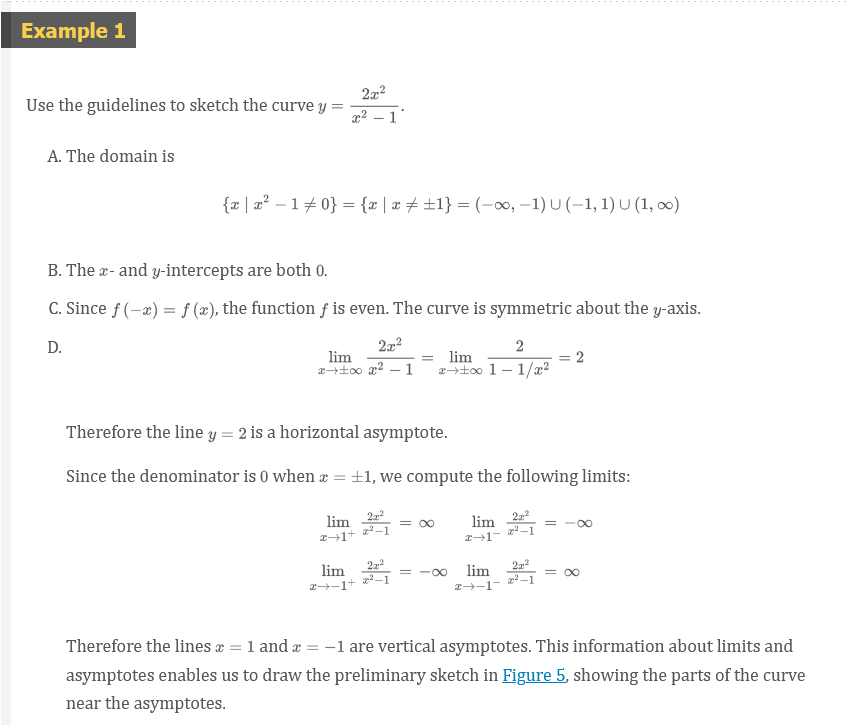
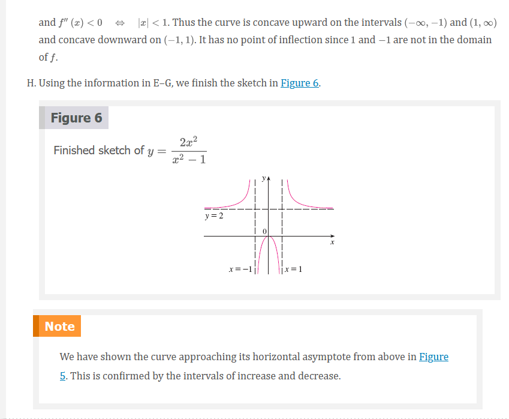
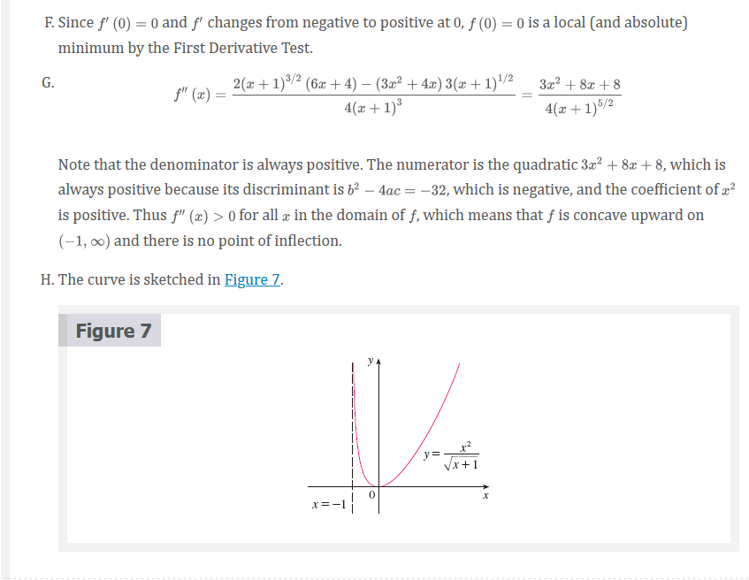
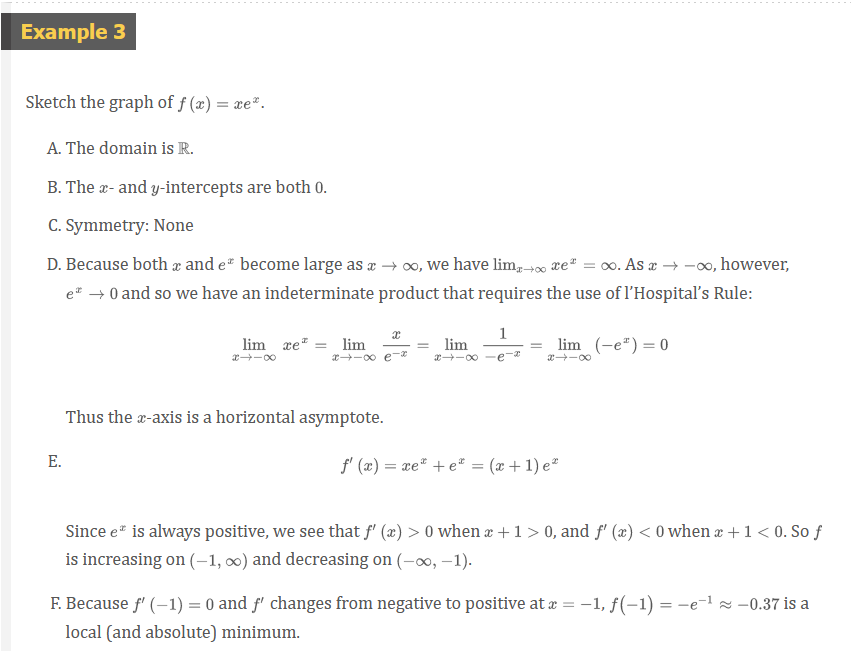
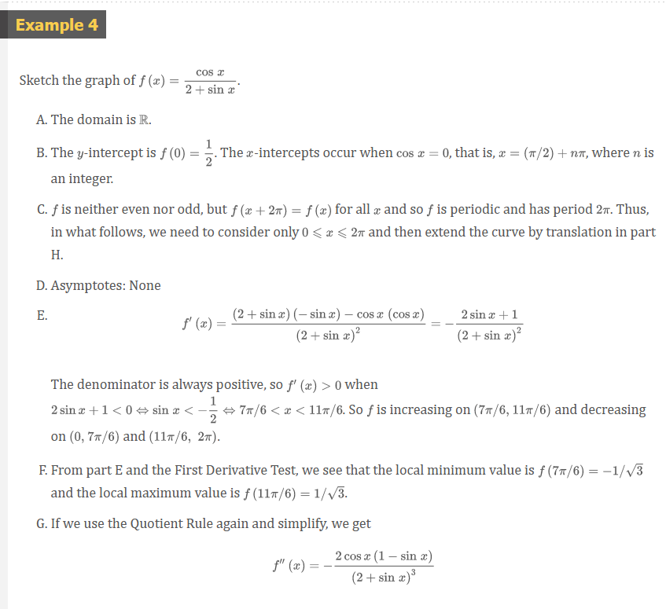
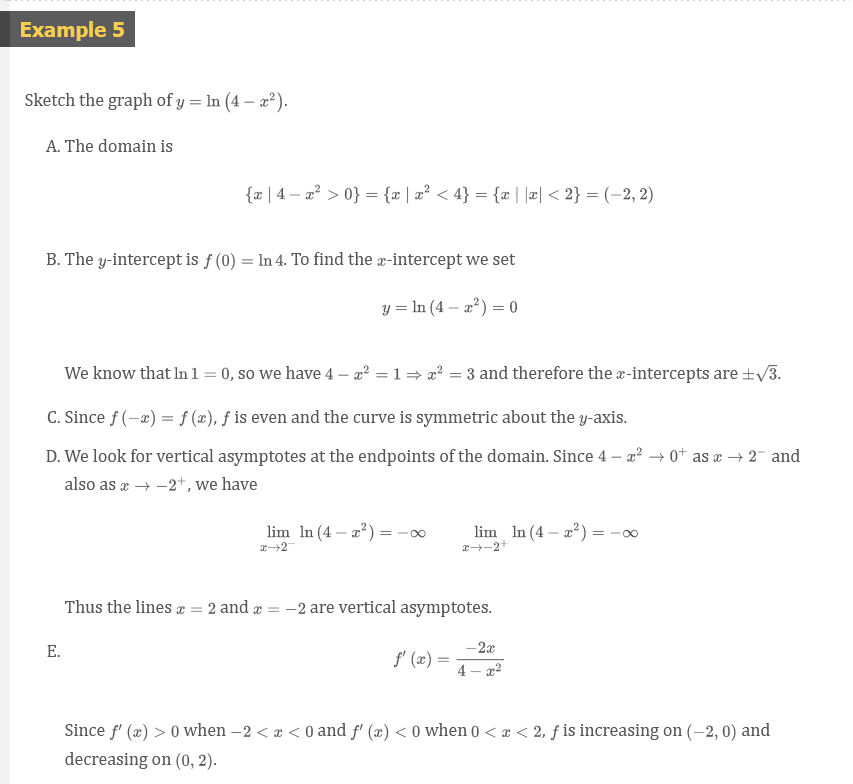
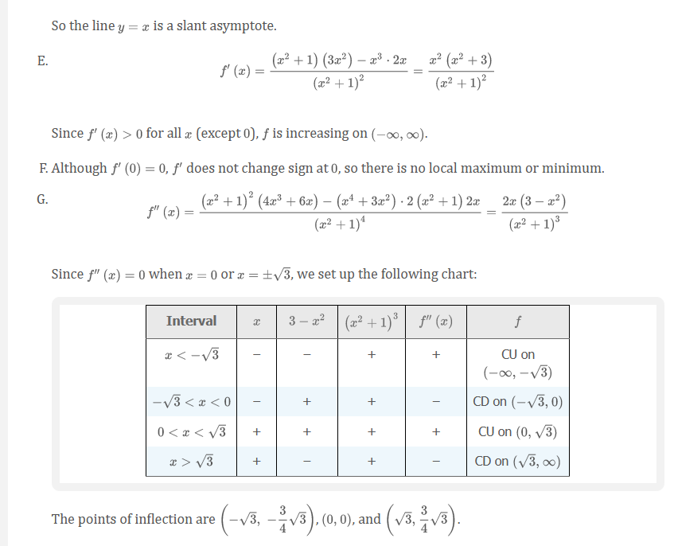
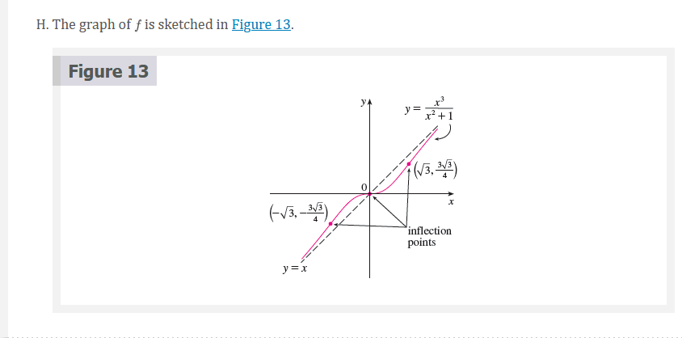

# Chapter 4.5: Summary of Curve Sketching

## Summary of Curve Sketching

So far we have been concerned with some particular aspects of curve sketching:
domain, range, and symmetry in Chapter 1; limits, continuity, and asymptotes in
Chapter 2; derivatives and tangents in Chapters 2 and 3; and extreme values,
intervals of increase and decrease, concavity, points of inflection, and
l'Hospital's Rule in this chapter. It is now time to put all of this information
together to sketch graphs that reveal the important features of functions.

You might ask: Why don't we just use a graphing calculator or computer to graph
a curve? Why do we need to use calculus?

It's true that modern technology is capable of producing very accurate graphs.
But even the best graphing devices have to be used intelligently. It is easy to
arrive at a misleading graph, or to miss important details of a curve, when
relying solely on technology. (See "Graphing Calculators and Computers" at [🌎
stewartcalculus.com](https://www.stewartcalculus.com), especially Examples 1, 3,
4, and 5. See also Section 4.6.) The use of calculus enables us to discover the
most interesting aspects of graphs and in many cases to calculate maximum and
minimum points and inflection points exactly instead of approximately.

For instance, Figure 1 shows the graph of $f(x) = 8x^{3} - 21x^{2} + 18x + 2$.
At first glance it seems reasonable: It has the same shape as cubic curves like
$y = x^{3}$, and it appears to have no maximum or minimum point. But if you
compute the derivative, you will see that there is a maximum when $x = 0.75$ and
a minimum when $x = 1$. Indeed, if we zoom in to this portion of the graph, we
see that behavior exhibited in Figure 2. Without calculus, we could easily have
overlooked it.

## Guidelines for Sketching a Curve

The following checklist is intended as a guide to sketching a curve $y = f(x)$
by hand. Not every item is relevant to every function. (For instance, a given
curve might not have an asymptote or possess symmetry.) But the guidelines
provide all the information you need to make a sketch that displays the most
important aspects of the function.

1. Domain It's often useful to start by determining the domain $D$ of $f$, that
   is, the set of values of for which $f(x)$ is defined.
2. Intercepts The $y$-intercept is $f(0)$ and this tells us where the curve
   intersects the $y$-axis. To find the $x$-intercepts, we set $y = 0$ and solve
   for $x$. (You can omit this step if the equation is difficult to solve.)
3. Symmetry
  - (i) If $f(-x) = f(x)$ for all $x$ in $D$, that is, the equation of the curve
    is unchanged when $x$ is replaced by $-x$, then $f$ is an even function and
    the curve is symmetric about the $y$-axis. This means that our work is cut
    in half. If we know what the curve looks like for $x \ge 0$, then we need
    only reflect about the -axis to obtain the complete curve [see Figure 3(a)].
    Here are some examples: $y = x^{2}$, $y = x^{4}$, $y = |x|$, and $y =
    \cos{x}$.  
  - (ii) If $f(x + p) = f(x)$ for all $x$ in $D$, then $f$ is an **odd
    function** and the curve is symmetric about the origin. Again we can obtain
    the complete curve if we know what it looks like for $x \ge 0$. [Rotate
    $180^{\circ}$ about the origin; see Figure 3(b).] Some simple examples of
    odd functions are $y =x$, $y = x^{3}$, $y = x^{5}$, and $y = \sin{x}$.
  - (iii) If $f(x + p) = f(x)$ for all $x$ in $D$, where $p$ is a positive
    constant, then $f$ is called a **periodic function** and the smallest such
    number $p$ is called the **period**. For instance, $y = \sin{x}$ has period
    $2 \pi$ and $y = \tan{x}$ has period $\pi$. If we know what the graph looks
    like in an interval of length $p$, then we can use translation to sketch the
    entire graph (see Figure 4). 
4. Asymptotes
  - (i) Horizontal Asymptotes. Recall from Section 2.6 that if either $\lim_{x
    \to \infty}f(x) = L$ or $\lim_{x \to -\infty}f(x) = L$, then the line $y =
    L$ is a horizontal asymptote of the curve $y = f(x)$. If it turns out that
    $\lim_{x \to -\infty}f(x) = \infty$ (or $-\infty$), then we do not have an
    asymptote to the right, but this fact is still useful information for
    sketching the curve.
  - (ii) Vertical Asymptotes. Recall from Section 2.2 that the line $x = a$ is a
    vertical asymptote if at least one of the following statements is true:

$$
\lim_{x \to a^{+}}f(x) = \infty \;\;\; \lim_{x \to a^{-}}f(x) = \infty
~\\
\lim_{x \to a^{+}}f(x) = -\infty \;\;\; \lim_{x \to a^{-}}f(x) = -\infty
$$

  - (iii) _Slant Asymptotes_. These are discussed at the end of this section.

5. **Intervals of Increase or Decrease** Use the I/D Test. Compute
   $f^{\prime}(x)$ and find the intervals on which $f^{\prime}(x)$ is positive
   ($f$ is increasing) and the intervals on which $f^{\prime}(x)$ is negative
   ($f$ is decreasing).
6. **Local Maximum and Minimum Values** Find the critical numbers of $f$ [the
   numbers $c$ where $f^{\prime}(c) = 0$ or $f^{\prime}(c)$ does not exist].
   Then use the First Derivative Test. If $f^{\prime}$ changes from positive to
   negative at a critical number $c$, then $f(c)$ is a local maximum. If
   $f^{\prime}$ changes from negative to positive at $c$, then $f(c)$ is a local
   minimum. Although it is usually preferable to use the First Derivative Test,
   you can use the Second Derivative Test if $f^{\prime}(c) = 0$ and $f^{\prime
   \prime}(c) \neq 0$. Then $f^{\prime \prime}(c) > 0$ implies that $f(c)$ is a
   local minimum, whereas $f^{\prime \prime}(c) < 0$ implies that $f(c)$ is a
   local maximum.
7. **Concavity and Points of Inflection** Compute $f^{\prime \prime}(x)$ and use
   the Concavity Test. The curve is concave upward where $f^{\prime \prime}(x) >
   0$ and concave downward where $f^{\prime \prime}(x) < 0$. Inflection points
   occur where the direction of concavity changes.
8. **Sketch the Curve** Using the information in items A–G, draw the graph.
   Sketch the asymptotes as dashed lines. Plot the intercepts, maximum and
   minimum points, and inflection points. Then make the curve pass through these
   points, rising and falling according to E, with concavity according to G, and
   approaching the asymptotes. If additional accuracy is desired near any point,
   you can compute the value of the derivative there. The tangent indicates the
   direction in which the curve proceeds.

## Slant Asymptotes

Some curves have asymptotes that are oblique, that is, neither horizontal nor
vertical. If

$$
\lim_{x \to \infty}[f(x) - (mx + b)] = 0
$$

where $m \neq 0$, then the line $y = mx + bj $is called a **slant asymptote**
because the vertical distance between the curve $y = f(x)$ and the line $y = mx
+ b$ approaches $0$, as in Figure 12. (A similar situation exists if we let $x
\to -\infty$.) For rational functions, slant asymptotes occur when the degree of
the numerator is one more than the degree of the denominator. In such a case the
equation of the slant asymptote can be found by long division as in the
following example.

## Video Lectures

- [🎬 Curve sketching with calculus: polynomial](https://www.khanacademy.org/math/ap-calculus-ab/ab-diff-analytical-applications-new/ab-5-8/v/calculus-graphing-using-derivatives)
- [🎬 Curve sketching with calculus: logarithm](https://www.khanacademy.org/math/ap-calculus-ab/ab-diff-analytical-applications-new/ab-5-8/v/calculus-graphing-with-derivatives-example)
- [🎬 Analyzing a function with its derivative](https://www.khanacademy.org/math/ap-calculus-ab/ab-diff-analytical-applications-new/ab-5-8/v/analyzing-a-function-with-its-derivative)

Optionals

- [🌎 Calculus-based justification for function increasing](https://www.khanacademy.org/math/ap-calculus-ab/ab-diff-analytical-applications-new/ab-5-9/v/calculus-based-justification-for-function-increasing)
- [🎬 Justification using first derivative](https://www.khanacademy.org/math/ap-calculus-ab/ab-diff-analytical-applications-new/ab-5-9/v/justification-using-first-derivative)
- [🌎 Justification using first derivative](https://www.khanacademy.org/math/ap-calculus-ab/ab-diff-analytical-applications-new/ab-5-9/a/review-justification-using-first-derivative)
- [🎬 Inflection points from graphs of function & derivatives](https://www.khanacademy.org/math/ap-calculus-ab/ab-diff-analytical-applications-new/ab-5-9/v/identifying-inflection-points-from-graphs-of-function-and-derivatives)
- [🎬 Justification using second derivative: inflection point](https://www.khanacademy.org/math/ap-calculus-ab/ab-diff-analytical-applications-new/ab-5-9/v/justification-for-inflection-point)
- [🎬 Justification using second derivative: maximum point](https://www.khanacademy.org/math/ap-calculus-ab/ab-diff-analytical-applications-new/ab-5-9/v/calculus-based-justification-using-second-derivative-max)
- [🌎 Justification using second derivative](https://www.khanacademy.org/math/ap-calculus-ab/ab-diff-analytical-applications-new/ab-5-9/a/justification-using-second-derivative)
- [🎬 Connecting $f$, $f^{\prime}$, and $f^{\prime \prime}$ graphically](https://www.khanacademy.org/math/ap-calculus-ab/ab-diff-analytical-applications-new/ab-5-9/v/connecting-function-and-derivatives-graphically)
- [🎬 Connecting $f$, $f^{\prime}$, and $f^{\prime \prime}$ graphically (another example)](https://www.khanacademy.org/math/ap-calculus-ab/ab-diff-analytical-applications-new/ab-5-9/v/connecting-function-and-derivatives-graphically-exp)

 

# Resources

- [🌎 stewartcalculus.com](https://www.stewartcalculus.com)
- [🎬 Curve sketching with calculus: polynomial](https://www.khanacademy.org/math/ap-calculus-ab/ab-diff-analytical-applications-new/ab-5-8/v/calculus-graphing-using-derivatives)
- [🎬 Curve sketching with calculus: logarithm](https://www.khanacademy.org/math/ap-calculus-ab/ab-diff-analytical-applications-new/ab-5-8/v/calculus-graphing-with-derivatives-example)
- [🎬 Analyzing a function with its derivative](https://www.khanacademy.org/math/ap-calculus-ab/ab-diff-analytical-applications-new/ab-5-8/v/analyzing-a-function-with-its-derivative)
- [🌎 Calculus-based justification for function increasing](https://www.khanacademy.org/math/ap-calculus-ab/ab-diff-analytical-applications-new/ab-5-9/v/calculus-based-justification-for-function-increasing)
- [🎬 Justification using first derivative](https://www.khanacademy.org/math/ap-calculus-ab/ab-diff-analytical-applications-new/ab-5-9/v/justification-using-first-derivative)
- [🌎 Justification using first derivative](https://www.khanacademy.org/math/ap-calculus-ab/ab-diff-analytical-applications-new/ab-5-9/a/review-justification-using-first-derivative)
- [🎬 Inflection points from graphs of function & derivatives](https://www.khanacademy.org/math/ap-calculus-ab/ab-diff-analytical-applications-new/ab-5-9/v/identifying-inflection-points-from-graphs-of-function-and-derivatives)
- [🎬 Justification using second derivative: inflection point](https://www.khanacademy.org/math/ap-calculus-ab/ab-diff-analytical-applications-new/ab-5-9/v/justification-for-inflection-point)
- [🎬 Justification using second derivative: maximum point](https://www.khanacademy.org/math/ap-calculus-ab/ab-diff-analytical-applications-new/ab-5-9/v/calculus-based-justification-using-second-derivative-max)
- [🌎 Justification using second derivative](https://www.khanacademy.org/math/ap-calculus-ab/ab-diff-analytical-applications-new/ab-5-9/a/justification-using-second-derivative)
- [🎬 Connecting $f$, $f^{\prime}$, and $f^{\prime \prime}$ graphically](https://www.khanacademy.org/math/ap-calculus-ab/ab-diff-analytical-applications-new/ab-5-9/v/connecting-function-and-derivatives-graphically)
- [🎬 Connecting $f$, $f^{\prime}$, and $f^{\prime \prime}$ graphically (another example)](https://www.khanacademy.org/math/ap-calculus-ab/ab-diff-analytical-applications-new/ab-5-9/v/connecting-function-and-derivatives-graphically-exp)

Textbook

+ [🌎 Cengage e-Textbook: Calculus Early Transcendentals, Eighth Edition, Stewart](https://webassign.com/)

