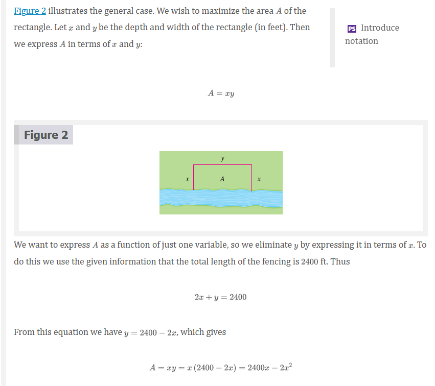
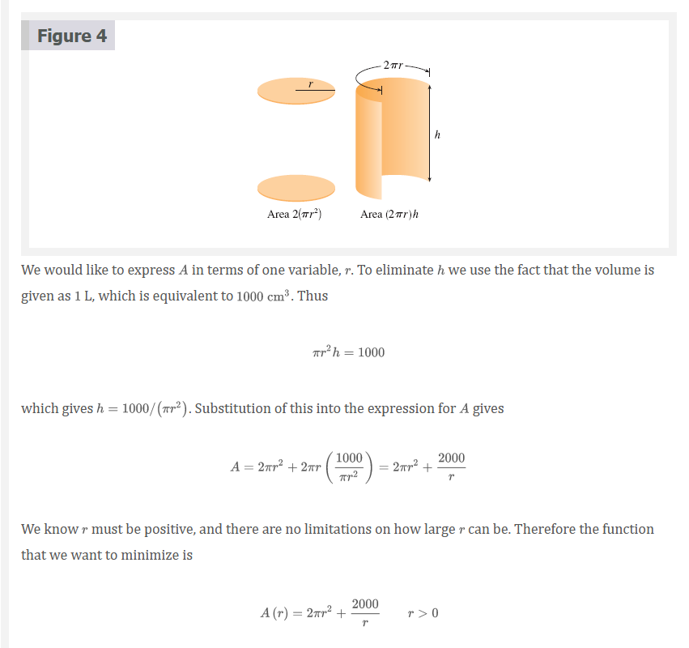
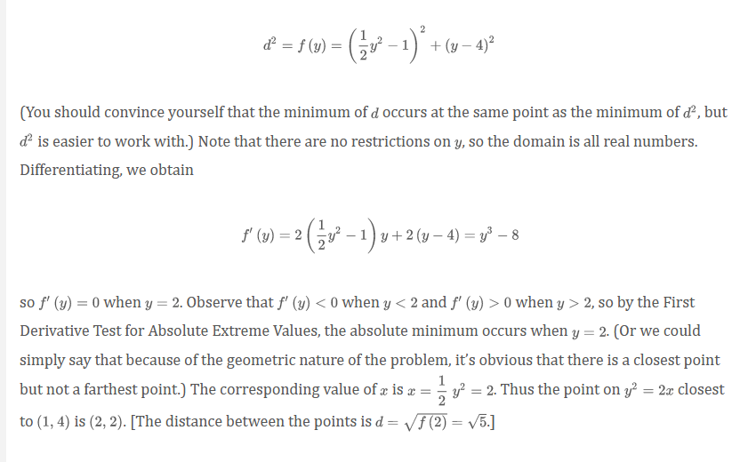
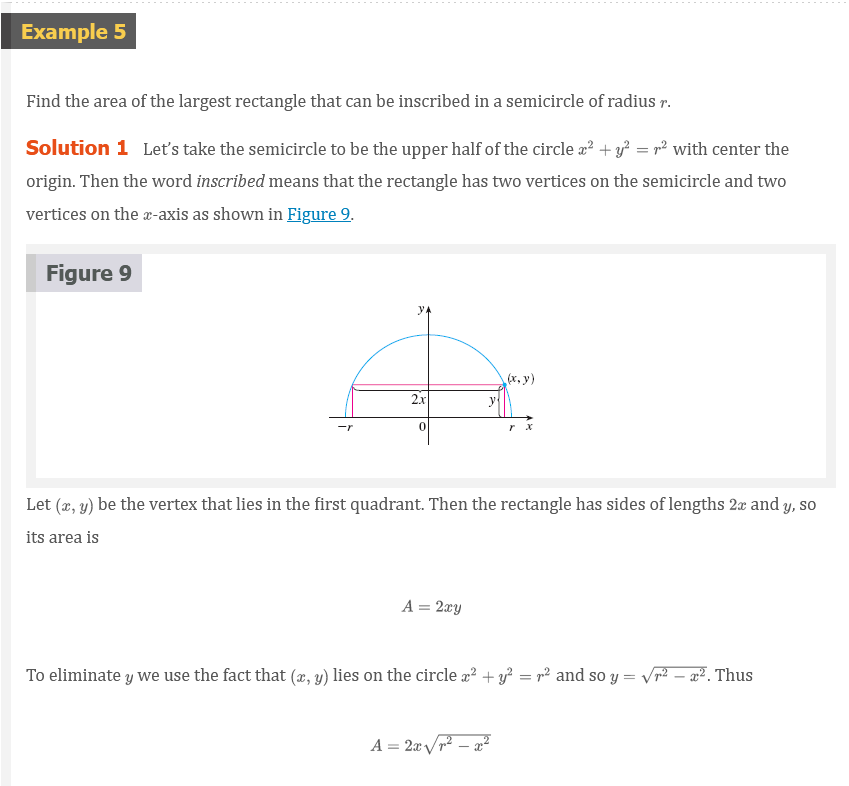
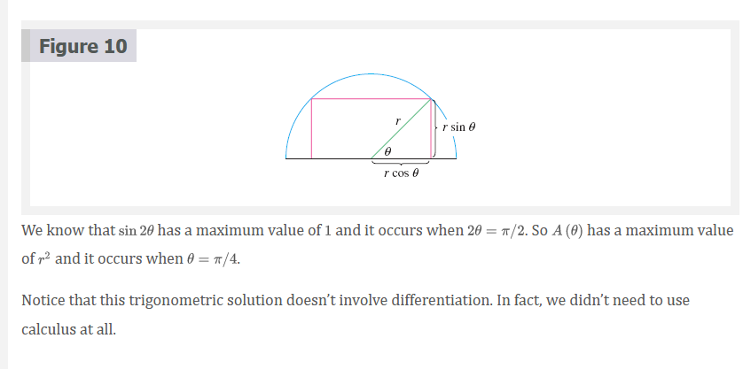

# Chapter 4.7: Optimization Problems

## Optimization Problems

> Steps in Solving Optimization Problems

1. **Understand the Problem** The first step is to read the problem carefully
   until it is clearly understood. Ask yourself: What is the unknown? What are
   the given quantities? What are the given conditions?
2. **Draw a Diagram** In most problems it is useful to draw a diagram and
   identify the given and required quantities on the diagram.
3. **Introduce Notation** Assign a symbol to the quantity that is to be
   maximized or minimized (let's call it $Q$ for now). Also select symbols $(a,
   b, c, ..., x, y)$ for other unknown quantities and label the diagram with
   these symbols. It may help to use initials as suggestive symbols--for
   example, $A$ for area, $h$ for height, $t$ for time.
4. Express $Q$ in terms of some of the other symbols from Step 3.
5. If $Q$ has been expressed as a function of more than one variable in Step 4,
   use the given information to find relationships (in the form of equations)
   among these variables. Then use these equations to eliminate all but one of
   the variables in the expression for $Q$. Thus $Q$ will be expressed as a
   function of one variable $x$, say, $Q = f(x)$. Write the domain of this
   function in the given context.
6. Use the methods of Sections 4.1 and Sections 4.3 to find the _absolute
   maximum_ or _minimum value_ of $f$. In particular, if the domain of $f$ is a
   closed interval, then the Closed Interval Method in Section 4.1 can be used.

### First Derivative Test for Absolute Extreme Values

Suppose that $c$ is a critical number of a continuous function $f$ defined on an
interval.

(a) If $f^{\prime}(x) > 0$ for all $x < c$ and $f^{\prime}(x) < 0$ for all $x >
c$, then $f(c)$ is the absolute maximum value of $f$.

(b) If $f^{\prime}(x) > 0$ for all $x < c$ and $f^{\prime}(x) > 0$ for all $x >
c$, then $f(c)$ is the absolute minimum value of $f$.

> **Note:** An alternative method for solving optimization problems is to use
implicit differentiation. Let’s look at Example 2 again to illustrate the
method. We work with the same equations

$$
A = 2 \pi r^{2} + 2 \pi rh \;\;\;\;\; \pi r^{2}h = 1000
$$

but instead of eliminating $h$, we differentiate both equations implicitly with
respect to $r$:

$$
A^{\prime} = 4 \pi r + 2 \pi rh^{\prime} + 2 \pi h \;\;\;\;\; \pi r^{2}h^{\prime} + 2 \pi rh = 0
$$

The minimum occurs at a critical number, so we set $A^{\prime} = 0$, simplify,
and arrive at the equations

$$
2r + rh^{\prime} + h = 0 \;\;\;\;\; rh^{\prime} + 2h = 0
$$

and subtraction gives $2r - h = 0$, or $h = 2r$.

## Applications to Business and Economics

In Section 3.7 we introduced the idea of marginal cost. Recall that if $C(x)$,
the cost function, is the cost of producing $x$ units of a certain product, then
the **marginal cost** is the rate of change of $C$ with respect to $x$. In other
words, the marginal cost function is the derivative, $C^{\prime}(x)$, of the
cost function.

Now let's consider marketing. Let $p(x)$ be the price per unit that the company
can charge if it sells $x$ units. Then $p$ is called the **demand function** (or
**price function**) and we would expect it to be a decreasing function of $x$.
(More units sold corresponds to a lower price.) If $x$ units are sold and the
price per unit is $p(x)$, then the total revenue is

$$
R(x) = \text{ quantity } \times \text{ price } = xp(x)
$$

and $R$ is called the **revenue function**. The derivative $R^{\prime}$ of the
revenue function is called the **marginal revenue function** and is the rate of
change of revenue with respect to the number of units sold.

If $x$ units are sold, then the total profit is

$$
P(x) = R(x) - C(x)
$$

and $P$ is called the **profit function**. The **marginal profit function** is
$P^{\prime}$, the derivative of the profit function.

## Video Lectures

- [🎬 Optimization: sum of squares](https://www.khanacademy.org/math/ap-calculus-ab/ab-diff-analytical-applications-new/ab-5-11/v/minimizing-sum-of-squares)
- [🎬 Optimization: box volume (Part 1)](https://www.khanacademy.org/math/ap-calculus-ab/ab-diff-analytical-applications-new/ab-5-11/v/optimizing-box-volume-graphically)
- [🎬 Optimization: box volume (Part 2)](https://www.khanacademy.org/math/ap-calculus-ab/ab-diff-analytical-applications-new/ab-5-11/v/optimizing-box-volume-analytically)
- [🎬 Optimization: profit](https://www.khanacademy.org/math/ap-calculus-ab/ab-diff-analytical-applications-new/ab-5-11/v/optimizing-profit-at-a-shoe-factory)
- [🎬 Optimization: cost of materials](https://www.khanacademy.org/math/ap-calculus-ab/ab-diff-analytical-applications-new/ab-5-11/v/minimizing-the-cost-of-a-storage-container)
- [🎬 Optimization: area of triangle & square (Part 1)](https://www.khanacademy.org/math/ap-calculus-ab/ab-diff-analytical-applications-new/ab-5-11/v/expression-for-combined-area-of-triangle-and-square)
- [🎬 Optimization: area of triangle & square (Part 2)](https://www.khanacademy.org/math/ap-calculus-ab/ab-diff-analytical-applications-new/ab-5-11/v/minimizing-combined-area)
- [🎬 Motion problems: finding the maximum acceleration](https://www.khanacademy.org/math/ap-calculus-ab/ab-diff-analytical-applications-new/ab-5-11/v/rectilinear-motion-example-maximum-acceleration)

 

# Resources

- [🎬 Optimization: sum of squares](https://www.khanacademy.org/math/ap-calculus-ab/ab-diff-analytical-applications-new/ab-5-11/v/minimizing-sum-of-squares)
- [🎬 Optimization: box volume (Part 1)](https://www.khanacademy.org/math/ap-calculus-ab/ab-diff-analytical-applications-new/ab-5-11/v/optimizing-box-volume-graphically)
- [🎬 Optimization: box volume (Part 2)](https://www.khanacademy.org/math/ap-calculus-ab/ab-diff-analytical-applications-new/ab-5-11/v/optimizing-box-volume-analytically)
- [🎬 Optimization: profit](https://www.khanacademy.org/math/ap-calculus-ab/ab-diff-analytical-applications-new/ab-5-11/v/optimizing-profit-at-a-shoe-factory)
- [🎬 Optimization: cost of materials](https://www.khanacademy.org/math/ap-calculus-ab/ab-diff-analytical-applications-new/ab-5-11/v/minimizing-the-cost-of-a-storage-container)
- [🎬 Optimization: area of triangle & square (Part 1)](https://www.khanacademy.org/math/ap-calculus-ab/ab-diff-analytical-applications-new/ab-5-11/v/expression-for-combined-area-of-triangle-and-square)
- [🎬 Optimization: area of triangle & square (Part 2)](https://www.khanacademy.org/math/ap-calculus-ab/ab-diff-analytical-applications-new/ab-5-11/v/minimizing-combined-area)
- [🎬 Motion problems: finding the maximum acceleration](https://www.khanacademy.org/math/ap-calculus-ab/ab-diff-analytical-applications-new/ab-5-11/v/rectilinear-motion-example-maximum-acceleration)

Textbook

+ [🌎 Cengage e-Textbook: Calculus Early Transcendentals, Eighth Edition, Stewart](https://webassign.com/)

