# Chapter 5.1: Areas and Distances

## The Area Problem

begin by attempting to solve the area problem: Find the area of the region $S$
that lies under the curve $y = f(x)$ from $a$ to $b$. This means that $S$,
illustrated in Figure 1, is bounded by the graph of a continuous function $f$
[where $f(x) \ge 0$], the vertical lines $x = a$ and $x = b$, and the $x$-axis.

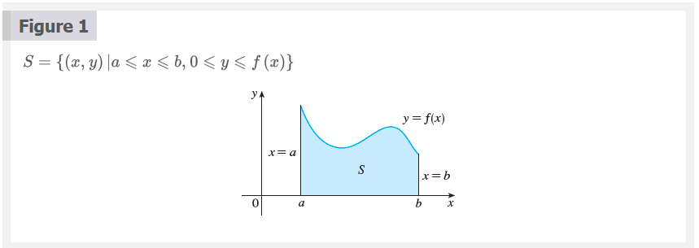

In trying to solve the area problem we have to ask ourselves: What is the
meaning of the word area? This question is easy to answer for regions with
straight sides. For a rectangle, the area is defined as the product of the
length and the width. The area of a triangle is half the base times the height.
The area of a polygon is found by dividing it into triangles (as in Figure 2)
and adding the areas of the triangles.

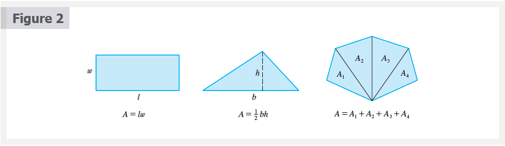
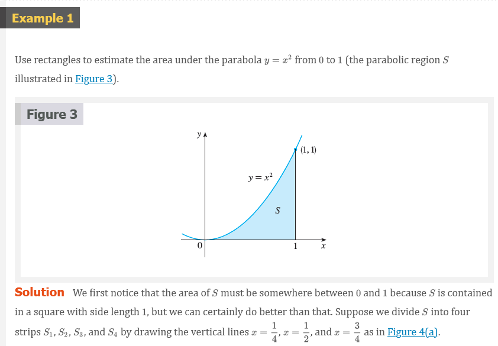

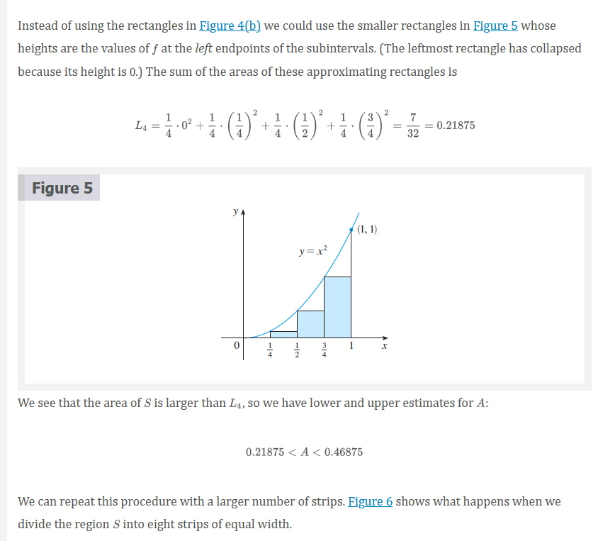
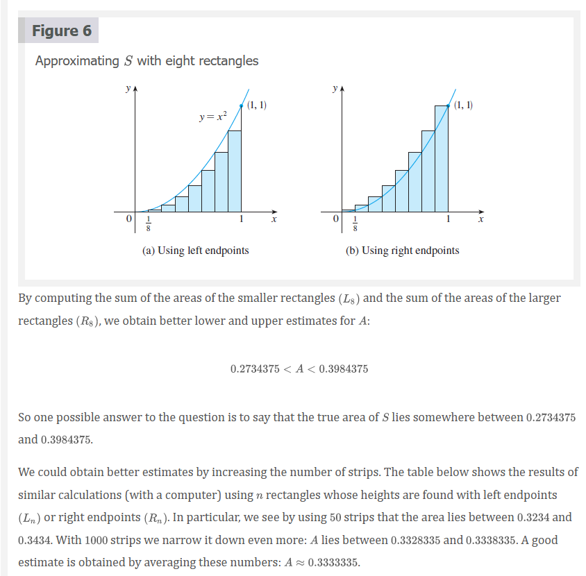
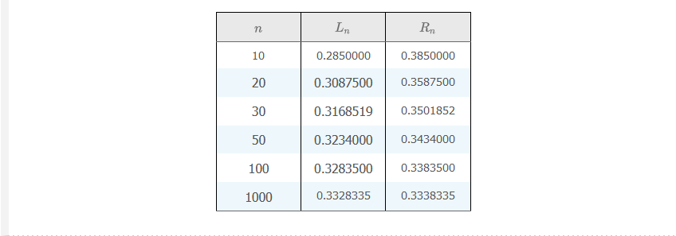
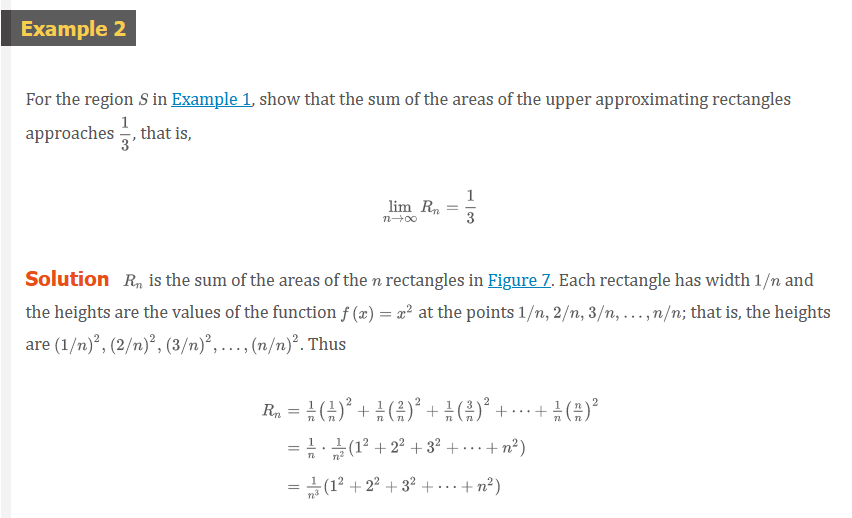
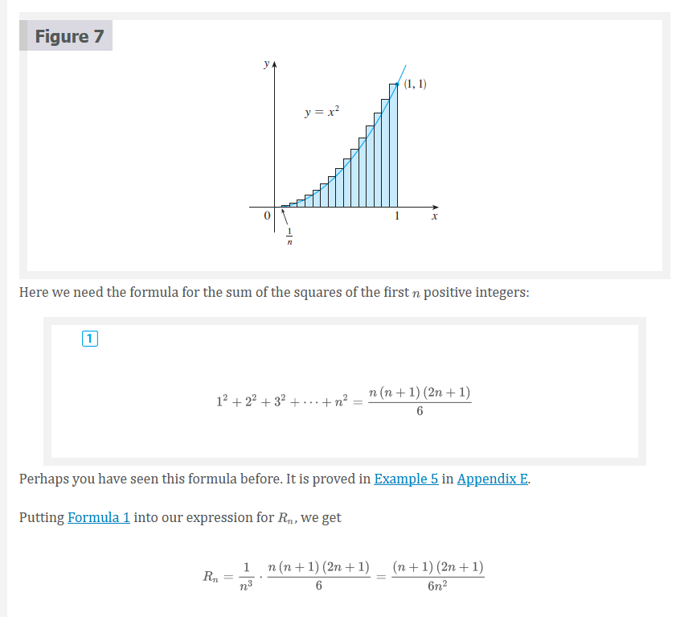
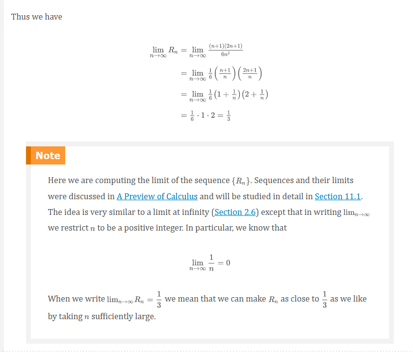

It can be shown that the lower approximating sums also approach $\frac{1}{3}$,
that is,

$$
\lim_{n \to \infty}L_{n} = \frac{1}{3}
$$

From Figures 8 and 9 it appears that, as $n$ increases, both $L_{n}$ and $R_{n}$
become better and better approximations to the area of $S$. Therefore we define
the area $A$ to be the limit of the sums of the areas of the approximating
rectangles, that is,

$$
A = \lim_{n \to \infty}R_{n} = \lim_{n \to \infty}L_{n} = \frac{1}{3}
$$

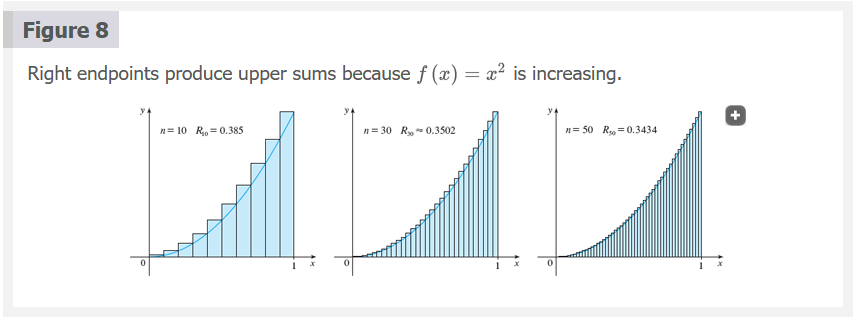
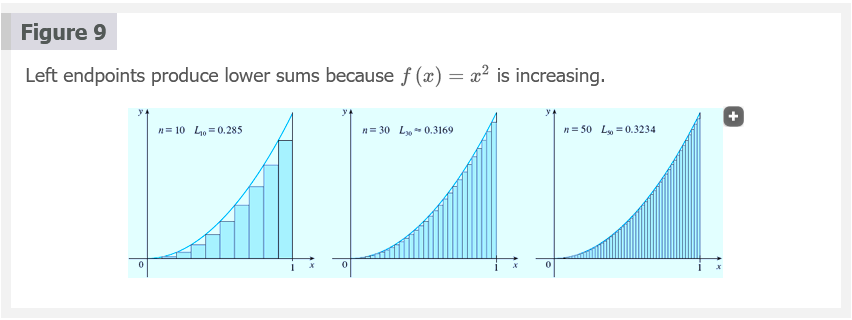
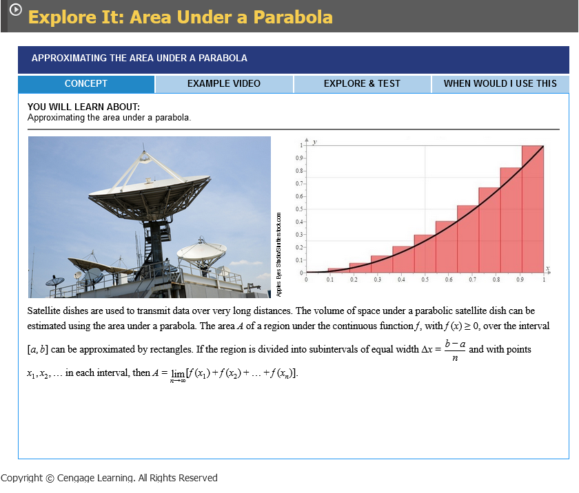

Let's apply the idea of Examples 1 and 2 to the more general region $S$ of
Figure 1. We start by subdividing $S$ into $n$ strips $S_{1}, S_{2},\ldots,S_{n}$
of equal width as in Figure 10.

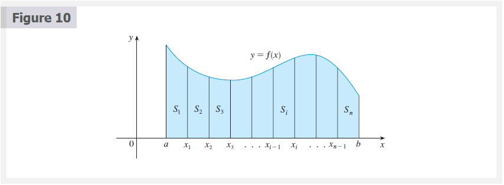

The width of the interval $[a, b]$ is $b - a$, so the width of each of the $n$
strips is

$$
\Delta{x} = \frac{b - a}{n}
$$

These strips divide the interval $[a, b]$ into $n$ subintervals

$$
[x_{0}, x_{1}],[x_{1}, x_{2}],[x_{2}, x_{3}],\ldots,[x_{n - 1}, x_{n}]
$$

Where $x_{0} = a$ and $x_{n} = b$. The right endpoints of the subintervals are

$$
\begin{aligned}
x_{1} &= a + \Delta{x} \\
x_{2} &= a + 2\Delta{x} \\
x_{3} &= a + 3\Delta{x} \\
      &\vdots
\end{aligned}
$$

Let's approximate the $i$th strip $S_{i}$ by a rectangle with width $\Delta{x}$
and height $f(x_{i})$, which is the value of $f$ at the right endpoint (see
Figure 11). Then the area of the $i$th rectangle is $f(x_{i})\Delta{x}$. What we
think of intuitively as the area of $S$ is approximated by the sum of the areas
of these rectangles, which is

$$
R_{n} = f(x_{1})\Delta{x} + f(x_{2})\Delta{x}+ \cdots +f(x_{n})\Delta{x}
$$

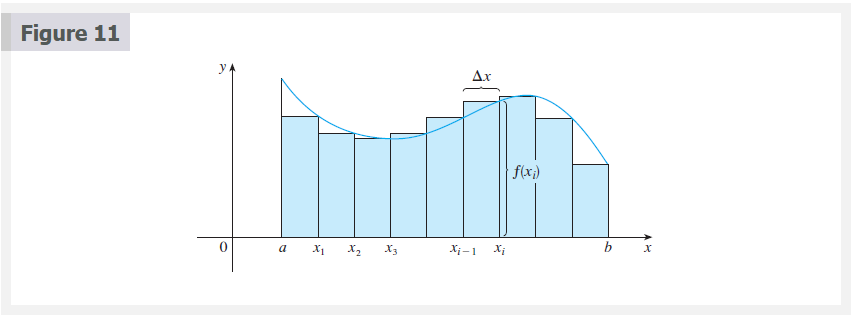

Figure 12 shows this approximation for $n = 2, 4, 8$, and $12$. Notice that this
approximation appears to become better and better as the number of strips
increases, that is, as $n \to \infty$. Therefore we define the area $A$ of the
region $S$ in the following way.

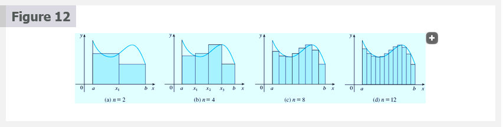

### Definition 2

The area $A$ of the region $S$ that lies under the graph of the continuous
function $f$ is the limit of the sum of the areas of approximating rectangles:

$$
A = \lim_{n \to \infty}R_{n} = \lim_{n \to \infty}[f(x_{1})\Delta{x} + f(x_{2})\Delta{x} + \cdots + f(x_{n})\Delta{x}]
$$

It can be proved that the limit in Definition 2 always exists, since we are
assuming that $f$ is continuous. It can also be shown that we get the same value
if we use left endpoints:

### Definition 3

$$
A = \lim_{n \to \infty}L_{n} = \lim_{n \to \infty}[f(x_{0})\Delta{x} + f(x_{1}) + \cdots + f(x_{n - 1}\Delta{x})]
$$

In fact, instead of using left endpoints or right endpoints, we could take the
height of the $i$th rectangle to be the value of $f$ at any number $x_{1}^{*}$
in the $i$th subinterval $[x_{i - 1}, x_{i}]$ We call the numbers $x^{*}_{1},
x_{2}^{*},\cdots, x_{n}^{*}$ the **sample points**. Figure 13 shows
approximating rectangles when the sample points are not chosen to be endpoints.
So a more general expression for the area of $S$ is

### Definition 4

$$
A = \lim_{n \to \infty} [f(x_{1}^{*})\Delta{x} + f(x_{2}^{*})\Delta{x} + \cdots +(x_{n}^{*})\Delta{x}]
$$

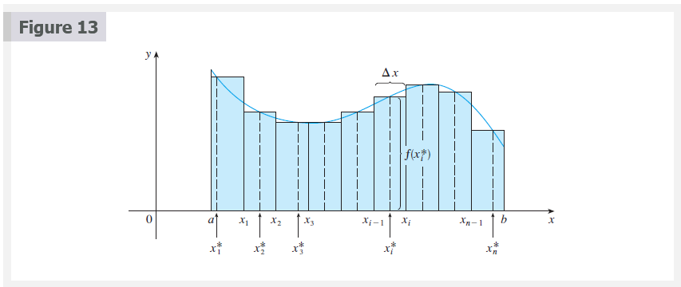
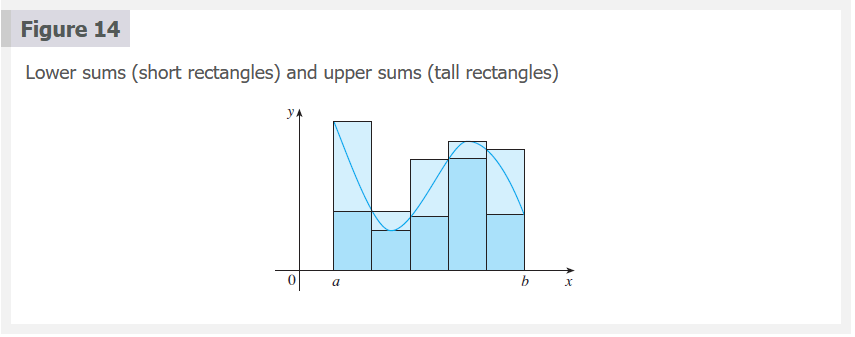

We often use sigma notation to write sums with many terms more compactly. For
instance,

$$
\sum_{i = 1}^{n} f(x_{i})\Delta{x} = f(x_{1})\Delta{x} + f(x_{2})\Delta{x} + \cdots + f(x_{n})\Delta{x}
$$

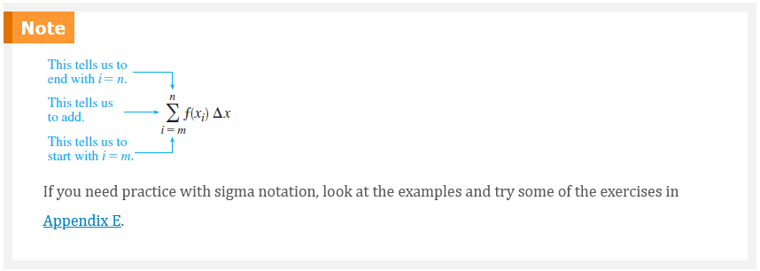

So the expressions for area in Equations 2, 3, and 4 can be written as follows:

$$
\begin{aligned}
A &= \lim_{n \to \infty} \sum_{i = 1}^{n} f(x_{i})\Delta{x} \\
A &= \lim_{n \to \infty} \sum_{i = 1}^{n} f(x_{i - 1}\Delta{x}) \\
A &= \lim_{n \to \infty} \sum_{i = 1}^{n} f(x_{1}^{*})\Delta{x}
\end{aligned}
$$

We can also rewrite Formula 1 in the following way:

$$
\sum_{i = 1}^{n} i^{2} = \frac{n(n + 1)(2n + 1)}{6}
$$

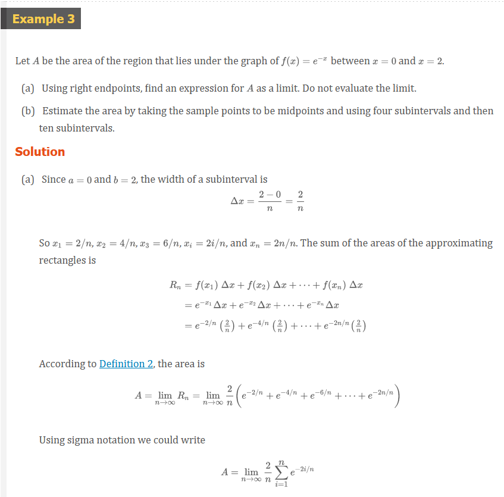
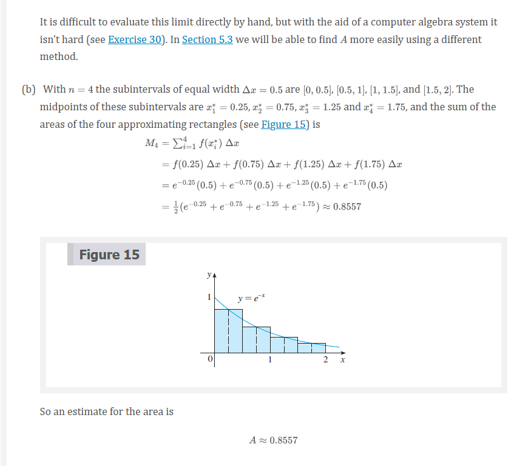
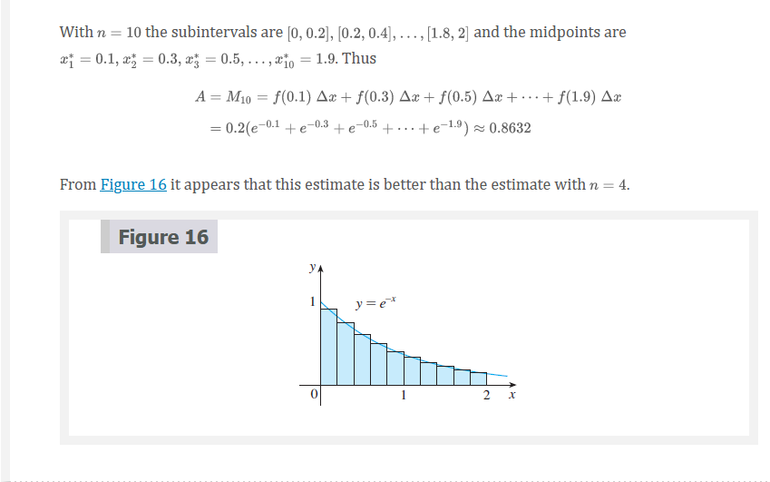

## The Distance Problem

Now let's consider the _distance problem_: Find the distance traveled by an
object during a certain time period if the velocity of the object is known at
all times. (In a sense this is the inverse problem of the velocity problem that
we discussed in Section 2.1.) If the velocity remains constant, then the
distance problem is easy to solve by means of the formula

$$
\text{ distance } = \text{ velocity } \times \text{ time }
$$

But if the velocity varies, it's not so easy to find the distance traveled. We
investigate the problem in the following example.

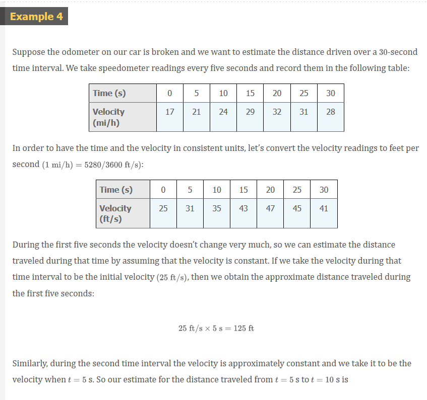
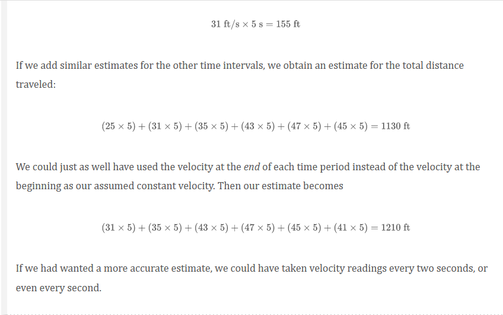

Perhaps the calculations in Example 4 remind you of the sums we used earlier to
estimate areas. The similarity is explained when we sketch a graph of the
velocity function of the car in Figure 17 and draw rectangles whose heights are
the initial velocities for each time interval. The area of the first rectangle
is \$25 \times 5 = 125$, which is also our estimate for the distance traveled in
the first five seconds. In fact, the area of each rectangle can be interpreted
as a distance because the height represents velocity and the width represents
time. The sum of the areas of the rectangles in Figure 17 is $L_{6} = 1130$,
which is our initial estimate for the total distance traveled.

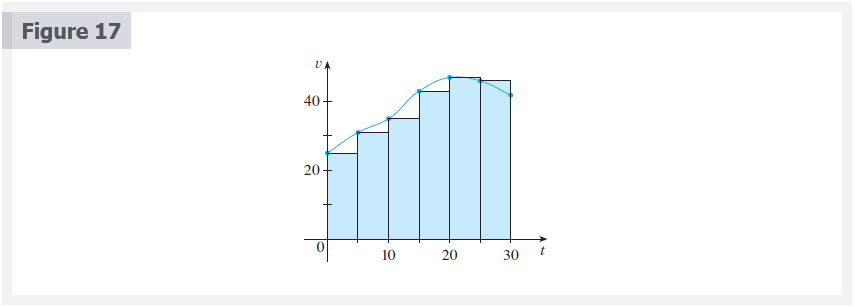

In general, suppose an object moves with velocity $v = f(t)$, where $a \le t \le
b$ and $f(t) \ge 0$ (so the object always moves in the positive direction). We
take velocity readings at times $t_{0}(=a), t_{1}, t_{2},\cdots t_{n}$so that
the velocity is approximately constant on each subinterval. If these times are
equally spaced, then the time between consecutive readings is $\Delta{t} = (b -
a)/n$. During the first time interval the velocity is approximately $f(t_{0})$
and so the distance traveled is approximately $f(t_{0})\Delta{t}$. Similarly,
the distance traveled during the second time interval is about
$f(t_{1})\Delta{t}$ and the total distance traveled during the time interval
$[a, b]$ is approximately

$$
f(t_{0})\Delta{t} + f(t_{1})\Delta{t} + \cdots + f(t_{n - 1})\Delta{t} = \sum_{i = 1}^{n} f(t_{i - 1})\Delta{t}
$$

If we use the velocity at right endpoints instead of left endpoints, our
estimate for the total distance becomes

$$
f(t_{1})\Delta{t} + f(t_{2})\Delta{t} + \cdots + f(t_{n})\Delta{t} \sum_{i = 1}^{n} f(t_{i})\Delta{t}
$$

The more frequently we measure the velocity, the more accurate our estimates
become, so it seems plausible that the _exact_ distance $d$ traveled is the
_limit_ of such expressions:

### Definition 5

$$
d = \lim_{n \to \infty} \sum_{i = 1}^{n} f(t_{i - 1})\Delta{t} = \lim_{n \to \infty} \sum_{i = 1}^{n} f(t_{i})\Delta{t}
$$

## Video Lectures

- [📺 Introduction to integral calculus](https://www.khanacademy.org/math/ap-calculus-ab/ab-integration-new/ab-6-1/v/introduction-to-integral-calculus)
- [📺 Definite integrals intro](https://www.khanacademy.org/math/ap-calculus-ab/ab-integration-new/ab-6-1/v/definite-integrals-intro)
- [📄 Exploring accumulation of change](https://www.khanacademy.org/math/ap-calculus-ab/ab-integration-new/ab-6-1/a/accumulation-and-net-change-in-context)
- [📺 Worked example: accumulation of change](https://www.khanacademy.org/math/ap-calculus-ab/ab-integration-new/ab-6-1/v/area-under-rate-function-example)
- [📺 Riemann approximation introduction](https://www.khanacademy.org/math/ap-calculus-ab/ab-integration-new/ab-6-2/v/simple-riemann-approximation-using-rectangles)
- [📺 Over- and under-estimation of Riemann sums](https://www.khanacademy.org/math/ap-calculus-ab/ab-integration-new/ab-6-2/v/riemann-sums-over-and-under-estimation)
- [📄 Left & right Riemann sums](https://www.khanacademy.org/math/ap-calculus-ab/ab-integration-new/ab-6-2/a/left-and-right-riemann-sums)
- [📺 Worked example: finding a Riemann sum using a table](https://www.khanacademy.org/math/ap-calculus-ab/ab-integration-new/ab-6-2/v/riemann-sum-from-table)
- [📺 Worked example: over- and under-estimation of Riemann sums](https://www.khanacademy.org/math/ap-calculus-ab/ab-integration-new/ab-6-2/v/riemann-sums-over-under-example)
- [📺 Midpoint sums](https://www.khanacademy.org/math/ap-calculus-ab/ab-integration-new/ab-6-2/v/midpoint-sums)
- [📺 Trapezoidal sums](https://www.khanacademy.org/math/ap-calculus-ab/ab-integration-new/ab-6-2/v/trapezoidal-approximation-of-area-under-curve)
- [📄 Understanding the trapezoidal rule](https://www.khanacademy.org/math/ap-calculus-ab/ab-integration-new/ab-6-2/a/understanding-the-trapezoid-rule)
- [📄 Riemann sums review](https://www.khanacademy.org/math/ap-calculus-ab/ab-integration-new/ab-6-2/a/riemann-sums-review)

 

# Resources

- [📺 Introduction to integral calculus](https://www.khanacademy.org/math/ap-calculus-ab/ab-integration-new/ab-6-1/v/introduction-to-integral-calculus)
- [📺 Definite integrals intro](https://www.khanacademy.org/math/ap-calculus-ab/ab-integration-new/ab-6-1/v/definite-integrals-intro)
- [📄 Exploring accumulation of change](https://www.khanacademy.org/math/ap-calculus-ab/ab-integration-new/ab-6-1/a/accumulation-and-net-change-in-context)
- [📺 Worked example: accumulation of change](https://www.khanacademy.org/math/ap-calculus-ab/ab-integration-new/ab-6-1/v/area-under-rate-function-example)
- [📺 Riemann approximation introduction](https://www.khanacademy.org/math/ap-calculus-ab/ab-integration-new/ab-6-2/v/simple-riemann-approximation-using-rectangles)
- [📺 Over- and under-estimation of Riemann sums](https://www.khanacademy.org/math/ap-calculus-ab/ab-integration-new/ab-6-2/v/riemann-sums-over-and-under-estimation)
- [📄 Left & right Riemann sums](https://www.khanacademy.org/math/ap-calculus-ab/ab-integration-new/ab-6-2/a/left-and-right-riemann-sums)
- [📺 Worked example: finding a Riemann sum using a table](https://www.khanacademy.org/math/ap-calculus-ab/ab-integration-new/ab-6-2/v/riemann-sum-from-table)
- [📺 Worked example: over- and under-estimation of Riemann sums](https://www.khanacademy.org/math/ap-calculus-ab/ab-integration-new/ab-6-2/v/riemann-sums-over-under-example)
- [📺 Midpoint sums](https://www.khanacademy.org/math/ap-calculus-ab/ab-integration-new/ab-6-2/v/midpoint-sums)
- [📺 Trapezoidal sums](https://www.khanacademy.org/math/ap-calculus-ab/ab-integration-new/ab-6-2/v/trapezoidal-approximation-of-area-under-curve)
- [📄 Understanding the trapezoidal rule](https://www.khanacademy.org/math/ap-calculus-ab/ab-integration-new/ab-6-2/a/understanding-the-trapezoid-rule)
- [📄 Riemann sums review](https://www.khanacademy.org/math/ap-calculus-ab/ab-integration-new/ab-6-2/a/riemann-sums-review)

Textbook

+ [📄 Cengage e-Textbook: Calculus Early Transcendentals, Eighth Edition, Stewart](https://webassign.com/)

