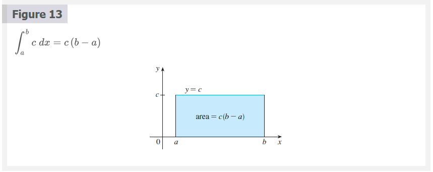

# Chapter 5.2: The Definite Integral

## The Definite Integral

We saw in Section 5.1 that a limit of the form

### Definition 1

$$
\lim_{n \to \infty} \sum_{i = 1}^{n} f(x^{*}_{i})\Delta{x} = \lim_{n \to \infty} [f(x_{1}^{*})\Delta{x} + f(x_{2}^{*})\Delta{x} + \cdots + f(x_{n}^{*})\Delta{x}]
$$

### Definition of a Definite Integral 2

If $f$ is a function defined for $a \le x \le b$, we divide the interval $[a,
b]$ into $n$ subintervals of equal width $\Delta{x} = (b - a)/n$. We let
$x_{0}(= a), x_{1}, x_{2}, \cdots, x_{n}(= b)$ be the endpoints of these
subintervals and we let $x_{1}^{*}, x_{2}^{*}, \cdots, x_{n}^{*}$ be any
**sample points** in these subintervals, so $x_{i}^{*}$ lies in the $i$th
subinterval $[x_{i - 1}, x_{i}$. Then the **definite integral of $f$ from $a$ to
$b$** is

$$
\int_{a}^{b} f(x)dx = \lim_{n \to \infty} \sum_{i = 1}^{n} f(x_{i}^{*})\Delta{x}
$$

provided that this limit exists and gives the same value for all possible
choices of sample points. If it does exist, we say that $f$ is **integrable on**
$[a, b]$.

The precise meaning of the limit that defines the integral is as follows:

For every number $\varepsilon > 0$ there is an integer $N$ such that

$$
\left | \int_{a}^{b} f(x)dx - \sum_{i = 1}^{n} f(x_{i}^{*})\Delta{x} \right | < \varepsilon
$$

for every integer $n > N$ and for every choice of $x_{i}^{*}$ in $[x_{i - 1},
x_{i}$.

> **Note 1**

The symbol $\int$ was introduced by Leibniz and is called an **integral sign**.
It is an elongated and was chosen because an integral is a limit of sums. In the
notation $\int_{a}^{b} f(x)dx$, $f(x)$ is called the **integrand** and $a$ and
$b$ are called the **limits of integration**; $a$ is the **lower limit** and $b$
is the **upper limit**. For now, the symbol $dx$ has no meaning by itself;
$\int_{a}^{b} f(x)dx$ is all one symbol. The $dx$ simply indicates that the
independent variable is $x$. The procedure of calculating an integral is called
**integration**.

> **Note 2**

The definite integral $\int_{a}^{b} f(x)dx$ is a number; it does not depend on
$x$. In fact, we could use any letter in place of $x$ without changing the value
of the integral:

$$
\int_{a}^{b} f(x)dx = \int_{a}^{b} f(t)dt = \int_{a}^{b} f(r)dr
$$

> **Note 3** The sum

$$
\sum_{i = 1}^{n} f(x_{i}^{*})\Delta{x}
$$

that occurs in Definition 2 is called a Riemann sum after the German
mathematician Bernhard Riemann (1826–1866). So Definition 2 says that the
definite integral of an integrable function can be approximated to within any
desired degree of accuracy by a Riemann sum.

We know that if $f$ happens to be positive, then the Riemann sum can be
interpreted as a sum of areas of approximating rectangles (see Figure 1). By
comparing Definition 2 with the definition of area in Section 5.1, we see that
the definite integral $\int_{a}^{b} f(x)dx$ can be interpreted as the area under
the curve $y = f(x)$ from $a$ to $b$. (See Figure 2.)

If $f$ takes on both positive and negative values, as in Figure 3, then the
Riemann sum is the sum of the areas of the rectangles that lie above the
$x$-axis and the negatives of the areas of the rectangles that lie below the
$x$-axis (the areas of the blue rectangles minus the areas of the gold
rectangles).  When we take the limit of such Riemann sums, we get the situation
illustrated in Figure 4. A definite integral can be interpreted as a net area,
that is, a difference of areas:

$$
\int_{a}^{b} f(x)dx = A_{1} - A_{1}
$$

where $A_{1}$ is the area of the region above the $x$-axis and below the graph
of $f$, and $A_{2}$ is the area of the region below the $x$-axis and above the
graph of $f$.

> **Note 4**

Although we have defined $\int_{a}^{b} f(x)dx$ by dividing $[a, b]$ into
subintervals of equal width, there are situations in which it is advantageous to
work with subintervals of unequal width. For instance, in Exercise 5.1.16, NASA
provided velocity data at times that were not equally spaced, but we were still
able to estimate the distance traveled. And there are methods for numerical
integration that take advantage of unequal subintervals.

If the subinterval widths are $\Delta{x_{1}}, \Delta{x_{2}}, \cdots,
\Delta{x_{n}}$, we have to ensure that all these widths approach $0$ in the
limiting process. This happens if the largest width, $max\Delta{x_{i}}$,
approaches $0$. So in this case the definition of a definite integral becomes

$$
\int_{a}^{b} f(x)dx = \lim_{max\Delta{x_{i}} \to 0} \sum_{i = 1}^{n} f(x_{i}^{*})\Delta{x_{i}}
$$

> **Note 5**

We have defined the definite integral for an integrable function, but not all
functions are integrable (see Exercises 71 and 72). The following theorem shows
that the most commonly occurring functions are in fact integrable. The theorem
is proved in more advanced courses.

### Theorem 3

If $f$ is continuous on $[a, b]$, or if $f$ has only a finite number of jump
discontinuities, then $f$ is integrable on $[a, b]$; that is, the definite
integral $\int_{a}^{b} f(x)dx$ exists.

If $f$ is integrable on $[a, b]$, then the limit in Definition 2 exists and
gives the same value no matter how we choose the sample points $x_{i}^{*}$. To
simplify the calculation of the integral we often take the sample points to be
right endpoints. Then  $x_{i}^{*} = x_{i}$ and the definition of an integral
simplifies as follows.

### Theorem 4

If $f$ is integrable on $[a, b]$, then

$$
\int_{a}^{b} f(x)dx = \lim_{n \to \infty} \sum_{i = 1}^{n} f(x_{i})\Delta{x}
$$

where

$$
\Delta{x} = \frac{b - a}{n}
$$

Later, when we apply the definite integral to physical situations, it will be
important to recognize limits of sums as integrals, as we did in Example 1. When
Leibniz chose the notation for an integral, he chose the ingredients as
reminders of the limiting process. In general, when we write

$$
\lim_{n \to \infty} \sum_{i = 1}^{n} f(x_{i}^{*})\Delta{x} = \int_{a}^{b} f(x)dx
$$

we replace $\lim \sum$ by $\int$, $x_{i}^{*}$ by $x$, and $\Delta{x}$ by $dx$.

## Evaluating Integrals

When we use a limit to evaluate a definite integral, we need to know how to work
with sums. The following three equations give formulas for sums of powers of
positive integers. Equation 5 may be familiar to you from a course in algebra.
Equations 6 and 7 were discussed in Section 5.1 and are proved in Appendix E.

### Definition 5

$$
\sum_{i = 1}^{n} f(x_{i})\Delta{x}
$$

### Definition 6

$$
\sum_{i = 1}^{n} i^{2} = \frac{n(n + 1)(2n + 1)}{6}
$$

### Definition 7

$$
\sum_{i = 1}^{n} i^{3} = \left [ \frac{n(n + 1)}{2} \right ]^{2}
$$

The remaining formulas are simple rules for working with sigma notation:

### Definition 8

$$
\sum_{i = 1}^{n} c = nc
$$

### Definition 9

$$
\sum_{i = 1}^{n} ca_{i} = c \sum_{i = 1}^{n} a_{1}
$$

### Definition 10

$$
\sum_{i = 1}^{n} (a_{1} + b_{1}) = \sum_{i = 1}^{n} a_{i} + \sum_{i = 1}^{n} b_{i}
$$

### Definition 11

$$
\sum_{i = 1}^{n} (a_{i} - b_{i}) = \sum_{i = 1}^{n} a_{i} - \sum_{i = 1}^{n} b_{i}
$$

> **Note**

Formulas 8, 9, 10 and 11 are proved by writing out each side in expanded form.
The left side of Equation 9 is

$$
ca_{1} + ca_{2} + \cdots + ca_{n}
$$

The right side is

$$
c(a_{1} + a_{2} + \cdots + a_{n})
$$

These are equal by the distributive property. The other formulas are discussed
in Appendix E.

### Reimann

Bernhard Riemann received his Ph.D. under the direction of the legendary Gauss
at the University of Göttingen and remained there to teach. Gauss, who was not
in the habit of praising other mathematicians, spoke of Riemann's "creative,
active, truly mathematical mind and gloriously fertile originality." The
definition (2) of an integral that we use is due to Riemann. He also made major
contributions to the theory of functions of a complex variable, mathematical
physics, number theory, and the foundations of geometry. Riemann's broad concept
of space and geometry turned out to be the right setting, 50 years later, for
Einstein's general relativity theory. Riemann's health was poor throughout his
life, and he died of tuberculosis at the age of 39.

## The Midpoint Rule

We often choose the sample point $x_{i}^{*}$ to be the right endpoint of the
$i$th subinterval because it is convenient for computing the limit. But if the
purpose is to find an approximation to an integral, it is usually better to
choose $x_{i}^{*}$ to be the midpoint of the interval, which we denote by
$\overline{x}_{i}$. Any
Riemann sum is an approximation to an integral, but if we use midpoints we get
the following approximation.

### Midpoint Rule

$$
\int_{a}^{b} f(x)dx \approx \sum_{i = 1}^{n} f(\overline{x}_{i})\Delta{x} = \Delta{x}[f(\overline{x}_{1}) + \cdots + f(\overline{x}_{n})]
$$

Where

$$
\Delta{x} = \frac{b - a}{n}
$$

and

$$
\overline{x_{i}} = \frac{1}{2}(x_{i - 1} + x_{i}) = \text{midpoint} of [x_{i - 1}, x_{i}]
$$

At the moment we don't know how accurate the approximation in Example 5 is, but
in Section 7.7 we will learn a method for estimating the error involved in using
the Midpoint Rule. At that time we will discuss other methods for approximating
definite integrals.

If we apply the Midpoint Rule to the integral in Example 2, we get the picture
in Figure 12. The approximation $M_{40} \approx -6.7563$ is much closer to the
true value $-6.75$ than the right endpoint approximation, $R_{40} \approx
-6.3998$, shown in Figure 7.

## Properties of the Definite Integral

When we defined the definite integral $\int_{a}^{b} f(x)dx$, we implicitly
assumed that $a < b$. But the definition as a limit of Riemann sums makes sense
even if $a > b$.  Notice that if we reverse $a$ and $b$, then $\Delta{x}$
changes from $(b - a)/n$ to $(a - b)/n$.  Therefore

$$
\int_{b}^{a} f(x)dx = - \int_{a}^{b} f(x)dx
$$

If $a = b$, then $\Delta{x} = 0$ and so

$$
\int_{a}^{a} f(x)dx = 0
$$

We now develop some basic properties of integrals that will help us to evaluate
integrals in a simple manner. We assume that $f$ and $g$ are continuous
functions.

### Properties of the Integral

1. $\int_{a}^{b} c\;dx = c(b - a)$, where $c$ is any constant
2. $\int_{a}^{b} [f(x) + g(x)]dx = \int_{a}^{b} f(x)dx + \int_{a}^{b} g(x)dx$
3. $\int_{a}^{b} cf(x)dx = c \int_{a}^{b} f(x)dx$, where $c$ is any constant
4. $\int_{a}^{b} [f(x) - g(x)]dx = \int_{a}^{b} f(x)dx - \int_{a}^{b} g(x)dx$

Property 1 says that the integral of a constant function $f(x) = c$ is the
constant times the length of the interval. If $c > 0$ and $a < b$, this is to be
expected because $c(b - a)$ is the area of the shaded rectangle in Figure 13.

Property 2 says that the integral of a sum is the sum of the integrals. For
positive functions it says that the area under $f + g$ is the area under $f$
plus the area under $g$. Figure 14 helps us understand why this is true: In view of
how graphical addition works, the corresponding vertical line segments have
equal height.

In general, Property 2 follows from Theorem 4 and the fact that the limit of a
sum is the sum of the limits:

$$
\begin{aligned}
\int_{a}^{b} [f(x) + g(x)]dx &= \lim_{n \to \infty} \sum_{i = 1}^{n} [f(x_{i}) + g(x_{i})]\Delta{x} \\
                             &= \lim_{n \to \infty} \left [ \sum_{i = 1}^{n} f(x_{i})\Delta{x} + \lim_{n \to \infty} \sum_{i = 1}^{n} g(x_{i})\Delta{x} \right ] \\
                             &= \lim_{n \to \infty} \sum_{i = 1}^{n} f(x_{i})\Delta{x} + \lim_{n \to \infty} \sum_{i = 1}^{n} g(x_{i})\Delta{x} \\
                             &= \int_{a}^{b} f(x)dx + \int_{a}^{b} g(x)dx
\end{aligned}
$$

Property 3 can be proved in a similar manner and says that the integral of a
constant times a function is the constant times the integral of the function. In
other words, a constant (but only a constant) can be taken in front of an
integral sign. Property 4 is proved by writing $f - g = f + (-g)$ and using
Properties 2 and 3 with $c = -1$.

The next property tells us how to combine integrals of the same function over
adjacent intervals.

5. $\int_{a}^{c} f(x)dx + \int_{c}^{b} f(x)dx = \int_{a}^{b} f(x)dx$

This is not easy to prove in general, but for the case where $f(x) \ge 0$ and $a
< c < b$ Property 5 can be seen from the geometric interpretation in Figure 15:
the area under $y = f(x)$ from $a$ to $c$ plus the area from $c$ to $b$ is equal
to the total area from $a$ to $b$.

Property 1, Property 2, Property 3, Property 4 and Property 5 are true whether
$a < b$, $a = b$, or $a > b$. The following properties, in which we compare
sizes of functions and sizes of integrals, are true only if $a \le b$.

### Comparison Properties of the Integral

6. If $f(x) \ge 0$ for a $a \le x \le b$, then $\int_{a}^{b} f(x)dx \ge 0$
7. If $f(x) \ge g(x)$ for $a \le x \le b$, then $\int_{a}^{b} f(x)dx \ge
   \int_{a}^{b} g(x)dx$
8. If $m \le f(x) \le M$ for $a \le x \le b$ then

$$
m(b - a) \le \int_{a}^{b} f(x)dx \le M(b - a)
$$

If $f(x) \ge 0$, then $\int_{a}^{b} f(x)dx$ represents the area under the graph
of $f$, so the geometric interpretation of Property 6 is simply that areas are
positive. (It also follows directly from the definition because all the
quantities involved are positive.) Property 7 says that a bigger function has a
bigger integral. It follows from Properties 6 and 4 because $f - g \ge 0$.

Property 8 is illustrated by Figure 16 for the case where $f(x) \ge 0$. If $f$
is continuous, we could take $m$ and $M$ to be the absolute minimum and maximum
values of $f$ on the interval $[a, b]$. In this case Property 8 says that the
area under the graph of $f$ is greater than the area of the rectangle with
height $m$ and less than the area of the rectangle with height $M$.

Property 8 is useful when all we want is a rough estimate of the size of an
integral without going to the bother of using the Midpoint Rule.

The result of Example 8 is illustrated in Figure 17. The integral is greater
than the area of the lower rectangle and less than the area of the square.

## Video Lectures

- [📺 Summation notation](https://www.khanacademy.org/math/ap-calculus-ab/ab-integration-new/ab-6-3/v/sigma-notation-sum)
- [📄 Summation notation](https://www.khanacademy.org/math/ap-calculus-ab/ab-integration-new/ab-6-3/a/review-summation-notation)
- [📺 Worked examples: Summation notation](https://www.khanacademy.org/math/ap-calculus-ab/ab-integration-new/ab-6-3/v/summation-notation-worked-examples)
- [📺 Riemann sums in summation notation](https://www.khanacademy.org/math/ap-calculus-ab/ab-integration-new/ab-6-3/v/generalizing-a-left-riemann-sum-with-equally-spaced-rectangles)
- [📄 Riemann sums in summation notation](https://www.khanacademy.org/math/ap-calculus-ab/ab-integration-new/ab-6-3/a/riemann-sums-with-summation-notation)
- [📺 Worked example: Riemann sums in summation notation](https://www.khanacademy.org/math/ap-calculus-ab/ab-integration-new/ab-6-3/v/practice-approximating-area-under-curve)
- [📺 Definite integral as the limit of a Riemann sum](https://www.khanacademy.org/math/ap-calculus-ab/ab-integration-new/ab-6-3/v/riemann-sums-and-integrals)
- [📄 Definite integral as the limit of a Riemann sum](https://www.khanacademy.org/math/ap-calculus-ab/ab-integration-new/ab-6-3/a/definite-integral-as-the-limit-of-a-riemann-sum)
- [📺 Worked example: Rewriting definite integral as limit of Riemann sum](https://www.khanacademy.org/math/ap-calculus-ab/ab-integration-new/ab-6-3/v/rewriting-definite-integral-as-limit-of-riemann-sum)
- [📺 Worked example: Rewriting limit of Riemann sum as definite integral](https://www.khanacademy.org/math/ap-calculus-ab/ab-integration-new/ab-6-3/v/writing-riemann-sum-limit-as-definite-integral)

 

# Resources

- [📺 Summation notation](https://www.khanacademy.org/math/ap-calculus-ab/ab-integration-new/ab-6-3/v/sigma-notation-sum)
- [📄 Summation notation](https://www.khanacademy.org/math/ap-calculus-ab/ab-integration-new/ab-6-3/a/review-summation-notation)
- [📺 Worked examples: Summation notation](https://www.khanacademy.org/math/ap-calculus-ab/ab-integration-new/ab-6-3/v/summation-notation-worked-examples)
- [📺 Riemann sums in summation notation](https://www.khanacademy.org/math/ap-calculus-ab/ab-integration-new/ab-6-3/v/generalizing-a-left-riemann-sum-with-equally-spaced-rectangles)
- [📄 Riemann sums in summation notation](https://www.khanacademy.org/math/ap-calculus-ab/ab-integration-new/ab-6-3/a/riemann-sums-with-summation-notation)
- [📺 Worked example: Riemann sums in summation notation](https://www.khanacademy.org/math/ap-calculus-ab/ab-integration-new/ab-6-3/v/practice-approximating-area-under-curve)
- [📺 Definite integral as the limit of a Riemann sum](https://www.khanacademy.org/math/ap-calculus-ab/ab-integration-new/ab-6-3/v/riemann-sums-and-integrals)
- [📄 Definite integral as the limit of a Riemann sum](https://www.khanacademy.org/math/ap-calculus-ab/ab-integration-new/ab-6-3/a/definite-integral-as-the-limit-of-a-riemann-sum)
- [📺 Worked example: Rewriting definite integral as limit of Riemann sum](https://www.khanacademy.org/math/ap-calculus-ab/ab-integration-new/ab-6-3/v/rewriting-definite-integral-as-limit-of-riemann-sum)
- [📺 Worked example: Rewriting limit of Riemann sum as definite integral](https://www.khanacademy.org/math/ap-calculus-ab/ab-integration-new/ab-6-3/v/writing-riemann-sum-limit-as-definite-integral)
