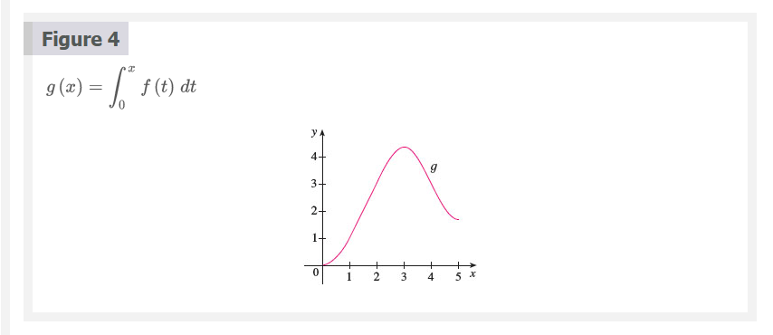
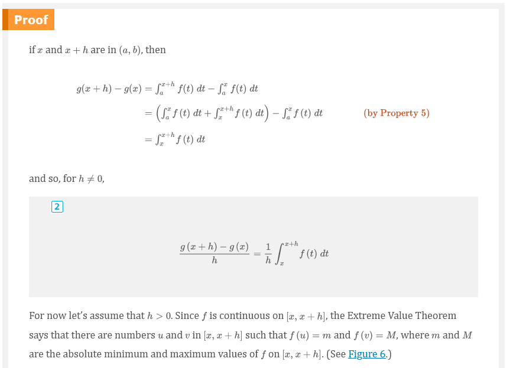
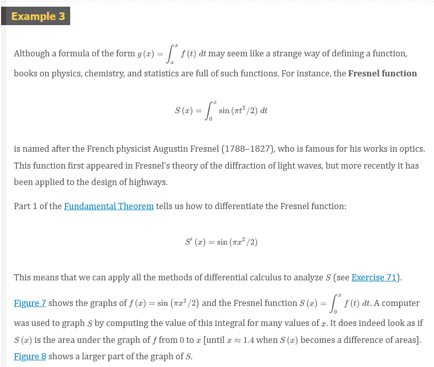
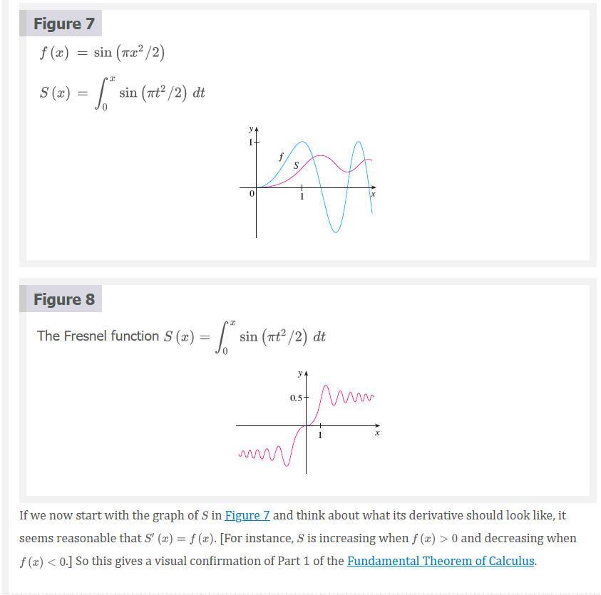
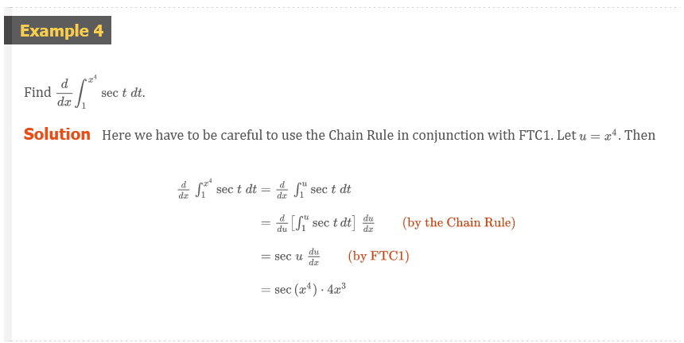
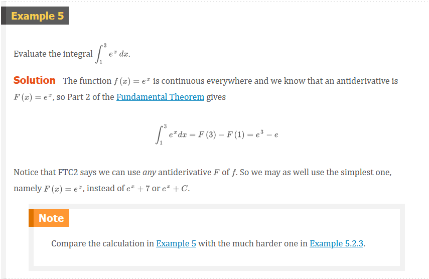
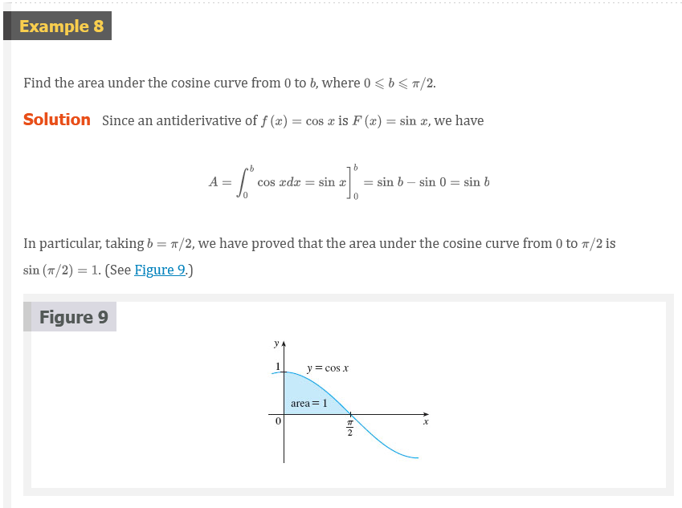
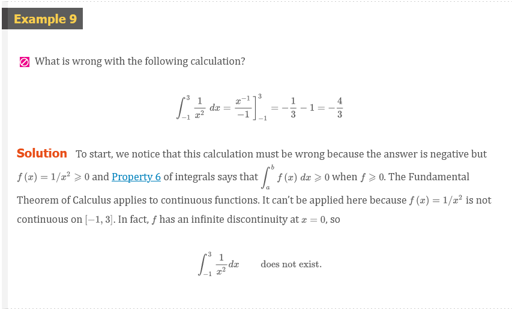

# Chapter 5.3: The Fundamental Theorem of Calculus

## The Fundamental Theorem of Calculus

The Fundamental Theorem of Calculus is appropriately named because it
establishes a connection between the two branches of calculus: differential
calculus and integral calculus. Differential calculus arose from the tangent
problem, whereas integral calculus arose from a seemingly unrelated problem, the
area problem. Newton's mentor at Cambridge, Isaac Barrow (1630–1677), discovered
that these two problems are actually closely related. In fact, he realized that
differentiation and integration are inverse processes. The Fundamental Theorem
of Calculus gives the precise inverse relationship between the derivative and
the integral. It was Newton and Leibniz who exploited this relationship and used
it to develop calculus into a systematic mathematical method. In particular,
they saw that the Fundamental Theorem enabled them to compute areas and
integrals very easily without having to compute them as limits of sums as we did
in Sections 5.1 and 5.2.

The first part of the Fundamental Theorem deals with functions defined by an
equation of the form

### Definition 1

$$
g(x) = \int_{a}^{x} f(t)dt
$$

If we take $f(t) = t$ and $a = 0$, then, using Exercise 5.2.27, we have

$$
g(x) = \int_{0}^{x} t\;dt = \frac{x^{2}}{2}
$$

Notice that $g^{\prime}(x) = x$, that is, $g^{\prime} = f$. In other words, if
$g$ is defined as the integral of $f$ by Equation 1, then $g$ turns out to be an
antiderivative of $f$, at least in this case.  And if we sketch the derivative
of the function $g$ shown in Figure 4 by estimating slopes of tangents, we get a
graph like that of $f$ in Figure 2. So we suspect that $g^{\prime} = f$ in
Example 1 too.

To see why this might be generally true we consider any continuous function $f$
with $f(x) \ge 0$. Then $g(x) = \int_{a}^{x} f(t)dt$ can be interpreted as the
area under the graph of $f$ from $a$ to $x$, as in Figure 1.

In order to compute $g^{\prime}(x)$ from the definition of a derivative we first
observe that, for $h > 0$, $g(x + h) - g(x)$ is obtained by subtracting areas,
so it is the area under the graph of $f$ from $x$ to $x + h$ (the blue area in
Figure 5). For small $h$ you can see from the figure that this area is
approximately equal to the area of the rectangle with height $f(x)$ and width
$h$:

$$
g(x + h) - g(x) \approx hf(x)
$$

so

$$
\frac{g(x + h) - g(x)}{h} \approx f(x)
$$

Intuitively, we therefore expect that

$$
g^{\prime}(x) = \lim_{h \to 0} \frac{g(x + h) - g(x)}{h} = f(x)
$$

The fact that this is true, even when $f$ is not necessarily positive, is the
first part of the Fundamental Theorem of Calculus.

### The Fundamental Theorem of Calculus, Part 1

If $f$ is continuous on $[a, b]$ then the function $g$ defined by

$$
g(x) = \int_{a}^{x} f(t)dt \;\;\;\;\; a \le x \le b
$$

is continuous on $[a, b]$, and differentiable on $(a, b)$, and $g^{\prime}(x) =
f(x)$.

> **Note**

We abbreviate the name of this theorem as FTC1. In words, it says that the
derivative of a definite integral with respect to its upper limit is the
integrand evaluated at the upper limit

Using Leibniz notation for derivatives, we can write FTC1 as

### Definition 5

$$
\frac{d}{dx}\int_{a}^{x} f(t)dt = f(x)
$$

### The Fundamental Theorem of Calculus, Part 2

If $f$ is continuous on $[a, b]$, then

where $F$ is any antiderivative of $f$, that is, a function such that
$F^{\prime} = f$.

> **Note**

We abbreviate this theorem as FTC2.

Part 2 of the Fundamental Theorem states that if we know an antiderivative $F$
of $f$, then we can evaluate $\int_{a}^{b} f(x)dx$ simply by subtracting the
values of $F$ at the endpoints of the interval $[a, b]$. It's very surprising
that $\int_{a}^{b} f(x)dx$, which was defined by a complicated procedure
involving all of the values of $f(x)$ for $a \le x \le b$, can be found by
knowing the values of $F(x)$ at only two points, $a$ and $b$.

Although the theorem may be surprising at first glance, it becomes plausible if
we interpret it in physical terms. If $v(t)$ is the velocity of an object and
$s(t)$ is its position at time $t$, then $v(t) = s^{\prime}(t)$, so $s$ is an
antiderivative of $v$. In Section 5.1 we considered an object that always moves in
the positive direction and made the guess that the area under the velocity curve
is equal to the distance traveled.  In symbols:

$$
\int_{a}^{b} v(t)dt = s(b) - s(a)
$$

That is exactly what FTC2 says in this context.

We often use the notation

$$
F(x)]_{a}^{b} = F(b) - F(a)
$$

So the equation of FTC2 can be written as

$$
\int_{a}^{b} f(x)dx = F(x)]_{a}^{b}
$$

where

$$
F^{\prime} = f
$$

Other common notations are $F(x)|_{a}^{b}$ and $[F(x)]_{a}^{b}$.

## Differentiation and Integration as Inverse Processes

### The Fundamental Theorem of Calculus

Suppose $f$ is continuous on $[a, b]$.

1. If $g(x) = \int_{a}^{x} f(t)dt$, then $g^{\prime}(x) = f(x)$.

2. $\int_{a}^{b} f(x)dx = F(b) - F(a)$, where $F$ is any antiderivative of $f$,
   that is, $F^{\prime} = f$.

We noted that Part 1 can be rewritten as

$$
\frac{d}{dx}\int_{a}^{x} f(t)dt = f(x)
$$

which says that if $f$ is integrated and then the result is differentiated, we
arrive back at the original function $f$. Since $F^{\prime}(x) = f(x)$, Part 2
can be rewritten as

$$
\int_{a}^{b} F^{\prime}(x)dx = F(b) - F(a)
$$

This version says that if we take a function $F$, first differentiate it, and
then integrate the result, we arrive back at the original function $F$, but in
the form $F(b) - F(a)$. Taken together, the two parts of the Fundamental Theorem
of Calculus say that differentiation and integration are inverse processes. Each
undoes what the other does.

The Fundamental Theorem of Calculus is unquestionably the most important theorem
in calculus and, indeed, it ranks as one of the great accomplishments of the
human mind. Before it was discovered, from the time of Eudoxus and Archimedes to
the time of Galileo and Fermat, problems of finding areas, volumes, and lengths
of curves were so difficult that only a genius could meet the challenge. But
now, armed with the systematic method that Newton and Leibniz fashioned out of
the Fundamental Theorem, we will see in the chapters to come that these
challenging problems are accessible to all of us.

## Video Lectures

- [📺 The fundamental theorem of calculus and accumulation functions](https://www.khanacademy.org/math/ap-calculus-ab/ab-integration-new/ab-6-4/v/fundamental-theorem-of-calculus)
- [📺 Functions defined by definite integrals (accumulation functions)](https://www.khanacademy.org/math/ap-calculus-ab/ab-integration-new/ab-6-4/v/functions-defined-by-definite-integrals)
- [📺 Finding derivative with fundamental theorem of calculus](https://www.khanacademy.org/math/ap-calculus-ab/ab-integration-new/ab-6-4/v/applying-the-fundamental-theorem-of-calculus)
- [📺 Negative definite integrals](https://www.khanacademy.org/math/ap-calculus-ab/ab-integration-new/ab-6-6/v/negative-definite-integrals)
- [📺 Finding definite integrals using area formulas](https://www.khanacademy.org/math/ap-calculus-ab/ab-integration-new/ab-6-6/v/definite-integrals-with-area-formulas)
- [📺 Definite integral over a single point](https://www.khanacademy.org/math/ap-calculus-ab/ab-integration-new/ab-6-6/v/same-integration-bounds)
- [📺 Integrating scaled version of function](https://www.khanacademy.org/math/ap-calculus-ab/ab-integration-new/ab-6-6/v/integrating-scaled-function)
- [📺 Switching bounds of definite integral](https://www.khanacademy.org/math/ap-calculus-ab/ab-integration-new/ab-6-6/v/switching-integral-bounds)
- [📺 Integrating sums of functions](https://www.khanacademy.org/math/ap-calculus-ab/ab-integration-new/ab-6-6/v/integrating-function-sums)
- [📺 Worked examples: Finding definite integrals using algebraic properties](https://www.khanacademy.org/math/ap-calculus-ab/ab-integration-new/ab-6-6/v/properties-of-definite-integrals-2)
- [📺 Definite integrals on adjacent intervals](https://www.khanacademy.org/math/ap-calculus-ab/ab-integration-new/ab-6-6/v/breaking-integral-interval)
- [📺 Worked example: Breaking up the integral's interval](https://www.khanacademy.org/math/ap-calculus-ab/ab-integration-new/ab-6-6/v/evaluating-function-defined-by-integral)
- [📺 Worked example: Merging definite integrals over adjacent intervals](https://www.khanacademy.org/math/ap-calculus-ab/ab-integration-new/ab-6-6/v/merging-definite-integrals-over-adjacent-intervals)
- [📺 Functions defined by integrals: switched interval](https://www.khanacademy.org/math/ap-calculus-ab/ab-integration-new/ab-6-6/v/evaluating-function-defined-by-integral-switch)
- [📺 Finding derivative with fundamental theorem of calculus: x is on lower bound](https://www.khanacademy.org/math/ap-calculus-ab/ab-integration-new/ab-6-6/v/swapping-the-bounds-for-definite-integral)
- [📺 Finding derivative with fundamental theorem of calculus: x is on both bounds](https://www.khanacademy.org/math/ap-calculus-ab/ab-integration-new/ab-6-6/v/both-bounds-being-a-function-of-x)
- [📄 Definite integrals properties review](https://www.khanacademy.org/math/ap-calculus-ab/ab-integration-new/ab-6-6/a/definite-integrals-properties-review)

 

# Resources

- [📺 The fundamental theorem of calculus and accumulation functions](https://www.khanacademy.org/math/ap-calculus-ab/ab-integration-new/ab-6-4/v/fundamental-theorem-of-calculus)
- [📺 Functions defined by definite integrals (accumulation functions)](https://www.khanacademy.org/math/ap-calculus-ab/ab-integration-new/ab-6-4/v/functions-defined-by-definite-integrals)
- [📺 Finding derivative with fundamental theorem of calculus](https://www.khanacademy.org/math/ap-calculus-ab/ab-integration-new/ab-6-4/v/applying-the-fundamental-theorem-of-calculus)
- [📺 Negative definite integrals](https://www.khanacademy.org/math/ap-calculus-ab/ab-integration-new/ab-6-6/v/negative-definite-integrals)
- [📺 Finding definite integrals using area formulas](https://www.khanacademy.org/math/ap-calculus-ab/ab-integration-new/ab-6-6/v/definite-integrals-with-area-formulas)
- [📺 Definite integral over a single point](https://www.khanacademy.org/math/ap-calculus-ab/ab-integration-new/ab-6-6/v/same-integration-bounds)
- [📺 Integrating scaled version of function](https://www.khanacademy.org/math/ap-calculus-ab/ab-integration-new/ab-6-6/v/integrating-scaled-function)
- [📺 Switching bounds of definite integral](https://www.khanacademy.org/math/ap-calculus-ab/ab-integration-new/ab-6-6/v/switching-integral-bounds)
- [📺 Integrating sums of functions](https://www.khanacademy.org/math/ap-calculus-ab/ab-integration-new/ab-6-6/v/integrating-function-sums)
- [📺 Worked examples: Finding definite integrals using algebraic properties](https://www.khanacademy.org/math/ap-calculus-ab/ab-integration-new/ab-6-6/v/properties-of-definite-integrals-2)
- [📺 Definite integrals on adjacent intervals](https://www.khanacademy.org/math/ap-calculus-ab/ab-integration-new/ab-6-6/v/breaking-integral-interval)
- [📺 Worked example: Breaking up the integral's interval](https://www.khanacademy.org/math/ap-calculus-ab/ab-integration-new/ab-6-6/v/evaluating-function-defined-by-integral)
- [📺 Worked example: Merging definite integrals over adjacent intervals](https://www.khanacademy.org/math/ap-calculus-ab/ab-integration-new/ab-6-6/v/merging-definite-integrals-over-adjacent-intervals)
- [📺 Functions defined by integrals: switched interval](https://www.khanacademy.org/math/ap-calculus-ab/ab-integration-new/ab-6-6/v/evaluating-function-defined-by-integral-switch)
- [📺 Finding derivative with fundamental theorem of calculus: x is on lower bound](https://www.khanacademy.org/math/ap-calculus-ab/ab-integration-new/ab-6-6/v/swapping-the-bounds-for-definite-integral)
- [📺 Finding derivative with fundamental theorem of calculus: x is on both bounds](https://www.khanacademy.org/math/ap-calculus-ab/ab-integration-new/ab-6-6/v/both-bounds-being-a-function-of-x)
- [📄 Definite integrals properties review](https://www.khanacademy.org/math/ap-calculus-ab/ab-integration-new/ab-6-6/a/definite-integrals-properties-review)

