# Chapter 5.4: Indefinite Integrals and the Net Change Theorem

## Indefinite Integrals

Both parts of the Fundamental Theorem establish connections between
antiderivatives and definite integrals. Part 1 says that if $f$ is continuous,
then $\int_{a}^{x} f(t)dt$ is an antiderivative of. Part 2 says that
$\int_{a}^{b} f(x)dx$ can be found by evaluating $F(b) - F(a)$, where $F$ is an
antiderivative of $f$.

We need a convenient notation for antiderivatives that makes them easy to work
with. Because of the relation between antiderivatives and integrals given by the
Fundamental Theorem, the notation $\int f(x)dx$ is traditionally used for an
antiderivative of $f$ and is called an indefinite integral. Thus

$$
\int f(x)dx = F(x)
$$

means

$$
F^{\prime}(x) = f(x)
$$

For example, we can write

$$
\int x^{2}dx = \frac{x^{3}}{3} + C
$$

because

$$
\frac{d}{dx}\left ( \frac{x^{3}}{3} + C \right ) = x^{2}
$$

So we can regard an indefinite integral as representing an entire family of
functions (one antiderivative for each value of the constant $C$).

**You should distinguish carefully between definite and indefinite integrals. A
definite integral $\int_{a}^{b} f(x)dx$ is a number, whereas an indefinite
integral $\int f(x)dx$ is a _function_ (or family of functions).** The
connection between them is given by Part 2 of the Fundamental Theorem: If $f$ is
continuous on $[a, b]$, then

$$
\int_{a}^{b} f(x)dx = \int f(x)dx]_{a}^{b}
$$

The effectiveness of the Fundamental Theorem depends on having a supply of
antiderivatives of functions. We therefore restate the Table of
Antidifferentiation Formulas from Section 4.9, together with a few others, in
the notation of indefinite integrals. Any formula can be verified by
differentiating the function on the right side and obtaining the integrand. For
instance,

$$
\int \sec^{2}(x)\;dx = \tan(x) + C
$$

because

$$
\frac{d}{dx}(\tan(x) + C) = \sec^{2}(x)
$$

### Table of Indefinite Integrals 1

$$
\begin{array}{ll}
  \int cf(x)dx = c \int f(x)dx & \int [f(x) + g(x)]dx = \int f(x)dx + \int g(x)dx \\
  \int k\;dx = kx + C \\
  \int x^{n}dx = \frac{x^{n + 1}}{n + 1} + C(n \neq - 1) & \int \frac{1}{x}dx = \ln |x| + C\\
  \int e^{x}dx = e^{x} + C & \int b^{x}dx = \frac{b^{x}}{\ln(b)} + C \\
  \int \sin(x)\;dx = -\cos(x) + C & \int \cos(x)dx = \sin(x) + C \\
  \int \sec^{2}(x)dx = \tan(x) + C & \int \csc^{2}(x)dx = -\cot(x) + C \\
  \int \sec(x)\tan(x)dx = \sec(x) + C & \int \csc(x)\cot(x)dx = - \csc(x) + C \\
  \int \frac{1}{x^{2} + 1}dx = \tan^{-1}(x) + C & \int \frac{1}{\sqrt{1 - x^{2}}}dx = \sin^{-1}(x) + C \\
  \int \sinh(x)dx = \cosh(x) + C & \int \cosh(x)dx = \sinh(x) + C
\end{array}
$$

Recall from Theorem 4.9.1 that the most general antiderivative on a given
interval is obtained by adding a constant to a particular antiderivative. **We
adopt the convention that when a formula for a general indefinite integral is
given, it is valid only on an interval.** Thus we write

$$
\int \frac{1}{x^{2}}dx = -\frac{1}{x} + C
$$

with the understanding that it is valid on the interval $(0, \infty)$ or on the
interval $(-\infty, 0)$. This is true despite the fact that the general
antiderivative of the function $f(x) = 1/x^{2}\$, $x \neq 0$, is

$$
F(x) =
\left\{\begin{matrix}
  -\frac{1}{x} + C_{1} \;\;\; if x < 0 \\
  -\frac{1}{x} + C_{2} \;\;\; if x > 0 \\
\end{matrix}\right.
$$

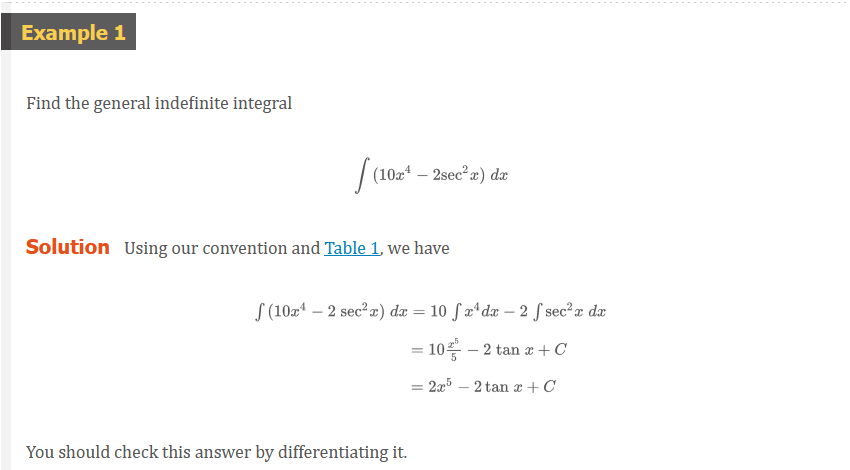
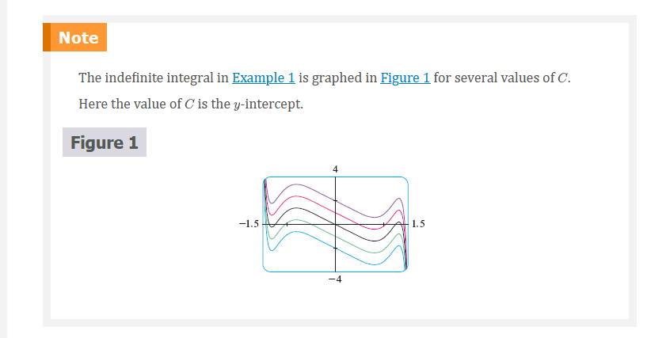
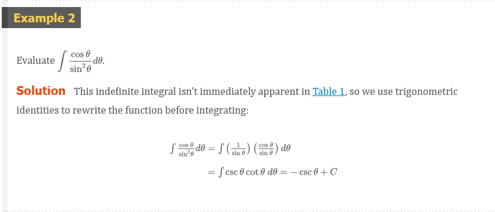
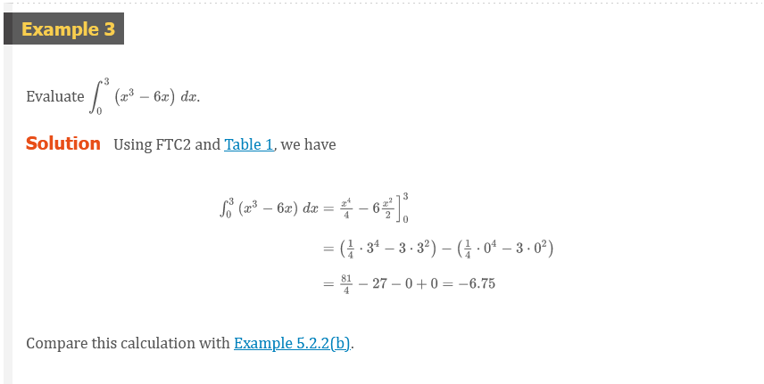
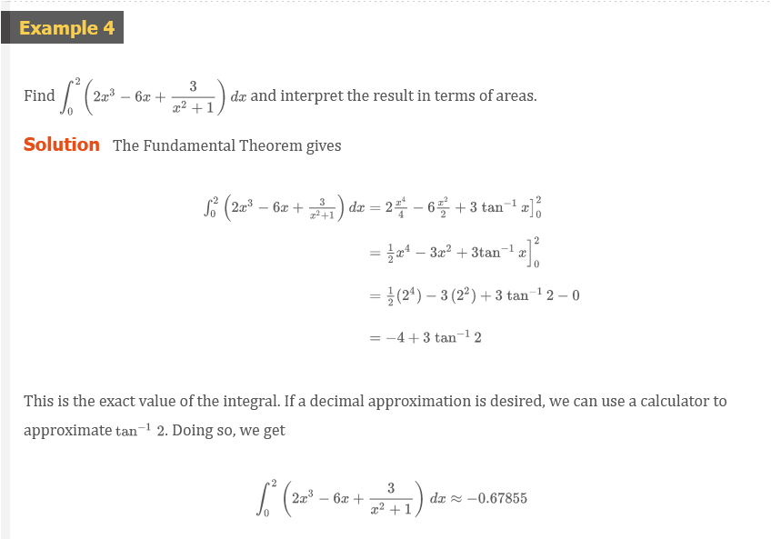
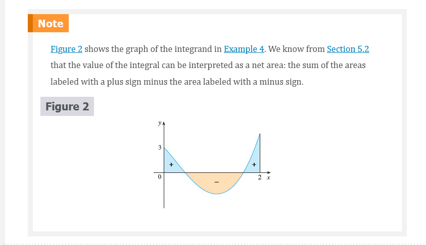
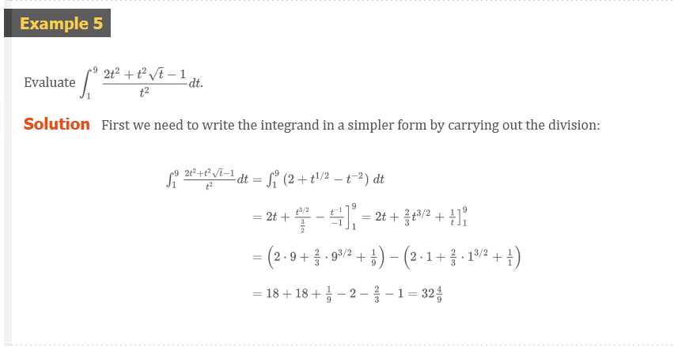

## Applications

Part 2 of the Fundamental Theorem says that if $f$ is continuous on $[a, b]$,
then

$$
\int_{a}^{b} f(x)dx = F(b) - F(a)
$$

where $F$ is any antiderivative of $f$. This means that $F^{\prime} = f$, so the
equation can be rewritten as

$$
\int_{a}^{b} F^{\prime}(x)dx = F(b) - F(a)
$$

We know that $F^{\prime}(x)$ represents the rate of change of $y = F(x)$ with
respect to $x$ and $F(b) - F(a)$ is the change in $y$ when $x$ changes from $a$
to $b$. [Note that $y$ could, for instance, increase, then decrease, then
increase again. Although might change in both directions, $F(b) - F(a)$
represents the net change in $y$.] So we can reformulate FTC2 in words as
follows.

### Net change Theorem

The integral of a rate of change is the net change:

$$
\int_{a}^{b} F^{\prime}(x)dx = F(b) - F(a)
$$

This principle can be applied to all of the rates of change in the natural and
social sciences that we discussed in Section 3.7. Here are a few instances of
this idea:

- If $V(t)$ is the volume of water in a reservoir at time $t$, then its
  derivative $v^{\prime}(t)$ is the rate at which water flows into the reservoir
  at time $t$. So

  $$
  \int_{t_{1}}^{t_{2}} V^{\prime}(t)dt = V(t_{2}) - V(t_{1})
  $$

  is the change in the amount of water in the reservoir between time $t_{1}$ and
  time $t_{2}$.

- If $[C](t)$ is the concentration of the product of a chemical reaction at time
  $t$, then the rate of reaction is the derivative $d[C]/dt$. So

  $$
  \int_{t_{1}}^{t_{2}} \frac{d[C]}{dt}dt = [C](t_{2}) - [C](t_{1})
  $$

  is the change in the concentration of $C$ from time $t_{1}$ to time $t_{2}$.

- If the mass of a rod measured from the left end to a point $x$ is $m(x)$, then
  the linear density is $\rho(x) = m^{\prime}(x)$. So

  $$
  \int_{a}^{b} \rho(x)dx = m(b) - m(a)
  $$

  is the mass of the segment of the rod that lies between $x = a$ and $x = b$.

- If the rate of growth of a population is $dn/dt$, then

  $$
  \int_{t_{1}}^{t_{2}} \frac{dn}{dt}dt = n(t_{2}) - n(t_{1})
  $$

  is the net change in population during the time period from $t_{1}$ to
  $t_{2}$. (The population increases when births happen and decreases when
  deaths occur. The net change takes into account both births and deaths.)

- If $C(x)$ is the cost of producing $x$ units of a commodity, then the marginal
  cost is the derivative $C^{\prime}(x)$. So

  $$
  \int_{x_{1}}^{x_{2}} C^{\prime}(x)dx = C(x_{2}) - C(x_{1})
  $$

  is the increase in cost when production is increased from $x_{1}$ units to
  $x_{2}$ units.

- If an object moves along a straight line with position function $s(t)$, then
  its velocity is $v(t) = s^{\prime}(t)$, so

### Definition 2

$$
\int_{t_{1}}^{t_{2}} v(t)dt = s(t_{2}) - s(t_{1})
$$

is the net change of position, or displacement, of the particle during the time
period from $t_{1}$ to $t_{2}$. In Section 5.1 we guessed that this was true for
the case where the object moves in the positive direction, but now we have
proved that it is always true.

- If we want to calculate the distance the object travels during the time
  interval, we have to consider the intervals when $v(t) \ge 0$ (the particle
  moves to the right) and also the intervals when $v(t) \le 0$ (the particle
  moves to the left). In both cases the distance is computed by integrating
  $|v(t)|$, the speed. Therefore

### Definition 3

$$
\int_{t^{1}}^{t^{2}} |v(t)|dt = \text{ total distance traveled }
$$

Figure 3 shows how both displacement and distance traveled can be interpreted in
terms of areas under a velocity curve.

$$
\text{ displacement } = \int_{t_{1}}^{t_{2}} v(t)dt = A_{1} - A_{2} + A_{3} \\
\text{ distance } = \int_{t_{1}}^{t_{2}} |v(t)|dt = A_{1} + A_{2} + A_{3}
$$

- The acceleration of the object is $a(t) = v^{\prime}(t)$, so

  $$
  \int_{t_{1}}^{t_{2}} a(t)dt = v(t_{2}) - v(t_{1})
  $$

  is the change in velocity from time $t_{1}$ to time $t_{2}$.

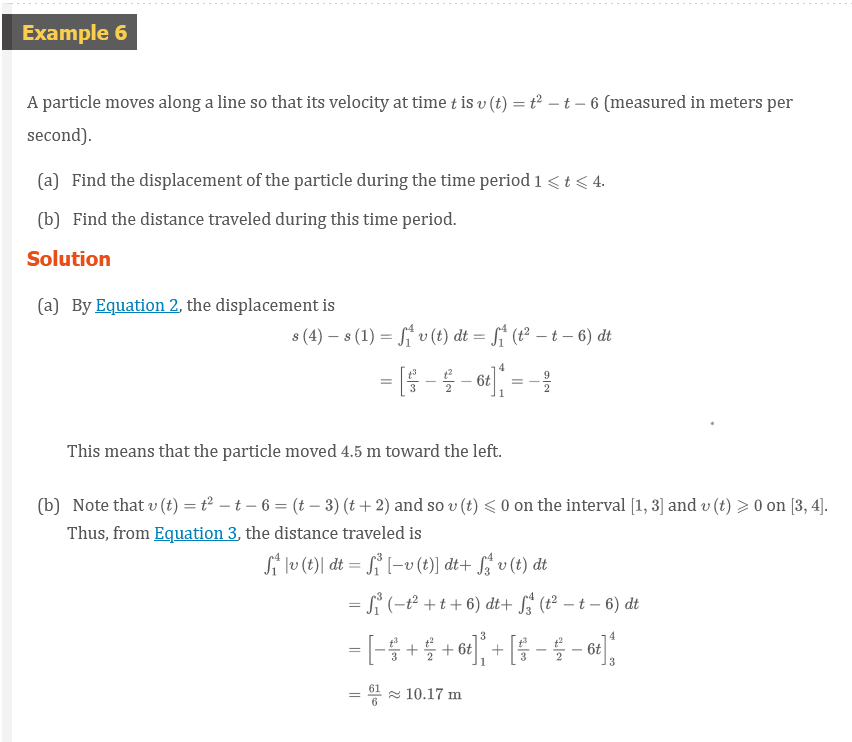
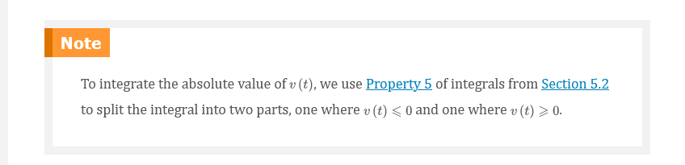
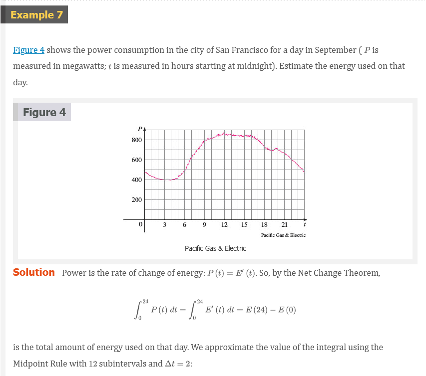
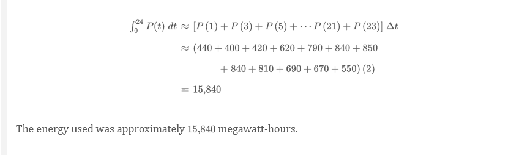

### A Note on Units

How did we know what units to use for energy in Example 7? The integral
$\int_{0}^{24} P(t)dt$ is defined as the limit of sums of terms of the form
$P(t_{i}^{*}\Delta{t}$. Now $P(t_{i}^{*})$ is measured in megawatts and
$\Delta{t}$ is measured in hours, so their product is measured in
megawatt-hours. The same is true of the limit. In general, the unit of
measurement for $\int_{a}^{b} f(x)dx$ is the product of the unit for $f(x)$ and
the unit for $x$.

 

# Resources

Textbook

+ [📄 Cengage e-Textbook: Calculus Early Transcendentals, Eighth Edition, Stewart](https://webassign.com/)

