# Chapter 5.5: The Substitution Rule

## The Substitution Rule

Because of the Fundamental Theorem, it's important to be able to find
antiderivatives. But our antidifferentiation formulas don't tell us how to
evaluate integrals such as

### Definition 1

$$
\int 2x\sqrt{1 + x^{2}} dx
$$

To find this integral we use the problem-solving strategy of introducing
something extra. Here the "something extra" is a new variable; we change from
the variable $x$ to a new variable $u$. Suppose that we let $u$ be the quantity
under the root sign in (1), $u = 1 + x^{2}$. Then the differential of $u$ is
$du= 2x\;dx$. Notice that if the $dx$ in the notation for an integral were to be
interpreted as a differential, then the differential $2x\;dx$ would occur in (1)
and so, formally, without justifying our calculation, we could write

### Definition 2

$$
\begin{aligned}
  \int 2x\sqrt{1 + x^{2}} dx &= \int \sqrt{1 + x^{2}} 2x\;dx = \int \sqrt{u} du \\
                             &= \frac{2}{3}u^{3/2} + C = \frac{2}{3}(1 + x^{2})^{3/2} + C \\
\end{aligned}
$$

> **Note**

Differentials were defined in Section 3.10. If $u = f(x)$ then

$$
du = f^{\prime}(x)dx
$$

But now we can check that we have the correct answer by using the Chain Rule to
differentiate the final function of Equation 2:

$$
\frac{d}{dx}\left [ \frac{2}{3}(1 + x^{2})^{3/2} + C \right ] = \frac{2}{3} \cdot \frac{3}{2}(1 + x^{2})^{1/2} \cdot 2x = 2x\sqrt{1 + x^{2}}
$$

In general, this method works whenever we have an integral that we can write in
the form $\int f(g(x))g^{\prime}(x)dx$. Observe that if $F^{\prime} = f$, then

### Definition 3

$$
\int F^{\prime}(g(x))g^{\prime}dx = F(g(x)) + C
$$

because, by the Chain Rule,

$$
\frac{d}{dx}[F(g(x))] = F^{\prime}(g(x))g^{\prime}(x)
$$

If we make the "change of variable" or "substitution" $u = g(x)$, then from
Equation 3 we have

$$
\int F^{\prime}(g(x))g^{\prime}(x)dx = F(g(x)) + C = F(u) + C = \int F^{\prime}(u)du
$$

or, writing $F^{\prime} = f$, we get

$$
\int f(g(x))g^{\prime}(x)dx = \int f(u)du
$$

Thus we have proved the following rule.

### The Substitution Rule 4

If $u = g(x)$ is a differentiable function whose range is an interval $I$ and
$f$ is continuous $I$, then

$$
\int f(g(x))g^{\prime}(x)dx = \int f(u)du
$$

Notice that the Substitution Rule for integration was proved using the Chain
Rule for differentiation. Notice also that if $u = g(x)$, then $du =
g^{\prime}(x)dx$, so a way to remember the Substitution Rule is to think of $dx$
and $du$ in (4) as differentials.

Thus the Substitution Rule says: **It is permissible to operate with and after
integral signs as if they were differentials.**

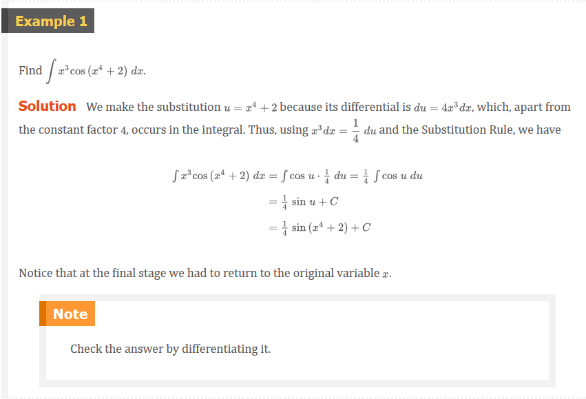

The idea behind the Substitution Rule is to replace a relatively complicated
integral by a simpler integral. This is accomplished by changing from the
original variable $x$ to a new variable $u$ that is a function of $x$. Thus in
Example 1 we replaced the integral $\int x^{2}cos(x^{4} + 2)\;dx$ by the simpler
integral $\frac{1}{4}\int \cos(u)\;du$.

The main challenge in using the Substitution Rule is to think of an appropriate
substitution. You should try to choose $u$ to be some function in the integrand
whose differential also occurs (except for a constant factor). This was the case
in Example 1. If that is not possible, try choosing $u$ to be some complicated
part of the integrand (perhaps the inner function in a composite function).
Finding the right substitution is a bit of an art. It's not unusual to guess
wrong; if your first guess doesn't work, try another substitution.

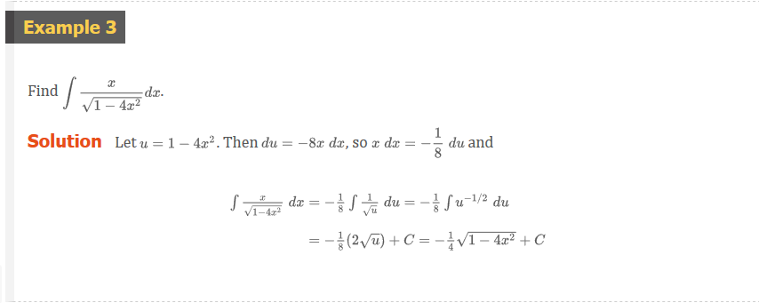

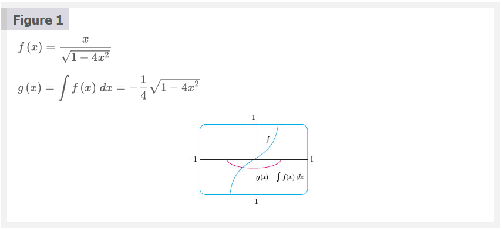
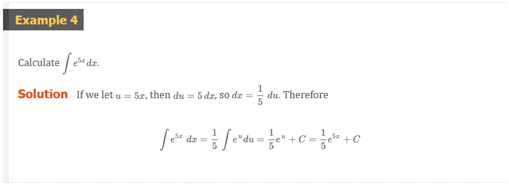

**Note** With some experience, you might be able to evaluate integrals like
those in Examples 1, 2, 3, and 4 without going to the trouble of making an
explicit substitution. By recognizing the pattern in Equation 3, where the
integrand is the product of the derivative of an outer function and the
derivative of the inner function, we could work Example 1 as follows:

$$
\begin{aligned}
  \int x^{3}\cos(x^{4} + 2)\;dx &= \int \cos(x^{4} + 2) \cdot x^{3}\;dx \\
                                &= \frac{1}{4}\int \cos(x^{4} + 2) \cdot \frac{d}{dx}(x^{4} + 2)dx = \frac{1}{4}\sin(x^{4} + 2) + C \\
\end{aligned}
$$

Similarly, the solution to Example 4 could be written like this:

$$
\int e^{5x}\;dx = \frac{1}{5}\int 5e^{5x}\;dx = \frac{1}{5}\int \frac{d}{dx}(e^{5x})dx = \frac{1}{5}e^{5x} + C
$$

The following example, however, is more complicated and so an explicit
substitution is advisable.

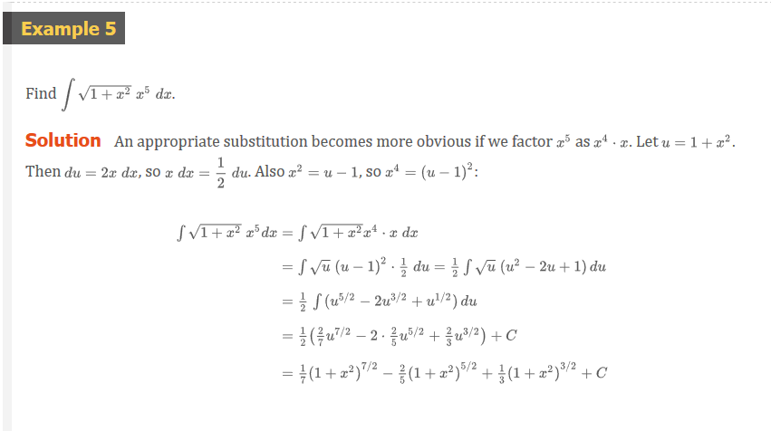
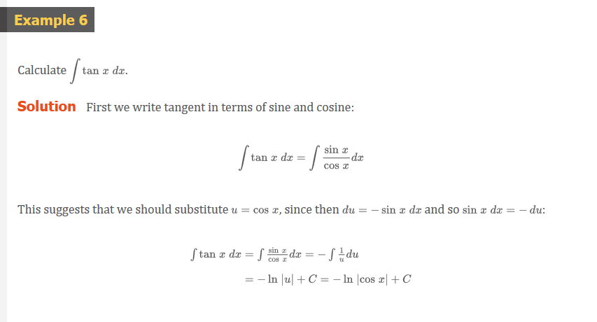

Since $-\ln(|\cos(x)|) = \ln(|\cos(x)|^{-1}) = \ln(1/\cos(x)|) = \ln(|\sec(x)|)$, the result of Example 6 can also be written as

### Definition 5

$$
\int \tan(x)\;dx = \ln|\sec(x)| + C
$$

## Definite Integrals

When evaluating a _definite_ integral by substitution, two methods are possible.
One method is to evaluate the indefinite integral first and then use the
Fundamental Theorem. For instance, using the result of Example 2, we have

$$
\begin{aligned}
  \int_{0}^{4} \sqrt{2x + 1}dx &= \left . \int \sqrt{2x + 1}dx \right ]_{0}^{4} \\
                               &= \left . \frac{1}{3}(2x + 1)^{3/2} \right ]_{0}^{4} = \frac{1}{3}(9)^{3/2} - \frac{1}{3}(1)^{3/2} \\
                               &= \frac{1}{3}(27 - 1) = \frac{26}{3} \\
\end{aligned}
$$

Another method, which is usually preferable, is to change the limits of
integration when the variable is changed.

### The Substitution Rule for Definite Integrals

If $g^{\prime}$ is continuous on $[a, b]$ and $f$ $is continuous on the range of
$u = g(x)$, then

$$
\int_{a}^{b} f(g(x))g^{\prime}(x)\;dx = \int_{g(a)}^{g(b)} f(u)du
$$

> **Note**

This rule says that when using a substitution in a definite integral, we must
put everything in terms of the new variable $u$, not only $x$ and $dx$ but also
the limits of integration. The new limits of integration are the values of $u$
that correspond to $x = a$ and $x = b$.

> **Proof**

Let $F$ be an antiderivative of $f$. Then, by (3), $F(g(x))$ is an
antiderivative of $f(g(x))g^{\prime}(x)$, so by Part 2 of the Fundamental
Theorem, we have

$$
\left . \int_{a}^{b} f(g(x))g^{\prime}(x)\;dx = F(g(x)) \right ]_{a}^{b} = F(g(b)) - F(g(a))
$$

But, applying FTC2 a second time, we also have

$$
\left . \int_{g(a)}^{g(b)} f(u)\;du = F(u) \right ]_{g(a)}^{g(b)} = F(g(b)) - F(g(a))
$$

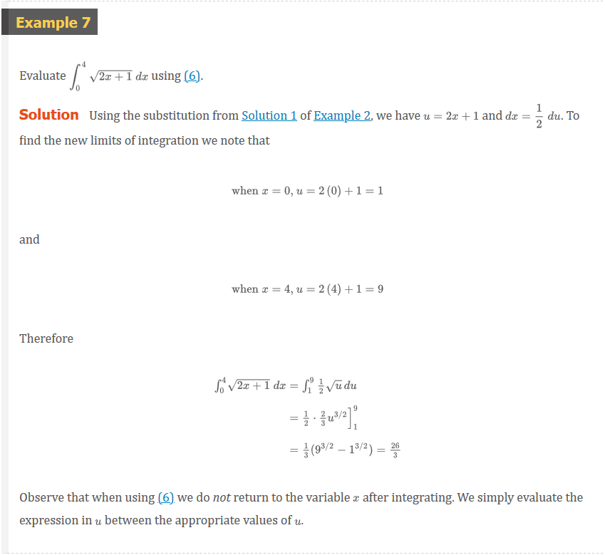
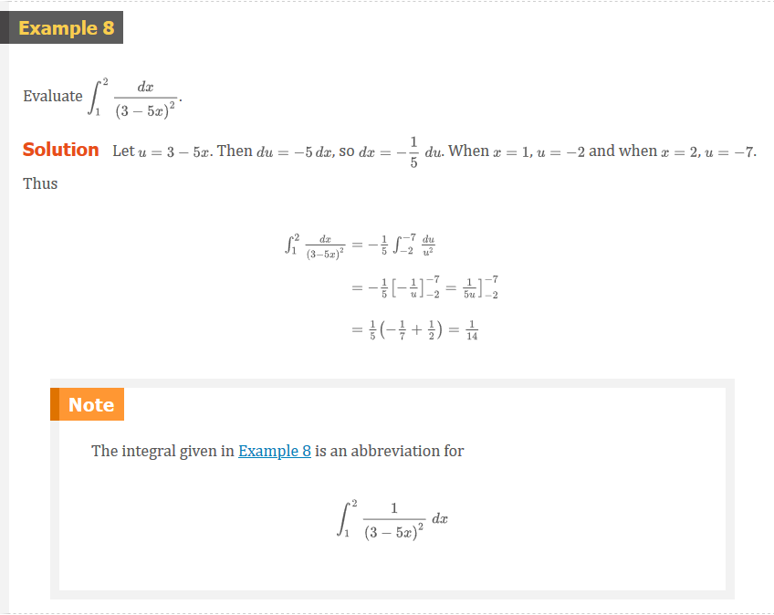
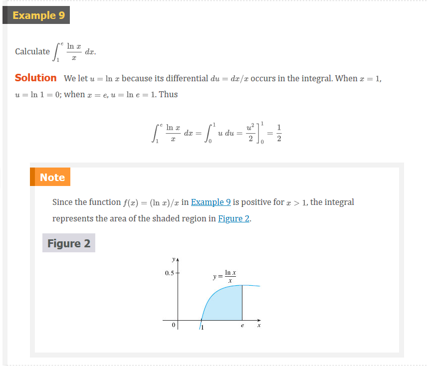

## Symmetry

The next theorem uses the Substitution Rule for Definite Integrals (6) to
simplify the calculation of integrals of functions that possess symmetry
properties.

### Integrals of Symmetric Functions

Suppose $f$ is continuous on $[-a, a]$.

1. If $f$ is even $[f(-x) = f(x)]$ then $\int_{-a}^{a} f(x)dx = 2\int_{0}^{a}
   f(x)dx$.
2. If $f$ is odd $[f(-x) = -f(x)]$ then $\int_{-a}^{a} f(x)dx = 0$.

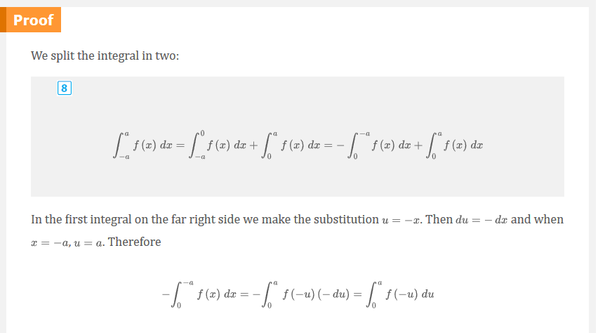
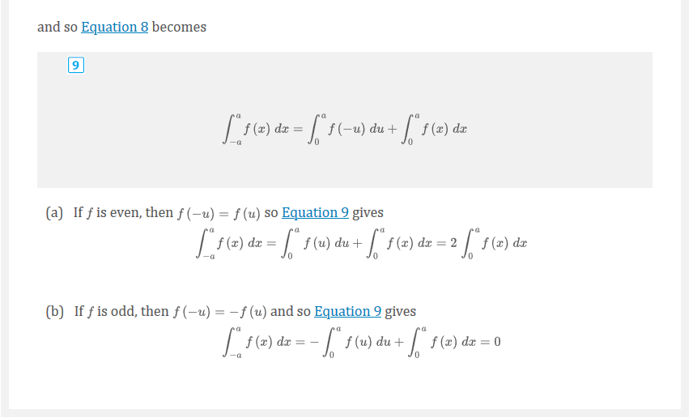

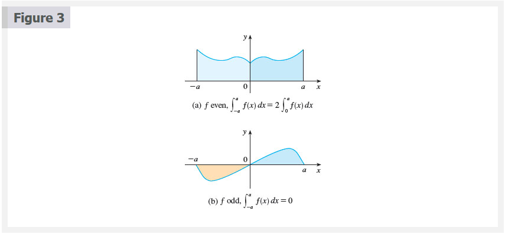

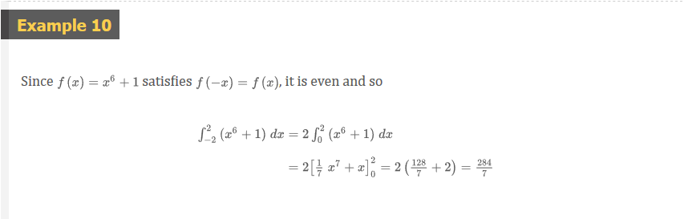
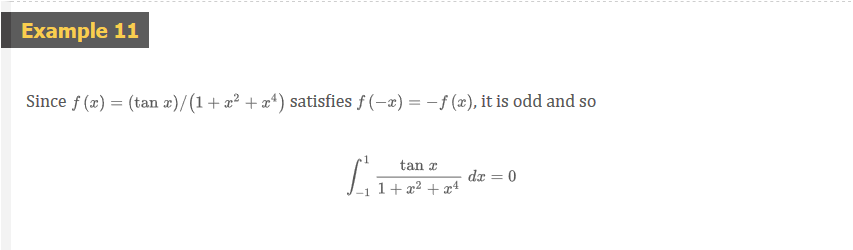

## Video Lectures

- [📺 _u_-substitution intro](https://www.khanacademy.org/math/ap-calculus-ab/ab-integration-new/ab-6-9/v/u-substitution)
- [📺 _u_-substitution: multiplying by a constant](https://www.khanacademy.org/math/ap-calculus-ab/ab-integration-new/ab-6-9/v/u-substitution-example-3)
- [📺 _u_-substitution: defining _u_](https://www.khanacademy.org/math/ap-calculus-ab/ab-integration-new/ab-6-9/v/u-substitution-defining-u)
- [📺 _u_-substitution: defining _u_ (more examples)](https://www.khanacademy.org/math/ap-calculus-ab/ab-integration-new/ab-6-9/v/u-substitution-defining-u-exp)
- [📄 _u_-substitution](https://www.khanacademy.org/math/ap-calculus-ab/ab-integration-new/ab-6-9/a/review-applying-u-substitution)
- [📺 _u_-substitution: rational function](https://www.khanacademy.org/math/ap-calculus-ab/ab-integration-new/ab-6-9/v/u-substitution-example-2)
- [📺 _u_-substitution: logarithmic function](https://www.khanacademy.org/math/ap-calculus-ab/ab-integration-new/ab-6-9/v/u-substitution-with-ln-x)
- [📄 _u_-substitution warmup](https://www.khanacademy.org/math/ap-calculus-ab/ab-integration-new/ab-6-9/a/worksheet-u-substitution)
- [📺 _u_-substitution: definite integrals](https://www.khanacademy.org/math/ap-calculus-ab/ab-integration-new/ab-6-9/v/u-substitution-definite-integrals)
- [📄 _u_-substitution with definite integrals](https://www.khanacademy.org/math/ap-calculus-ab/ab-integration-new/ab-6-9/a/u-substitution-definite-integrals)
- [📺 u-substitution: definite integral of exponential function](https://www.khanacademy.org/math/ap-calculus-ab/ab-integration-new/ab-6-9/v/u-substitution-exponential)

 

# Resources

- [📺 _u_-substitution intro](https://www.khanacademy.org/math/ap-calculus-ab/ab-integration-new/ab-6-9/v/u-substitution)
- [📺 _u_-substitution: multiplying by a constant](https://www.khanacademy.org/math/ap-calculus-ab/ab-integration-new/ab-6-9/v/u-substitution-example-3)
- [📺 _u_-substitution: defining _u_](https://www.khanacademy.org/math/ap-calculus-ab/ab-integration-new/ab-6-9/v/u-substitution-defining-u)
- [📺 _u_-substitution: defining _u_ (more examples)](https://www.khanacademy.org/math/ap-calculus-ab/ab-integration-new/ab-6-9/v/u-substitution-defining-u-exp)
- [📄 _u_-substitution](https://www.khanacademy.org/math/ap-calculus-ab/ab-integration-new/ab-6-9/a/review-applying-u-substitution)
- [📺 _u_-substitution: rational function](https://www.khanacademy.org/math/ap-calculus-ab/ab-integration-new/ab-6-9/v/u-substitution-example-2)
- [📺 _u_-substitution: logarithmic function](https://www.khanacademy.org/math/ap-calculus-ab/ab-integration-new/ab-6-9/v/u-substitution-with-ln-x)
- [📄 _u_-substitution warmup](https://www.khanacademy.org/math/ap-calculus-ab/ab-integration-new/ab-6-9/a/worksheet-u-substitution)
- [📺 _u_-substitution: definite integrals](https://www.khanacademy.org/math/ap-calculus-ab/ab-integration-new/ab-6-9/v/u-substitution-definite-integrals)
- [📄 _u_-substitution with definite integrals](https://www.khanacademy.org/math/ap-calculus-ab/ab-integration-new/ab-6-9/a/u-substitution-definite-integrals)
- [📺 u-substitution: definite integral of exponential function](https://www.khanacademy.org/math/ap-calculus-ab/ab-integration-new/ab-6-9/v/u-substitution-exponential)

Textbook

+ [📄 Cengage e-Textbook: Calculus Early Transcendentals, Eighth Edition, Stewart](https://webassign.com/)

