# Chapter 6.1: Areas Between Curves

## Areas Between Curves

In Chapter 5 we defined and calculated areas of regions that lie under the
graphs of functions. Here we use integrals to find areas of regions that lie
between the graphs of two functions.

Consider the region $S$ that lies between two curves $y = f(x)$ and $y = g(x)$
and between the vertical lines $x = a$ and $x = b$, where $f$ and $g$ are
continuous functions and $f(x) \ge g(x)$ for all $x$ in $[a, b]$. (See Figure
1.)

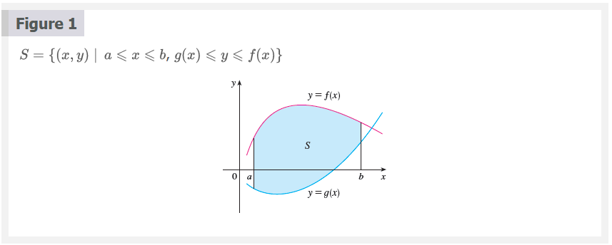

Just as we did for areas under curves in Section 5.1, we divide $S$ into $n$
strips of equal width and then we approximate the $i$th strip by a rectangle
with base $\Delta{x}$ and height $f(x_{i}^{*})$. (See Figure 2. If we like, we
could take all of the sample points to be right endpoints, in which case
$x_{i}^{*} = x_{i}$.) The Riemann sum

$$
\sum_{i = 1}^{n} [f(x_{i}^{*}) - g(x_{i}^{*})]\;\Delta{x}
$$

is therefore an approximation to what we intuitively think of as the area of
$S$.

This approximation appears to become better and better as $n \to \infty$.
Therefore we define the **area** $A$ of the region $S$ as the limiting value of
the sum of the areas of these approximating rectangles.

### Definition 1

$$
A = \lim_{n \to \infty} \sum_{i = 1}^{n} [f(x_{i}^{*}) - g(x_{i}^{*})]\;\Delta{x}
$$

We recognize the limit in (1) as the definite integral of $f - g$. Therefore we
have the following formula for area.

### Definition 2

The area $A$ of the region bounded by the curves $y = f(x)$, $y = g(x)$, and the
lines $x = a$, $x = b$, where $f$ and $g$ are continuous and $f(x) \ge g(x)$ for
all $x$ in $[a, b]$, is

$$
A = \int_{a}^{b} [f(x) - g(x)]\;dx
$$

Notice that in the special case where $g(x) = 0$, $S$ is the region under the
graph of $f$ and our general definition of area (1) reduces to our previous
definition (Definition 5.1.2).

In the case where both $f$ and $g$ are positive, you can see from Figure 3 why
(2) is true:

$$
\begin{aligned}
  A &= [\text{ area under } y = f(x)] - [\text{ area under } y = g(x)] \\
    &= \int_{a}^{b} f(x)\;dx - \int_{a}^{b} g(x)\;dx = \int_{a}^{b} [f(x) - g(x)]\;dx \\
\end{aligned}
$$

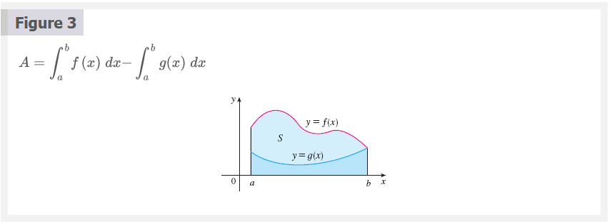

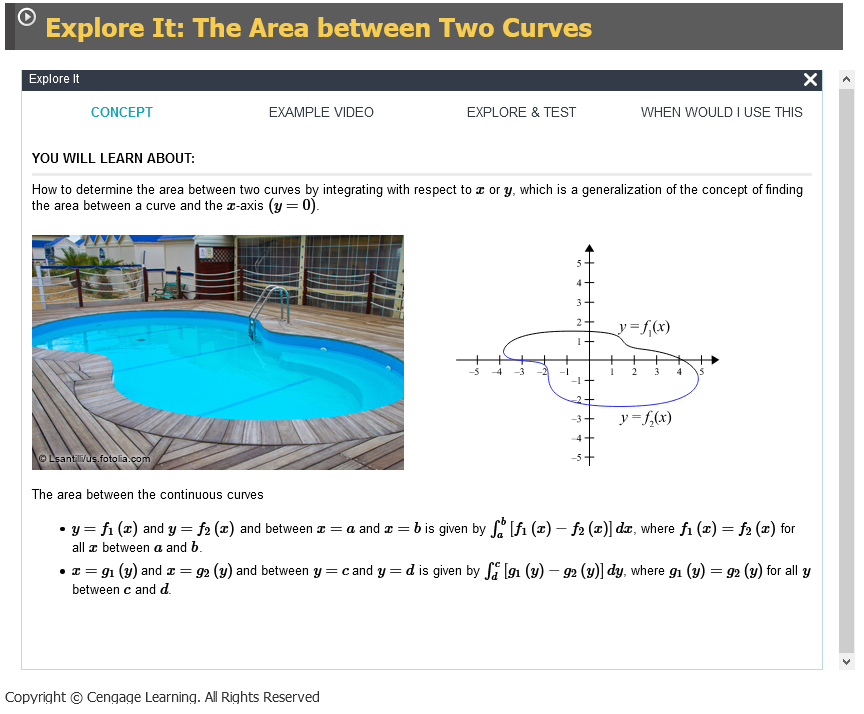

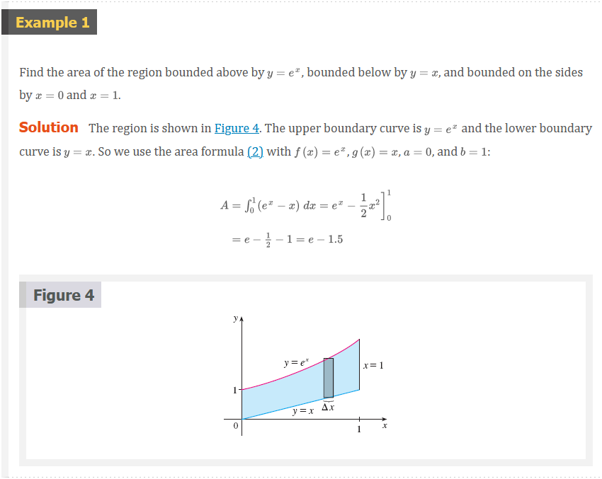

In Figure 4 we drew a typical approximating rectangle with width $\Delta{x}$ as
a reminder of the procedure by which the area is defined in (1). In general,
when we set up an integral for an area, it's helpful to sketch the region to
identify the top curve $y_{T}$, the bottom curve $y_{B}$, and a typical
approximating rectangle as in Figure 5.  Then the area of a typical rectangle is
$(y_{T} - y_{B})\Delta{x}$and the equation

$$
A = \lim_{n \to \infty} \sum_{i = 1}^{n} (y_{T} - y_{B})\;\Delta{x} = \int_{a}^{b} (y_{T} - y_{B})\;dx
$$

summarizes the procedure of adding (in a limiting sense) the areas of all the
typical rectangles.

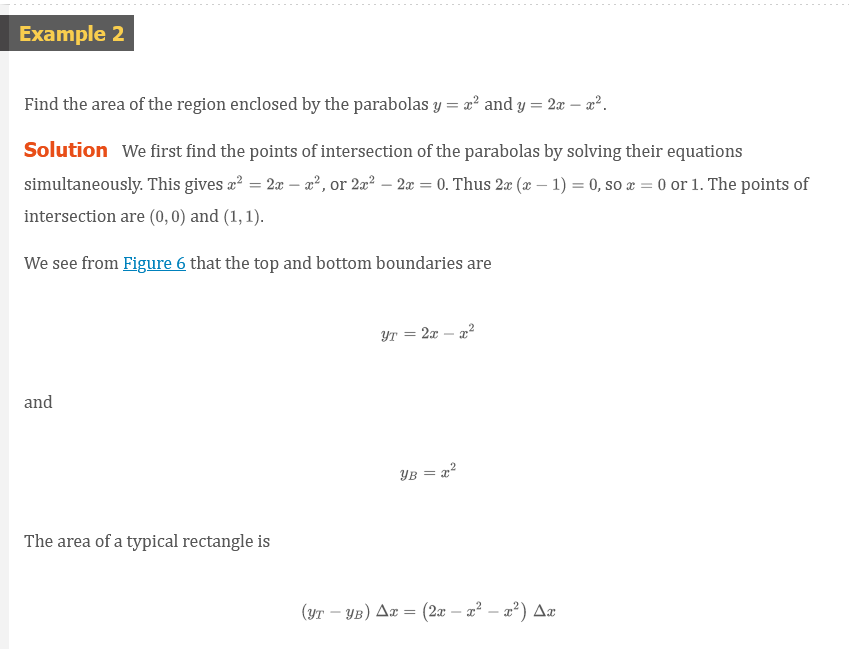
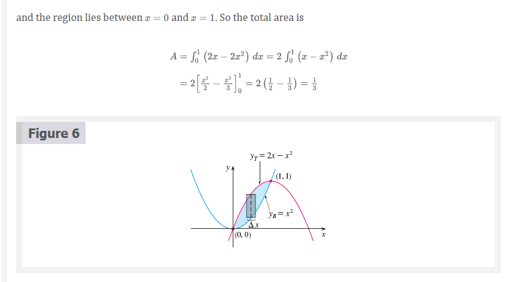

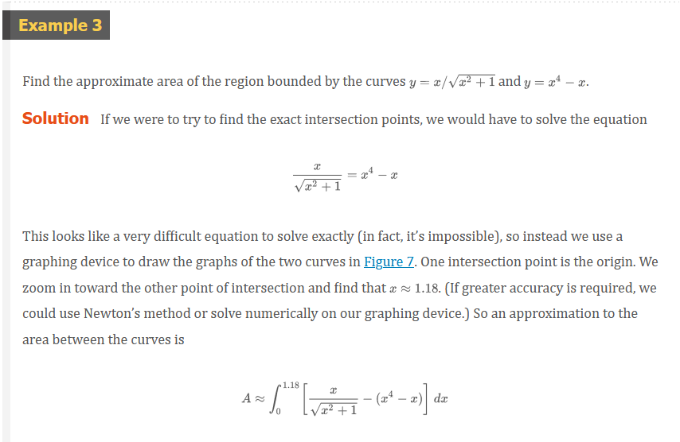
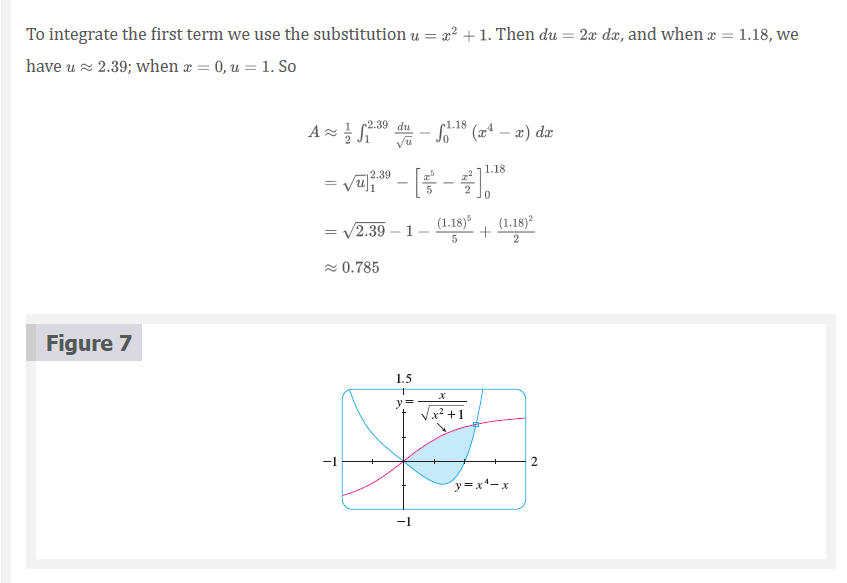

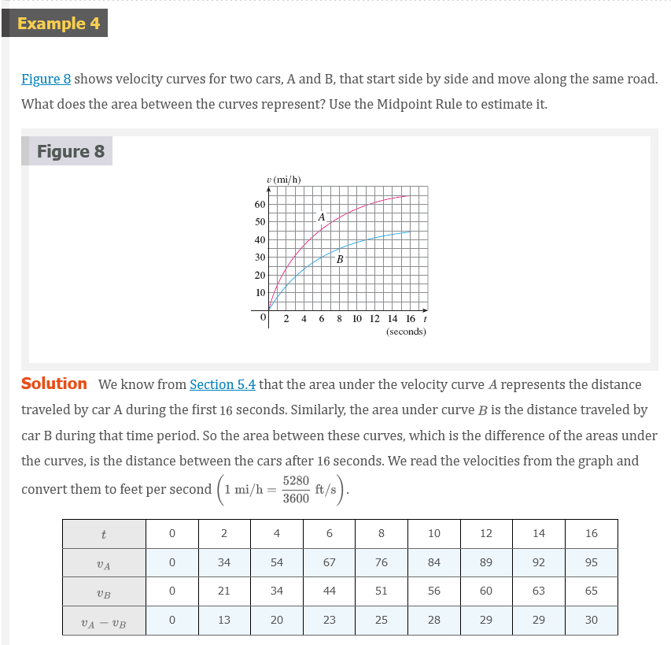
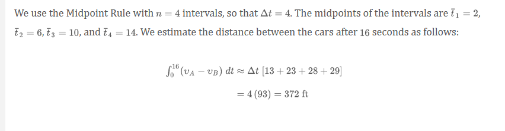

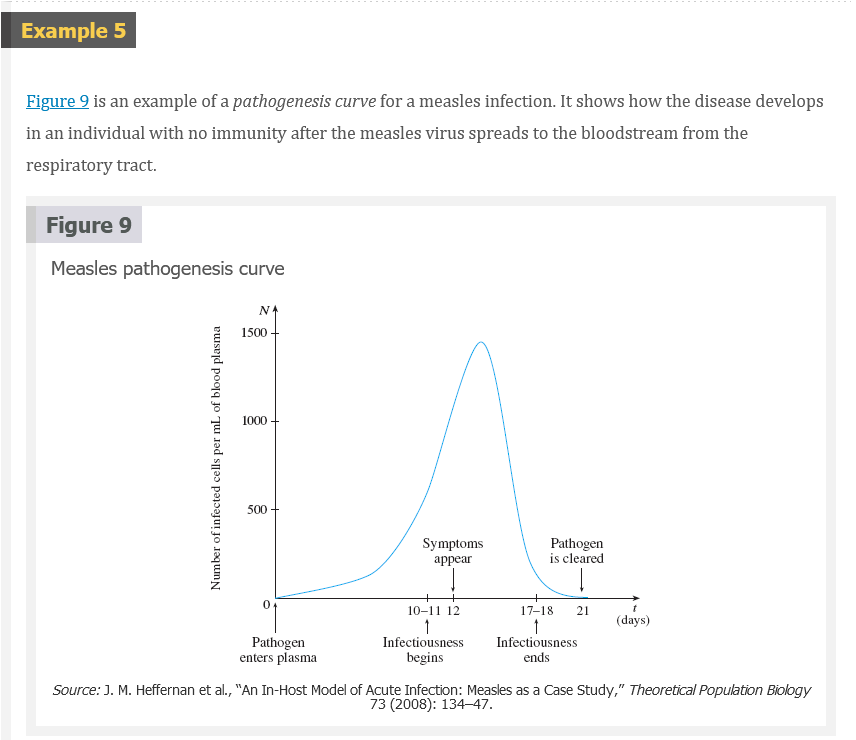
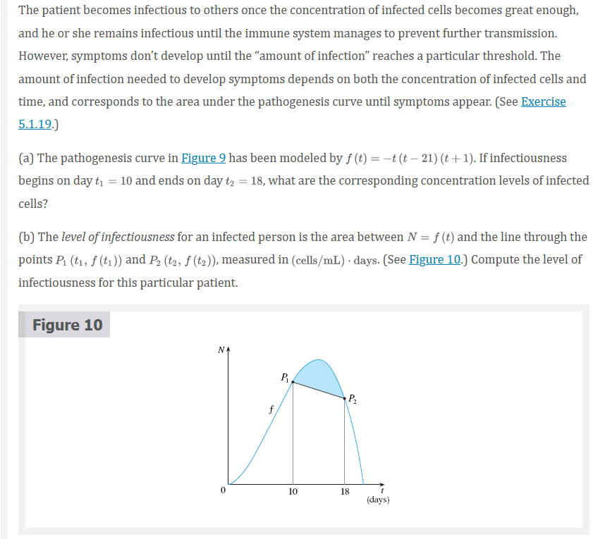
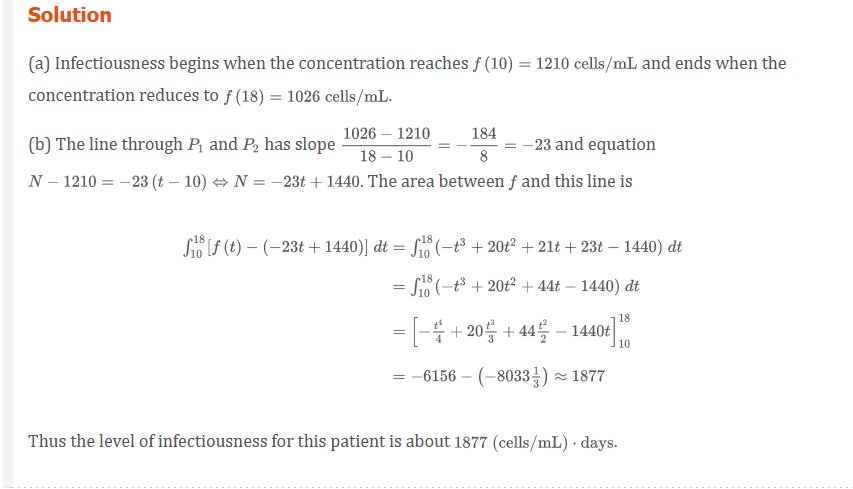

If we are asked to find the area between the curves $y = f(x)$ and $y = g(x)$
where $f(x) \ge g(x)$ for some values of $x$ but $g(x) \ge f(x)$ for other
values of $x$, then we split the given region $s$ into several regions $S_{1},
S_{2}, \cdots$ with areas $A_{1}, A_{2}, \cdots$ as shown in Figure 11. We then
define the area of the region $S$ to be the sum of the areas of the smaller
regions $S_{1}, S_{2}, \cdots$, that is, $A = A_{1} + A_{2} + \cdots$. Since

$$
|f(x) - g(x)| =
\left\{\begin{matrix}
  f(x) - g(x) \;\;\; \text{ when } \ge g(x) \\
  g(x) - f(x) \;\;\; \text{ when } \ge f(x) \\
\end{matrix}\right.
$$

we have the following expression for $A$.

### Definition 3

The area between the curves $y = f(x)$ and $y = g(x)$ and between $x = a$ and $x
= b$ is

$$
A = \int_{a}^{b} |f(x) - g(X)|\;dx
$$

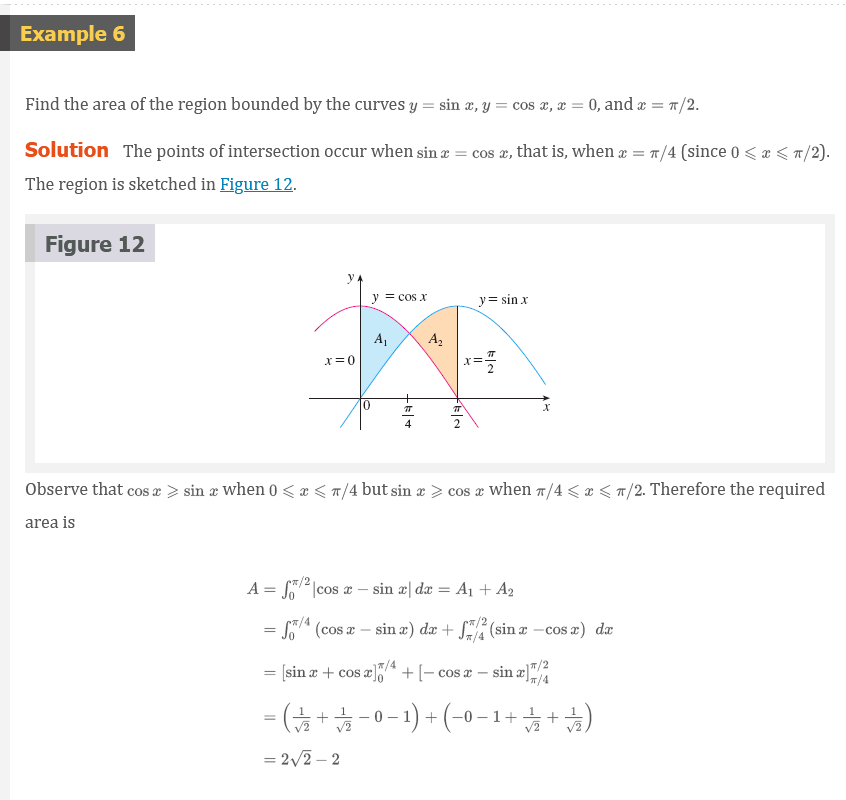
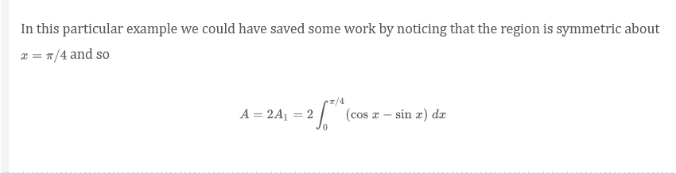

Some regions are best treated by regarding $x$ as a function of $y$. If a region
is bounded by curves with equations $x = f(y)$, $x = g(y)$, $y = c$, and $y =
d$, where $f$ and $g$ are continuous and $f(y) \ge g(y)$ for $c \le y \le d$
(See Figure 13), then its area is

$$
A = \int_{c}^{d} [f(y) - g(y)]\;dy
$$

If we write $x_{R}$ for the right boundary and $x_{L}$ for the left boundary,
then, as Figure 14 illustrates, we have

$$
A = \int_{c}^{d} (x_{R} - x_{L})\;dy
$$

Here a typical approximating rectangle has dimensions $x_{R} - x_{L}$ and
$\Delta{y}$.

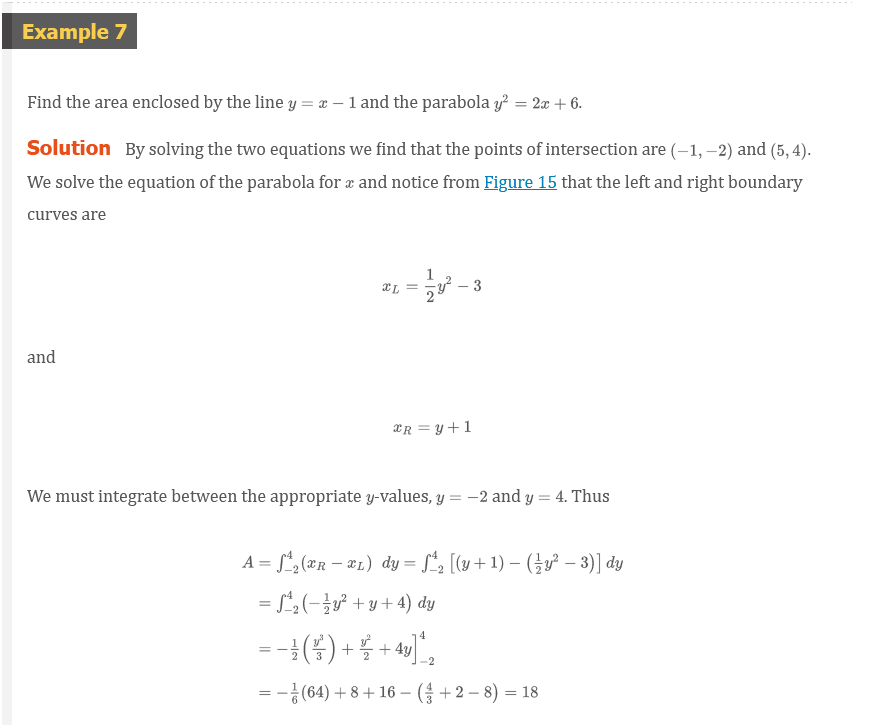
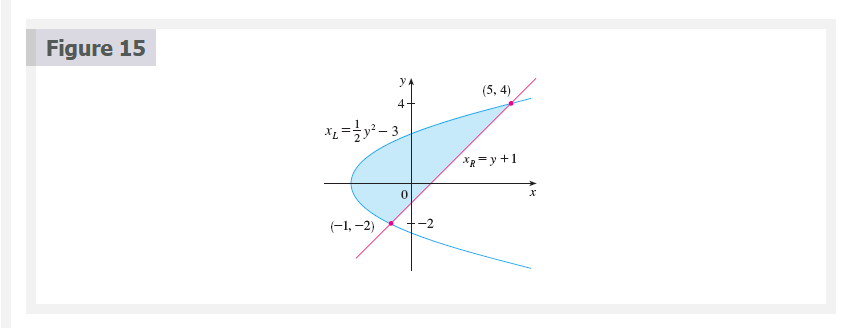

## Video Lectures

- [📺 Area between a curve and the x-axis](https://www.khanacademy.org/math/ap-calculus-ab/ab-applications-of-integration-new/ab-8-4/v/evaluating-simple-definite-integral)
- [📺 Area between a curve and the x-axis: negative area](https://www.khanacademy.org/math/ap-calculus-ab/ab-applications-of-integration-new/ab-8-4/v/definite-integrals-and-negative-area)
- [📺 Area between curves](https://www.khanacademy.org/math/ap-calculus-ab/ab-applications-of-integration-new/ab-8-4/v/area-between-curves)
- [📺 Worked example: area between curves](https://www.khanacademy.org/math/ap-calculus-ab/ab-applications-of-integration-new/ab-8-4/v/area-between-curves-example)
- [📺 Composite area between curves](https://www.khanacademy.org/math/ap-calculus-ab/ab-applications-of-integration-new/ab-8-4/v/area-between-curves-with-multiple-boundaries)
- [📺 Area between a curve and the y-axis](https://www.khanacademy.org/math/ap-calculus-ab/ab-applications-of-integration-new/ab-8-5/v/area-between-curve-and-y-axis)
- [📺 Horizontal area between curves](https://www.khanacademy.org/math/ap-calculus-ab/ab-applications-of-integration-new/ab-8-5/v/area-between-two-functions-of-y)

 

# Resources

- [📺 Area between a curve and the x-axis](https://www.khanacademy.org/math/ap-calculus-ab/ab-applications-of-integration-new/ab-8-4/v/evaluating-simple-definite-integral)
- [📺 Area between a curve and the x-axis: negative area](https://www.khanacademy.org/math/ap-calculus-ab/ab-applications-of-integration-new/ab-8-4/v/definite-integrals-and-negative-area)
- [📺 Area between curves](https://www.khanacademy.org/math/ap-calculus-ab/ab-applications-of-integration-new/ab-8-4/v/area-between-curves)
- [📺 Worked example: area between curves](https://www.khanacademy.org/math/ap-calculus-ab/ab-applications-of-integration-new/ab-8-4/v/area-between-curves-example)
- [📺 Composite area between curves](https://www.khanacademy.org/math/ap-calculus-ab/ab-applications-of-integration-new/ab-8-4/v/area-between-curves-with-multiple-boundaries)
- [📺 Area between a curve and the y-axis](https://www.khanacademy.org/math/ap-calculus-ab/ab-applications-of-integration-new/ab-8-5/v/area-between-curve-and-y-axis)
- [📺 Horizontal area between curves](https://www.khanacademy.org/math/ap-calculus-ab/ab-applications-of-integration-new/ab-8-5/v/area-between-two-functions-of-y)

Textbook

+ [📄 Cengage e-Textbook: Calculus Early Transcendentals, Eighth Edition, Stewart](https://webassign.com/)

