# Chapter 6.2: Volumes

## Volumes

In trying to find the volume of a solid we face the same type of problem as in
finding areas. We have an intuitive idea of what volume means, but we must make
this idea precise by using calculus to give an exact definition of volume.

We start with a simple type of solid called a cylinder (or, more precisely, a
_right cylinder_). As illustrated in Figure 1a, a cylinder is bounded by a plane
region $B_{1}$, called the **base**, and a congruent region $B_{2}$ in a
parallel plane.  The cylinder consists of all points on line segments that are
perpendicular to the base and join $B_{1}$ to $B_{2}$. If the area of the base
is $A$ and the height of the cylinder (the distance from $B_{1}$ to $B_{2}$) is
$h$, then the volume $V$ of the cylinder is defined as

$$
V = Ah
$$

In particular, if the base is a circle with radius, then the cylinder is a
circular cylinder with volume $V = \pi r^{2}h$ [see Figure 1(b)], and if the
base is a rectangle with length $l$ and width $w$, then the cylinder is a
rectangular box (also called a rectangular parallelepiped) with volume $V = lwh$
[see Figure 1(c)].

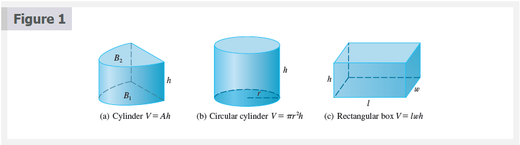

For a solid $S$ that isn't a cylinder we first "cut" $S$ into pieces and
approximate each piece by a cylinder. We estimate the volume $S$ of by adding
the volumes of the cylinders. We arrive at the exact volume of $S$ through a
limiting process in which the number of pieces becomes large.

We start by intersecting $S$ with a plane and obtaining a plane region that is
called a **cross-section** of $S$. Let $A(x)$ be the area of the cross-section
of $S$ in a plane $P_{x}$ perpendicular to the $x$-axis and passing through the
point $x$, where $a \le x \le b$. (See Figure 2. Think of slicing $S$ with a
knife through $x$ and computing the area of this slice.) The cross-sectional
area $A(x)$ will vary as $x$ increases from $a$ to $b$.

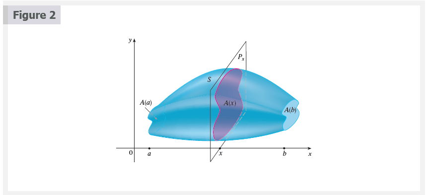

Let's divide $S$ into $n$ "slabs" of equal width $\Delta{x}$ by using the planes
$P_{x_{1}}, P_{x_{2}}, \cdots$ to slice the solid. (Think of slicing a loaf of
bread.) If we choose sample points $x_{i}^{*}$ in $[x_{i - 1}, x_{i}$, we can
approximate the $i$th slab $S_{i}$ (the part of $S$ that lies between the planes
$P_{x - 1}$ and $P_{xi}$) by a cylinder with base area $A(x_{i}^{*}$ and
"height" $\Delta{x}$. (See Figure 3.)

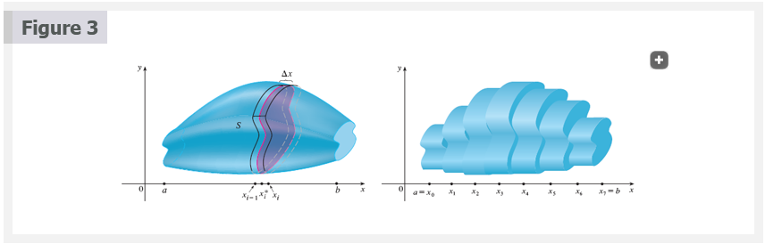

The volume of this cylinder is $A(x_{i}^{*})\Delta{x}$, so an approximation to
our intuitive conception of the volume of the $i$th slab $S$ is

$$
V(S_{i}) \approx A(x_{i}^{*})\;\Delta{x}
$$

Adding the volumes of these slabs, we get an approximation to the total volume
(that is, what we think of intuitively as the volume):

$$
V \approx \sum_{i = 1}^{n} A(x_{i}^{*})\;\Delta{x}
$$

This approximation appears to become better and better as $n \to \infty$. (Think
of the slices as becoming thinner and thinner.) Therefore we define the volume
as the limit of these sums as $n \to \infty$. But we recognize the limit of
Riemann sums as a definite integral and so we have the following definition.

## Definition of Volume

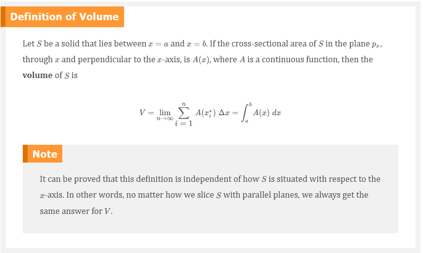

When we use the volume formula $V = \int_{a}^{b} A(x)\;dx$, it is important to
remember that $A(x)$ is the area of a moving cross-section obtained by slicing
through $x$ perpendicular to the $x$-axis.

Notice that, for a cylinder, the cross-sectional area is constant: $A(x) = A$
for all $x$. So our definition of volume gives $V = \int_{a}^{b} A\;dx = A(b -
a)$; this agrees with the formula $V = Ah$.

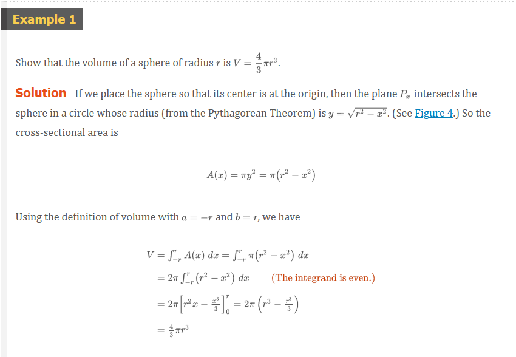
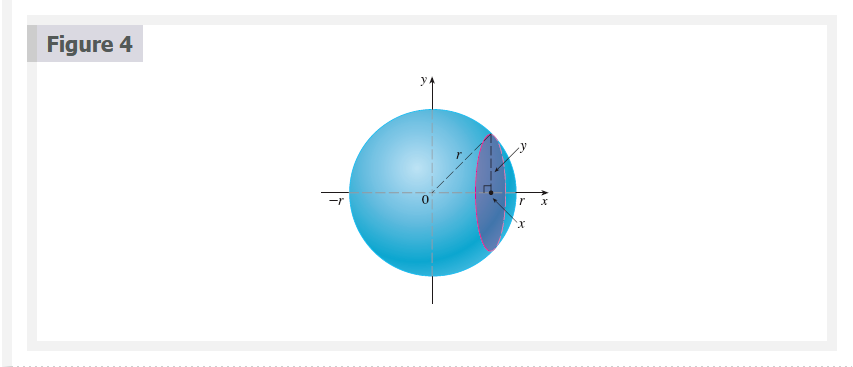

Figure 5 illustrates the definition of volume when the solid is a sphere with
radius $r = 1$. From the result of Example 1, we know that the volume of the
sphere is $\frac{4}{3}\pi$ , which is approximately $4.18879$. Here the slabs
are circular cylinders, or disks, and the three parts of Figure 5 show the
geometric interpretations of the Riemann sums

$$
\sum_{i = 1}^{n} A(\overline{x}_{i})\;\Delta{x} = \sum_{i = 1}^{n} \pi(1^{2} - \overline{x}_{i}^{2})\;\Delta{x}
$$

when $n = 5$, $10$, and $20$ if we choose the sample points $x_{i}^{*}$ to be
the midpoints $\overline{x}_{i}$. Notice that as we increase the number of
approximating cylinders, the corresponding Riemann sums become closer to the
true volume.

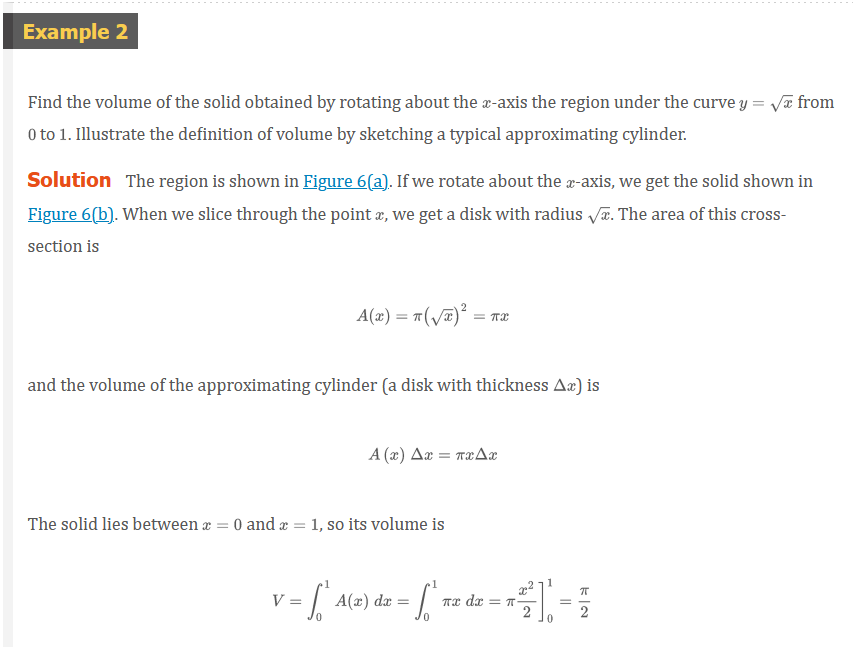
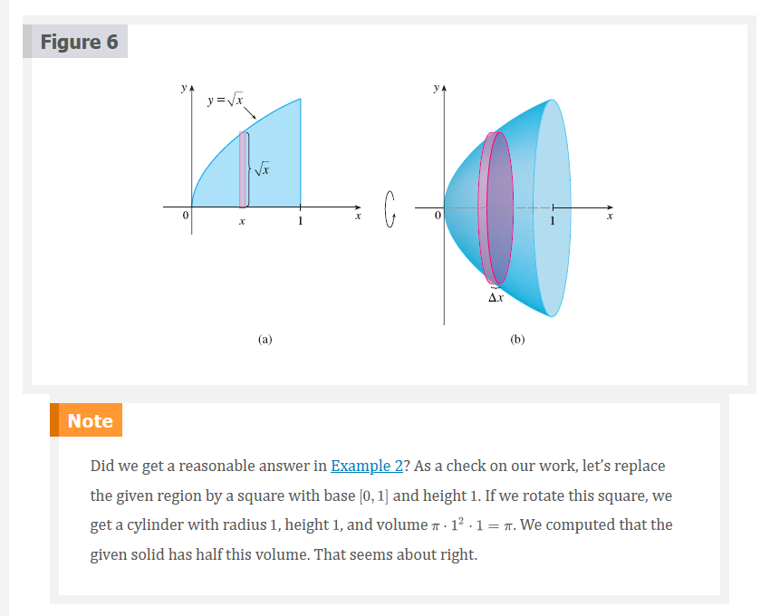

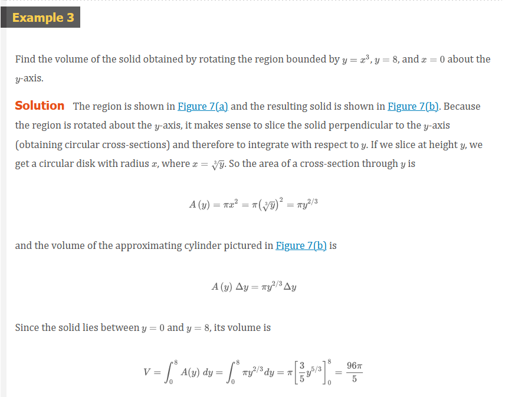
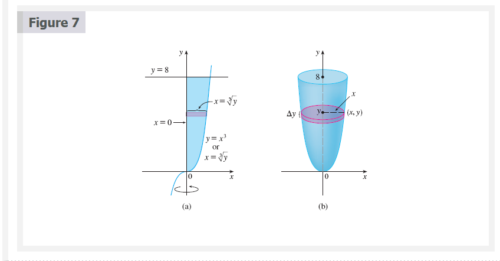

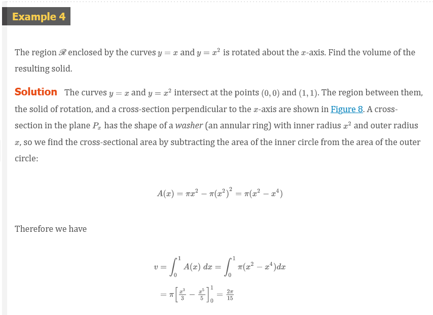
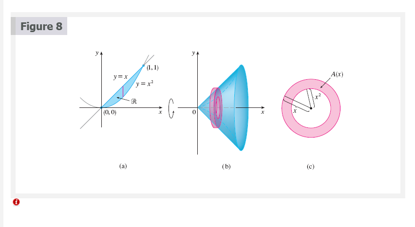

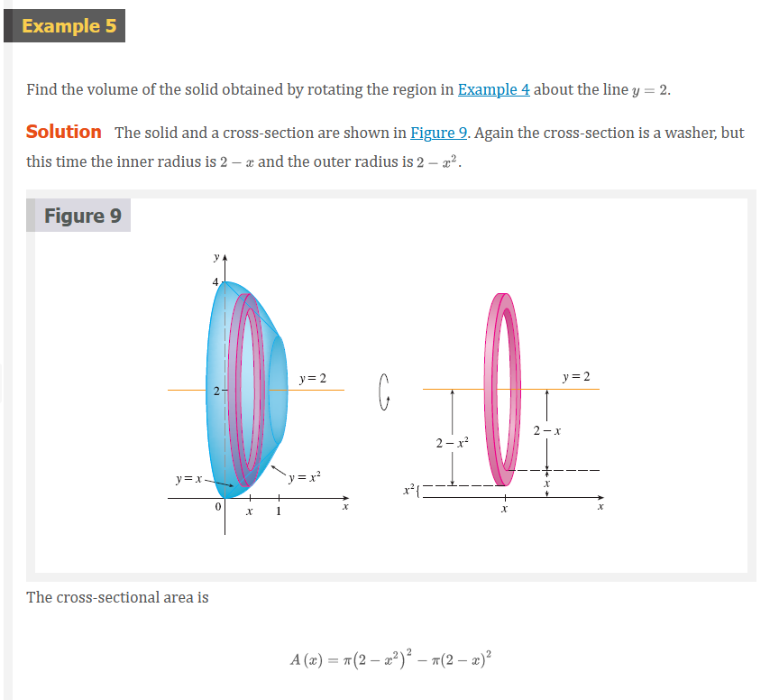
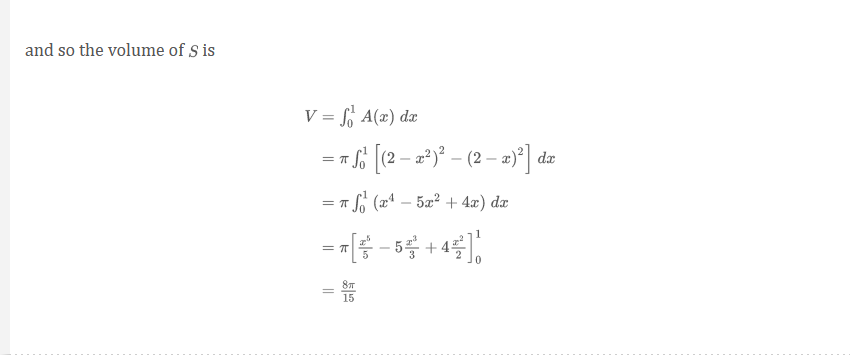

The solids in Examples 1, 2, 3, 4, and 5 are all called solids of revolution
because they are obtained by revolving a region about a line. In general, we
calculate the volume of a solid of revolution by using the basic defining
formula

$$
V = \int_{a}^{b} A(x)\;dx
$$

or

$$
V = \int_{c}^{d} A(y)\;dy
$$

and we find the cross-sectional area $A(x)$ or $A(y)$ in one of the following
ways:

- If the cross-section is a disk (as in Examples 1, 2, and 3), we find the
  radius of the disk (in terms of $x$ or $y$) and use

  $$
  A =\pi(radius)^{2}
  $$

- If the cross-section is a washer (as in Examples 4 and 5), we find the inner
  radius $r_{in}$ and outer radius $r_{out}$ from a sketch (as in Figures 8, 9,
  and 10) and compute the area of the washer by subtracting the area of the
  inner disk from the area of the outer disk:

  $$
  A = \pi(\text{outer radious})^{2} - \pi(\text{inner radius})^{2}
  $$

The next example gives a further illustration of the procedure.

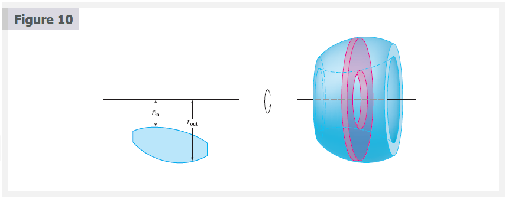

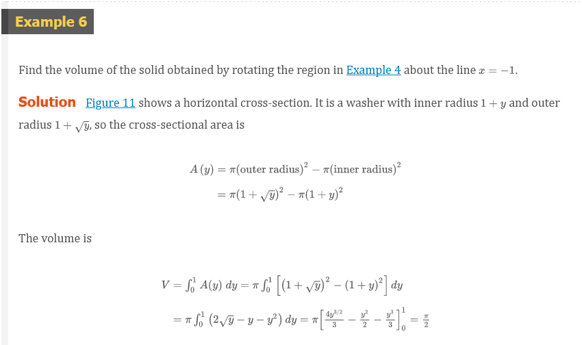
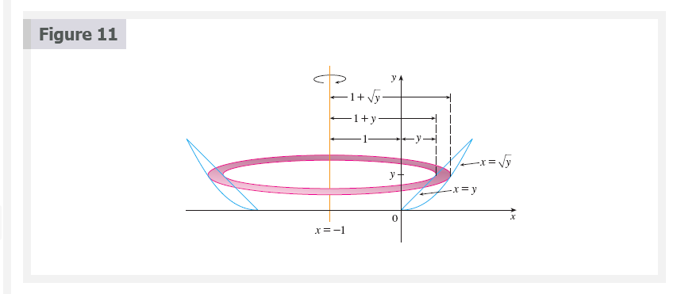

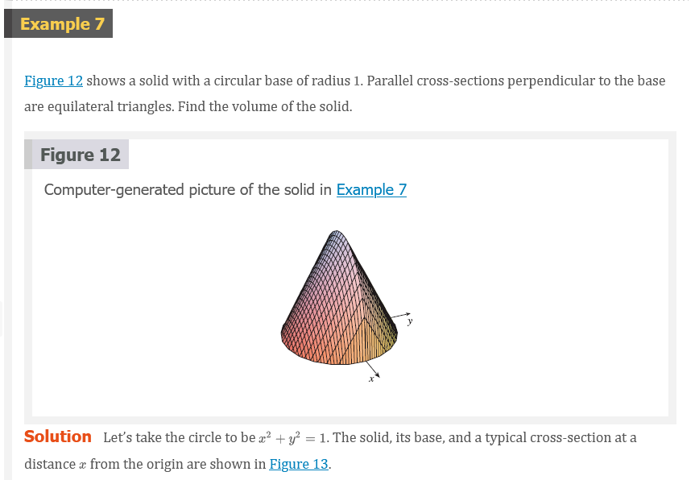
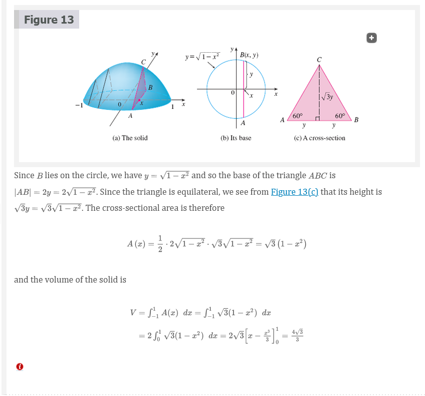

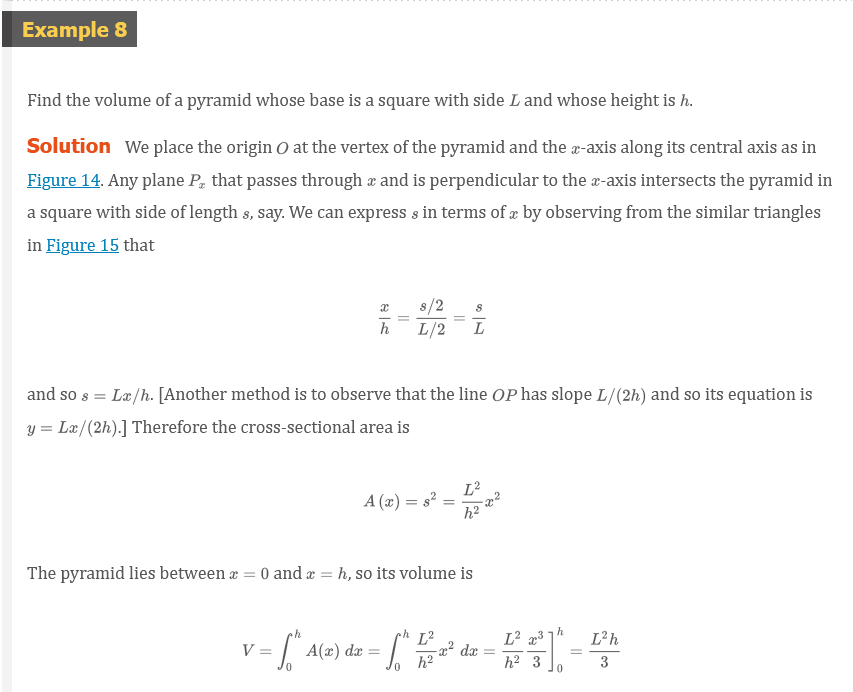
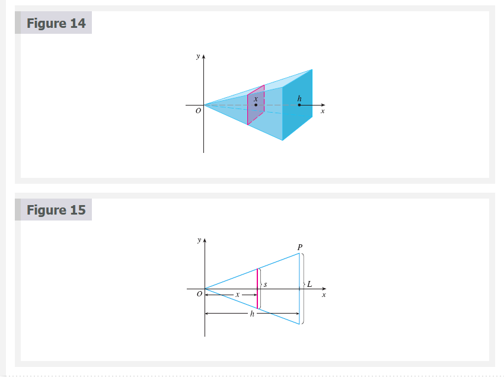

Note We didn't need to place the vertex of the pyramid at the origin in Example
8. We did so merely to make the equations simple. If, instead, we had placed the
center of the base at the origin and the vertex on the positive $y$-axis, as in
Figure 16, you can verify that we would have obtained the integral

$$
V = \int_{0}^{h} \frac{L^{2}}{h^{2}}(h - y)^{2}\;dy = \frac{L^{2}h}{3}
$$

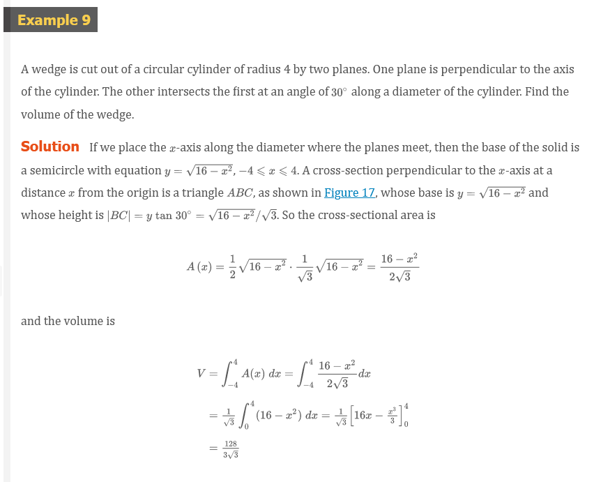
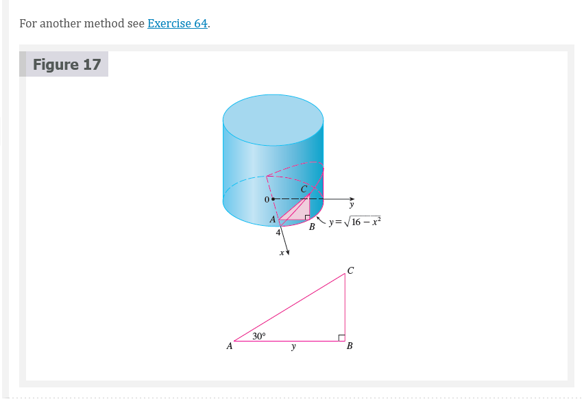

## Video Lectures

- [📺 Disc method around x-axis](https://www.khanacademy.org/math/ap-calculus-ab/ab-applications-of-integration-new/ab-8-9/v/disk-method-around-x-axis)
- [📺 Generalizing disc method around x-axis](https://www.khanacademy.org/math/ap-calculus-ab/ab-applications-of-integration-new/ab-8-9/v/generalizing-disc-method-around-x-axis)
- [📺 Disc method around y-axis](https://www.khanacademy.org/math/ap-calculus-ab/ab-applications-of-integration-new/ab-8-9/v/disc-method-around-y-axis)
- [📺 Solid of revolution between two functions (leading up to the washer method)](https://www.khanacademy.org/math/ap-calculus-ab/ab-applications-of-integration-new/ab-8-11/v/disc-method-washer-method-for-rotation-around-x-axis)
- [📺 Generalizing the washer method](https://www.khanacademy.org/math/ap-calculus-ab/ab-applications-of-integration-new/ab-8-11/v/generalizing-the-washer-method)
- [📺 Washer method rotating around horizontal line (not x-axis), part 1](https://www.khanacademy.org/math/ap-calculus-ab/ab-applications-of-integration-new/ab-8-12/v/washer-method-rotating-around-non-axis)
- [📺 Washer method rotating around horizontal line (not x-axis), part 2](https://www.khanacademy.org/math/ap-calculus-ab/ab-applications-of-integration-new/ab-8-12/v/part-2-of-washer-for-not-axis-rotation)
- [📺 Washer method rotating around vertical line (not y-axis), part 1](https://www.khanacademy.org/math/ap-calculus-ab/ab-applications-of-integration-new/ab-8-12/v/washer-or-ring-method-for-vertical-line-rotation)
- [📺 Washer method rotating around vertical line (not y-axis), part 2](https://www.khanacademy.org/math/ap-calculus-ab/ab-applications-of-integration-new/ab-8-12/v/evaluating-integral-for-washer-method-around-vertical-line)

 

# Resources

Textbook

+ [📄 Cengage e-Textbook: Calculus Early Transcendentals, Eighth Edition, Stewart](https://webassign.com/)

